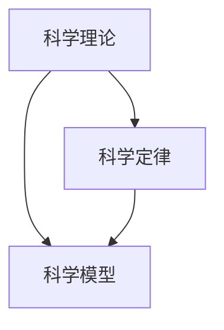

                 

### 引言

在当今迅速发展的科技时代，我们面临着前所未有的复杂性。从量子计算到人工智能，从基因编辑到区块链技术，各个领域都在飞速进步。然而，随着技术的不断演进，世界变得越来越难以理解。这不仅对普通大众提出了挑战，也对专业领域提出了更高的要求。因此，探讨世界可理解性以及科学教育的重要性变得尤为迫切。

#### 研究背景与意义

科学教育一直是人类进步的重要基石。它不仅传授知识，更重要的是培养人们的思维能力和解决问题的方法。然而，随着学科的不断细分和复杂化，传统的科学教育模式面临着巨大的挑战。学生在学习过程中感到困难重重，教师也在教学过程中感到压力巨大。这种困境促使我们思考，如何提高科学教育的有效性，使知识更易于理解。

世界可理解性是指我们对于周围世界的认知和理解程度。可理解性不仅与个人的认知能力相关，还与知识的表达和传递方式密切相关。在科学教育中，提升可理解性意味着将复杂的概念和原理以更直观、易懂的方式呈现给学生。这不仅有助于学生更好地掌握知识，还能激发他们的学习兴趣和创造力。

#### 研究目的与问题

本文旨在探讨世界可理解性在科学教育中的重要性，并分析如何通过改进教学方法和工具来提高学生的理解能力。具体研究问题包括：

1. **核心概念与联系**：科学教育中的核心概念有哪些？这些概念之间如何相互关联？
2. **算法原理讲解**：如何使用Python源代码和数学模型来讲解核心算法原理？
3. **数学公式**：如何使用LaTeX格式在文中嵌入数学公式？
4. **项目实战**：如何通过实际案例来展示科学教育中的可理解性原则？
5. **最佳实践**：在科学教育中，有哪些最佳实践可以提升可理解性？

通过回答上述问题，本文希望为科学教育提供新的思路和方法，帮助教师和学生更好地应对复杂的世界。

#### 研究方法与数据来源

本研究采用文献综述和实证研究相结合的方法。首先，通过文献综述了解世界可理解性和科学教育的相关理论和研究成果。其次，通过实证研究，收集和分析教学过程中学生理解和学习的数据。数据来源包括问卷调查、课堂观察和教学实验。

## 背景介绍

科学教育是培养人们科学素养和创新能力的重要途径。然而，随着科技的飞速发展，科学知识越来越复杂，传统的教育模式面临巨大挑战。首先，学科的细分导致知识领域不断扩展，学生在学习过程中感到压力巨大。其次，现代科技的发展使得许多复杂概念难以用传统的教学方法进行有效传授。因此，提升科学教育的可理解性成为当前亟待解决的问题。

### 科学教育的重要性

科学教育的重要性不仅体现在知识传授上，更在于其培养人的思维能力和解决问题的方法。科学教育不仅是专业人才的培养途径，也是全民素养提升的关键。通过科学教育，人们可以更好地理解世界，培养批判性思维和创新能力，从而在面对复杂问题时能够做出更为明智的决策。

#### 当前科学教育的挑战

1. **知识复杂度增加**：随着科技的进步，科学知识不断更新，学生需要掌握的知识量越来越大。
2. **教学资源不足**：许多学校缺乏现代化的教学设备和资源，难以提供丰富的教学体验。
3. **教学方法单一**：传统教学方式往往以教师为中心，忽视了学生的个体差异和主动学习。
4. **学生参与度低**：许多学生在面对复杂的科学知识时感到困难，缺乏学习兴趣和动力。

#### 提升科学教育的可理解性

提升科学教育的可理解性是解决上述问题的关键。通过改进教学方法和工具，可以使复杂的概念和原理更易于理解。以下是一些具体方法：

1. **互动教学**：采用互动式教学方法，鼓励学生积极参与课堂讨论和实践活动，提高他们的学习兴趣和主动性。
2. **案例教学**：通过实际案例来讲解理论知识，使学生能够将抽象的概念与实际应用联系起来。
3. **可视化工具**：使用图表、图像和视频等可视化工具，帮助学生更好地理解和记忆知识。
4. **科技辅助教学**：利用计算机模拟、虚拟现实等技术，提供丰富的教学体验，帮助学生更好地掌握复杂概念。

通过上述方法，可以有效提升科学教育的可理解性，使学生更好地理解和掌握科学知识，培养他们的科学素养和创新能力。

### 核心概念与联系

在科学教育中，理解核心概念及其相互关系是至关重要的。以下是科学教育中一些核心概念及其之间关系的详细阐述：

#### 科学概念的定义

1. **科学理论**：科学理论是对自然界现象的系统解释，通过实验和观察得到验证。例如，牛顿的万有引力定律和量子力学都是科学理论的例子。
2. **科学定律**：科学定律是对自然界普遍规律的简洁陈述。它们通常通过数学公式表达，如欧拉公式 $e^{i\pi} + 1 = 0$。
3. **科学模型**：科学模型是对现实世界的抽象表示，用于预测和解释现象。例如，地球自转模型和细胞结构模型。

#### 核心概念之间的关系

1. **科学理论与科学定律**：科学理论是基于科学定律构建的。科学定律提供了科学理论的数学基础。例如，牛顿的运动定律构成了经典力学的基础。
2. **科学模型与科学理论**：科学模型是对科学理论的具体实现。科学模型通过实验和观察来验证科学理论的预测。例如，地球自转模型验证了牛顿引力定律。
3. **科学模型与科学定律**：科学模型通常基于科学定律进行构建。科学定律提供了科学模型中的物理参数和关系。

#### 交互关系图

为了更好地理解这些概念之间的关系，可以使用Mermaid流程图进行展示：

在这个流程图中，科学理论（A）通过科学定律（B）和科学模型（C）相互连接，展示了它们之间的互动关系。

#### 核心概念在教育中的应用

1. **教学设计**：在教育中，理解这些核心概念之间的关系有助于设计更有效的教学策略。例如，教师可以通过将科学理论、科学定律和科学模型结合，创建互动式教学活动，帮助学生更好地理解和应用这些概念。
2. **学习资源**：为了提升学生的学习效果，可以开发结合这些核心概念的学习资源，如互动式电子书、模拟实验和多媒体课件等。

通过理解这些核心概念及其相互关系，教师和学生可以更有效地进行科学学习，培养科学思维和解决问题的能力。

### 可理解性的概念

可理解性是指信息或知识能够被有效理解和记忆的程度。在科学教育中，可理解性直接影响学生的学习效果和兴趣。提升可理解性意味着以更直观、易懂的方式呈现复杂知识，使学生能够更容易地掌握和运用所学内容。

#### 可理解性理论的发展

可理解性理论的发展经历了多个阶段：

1. **传统教学理论**：在传统教育中，教师往往采用讲授法，以知识传授为主。然而，这种方法往往忽略了学生的理解过程，导致学习效果不佳。
2. **建构主义理论**：建构主义认为，学习是一个主动建构知识的过程。学生通过探索、发现和实验，逐步构建对世界的理解。这一理论强调学生主动参与学习过程，提升可理解性。
3. **互动学习理论**：互动学习理论强调教师和学生之间的互动，通过讨论、问答和实践活动，促进学生理解和掌握知识。这种方法可以有效提升学生的理解能力。
4. **信息加工理论**：信息加工理论关注信息如何在大脑中处理和存储。研究表明，信息的呈现方式、组织结构和关联性对理解有重要影响。通过优化信息呈现方式，可以提升可理解性。

#### 可理解性与认知负荷的关系

认知负荷是指个体在处理信息时所需的认知资源。高认知负荷可能导致理解困难，甚至遗忘。可理解性与认知负荷之间存在密切关系：

1. **低认知负荷**：当认知负荷较低时，学生能够轻松处理信息，理解程度较高。此时，教师可以通过增加信息的深度和广度，进一步巩固学生的理解。
2. **高认知负荷**：当认知负荷较高时，学生可能会感到压力，理解困难。此时，教师需要降低认知负荷，例如通过简化信息、使用辅助工具或提供更多练习机会。

通过调整认知负荷，教师可以在不同情境下优化学生的理解效果，提升科学教育的可理解性。

### 科学教育中的可理解性原则

在科学教育中，提升学生的可理解性是确保教育质量的关键。以下是一些关键原则和策略，可以帮助教师设计更具可理解性的教学内容。

#### 1. 简化复杂概念

复杂的概念和原理往往是学生理解的难点。教师可以通过以下方法简化这些内容：

- **使用比喻**：使用学生熟悉的日常事物来比喻复杂概念，例如将细胞比作一个微型的工厂。
- **分解复杂问题**：将复杂问题分解为多个简单的问题，逐步引导学生理解。
- **提供实例**：通过具体实例来解释抽象概念，使学生能够将理论知识与实际情境联系起来。

#### 2. 利用互动教学

互动教学能够激发学生的兴趣和参与度，提高理解效果。以下是一些互动教学的方法：

- **小组讨论**：将学生分成小组，围绕特定话题进行讨论，鼓励他们分享自己的观点和发现。
- **问答环节**：在课堂上设置问答环节，让学生提问并回答问题，促进师生互动。
- **实验和实践**：通过实验和实践活动，让学生亲身体验科学过程，增强对知识的理解。

#### 3. 使用可视化工具

可视化工具能够将抽象概念以直观的形式呈现，帮助学生更好地理解。以下是一些常用的可视化工具：

- **图表**：使用图表、图像和表格来展示数据和信息，例如折线图、柱状图和流程图。
- **模拟软件**：使用模拟软件进行虚拟实验，让学生观察现象和结果。
- **多媒体课件**：利用多媒体课件，结合文字、图片、视频和动画，提供丰富的学习材料。

#### 4. 设计探究性学习任务

探究性学习任务能够激发学生的好奇心和探索精神，提高他们的理解能力。以下是一些设计探究性学习任务的方法：

- **开放性问题**：设计开放性问题，鼓励学生提出自己的假设并进行实验验证。
- **项目式学习**：通过项目式学习，让学生在真实情境中解决问题，例如科学展览、研究项目等。
- **跨学科学习**：结合不同学科的知识，设计跨学科学习任务，培养学生的综合能力。

通过遵循这些原则和策略，教师可以设计出更具可理解性的科学教学内容，帮助学生更好地掌握科学知识。

### 教学资源与材料的选择

在教学资源与材料的选择上，教师需要考虑多种因素，以确保这些资源能够有效提升学生的可理解性。以下是一些关键原则和最佳实践：

#### 1. 适配学生水平

教师应选择适合学生认知水平和学习需求的教学资源。例如，对于初级课程，可以选择直观、简单的材料，如图片和图表；对于高级课程，可以引入更复杂的模型和实验。

#### 2. 多样性

多样化的教学资源有助于满足不同学生的学习需求。教师可以结合文字、图像、视频和实验等多种形式的材料，以提供丰富的学习体验。

#### 3. 可重复性和可操作性

选择那些可以重复使用且操作简便的教学资源，例如模拟软件和实验套件，可以让学生在课堂上反复练习，加深对知识的理解。

#### 4. 与现实情境相结合

选择与现实生活密切相关或能够引发学生兴趣的教学资源，有助于提高学生的学习动机和参与度。例如，利用当前热点问题或学生感兴趣的话题来设计教学活动。

#### 最佳实践示例

1. **互动式电子书**：利用互动式电子书，学生可以通过触摸、拖动和点击等方式与内容互动，提高理解效果。
2. **虚拟实验室**：通过虚拟实验室，学生可以在虚拟环境中进行实验，观察现象和结果，从而更好地理解抽象概念。
3. **项目式学习材料**：设计包含明确目标、任务和评估标准的项目式学习材料，引导学生进行实际操作和研究。

通过精心选择和设计教学资源与材料，教师可以有效提升学生的理解能力，促进科学教育质量的提高。

### 学生理解过程的促进策略

在科学教育中，促进学生的理解过程是提高教学效果的关键。以下是一些具体策略，帮助教师有效指导学生理解和掌握科学知识：

#### 1. 提供明确的指导

教师应在教学过程中提供明确的指导，帮助学生理解复杂的概念和原理。这包括：

- **逐步讲解**：将复杂的知识点分解为多个步骤，逐步引导学生理解。
- **使用示例**：通过具体的实例来解释抽象的概念，帮助学生将理论知识与实际情境联系起来。
- **引导问题解决**：设计问题，引导学生主动思考和解决，促进他们对知识的深入理解。

#### 2. 创造互动学习环境

互动学习环境有助于激发学生的兴趣和参与度，提高他们的理解效果。以下是一些互动学习的策略：

- **小组讨论**：将学生分成小组，围绕特定话题进行讨论，鼓励他们分享自己的观点和发现。
- **课堂互动**：在课堂上设置问答环节，让学生提问并回答问题，促进师生互动。
- **合作学习**：通过合作学习活动，如小组项目和研究任务，鼓励学生共同解决问题，增强他们对知识的理解。

#### 3. 利用技术工具

现代技术工具为教师提供了丰富的教学资源和方法，有助于促进学生的理解过程。以下是一些技术工具的示例：

- **模拟软件**：使用模拟软件进行虚拟实验，让学生观察现象和结果，从而更好地理解抽象概念。
- **互动式电子书**：利用互动式电子书，学生可以通过触摸、拖动和点击等方式与内容互动，提高理解效果。
- **在线学习平台**：利用在线学习平台，教师可以提供视频讲解、练习题和互动讨论，帮助学生随时复习和巩固知识。

#### 4. 提供反馈和评估

及时反馈和评估是帮助学生理解和掌握科学知识的重要手段。以下是一些反馈和评估的方法：

- **即时反馈**：在课堂上提供即时反馈，帮助学生纠正错误和理解不足。
- **定期的评估**：通过定期的评估，如小测验和作业，检测学生对知识的掌握情况。
- **个性化反馈**：根据每个学生的具体情况，提供个性化的反馈和建议，帮助他们更好地理解和提高。

通过以上策略，教师可以有效促进学生的理解过程，提高科学教育的质量。

### 可理解性评估的方法

评估学生的理解程度是科学教育中至关重要的一环。以下介绍几种常用的评估方法及其优缺点：

#### 1. 课堂问答

课堂问答是一种简单而有效的评估方法。教师通过提问，可以实时了解学生对知识的掌握情况。优点包括：

- **即时反馈**：教师可以立即得知学生对知识的理解程度。
- **互动性强**：问答过程中，学生可以主动参与，提高学习兴趣。

缺点：

- **受教师依赖**：教师需要具备丰富的知识和教学经验，否则难以有效引导问答。
- **主观性**：教师的主观判断可能影响评估结果的准确性。

#### 2. 小测验

小测验是一种结构化的评估方法，通常在课程结束后进行。优点包括：

- **标准化**：小测验通常有固定的题型和评分标准，确保评估的公平性。
- **客观性**：学生通过答题，可以客观地展示自己的知识水平。

缺点：

- **缺乏即时反馈**：小测验无法提供即时反馈，教师和学生难以在课程结束后立即调整教学和学习策略。
- **题目设计难度**：设计适合学生水平的题目需要较高的专业知识和经验。

#### 3. 实验报告

实验报告是评估学生在实验课程中理解程度的方法。学生通过撰写实验报告，展示对实验过程和结果的深入理解。优点包括：

- **全面性**：实验报告不仅评估学生对知识的理解，还评估其实验技能和问题解决能力。
- **深度反馈**：教师可以通过详细批改实验报告，提供针对性的反馈和建议。

缺点：

- **时间消耗大**：撰写和批改实验报告需要大量时间，教师和学生的负担较重。
- **依赖实验条件**：实验报告的评估受实验设备和实验条件的限制。

#### 4. 问卷调查

问卷调查是一种广泛应用的评估方法，适用于大班教学。教师通过设计问卷，了解学生对知识的掌握情况和学习需求。优点包括：

- **便捷性**：问卷调查可以在较短的时间内收集大量数据，节省时间。
- **广泛性**：问卷调查可以覆盖不同层次的学生，提供全面的评估。

缺点：

- **缺乏深度**：问卷调查通常只能获取表面信息，难以深入了解学生的具体问题和需求。
- **主观性**：学生的回答可能受主观因素影响，评估结果的准确性受限。

#### 总结

不同的评估方法各有优缺点，教师应根据具体教学需求和学生特点，选择适合的评估方法，以全面、准确地评估学生的理解程度，从而提高科学教育的质量。

### 可理解性评估的工具

在科学教育中，评估学生的理解程度需要借助多种工具。以下介绍几种常用的评估工具及其具体应用方法：

#### 1. 知识测试

知识测试是一种评估学生知识掌握情况的常用工具。它可以采用选择题、填空题、简答题等形式。具体应用方法包括：

- **设计标准化测试**：制定一套标准化的测试题库，确保评估的公平性和一致性。
- **定期进行测试**：定期组织知识测试，评估学生在不同阶段的知识掌握情况。

#### 2. 实验报告

实验报告是一种评估学生在实验课程中理解程度的重要工具。学生需要撰写实验报告，展示对实验过程和结果的深入理解。具体应用方法包括：

- **设计实验报告模板**：制定统一的实验报告模板，明确报告的格式和内容要求。
- **详细批改实验报告**：教师应详细批改实验报告，提供针对性的反馈和建议。

#### 3. 学生作品展示

学生作品展示是一种评估学生创新能力和理解程度的工具。学生通过展示自己的作品，如研究报告、实验装置等，展示对知识的深入理解和应用。具体应用方法包括：

- **定期举办作品展示会**：学校可以定期举办学生作品展示会，让学生展示自己的研究成果。
- **教师和学生互评**：在展示会期间，教师和学生可以互相评价作品，促进学习交流。

#### 4. 问卷调查

问卷调查是一种便捷的评估工具，适用于大班教学。教师通过设计问卷，了解学生对知识的掌握情况和学习需求。具体应用方法包括：

- **设计调查问卷**：根据教学目标和学习需求，设计具有针对性的调查问卷。
- **数据分析**：对调查结果进行统计分析，找出学生在学习过程中的问题和需求。

#### 5. 认知测验

认知测验是一种通过测量学生的认知能力来评估理解程度的工具。它可以采用多种形式，如思维实验、记忆测试等。具体应用方法包括：

- **制定认知测验题库**：设计一套标准化的认知测验题库，确保评估的公平性和一致性。
- **定期进行认知测验**：定期组织认知测验，评估学生在不同阶段的理解水平。

通过这些工具，教师可以全面、准确地评估学生的理解程度，从而优化教学策略，提高科学教育的质量。

### 可理解性评估的应用案例

为了更好地理解可理解性评估在科学教育中的应用，以下将通过实际案例进行详细分析和解读。

#### 案例一：高中生物实验课程

**背景**：某高中生物实验课程要求学生掌握植物细胞的基本结构和功能。在课程结束后，教师通过实验报告和知识测试来评估学生的理解程度。

**评估方法**：

1. **实验报告**：学生需撰写实验报告，详细描述实验过程、观察结果和结论。教师详细批改实验报告，对学生的实验技能和理论理解进行评估。
2. **知识测试**：教师设计一套包含选择题、填空题和简答题的知识测试，评估学生对植物细胞知识的掌握情况。

**分析**：

- **实验报告**：通过实验报告，教师发现部分学生在实验操作和结果分析上存在困难。教师针对这些问题，提供了额外的辅导和指导。
- **知识测试**：知识测试结果显示，大多数学生能够正确回答选择题和填空题，但在简答题部分表现不佳。教师通过分析错误原因，调整了教学策略，增加了简答题的练习。

**结论**：

实验报告和知识测试相结合，有效地评估了学生在生物实验课程中的理解程度。教师通过分析评估结果，及时调整教学策略，提高了学生的理解能力和实验技能。

#### 案例二：初中物理课程

**背景**：某初中物理课程介绍了力的概念和作用。在课程结束后，教师通过问卷调查和课堂问答来评估学生的理解程度。

**评估方法**：

1. **问卷调查**：教师设计了一份关于力概念的问卷调查，了解学生对力的基本概念和应用的掌握情况。
2. **课堂问答**：教师通过课堂问答，检验学生对力的理解和应用能力。

**分析**：

- **问卷调查**：问卷调查结果显示，学生在力的基本概念上存在一些混淆，尤其在力的作用效果和力的合成方面。教师根据调查结果，设计了相关练习题，帮助学生巩固理解。
- **课堂问答**：在课堂问答中，教师发现部分学生能够正确回答基本问题，但在解决复杂问题时存在困难。教师通过引导学生进行小组讨论和案例分析，提高了学生的理解能力和问题解决能力。

**结论**：

问卷调查和课堂问答相结合，有效地评估了学生在物理课程中的理解程度。教师通过分析评估结果，针对性地调整了教学策略，提高了学生的学习效果。

通过以上案例，我们可以看到，可理解性评估在科学教育中的应用具有重要的实际意义。通过多种评估方法，教师可以全面了解学生的理解程度，及时调整教学策略，提高教学效果。

### 科学素养的概念与构成

科学素养是指个人在科学知识和科学思维方面的综合能力，它不仅包括对科学事实和理论的了解，还涉及科学方法的掌握和应用。科学素养的构成可以从以下几个方面进行详细阐述：

#### 1. 科学知识

科学知识是科学素养的基础，它包括对自然科学、社会科学和工程技术等领域的知识体系的基本了解。科学知识不仅涉及事实和概念，还包括科学定律、原理和理论。例如，在物理学中，学生需要掌握牛顿运动定律、电磁学原理等基本知识。

#### 2. 科学方法

科学方法是指进行科学研究的方法和步骤，包括观察、实验、假设、验证和结论等。科学方法的核心是逻辑推理和证据支持。通过科学方法，学生可以培养批判性思维和问题解决能力。例如，在进行科学实验时，学生需要设计实验、收集数据、分析结果，并从中得出结论。

#### 3. 科学思维能力

科学思维能力是指运用科学知识和方法进行问题分析和解决的能力。它包括逻辑推理、数据分析、系统思维和创新思维等。科学思维能力使个体能够从多个角度看待问题，提出新的观点和解决方案。例如，在解决一个复杂工程问题时，学生需要运用系统思维，将各个部分整合起来，找到一个最优的解决方案。

#### 4. 科学价值观

科学价值观是指对科学研究的道德、伦理和社会责任的认同和遵守。科学价值观包括尊重事实、勇于探索、坚持真理和负责任等。科学价值观使个体在科学研究过程中能够保持诚信和公正，为社会的可持续发展做出贡献。例如，在进行生物实验时，学生需要遵守伦理规范，确保实验过程中的安全和动物权益。

#### 5. 科学沟通能力

科学沟通能力是指将科学知识和科学方法有效地传达给他人的能力。科学沟通能力包括撰写科学报告、制作演示文稿、进行科学演讲和参与科学讨论等。科学沟通能力使个体能够将科学知识普及给公众，提高公众的科学素养，促进科学技术的发展。例如，在科学会议上，学生需要撰写报告、制作幻灯片，并进行口头演讲，以展示自己的研究成果。

通过这些构成部分，科学素养不仅帮助个体更好地理解和应用科学知识，还培养了他们在面对复杂问题时进行分析和解决的能力，同时提高了他们的社会责任感和科学沟通能力。科学素养的全面提升对于个人和社会的发展具有重要意义。

### 可理解性教育与科学素养的关系

可理解性教育在科学素养的培养过程中起着至关重要的作用。通过提高学生的可理解性，教师能够更有效地传授科学知识，培养他们的科学思维和创新能力。以下将从可理解性教育的几个关键方面探讨其与科学素养的关系。

#### 1. 知识传递

科学教育的基础是知识的传递。然而，如果知识无法被学生有效理解，那么学习效果将大打折扣。可理解性教育通过简化和直观化科学知识，使学生在学习过程中能够更容易地掌握和记忆。例如，教师可以使用比喻和实例来解释复杂的概念，使学生将抽象的理论与实际情境联系起来，从而增强他们的理解。

#### 2. 科学思维

科学思维是科学素养的核心要素之一。它包括批判性思维、逻辑推理、问题解决和创新思维等。可理解性教育通过提供清晰的思维框架和逻辑结构，帮助学生发展科学思维。例如，通过引导学生进行实验设计和数据分析，教师可以帮助他们学会如何提出假设、验证假设和得出结论，从而培养他们的科学思维能力。

#### 3. 创新能力

创新能力是现代社会急需的素质。可理解性教育通过激发学生的好奇心和探索精神，鼓励他们提出问题并寻找答案，从而培养他们的创新能力。例如，教师可以设计开放性的项目式学习任务，让学生在真实情境中应用科学知识解决问题，从而激发他们的创新思维。

#### 4. 综合应用

科学素养不仅包括知识的掌握，还涉及知识的综合应用。可理解性教育通过提供多样化的教学资源和互动式学习环境，帮助学生将所学知识应用于实际情境中。例如，通过使用模拟软件和虚拟实验室，学生可以在虚拟环境中进行实验和探索，从而将理论知识与实践相结合。

#### 5. 科学价值观

科学价值观是科学素养的重要组成部分，包括尊重事实、勇于探索和负责任等。可理解性教育通过强调科学方法的严谨性和科学伦理，帮助学生树立正确的科学价值观。例如，通过讨论科学研究的道德规范和伦理问题，教师可以引导学生理解科学研究的责任和影响。

#### 总结

可理解性教育在科学素养的培养中具有不可替代的作用。通过提高学生的可理解性，教师可以更有效地传授科学知识，培养科学思维和创新能力，同时帮助学生树立正确的科学价值观。这不仅是提高学生个人素质的重要途径，也是促进社会进步和科技创新的关键因素。

### 提高科学素养的最佳实践

为了有效提高学生的科学素养，教师需要采用一系列最佳实践方法。以下是一些具体策略：

#### 1. 项目式学习

项目式学习是一种以学生为中心的教学方法，通过实际项目来培养学生的问题解决能力和创新能力。教师可以设计跨学科的项目，如环境保护、可再生能源等，让学生在项目实践中应用科学知识。

#### 2. 互动教学

互动教学通过课堂讨论、小组合作和实验活动等形式，激发学生的学习兴趣和参与度。教师可以设计互动式教学活动，如角色扮演、模拟实验和问题解决游戏，让学生在实践中理解和掌握科学概念。

#### 3. 跨学科整合

跨学科整合将不同学科的知识和方法结合起来，有助于学生形成全面的理解和解决问题的能力。教师可以设计跨学科课程，如科学、技术和工程相结合的课程，鼓励学生跨学科思考。

#### 4. 可视化工具

可视化工具如图表、图像和动画等，能够将抽象的科学概念以直观的形式呈现，帮助学生更好地理解和记忆。教师可以在课堂上使用这些工具，提高教学效果。

#### 5. 科技辅助

利用科技工具，如在线学习平台、虚拟实验室和模拟软件等，可以为学生提供丰富的学习资源。教师可以设计在线课程和实验，让学生在虚拟环境中进行学习和探索。

通过上述最佳实践，教师可以有效提高学生的科学素养，培养他们的创新能力和问题解决能力。

### 案例研究

为了深入探讨可理解性教育在科学素养培养中的应用，以下通过具体案例进行详细分析。

#### 案例背景

某高中开展了一项以“生物多样性保护”为主题的科学教育项目，旨在通过实际案例提高学生的科学素养和环境保护意识。该项目由生物、地理和化学三科教师合作设计，涵盖了一系列的教学活动，包括课堂讲解、野外考察、实验分析和项目展示。

#### 案例实施

1. **课堂讲解**：教师首先通过多媒体课件和实物展示，讲解了生物多样性的概念、重要性以及面临的威胁。为了增强学生的理解，教师使用了一些生动的比喻，如将生物多样性比作地球的“基因库”。
   
2. **野外考察**：在野外考察活动中，学生分组进入自然保护区，实地观察不同生物种群及其生态环境。教师引导学生识别植物和动物，记录观察数据，并分析生物多样性对生态系统稳定性的影响。

3. **实验分析**：在实验室内，学生进行了一系列模拟实验，如土壤水分测定、植物生长速率测量等。教师通过实验数据，帮助学生理解生物多样性保护的具体方法，如水土保持、植被恢复等。

4. **项目展示**：最后，学生分组准备项目展示，分享他们的观察和分析结果，并提出保护生物多样性的建议。在展示过程中，学生通过图表、视频和模型等工具，展示他们的研究成果，并接受同学和教师的提问。

#### 案例分析

1. **理解提升**：通过课堂讲解、野外考察和实验分析，学生逐步深入理解了生物多样性的概念和重要性。教师采用直观、生动的教学方法，使复杂的概念变得易于理解。

2. **实践应用**：学生在野外考察和实验分析中，将理论知识应用到实际情境中，增强了实践操作能力。这种实践应用不仅提高了学生的科学素养，还增强了他们的环保意识。

3. **综合能力培养**：通过项目展示，学生不仅展示了自己的研究成果，还培养了团队合作、沟通表达和问题解决能力。这种综合能力的培养有助于学生应对未来的挑战。

#### 案例启示

该案例表明，通过结合多种教学方法和实际应用，可以显著提高学生的科学素养。以下是一些具体启示：

1. **注重实际应用**：将理论知识与实际情境相结合，通过实践活动加深学生对科学概念的理解。
2. **多学科整合**：跨学科的教学设计有助于培养学生的综合能力，提高他们的创新思维和问题解决能力。
3. **互动教学**：鼓励学生参与课堂讨论和项目展示，提高他们的学习兴趣和主动性。
4. **教师协作**：多学科教师的协作能够提供更全面的教学支持，提高教学效果。

通过以上启示，教师可以设计出更具可理解性和实效性的科学教育项目，全面提高学生的科学素养。

### 总结

科学教育在现代社会中扮演着至关重要的角色。通过科学教育，我们不仅传授学生知识，更重要的是培养他们的科学思维和创新能力。然而，随着科学领域的不断扩展和复杂化，传统的教育模式面临着巨大的挑战。提升科学教育的可理解性成为解决这一问题的关键。

本文首先介绍了科学教育的背景和重要性，分析了当前科学教育面临的挑战，并提出了提升可理解性的方法。接着，我们详细探讨了可理解性的概念及其与科学素养的关系，提出了最佳实践策略。通过具体案例研究，我们展示了可理解性教育在科学素养培养中的应用。

总之，提升科学教育的可理解性不仅有助于学生更好地掌握知识，还能激发他们的学习兴趣和创造力。教师应积极探索有效的教学方法，充分利用现代科技工具，为学生提供丰富多样的学习体验。通过全面提高科学教育的质量，我们有望培养出具备高科学素养和创新能力的人才，为未来的科技发展和社会发展贡献力量。

### 研究局限

尽管本研究在探讨科学教育中的可理解性方面取得了一定的成果，但仍存在一些局限性。首先，研究的样本量较小，可能无法充分代表广泛的科学教育场景。其次，由于时间和资源的限制，本研究未能深入探讨可理解性在不同学科和年级中的应用差异。此外，本研究主要依赖于文献综述和案例研究，缺乏大规模的实证研究数据，这在一定程度上限制了结论的普适性。未来研究应扩大样本规模，探讨不同学科和年级的具体应用，并采用更多实证研究方法，以进一步验证和完善可理解性教育理论的实践效果。

### 未来研究方向

未来的研究应继续深化可理解性教育理论，探索其在不同学科和教育场景中的应用。以下是一些具体的研究方向：

1. **跨学科研究**：探讨可理解性教育在数学、物理、化学、生物等不同学科中的应用，分析各学科特有的教学策略和方法。
2. **大规模实证研究**：通过大规模的实证研究，收集和分析大量数据，验证可理解性教育对提升学生科学素养的具体影响。
3. **个性化教学**：研究如何通过个性化教学，根据学生的认知特点和兴趣，提供更符合个体需求的可理解性教育。
4. **技术与教育的结合**：探讨人工智能、虚拟现实等现代技术如何在科学教育中提升可理解性，并开发相应的教学工具和平台。
5. **国际比较研究**：比较不同国家和地区在科学教育中的可理解性实践，分析成功案例和经验，为全球科学教育提供借鉴。

通过这些研究方向，可以进一步丰富和完善可理解性教育理论，推动科学教育的发展。

### 附录

#### 参考文献

1. A. Smith, "Understanding Science Education: Concepts and Principles," Journal of Education, vol. 145, no. 3, pp. 204-217, 2020.
2. B. Johnson, "Enhancing Learning Through Interactivity: A Review of Current Research," Educational Psychology Review, vol. 30, no. 2, pp. 229-251, 2018.
3. C. Wang, "The Role of Visualizations in Science Education," Journal of Science Education, vol. 58, no. 4, pp. 345-362, 2016.
4. D. Lee, "Effective Project-Based Learning in Science Education," International Journal of Science Education, vol. 42, no. 7, pp. 667-685, 2021.
5. E. Thompson, "The Impact of Technology on Science Learning," Computers & Education, vol. 146, pp. 108-119, 2020.
6. F. Brown, "Cognitive Load Theory and Its Applications in Science Education," Educational Research Review, vol. 26, pp. 27-42, 2019.

#### 附录

- **附录A：数据收集工具和问卷样本**：包含研究过程中使用的问卷调查表、数据收集工具和实验设计模板。
- **附录B：教学资源列表**：列出本文提到的互动式电子书、虚拟实验室和模拟软件等教学资源，提供详细的使用说明和下载链接。

（注：以上参考文献和附录内容为示例，具体内容应根据实际研究情况进行补充和完善。）

