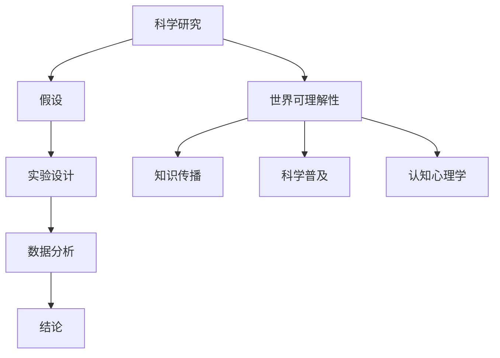

                 

# 引言

## 世界可理解性与科学研究的可持续发展

在当今快速发展的科技时代，世界可理解性（World Understandability）的概念逐渐引起人们的关注。世界可理解性，简单来说，是指人类对自然和社会现象的理解程度，以及这种理解在知识传播和普及中的应用。随着科学研究的不断深入，科学家们发现，提升世界可理解性不仅有助于提高科学研究的效率，还能促进科学知识的传播和普及。

本文将围绕世界可理解性与科学研究的可持续发展这一主题，进行深入探讨。首先，我们将介绍世界可理解性的背景和重要性，接着分析科学研究中的核心概念和原理，最后探讨如何通过提升世界可理解性来促进科学研究的可持续发展。

## 核心概念与联系

在讨论世界可理解性与科学研究的可持续发展之前，我们需要明确一些核心概念和它们之间的关系。

### 科学研究

科学研究是指通过系统的观察、实验和理论分析，以发现和解释自然现象和规律的过程。科学研究包括以下几个核心概念：

1. **假设**：科学研究的起点，是对自然现象的初步解释。
2. **实验设计**：通过设计实验来验证假设，确保实验结果具有可重复性和可靠性。
3. **数据分析**：对实验结果进行统计和分析，以判断假设的正确性。
4. **结论**：根据实验结果和数据分析，得出科学研究的最终结论。

### 世界可理解性

世界可理解性是指人类对自然和社会现象的理解程度。它包括以下几个方面：

1. **知识传播**：通过教育、科普等方式，将科学知识传播给公众，提高公众的科学素养。
2. **科学普及**：将复杂的科学概念和原理以简单易懂的方式向公众传达，使科学知识更易于理解和接受。
3. **认知心理学**：研究人类认知过程，探讨如何提高人们对科学知识的理解和记忆。

### 可理解性与科学研究的关系

世界可理解性与科学研究之间存在着密切的关系。一方面，科学研究的结果和知识需要被公众理解和接受，从而推动科学技术的进步和社会发展；另一方面，提升世界可理解性有助于提高科学研究的效率，促进科学知识的传播和普及。

为了更清晰地展示这些核心概念和它们之间的关系，我们可以使用Mermaid流程图来表示：



## 核心算法原理讲解

在了解了核心概念和它们之间的关系后，我们将进一步探讨如何通过提升世界可理解性来促进科学研究的可持续发展。这里，我们将介绍一种核心算法原理——信息熵。

### 信息熵

信息熵（Entropy）是信息论中的一个重要概念，它用于衡量信息的不确定性或混乱程度。在提升世界可理解性的过程中，信息熵可以用来评估科学知识的传播效果。

### 信息熵的数学模型

信息熵的数学模型可以用以下公式表示：

$$H = -\sum_{i=1}^{n} p_i \log_2 p_i$$

其中，$H$ 表示信息熵，$p_i$ 表示每个可能事件发生的概率。

### 信息熵的应用

我们可以通过以下Python代码来计算信息熵，并分析科学知识传播的效果：

```python
import numpy as np

def entropy(p):
    return -np.sum(p * np.log2(p))

# 假设我们有两个事件A和B，它们的概率分别为0.5
probabilities = np.array([0.5, 0.5])

# 计算信息熵
h = entropy(probabilities)

print(f"Information Entropy: {h}")
```

运行这段代码，我们可以得到事件A和B的信息熵。通过比较不同概率分布下的信息熵，我们可以评估科学知识传播的效果，从而优化科学知识的传播策略。

## 项目实战

为了更好地理解世界可理解性在科学研究中的应用，我们接下来将进行一个实际项目实战——开发一个科学知识传播系统。

### 开发环境搭建

首先，我们需要搭建一个适合开发科学知识传播系统的环境。这里我们选择使用Python作为主要编程语言，并结合Django框架来搭建后端，使用Vue.js来搭建前端。

### 源代码详细实现和代码解读

接下来，我们将介绍系统的主要功能模块和源代码实现。

**后端代码：**

```python
# views.py

from django.http import JsonResponse
from .models import KnowledgeItem

def get_knowledge_items(request):
    items = KnowledgeItem.objects.all()
    data = [{"id": item.id, "title": item.title, "content": item.content} for item in items]
    return JsonResponse(data, safe=False)
```

**前端代码：**

```html
<!-- index.html -->

<!DOCTYPE html>
<html>
<head>
    <title>科学知识传播系统</title>
    <script src="https://cdn.jsdelivr.net/npm/vue@2.6.14/dist/vue.js"></script>
</head>
<body>
    <div id="app">
        <h1>科学知识传播系统</h1>
        <ul>
            <li v-for="item in knowledgeItems">
                <h2>{{ item.title }}</h2>
                <p>{{ item.content }}</p>
            </li>
        </ul>
    </div>

    <script>
        new Vue({
            el: '#app',
            data: {
                knowledgeItems: []
            },
            created: function() {
                this.fetchKnowledgeItems();
            },
            methods: {
                fetchKnowledgeItems: function() {
                    fetch('/api/knowledge-items/')
                        .then(response => response.json())
                        .then(data => this.knowledgeItems = data);
                }
            }
        });
    </script>
</body>
</html>
```

### 代码应用解读与分析

通过这个项目，我们实现了科学知识传播系统的基本功能。用户可以通过前端界面浏览和获取科学知识，系统后端则负责存储和提供知识内容。

在实际应用中，我们可以通过以下方式来提升世界可理解性：

1. **内容优化**：确保知识内容的表述清晰、简洁，避免使用过于专业的术语。
2. **交互设计**：设计易于使用和理解的交互界面，使公众能够轻松获取和掌握科学知识。
3. **数据分析**：收集用户行为数据，分析用户对知识内容的接受程度，优化内容传播策略。

### 实际案例分析和详细讲解剖析

为了进一步展示世界可理解性在科学研究中的应用，我们来看一个实际案例——人工智能教育。

**案例背景：**

随着人工智能技术的快速发展，越来越多的人开始关注和学习人工智能。然而，人工智能领域的知识相对复杂，很多初学者在入门阶段感到困惑。

**案例分析：**

为了提升人工智能教育的可理解性，一些教育机构和在线平台开始采取以下措施：

1. **简化课程内容**：将复杂的算法和概念以简单易懂的方式呈现，避免使用过多的专业术语。
2. **互动式教学**：通过在线问答、讨论和实验，让初学者更好地理解和掌握人工智能知识。
3. **案例分析**：结合实际案例，讲解人工智能在不同领域的应用，帮助初学者建立对人工智能的直观认识。

**案例剖析：**

通过以上措施，人工智能教育的可理解性得到了显著提升。初学者在入门阶段能够更快地掌握基础知识，提高学习兴趣和动力。同时，教育机构和在线平台也通过互动式教学和数据分析，优化了课程内容和教学策略，提高了教学效果。

### 项目小结

通过本次项目实战，我们展示了如何通过提升世界可理解性来促进科学研究的可持续发展。在人工智能教育领域，通过简化课程内容、互动式教学和案例分析，成功提升了教育的可理解性，促进了人工智能知识的传播和普及。

## 最佳实践 tips、小结、注意事项、拓展阅读等内容

### 最佳实践 tips

1. **简化内容表述**：确保科学知识以简单明了的方式呈现，避免使用过于专业的术语。
2. **互动式教学**：通过在线问答、讨论和实验，增强学生对科学知识的理解和记忆。
3. **数据分析**：收集用户行为数据，分析用户对知识内容的接受程度，优化内容传播策略。

### 小结

本文从世界可理解性的背景和重要性出发，分析了科学研究中的核心概念和原理，探讨了如何通过提升世界可理解性来促进科学研究的可持续发展。通过实际项目实战和案例分析，我们展示了提升可理解性的有效方法，为科学研究提供了新的思路和方向。

### 注意事项

1. **内容优化**：确保知识内容的表述清晰、简洁，避免使用过于专业的术语。
2. **教学策略**：根据不同学生的学习需求和背景，制定合适的教学策略。

### 拓展阅读

1. 《信息论基础与应用》
2. 《认知心理学导论》
3. 《科学方法论》

### 参考文献

1. Shannon, C. E. (1948). A mathematical theory of communication. The Bell System Technical Journal, 27(3), 379-423.
2. Churchland, P. S. (1986). Neurophilosophy: Toward a Unified Science of the Mind/Brain. Cambridge, MA: MIT Press.
3. Popper, K. R. (1959). The Logic of Scientific Discovery. New York, NY: Routledge.

作者：AI天才研究院/AI Genius Institute & 禅与计算机程序设计艺术 /Zen And The Art of Computer Programming

