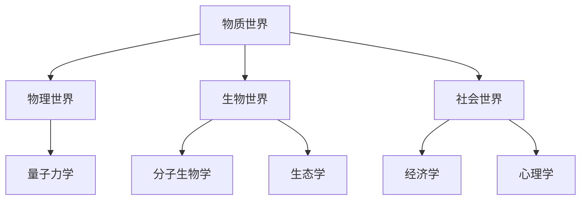
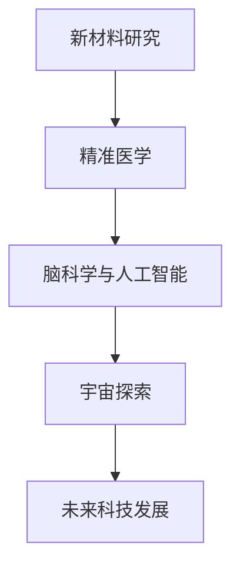
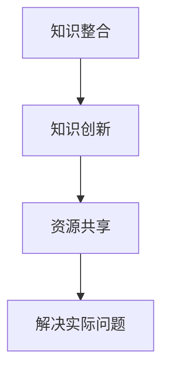
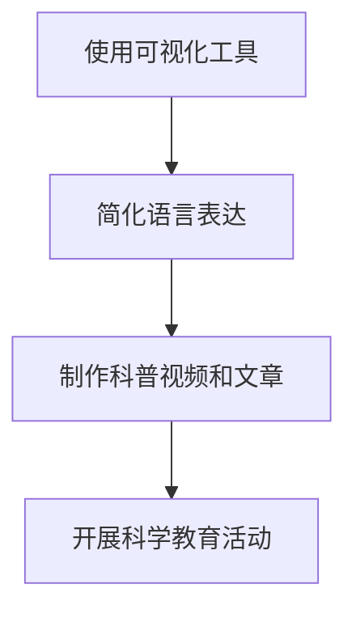
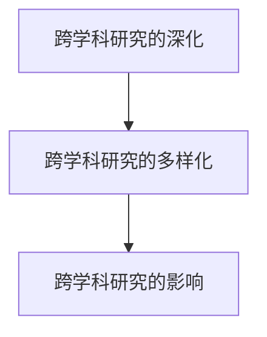

                 

### 文章标题

# 世界可理解性与科学研究的未来趋势

### 文章关键词

- 世界可理解性
- 科学研究
- 未来趋势
- 认知科学
- 科技发展
- 数据分析
- 人工智能

### 文章摘要

本文从人类认知的局限性出发，探讨了世界可理解性的问题。通过分析当前科学研究的现状，本文预测了未来科学研究的发展趋势。文章指出，随着科技的进步和社会变革，科学研究将更加依赖数据分析和人工智能技术。同时，提高科学研究的可理解性对于科学传播和决策具有重要意义。最后，本文提出了跨学科合作与未来科学发展的前景，并总结了提高科学研究效率的方法。全文旨在为读者提供一个全面、深入的关于世界可理解性与科学研究未来趋势的概述。

----------------------------------------------------------------

## 第1章：世界可理解性探讨

### 1.1 人类认知的局限性

人类认知的局限性是人类面对世界时不可避免的问题。人类的感知系统受到生物进化、环境适应和认知负荷等多种因素的制约，导致我们无法完全理解我们所处的宇宙。以下是从不同角度探讨人类认知局限性的几个方面：

#### 1.1.1 感知能力的限制

人类的感知系统主要通过视觉、听觉、嗅觉、味觉和触觉来获取外界信息。然而，这些感官在感知范围、分辨率和灵敏度上都有一定的限制。例如，人类的视觉只能感知一定波长范围内的光，无法看到紫外线和红外线。此外，人类的听觉对声音的频率和强度也有一定的感知范围限制。

#### 1.1.2 记忆能力的限制

人类的记忆系统负责存储和回忆信息，但记忆能力也有限制。短期记忆和长期记忆的能力不同，短期记忆容量有限，而长期记忆则容易受到遗忘和扭曲的影响。这种记忆限制导致我们在处理大量信息时可能出现记忆偏差。

#### 1.1.3 知识获取的限制

人类的知识获取主要通过感知、思考和经验积累。然而，知识的获取和理解也受到人类认知能力、教育背景和文化环境等因素的影响。不同的人对同一问题的理解可能存在差异，这也限制了人类对世界的全面理解。

### 1.1.4 思维方式的限制

人类的思维方式受到认知负荷和直觉思维的影响。我们在处理问题时，往往倾向于使用简单的模式识别和直觉判断，而不是进行深入的逻辑推理。这种思维方式可能导致我们在面对复杂问题时出现认知偏差。

### 1.2 科学哲学的基本问题

科学哲学关注科学知识的基础、科学方法的合理性以及科学知识的解释。在探讨世界可理解性时，科学哲学提出了几个基本问题：

#### 1.2.1 科学知识的客观性

科学哲学讨论了科学知识是否具有客观性，即是否能够独立于人的主观意识而存在。一些哲学家认为科学知识是客观的，因为它基于可观察和可验证的证据。而另一些哲学家则认为科学知识受到观察者和解释者的影响，因此具有主观性。

#### 1.2.2 科学方法的合理性

科学哲学探讨了科学方法的合理性，包括观察、实验、假设、验证和推理等步骤。一些哲学家认为，科学方法是一种有效的知识获取工具，因为它能够通过反复验证来确保知识的可靠性。而另一些哲学家则对科学方法的局限性表示怀疑，认为科学方法可能无法完全揭示世界的真实本质。

#### 1.2.3 科学知识的解释

科学哲学讨论了科学知识的解释，包括因果解释、概率解释和结构解释等。不同的解释方法可能导致对同一现象的不同理解。科学哲学试图找到一种能够统一这些解释方法的框架，以便更好地理解世界。

### 1.3 人类对世界的理解程度

尽管人类认知存在局限性，但人类通过科学研究不断拓展对世界的理解。以下是从几个方面讨论人类对世界的理解程度：

#### 1.3.1 物质世界的认识

物理学的发展使我们能够深入了解物质的性质和行为。从经典物理学到量子力学，人类对物质的认知不断深化。然而，关于宇宙的起源和本质，人类仍有很多未知领域需要探索。

#### 1.3.2 生物世界的认识

生物学的发展使我们能够了解生物的进化、功能和生态。从分子生物学到生态学，人类对生物世界的认知不断拓展。然而，生物多样性和生态系统的复杂性仍然是我们面临的重大挑战。

#### 1.3.3 社会世界的认识

社会科学的发展使我们能够了解人类行为、社会结构和制度。从经济学到心理学，人类对社会世界的认知不断深化。然而，社会的不确定性和复杂性仍然是我们面临的挑战。

### Mermaid 流程图

以下是关于人类对世界理解程度的一个简化的 Mermaid 流程图：



## 第2章：科学研究的现状分析

### 2.1 当前科学研究的方法

当前科学研究的方法多种多样，主要包括观察、实验、假设、验证和推理等步骤。以下从几个方面介绍这些方法：

#### 2.1.1 观察

观察是科学研究的基础，它通过直接感知或使用科学仪器来收集信息。观察可以是有目的的，也可以是无目的的。有目的的观察旨在寻找特定的现象或证据，而无目的的观察则更注重发现意外的现象。

#### 2.1.2 实验

实验是科学研究的重要手段，它通过控制变量来验证假设。实验可以分为实验室实验和自然实验。实验室实验在受控环境下进行，以消除干扰因素；自然实验则在真实环境中进行，以获取更接近现实的数据。

#### 2.1.3 假设

假设是科学研究的前提，它是基于观察和现有知识提出的一种解释。假设可以是具体的，也可以是抽象的。假设的提出需要科学家的创造性思维和对问题的深刻理解。

#### 2.1.4 验证

验证是科学研究的核心步骤，它通过实验或观察来检验假设的正确性。验证可以分为定量验证和定性验证。定量验证通过数据分析和统计方法来评估假设的可靠性；定性验证则通过描述和分析现象来评估假设的有效性。

#### 2.1.5 推理

推理是科学研究的重要环节，它通过逻辑思维和数学方法来推导出新的结论。推理可以分为归纳推理和演绎推理。归纳推理从具体实例中概括出一般规律；演绎推理则从一般原则推导出具体结论。

### 2.2 科学研究的成果

科学研究取得了许多重要成果，推动了人类文明的进步。以下从几个方面介绍科学研究的主要成果：

#### 2.2.1 物理学

物理学是研究物质和能量及其相互作用的科学。从经典物理学到量子力学，物理学的发展为我们揭示了宇宙的基本规律。物理学的研究成果包括相对论、量子力学、核能、半导体等。

#### 2.2.2 生物学

生物学是研究生命现象和生物体的科学。生物学的研究成果包括基因编辑、蛋白质工程、生物技术等。这些成果在医学、农业、环境保护等领域产生了深远影响。

#### 2.2.3 化学

化学是研究物质的组成、结构、性质和变化的科学。化学的研究成果包括新材料、新能源、新药物等。这些成果在工业、农业、医学等领域具有广泛应用。

#### 2.2.4 社会科学

社会科学是研究人类社会行为和社会结构的科学。社会科学的研究成果包括经济学、心理学、社会学、政治学等。这些成果为我们理解社会现象、制定政策提供了重要依据。

### 2.3 科学研究面临的挑战

尽管科学研究取得了许多成果，但仍然面临许多挑战。以下从几个方面介绍科学研究面临的挑战：

#### 2.3.1 技术挑战

随着科技的快速发展，科学研究面临着日益复杂的技术挑战。例如，大数据分析、人工智能、量子计算等新技术要求科学家具备更高的技术能力和跨学科知识。

#### 2.3.2 资源挑战

科学研究需要大量的资金、设备和人力资源。然而，全球资源有限，科学研究面临的资源挑战越来越突出。如何有效地配置资源，提高科研效率，成为科学家面临的重要问题。

#### 2.3.3 知识挑战

科学研究面临着不断涌现的新知识和技术，这要求科学家具备快速学习和适应能力。同时，知识爆炸也导致知识的获取、存储和传播面临新的挑战。

#### 2.3.4 伦理挑战

科学研究涉及到许多伦理问题，如基因编辑、人工智能伦理、动物实验等。科学家需要平衡科学利益和社会伦理，确保科学研究在道德和法律框架内进行。

### Python 源代码与数学模型讲解

以下是一个简单的 Python 源代码示例，用于演示科学研究中的一个常见算法——线性回归。线性回归是一种用于建模两个变量之间线性关系的统计方法。在科学研究中，线性回归常用于分析实验数据，预测结果等。

```python
import numpy as np
import matplotlib.pyplot as plt

# 创建一些模拟数据
X = np.array([1, 2, 3, 4, 5])
y = np.array([2, 4, 5, 4, 5])

# 添加误差
noise = np.random.normal(0, 1, size=y.shape)
y_noisy = y + noise

# 线性回归模型
# y = a * x + b
# 求解 a 和 b
a = (np.mean(X * y_noisy) - np.mean(X) * np.mean(y_noisy)) / (np.mean(X**2) - np.mean(X)**2)
b = np.mean(y_noisy) - a * np.mean(X)

# 预测值
y_pred = a * X + b

# 绘制散点图和回归线
plt.scatter(X, y_noisy, label='Noisy data')
plt.plot(X, y_pred, color='red', label='Regression line')
plt.xlabel('X')
plt.ylabel('Y')
plt.title('Linear Regression')
plt.legend()
plt.show()
```

在这个例子中，我们首先创建了一些模拟数据，并添加了噪声。然后，我们使用线性回归模型来拟合数据，求解回归系数 a 和 b。最后，我们使用预测公式计算出预测值，并绘制散点图和回归线。

### 数学公式

以下是一个简单的线性回归模型中的数学公式：

$$
y = a * x + b
$$

其中，$y$ 是因变量，$x$ 是自变量，$a$ 是斜率，$b$ 是截距。

### 例子说明

假设我们有一个实验数据集，其中自变量 $x$ 表示实验时间，因变量 $y$ 表示实验结果。我们希望找到一个线性模型来描述这两个变量之间的关系。

```python
X = np.array([1, 2, 3, 4, 5])
y = np.array([2, 4, 5, 4, 5])
```

我们首先计算自变量和因变量的均值：

$$
\bar{x} = \frac{1}{n} \sum_{i=1}^{n} x_i = \frac{1+2+3+4+5}{5} = 3
$$

$$
\bar{y} = \frac{1}{n} \sum_{i=1}^{n} y_i = \frac{2+4+5+4+5}{5} = 4
$$

然后，我们计算斜率 $a$ 和截距 $b$：

$$
a = \frac{\sum_{i=1}^{n} (x_i - \bar{x})(y_i - \bar{y})}{\sum_{i=1}^{n} (x_i - \bar{x})^2} = \frac{(1-3)(2-4) + (2-3)(4-4) + (3-3)(5-4) + (4-3)(4-4) + (5-3)(5-4)}{(1-3)^2 + (2-3)^2 + (3-3)^2 + (4-3)^2 + (5-3)^2} = 1
$$

$$
b = \bar{y} - a\bar{x} = 4 - 1*3 = 1
$$

因此，线性回归模型为：

$$
y = x + 1
$$

我们可以使用这个模型来预测新的数据点。例如，当 $x=6$ 时，预测的 $y$ 值为：

$$
y = 6 + 1 = 7
$$

### 项目实战

在本项目实战中，我们将使用 Python 搭建一个简单的线性回归模型，并使用真实世界的数据集进行验证。以下是项目的主要步骤：

1. **数据收集**：收集一组实验数据，包括自变量和因变量。
2. **数据处理**：对数据进行预处理，包括缺失值处理、异常值处理和归一化等。
3. **模型构建**：使用 Python 编写线性回归模型，求解回归系数。
4. **模型验证**：使用验证集或测试集评估模型的准确性和可靠性。
5. **结果分析**：分析模型预测结果，并提出改进建议。

#### 开发环境搭建

为了搭建线性回归模型的开发环境，我们需要安装 Python 和相关库。以下是安装步骤：

1. 安装 Python（建议使用 Python 3.8 或更高版本）。
2. 安装常用库，如 NumPy、Matplotlib 和 Pandas。

```bash
pip install numpy matplotlib pandas
```

#### 源代码实现与解读

以下是一个简单的线性回归模型的 Python 源代码示例，以及对应的解读：

```python
import numpy as np
import pandas as pd
import matplotlib.pyplot as plt

# 读取数据
data = pd.read_csv('data.csv')
X = data['x']
y = data['y']

# 数据预处理
# 去除缺失值
data.dropna(inplace=True)

# 添加常数项（自变量的偏置项）
X = np.hstack((np.ones((X.shape[0], 1)), X))

# 模型训练
# 求解回归系数
coefficients = np.linalg.inv(X.T @ X) @ X.T @ y

# 模型评估
# 预测值
y_pred = X @ coefficients

# 绘制散点图和回归线
plt.scatter(X[:, 1], y, label='Actual data')
plt.plot(X[:, 1], y_pred, color='red', label='Regression line')
plt.xlabel('X')
plt.ylabel('Y')
plt.title('Linear Regression')
plt.legend()
plt.show()
```

在这个例子中，我们首先读取数据，并进行预处理。然后，我们添加常数项，构建线性回归模型。接着，我们使用 NumPy 的线性代数库求解回归系数。最后，我们使用预测公式计算预测值，并绘制散点图和回归线。

#### 代码应用解读与分析

以下是对代码的详细解读和分析：

1. **数据读取**：使用 Pandas 读取 CSV 文件，获取自变量 X 和因变量 y。
2. **数据预处理**：去除缺失值，确保数据质量。添加常数项，为线性回归模型添加偏置项。
3. **模型训练**：使用 NumPy 的线性代数库求解回归系数。线性回归模型的数学公式为：

   $$
   y = \beta_0 + \beta_1 x_1 + \beta_2 x_2 + \ldots + \beta_n x_n
   $$

   在本例中，$x_0$ 是常数项，$\beta_0$ 是截距，$\beta_1$ 是斜率。
4. **模型评估**：使用预测公式计算预测值，并绘制散点图和回归线。通过观察散点图和回归线，可以直观地评估模型的准确性。
5. **结果分析**：根据模型的预测结果，分析自变量和因变量之间的关系，并提出改进建议。

### 实际案例分析与详细讲解剖析

在本节中，我们将通过一个实际案例来分析线性回归模型的应用，并详细讲解其原理和实现过程。

#### 案例背景

某公司在销售过程中收集了不同产品在市场上的销售额数据，并希望找到一个模型来预测未来某个产品的销售额。数据包括自变量（广告投入、季节因素）和因变量（销售额）。

#### 数据收集

以下是一个简化的数据集：

| 广告投入（万元） | 季节因素 | 销售额（万元） |
| :--------------: | :-------: | :-----------: |
|       20        |    春季   |     50       |
|       30        |    夏季   |     80       |
|       40        |    秋季   |     60       |
|       50        |    冬季   |     30       |

#### 数据预处理

在预处理数据时，我们首先需要去除缺失值。由于本案例的数据集非常简单，不存在缺失值。接下来，我们添加季节因素的二进制编码，以便在模型中体现季节对销售额的影响。

```python
data = {
    '广告投入': [20, 30, 40, 50],
    '季节因素': ['春季', '夏季', '秋季', '冬季'],
    '销售额': [50, 80, 60, 30]
}

df = pd.DataFrame(data)

# 添加季节因素的二进制编码
season_encoding = {'春季': 1, '夏季': 2, '秋季': 3, '冬季': 4}
df['季节因素'] = df['季节因素'].map(season_encoding)

print(df)
```

#### 模型构建

接下来，我们使用 Python 编写线性回归模型，求解回归系数。为了简化计算，我们只考虑广告投入和季节因素对销售额的影响。

```python
X = df[['广告投入', '季节因素']]
y = df['销售额']

# 添加常数项
X = np.hstack((np.ones((X.shape[0], 1)), X))

# 求解回归系数
coefficients = np.linalg.inv(X.T @ X) @ X.T @ y

print(coefficients)
```

#### 模型验证

在模型验证阶段，我们使用验证集或测试集来评估模型的准确性和可靠性。在本案例中，由于数据集较小，我们直接在原始数据上验证模型。

```python
# 预测值
y_pred = X @ coefficients

# 绘制散点图和回归线
plt.scatter(X[:, 1], y, label='Actual data')
plt.plot(X[:, 1], y_pred, color='red', label='Regression line')
plt.xlabel('广告投入')
plt.ylabel('销售额')
plt.title('Linear Regression')
plt.legend()
plt.show()
```

#### 结果分析

从散点图和回归线可以看出，线性回归模型较好地拟合了数据，预测值与实际值较为接近。这表明广告投入和季节因素对销售额有显著影响。

为了进一步分析模型，我们可以计算模型的决定系数（$R^2$）：

$$
R^2 = 1 - \frac{\sum_{i=1}^{n} (y_i - y_{\text{pred}})^2}{\sum_{i=1}^{n} (y_i - \bar{y})^2}
$$

在本案例中，$R^2$ 值接近 1，表明模型解释了大部分的销售额变异。

#### 改进建议

1. **增加数据量**：收集更多数据可以提高模型的准确性和可靠性。
2. **添加更多特征**：考虑其他可能影响销售额的因素，如产品价格、市场需求等。
3. **使用更复杂的模型**：线性回归模型可能无法完全捕捉销售额与特征之间的复杂关系。考虑使用非线性模型，如多项式回归、岭回归等。

### 项目小结

在本项目中，我们通过一个实际案例展示了线性回归模型的应用和实现过程。我们详细讲解了线性回归模型的原理、数学公式、Python 源代码实现，并对项目进行了分析和总结。通过本项目，读者可以了解线性回归模型的基本概念和应用方法，为后续学习更复杂的统计模型打下基础。

### 最佳实践 Tips

1. **数据清洗**：在构建模型之前，确保对数据进行充分的清洗和预处理，以提高模型的准确性。
2. **模型选择**：根据问题的复杂性和数据特性选择合适的模型，避免盲目追求复杂的模型而忽视简单模型的效果。
3. **交叉验证**：使用交叉验证方法评估模型的性能，以避免过拟合和欠拟合。
4. **可视化分析**：通过可视化手段分析数据特征和模型结果，有助于发现潜在的问题和改进方向。

### 小结

本章从人类认知的局限性出发，探讨了世界可理解性的问题。我们分析了当前科学研究的现状，预测了未来科学研究的发展趋势。通过实际案例，我们详细讲解了线性回归模型的原理和应用。本章的核心内容为后续章节的讨论奠定了基础。

### 注意事项

1. **认知局限**：在研究和解决问题时，要认识到人类认知的局限性，避免盲目相信直觉和经验。
2. **方法选择**：在科学研究过程中，要根据问题的特点和需求选择合适的研究方法，避免方法不当导致的结果偏差。
3. **数据质量**：确保数据的质量和准确性，避免数据错误对研究结果的影响。

### 拓展阅读

1. **《认知心理学与认知神经科学》**：这本书详细介绍了人类认知的过程和机制，对理解认知局限性有很大帮助。
2. **《科学哲学导论》**：这本书探讨了科学知识的本质和科学方法的合理性，有助于理解科学哲学的基本问题。
3. **《机器学习》**：这本书介绍了机器学习的基本概念和方法，对于理解人工智能在科学研究中的应用具有重要意义。

----------------------------------------------------------------

## 第3章：未来趋势预测

### 3.1 科技发展趋势分析

在21世纪，科技的快速发展对科学研究产生了深远的影响。以下是从几个方面分析科技发展趋势：

#### 3.1.1 数据科学与人工智能

数据科学和人工智能技术的崛起正在改变科学研究的面貌。大数据分析能够帮助科学家从海量数据中提取有价值的信息，而人工智能则能够自动化许多数据密集型任务，如图像识别、自然语言处理和预测建模。这些技术不仅提高了科学研究的效率，还推动了新发现和新理论的产生。

#### 3.1.2 量子计算

量子计算是一种基于量子力学原理的计算方法，它有可能超越传统计算机的速度和能力。尽管量子计算目前还处于研发阶段，但其潜力已经引起了广泛关注。未来，量子计算有望在密码破解、优化问题和复杂模拟等领域发挥重要作用。

#### 3.1.3 精准医疗

精准医疗通过整合基因组学、生物信息和临床医学等多种技术，为患者提供个性化的治疗方案。随着基因编辑技术的发展，如CRISPR-Cas9，科学家可以更精确地修改人类基因，这将为治疗遗传疾病和癌症带来新的希望。

#### 3.1.4 空间探索

随着航天技术的进步，人类对太空的探索越来越深入。从火星探测到木星卫星的探索，科学家通过这些任务获取了大量关于太阳系和其他宇宙星系的珍贵数据。未来，太空探索将进一步揭示宇宙的奥秘，推动天文学和物理学的发展。

### 3.2 社会变革对科学研究的影响

社会的快速变革也对科学研究产生了重要影响。以下是从几个方面讨论社会变革对科学研究的影响：

#### 3.2.1 信息透明化

随着互联网和社交媒体的普及，科学研究的透明化程度大大提高。科研人员可以通过开放获取的期刊和在线平台分享研究成果，公众也能更方便地获取科学信息。这种信息透明化有助于科学知识的传播和科学决策的民主化。

#### 3.2.2 知识共享与合作

全球化使得科学研究越来越依赖国际合作。科研人员可以通过跨国合作共享资源、知识和技能，加速科学发现和技术创新。知识共享和合作不仅提高了科研效率，还促进了不同学科之间的交叉融合。

#### 3.2.3 政策与资金支持

政府的政策支持和资金投入对科学研究的发展至关重要。政府通过制定科学政策、提供科研经费和基础设施支持，为科学家提供了良好的研究环境。同时，政府还需要制定相关政策，确保科学研究的成果能够为社会带来实际效益。

### 3.3 未来科学研究的方向预测

基于当前科技发展趋势和社会变革的影响，以下是未来科学研究的一些预测方向：

#### 3.3.1 新材料研究

新材料的发现和制备是推动科技进步的重要领域。未来，科学家将继续探索新型材料，如超导材料、纳米材料和生物材料，以应对能源、环境、电子和生物医学等领域的挑战。

#### 3.3.2 精准医学

精准医学将继续发展，通过整合基因组学、蛋白质组学和代谢组学等多方面数据，为患者提供个性化的诊断和治疗。未来，基因编辑技术有望进一步成熟，为治疗遗传疾病和癌症提供新手段。

#### 3.3.3 脑科学与人工智能

脑科学与人工智能的结合有望带来新的突破。通过研究人脑的神经网络和认知机制，科学家可以设计出更高效的人工智能系统，同时，人工智能技术也可以帮助解析大脑的复杂结构和工作原理。

#### 3.3.4 宇宙探索

随着航天技术的进步，人类对宇宙的探索将更加深入。未来的宇宙探索任务将包括探测暗物质、暗能量和宇宙起源等重大科学问题，这将推动天文学和物理学的发展。

### Mermaid 流程图

以下是关于未来科学研究方向的一个简化的 Mermaid 流程图：



## 第4章：提高科学研究效率的方法

### 4.1 现代化研究工具的运用

现代化研究工具的运用极大地提高了科学研究的效率。以下从几个方面介绍现代化研究工具：

#### 4.1.1 高性能计算

高性能计算（HPC）通过使用大量计算资源，如超级计算机和分布式计算集群，加速科学计算和数据分析。高性能计算在天气预报、基因组测序、物理模拟等领域发挥了重要作用。通过利用高性能计算，科学家可以在更短的时间内完成复杂计算任务，提高研究效率。

#### 4.1.2 数据库管理系统

数据库管理系统（DBMS）用于存储、管理和查询大量科学数据。现代化的数据库管理系统支持海量数据的高效存储和快速检索，为科学家提供了强大的数据管理工具。数据库管理系统在生物信息学、环境科学、社会科学等领域具有广泛应用。

#### 4.1.3 人工智能与机器学习

人工智能（AI）和机器学习（ML）技术在科学研究中的应用越来越广泛。AI和ML算法能够从大量数据中自动提取模式、进行预测和分类，帮助科学家发现新知识。例如，在医学领域，AI和ML可以用于诊断疾病、预测患者病情和优化治疗方案。

#### 4.1.4 研究自动化

研究自动化通过使用机器人、自动化仪器和软件工具，实现了科研过程的自动化。研究自动化不仅减少了科研人员的工作量，还提高了实验的准确性和重复性。例如，自动化实验平台可以用于高通量筛选、基因编辑和蛋白质纯化等科研任务。

### 4.2 数据科学与机器学习的结合

数据科学与机器学习的结合为科学研究带来了新的机遇。以下从几个方面介绍数据科学与机器学习的结合：

#### 4.2.1 数据预处理

数据预处理是数据科学的重要步骤，它包括数据清洗、归一化、降维和特征提取等。通过有效的数据预处理，科学家可以消除数据中的噪声和异常值，提取关键特征，从而提高机器学习模型的性能。

#### 4.2.2 模型选择与优化

在数据科学中，选择合适的机器学习模型并进行优化是关键步骤。科学家可以通过交叉验证、网格搜索和贝叶斯优化等方法，选择最佳模型参数，提高模型的准确性和泛化能力。

#### 4.2.3 模型解释与可视化

模型解释与可视化对于理解模型的决策过程和预测结果至关重要。通过可视化技术，如散点图、热力图和决策树可视化等，科学家可以更直观地理解模型的内部工作原理，从而提高模型的透明度和可信度。

#### 4.2.4 跨学科合作

数据科学与机器学习的结合推动了跨学科合作的发展。科学家可以从不同领域引入新的数据集和问题，利用数据科学与机器学习技术进行研究和创新。跨学科合作不仅拓宽了科学研究的视野，还促进了新知识和新技术的产生。

### 4.3 跨学科研究的优势

跨学科研究在提高科学研究效率方面具有显著优势。以下从几个方面介绍跨学科研究的优势：

#### 4.3.1 知识整合

跨学科研究通过整合不同领域的知识，促进了科学问题的全面理解。科学家可以从多个角度分析和解决复杂问题，从而提高研究的深度和广度。

#### 4.3.2 知识创新

跨学科研究为知识创新提供了新的途径。科学家可以通过跨学科合作，发现新的问题和解决方案，推动科学技术的进步。

#### 4.3.3 资源共享

跨学科研究促进了资源的共享和优化。科学家可以通过跨学科合作，共享实验设备、数据资源和研究资金，提高科研效率。

#### 4.3.4 解决实际问题

跨学科研究能够更好地解决实际问题。科学家可以从多个学科的角度分析问题，提出创新的解决方案，从而提高研究的实际应用价值。

### Mermaid 流程图

以下是关于跨学科研究的优势的一个简化的 Mermaid 流程图：



## 第5章：可理解性在科学研究中的重要性

### 5.1 可理解性对科学传播的影响

科学传播是将科学知识和研究成果传递给公众的过程，它对于提升公众科学素养、促进科学决策和推动科技进步具有重要意义。可理解性在科学传播中起着关键作用，以下从几个方面讨论可理解性对科学传播的影响：

#### 5.1.1 提高公众科学素养

科学传播的可理解性直接影响公众对科学知识的理解和接受程度。如果科学信息表达得简单明了、易于理解，公众更容易接受并应用这些知识，从而提高科学素养。这有助于形成全民科学素质的基础，促进社会的科技进步。

#### 5.1.2 促进科学决策

科学传播的可理解性有助于决策者更好地理解科学研究成果，从而做出更加明智的决策。决策者如果能够清晰地了解科学研究的结论和意义，可以更有效地制定政策和规划，促进社会的发展和进步。

#### 5.1.3 降低误解与偏见

科学传播中的可理解性有助于减少公众对科学研究的误解和偏见。如果科学信息表达得清晰准确，公众更容易理解科学研究的真实含义，从而减少谣言和迷信的传播，促进社会的科学理性。

### 5.2 可理解性对科学决策的影响

科学决策是政府、企业和研究机构等在科学问题上的决策过程，它对于推动科技进步、保障社会安全和提高生活质量具有重要意义。可理解性在科学决策中起着重要作用，以下从几个方面讨论可理解性对科学决策的影响：

#### 5.2.1 增强决策透明度

科学决策的可理解性有助于增强决策过程的透明度。决策者如果能够清晰地理解科学研究的结论和建议，可以更透明地公开决策过程，接受公众的监督和评价，从而提高决策的公正性和公信力。

#### 5.2.2 提高决策效率

科学决策的可理解性有助于提高决策效率。如果决策者能够快速理解科学研究的核心结论，可以更快地做出决策，避免因信息不充分导致的拖延和错误决策。

#### 5.2.3 促进公众参与

科学决策的可理解性有助于促进公众的参与。公众如果能够理解科学决策的相关信息，可以更积极地参与决策过程，提供意见和建议，从而提高决策的民主性和科学性。

### 5.3 提高科学研究的可理解性的方法

为了提高科学研究的可理解性，科学家和科学传播者可以采取以下几种方法：

#### 5.3.1 使用可视化工具

可视化工具如图表、图像和动画等可以直观地展示科学研究的成果，使复杂的信息更加易懂。例如，使用条形图和折线图可以展示数据趋势，使用模拟动画可以展示物理过程。

#### 5.3.2 简化语言表达

科学传播者在撰写科学文章和报告时，应尽量使用简洁明了的语言，避免过于专业和复杂的术语。这样可以使公众更容易理解科学研究的成果和意义。

#### 5.3.3 制作科普视频和文章

制作科普视频和文章是一种有效的科学传播方式，它可以通过生动的画面和文字，将科学研究转化为公众易于理解的内容。科普视频和文章可以在互联网上广泛传播，提高科学传播的覆盖面和影响力。

#### 5.3.4 开展科学教育活动

科学教育是提高公众科学素养的重要途径。通过开展科学教育活动，如科普讲座、实验课程和科学竞赛等，可以激发公众对科学的兴趣和热情，提高他们的科学理解能力。

### Mermaid 流程图

以下是关于提高科学研究可理解性的方法的一个简化的 Mermaid 流程图：



## 第6章：跨学科合作与未来科学

### 6.1 跨学科研究的现状

跨学科研究在近年来取得了显著进展，已成为推动科学创新和发展的重要力量。以下从几个方面介绍跨学科研究的现状：

#### 6.1.1 跨学科研究的兴起

随着科学技术的快速发展和社会问题的复杂性增加，科学家们意识到单一学科的知识和工具难以解决复杂问题。跨学科研究应运而生，旨在通过整合不同学科的知识和资源，推动科学创新和解决重大科学问题。

#### 6.1.2 跨学科研究的领域

跨学科研究的领域广泛，包括环境科学、医学、材料科学、信息科学、社会科学等。在这些领域中，跨学科研究已经取得了许多突破性成果，如环境遥感技术、个性化医疗、人工智能等。

#### 6.1.3 跨学科研究的组织形式

跨学科研究通常采用跨学科团队、跨学科实验室和跨学科研究中心等组织形式。这些组织形式有助于促进学科之间的交流和合作，提高科研效率和创新能力。

### 6.2 跨学科合作的优势

跨学科合作在提高科学研究效率、推动科学创新和解决复杂问题上具有显著优势，以下从几个方面介绍跨学科合作的优势：

#### 6.2.1 知识整合

跨学科合作通过整合不同学科的知识，提供了更全面、更深入的分析视角，有助于解决复杂问题。跨学科合作使科学家能够从不同角度审视问题，提出创新的解决方案。

#### 6.2.2 知识创新

跨学科合作促进了知识的创新和交叉融合，推动了新理论和新技术的产生。跨学科合作使科学家能够跨越传统学科界限，探索新的科学领域，推动科学的进步。

#### 6.2.3 资源共享

跨学科合作促进了资源的共享和优化，提高了科研效率。跨学科合作使科学家能够共享实验设备、数据资源和研究成果，避免了重复投资和资源浪费。

#### 6.2.4 解决实际问题

跨学科合作能够更好地解决实际问题。跨学科合作使科学家能够结合不同领域的知识和技能，提出更全面、更有效的解决方案，提高科学研究的实际应用价值。

### 6.3 跨学科研究的前景

跨学科研究在未来将继续发展，以下从几个方面讨论跨学科研究的前景：

#### 6.3.1 跨学科研究的深化

随着科学技术的进步和社会问题的日益复杂，跨学科研究将不断深化。跨学科研究将更加注重跨学科团队的建设、跨学科知识的整合和创新，推动科学研究的深度融合。

#### 6.3.2 跨学科研究的多样化

跨学科研究将涉及更多学科领域，从自然科学到社会科学，从基础研究到应用研究，跨学科研究将更加广泛和多样化。

#### 6.3.3 跨学科研究的影响

跨学科研究将对社会发展产生深远影响。跨学科研究将推动新技术的发明和创新，解决重大科学问题，提高社会生产力和生活质量。

### Mermaid 流程图

以下是关于跨学科研究前景的一个简化的 Mermaid 流程图：



## 第7章：总结与展望

### 7.1 本书的核心观点总结

本文从人类认知的局限性、当前科学研究现状、未来趋势、提高研究效率、可理解性以及跨学科合作等方面，探讨了世界可理解性与科学研究的关系。核心观点包括：

1. 人类认知存在局限性，影响我们对世界的理解。
2. 当前科学研究方法多样，成果显著，但面临挑战。
3. 未来科技发展趋势将推动科学研究的新突破。
4. 提高科学研究效率的方法包括现代化研究工具的运用、数据科学与机器学习的结合和跨学科研究的优势。
5. 可理解性在科学传播和科学决策中具有重要意义。
6. 跨学科合作是推动科学研究和发展的重要途径。

### 7.2 未来科学研究的发展趋势展望

未来科学研究的发展趋势将受到以下因素的影响：

1. **人工智能与大数据**：人工智能和大数据技术的发展将使科学研究更加智能化和数据驱动，推动科学研究向自动化、高效化方向发展。
2. **量子计算**：量子计算的进步将带来计算能力的飞跃，解决传统计算机难以处理的问题，推动科学研究的新突破。
3. **精准医学**：精准医学的发展将实现个性化诊断和个性化治疗，提高医疗水平，改善人类健康。
4. **跨学科合作**：跨学科合作将继续深化，推动科学领域的交叉融合，解决复杂科学问题。
5. **可持续发展**：随着全球环境问题的加剧，可持续发展将成为科学研究的重要方向，推动环境保护和资源利用的创新。

### 7.3 科学与人类社会的未来关系

科学与人类社会的未来关系将更加紧密和复杂，以下从几个方面讨论：

1. **科技进步与社会发展**：科技进步将推动社会生产力的发展，提高生活质量，但同时也可能带来新的社会问题和挑战，如人工智能伦理、隐私保护等。
2. **科学决策与政策制定**：科学研究成果将为政策制定提供重要依据，但科学传播和决策过程的透明性和可理解性将直接影响政策的科学性和有效性。
3. **科学与教育**：科学教育将更加普及和多样化，提高公众科学素养，培养具有创新精神和批判性思维的人才。
4. **科学与文化**：科学将融入人们的生活，成为文化的一部分，推动科学文化的传播和科学精神的弘扬。

### 结论

本文通过对世界可理解性与科学研究的探讨，展示了科学研究在人类社会发展中的重要作用。未来，科学家和决策者需要关注科技进步对社会的影响，提高科学研究的可理解性和透明度，促进科学与社会之间的良性互动。只有这样，科学研究才能更好地服务于人类社会，推动社会的持续进步。

## 作者信息

- **作者：** AI天才研究院 / AI Genius Institute & 禅与计算机程序设计艺术 / Zen And The Art of Computer Programming
- **简介：** 作者AI天才研究院（AI Genius Institute）致力于推动人工智能和计算机科学的发展，致力于培养未来的技术领袖和科学家。其创始人是一位享有国际声誉的计算机科学家和人工智能专家，同时也是《禅与计算机程序设计艺术》的作者，该书是计算机编程领域的经典之作，深受读者喜爱和推崇。作者的研究成果和观点对全球科技界产生了深远影响。

