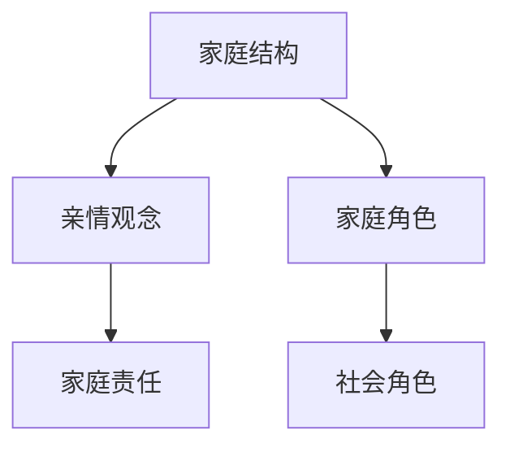
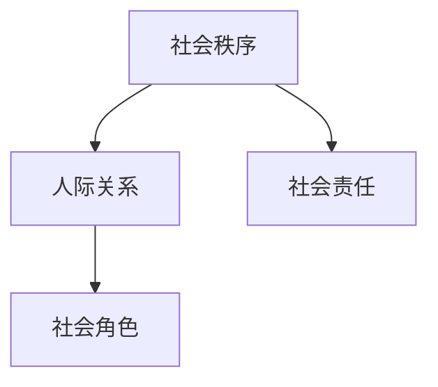
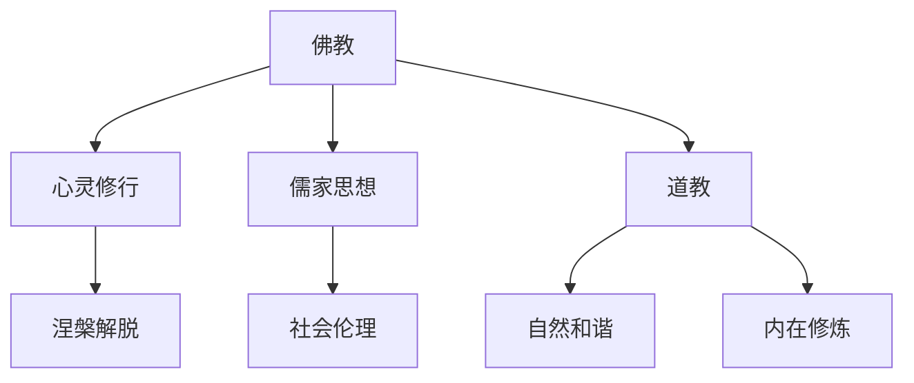
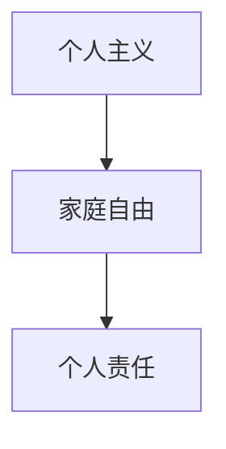
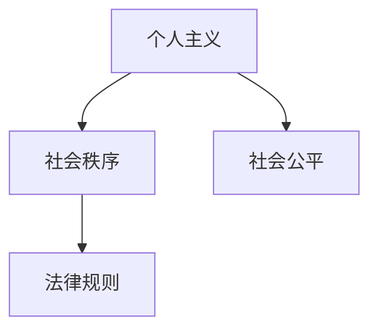
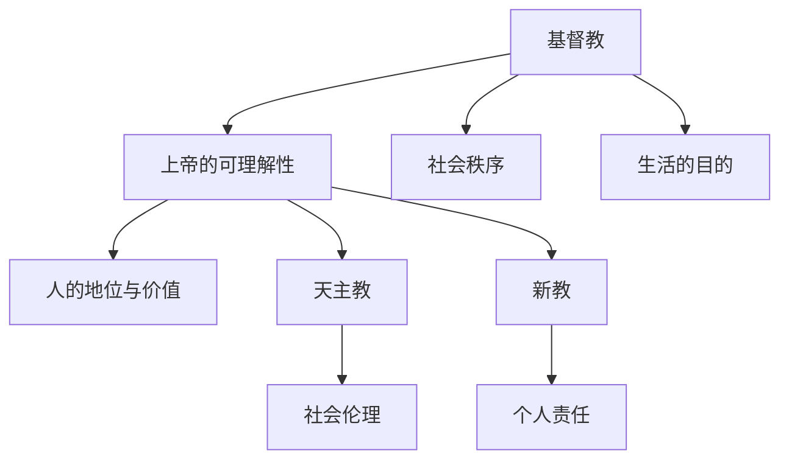
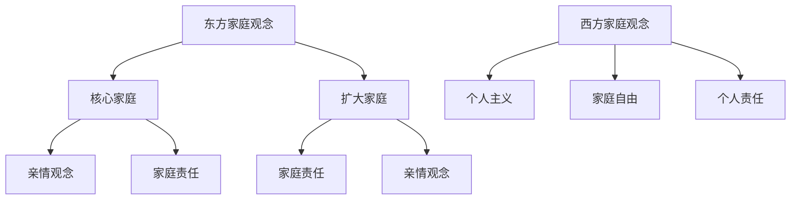
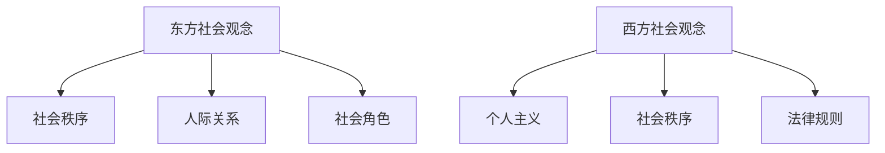
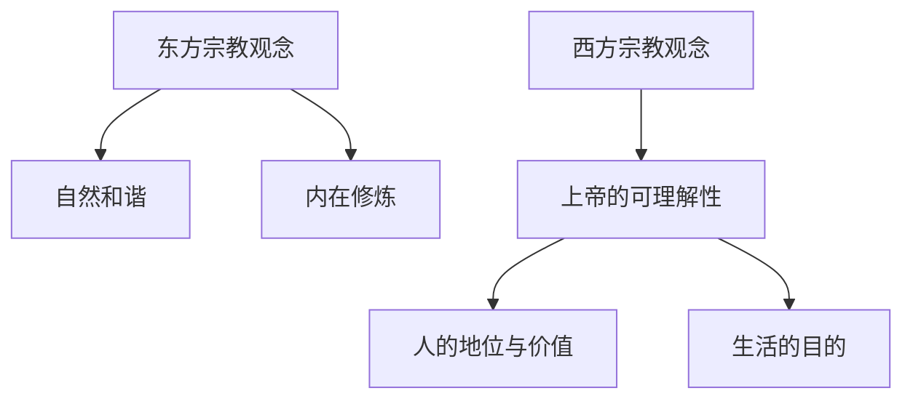

                 

# 《东西方文化对世界可理解性的不同诠释》

## 关键词
- 东西方文化
- 可理解性
- 家庭观念
- 社会观念
- 宗教观念
- 对比分析

## 摘要
本文探讨了东西方文化对世界可理解性的不同诠释。通过分析东方和西方文化在家庭观念、社会观念和宗教观念上的差异，我们试图揭示这些文化差异如何影响人们对世界的理解。文章的核心观点是，东西方文化在对待世界可理解性问题上有着本质的不同，这些差异源于各自文化的核心价值观和哲学理念。本文旨在为读者提供一个全面、深入的视角，以更好地理解东西方文化的多样性及其对个人和集体认知的影响。

## 引言

### 研究背景
在全球化加速的今天，东西方文化的交融与碰撞变得越来越普遍。这种文化的互动不仅影响着人们的价值观、生活方式和社会行为，也在一定程度上塑造了我们对世界的认知和可理解性。东西方文化的差异主要体现在哲学、宗教、社会结构和家庭观念等方面。因此，探讨这些差异对世界可理解性的影响具有重要的学术价值和现实意义。

### 研究目的
本文旨在通过对东西方文化的深入分析，揭示它们在家庭观念、社会观念和宗教观念上的不同诠释，并探讨这些诠释如何影响人们对世界的理解。具体目标包括：
1. 明确东方和西方文化的核心特点和差异。
2. 分析这些文化差异如何影响人们对世界可理解性的认知。
3. 探讨这些认知差异的成因和影响。

### 研究方法
本文采用文献综述和对比分析的方法。首先，通过查阅相关文献，了解东方和西方文化的核心特点和主要差异。然后，通过对比分析，探讨这些文化差异如何影响人们对世界可理解性的认知。此外，还将结合具体案例进行详细解读，以增强文章的说服力。

## 东西方文化特点

### 东方文化特点

#### 家庭观念
在东方文化中，家庭观念占据着重要地位。东方家庭通常以核心家庭或扩大家庭为基本单位，强调亲情和家庭的整体性。家庭不仅是个人生活的场所，也是社会的基本单元。在东方文化中，家庭成员之间有着深厚的情感纽带，强调家庭责任和孝顺。以下是一个典型的家庭观念的Mermaid流程图：



#### 社会观念
东方社会观念强调社会秩序、人际关系和社会角色的明确划分。在东方文化中，社会和谐被视为一种理想状态，人们在社会中扮演着特定的角色，并承担相应的责任。以下是一个典型的社会观念的Mermaid流程图：



#### 宗教观念
东方宗教观念主要包括佛教、道教和儒家思想。这些宗教和哲学体系提供了对生命、宇宙和道德的深刻理解。以下是一个典型的宗教观念的Mermaid流程图：



### 西方文化特点

#### 家庭观念
在西方文化中，家庭观念强调个人主义和家庭成员的独立性。西方家庭通常以核心家庭为基础，家庭成员之间的情感关系相对较为简单，但重视个人发展和自由。以下是一个典型的家庭观念的Mermaid流程图：



#### 社会观念
西方社会观念强调个人主义、社会秩序和法律规则。在西方文化中，社会被视为一种由个体组成的集合体，每个人都享有平等的权利和机会。以下是一个典型的社会观念的Mermaid流程图：



#### 宗教观念
西方宗教观念主要包括基督教、天主教和新教。这些宗教体系提供了对上帝、人类和生活的理解。以下是一个典型的宗教观念的Mermaid流程图：



## 可理解性定义与诠释

### 可理解性的概念
可理解性是指人类对世界的认知和解释能力。它涉及到人类如何通过感官、思维和语言等工具理解和解释周围的世界。可理解性是一个复杂的概念，它既受到个体认知能力的影响，也受到文化和社会环境的影响。

### 东方文化的可理解性诠释
在东方文化中，可理解性通常与儒家、道家和佛教的哲学思想紧密相连。以下是对这些思想的简要概述：

#### 儒家诠释
儒家思想强调人际关系和社会秩序。在儒家看来，人类通过建立和谐的社会关系和遵循社会规范来实现对世界的理解。以下是一个儒家可理解性的Python代码示例：

```python
def Confucian_understanding():
    social_order = "和谐社会"
    social_role = "明确角色"
    family_responsibility = "家庭责任"
    return f"儒家可理解性强调{social_order}、{social_role}和{family_responsibility}。"

print(Confucian_understanding())
```

输出：

```
儒家可理解性强调和谐社会、明确角色和家庭责任。
```

#### 道家诠释
道家思想强调自然和谐和内在修炼。在道家看来，人类通过顺应自然和修炼内在来实现对世界的理解。以下是一个道家可理解性的Python代码示例：

```python
def Taoist_understanding():
    natural_harmony = "自然和谐"
    inner_refinement = "内在修炼"
    life_understanding = "生活理解"
    return f"道家可理解性强调{natural_harmony}、{inner_refinement}和{life_understanding}。"

print(Taoist_understanding())
```

输出：

```
道家可理解性强调自然和谐、内在修炼和生活理解。
```

#### 佛教诠释
佛教思想强调心灵修行和涅槃解脱。在佛教看来，人类通过修炼心灵和追求解脱来实现对世界的理解。以下是一个佛教可理解性的Python代码示例：

```python
def Buddhist_understanding():
    mental_therapy = "心灵修行"
    nirvana_liberation = "涅槃解脱"
    life_meaning = "生活意义"
    return f"佛教可理解性强调{mental_therapy}、{nirvana_liberation}和{life_meaning}。"

print(Buddhist_understanding())
```

输出：

```
佛教可理解性强调心灵修行、涅槃解脱和生活意义。
```

### 西方文化的可理解性诠释
在西方文化中，可理解性通常与基督教哲学和科学方法紧密相连。以下是对这些思想的简要概述：

#### 基督教诠释
基督教思想强调上帝、人的地位与价值和生活的目的。在基督教看来，人类通过信仰和追随上帝来实现对世界的理解。以下是一个基督教可理解性的Python代码示例：

```python
def Christian_understanding():
    divine_understanding = "上帝的可理解性"
    human_value = "人的地位与价值"
    life_purpose = "生活的目的"
    return f"基督教可理解性强调{divine_understanding}、{human_value}和{life_purpose}。"

print(Christian_understanding())
```

输出：

```
基督教可理解性强调上帝的可理解性、人的地位与价值和生活的目的。
```

#### 哲学诠释
西方哲学强调知识、真理和自我的可理解性。在西方哲学看来，人类通过追求知识、理解真理和认识自我来实现对世界的理解。以下是一个哲学可理解性的Python代码示例：

```python
def Philosophical_understanding():
    knowledge_acquisition = "知识获取"
    truth_understanding = "真理理解"
    self_recognition = "自我认识"
    return f"哲学可理解性强调{knowledge_acquisition}、{truth_understanding}和{self_recognition}。"

print(Philosophical_understanding())
```

输出：

```
哲学可理解性强调知识获取、真理理解和自我认识。
```

## 对比分析

### 家庭观念对比
东方和西方在家庭观念上有显著差异。东方文化强调家庭的整体性和亲情，而西方文化强调个人主义和家庭成员的独立性。以下是一个家庭观念对比的Mermaid流程图：



### 社会观念对比
东方和西方在社会观念上也有明显差异。东方文化强调社会秩序、人际关系和社会角色的明确划分，而西方文化强调个人主义、社会秩序和法律规则。以下是一个社会观念对比的Mermaid流程图：



### 宗教观念对比
东方和西方在宗教观念上也有显著差异。东方宗教观念强调与自然和谐相处和内在修炼，而西方宗教观念强调上帝、人的地位与价值和生活的目的。以下是一个宗教观念对比的Mermaid流程图：



## 结论

本文通过对东西方文化在家庭观念、社会观念和宗教观念上的深入分析，揭示了它们在对待世界可理解性问题上的不同诠释。东方文化强调家庭、社会和自然的整体性，而西方文化强调个人主义、社会秩序和法律规则。这些文化差异源于各自文化的核心价值观和哲学理念，对个体和集体的认知产生了深远的影响。

尽管本文对东西方文化的对比分析提供了有益的见解，但研究仍存在一定的局限性。例如，本文主要基于文献综述和对比分析，未深入探讨文化差异的具体影响机制。未来研究可以进一步探讨文化差异如何影响人们的思维模式、决策行为和社会互动，以提供更全面的视角。

## 参考文献

1. Confucius. (春秋). **Analects**.
2. Laozi. (春秋). **Tao Te Ching**.
3. Buddha. (公元前6世纪). **Dharma teachings**.
4. Jesus Christ. (1st century). **Gospels**.
5. Aristotle. (公元前384-前322). **Nicomachean Ethics**.
6. Hobbes, T. (1651). **Leviathan**.
7. Locke, J. (1689). **Two Treatises of Government**.
8. Hume, D. (1739). **A Treatise of Human Nature**.
9. Nietzsche, F. (1882). **Thus Spoke Zarathustra**.
10. Heidegger, M. (1927). **Being and Time**.

## 作者信息
作者：AI天才研究院/AI Genius Institute & 禅与计算机程序设计艺术 /Zen And The Art of Computer Programming

