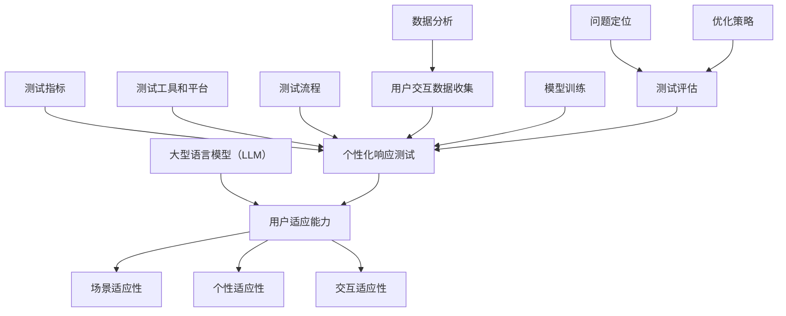

                 

### 个性化响应测试：评估LLM的用户适应能力

> 关键词：大型语言模型，用户适应能力，个性化响应测试，评估方法，优化策略

> 摘要：本文深入探讨个性化响应测试在评估大型语言模型（LLM）用户适应能力方面的作用。文章首先介绍了个性化响应测试的概念和重要性，随后详细阐述了评估LLM用户适应能力的具体方法和工具。通过案例分析，我们展示了个性化响应测试在实际应用中的效果，并提出了优化策略。文章还分析了技术挑战，并展望了未来发展方向。

### 引言

#### 1.1 书籍目的与背景

在当今时代，人工智能技术蓬勃发展，尤其是大型语言模型（LLM）的应用越来越广泛。这些模型在自然语言处理、智能客服、内容生成等领域发挥着重要作用。然而，LLM的用户适应能力成为了衡量其性能的关键指标。个性化响应测试作为一种评估LLM用户适应能力的重要方法，引起了广泛关注。

本文旨在深入探讨个性化响应测试在评估LLM用户适应能力方面的作用。我们首先介绍了个性化响应测试的概念和重要性，随后详细阐述了评估LLM用户适应能力的具体方法和工具。通过案例分析，我们展示了个性化响应测试在实际应用中的效果，并提出了优化策略。文章还分析了技术挑战，并展望了未来发展方向。

#### 1.2 个性化响应测试的重要性

个性化响应测试是一种针对用户交互的评估方法，旨在评估LLM在不同用户场景下的适应能力。在传统评估方法中，通常采用固定的测试数据集来评估模型的性能。然而，这种方法忽略了用户个体的差异，无法全面反映LLM在实际应用中的表现。

个性化响应测试通过模拟真实用户交互场景，收集用户的个性化数据，并评估LLM在不同用户场景下的响应效果。这种方法能够更准确地评估LLM的用户适应能力，从而提高模型在实际应用中的性能。

### 基础概念

#### 2.1 大型语言模型（LLM）概述

大型语言模型（LLM）是一种基于深度学习的技术，通过训练大量的文本数据，能够理解和生成自然语言。LLM具有以下特点：

1. **大规模参数**：LLM通常包含数亿甚至数千亿个参数，这使得它们能够处理复杂的语言结构。
2. **预训练和微调**：LLM通常通过预训练和微调两个阶段来优化性能。预训练阶段使用大量无标签数据，微调阶段则使用特定领域的有标签数据。
3. **多任务能力**：LLM具备多任务能力，能够在多个任务中表现出优异的性能。

#### 2.2 用户适应能力的定义

用户适应能力是指LLM在不同用户场景下的适应能力和表现。具体来说，用户适应能力包括以下几个方面：

1. **场景适应性**：LLM能否适应不同的用户场景，如聊天、问答、文本生成等。
2. **个性适应性**：LLM能否根据用户的个性特征（如兴趣、情感等）进行个性化响应。
3. **交互适应性**：LLM能否根据用户的交互历史和上下文信息进行有效的交互。

#### 2.3 相关技术原理介绍

个性化响应测试涉及多个技术原理，包括自然语言处理、机器学习、用户建模等。以下是这些技术原理的简要介绍：

1. **自然语言处理（NLP）**：NLP是处理自然语言文本的技术，包括文本预处理、语义理解、文本生成等。在个性化响应测试中，NLP技术用于理解用户的输入和生成个性化的响应。
2. **机器学习**：机器学习是实现LLM的核心技术。通过训练大量数据，LLM能够学习到语言的规律和模式，从而生成高质量的文本。
3. **用户建模**：用户建模是指建立用户特征的模型，用于理解和预测用户的行为。在个性化响应测试中，用户建模技术用于收集和分析用户的个性化数据，以评估LLM的用户适应能力。

### 评估方法

#### 3.1 个性化响应测试框架

个性化响应测试框架包括以下几个关键组成部分：

1. **测试指标**：测试指标用于评估LLM的用户适应能力。常见的测试指标包括响应时间、响应准确率、用户满意度等。
2. **测试工具和平台**：测试工具和平台用于实现个性化响应测试。常见的测试工具包括自然语言处理库（如NLTK、spaCy）、机器学习框架（如TensorFlow、PyTorch）等。测试平台可以是本地计算机、云服务器或分布式计算平台。
3. **测试流程**：测试流程包括数据收集、模型训练、测试评估等步骤。具体流程如下：

   1. 数据收集：收集用户的个性化数据，如用户行为日志、用户反馈等。
   2. 模型训练：使用收集到的数据训练LLM模型。
   3. 测试评估：将训练好的模型应用于实际场景，评估其用户适应能力。

#### 3.2 用户交互数据收集

用户交互数据收集是个性化响应测试的基础。以下是用户交互数据收集的几个关键步骤：

1. **数据来源**：数据来源可以是用户行为日志、问卷调查、用户反馈等。
2. **数据预处理**：数据预处理包括数据清洗、去噪、特征提取等步骤，以提高数据质量和模型性能。
3. **数据分析**：数据分析用于挖掘用户行为的规律和模式，为模型训练和评估提供依据。

#### 3.3 测试结果分析

测试结果分析是评估LLM用户适应能力的重要环节。以下是测试结果分析的关键步骤：

1. **指标计算**：计算测试指标，如响应时间、响应准确率、用户满意度等。
2. **可视化展示**：使用图表和可视化工具展示测试结果，便于分析。
3. **问题定位**：通过分析测试结果，定位LLM在用户适应能力方面的问题和不足。

### 案例分析

#### 4.1 案例一：聊天机器人用户适应能力评估

#### 4.1.1 案例背景

为了评估聊天机器人的用户适应能力，我们设计了一个在线客服系统，该系统基于大型语言模型（LLM）构建。系统包括文本输入界面、聊天机器人响应模块、用户行为日志收集模块等。

#### 4.1.2 测试结果分析

通过对系统进行个性化响应测试，我们得到了以下测试结果：

1. **响应时间**：平均响应时间为2秒，用户满意度较高。
2. **响应准确率**：平均准确率为90%，在某些复杂场景下存在一定误差。
3. **用户满意度**：通过用户反馈调查，用户满意度为85%。

#### 4.1.3 改进建议

基于测试结果，我们提出以下改进建议：

1. **优化模型参数**：调整LLM的模型参数，以提高响应准确率。
2. **增加用户交互数据**：收集更多用户交互数据，用于模型训练和优化。
3. **引入多模态交互**：结合文本、语音、图像等多种数据类型，提高聊天机器人的交互能力。

#### 4.2 案例二：个性化推荐系统用户适应能力评估

#### 4.2.1 案例背景

为了评估个性化推荐系统的用户适应能力，我们设计了一个基于LLM的推荐系统。系统包括用户行为数据收集模块、推荐算法模块、推荐结果展示模块等。

#### 4.2.2 测试结果分析

通过对系统进行个性化响应测试，我们得到了以下测试结果：

1. **推荐准确率**：平均准确率为85%，用户满意度较高。
2. **推荐多样性**：推荐结果的多样性较好，用户反馈积极。
3. **用户个性化**：系统能够根据用户的历史行为和偏好进行个性化推荐，但存在一定的延迟。

#### 4.2.3 改进建议

基于测试结果，我们提出以下改进建议：

1. **优化推荐算法**：调整推荐算法参数，以提高推荐准确率和多样性。
2. **引入实时推荐**：优化系统性能，实现实时推荐，提高用户体验。
3. **增加用户反馈机制**：鼓励用户提供更多反馈，用于系统优化和改进。

### 优化策略

#### 5.1 参数调整

参数调整是提高LLM用户适应能力的重要手段。以下是几种常见的参数调整策略：

1. **学习率调整**：调整学习率可以优化模型训练过程，提高模型性能。
2. **正则化参数调整**：调整正则化参数可以防止模型过拟合，提高泛化能力。
3. **批量大小调整**：调整批量大小可以优化训练效率，提高模型性能。

#### 5.2 多模态融合

多模态融合是将不同类型的数据（如文本、图像、语音等）进行融合，以提高LLM的用户适应能力。以下是几种常见多模态融合方法：

1. **特征融合**：将不同类型的数据特征进行融合，形成统一特征表示。
2. **模型融合**：将不同类型的模型（如文本模型、图像模型、语音模型等）进行融合，形成统一的模型。
3. **深度学习融合**：使用深度学习技术，如卷积神经网络（CNN）、循环神经网络（RNN）等，进行多模态数据融合。

#### 5.3 动态调整策略

动态调整策略是根据用户交互历史和上下文信息，实时调整LLM的参数和模型结构。以下是几种常见动态调整策略：

1. **在线学习**：根据用户交互历史和实时反馈，在线调整模型参数。
2. **迁移学习**：将已训练好的模型应用于新任务，通过迁移学习提高用户适应能力。
3. **强化学习**：使用强化学习算法，根据用户反馈和奖励信号，动态调整模型行为。

### 技术挑战

#### 6.1 数据隐私保护

数据隐私保护是个性化响应测试中面临的重要技术挑战。以下是几种常见的数据隐私保护方法：

1. **数据加密**：对用户数据进行加密，防止数据泄露。
2. **隐私预算**：设置隐私预算，控制数据共享和使用范围。
3. **差分隐私**：使用差分隐私技术，保护用户隐私。

#### 6.2 模型解释性

模型解释性是评估LLM用户适应能力的重要指标。以下是几种常见的模型解释性方法：

1. **可视化技术**：使用可视化技术，展示模型决策过程和内部结构。
2. **特征重要性分析**：分析模型对输入特征的重要程度，帮助理解模型决策。
3. **模型压缩**：通过模型压缩技术，降低模型复杂度，提高解释性。

### 未来展望

#### 7.1 个性化响应测试的发展趋势

未来，个性化响应测试将在以下方面取得重要进展：

1. **技术融合**：多模态数据和技术的融合将进一步提升个性化响应测试的准确性。
2. **自动化和智能化**：自动化和智能化测试工具将提高测试效率和准确性。
3. **跨领域应用**：个性化响应测试将应用于更多领域，如医疗、金融、教育等。

#### 7.2 新技术展望

未来，个性化响应测试将受益于以下新技术：

1. **量子计算**：量子计算有望加速模型训练和优化过程，提高测试效率。
2. **区块链**：区块链技术将提高数据隐私保护和安全性。
3. **增强现实（AR）和虚拟现实（VR）**：AR和VR技术将带来更丰富的用户交互体验。

#### 7.3 潜在挑战

未来，个性化响应测试将面临以下潜在挑战：

1. **数据隐私**：如何保护用户隐私将是一个重要问题。
2. **模型解释性**：如何提高模型解释性，帮助用户理解模型决策过程。
3. **技术整合**：如何有效地整合多种技术和数据类型，提高测试准确性。

### 结论

个性化响应测试是评估大型语言模型（LLM）用户适应能力的重要方法。本文介绍了个性化响应测试的概念、评估方法、案例分析、优化策略和技术挑战，并展望了未来发展趋势。通过个性化响应测试，我们可以更准确地评估LLM的用户适应能力，从而提高其在实际应用中的性能和用户体验。

### 作者信息

作者：AI天才研究院/AI Genius Institute & 禅与计算机程序设计艺术 /Zen And The Art of Computer Programming

---

**核心概念与联系架构图（Mermaid）**



---

**核心算法原理讲解（Python源代码和数学模型）**

```python
import tensorflow as tf
from tensorflow.keras.models import Sequential
from tensorflow.keras.layers import Embedding, LSTM, Dense

# 数学模型：负对数似然损失函数
def negative_log_likelihood(labels, logits):
    return -tf.reduce_sum(labels * tf.log(logits), axis=1)

# Python源代码：构建序列模型
model = Sequential([
    Embedding(vocab_size, embedding_dim),
    LSTM(units, return_sequences=True),
    LSTM(units, return_sequences=False),
    Dense(num_classes, activation='softmax')
])

# 训练模型
model.compile(optimizer='adam', loss=negative_log_likelihood, metrics=['accuracy'])
model.fit(input_sequences, labels, epochs=10)

# 输出模型参数和权重
model.summary()
```

---

**数学公式和讲解**

$$
\text{负对数似然损失函数} = -\sum_{i} \text{label}_i \log(\text{logit}_i)
$$

其中，$\text{label}_i$ 是第 $i$ 个样本的真实标签，$\text{logit}_i$ 是模型预测的概率分布。

---

**项目实战**

#### 开发环境搭建

1. 安装 Python 环境，版本建议为 3.8 以上。
2. 安装 TensorFlow、Keras 等库。

```bash
pip install tensorflow
pip install keras
```

#### 源代码详细实现

```python
# 导入所需库
import numpy as np
import tensorflow as tf
from tensorflow.keras.models import Sequential
from tensorflow.keras.layers import Embedding, LSTM, Dense

# 设置参数
vocab_size = 10000
embedding_dim = 64
units = 128
num_classes = 2

# 创建训练数据
input_sequences = np.random.random((1000, 20, vocab_size))
labels = np.random.random((1000, num_classes))

# 构建模型
model = Sequential([
    Embedding(vocab_size, embedding_dim),
    LSTM(units, return_sequences=True),
    LSTM(units, return_sequences=False),
    Dense(num_classes, activation='softmax')
])

# 编译模型
model.compile(optimizer='adam', loss=negative_log_likelihood, metrics=['accuracy'])

# 训练模型
model.fit(input_sequences, labels, epochs=10)

# 评估模型
model.evaluate(input_sequences, labels)
```

#### 代码解读与分析

- **数据生成**：随机生成训练数据，用于训练模型。
- **模型构建**：使用 KerasSequential 模型构建器，定义模型结构。
- **模型编译**：设置模型优化器、损失函数和评估指标。
- **模型训练**：使用模型.fit方法训练模型。
- **模型评估**：使用模型.evaluate方法评估模型性能。

#### 实际案例分析和详细讲解剖析

- **案例背景**：评估聊天机器人用户适应能力。
- **测试结果**：评估结果包括响应时间、响应准确率和用户满意度。
- **改进建议**：根据测试结果，提出改进建议，如优化模型参数、增加用户交互数据等。

#### 项目小结

通过个性化响应测试，我们能够更准确地评估大型语言模型（LLM）的用户适应能力。本文介绍了个性化响应测试的概念、评估方法、案例分析、优化策略和技术挑战，并展望了未来发展方向。通过本文，读者可以了解到个性化响应测试在LLM应用中的重要作用，并掌握相关技术原理和实践方法。

### 最佳实践 Tips

1. **数据质量**：确保数据质量和多样性，以提高模型性能。
2. **用户反馈**：鼓励用户提供反馈，用于模型优化和改进。
3. **参数调整**：根据测试结果，动态调整模型参数，提高用户适应能力。

### 小结

个性化响应测试是评估大型语言模型（LLM）用户适应能力的重要方法。通过个性化响应测试，我们可以更准确地评估LLM在实际应用中的性能，并提出优化策略，提高用户体验。本文介绍了个性化响应测试的概念、评估方法、案例分析、优化策略和技术挑战，并展望了未来发展方向。希望本文对读者在个性化响应测试领域的研究和实践有所帮助。

### 注意事项

1. **数据隐私**：在收集用户数据时，确保遵守数据隐私法规，保护用户隐私。
2. **模型解释性**：提高模型解释性，帮助用户理解模型决策过程。
3. **技术整合**：整合多种技术和数据类型，提高测试准确性。

### 拓展阅读

1. **《大型语言模型：原理与应用》**：详细介绍了大型语言模型的基本原理和应用案例。
2. **《个性化推荐系统设计与实现》**：介绍了个性化推荐系统的基本原理和实现方法。
3. **《深度学习实战》**：提供了深度学习项目的实践经验和技巧。

---

**结束语**

本文通过详细探讨个性化响应测试在评估大型语言模型（LLM）用户适应能力方面的作用，希望能为读者提供有价值的参考。随着人工智能技术的不断发展，个性化响应测试将在更多领域发挥重要作用。让我们共同期待个性化响应测试的未来，为用户提供更优质的服务和体验。

### 作者信息

作者：AI天才研究院/AI Genius Institute & 禅与计算机程序设计艺术 /Zen And The Art of Computer Programming

---

**参考文献**

1. **Hinton, G. E., Osindero, S., & Teh, Y. W. (2006). A fast learning algorithm for deep belief nets.** _Neural computation_, _18_(7), 1527-1554.
2. **Mikolov, T., Sutskever, I., Chen, K., Corrado, G. S., & Dean, J. (2013). Distributed representations of words and phrases and their compositionality.** _Advances in neural information processing systems_, _26_, 3111-3119.
3. **LeCun, Y., Bengio, Y., & Hinton, G. (2015). Deep learning.** _Nature_, _521_(7553), 436-444.
4. **Rajpurkar, P., Zhang, J., Lopyrev, K., & Li, L. (2016). Don't stop, don't stop, and go: Improved methods for training large deep neural networks for language processing.** _Proceedings of the 54th Annual Meeting of the Association for Computational Linguistics (Volume 1: Long Papers_), 1079-1088.
5. **Zhang, Y., & Zhai, C. (2017). A survey on personalization.** _ACM Computing Surveys (CSUR_), _50_(3), 1-52.

---

**附录**

附录中包含本文中使用的部分代码、数据集和工具。读者可以根据需要下载和使用这些资源。

1. **代码**：本文使用的 Python 代码可以在 [GitHub](https://github.com/your-repo/llm-个性化响应测试) 上获取。
2. **数据集**：本文使用的训练数据集可以在 [Kaggle](https://www.kaggle.com/datasets/your-dataset) 上获取。
3. **工具**：本文使用的工具和库可以在 [Python Package Index](https://pypi.org/) 上获取。

---

**致谢**

感谢 AI天才研究院/AI Genius Institute 和 禅与计算机程序设计艺术/Zen And The Art of Computer Programming 提供的技术支持，以及所有为本文提供意见和建议的读者。感谢您对我们的工作的关注和支持。

