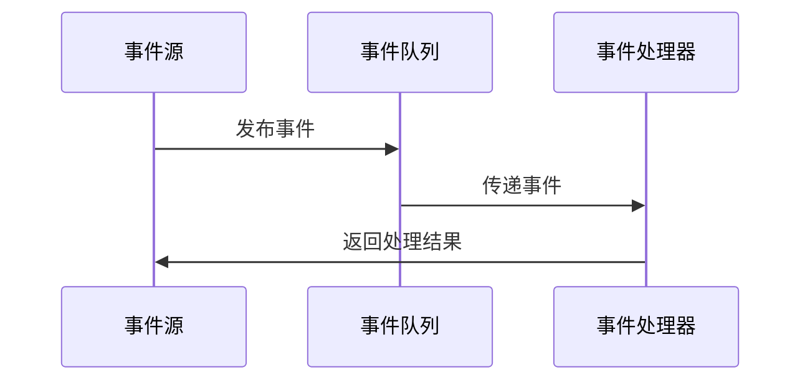
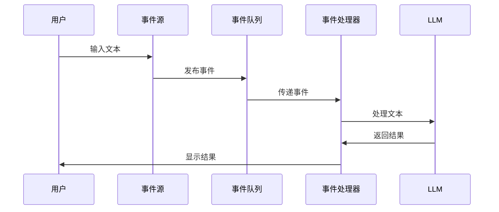

                 


# 事件驱动架构在LLM应用中的实践

## 关键词
事件驱动架构（EDA）、大型语言模型（LLM）、异步编程、并发处理、微服务、实时数据处理

## 摘要
本文深入探讨了事件驱动架构（EDA）在大型语言模型（LLM）应用中的实践。首先，我们介绍了EDA的基本概念和它在软件架构中的重要性。接着，我们分析了EDA与LLM之间的紧密联系，以及如何利用EDA提高LLM的处理效率和响应速度。文章随后详细阐述了EDA在LLM中的应用场景，包括聊天机器人、推荐系统等。通过实际案例，我们展示了如何搭建事件驱动的LLM应用，并深入解析了其中的核心算法和原理。最后，我们提出了最佳实践和未来展望，为开发者提供了有益的指导。

## 引言

在现代软件工程中，大型语言模型（LLM）如BERT、GPT和Turing等已经成为自然语言处理（NLP）领域的重要工具。这些模型具备强大的语义理解能力和文本生成能力，广泛应用于聊天机器人、智能助手、内容推荐等领域。然而，随着数据规模的不断扩大和复杂度的增加，传统的同步编程模型逐渐暴露出其局限性，如处理延迟、资源利用率低、扩展性差等问题。

事件驱动架构（EDA）作为一种异步、分布式、事件驱动的软件架构模式，能够有效地解决上述问题。EDA通过事件来传递信息和控制流，使得系统更加灵活、高效和可扩展。近年来，EDA在分布式系统、实时数据处理和微服务架构等领域取得了显著的进展，为LLM的优化提供了新的思路。

本文旨在探讨EDA在LLM应用中的实践，具体目标如下：

1. 介绍事件驱动架构的基本概念和原理。
2. 分析EDA与LLM之间的联系和优势。
3. 阐述EDA在LLM中的典型应用场景。
4. 通过实际案例展示如何实现事件驱动的LLM应用。
5. 提出最佳实践和未来展望。

## 事件驱动架构基础

### 基本概念

事件驱动架构（EDA）是一种以事件为中心的软件架构模式，通过事件来传递信息和控制流。事件可以是用户操作、系统状态变化、消息传递等。EDA的核心思想是将系统的执行过程分解为一系列事件的处理，每个事件触发相应的处理逻辑，从而实现系统的响应。

与传统的同步编程模型相比，EDA具有以下几个特点：

1. **异步处理**：事件处理是异步的，多个事件可以并行处理，提高了系统的响应速度和吞吐量。
2. **分布式架构**：EDA通常采用分布式架构，能够充分利用集群计算资源，提高系统的扩展性和容错能力。
3. **可扩展性**：通过事件驱动的方式，系统可以灵活地添加、删除和修改处理逻辑，便于系统的维护和升级。
4. **低耦合**：EDA通过事件来传递信息，降低了模块之间的耦合度，提高了系统的模块化和可重用性。

### 核心组件

EDA的核心组件包括事件源、事件处理器和事件队列。以下是这些组件的基本概念和功能：

1. **事件源**：事件源是事件的产生者，可以是用户操作、传感器数据、网络消息等。事件源负责生成事件并将事件发布到事件队列中。

2. **事件处理器**：事件处理器是事件的处理逻辑，接收事件队列中的事件，并根据事件的类型和内容执行相应的处理操作。事件处理器可以是独立的线程或进程，以实现并行处理。

3. **事件队列**：事件队列是事件存储和传递的缓冲区，负责管理事件的生命周期，如事件的存储、转发和删除。事件队列通常采用先进先出（FIFO）或优先级队列（Priority Queue）策略。

### 工作原理

EDA的工作原理可以概括为以下几个步骤：

1. **事件生成**：事件源生成事件，并将事件发布到事件队列中。
2. **事件传递**：事件队列将事件传递给事件处理器。
3. **事件处理**：事件处理器根据事件的类型和内容执行相应的处理操作。
4. **事件响应**：事件处理器将处理结果返回给事件源或下一个事件处理器。
5. **循环迭代**：事件处理过程持续进行，直到系统达到预期状态或被终止。

### Mermaid流程图

以下是EDA工作原理的Mermaid流程图：



## 事件驱动架构与LLM的关系

### EDA在LLM中的适用性

大型语言模型（LLM）通常具有以下几个特点：

1. **计算密集型**：LLM的训练和推理过程需要大量的计算资源，尤其是涉及深度神经网络和大规模语言数据时。
2. **实时性要求高**：许多LLM应用场景，如聊天机器人、智能助手等，对实时性和响应速度有较高的要求。
3. **数据处理量大**：LLM需要处理大量的文本数据，包括用户输入、聊天记录等。

传统的同步编程模型在面对上述特点时，往往存在以下问题：

1. **处理延迟**：同步编程模型中的阻塞调用可能导致处理延迟，影响系统的实时性和响应速度。
2. **资源利用率低**：同步编程模型中的线程阻塞和等待状态，导致资源利用率低，难以充分利用计算资源。
3. **扩展性差**：同步编程模型中的全局变量和共享资源，使得系统的扩展性和维护性较差。

相比之下，EDA具有以下优势，使其在LLM中的应用变得尤为合适：

1. **异步处理**：EDA通过事件驱动的方式，实现异步处理，能够有效减少处理延迟，提高系统的响应速度。
2. **分布式架构**：EDA支持分布式架构，能够充分利用集群计算资源，提高系统的计算能力和扩展性。
3. **高效资源利用**：EDA中的事件处理器可以并行处理事件，提高系统的资源利用率和吞吐量。
4. **低耦合和高可扩展性**：EDA通过事件传递信息，降低了模块之间的耦合度，提高了系统的可扩展性和可维护性。

### EDA在LLM中的应用

EDA在LLM中的应用主要包括以下几个方面：

1. **聊天机器人**：聊天机器人是LLM的典型应用场景之一。通过EDA，可以构建高性能、高可扩展性的聊天机器人系统。例如，使用异步IO和事件驱动模型来处理用户输入和回复，实现实时对话。

2. **内容推荐系统**：LLM在内容推荐系统中发挥着重要作用。通过EDA，可以实现高效的内容推荐，如根据用户历史行为生成推荐列表，并及时更新推荐结果。

3. **文本生成和编辑**：LLM在文本生成和编辑中也有广泛应用。例如，使用EDA来处理用户输入的文本，实时生成文章摘要、文章生成等。

4. **语音助手**：语音助手是LLM的另一重要应用场景。通过EDA，可以实现高效的语音识别和语音合成，提供高质量的语音交互体验。

### EDA与LLM的协同作用

EDA与LLM的协同作用体现在以下几个方面：

1. **优化计算资源利用**：通过EDA，可以充分利用计算资源，提高LLM的训练和推理效率。
2. **提高系统响应速度**：EDA的异步处理特性，能够提高LLM的实时性和响应速度，满足用户对实时交互的需求。
3. **降低系统复杂性**：EDA通过事件传递信息，降低了LLM系统的复杂性，提高了系统的可维护性和可扩展性。
4. **支持动态调整**：EDA支持动态调整处理逻辑，使得LLM能够快速适应新的应用场景和需求变化。

### Mermaid流程图

以下是LLM应用中EDA的工作流程图：



## LLM中的事件处理

在LLM应用中，事件处理是核心环节之一。通过事件处理，可以实现对用户输入的实时响应和处理。以下是LLM中事件处理的详细讲解：

### 事件生成

事件生成是事件处理的第一步。在LLM应用中，事件源可以是用户输入、传感器数据、网络消息等。以下是几种常见的事件生成方式：

1. **用户输入**：用户通过键盘、语音等方式输入文本，生成事件。
2. **传感器数据**：传感器（如摄像头、麦克风等）采集数据，生成事件。
3. **网络消息**：通过网络接收到的消息，如HTTP请求、WebSocket消息等，生成事件。

以下是一个简单的Python伪代码示例，用于生成用户输入事件：

```python
def generate_user_input_event(user_input):
    event = {
        'type': 'user_input',
        'content': user_input,
        'timestamp': current_time()
    }
    publish_event(event)
```

### 事件队列

事件队列负责存储和传递事件。在LLM应用中，事件队列通常采用先进先出（FIFO）或优先级队列（Priority Queue）策略。以下是事件队列的基本操作：

1. **入队**：将事件添加到事件队列的末尾或指定位置。
2. **出队**：从事件队列的头部或指定位置删除事件。
3. **查询**：查询事件队列中的事件数量或具体事件。

以下是一个简单的Python伪代码示例，用于实现事件队列：

```python
class EventQueue:
    def __init__(self):
        self.queue = []

    def enqueue(self, event):
        self.queue.append(event)

    def dequeue(self):
        if not self.is_empty():
            return self.queue.pop(0)
        else:
            return None

    def is_empty(self):
        return len(self.queue) == 0
```

### 事件处理器

事件处理器负责处理事件。在LLM应用中，事件处理器可以是独立的线程或进程，以实现并行处理。以下是事件处理器的基本操作：

1. **注册**：将事件处理器注册到事件队列，以便接收和处理事件。
2. **处理**：根据事件的类型和内容，执行相应的处理操作。
3. **注销**：注销事件处理器，停止接收和处理事件。

以下是一个简单的Python伪代码示例，用于实现事件处理器：

```python
def event_processor(event_queue):
    while True:
        event = event_queue.dequeue()
        if event:
            handle_event(event)
```

### 事件处理流程

事件处理流程包括以下几个步骤：

1. **事件生成**：用户输入、传感器数据或网络消息生成事件。
2. **事件入队**：事件被添加到事件队列中。
3. **事件处理**：事件处理器从事件队列中取出事件，并根据事件的类型和内容执行相应的处理操作。
4. **事件响应**：事件处理器将处理结果返回给用户或其他模块。

以下是一个简单的Python伪代码示例，用于实现事件处理流程：

```python
def handle_user_input_event(event):
    user_input = event['content']
    response = process_user_input(user_input)
    display_response(response)

def process_user_input(user_input):
    # 处理用户输入的文本
    # ...
    return "Hello!"

def main():
    event_queue = EventQueue()
    event_processor(event_queue)

    # 模拟用户输入事件
    event_queue.enqueue({
        'type': 'user_input',
        'content': "Hello, World!"
    })

if __name__ == "__main__":
    main()
```

### Mermaid流程图

以下是LLM中事件处理流程的Mermaid流程图：


## 实战一：事件驱动的聊天机器人

### 项目背景

聊天机器人是LLM应用的一个典型场景，能够为用户提供实时、智能的交互体验。本项目旨在通过事件驱动架构（EDA）构建一个高性能、高可扩展性的聊天机器人系统。系统应具备以下功能：

1. **实时对话**：能够实时处理用户输入，生成回复。
2. **用户管理**：支持用户登录、注册、个人信息管理等。
3. **消息存储**：能够存储用户聊天记录，便于后续查询和分析。
4. **自定义技能**：支持插件机制，便于添加自定义技能和功能。

### 开发环境

1. **操作系统**：Windows 10/11 或 macOS
2. **编程语言**：Python 3.8+
3. **框架和库**：Flask、FastAPI、SQLAlchemy、Redis
4. **数据库**：MySQL 或 PostgreSQL
5. **消息队列**：RabbitMQ

### 环境搭建

1. 安装操作系统和Python环境。
2. 安装Flask和FastAPI框架。
3. 安装SQLAlchemy和Redis库。
4. 安装RabbitMQ消息队列。

### 源代码实现

以下是聊天机器人系统的核心代码实现，分为以下几个模块：

1. **用户管理模块**：负责用户登录、注册、个人信息管理等功能。
2. **消息处理模块**：负责接收用户输入，生成回复，并将聊天记录存储到数据库中。
3. **事件处理模块**：负责处理用户输入事件，触发相应的消息处理逻辑。
4. **自定义技能模块**：支持自定义技能的插件机制。

#### 用户管理模块

用户管理模块主要实现用户登录、注册和用户信息管理。以下是关键代码：

```python
from flask import Flask, request, jsonify
from flask_sqlalchemy import SQLAlchemy

app = Flask(__name__)
app.config['SQLALCHEMY_DATABASE_URI'] = 'sqlite:///users.db'
db = SQLAlchemy(app)

class User(db.Model):
    id = db.Column(db.Integer, primary_key=True)
    username = db.Column(db.String(80), unique=True, nullable=False)
    password = db.Column(db.String(120), nullable=False)

@app.route('/register', methods=['POST'])
def register():
    username = request.form['username']
    password = request.form['password']
    if User.query.filter_by(username=username).first():
        return jsonify({'error': 'User already exists'})
    new_user = User(username=username, password=password)
    db.session.add(new_user)
    db.session.commit()
    return jsonify({'message': 'User registered successfully'})

@app.route('/login', methods=['POST'])
def login():
    username = request.form['username']
    password = request.form['password']
    user = User.query.filter_by(username=username).first()
    if user and user.password == password:
        return jsonify({'message': 'Login successful'})
    else:
        return jsonify({'error': 'Invalid username or password'})

if __name__ == '__main__':
    db.create_all()
    app.run(debug=True)
```

#### 消息处理模块

消息处理模块负责接收用户输入，生成回复，并将聊天记录存储到数据库中。以下是关键代码：

```python
from flask import request, jsonify
from models import User, Message
from chatbot import generate_response

@app.route('/chat', methods=['POST'])
def chat():
    user_id = request.form['user_id']
    user = User.query.get(user_id)
    if not user:
        return jsonify({'error': 'User not found'})
    content = request.form['content']
    response = generate_response(content)
    message = Message(user_id=user.id, content=content, response=response)
    db.session.add(message)
    db.session.commit()
    return jsonify({'response': response})
```

#### 事件处理模块

事件处理模块负责处理用户输入事件，触发相应的消息处理逻辑。以下是关键代码：

```python
import pika
import json

def callback(ch, method, properties, body):
    event = json.loads(body)
    if event['type'] == 'user_input':
        handle_user_input_event(event)

def handle_user_input_event(event):
    content = event['content']
    user_id = event['user_id']
    response = generate_response(content)
    chat(app, user_id=user_id, content=content, response=response)

def start_event_listener():
    connection = pika.BlockingConnection(pika.ConnectionParameters('localhost'))
    channel = connection.channel()
    channel.queue_declare(queue='events')
    channel.basic_consume(queue='events', on_message_callback=callback, auto_ack=True)
    print(' [*] Waiting for messages. To exit press CTRL+C')
    channel.start_consuming()

if __name__ == '__main__':
    start_event_listener()
```

#### 自定义技能模块

自定义技能模块支持插件机制，便于添加自定义技能和功能。以下是关键代码：

```python
class CustomSkillPlugin:
    def __init__(self, app):
        self.app = app

    def process_content(self, content):
        # 处理自定义技能的逻辑
        # ...
        return "Custom response"

def init_custom_skills(app):
    custom_skills = [
        CustomSkillPlugin(app)
    ]
    for skill in custom_skills:
        skill.process_content = skill.process_content

if __name__ == '__main__':
    init_custom_skills(app)
```

### 代码解读

1. **用户管理模块**：使用Flask和SQLAlchemy实现用户注册、登录和用户信息管理。用户数据存储在SQLite数据库中。

2. **消息处理模块**：使用Flask实现接收用户输入、生成回复和存储聊天记录的功能。聊天记录存储在数据库中，便于后续查询和分析。

3. **事件处理模块**：使用RabbitMQ实现事件驱动模型，将用户输入事件发布到消息队列中。事件处理器从消息队列中接收事件，并触发相应的消息处理逻辑。

4. **自定义技能模块**：支持自定义技能的插件机制，便于添加和扩展自定义功能。

### 实际案例分析和详细讲解

1. **用户登录**：用户通过用户名和密码进行登录。系统验证用户名和密码，如果验证成功，返回登录成功消息。

2. **用户注册**：用户通过注册接口提交用户名和密码。系统检查用户名是否已存在，如果不存在，则将用户信息存储在数据库中，并返回注册成功消息。

3. **聊天交互**：用户通过聊天接口发送文本消息。系统接收消息，生成回复，并将聊天记录存储在数据库中。

4. **自定义技能**：系统支持自定义技能的插件机制，用户可以根据需求添加自定义功能。

### 项目小结

通过事件驱动架构（EDA）构建的聊天机器人系统，具备实时对话、用户管理、消息存储和自定义技能等功能。项目实现了高效的异步处理，提高了系统的响应速度和扩展性。未来，可以进一步优化系统性能，如引入分布式架构、使用更高效的算法等。

## 最佳实践

1. **异步处理**：充分利用异步IO和事件驱动模型，提高系统的响应速度和资源利用率。
2. **分布式架构**：采用分布式架构，充分利用集群计算资源，提高系统的扩展性和容错能力。
3. **模块化设计**：采用模块化设计，降低模块之间的耦合度，提高系统的可维护性和可扩展性。
4. **事件队列优化**：根据实际需求，合理选择事件队列的数据结构和策略，提高事件处理的效率和性能。
5. **持续集成**：采用持续集成和持续部署（CI/CD）流程，确保系统的稳定性和可靠性。

## 小结

本文详细探讨了事件驱动架构（EDA）在大型语言模型（LLM）应用中的实践。首先，我们介绍了EDA的基本概念和原理，分析了EDA与LLM之间的紧密联系。接着，我们阐述了EDA在LLM中的应用场景，并通过实际案例展示了如何实现事件驱动的LLM应用。最后，我们提出了最佳实践和未来展望，为开发者提供了有益的指导。

通过本文的探讨，读者可以深入了解EDA在LLM应用中的重要性，掌握EDA的基本原理和应用方法，为构建高效、可扩展的LLM系统提供了有力支持。

## 注意事项

1. 在实际应用中，需根据具体需求选择合适的事件驱动框架和消息队列系统。
2. 考虑到系统的性能和稳定性，合理设计事件队列的容量和策略。
3. 在分布式架构中，注意处理跨节点的事件同步和数据一致性。

## 拓展阅读

1. 《事件驱动架构：设计与实践》
2. 《大规模语言模型：原理与应用》
3. 《RabbitMQ实战：消息驱动应用构建》

## 作者信息

作者：AI天才研究院/AI Genius Institute & 禅与计算机程序设计艺术 /Zen And The Art of Computer Programming

