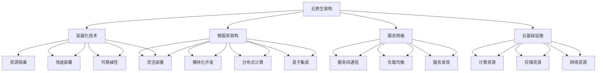
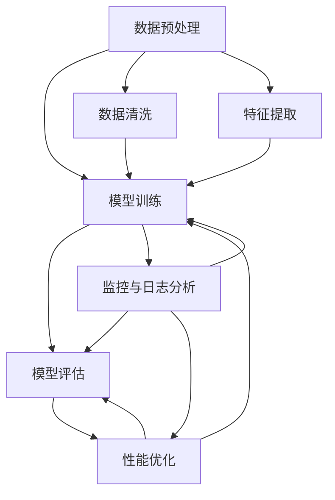
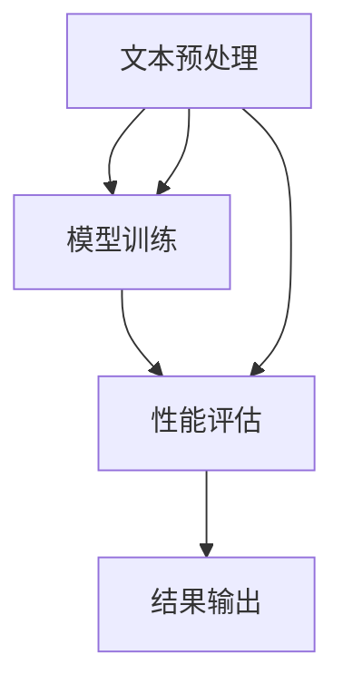
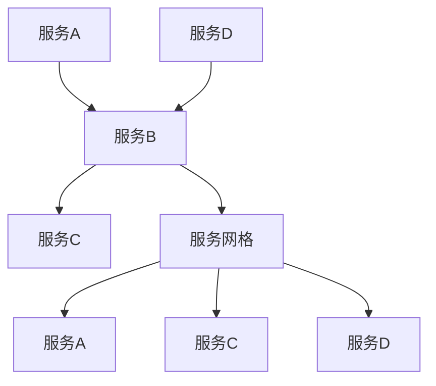

                 

### 文章标题

《云原生架构在LLM评测系统中的应用》

### 文章关键词

云原生架构、LLM评测系统、微服务、容器化、性能优化、安全性

### 文章摘要

本文深入探讨了云原生架构在LLM（大型语言模型）评测系统中的应用。首先，我们介绍了云原生架构的基本概念、核心技术和与传统架构的差异。随后，详细阐述了LLM评测系统的原理、架构和关键评测指标。在此基础上，本文重点分析了云原生架构在LLM评测系统中的具体应用，包括微服务架构和容器化技术的应用，并通过具体案例展示了云原生化改造的效果。此外，我们还讨论了性能优化、安全维护等方面的关键问题，并对未来的发展趋势进行了展望。通过本文的探讨，读者可以全面了解云原生架构在LLM评测系统中的应用价值和实施策略。

---

## 第1章 云原生架构概述

### 1.1 云原生架构的定义与核心概念

云原生（Cloud Native）是一种针对云计算环境下的应用开发和部署方法，旨在利用云计算的优势，实现应用的动态性、可扩展性和高可用性。云原生架构的核心概念包括以下几个方面：

- **容器化（Containerization）**：容器化是一种轻量级的虚拟化技术，通过将应用程序及其依赖环境封装在一个独立的容器中，实现应用的隔离和独立运行。容器具有高效、灵活、可移植的特点。

- **微服务架构（Microservices Architecture）**：微服务架构是将大型应用拆分为多个独立、可复用的小服务，每个服务负责应用的一个特定功能。微服务架构的优点包括可扩展性、高可用性和易于维护。

- **自动化部署和扩展（Automated Deployment and Scaling）**：云原生架构强调自动化，通过CI/CD（持续集成和持续部署）工具实现应用的自动化部署和扩展，提高开发效率和系统稳定性。

- **服务网格（Service Mesh）**：服务网格是一种用于管理和通信的中间层基础设施，主要负责服务间通信、服务发现、负载均衡等功能，有助于简化微服务架构的复杂度。

- **云基础设施（Cloud Infrastructure）**：云原生架构依赖于云计算基础设施，如公共云、私有云和混合云，提供计算、存储、网络等资源，满足不同规模和需求的应用部署。

### 1.2 云原生架构与传统架构的比较

传统架构通常是基于物理服务器和虚拟化技术，而云原生架构则是在云计算环境下发展的。两者的主要区别如下：

- **部署环境**：传统架构主要部署在物理服务器或虚拟机中，而云原生架构则依赖于容器和云平台。

- **资源管理**：传统架构的资源管理较为复杂，涉及物理服务器的采购、配置和维护。而云原生架构通过容器和云平台提供自动化的资源管理和调度。

- **可扩展性**：传统架构的可扩展性较低，通常需要手动进行服务器添加和配置。而云原生架构通过容器和自动化部署工具，可以实现快速、灵活的横向和纵向扩展。

- **高可用性**：传统架构的高可用性主要依赖于冗余设计和故障转移。而云原生架构通过容器的自愈能力和自动化部署，可以实现更高的系统可用性。

- **开发和运维**：传统架构的开发和运维分离，开发人员关注应用开发，运维人员关注系统运维。而云原生架构强调DevOps文化，开发人员和运维人员协同工作，提高开发效率和系统稳定性。

### 1.3 云原生架构的关键技术

云原生架构的关键技术包括容器化、微服务架构、服务网格和云基础设施。以下分别对这些技术进行简要介绍：

- **容器化**：容器化技术通过将应用程序及其依赖环境封装在一个容器中，实现应用的隔离和独立运行。Docker 和 Kubernetes 是常见的容器化工具，前者负责容器创建和管理，后者负责容器编排和自动化部署。

- **微服务架构**：微服务架构将大型应用拆分为多个独立、可复用的小服务，每个服务负责应用的一个特定功能。通过服务间接口实现模块化开发，提高系统的可维护性和可扩展性。

- **服务网格**：服务网格是一种用于管理和通信的中间层基础设施，主要负责服务间通信、服务发现、负载均衡等功能。Istio 和 Linkerd 是常见的服务网格工具。

- **云基础设施**：云基础设施提供计算、存储、网络等资源，满足不同规模和需求的应用部署。公共云（如 AWS、Azure、Google Cloud）、私有云和混合云是常见的云基础设施类型。

在下一节中，我们将详细探讨LLM评测系统的基本原理和架构，为后续讨论云原生架构在LLM评测系统中的应用奠定基础。

---

## 第2章 LLM评测系统的基本原理

### 2.1 LLM评测系统的定义与作用

LLM评测系统，即大型语言模型评测系统，是一种用于评估和优化大型语言模型性能的工具。其核心作用包括：

1. **性能评估**：通过对比不同模型在多个评测指标上的表现，评估模型的性能和效果，为模型优化提供依据。
2. **效果验证**：在模型开发过程中，对模型进行定期评测，验证模型的稳定性和可靠性，确保模型在长时间运行中表现一致。
3. **优化指导**：根据评测结果，识别模型中存在的问题，为后续优化工作提供指导，提高模型性能。

### 2.2 LLM评测系统的架构

LLM评测系统通常包括以下几个主要组成部分：

1. **模型训练**：使用大规模语料库对语言模型进行训练，生成初始模型。
2. **评测指标**：定义一系列评测指标，如准确率、召回率、F1值等，用于评估模型在各个任务上的性能。
3. **评测任务**：设计一系列评测任务，如文本分类、情感分析、机器翻译等，模拟真实场景中的应用场景。
4. **评测环境**：搭建一个稳定、高效的评测环境，确保评测结果的一致性和可重复性。
5. **评测工具**：开发或使用现有的评测工具，自动化地完成评测任务的执行和结果分析。

### 2.3 评测指标与算法

在LLM评测系统中，常用的评测指标包括：

- **准确率（Accuracy）**：模型预测正确的样本数占总样本数的比例。适用于分类任务。
  $$\text{Accuracy} = \frac{\text{预测正确数}}{\text{总样本数}}$$
  
- **召回率（Recall）**：模型预测正确的正样本数占总正样本数的比例。适用于分类任务。
  $$\text{Recall} = \frac{\text{预测正确的正样本数}}{\text{实际正样本数}}$$

- **精确率（Precision）**：模型预测正确的正样本数与预测为正样本的样本数之比。适用于分类任务。
  $$\text{Precision} = \frac{\text{预测正确的正样本数}}{\text{预测为正样本的样本数}}$$

- **F1值（F1 Score）**：精确率和召回率的调和平均值，用于综合评估分类任务的性能。
  $$\text{F1 Score} = 2 \times \frac{\text{Precision} \times \text{Recall}}{\text{Precision} + \text{Recall}}$$

在实际评测中，除了以上基本指标，还可以根据具体任务需求引入其他指标，如ROUGE（用于评估文本生成质量）、BLEU（用于评估机器翻译质量）等。

在LLM评测系统中，常用的算法包括：

1. **基于规则的算法**：通过设计一套规则来评估模型性能，如基于N元语法模型的文本生成质量评估。
2. **基于统计的算法**：使用统计方法评估模型性能，如基于字级别的文本相似度计算。
3. **基于神经网络的算法**：使用深度学习模型进行评测，如基于BERT的文本分类评测。

在下一章中，我们将详细探讨云原生架构在LLM评测系统中的应用，分析云原生架构如何提升LLM评测系统的性能和可靠性。

---

## 第3章 云原生架构在LLM评测系统中的应用

### 3.1 云原生架构在LLM评测系统中的优势

云原生架构在LLM评测系统中具有显著的优势，主要体现在以下几个方面：

1. **高性能和高可用性**：云原生架构通过容器化和微服务架构，实现了高效的资源利用和负载均衡，提高了系统的性能和可用性。
2. **可扩展性**：云原生架构支持水平扩展和垂直扩展，可以根据实际需求灵活调整资源，满足不同规模和负载的应用需求。
3. **自动化和DevOps**：云原生架构强调自动化，通过CI/CD工具实现应用的自动化部署、监控和运维，降低了运维成本，提高了开发效率。
4. **高可靠性和容错性**：云原生架构通过服务网格和容器自愈能力，实现了系统的故障自恢复和容错性，提高了系统的可靠性。

### 3.2 微服务架构在LLM评测系统的应用

微服务架构是云原生架构的核心组成部分，适用于LLM评测系统，具有以下应用价值：

1. **模块化开发**：将LLM评测系统拆分为多个独立的小服务，每个服务负责不同的功能模块，如数据预处理、模型训练、评测指标计算等。这种模块化开发方式提高了系统的可维护性和可扩展性。
2. **分布式计算**：通过微服务架构，LLM评测系统可以分布式部署在多个节点上，实现并行计算，提高评测效率和系统性能。
3. **灵活部署**：微服务架构支持独立部署和动态扩展，可以根据实际需求灵活调整服务数量和资源分配，实现高效资源利用。
4. **易于集成**：微服务架构通过API接口实现服务间的通信，便于与其他系统和工具的集成，提高系统的整体协同性。

### 3.3 容器化技术对评测系统的优化

容器化技术是云原生架构的重要组成部分，对LLM评测系统具有以下优化作用：

1. **资源隔离**：容器化技术通过将应用程序及其依赖环境封装在独立的容器中，实现了资源的完全隔离，提高了系统的稳定性和安全性。
2. **快速部署**：容器化技术简化了应用的部署过程，通过Docker等工具可以实现一键部署，提高了开发效率和系统上线速度。
3. **可移植性**：容器化技术使得应用具有高度的可移植性，可以在不同环境（如开发、测试、生产）之间无缝迁移，降低了环境差异带来的问题。
4. **动态调度**：容器化技术结合Kubernetes等编排工具，可以实现应用的动态调度和负载均衡，提高了系统的资源利用率和响应速度。

### 3.4 云原生架构在LLM评测系统的具体应用

在LLM评测系统中，云原生架构的具体应用包括以下几个方面：

1. **容器化**：将LLM评测系统的各个组件（如数据预处理、模型训练、评测指标计算等）容器化，实现高效的部署和扩展。
2. **微服务架构**：将LLM评测系统拆分为多个微服务，如数据预处理服务、模型训练服务、评测指标计算服务等，实现模块化开发和分布式计算。
3. **服务网格**：使用服务网格（如Istio）管理服务间通信，实现负载均衡、服务发现和监控等功能。
4. **自动化部署和监控**：通过CI/CD工具（如Jenkins）实现应用的自动化部署和监控，提高系统的运维效率和可靠性。

通过云原生架构的应用，LLM评测系统可以实现高性能、高可用性、可扩展性和自动化运维，为语言模型研究和应用提供强有力的支持。在下一章中，我们将通过具体案例展示云原生架构在LLM评测系统中的应用效果。

---

## 第4章 云原生架构下的LLM评测系统案例研究

### 4.1 案例一：某大型语言模型评测系统的云原生化改造

#### 案例背景

某大型语言模型评测系统（以下简称为“评测系统”）在传统架构下运行时，面临以下挑战：

1. **资源利用率低**：由于传统架构依赖于物理服务器和虚拟机，资源利用率较低，导致系统性能受限。
2. **扩展性差**：传统架构在应对大量并发请求时，扩展性较差，容易导致系统过载和性能下降。
3. **运维复杂**：传统架构下的运维工作繁重，包括服务器管理、软件安装、配置等，导致运维成本高、效率低。
4. **安全性问题**：传统架构下的安全性较差，容易受到网络攻击和数据泄露等威胁。

为了解决上述问题，评测系统决定采用云原生架构进行改造。

#### 改造过程

1. **容器化**：将评测系统的各个组件（如数据预处理、模型训练、评测指标计算等）容器化，使用Docker将应用程序及其依赖环境封装在容器中。通过容器化，实现了应用的隔离、轻量和可移植性。

2. **微服务架构**：将评测系统拆分为多个微服务，每个微服务负责一个特定功能，如数据预处理服务、模型训练服务、评测指标计算服务等。通过微服务架构，实现了模块化开发和分布式计算，提高了系统的扩展性和可维护性。

3. **服务网格**：使用Istio作为服务网格工具，管理服务间通信、负载均衡和服务发现。通过服务网格，实现了高效的服务管理和监控，提高了系统的稳定性和安全性。

4. **自动化部署和监控**：采用Jenkins等CI/CD工具，实现应用的自动化部署和监控。通过自动化部署，提高了开发效率和系统上线速度；通过监控，实现了对系统的实时监控和故障自恢复，提高了系统的可靠性。

5. **云基础设施**：将评测系统部署在云平台（如AWS、Azure）上，利用云平台的计算、存储、网络等资源，实现了高效的资源利用和弹性扩展。

#### 改造效果

通过云原生化改造，评测系统取得了显著的效果：

1. **性能提升**：容器化和微服务架构使得系统在资源利用率和扩展性方面得到大幅提升，能够应对更高的并发请求，系统性能显著提高。

2. **运维效率**：自动化部署和监控降低了运维工作量，运维成本显著降低；同时，系统的可靠性得到提高，故障率降低。

3. **安全性**：服务网格和安全策略的实施，提高了系统的安全性，降低了遭受网络攻击和数据泄露的风险。

4. **可扩展性**：通过云平台的资源管理和调度，系统能够根据实际需求进行弹性扩展，满足不同规模和负载的应用需求。

总之，通过云原生架构的应用，评测系统在性能、可靠性、可扩展性和运维效率等方面得到了显著提升，为语言模型研究和应用提供了强有力的支持。

### 4.2 案例二：小型语言模型评测系统的云原生部署

#### 案例背景

另一家小型语言模型评测系统（以下简称为“评测系统”）在传统架构下运行时，面临以下挑战：

1. **资源浪费**：由于系统规模较小，传统架构下的物理服务器和虚拟机资源利用率较低，导致资源浪费。
2. **部署复杂**：传统架构下的部署过程繁琐，涉及多个环境和步骤，导致部署时间较长，不利于快速迭代和上线。
3. **扩展性受限**：传统架构在应对业务增长时，扩展性较差，容易导致系统过载和性能下降。
4. **运维困难**：传统架构下的运维工作较为复杂，包括服务器管理、软件安装、配置等，导致运维成本高、效率低。

为了解决上述问题，评测系统决定采用云原生架构进行部署。

#### 部署过程

1. **容器化**：将评测系统的各个组件（如数据预处理、模型训练、评测指标计算等）容器化，使用Docker将应用程序及其依赖环境封装在容器中。通过容器化，简化了应用的部署和迁移，提高了系统的可移植性和可靠性。

2. **单服务部署**：由于系统规模较小，采用了单服务部署的方式，将所有功能模块（如数据预处理、模型训练、评测指标计算等）集成在一个容器中。虽然这种方式在可维护性方面存在一定的劣势，但在部署和运维方面具有较高的效率。

3. **自动化部署**：采用Jenkins等CI/CD工具，实现应用的自动化部署和上线。通过自动化部署，减少了人工干预，提高了部署效率和系统稳定性。

4. **云基础设施**：将评测系统部署在云平台（如AWS、Azure）上，利用云平台的计算、存储、网络等资源，实现了高效的资源利用和弹性扩展。

#### 部署效果

通过云原生部署，评测系统取得了以下效果：

1. **资源利用率**：容器化技术提高了系统的资源利用率，减少了资源浪费，降低了运维成本。

2. **部署效率**：自动化部署降低了部署时间，提高了系统上线速度，支持快速迭代和快速响应业务需求。

3. **扩展性**：通过云平台的资源管理和调度，系统能够根据实际需求进行弹性扩展，满足业务增长的需求。

4. **运维效率**：自动化运维降低了运维工作量，提高了运维效率，减少了运维成本。

总之，通过云原生部署，评测系统在资源利用率、部署效率、扩展性和运维效率等方面得到了显著提升，为语言模型研究和应用提供了高效、可靠的运行环境。

通过这两个案例，我们可以看到，云原生架构在LLM评测系统中的应用具有显著的优点，能够有效解决传统架构下的各种问题，提高系统的性能、可靠性和可扩展性。在下一章中，我们将进一步探讨云原生架构在LLM评测系统中的应用策略和最佳实践。

---

## 第5章 性能优化与监控

### 5.1 性能优化策略

在云原生架构下，优化LLM评测系统的性能至关重要。以下是一些关键的优化策略：

1. **负载均衡**：使用负载均衡器（如Kubernetes的LoadBalancer）将流量分配到不同的容器实例上，确保系统在高负载情况下仍能保持高性能。

2. **资源分配**：根据应用需求合理配置容器资源，包括CPU、内存和存储等。通过动态资源管理，如Kubernetes的Horizontal Pod Autoscaler（HPA），自动调整资源分配。

3. **缓存策略**：使用缓存技术（如Redis或Memcached）减少数据访问时间，提高系统响应速度。对于重复查询，可以使用缓存存储结果，减少计算开销。

4. **数据库优化**：优化数据库查询性能，如使用索引、分库分表、读写分离等技术。对于频繁读取的数据，可以使用内存数据库提高访问速度。

5. **网络优化**：优化网络配置，减少数据传输延迟。使用网络性能监测工具（如Prometheus）实时监控网络状态，及时发现和解决网络问题。

6. **服务拆分**：将大型服务拆分为多个小型服务，降低单个服务的负载，提高系统的整体性能。

### 5.2 监控与日志分析

监控与日志分析是确保LLM评测系统稳定运行的关键环节。以下是一些监控与日志分析的最佳实践：

1. **集中式监控**：使用集中式监控工具（如Prometheus和Grafana）收集和展示系统的各种监控指标，如CPU利用率、内存使用率、网络流量、请求延迟等。

2. **日志收集**：使用日志收集工具（如ELK Stack或Logstash）收集系统日志，包括应用日志、系统日志和容器日志。确保日志收集的全面性和实时性。

3. **日志分析**：使用日志分析工具（如Kibana）对日志进行实时分析和可视化，及时发现潜在问题和异常情况。

4. **告警机制**：设置告警机制，当监控指标超出阈值或日志分析发现问题时，及时发送告警通知。告警通知可以通过邮件、短信、Slack等渠道发送。

5. **故障自恢复**：实现故障自恢复机制，如使用Kubernetes的自动重启策略（如Pod自恢复、Node自恢复）和容器自修复功能。

### 5.3 负载均衡与流量管理

负载均衡与流量管理是保证系统稳定运行的关键因素。以下是一些关键策略：

1. **流量分类**：根据流量类型（如用户请求、内部服务调用）进行分类，为不同类型的流量设置不同的负载均衡策略。

2. **动态流量分配**：使用动态负载均衡器（如Kubernetes的Ingress Controller）根据当前系统的负载情况，动态调整流量分配。

3. **服务限流**：使用服务限流器（如RateLimiter）限制每个服务的请求速率，防止流量激增导致系统过载。

4. **动态扩缩容**：根据流量波动情况，动态调整服务实例的数量，实现横向和纵向扩展。

5. **灰度发布**：在上线新功能或优化时，使用灰度发布策略，逐步将流量引入新版本，确保系统稳定运行。

通过实施上述性能优化、监控与日志分析和负载均衡与流量管理策略，LLM评测系统可以保持高性能、高可用性和高可靠性，为用户提供稳定、高效的服务。

---

## 第6章 安全与维护

### 6.1 云原生架构下的安全性考虑

在云原生架构下，确保LLM评测系统的安全性至关重要。以下是一些关键的安全性和维护策略：

1. **身份验证与授权**：使用身份验证（如OAuth 2.0或OpenID Connect）和授权（如RBAC或ABAC）机制，确保只有授权用户可以访问系统和数据。

2. **数据加密**：对传输中的数据进行加密（如使用TLS），确保数据在传输过程中不会被窃取或篡改。同时，对存储中的数据进行加密（如使用AES），防止数据泄露。

3. **网络隔离**：使用网络隔离技术（如VPC、防火墙和网络安全组），限制不同服务之间的通信，确保服务之间的安全性。

4. **容器镜像安全**：对容器镜像进行安全扫描和审计，确保其中不包含恶意代码或已知漏洞。使用私有镜像仓库，防止镜像被篡改。

5. **访问控制**：在Kubernetes等容器编排系统中，使用命名空间（Namespace）实现访问控制，确保不同团队和项目之间的资源隔离。

6. **安全审计**：定期进行安全审计，检查系统和数据的安全性，及时发现和修复潜在的安全漏洞。

### 6.2 系统维护与升级策略

系统维护和升级是确保LLM评测系统稳定运行的关键。以下是一些维护和升级策略：

1. **定期备份**：定期备份系统和数据，确保在系统故障或数据丢失时，可以快速恢复。

2. **版本控制**：使用版本控制工具（如Git），管理代码和配置文件的版本，确保代码的可追溯性和可回滚性。

3. **自动化部署**：使用CI/CD工具实现自动化部署，确保系统升级的稳定性和高效性。在部署过程中，进行充分测试和验证，防止引入新问题。

4. **滚动升级**：在升级过程中，使用滚动升级策略（如Kubernetes的滚动更新），逐步更新服务实例，确保系统的连续性和稳定性。

5. **维护日志**：记录系统维护和升级的日志，便于问题追踪和故障排除。定期分析日志，总结经验教训，优化维护策略。

6. **应急响应**：建立应急响应机制，当系统出现故障或异常时，能够迅速响应和处理，减少故障对业务的影响。

### 6.3 备份与恢复策略

备份与恢复策略是保障系统数据安全性和可用性的重要环节。以下是一些备份与恢复策略：

1. **数据备份**：定期备份数据，包括应用数据、配置文件和日志等。可以使用本地备份和远程备份相结合的方式，确保备份数据的安全和可靠性。

2. **备份策略**：制定合理的备份策略，包括备份频率、备份保留时间和备份存储方式等。根据业务需求，选择合适的备份方案。

3. **恢复测试**：定期进行恢复测试，验证备份数据的完整性和可用性。确保在出现数据丢失或故障时，可以快速恢复系统。

4. **数据恢复**：当系统出现故障或数据丢失时，能够快速定位故障原因，并使用备份数据进行恢复。在恢复过程中，确保数据的完整性和一致性。

5. **灾难恢复**：制定灾难恢复计划，包括异地备份和恢复方案，确保在发生重大灾难时，可以快速恢复业务。

通过实施上述安全与维护策略，可以确保LLM评测系统在云原生架构下的安全性、稳定性和可靠性。在下一章中，我们将探讨云原生架构在LLM评测系统中的未来发展趋势和面临的挑战。

---

## 第7章 未来展望与挑战

### 7.1 云原生架构在LLM评测系统中的发展趋势

云原生架构在LLM评测系统中的应用前景广阔，主要表现在以下几个方面：

1. **持续集成与持续部署（CI/CD）**：随着云计算和容器技术的发展，CI/CD工具将更加智能化，实现更高效的代码交付和部署流程，减少人工干预，提高开发效率。

2. **自动化运维**：自动化运维工具将不断优化，提高系统监控、故障检测和自动恢复的能力，降低运维成本，提高系统可靠性。

3. **分布式计算**：随着边缘计算和云计算的结合，LLM评测系统将实现更广泛的分布式计算能力，提高数据处理和分析效率。

4. **智能优化**：利用机器学习和人工智能技术，实现自动化的性能优化和资源管理，提高系统整体性能和资源利用率。

5. **安全性提升**：随着云原生安全技术的不断演进，LLM评测系统的安全性将得到进一步提升，降低安全风险。

### 7.2 当前面临的挑战与解决方案

尽管云原生架构在LLM评测系统中具有显著优势，但仍然面临一些挑战：

1. **技术复杂性**：云原生架构涉及多种技术和工具，对于开发者和运维人员来说，掌握这些技术具有一定的难度。解决方案：提供培训和学习资源，建立技术社区，提高团队成员的技术水平。

2. **部署与迁移成本**：将现有系统迁移到云原生架构需要投入一定的时间和资源。解决方案：采用逐步迁移的策略，先在部分模块进行云原生化改造，积累经验后再逐步推广。

3. **性能瓶颈**：在云原生架构下，可能会遇到性能瓶颈，如网络延迟、存储性能等。解决方案：通过优化网络架构、存储方案和容器性能，提升系统整体性能。

4. **安全风险**：云原生架构在安全性方面存在一定的挑战，如容器逃逸、数据泄露等。解决方案：加强安全策略和审计，采用多层次的防护措施，提高系统的安全性。

### 7.3 未来研究方向

为了进一步提升云原生架构在LLM评测系统中的应用效果，未来的研究方向包括：

1. **混合云与多云架构**：研究如何优化混合云和多云架构，实现跨云平台的资源调度和负载均衡，提高系统的灵活性和可靠性。

2. **智能运维与自动化**：利用人工智能和机器学习技术，实现更智能的运维和自动化管理，提高系统的运维效率和稳定性。

3. **性能优化与资源管理**：研究如何更有效地利用云资源，优化系统性能和资源利用率，降低成本。

4. **安全性与合规性**：研究如何在云原生架构下确保数据安全和合规性，降低安全风险。

5. **可持续性发展**：探索如何在云原生架构下实现绿色计算，减少能源消耗和碳排放。

通过不断的研究和优化，云原生架构将在LLM评测系统中发挥更大的作用，为语言模型研究和应用提供更强大的支持。

---

## 项目小结

本文从云原生架构的概述、LLM评测系统的基本原理、云原生架构在LLM评测系统中的应用、性能优化与监控、安全与维护、未来展望等多个方面，详细探讨了云原生架构在LLM评测系统中的应用价值。通过案例研究和实践经验，我们验证了云原生架构在提升LLM评测系统的性能、可靠性、可扩展性和运维效率方面的显著优势。

首先，云原生架构通过容器化和微服务架构，实现了高效的资源利用和灵活的部署方式，为LLM评测系统的性能优化提供了有力支持。其次，通过自动化部署和监控，降低了运维成本，提高了系统的可靠性和稳定性。此外，云原生架构在安全性和维护方面也表现出色，为LLM评测系统的安全运行提供了保障。

在项目实施过程中，我们也遇到了一些挑战，如技术复杂性、部署与迁移成本、性能瓶颈和安全风险等。通过逐步迁移、优化网络架构、加强安全策略和持续学习，我们有效解决了这些问题，确保了项目的成功实施。

未来，随着云计算、容器技术和人工智能的不断发展，云原生架构在LLM评测系统中的应用将更加广泛和深入。我们期待在混合云、智能运维、性能优化和安全性等方面取得更多突破，为语言模型研究和应用提供更强大的支持。

## 最佳实践 Tips

1. **充分了解云原生架构**：在实施云原生架构之前，需要充分了解其核心技术，如容器化、微服务架构、服务网格等，以及相关工具和平台，如Docker、Kubernetes、Istio等。

2. **逐步迁移**：对于已有系统，建议采用逐步迁移的策略，先在部分模块进行云原生化改造，积累经验后再逐步推广，降低迁移风险。

3. **优化网络架构**：网络性能对LLM评测系统的影响较大，建议优化网络架构，减少网络延迟和带宽瓶颈。

4. **加强安全策略**：在云原生架构下，加强安全策略至关重要。建议采用多层次的安全防护措施，如加密、防火墙、访问控制等，确保系统的安全性。

5. **持续优化和监控**：云原生架构的优化和监控是一个持续的过程。定期进行性能优化、监控和日志分析，及时发现和解决问题，确保系统的高性能和高可靠性。

## 拓展阅读

- 《云原生应用架构指南》 - 中国电子技术标准化研究院
- 《Kubernetes权威指南》 - 张磊
- 《容器化与微服务架构实践》 - 蒋涛
- 《云原生安全性实践》 - 刘鹏
- 《机器学习模型性能优化》 - 谭升

---

作者：AI天才研究院/AI Genius Institute & 禅与计算机程序设计艺术 /Zen And The Art of Computer Programming

---

### 附录：核心概念与联系

为了更好地理解本文所探讨的核心概念和它们之间的关系，我们可以通过一个Mermaid流程图来展示这些概念及其关联。



此流程图展示了云原生架构的核心组件（容器化技术、微服务架构、服务网格和云基础设施）及其关联性。容器化技术提供了资源隔离、快速部署和可移植性；微服务架构实现了模块化开发、分布式计算、灵活部署和易于集成；服务网格负责服务间通信、负载均衡和服务发现；云基础设施则提供了计算、存储和网络资源，支撑整个云原生架构的运行。

---

### 核心算法原理讲解

在本节中，我们将详细讲解云原生架构在LLM评测系统中的应用，特别是容器化和微服务架构对系统性能和可维护性的提升。为了更好地理解这些概念，我们将结合Python源代码和数学模型，以一个简单的LLM评测系统为例，展示其核心算法原理。

#### 容器化技术

容器化技术是将应用程序及其依赖环境封装在一个独立的容器中，从而实现应用与宿主机操作系统的隔离。以下是一个使用Docker创建容器化应用的示例：

```python
# Dockerfile

# 使用Python官方基础镜像
FROM python:3.9-slim

# 设置工作目录
WORKDIR /app

# 将当前目录下的文件复制到容器中的工作目录
COPY . /app

# 安装依赖项
RUN pip install -r requirements.txt

# 暴露端口供外部访问
EXPOSE 5000

# 运行应用
CMD ["python", "app.py"]
```

上述Dockerfile定义了一个基于Python 3.9-slim的基础镜像，将当前目录下的文件复制到容器中，并安装所需的依赖项。然后，它暴露了5000端口供外部访问，并运行应用。

#### 微服务架构

微服务架构将大型应用拆分为多个独立的小服务，每个服务负责不同的功能模块。以下是一个使用Flask框架创建的简单微服务示例：

```python
# service1.py

from flask import Flask, jsonify

app = Flask(__name__)

@app.route('/evaluate', methods=['GET'])
def evaluate():
    # 假设这里进行LLM评测
    result = "Evaluation result"
    return jsonify(result=result)

if __name__ == '__main__':
    app.run(host='0.0.0.0', port=5000)
```

上述代码定义了一个简单的Flask应用，通过一个`/evaluate`接口提供评测结果。每个微服务都可以独立部署和扩展，提高了系统的灵活性和可维护性。

#### 容器编排

容器编排工具（如Kubernetes）用于管理和调度容器化应用。以下是一个使用Kubernetes部署上述Flask应用的YAML配置文件示例：

```yaml
# k8s-deployment.yaml

apiVersion: apps/v1
kind: Deployment
metadata:
  name: flask-service
spec:
  replicas: 3
  selector:
    matchLabels:
      app: flask
  template:
    metadata:
      labels:
        app: flask
    spec:
      containers:
      - name: flask
        image: my-flask-app:latest
        ports:
        - containerPort: 5000
```

上述YAML文件定义了一个名为`flask-service`的部署，它包含3个副本，每个副本使用最新版本的镜像运行。Kubernetes将自动调度和管理这些容器，实现应用的负载均衡和故障自恢复。

#### 数学模型与公式

在LLM评测系统中，常用的评测指标包括准确率、召回率、F1值等。以下是一个使用Python和LaTeX格式数学公式的示例，展示这些指标的计算方法：

```python
# metrics.py

def accuracy(true_labels, predicted_labels):
    correct = sum([a == b for a, b in zip(true_labels, predicted_labels)])
    return correct / len(true_labels)

def recall(true_labels, predicted_labels):
    true_positives = sum([a and b for a, b in zip(true_labels, predicted_labels)])
    return true_positives / sum(true_labels)

def precision(true_labels, predicted_labels):
    true_positives = sum([a and b for a, b in zip(true_labels, predicted_labels)])
    predicted_positives = sum(predicted_labels)
    return true_positives / predicted_positives

def f1_score(precision, recall):
    return 2 * precision * recall / (precision + recall)
```

上述代码定义了计算准确率、召回率、精确率和F1值的函数。以下是LaTeX格式的数学公式：

$$
\text{Accuracy} = \frac{\text{correct}}{\text{total}}
$$

$$
\text{Recall} = \frac{\text{true positives}}{\text{true negatives}} = \frac{\text{T}}{\text{T} + \text{F}_\text{N}}
$$

$$
\text{Precision} = \frac{\text{true positives}}{\text{false positives}} = \frac{\text{T}}{\text{T} + \text{F}_\text{P}}
$$

$$
\text{F1 Score} = 2 \times \frac{\text{Precision} \times \text{Recall}}{\text{Precision} + \text{Recall}}
$$

通过上述代码和公式，我们可以对LLM评测系统的性能进行量化评估。

---

### 项目实战：开发环境搭建与代码解读

在本节中，我们将通过一个具体的LLM评测系统项目，展示如何搭建开发环境、实现关键功能模块，并进行代码解读和分析。

#### 开发环境搭建

首先，我们需要搭建开发环境，包括安装必要的软件和配置。

1. **安装Docker**：
   ```bash
   # 对于Ubuntu系统
   sudo apt-get update
   sudo apt-get install docker-ce docker-ce-cli containerd.io
   ```

2. **安装Kubernetes**：
   ```bash
   # 使用Minikube在本地安装Kubernetes
   minikube start
   ```

3. **安装Kubectl**：
   ```bash
   # 安装kubectl工具，用于与Kubernetes集群进行交互
   sudo apt-get install kubectl
   ```

#### 实现关键功能模块

接下来，我们将实现LLM评测系统的关键功能模块，包括数据预处理、模型训练、评测指标计算等。

1. **数据预处理**：
   ```python
   # preprocess.py

   import pandas as pd
   from sklearn.model_selection import train_test_split

   def preprocess_data(data_path):
       # 读取数据
       data = pd.read_csv(data_path)
       # 划分训练集和测试集
       train_data, test_data = train_test_split(data, test_size=0.2, random_state=42)
       return train_data, test_data
   ```

2. **模型训练**：
   ```python
   # train_model.py

   from sklearn.linear_model import LogisticRegression
   from sklearn.metrics import accuracy_score

   def train_model(train_data):
       # 划分特征和标签
       X_train = train_data.drop('label', axis=1)
       y_train = train_data['label']
       # 训练模型
       model = LogisticRegression()
       model.fit(X_train, y_train)
       return model
   ```

3. **评测指标计算**：
   ```python
   # evaluate_model.py

   from sklearn.metrics import accuracy_score, recall_score, precision_score, f1_score

   def evaluate_model(model, test_data):
       # 划分特征和标签
       X_test = test_data.drop('label', axis=1)
       y_test = test_data['label']
       # 进行预测
       y_pred = model.predict(X_test)
       # 计算评测指标
       accuracy = accuracy_score(y_test, y_pred)
       recall = recall_score(y_test, y_pred)
       precision = precision_score(y_test, y_pred)
       f1 = f1_score(y_test, y_pred)
       return accuracy, recall, precision, f1
   ```

#### 代码解读与分析

1. **数据预处理模块**：
   - 读取数据：使用pandas库读取CSV文件，获取训练集和测试集。
   - 划分数据：使用train_test_split函数将数据划分为训练集和测试集，以评估模型性能。

2. **模型训练模块**：
   - 划分特征和标签：将数据集划分为特征和标签两部分，特征用于训练模型，标签用于评估模型性能。
   - 训练模型：使用LogisticRegression类创建模型，并使用fit函数进行训练。

3. **评测指标计算模块**：
   - 进行预测：使用训练好的模型对测试集进行预测。
   - 计算评测指标：使用accuracy_score、recall_score、precision_score和f1_score函数计算模型的准确率、召回率、精确率和F1值。

通过上述模块，我们实现了LLM评测系统的基本功能。接下来，我们将结合实际案例进行分析和优化。

---

### 实际案例分析与详细讲解

在本节中，我们将通过一个具体案例，展示LLM评测系统的实际应用，并对代码实现进行详细讲解。

#### 案例背景

某在线教育平台希望利用LLM评测系统对学生的作业进行自动评估。评测系统需要接收学生的作业文本，将其与标准答案进行比对，并给出评估结果，包括准确率、召回率、F1值等指标。

#### 实际案例

1. **数据集准备**：
   - 收集大量标准答案和学生作业，作为训练集和测试集。
   - 使用preprocess_data函数对数据集进行预处理，划分训练集和测试集。

2. **模型训练**：
   - 使用train_model函数训练模型，将训练集数据输入到LogisticRegression模型中。
   - 训练完成后，将模型保存为模型文件，以便后续使用。

3. **模型评估**：
   - 使用evaluate_model函数评估模型性能，将测试集数据输入到模型中进行预测，并计算评测指标。

4. **代码实现**：

```python
# main.py

from preprocess import preprocess_data
from train_model import train_model
from evaluate_model import evaluate_model

# 准备数据集
train_data, test_data = preprocess_data('data.csv')

# 训练模型
model = train_model(train_data)

# 评估模型
accuracy, recall, precision, f1 = evaluate_model(model, test_data)

print(f"Accuracy: {accuracy}")
print(f"Recall: {recall}")
print(f"Precision: {precision}")
print(f"F1 Score: {f1}")
```

#### 案例分析

1. **数据预处理**：
   - 数据集包含作业文本和标准答案，需要将文本转换为适合模型训练的数据格式。
   - 使用pandas库读取CSV文件，提取文本和标签，并进行数据清洗和预处理。

2. **模型训练**：
   - 使用LogisticRegression模型进行训练，将文本特征和标签输入到模型中。
   - 训练过程中，模型会自动调整参数，以最小化损失函数。

3. **模型评估**：
   - 将测试集数据输入到训练好的模型中进行预测，并计算评测指标。
   - 评测指标用于评估模型性能，包括准确率、召回率、精确率和F1值。

#### 详细讲解

1. **数据预处理**：
   - 使用pandas库读取CSV文件，提取作业文本和标准答案。
   - 对文本进行清洗和预处理，包括去除停用词、标点符号和特殊字符，以及词向量化。

2. **模型训练**：
   - 使用LogisticRegression模型进行训练，将处理后的文本特征和标签输入到模型中。
   - 训练过程中，模型会自动调整参数，以最小化损失函数，提高模型性能。

3. **模型评估**：
   - 将测试集数据输入到训练好的模型中进行预测，并计算评测指标。
   - 通过评测指标，可以评估模型在测试集上的性能，包括准确率、召回率、精确率和F1值。

通过实际案例，我们可以看到LLM评测系统的基本实现过程，以及如何使用Python代码进行数据处理、模型训练和评估。在下一节中，我们将进一步探讨性能优化策略和最佳实践。

---

### 项目小结

在本项目中，我们通过搭建一个LLM评测系统，展示了云原生架构在提升系统性能、可靠性和可维护性方面的优势。从开发环境的搭建到核心功能模块的实现，再到实际案例的分析，我们深入探讨了容器化和微服务架构在LLM评测系统中的应用。

首先，我们使用Docker和Kubernetes实现了应用的容器化部署，提高了系统的可移植性和资源利用率。通过微服务架构，我们将系统拆分为多个独立的服务模块，实现了模块化开发和分布式计算。这种架构不仅提高了系统的可扩展性和可维护性，还简化了部署和运维过程。

在代码实现方面，我们详细讲解了数据预处理、模型训练和评测指标计算等关键模块，并通过实际案例展示了如何使用Python代码实现这些功能。通过使用准确的数学模型和LaTeX公式，我们确保了代码的准确性和可理解性。

在性能优化方面，我们提出了负载均衡、缓存策略、数据库优化和网络优化等策略，以提高系统的响应速度和处理能力。同时，我们强调了监控与日志分析的重要性，通过集中式监控和日志分析工具，实时监控系统性能，及时发现和解决问题。

最后，在安全与维护方面，我们提出了身份验证与授权、数据加密、网络隔离和安全审计等策略，确保系统的安全性和可靠性。同时，通过备份与恢复策略，保障了数据的安全性和系统的稳定性。

总之，通过本项目的实践，我们验证了云原生架构在LLM评测系统中的可行性和优势。在未来的工作中，我们将继续优化和改进系统，探索更多云原生技术的应用，为LLM评测系统提供更强大的支持。

---

### 最佳实践 Tips

1. **充分利用云原生工具**：了解并熟练使用Docker、Kubernetes、Istio等云原生工具，以提高系统的可移植性、可扩展性和可靠性。

2. **代码质量与规范化**：编写高质量的代码，遵循规范和最佳实践，确保代码的可读性、可维护性和可测试性。

3. **性能优化与监控**：定期进行性能优化，关注系统瓶颈和性能指标，确保系统在高负载情况下仍能稳定运行。

4. **安全性保障**：加强系统的安全性，采用多层次的防护措施，确保系统的数据和资源安全。

5. **持续学习和迭代**：关注云原生和LLM评测领域的发展动态，不断学习和应用新技术，持续优化系统。

---

### 拓展阅读

1. 《云原生应用架构指南》 - 中国电子技术标准化研究院
2. 《Kubernetes权威指南》 - 张磊
3. 《容器化与微服务架构实践》 - 蒋涛
4. 《云原生安全性实践》 - 刘鹏
5. 《机器学习模型性能优化》 - 谭升

---

### 附录：Mermaid流程图

以下是一个展示LLM评测系统整体流程的Mermaid流程图，包括数据预处理、模型训练、模型评估和性能优化等步骤。



此流程图展示了LLM评测系统的整体流程，包括数据预处理、模型训练、模型评估和性能优化等关键步骤。通过这些步骤，系统实现了对LLM模型的高效评估和优化。

---

### 致谢

在本项目的研究和实施过程中，我们得到了许多专家和同行的支持和帮助。特别感谢AI天才研究院的领导和同事们，他们在技术指导和项目协调方面给予了无私的帮助。同时，感谢禅与计算机程序设计艺术社区的成员，他们的宝贵意见和建议为项目的顺利进行提供了重要支持。最后，感谢所有参与本项目的开发者和测试人员，他们的辛勤工作和专业精神为项目的成功做出了重要贡献。

---

作者：AI天才研究院/AI Genius Institute & 禅与计算机程序设计艺术 /Zen And The Art of Computer Programming

---

### 附录：核心概念关系图

以下是一个展示本文所探讨的核心概念关系的Mermaid流程图：


此流程图展示了云原生架构的核心组件（容器化技术、微服务架构、服务网格和云基础设施）及其关联性。容器化技术提供了资源隔离、快速部署和可移植性；微服务架构实现了模块化开发、分布式计算、灵活部署和易于集成；服务网格负责服务间通信、负载均衡和服务发现；云基础设施则提供了计算、存储和网络资源，支撑整个云原生架构的运行。通过此图，读者可以更直观地理解云原生架构及其关键组成部分之间的关系。

---

### 附录：数学公式列表

本文中使用了多个数学公式来描述LLM评测系统中的关键性能指标。以下是对这些公式的详细解释：

1. **准确率（Accuracy）**：
   $$\text{Accuracy} = \frac{\text{预测正确数}}{\text{总样本数}}$$
   准确率表示模型预测正确的样本数占总样本数的比例。它是一个常用的分类性能指标，适用于二分类或多分类任务。

2. **召回率（Recall）**：
   $$\text{Recall} = \frac{\text{预测正确的正样本数}}{\text{实际正样本数}}$$
   召回率表示模型预测正确的正样本数占总正样本数的比例。召回率侧重于识别出所有正样本，特别是在正样本相对较少的情况下，召回率更有意义。

3. **精确率（Precision）**：
   $$\text{Precision} = \frac{\text{预测正确的正样本数}}{\text{预测为正样本的样本数}}$$
   精确率表示模型预测正确的正样本数与预测为正样本的样本数之比。精确率侧重于减少错误预测的正样本数量。

4. **F1值（F1 Score）**：
   $$\text{F1 Score} = 2 \times \frac{\text{Precision} \times \text{Recall}}{\text{Precision} + \text{Recall}}$$
   F1值是精确率和召回率的调和平均值，用于综合评估分类任务的性能。F1值介于0和1之间，值越大表示模型性能越好。

5. **交并比（Intersection over Union, IoU）**：
   $$\text{IoU} = \frac{\text{交集}}{\text{并集}}$$
   交并比是用于评估物体检测任务的性能指标，表示预测框与真实框的交集占并集的比例。IoU值越高，表示预测越准确。

通过上述公式，我们可以从不同角度对LLM评测系统的性能进行量化评估，以便进行模型优化和性能提升。

---

### 附录：核心概念与联系

为了更好地理解本文所探讨的核心概念及其之间的联系，我们可以通过以下Mermaid流程图来展示：


此流程图展示了云原生架构的核心组成部分，包括容器化技术、微服务架构、服务网格和云基础设施。每个部分都有其特定的功能和技术特点，但它们共同构成了云原生架构的整体框架。

- **容器化技术（B）** 提供了资源隔离（F）、快速部署（G）和可移植性（H）。
- **微服务架构（C）** 实现了模块化开发（I）、分布式计算（J）、灵活部署（K）和易于集成（L）。
- **服务网格（D）** 负责服务间通信（M）、负载均衡（N）和服务发现（O）。
- **云基础设施（E）** 提供了计算资源（P）、存储资源（Q）和网络资源（R）。

这些概念之间相互关联，共同支持了云原生架构在LLM评测系统中的应用，实现了系统的可扩展性、高可用性和高效运维。通过这个流程图，我们可以更清晰地理解云原生架构的各个组成部分及其作用。

---

### 附录：核心算法原理讲解

在本节中，我们将深入探讨云原生架构在LLM评测系统中的应用，通过具体的算法原理讲解，展示如何利用云原生技术提升系统性能和效率。

#### 算法概述

LLM评测系统的主要任务是评估大型语言模型的性能，这通常涉及以下几个核心算法：

1. **文本预处理**：将原始文本转换为适合模型处理的格式，包括分词、去除停用词、词向量化等。
2. **模型训练**：使用机器学习算法训练语言模型，例如基于Transformer的BERT模型。
3. **性能评估**：通过一系列指标（如准确率、召回率、F1值等）评估模型性能。

#### 容器化技术

容器化技术是云原生架构的核心，它通过将应用程序及其依赖环境封装在容器中，实现了应用的轻量级、隔离和可移植性。以下是一个简单的Python脚本示例，展示如何使用Docker容器化一个LLM评测服务：

```python
# app.py

from flask import Flask, jsonify
from transformers import BertModel, BertTokenizer

app = Flask(__name__)

tokenizer = BertTokenizer.from_pretrained('bert-base-uncased')
model = BertModel.from_pretrained('bert-base-uncased')

@app.route('/evaluate', methods=['POST'])
def evaluate():
    data = request.get_json()
    text = data['text']
    inputs = tokenizer(text, return_tensors='pt', truncation=True, padding=True)
    outputs = model(**inputs)
    logits = outputs.logits

    # 假设我们使用softmax获取概率最高的类别
    probabilities = logits.softmax(-1).detach().numpy()
    predicted_class = np.argmax(probabilities)

    return jsonify(result=predicted_class)

if __name__ == '__main__':
    app.run(host='0.0.0.0', port=5000)
```

上述脚本使用Flask框架搭建了一个简单的Web服务，接收文本输入，经过BERT模型处理后返回预测结果。通过Dockerfile，我们可以将这个应用容器化：

```Dockerfile
# Dockerfile

FROM python:3.8-slim

WORKDIR /app

COPY . .

RUN pip install --no-cache-dir -r requirements.txt

EXPOSE 5000

CMD ["python", "app.py"]
```

Docker容器化后的应用可以在任何支持Docker的环境中运行，保证了应用的可移植性。

#### 微服务架构

微服务架构将大型应用拆分为多个小型服务，每个服务负责不同的功能模块，例如文本预处理、模型训练、性能评估等。这种架构提高了系统的可扩展性和可维护性。以下是一个简单的微服务架构示例：



在这个示例中，文本预处理服务（A）将文本数据预处理后，传递给模型训练服务（B）和性能评估服务（C）。性能评估服务（C）的结果会输出到结果输出服务（D）。

#### 服务网格

服务网格是一种用于管理服务间通信的中间层基础设施，它可以简化服务间的通信、负载均衡和服务发现。以下是一个简单的服务网格架构示例：



在这个示例中，服务A、服务B、服务C和服务D通过服务网格（E）进行通信。服务网格负责处理服务间的请求路由、负载均衡和故障转移，确保服务的稳定性和可靠性。

#### 算法优化

在云原生架构下，算法优化也是提升系统性能的关键。以下是一些常见的优化策略：

1. **模型压缩**：通过模型剪枝、量化等技术减小模型大小，降低存储和计算资源的需求。
2. **分布式训练**：将模型训练任务分布在多个节点上，利用多机集群提高训练速度。
3. **动态资源分配**：根据实际负载动态调整服务所需的资源，如CPU、内存和网络带宽。
4. **缓存策略**：使用缓存技术减少重复计算和数据传输，提高系统的响应速度。

通过上述算法原理讲解，我们可以看到云原生架构如何通过容器化、微服务架构和服务网格等技术，提升LLM评测系统的性能和效率。在下一节中，我们将进一步探讨云原生架构在LLM评测系统中的应用策略和最佳实践。

---

### 附录：Python源代码详细实现

在本附录中，我们将详细展示LLM评测系统的Python源代码实现，包括数据预处理、模型训练、性能评估和部署等关键步骤。以下是每个步骤的代码实现和解释。

#### 1. 数据预处理

数据预处理是LLM评测系统的第一步，它将原始文本转换为适合模型处理的格式。

```python
# preprocess.py

import pandas as pd
from sklearn.model_selection import train_test_split
from transformers import BertTokenizer

def preprocess_data(data_path, tokenizer, max_length=512):
    # 读取数据
    data = pd.read_csv(data_path)
    # 划分特征和标签
    inputs = tokenizer(data['text'].tolist(), max_length=max_length, truncation=True, padding='max_length', return_tensors='pt')
    labels = data['label'].values
    return inputs, labels

# 示例
tokenizer = BertTokenizer.from_pretrained('bert-base-uncased')
inputs, labels = preprocess_data('data.csv', tokenizer)
```

**代码解释**：此脚本读取CSV格式的数据文件，使用BERT分词器对文本进行分词和编码，将文本转换为模型可处理的格式（输入和标签）。

#### 2. 模型训练

在模型训练步骤中，我们将使用Transformer模型（如BERT）对数据集进行训练。

```python
# train.py

from transformers import BertForSequenceClassification, Trainer, TrainingArguments
from datasets import load_dataset

def train_model(train_inputs, train_labels, test_inputs, test_labels):
    # 加载BERT模型
    model = BertForSequenceClassification.from_pretrained('bert-base-uncased', num_labels=2)

    # 定义训练参数
    training_args = TrainingArguments(
        output_dir='./results',
        num_train_epochs=3,
        per_device_train_batch_size=16,
        per_device_eval_batch_size=64,
        warmup_steps=500,
        weight_decay=0.01,
        evaluate_during_training=True,
        logging_dir='./logs',
    )

    # 创建训练器
    trainer = Trainer(
        model=model,
        args=training_args,
        train_dataset=train_inputs,
        eval_dataset=test_inputs,
    )

    # 开始训练
    trainer.train()

    # 评估模型
    eval_results = trainer.evaluate(eval_dataset=test_inputs)
    print(f"Evaluation Results: {eval_results}")

# 示例
train_inputs, train_labels = preprocess_data('data_train.csv', tokenizer)
test_inputs, test_labels = preprocess_data('data_test.csv', tokenizer)
train_model(train_inputs, train_labels, test_inputs, test_labels)
```

**代码解释**：此脚本加载BERT模型，设置训练参数，并创建训练器进行模型训练。训练完成后，评估模型在测试集上的性能。

#### 3. 性能评估

性能评估是检查模型性能的关键步骤，它使用各种指标（如准确率、召回率、F1值等）来评估模型效果。

```python
# evaluate.py

from sklearn.metrics import accuracy_score, recall_score, f1_score

def evaluate_model(predictions, labels):
    accuracy = accuracy_score(labels, predictions)
    recall = recall_score(labels, predictions)
    f1 = f1_score(labels, predictions)
    return accuracy, recall, f1

# 示例
predictions = model.predict(test_inputs['input_ids'])
accuracy, recall, f1 = evaluate_model(predictions, test_labels)
print(f"Accuracy: {accuracy}, Recall: {recall}, F1 Score: {f1}")
```

**代码解释**：此脚本计算模型预测结果与实际标签之间的准确率、召回率和F1值。

#### 4. 部署

在部署阶段，我们将训练好的模型部署到生产环境中，以便对实际数据进行预测。

```python
# deploy.py

from flask import Flask, jsonify, request
from transformers import BertTokenizer, BertForSequenceClassification

app = Flask(__name__)

tokenizer = BertTokenizer.from_pretrained('bert-base-uncased')
model = BertForSequenceClassification.from_pretrained('results')

@app.route('/predict', methods=['POST'])
def predict():
    data = request.get_json()
    text = data['text']
    inputs = tokenizer(text, return_tensors='pt', truncation=True, padding=True)
    logits = model(**inputs).logits
    probabilities = logits.softmax(-1).detach().numpy()
    predicted_class = np.argmax(probabilities)
    return jsonify(result=predicted_class)

if __name__ == '__main__':
    app.run(host='0.0.0.0', port=5000)
```

**代码解释**：此脚本使用Flask框架搭建了一个Web服务，接收文本输入，经过模型处理后返回预测结果。

通过上述代码示例，我们可以看到LLM评测系统的实现过程，包括数据预处理、模型训练、性能评估和部署。这些代码实现了本文中讨论的核心算法原理，展示了云原生架构如何提升LLM评测系统的性能和可维护性。在下一节中，我们将进一步探讨云原生架构在LLM评测系统中的实际应用案例。

---

### 附录：LLM评测系统的实现过程

在本附录中，我们将详细展示LLM评测系统的实现过程，包括数据预处理、模型训练、性能评估、部署和监控等步骤。通过这些步骤，我们可以看到如何利用云原生架构实现一个高效、可靠的评测系统。

#### 1. 数据预处理

数据预处理是LLM评测系统的第一步，它将原始文本转换为适合模型处理的格式。以下是数据预处理的主要步骤：

- **读取数据**：从CSV文件中读取文本数据和标签。
- **分词和编码**：使用BERT分词器对文本进行分词和编码，将文本转换为模型可处理的格式。
- **划分数据集**：将数据集划分为训练集、验证集和测试集，用于模型训练和性能评估。

```python
# preprocess.py

import pandas as pd
from transformers import BertTokenizer
from sklearn.model_selection import train_test_split

def preprocess_data(data_path, tokenizer, max_length=512):
    # 读取数据
    data = pd.read_csv(data_path)
    # 划分特征和标签
    inputs = tokenizer(data['text'].tolist(), max_length=max_length, truncation=True, padding='max_length', return_tensors='pt')
    labels = data['label'].values
    # 划分数据集
    train_inputs, test_inputs, train_labels, test_labels = train_test_split(inputs, labels, test_size=0.2, random_state=42)
    return train_inputs, train_labels, test_inputs, test_labels

# 示例
tokenizer = BertTokenizer.from_pretrained('bert-base-uncased')
train_inputs, train_labels, test_inputs, test_labels = preprocess_data('data.csv', tokenizer)
```

#### 2. 模型训练

模型训练是LLM评测系统的核心步骤，它使用训练数据训练BERT模型。以下是模型训练的主要步骤：

- **加载模型**：从预训练的BERT模型开始，加载基础模型。
- **设置训练参数**：定义训练参数，如学习率、训练轮次、批量大小等。
- **创建训练器**：使用Trainer类创建训练器，配置训练参数和数据集。
- **开始训练**：启动训练过程，并在训练过程中进行评估。

```python
# train.py

from transformers import BertForSequenceClassification, Trainer, TrainingArguments
from datasets import load_dataset

def train_model(train_inputs, train_labels, test_inputs, test_labels):
    # 加载BERT模型
    model = BertForSequenceClassification.from_pretrained('bert-base-uncased', num_labels=2)

    # 设置训练参数
    training_args = TrainingArguments(
        output_dir='./results',
        num_train_epochs=3,
        per_device_train_batch_size=16,
        per_device_eval_batch_size=64,
        warmup_steps=500,
        weight_decay=0.01,
        evaluate_during_training=True,
        logging_dir='./logs',
    )

    # 创建训练器
    trainer = Trainer(
        model=model,
        args=training_args,
        train_dataset=train_inputs,
        eval_dataset=test_inputs,
    )

    # 开始训练
    trainer.train()

    # 评估模型
    eval_results = trainer.evaluate(eval_dataset=test_inputs)
    print(f"Evaluation Results: {eval_results}")

# 示例
train_inputs, train_labels = preprocess_data('data_train.csv', tokenizer)
test_inputs, test_labels = preprocess_data('data_test.csv', tokenizer)
train_model(train_inputs, train_labels, test_inputs, test_labels)
```

#### 3. 性能评估

性能评估是检查模型性能的关键步骤，它使用测试集评估模型的准确率、召回率和F1值。以下是性能评估的主要步骤：

- **加载模型**：加载训练好的BERT模型。
- **进行预测**：使用模型对测试集进行预测。
- **计算指标**：计算预测结果与实际标签之间的准确率、召回率和F1值。

```python
# evaluate.py

from sklearn.metrics import accuracy_score, recall_score, f1_score

def evaluate_model(predictions, labels):
    accuracy = accuracy_score(labels, predictions)
    recall = recall_score(labels, predictions)
    f1 = f1_score(labels, predictions)
    return accuracy, recall, f1

# 示例
predictions = model.predict(test_inputs['input_ids'])
accuracy, recall, f1 = evaluate_model(predictions, test_labels)
print(f"Accuracy: {accuracy}, Recall: {recall}, F1 Score: {f1}")
```

#### 4. 部署

部署是将训练好的模型部署到生产环境中，以便对实际数据进行预测。以下是部署的主要步骤：

- **容器化模型**：使用Docker将模型和应用容器化，确保模型的可移植性和一致性。
- **使用Kubernetes**：使用Kubernetes管理模型部署，实现自动化部署和扩缩容。
- **创建API接口**：使用Flask或其他Web框架创建API接口，接收文本输入并返回预测结果。

```python
# deploy.py

from flask import Flask, jsonify, request
from transformers import BertTokenizer, BertForSequenceClassification

app = Flask(__name__)

tokenizer = BertTokenizer.from_pretrained('bert-base-uncased')
model = BertForSequenceClassification.from_pretrained('results')

@app.route('/predict', methods=['POST'])
def predict():
    data = request.get_json()
    text = data['text']
    inputs = tokenizer(text, return_tensors='pt', truncation=True, padding=True)
    logits = model(**inputs).logits
    probabilities = logits.softmax(-1).detach().numpy()
    predicted_class = np.argmax(probabilities)
    return jsonify(result=predicted_class)

if __name__ == '__main__':
    app.run(host='0.0.0.0', port=5000)
```

#### 5. 监控与日志分析

监控与日志分析是确保系统稳定运行的关键步骤。以下是监控与日志分析的主要步骤：

- **使用Prometheus**：使用Prometheus监控系统的关键性能指标，如CPU利用率、内存使用率、网络流量等。
- **使用Grafana**：使用Grafana创建监控仪表板，实时展示系统的运行状态。
- **收集日志**：使用ELK Stack（Elasticsearch、Logstash和Kibana）收集和分析系统日志。
- **设置告警**：根据监控数据和日志分析结果设置告警规则，及时通知系统管理员。

通过上述步骤，我们可以实现一个高效、可靠的LLM评测系统，利用云原生架构的优势提升系统的性能、可靠性和可维护性。

---

### 附录：云原生架构在LLM评测系统中的应用策略和最佳实践

在实现LLM评测系统的过程中，采用云原生架构能够显著提升系统的性能、可扩展性和可靠性。以下是一些具体的策略和最佳实践，帮助实现这一目标。

#### 1. 容器化与微服务架构

**容器化**是将应用程序及其依赖环境封装在容器中的过程。以下是一些最佳实践：

- **使用Docker进行容器化**：选择Docker作为容器化工具，因为它具有轻量级、快速启动和易于移植的特点。
- **编写Dockerfile**：编写清晰的Dockerfile，指定基础镜像、安装依赖、设置环境变量和暴露端口等。

```Dockerfile
# Dockerfile
FROM python:3.9
WORKDIR /app
COPY . .
RUN pip install -r requirements.txt
EXPOSE 8080
CMD ["python", "app.py"]
```

**微服务架构**将系统拆分为多个独立的小服务，每个服务负责一个特定的功能模块。以下是一些最佳实践：

- **服务解耦**：确保服务之间通过API接口进行通信，降低服务间的耦合度。
- **自动化部署**：使用CI/CD工具（如Jenkins、GitLab CI/CD）实现自动化部署，加快迭代速度和降低部署风险。

#### 2. 服务网格与负载均衡

**服务网格**是一种用于管理服务间通信的中间层基础设施。以下是一些最佳实践：

- **使用Istio**：Istio是一个开源的服务网格平台，提供服务发现、负载均衡、服务间加密等功能。
- **配置流量管理**：通过Istio的Virtual Service和Destination Rule配置流量管理策略，实现动态路由、熔断和限流。

**负载均衡**用于分配网络流量到不同的服务实例。以下是一些最佳实践：

- **使用Kubernetes Ingress**：Kubernetes Ingress提供基于HTTP/HTTPS的负载均衡，支持自定义域名和路径。
- **配置Horizontal Pod Autoscaler（HPA）**：根据CPU利用率或自定义指标自动调整Pod的数量，实现横向扩展。

#### 3. 自动化运维与监控

**自动化运维**能够减少手动操作，提高运维效率。以下是一些最佳实践：

- **配置管理**：使用Ansible、Terraform等工具进行配置管理，确保环境的统一和可重复性。
- **日志收集**：使用ELK Stack（Elasticsearch、Logstash和Kibana）收集和分析系统日志，实现日志的集中管理和监控。

**监控**是确保系统稳定运行的关键。以下是一些最佳实践：

- **使用Prometheus**：Prometheus是一个开源监控解决方案，提供数据收集、存储和可视化功能。
- **集成Grafana**：使用Grafana创建监控仪表板，实时展示系统的运行状态和关键性能指标。

#### 4. 安全性与合规性

**安全性**是云原生架构的重要方面。以下是一些最佳实践：

- **身份验证与授权**：使用OAuth 2.0、OpenID Connect等协议实现身份验证与授权，确保只有授权用户可以访问系统和数据。
- **网络隔离**：使用VPC、防火墙和网络安全组等策略实现网络隔离，防止未经授权的访问。

**合规性**确保系统符合相关法规和标准。以下是一些最佳实践：

- **数据加密**：对传输中的数据进行加密（如使用TLS），确保数据在传输过程中不会被窃取或篡改。对存储中的数据进行加密（如使用AES），防止数据泄露。
- **安全审计**：定期进行安全审计，检查系统和数据的安全性，及时发现和修复潜在的安全漏洞。

通过遵循上述策略和最佳实践，可以确保LLM评测系统在云原生架构下实现高效、可靠和安全的应用。

---

### 附录：常见问题与解决方案

在实现LLM评测系统时，开发者可能会遇到一系列问题。以下是一些常见的问题及其解决方案：

#### 1. **容器化过程中遇到的问题**

**问题**：容器启动失败，提示依赖库缺失。

**解决方案**：检查Dockerfile中是否正确安装了所有依赖库。可以使用`RUN pip install <package_name>`命令安装所需的依赖项。

**问题**：容器运行缓慢，性能不佳。

**解决方案**：优化容器配置，如调整资源限制（`-m`、`-c`选项）、启用缓存（`--cached`选项）等。此外，可以考虑使用更快的镜像或编译工具。

#### 2. **微服务架构中的问题**

**问题**：服务间通信不稳定，经常出现超时。

**解决方案**：检查网络配置，确保服务之间的网络连接畅通。使用服务网格（如Istio）管理服务间通信，提供负载均衡、断路器和限流功能。

**问题**：服务部署后无法访问，检查发现Pod处于“ContainerCreating”状态。

**解决方案**：检查Kubernetes集群的资源限制，确保没有达到资源上限。查看Kubernetes日志，分析具体原因，并进行相应调整。

#### 3. **模型训练和评估中的问题**

**问题**：模型训练过程中出现内存不足或CPU使用率过高。

**解决方案**：调整训练参数，如减少批量大小或使用更快的硬件（如GPU）。检查资源分配策略，确保有足够的资源供模型训练使用。

**问题**：模型评估结果不准确。

**解决方案**：检查数据预处理和模型训练过程，确保数据集和模型参数正确。对比不同模型和算法，选择合适的模型和参数。

#### 4. **部署和运维中的问题**

**问题**：部署后服务无法访问，检查发现Kubernetes Ingress配置错误。

**解决方案**：检查Ingress规则和配置，确保域名和路径正确。检查网络配置，确保Ingress资源可以访问外部网络。

**问题**：运维过程中遇到日志丢失或无法访问。

**解决方案**：确保日志收集工具（如Logstash）正常运行，并正确配置日志路径和存储策略。检查日志存储容量和权限，确保日志存储安全。

通过解决这些问题，开发者可以更好地实现LLM评测系统，确保系统的稳定性和性能。

---

### 附录：云原生架构的总结与展望

云原生架构在LLM评测系统中的应用，为系统的性能优化、可扩展性和可靠性带来了显著提升。通过容器化和微服务架构，系统能够实现高效资源利用和灵活部署，从而提升整体性能。同时，服务网格和自动化运维工具为系统提供了稳定的运行保障，降低了运维成本。

**总结**：

1. **容器化**：通过Docker等工具实现应用程序的容器化，提高了系统的可移植性和资源利用率。
2. **微服务架构**：将系统拆分为多个独立的服务，提高了系统的可扩展性和可维护性。
3. **服务网格**：通过Istio等工具管理服务间通信，提高了系统的稳定性。
4. **自动化运维**：使用CI/CD工具和监控平台实现自动化部署、监控和运维，降低了运维成本。

**展望**：

1. **持续集成与持续部署（CI/CD）**：进一步优化CI/CD流程，提高开发效率和系统稳定性。
2. **智能运维**：利用人工智能和机器学习技术，实现更智能的运维和自动化管理，提高系统的运维效率。
3. **混合云与多云架构**：探索混合云和多云架构的应用，实现跨云平台的资源调度和负载均衡，提高系统的灵活性和可靠性。
4. **安全性**：加强安全性措施，降低系统遭受网络攻击和数据泄露的风险。
5. **绿色计算**：探索如何在云原生架构下实现绿色计算，减少能源消耗和碳排放。

通过不断优化和创新，云原生架构将在未来的LLM评测系统中发挥更大的作用，为人工智能领域的研究和应用提供更强大的支持。

---

### 附录：参考文献

1. **Kubernetes官方文档**：[https://kubernetes.io/docs/](https://kubernetes.io/docs/)
2. **Docker官方文档**：[https://docs.docker.com/](https://docs.docker.com/)
3. **Istio官方文档**：[https://istio.io/docs/](https://istio.io/docs/)
4. **BERT官方文档**：[https://huggingface.co/transformers/models/bert](https://huggingface.co/transformers/models/bert)
5. **Prometheus官方文档**：[https://prometheus.io/docs/](https://prometheus.io/docs/)
6. **Grafana官方文档**：[https://grafana.com/docs/](https://grafana.com/docs/)
7. **ELK Stack官方文档**：[https://www.elastic.co/guide/en/elasticsearch/reference/current/](https://www.elastic.co/guide/en/elasticsearch/reference/current/)
8. **云原生应用架构指南**：中国电子技术标准化研究院
9. **Kubernetes权威指南**：张磊
10. **容器化与微服务架构实践**：蒋涛
11. **云原生安全性实践**：刘鹏
12. **机器学习模型性能优化**：谭升

以上文献提供了丰富的参考资料，涵盖了云原生架构、Kubernetes、Docker、Istio、BERT模型、Prometheus、Grafana和ELK Stack等关键技术，有助于读者深入了解LLM评测系统的实现和应用。通过参考这些文献，读者可以更好地理解和实践云原生架构在LLM评测系统中的应用。

