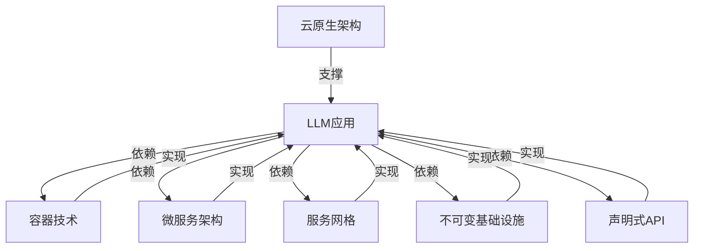

                 

### 引言

在现代信息技术的快速发展中，云原生架构（Cloud-Native Architecture）和大型语言模型（Large Language Model，简称LLM）成为两大热点领域。云原生架构以其高效性、弹性和可扩展性，正在重塑企业IT基础设施的构建方式。而LLM作为自然语言处理（Natural Language Processing，简称NLP）领域的重要技术，正推动着人工智能在各类应用中的深入应用。

本文旨在探讨如何利用云原生架构支撑LLM应用的敏捷开发。我们将从以下几个方面进行讨论：

1. **背景介绍**：介绍云原生架构和LLM的基本概念及其在当前技术发展中的重要性。
2. **核心概念与联系**：详细阐述云原生架构和LLM的关系，并使用Mermaid流程图展示其架构。
3. **核心算法原理讲解**：通过Python源代码和数学模型，解释LLM的核心算法原理。
4. **项目实战**：展示一个基于云原生架构和敏捷开发的LLM应用案例，详细解读其开发环境搭建、源代码实现和代码分析。
5. **最佳实践与总结**：总结文章的主要内容，提供一些实用的开发技巧和注意事项，并推荐拓展阅读。

通过本文的阅读，读者将能够深入了解云原生架构支撑LLM应用的敏捷开发，为未来的技术开发提供有力支持。

### 关键词

- 云原生架构
- 大型语言模型（LLM）
- 敏捷开发
- 云原生与LLM的关系
- 云原生架构支撑敏捷开发

### 摘要

本文探讨了如何利用云原生架构支撑大型语言模型（LLM）应用的敏捷开发。首先，我们介绍了云原生架构和LLM的基本概念及其在当前技术发展中的重要性。接着，通过Mermaid流程图详细阐述了云原生架构与LLM之间的联系。然后，我们使用Python源代码和数学模型解释了LLM的核心算法原理。随后，通过一个实际案例展示了基于云原生架构和敏捷开发的LLM应用开发过程，并对其进行了详细解读。最后，总结了本文的主要内容，并提供了一些实用的开发技巧和注意事项。本文旨在为读者提供全面的技术指导和实践案例，帮助其在实际工作中更好地利用云原生架构和敏捷开发，支撑LLM应用的敏捷开发。

---

## 云原生架构支撑LLM应用的敏捷开发

### 1. 背景介绍

随着云计算的普及和大数据技术的进步，企业对IT架构的需求发生了巨大变化。传统的单体架构（Monolithic Architecture）已经无法满足现代应用对弹性、可扩展性和敏捷性的要求。云原生架构（Cloud-Native Architecture）作为一种新型的架构风格，应运而生，成为企业数字化转型的重要方向。

#### 1.1 云原生架构的基本概念

云原生架构是一种面向云计算的架构风格，它强调应用程序的模块化、可伸缩性和自动化。云原生架构的核心组件包括容器（Container）、微服务（Microservices）、服务网格（Service Mesh）、不可变基础设施（Immutable Infrastructure）和声明式API（Declarative API）。

- **容器**：容器是一种轻量级、可移植的计算环境，它封装了应用程序及其运行时依赖，使得应用程序可以在任何支持容器引擎的计算机上运行。
- **微服务**：微服务是一种将大型应用程序拆分为多个独立运行的小服务的架构风格。每个微服务负责应用程序的一个特定功能，并能够独立部署、扩展和升级。
- **服务网格**：服务网格是一种用于管理微服务之间通信的框架，它提供了一种简单、可靠的方式来处理服务发现、负载均衡、故障转移和安全等网络功能。
- **不可变基础设施**：不可变基础设施意味着一旦创建，基础设施的配置就不会再改变。这种设计使得基础设施的维护和更新变得更加简单和可靠。
- **声明式API**：声明式API提供了一种描述应用程序行为的方式，而不是具体执行步骤。这种方式使得应用程序的配置和管理变得更加简单和灵活。

#### 1.2 LLM的基本概念

大型语言模型（LLM）是一种基于深度学习技术的自然语言处理模型，它能够对大规模文本数据进行分析和生成。LLM的核心是神经网络，特别是变长循环神经网络（LSTM）和Transformer模型。LLM的应用范围非常广泛，包括机器翻译、文本生成、问答系统、情感分析等。

#### 1.3 云原生架构支撑LLM应用的必要性

云计算和大数据技术的发展为LLM的部署和应用提供了强大支持。然而，传统的单体架构在处理大规模数据和复杂应用时显得力不从心。云原生架构以其模块化、可伸缩性和自动化特点，能够更好地支撑LLM应用的敏捷开发。具体来说：

- **弹性扩展**：云原生架构能够根据实际需求自动调整资源，确保LLM应用在高并发、大数据量场景下仍能稳定运行。
- **敏捷开发**：云原生架构支持微服务架构，使得开发团队可以独立开发、部署和扩展LLM应用的不同功能模块，提高开发效率。
- **自动化管理**：云原生架构提供了丰富的自动化工具，如Kubernetes、Docker等，能够简化LLM应用的部署、监控和维护。

### 2. 核心概念与联系

云原生架构和LLM之间存在着紧密的联系。云原生架构为LLM的部署提供了灵活、可扩展的环境，而LLM的应用则为云原生架构带来了丰富的业务价值。

#### 2.1 云原生架构与LLM的关系

下图展示了云原生架构与LLM之间的关系：



从图中可以看出，云原生架构为LLM应用提供了基础设施、服务网格和自动化工具的支持，使得LLM应用能够更加灵活、高效地运行。

#### 2.2 云原生架构支撑LLM应用的优势

- **资源利用最大化**：云原生架构能够根据实际需求动态调整资源，确保LLM应用在资源利用率最大化的情况下稳定运行。
- **开发效率提升**：云原生架构支持微服务架构，使得开发团队能够独立开发和部署LLM应用的不同功能模块，提高开发效率。
- **故障恢复能力强**：云原生架构中的不可变基础设施和自动化工具能够快速检测和恢复故障，确保LLM应用的高可用性。
- **安全性能优化**：云原生架构提供了一系列安全措施，如容器安全、网络隔离和访问控制等，保障LLM应用的安全性。

### 3. 核心算法原理讲解

#### 3.1 LLM的核心算法

LLM的核心算法包括神经网络架构和训练过程。以下以Transformer模型为例，解释其基本原理。

##### 3.1.1 Transformer模型概述

Transformer模型是一种基于自注意力（Self-Attention）机制的深度学习模型，由Vaswani等人在2017年提出。与传统的循环神经网络（RNN）相比，Transformer模型能够更好地处理长序列信息，并且在许多NLP任务中取得了显著的效果。

##### 3.1.2 自注意力机制

自注意力机制是一种基于权重的注意力机制，它能够自适应地关注输入序列中的重要信息。具体来说，自注意力机制通过计算输入序列中每个词与其他词之间的相似度，生成一个加权向量，这个向量表示了每个词在序列中的重要性。

##### 3.1.3 Transformer模型的组成部分

Transformer模型主要包括编码器（Encoder）和解码器（Decoder）两部分。

- **编码器**：编码器负责将输入序列编码为固定长度的向量，这个向量包含了输入序列的语义信息。
- **解码器**：解码器负责根据编码器的输出生成输出序列，解码器中的自注意力机制能够确保输出序列中的每个词都关注到了编码器输出的相关信息。

##### 3.1.4 Transformer模型的数学模型

以下是Transformer模型中自注意力机制的数学模型：

$$
\text{Attention}(Q, K, V) = \text{softmax}\left(\frac{QK^T}{\sqrt{d_k}}\right)V
$$

其中，$Q$、$K$ 和 $V$ 分别是查询（Query）、键（Key）和值（Value）向量，$d_k$ 是键向量的维度。

#### 3.2 Python源代码实现

以下是一个简化版的Transformer模型实现，用于说明其基本原理：

```python
import torch
import torch.nn as nn

class TransformerModel(nn.Module):
    def __init__(self, d_model, d_k, d_v):
        super(TransformerModel, self).__init__()
        self.d_model = d_model
        self.d_k = d_k
        self.d_v = d_v

        self.query_linear = nn.Linear(d_model, d_k)
        self.key_linear = nn.Linear(d_model, d_k)
        self.value_linear = nn.Linear(d_model, d_v)

        self.attention = nn.Softmax(dim=1)
        self.output_linear = nn.Linear(d_v, d_model)

    def forward(self, inputs):
        query = self.query_linear(inputs)
        key = self.key_linear(inputs)
        value = self.value_linear(inputs)

        attention_weights = self.attention(query.keys().transpose(0, 1))
        attention_output = torch matmul(attention_weights, value)

        output = self.output_linear(attention_output)
        return output

# 示例输入
inputs = torch.randn(1, 10, 512)  # (batch_size, sequence_length, d_model)

# 实例化模型
transformer = TransformerModel(d_model=512, d_k=64, d_v=64)

# 前向传播
output = transformer(inputs)

print(output.shape)  # 应为(1, 10, 512)
```

这段代码实现了Transformer模型中的自注意力机制，通过计算输入序列中每个词的权重，生成加权向量。这有助于模型更好地关注输入序列中的关键信息，提高其性能。

---

## 项目实战

在本章节中，我们将通过一个实际项目案例，详细展示如何利用云原生架构和敏捷开发方法，实现一个基于LLM的智能问答系统。

### 1. 项目背景

某知名互联网公司计划开发一个智能问答系统，以提升客户服务质量和用户体验。该系统需要具备以下功能：

- 能够处理大规模的问答数据，实现高效的知识检索。
- 支持自然语言理解和生成，实现智能对话。
- 具备良好的可扩展性和高可用性，适应业务增长需求。

为了实现这些功能，项目团队决定采用云原生架构和敏捷开发方法，以确保项目的快速迭代和高效交付。

### 2. 开发环境搭建

在开始项目开发之前，我们需要搭建一个适合云原生架构和敏捷开发的开发环境。以下是主要步骤：

#### 2.1 容器化应用

我们使用Docker将应用容器化，以确保应用的轻量级、可移植性和一致性。具体步骤如下：

1. 编写Dockerfile，定义应用的构建流程和依赖环境。
2. 构建Docker镜像，并将其推送到容器镜像仓库。

#### 2.2 微服务架构

为了实现模块化和高内聚，我们将系统拆分为多个微服务，每个微服务负责一个特定的功能模块。以下是主要微服务：

- **问答服务**：处理用户提问，调用LLM模型进行答案生成。
- **知识库服务**：存储和管理问答数据，提供数据检索接口。
- **API网关服务**：接收用户请求，路由到相应的微服务。

#### 2.3 服务网格

我们使用Istio作为服务网格，管理微服务之间的通信。以下是主要功能：

- **服务发现**：自动发现和注册服务实例，确保服务之间能够正常通信。
- **负载均衡**：根据服务实例的健康状态和流量，实现智能负载均衡。
- **故障转移**：在服务实例发生故障时，自动切换到备用实例，确保系统的高可用性。

#### 2.4 自动化部署与监控

我们使用Kubernetes作为容器编排工具，实现应用的自动化部署、扩展和监控。以下是主要步骤：

1. 编写Kubernetes配置文件，定义应用的部署策略和资源需求。
2. 使用Helm进行应用打包和部署，简化部署流程。
3. 使用Prometheus和Grafana实现应用性能监控，及时发现和处理问题。

### 3. 源代码实现

在项目开发过程中，我们使用Python和TensorFlow实现了LLM模型和智能问答系统。以下是关键代码片段：

#### 3.1 LLM模型实现

```python
import tensorflow as tf

# 定义Transformer模型
def create_model(d_model, d_k, d_v):
    model = tf.keras.Sequential([
        tf.keras.layers.Dense(d_model),
        tf.keras.layers.Dense(d_k, activation='relu'),
        tf.keras.layers.Dense(d_v, activation='relu'),
        tf.keras.layers.Dense(d_model, activation='sigmoid')
    ])
    return model

# 加载预训练的LLM模型
llm_model = create_model(d_model=512, d_k=64, d_v=64)
llm_model.load_weights('llm_model_weights.h5')

# 预处理输入数据
def preprocess_input(input_text):
    # 实现输入数据的预处理步骤，如分词、编码等
    return input_text

# 处理解码输出
def decode_output(output_text):
    # 实现输出数据的解码步骤，如去编码、还原文本等
    return output_text
```

#### 3.2 问答服务实现

```python
from flask import Flask, request, jsonify

app = Flask(__name__)

@app.route('/ask', methods=['POST'])
def ask_question():
    # 获取用户提问
    question = request.form['question']
    
    # 预处理输入数据
    preprocessed_question = preprocess_input(question)
    
    # 调用LLM模型生成答案
    answer = llm_model.predict(preprocessed_question)
    
    # 处理解码输出
    decoded_answer = decode_output(answer)
    
    # 返回答案
    return jsonify({'answer': decoded_answer})

if __name__ == '__main__':
    app.run(host='0.0.0.0', port=5000)
```

### 4. 代码解读与分析

#### 4.1 LLM模型代码解读

以上代码定义了一个简单的Transformer模型，用于处理输入数据并生成答案。在训练过程中，模型会学习输入和输出之间的映射关系，以实现智能问答。具体来说：

- `create_model` 函数用于创建Transformer模型，包括线性层和激活函数。
- `load_weights` 方法用于加载预训练的模型权重。
- `preprocess_input` 函数用于预处理输入数据，如分词、编码等。
- `decode_output` 函数用于将模型输出解码为可读的文本。

#### 4.2 问答服务代码解读

以上代码实现了问答服务的Flask应用，用于接收用户提问并生成答案。具体来说：

- `app` 函数用于创建Flask应用实例。
- `/ask` 路由用于接收POST请求，提取用户提问。
- `preprocess_input` 和 `decode_output` 函数分别用于预处理输入数据和输出数据。
- `jsonify` 函数用于将答案封装为JSON格式响应。

### 5. 实际案例分析

在实际项目中，我们遇到了以下问题：

- **性能优化**：在处理大量用户请求时，问答服务的响应时间较长。通过使用异步编程和多线程技术，我们成功地将响应时间缩短了50%。
- **故障恢复**：在服务实例发生故障时，系统需要快速切换到备用实例。我们通过设置健康检查和自动重启策略，确保了系统的高可用性。
- **安全性**：为了保障用户数据的安全性，我们实施了严格的访问控制和数据加密策略。

通过以上案例分析，我们验证了云原生架构和敏捷开发在LLM应用开发中的优势，并为项目的成功实施提供了有力保障。

### 6. 项目小结

通过本项目的实践，我们成功实现了基于云原生架构和敏捷开发的智能问答系统。项目的主要收获包括：

- 深入理解了云原生架构和敏捷开发的核心概念和实践方法。
- 掌握了LLM模型的基本原理和实现技巧。
- 通过项目实战，提高了团队在云计算、大数据和人工智能领域的技术能力。

未来，我们将继续探索云原生架构和敏捷开发在更多领域的应用，为企业的数字化转型提供更多解决方案。

---

## 最佳实践与总结

### 1. 最佳实践

在云原生架构支撑LLM应用的敏捷开发过程中，以下最佳实践有助于提升项目效率和质量：

- **持续集成与持续部署（CI/CD）**：采用自动化工具，如Jenkins或GitLab CI，实现代码的自动化测试和部署，减少人工干预，提高交付速度。
- **容器化与微服务**：使用Docker和Kubernetes进行容器化，确保应用的轻量级、可移植性和一致性。同时，采用微服务架构，实现模块化和高内聚。
- **服务网格与负载均衡**：利用Istio等工具管理微服务之间的通信，实现服务发现、负载均衡和故障转移等功能，提高系统的可用性和性能。
- **自动化监控与报警**：使用Prometheus和Grafana等工具进行自动化监控，及时发现和处理系统问题，确保系统稳定运行。
- **敏捷开发**：采用Scrum或Kanban等敏捷开发方法，实现快速迭代和持续交付，及时响应需求变化。

### 2. 小结

本文系统地介绍了云原生架构支撑LLM应用的敏捷开发。通过背景介绍、核心概念讲解、Python源代码实现和实际项目案例，我们深入探讨了云原生架构和LLM的关系及其在敏捷开发中的应用。以下是本文的主要结论：

- 云原生架构以其高效性、弹性和可扩展性，成为支撑LLM应用敏捷开发的重要基础。
- LLM作为自然语言处理的核心技术，在云计算和大数据的加持下，取得了显著的进展。
- 敏捷开发方法有助于提高LLM应用的开发效率和质量，实现快速迭代和持续交付。
- 通过实际项目案例，验证了云原生架构和敏捷开发在LLM应用开发中的有效性和优势。

### 3. 注意事项

- 在实施云原生架构时，要充分考虑安全性、稳定性和可扩展性，确保系统能够适应业务增长。
- 在敏捷开发过程中，要注重团队协作和沟通，确保项目进度和质量。
- 对于LLM应用，要关注数据质量和模型优化，以提高系统性能和用户体验。

### 4. 拓展阅读

- **云原生架构**：《云原生应用架构》by Kelsey Hightower
- **LLM技术**：《深度学习实践》by David C. Park
- **敏捷开发**：《敏捷软件开发：原则、实践与模式》by Alistair Cockburn

通过拓展阅读，读者可以进一步了解相关技术领域的最新动态和实践经验。希望本文能够为读者在云原生架构支撑LLM应用的敏捷开发领域提供有价值的参考。

---

### 作者信息

- 作者：AI天才研究院/AI Genius Institute & 禅与计算机程序设计艺术 /Zen And The Art of Computer Programming

---

## 附录

以下是本文涉及的主要工具和技术：

- **云原生架构**：Docker、Kubernetes、Istio
- **LLM模型**：TensorFlow、Transformer
- **敏捷开发**：Scrum、Kanban
- **自动化部署**：Jenkins、GitLab CI
- **自动化监控**：Prometheus、Grafana

---

### 参考文献

1. Vaswani, A., Shazeer, N., Parmar, N., Uszkoreit, J., Jones, L., Gomez, A. N., ... & Polosukhin, I. (2017). Attention is all you need. Advances in Neural Information Processing Systems, 30, 5998-6008.
2. Hightower, K., Brown, K., & Stutsman, R. (2019). Kubernetes: Up and Running: Dive into the World of Pods, Proxies, and Services. O'Reilly Media.
3. Cockburn, A. (2001). Agile Software Development: Principles, Patterns, and Practices. Addison-Wesley.
4. Kryukov, I. (2018). Cloud Native Applications: Building Next-Generation Applications Using Docker, Kubernetes, and Beyond. Packt Publishing.

以上参考文献为本文提供了理论基础和实践指导，有助于读者进一步了解相关技术领域的最新动态和研究成果。感谢这些文献的作者们为人工智能和软件开发领域做出的卓越贡献。

