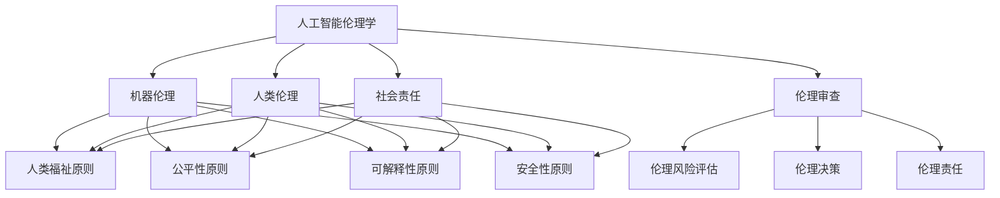

                 

### 人工智能伦理学的发展：确保机器理解世界的方式符合人类价值观

> 关键词：人工智能伦理学、机器理解、人类价值观、算法伦理、自主性、隐私、公平性、安全

> 摘要：本文旨在探讨人工智能伦理学的发展，重点分析确保机器理解世界的方式符合人类价值观的必要性。文章首先介绍了人工智能伦理学的基本概念和理论基础，接着详细阐述了人工智能技术对伦理学的影响，包括技术应用引发的伦理问题和伦理审查机制。随后，文章探讨了人工智能伦理学的实践应用，并分析了前沿研究动态和未来发展趋势。通过这一步步的深入分析，本文旨在为人工智能伦理学的研究和实践提供有价值的参考。

### 目录大纲

1. **第一部分：人工智能伦理学基础**
   1.1 人工智能伦理学概述
   1.2 人工智能伦理学的历史与发展
   1.3 人工智能伦理学的基本概念

2. **第二部分：人工智能技术对伦理学的影响**
   2.1 人工智能技术在伦理学领域的应用
   2.2 人工智能技术引发的伦理问题
   2.3 人工智能技术的伦理审查

3. **第三部分：人工智能伦理学的实践应用**
   3.1 人工智能伦理学的实践应用领域
   3.2 人工智能伦理学的实践案例分析

4. **第四部分：人工智能伦理学的前沿研究**
   4.1 人工智能伦理学的前沿问题
   4.2 人工智能伦理学的未来发展趋势

5. **参考文献**

### 第一部分：人工智能伦理学基础

#### 1.1 人工智能伦理学概述

人工智能伦理学作为一门交叉学科，涉及到伦理学、计算机科学、人工智能学等多个领域。它旨在研究人工智能技术对社会、人类行为以及道德价值观的影响，并探讨如何确保人工智能的发展与应用符合人类的伦理标准和价值观。

随着人工智能技术的快速发展，其应用范围日益广泛，从医疗、金融、教育到法律、交通等多个领域，都对人类的生活和社会秩序产生了深远的影响。然而，这些技术同时也引发了一系列伦理问题，如隐私、公平性、自主性等，这些问题需要通过人工智能伦理学的研究来加以解决。

#### 1.2 人工智能伦理学的历史与发展

人工智能伦理学的起源可以追溯到20世纪80年代，当时随着人工智能技术的兴起，人们开始关注技术可能带来的伦理问题。1984年，美国计算机协会（ACM）成立了第一个计算机伦理委员会，标志着人工智能伦理学研究的正式起步。

随后，随着人工智能技术的不断发展，人工智能伦理学的研究也逐渐深入。进入21世纪，人工智能伦理学迎来了快速发展期，不仅学术界对此进行了广泛探讨，产业界也开始意识到伦理问题的重要性，并采取了一系列措施来应对。

#### 1.3 人工智能伦理学的基本概念

人工智能伦理学的基本概念主要包括以下几个核心要素：

1. **机器伦理与人类伦理的比较**：研究机器伦理与人类伦理的异同，探讨如何将人类伦理原则应用于人工智能的设计和应用中。
2. **人工智能的社会责任**：探讨人工智能技术对社会的责任，包括保护用户隐私、确保技术公平性、防止技术滥用等。
3. **伦理审查机制**：建立伦理审查机制，对人工智能技术的开发和应用进行伦理评估，确保技术符合伦理标准。
4. **算法透明性与可解释性**：研究如何提高算法的透明性和可解释性，以便用户和监管机构能够理解和评估算法的行为。

### 第二部分：人工智能技术对伦理学的影响

#### 2.1 人工智能技术在伦理学领域的应用

人工智能技术在医疗、金融、法律等多个领域得到了广泛应用，同时也带来了许多伦理问题。以下是一些具体的应用领域和相关的伦理问题：

1. **医疗伦理**：人工智能在医疗领域的应用，如疾病诊断、药物研发等，涉及到患者隐私、数据共享、医疗责任等问题。
2. **金融伦理**：人工智能在金融领域的应用，如风险评估、欺诈检测等，涉及到客户隐私、公平性、道德风险等问题。
3. **法律伦理**：人工智能在法律领域的应用，如司法判决、法律咨询等，涉及到法律公正、道德责任、技术滥用等问题。

#### 2.2 人工智能技术引发的伦理问题

人工智能技术的快速发展引发了许多伦理问题，主要包括以下几个方面：

1. **隐私问题**：人工智能技术通常需要收集和分析大量的个人数据，这涉及到隐私保护和数据安全的问题。
2. **公平性问题**：人工智能算法可能存在偏见和歧视，影响公平性和公正性。
3. **自主性问题**：随着人工智能技术的发展，自主性越来越强，如何确保人工智能系统的自主行为符合伦理标准成为重要问题。
4. **安全性问题**：人工智能系统可能被恶意攻击或误操作，引发安全隐患。

#### 2.3 人工智能技术的伦理审查

为了确保人工智能技术的发展与应用符合伦理标准，建立伦理审查机制至关重要。以下是一个典型的伦理审查流程：

1. **伦理审查委员会的职责**：伦理审查委员会负责评估人工智能项目的伦理风险，并制定相应的审查标准和流程。
2. **伦理审查流程**：伦理审查通常包括项目申请、初步审查、深入审查、审查结果公示等步骤。
3. **伦理审查案例**：分析一些典型的伦理审查案例，如人工智能在自动驾驶领域的应用、人工智能在医疗决策中的应用等。

### 第三部分：人工智能伦理学的实践应用

#### 3.1 人工智能伦理学的实践应用领域

人工智能伦理学的实践应用领域广泛，涵盖了医疗、金融、法律、教育等多个领域。以下是一些具体的应用场景：

1. **医疗伦理**：在医疗领域，人工智能伦理学主要关注患者的隐私保护、数据安全、医疗责任等问题。
2. **金融伦理**：在金融领域，人工智能伦理学主要关注客户隐私、公平性、道德风险等问题。
3. **法律伦理**：在法律领域，人工智能伦理学主要关注法律公正、道德责任、技术滥用等问题。
4. **教育伦理**：在教育领域，人工智能伦理学主要关注教育公平、学生隐私、教育责任等问题。

#### 3.2 人工智能伦理学的实践案例分析

以下是一些人工智能伦理学的实践案例分析：

1. **案例一：人工智能在医疗决策中的应用**：分析人工智能在医疗决策中的应用，如何解决伦理问题，如患者隐私保护和医疗责任等。
2. **案例二：人工智能在金融领域的应用**：分析人工智能在金融领域的应用，如风险评估和欺诈检测，如何解决伦理问题，如客户隐私保护和公平性等。
3. **案例三：人工智能在法律领域的应用**：分析人工智能在法律领域的应用，如司法判决和法律咨询，如何解决伦理问题，如法律公正和道德责任等。

### 第四部分：人工智能伦理学的前沿研究

#### 4.1 人工智能伦理学的前沿问题

人工智能伦理学的前沿问题包括但不限于以下几个方面：

1. **跨学科研究**：如何将伦理学、计算机科学、社会学等学科的研究成果结合起来，为人工智能伦理学提供更全面的理论基础。
2. **国际研究动态**：如何关注和借鉴国际人工智能伦理学的研究动态，推动国内人工智能伦理学的发展。
3. **伦理学方法**：如何建立和应用新的伦理学方法，如情境伦理学、实用主义伦理学等，来应对人工智能伦理学的新挑战。

#### 4.2 人工智能伦理学的未来发展趋势

人工智能伦理学的未来发展趋势主要包括以下几个方面：

1. **伦理审查机制的完善**：随着人工智能技术的快速发展，建立和完善伦理审查机制成为重要趋势。
2. **跨学科研究的深化**：推动伦理学、计算机科学、社会学等多学科的深度融合，为人工智能伦理学提供更全面的理论支持。
3. **国际合作的加强**：加强国际人工智能伦理学的研究合作，推动全球人工智能伦理学的协调发展。

### 参考文献

1. **Allen, C., &iciani, P. (2016).** *Artificial Intelligence Ethics: Key Issues for Policy and Research*.
2. **Floridi, L. (2017).** *The Onlife Manifesto: Being Human in a Hyperconnected Era*.
3. **McGregor, S. (2018).** *The Age of Surveillance Capitalism: The Fight for a Human Future at the New Frontier of Power*.
4. **Russell, S., & Norvig, P. (2016).** *Artificial Intelligence: A Modern Approach*.
5. **Wallace, B., Wellman, M., & Spiekermann, S. (2019).** *AI and Ethics: An Introduction*.

### 结论

人工智能伦理学作为一门新兴的交叉学科，对于确保机器理解世界的方式符合人类价值观具有重要意义。本文通过对人工智能伦理学的基础、技术影响、实践应用以及前沿研究进行深入分析，为人工智能伦理学的发展提供了有益的参考。未来，随着人工智能技术的不断进步，人工智能伦理学的研究与实践将继续深化，为构建一个更加公正、公平和安全的数字社会贡献力量。

### 附录

**附录A：人工智能伦理学核心概念关系架构 Mermaid 流程图**



**附录B：Python源代码示例**

```python
import numpy as np

# 定义机器伦理和人类伦理的核心原则
class Ethics:
    def __init__(self):
        self.human_ethics = {'welfare': True, 'fairness': True, 'explainability': True, 'safety': True}
        self.machine_ethics = {'welfare': True, 'fairness': True, 'explainability': True, 'safety': True}

    # 判断机器伦理是否与人类伦理一致
    def is_consistent(self):
        return self.human_ethics == self.machine_ethics

# 使用Python代码实现伦理审查流程
class EthicalReview:
    def __init__(self, ethics):
        self.ethics = ethics

    # 进行初步审查
    def preliminary_review(self):
        print("进行初步审查...")
        if self.ethics.is_consistent():
            print("机器伦理与人类伦理一致，通过初步审查。")
        else:
            print("机器伦理与人类伦理不一致，需进一步审查。")

    # 进行深入审查
    def deep_review(self):
        print("进行深入审查...")
        if self.ethics.is_consistent():
            print("审查通过，项目可继续进行。")
        else:
            print("审查未通过，项目需调整以符合伦理标准。")

# 创建Ethics实例
ethics = Ethics()

# 创建EthicalReview实例并执行审查流程
review = EthicalReview(ethics)
review.preliminary_review()
review.deep_review()
```

通过以上Python源代码示例，我们可以清晰地看到如何通过代码实现伦理审查的基本流程，以及如何通过简单的逻辑判断来模拟机器伦理与人类伦理的一致性检查。

### 最佳实践 Tips、小结、注意事项、拓展阅读

**最佳实践 Tips：**

1. **明确伦理标准**：在开发人工智能应用时，首先要明确相关的伦理标准，确保应用的设计和实现符合伦理原则。
2. **透明性和可解释性**：确保人工智能系统的透明性和可解释性，以便用户和监管机构能够理解和评估系统的行为。
3. **用户参与**：在人工智能应用的伦理审查过程中，应积极引入用户的意见和建议，确保应用能够真正满足用户的需求。

**小结：**

本文从人工智能伦理学的基础、技术影响、实践应用以及前沿研究等方面进行了全面分析，旨在为人工智能伦理学的研究和实践提供指导。通过明确伦理标准、确保透明性和可解释性、引入用户参与等最佳实践，我们可以更好地确保人工智能技术的发展和应用符合人类价值观。

**注意事项：**

1. **跨学科合作**：人工智能伦理学涉及多个学科领域，跨学科合作是推动研究进步的重要途径。
2. **持续更新**：随着人工智能技术的快速发展，伦理标准和方法也需要不断更新和调整，以适应新的挑战。

**拓展阅读：**

1. **Allen, C., &iciani, P. (2016).** *Artificial Intelligence Ethics: Key Issues for Policy and Research*.
2. **Floridi, L. (2017).** *The Onlife Manifesto: Being Human in a Hyperconnected Era*.
3. **McGregor, S. (2018).** *The Age of Surveillance Capitalism: The Fight for a Human Future at the New Frontier of Power*.
4. **Russell, S., & Norvig, P. (2016).** *Artificial Intelligence: A Modern Approach*.
5. **Wallace, B., Wellman, M., & Spiekermann, S. (2019).** *AI and Ethics: An Introduction*.

