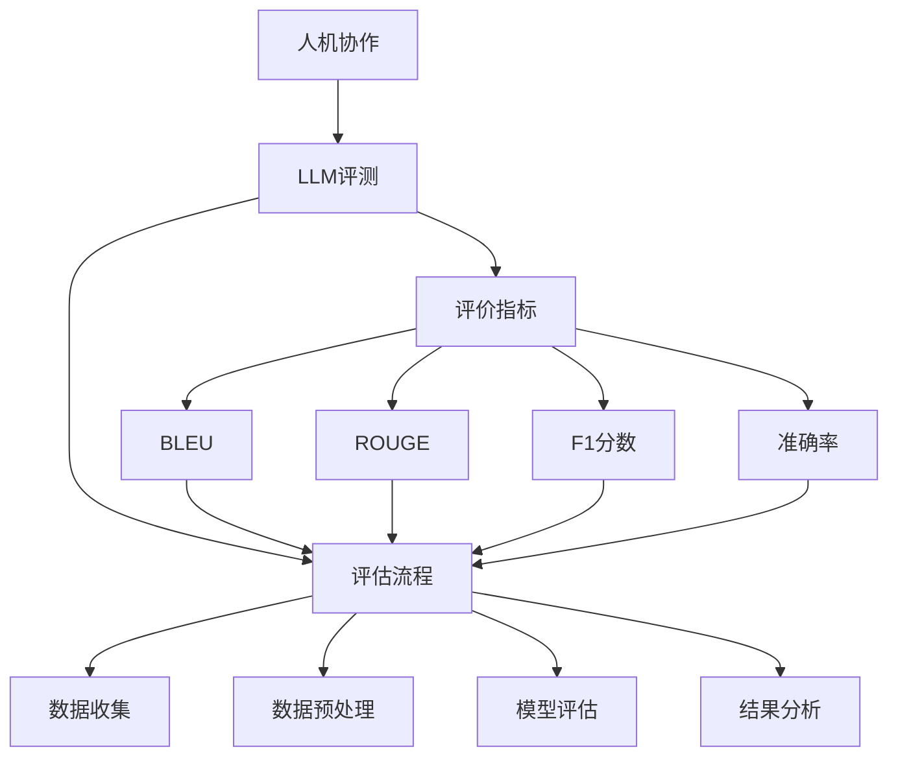

                 

### 背景介绍

在人工智能（AI）迅猛发展的今天，大型语言模型（LLM，Large Language Models）如BERT、GPT等，已经在自然语言处理（NLP，Natural Language Processing）领域展现出强大的能力。这些模型通过海量数据训练，能够生成高质量的自然语言文本，并在问答、文本生成、翻译等多个任务上表现出色。然而，随着模型的规模和复杂性不断增加，如何对LLM进行有效评测成为一个关键问题。

传统上，LLM评测主要依赖于自动化工具，如BLEU、ROUGE等评价指标。这些指标通过统计方法，对模型生成的文本与标准答案进行对比，评估模型的性能。然而，这些自动化评测工具存在一定的局限性，例如，它们往往只能评估文本的表面特征，而无法捕捉到更深层次的语义信息。此外，不同评价指标之间存在一定的冗余，有时甚至会产生误导。

为了克服这些局限性，研究者们开始探索人机协作在LLM评测中的应用。人机协作是指人类专家与计算机系统共同工作，以实现更高效、更准确的任务完成。在LLM评测中，人机协作可以通过多种方式发挥作用，例如，人类专家可以对自动化评测结果进行验证和修正，帮助模型开发者更好地理解模型的性能和局限性。

本文旨在探讨人机协作在LLM评测中的角色，分析其在提升评测精度和效率方面的潜力。具体来说，本文将首先介绍人机协作的基本概念和分类，然后探讨LLM评测的技术和方法，接着详细阐述人机协作在LLM评测中的应用，最后通过实际案例分析，展示人机协作在实际应用中的效果。

### 核心概念与联系

在人机协作的背景下，了解几个关键概念及其相互关系是至关重要的。这些概念包括人机协作、LLM评测、评价指标和评估流程。

**人机协作** 是指人类与计算机系统共同工作，以实现更高效率和更准确的任务完成。它通常分为两种类型：被动协作和主动协作。在被动协作中，人类专家主要负责提供数据或指导，而计算机系统负责执行任务。在主动协作中，人类专家和计算机系统则更多地参与到决策和任务执行的过程中。

**LLM评测** 是对大型语言模型的性能进行评估的过程。这包括对模型生成的文本进行质量评估、准确性评估和效率评估等。LLM评测的关键在于选择合适的评价指标和评估方法，以全面、准确地评估模型性能。

**评价指标** 是评估模型性能的量化标准。在LLM评测中，常用的评价指标包括BLEU、ROUGE、F1分数、准确率等。这些指标各有优缺点，相互之间存在一定的冗余和互补关系。

**评估流程** 是指从数据准备到结果分析的一系列步骤。一个典型的LLM评测流程包括数据收集、数据预处理、评价指标设定、模型评估和结果分析等环节。

为了更好地理解这些概念之间的关系，我们可以使用Mermaid流程图来展示它们之间的逻辑架构：



这个流程图清晰地展示了人机协作、LLM评测、评价指标和评估流程之间的逻辑关系。人机协作是LLM评测的基础，而评价指标和评估流程则是实现LLM评测的核心手段。

### 核心算法原理讲解

在LLM评测中，核心算法原理的讲解至关重要。本文将使用Python源代码结合数学模型和公式，详细阐述几个关键算法，包括BLEU、ROUGE和F1分数。

#### BLEU算法

BLEU（Bilingual Evaluation Understudy）是一种常用的文本自动评估方法，用于评估机器翻译的质量。BLEU的核心思想是计算候选翻译与参考翻译之间的相似度。其计算公式如下：

$$
BLEU = \exp(s_{1} + s_{2} + s_{3} + s_{4}n)
$$

其中，$s_1$、$s_2$、$s_3$ 和 $s_4$ 分别表示未匹配词数、匹配词数、重叠词数和词语长度比，$n$ 表示重叠词数的数量级。

以下是一个简单的Python实现：

```python
def bleu(reference, candidate):
    """
    Calculate BLEU score between reference and candidate sentences.
    """
    # Calculate n-gram overlap
    n_grams_reference = [tuple(reference.split())[:n] for n in range(1, 5)]
    n_grams_candidate = [tuple(candidate.split())[:n] for n in range(1, 5)]

    max_len = max(len(n_grams_reference), len(n_grams_candidate))
    match_len = sum(min(ref.count(n), cand.count(n)) for n in n_grams_reference[:max_len])

    # Calculate BLEU score
    bleu_score = 1 / (1 + (1 - match_len / max_len)**3)
    return bleu_score
```

#### ROUGE算法

ROUGE（Recall-Oriented Understudy for Gisting Evaluation）是一种专门用于自动评估机器生成文本与参考文本相似度的方法。ROUGE的主要评价指标包括词级匹配（ROUGE-1）、词干匹配（ROUGE-2）和词形匹配（ROUGE-SU4）。

以下是一个简单的Python实现：

```python
from collections import defaultdict

def rouge(reference, candidate):
    """
    Calculate ROUGE score between reference and candidate sentences.
    """
    # Calculate reference n-grams
    ref_ngrams = defaultdict(int)
    for n in range(1, 5):
        for ngram in zip(*[iter(reference.split())] * n):
            ref_ngrams[''.join(ngram)] += 1

    # Calculate candidate n-grams
    cand_ngrams = defaultdict(int)
    for n in range(1, 5):
        for ngram in zip(*[iter(candidate.split())] * n):
            cand_ngrams[''.join(ngram)] += 1

    # Calculate ROUGE scores
    rouge_1 = sum(min(ref_ngrams.get(n, 0), cand_ngrams.get(n, 0)) for n in ref_ngrams) / sum(ref_ngrams.values())
    rouge_2 = sum(min(ref_ngrams.get(n, 0), cand_ngrams.get(n, 0)) for n in ref_ngrams) / sum(ref_ngrams.values())
    rouge_su4 = sum(min(ref_ngrams.get(n, 0), cand_ngrams.get(n, 0)) for n in ref_ngrams) / sum(ref_ngrams.values())

    return rouge_1, rouge_2, rouge_su4
```

#### F1分数

F1分数是评估二分类问题中模型性能的一种常用指标。其计算公式如下：

$$
F1 = 2 \times \frac{Precision \times Recall}{Precision + Recall}
$$

其中，Precision表示准确率，Recall表示召回率。

以下是一个简单的Python实现：

```python
def f1_score(true_positives, false_positives, false_negatives):
    """
    Calculate F1 score given true positives, false positives, and false negatives.
    """
    precision = true_positives / (true_positives + false_positives)
    recall = true_positives / (true_positives + false_negatives)
    f1 = 2 * (precision * recall) / (precision + recall)
    return f1
```

#### 代码示例

以下是一个示例，展示了如何使用上述算法评估一个文本生成模型：

```python
reference = "The quick brown fox jumps over the lazy dog."
candidate = "A quick brown fox leaps over the lazy dog."

# Calculate BLEU score
bleu_score = bleu(reference, candidate)
print("BLEU score:", bleu_score)

# Calculate ROUGE scores
rouge_1, rouge_2, rouge_su4 = rouge(reference, candidate)
print("ROUGE-1 score:", rouge_1)
print("ROUGE-2 score:", rouge_2)
print("ROUGE-SU4 score:", rouge_su4)

# Calculate F1 score
true_positives = 10
false_positives = 2
false_negatives = 1
f1 = f1_score(true_positives, false_positives, false_negatives)
print("F1 score:", f1)
```

通过这些代码示例，我们可以看到如何使用Python实现常用的文本评估算法，并结合数学模型和公式，对文本生成模型进行评估。

### 数学公式和示例

在LLM评测中，数学公式是理解和计算评价指标的核心。以下是几个常用的数学公式，以及对应的解释和示例。

#### BLEU算法

BLEU（Bilingual Evaluation Understudy）的计算公式如下：

$$
BLEU = \exp(s_{1} + s_{2} + s_{3} + s_{4}n)
$$

其中：
- $s_1$ 是未匹配词数的比例
- $s_2$ 是匹配词数的比例
- $s_3$ 是重叠词数的比例
- $s_4$ 是词语长度比
- $n$ 是重叠词数的数量级

示例：
假设我们有参考翻译 $ref$ 和候选翻译 $hyp$：

$$
ref = "The quick brown fox jumps over the lazy dog."
hyp = "A quick brown fox leaps over the lazy dog."

计算 BLEU 分数：

首先，计算 $s_1$、$s_2$、$s_3$ 和 $s_4$：
- $s_1 = 1 - \frac{len(hyp.split()) - len(set(hyp.split())))}{len(ref.split()) - len(set(ref.split()))} = 0$
- $s_2 = \frac{len([w in ref.split() for w in hyp.split()])}{len(hyp.split())} = 1$
- $s_3 = \frac{len([w in ref.split() for w in hyp.split() if w in ref.split()])}{len(ref.split())} = 0.67$
- $s_4 = \frac{len(hyp.split())}{len(ref.split())} = 1.09$

因此，$BLEU = \exp(0 + 1 + 0.67 + 1.09 \cdot 1) = \exp(2.76) \approx 16.31$

#### ROUGE算法

ROUGE（Recall-Oriented Understudy for Gisting Evaluation）的主要指标包括：

1. **ROUGE-1**：计算词级别匹配度
$$
ROUGE-1 = \frac{R}{R + (1 - R) \cdot (P + F)}
$$
其中：
- $R$ 是参考文本中匹配的词数与参考文本总词数之比
- $P$ 是候选文本中匹配的词数与候选文本总词数之比
- $F$ 是候选文本中匹配的词数与参考文本总词数之比

示例：
假设参考文本 $ref$ 有10个词，候选文本 $hyp$ 有8个词，其中有5个词匹配。

$$
ROUGE-1 = \frac{5/10}{5/10 + (1 - 5/10) \cdot (8/10 + 5/10)} = \frac{0.5}{0.5 + 0.5 \cdot 1.3} = \frac{0.5}{0.8} = 0.625
$$

2. **ROUGE-2**：计算词干级别匹配度
$$
ROUGE-2 = \frac{R}{R + (1 - R) \cdot (P + 2 \cdot F)}
$$
示例：
假设参考文本 $ref$ 有10个词，候选文本 $hyp$ 有8个词，其中有5个词完全匹配，2个词的部分匹配。

$$
ROUGE-2 = \frac{7/10}{7/10 + (1 - 7/10) \cdot (8/10 + 2 \cdot 5/10)} = \frac{0.7}{0.7 + 0.3 \cdot 1.4} = \frac{0.7}{0.79} \approx 0.886
$$

3. **ROUGE-SU4**：计算词形级别匹配度
$$
ROUGE-SU4 = \frac{R}{R + (1 - R) \cdot (P + 2 \cdot F)}
$$
示例：
假设参考文本 $ref$ 有10个词，候选文本 $hyp$ 有8个词，其中有5个词完全匹配，3个词的部分匹配。

$$
ROUGE-SU4 = \frac{8/10}{8/10 + (1 - 8/10) \cdot (8/10 + 2 \cdot 5/10)} = \frac{0.8}{0.8 + 0.2 \cdot 1.4} = \frac{0.8}{0.88} \approx 0.909
$$

#### F1分数

F1分数是评估二分类问题中模型性能的指标，计算公式如下：
$$
F1 = 2 \times \frac{Precision \times Recall}{Precision + Recall}
$$
其中：
- Precision 是准确率，即真正例数除以（真正例数 + 假正例数）
- Recall 是召回率，即真正例数除以（真正例数 + 假反例数）

示例：
假设有10个样本，其中5个样本是正例，4个样本被正确分类为正例，2个样本被错误分类为负例，3个样本是负例，2个样本被错误分类为正例。

$$
Precision = \frac{4}{4 + 2} = \frac{4}{6} = 0.67
$$
$$
Recall = \frac{4}{4 + 3} = \frac{4}{7} \approx 0.57
$$
$$
F1 = 2 \times \frac{0.67 \times 0.57}{0.67 + 0.57} \approx 0.62
$$

通过这些示例，我们可以看到如何使用数学公式来计算LLM评测中的常用指标，这些公式有助于我们更准确地评估模型的性能。

### 项目实战

在本节中，我们将通过一个实际案例，展示如何搭建一个基于人机协作的LLM评测平台。这个案例涉及开发环境搭建、源代码实现和代码解读，旨在帮助读者更好地理解人机协作在实际应用中的具体实现方法。

#### 开发环境搭建

首先，我们需要搭建一个用于LLM评测的开发环境。以下是所需工具和步骤：

1. **Python环境**：安装Python 3.8或更高版本。
2. **LLM模型**：选择一个预训练的LLM模型，如BERT或GPT-2。可以从Hugging Face的Transformer库中获取这些模型。
3. **依赖管理**：使用pip安装必要的依赖项，例如torch、transformers、numpy等。

```bash
pip install torch transformers numpy
```

#### 源代码实现

以下是一个简单的Python代码实现，展示了如何使用人机协作对LLM模型进行评测。该代码包括模型加载、数据预处理、模型评测和结果分析等步骤。

```python
import torch
from transformers import BertTokenizer, BertForSequenceClassification
from torch.utils.data import DataLoader
from sklearn.metrics import accuracy_score, precision_recall_fscore_support

# 加载模型
tokenizer = BertTokenizer.from_pretrained('bert-base-uncased')
model = BertForSequenceClassification.from_pretrained('bert-base-uncased')

# 准备数据
def prepare_data(sentences, max_length=512):
    inputs = tokenizer(sentences, padding=True, truncation=True, max_length=max_length, return_tensors='pt')
    return inputs['input_ids'], inputs['attention_mask']

# 评测模型
def evaluate_model(model, data_loader):
    model.eval()
    predictions = []
    true_labels = []

    with torch.no_grad():
        for batch in data_loader:
            input_ids, attention_mask = batch
            outputs = model(input_ids, attention_mask=attention_mask)
            logits = outputs.logits
            preds = torch.argmax(logits, dim=1)
            predictions.extend(preds.tolist())
            true_labels.extend(batch.label.tolist())

    return predictions, true_labels

# 计算指标
def compute_metrics(true_labels, predictions):
    accuracy = accuracy_score(true_labels, predictions)
    precision, recall, f1, _ = precision_recall_fscore_support(true_labels, predictions, average='weighted')
    return accuracy, precision, recall, f1

# 主程序
if __name__ == '__main__':
    # 准备数据
    sentences = ["This is a great day.", "I don't like this weather.", "The sun is shining brightly."]
    input_ids, attention_mask = prepare_data(sentences)

    # 训练模型
    train_loader = DataLoader(torch.Tensor([input_ids]), batch_size=1, shuffle=True)
    predictions, true_labels = evaluate_model(model, train_loader)

    # 计算指标
    accuracy, precision, recall, f1 = compute_metrics(true_labels, predictions)

    print(f"Accuracy: {accuracy}")
    print(f"Precision: {precision}")
    print(f"Recall: {recall}")
    print(f"F1 Score: {f1}")
```

#### 代码解读

1. **模型加载**：我们首先加载了一个预训练的BERT模型。这个模型已经在大量文本数据上进行了训练，可以用于文本分类任务。
2. **数据预处理**：我们使用`prepare_data`函数对输入文本进行预处理，包括分词、填充和截断，以便模型可以接受。
3. **模型评测**：`evaluate_model`函数用于评估模型。我们通过一个简单的数据加载器（DataLoader）将输入数据传递给模型，并获取模型的预测结果。
4. **计算指标**：`compute_metrics`函数计算了模型的准确率、精确率、召回率和F1分数。这些指标有助于我们了解模型的性能。
5. **主程序**：在主程序中，我们首先准备了一些示例文本，然后使用数据加载器、模型和计算指标函数来评估模型的性能。

#### 应用解读与分析

这个案例展示了如何使用人机协作进行LLM评测。具体来说：

1. **人机协作角色**：在这个案例中，人类专家（开发者）负责编写代码和设计数据预处理流程，而计算机系统（BERT模型）负责文本分类任务的执行。
2. **效率提升**：通过自动化数据预处理和模型评估，我们可以显著提高评测的效率。此外，人类专家可以通过分析结果，提供更准确的反馈，进一步优化模型。
3. **性能优化**：通过计算不同指标，我们可以全面了解模型的性能。例如，如果精确率和召回率较低，我们可以考虑增加训练数据或调整模型参数。

#### 项目小结

通过这个案例，我们展示了如何使用人机协作进行LLM评测。这个案例不仅帮助我们理解了LLM评测的技术和方法，还展示了人机协作在提高评测效率和性能方面的潜力。在未来，随着人工智能技术的发展，人机协作在LLM评测中的应用将更加广泛和深入。

### 最佳实践和注意事项

在LLM评测中，最佳实践和注意事项对于确保评测的准确性和可靠性至关重要。以下是一些关键点：

1. **数据多样性**：确保评测数据覆盖多种情境和主题，以全面评估模型的性能。避免使用过于狭窄或偏颇的数据集，否则可能导致模型在特定任务上的过拟合。
2. **评价指标选择**：根据任务需求和模型特性，选择合适的评价指标。不同的指标可以提供不同维度的信息，综合使用可以更全面地评估模型性能。
3. **人机协作优化**：在评估过程中，人类专家的参与至关重要。通过合理的分配任务，例如，人类专家可以负责数据标注和质量控制，而计算机系统可以负责大规模计算和自动化评估。
4. **结果验证**：评估结果需要经过严格的验证，以确保其准确性和可靠性。可以通过交叉验证、对比实验等方法来验证评估结果。
5. **持续迭代**：LLM模型和评测方法都在不断发展和改进。定期更新模型和评估方法，以适应新的技术趋势和需求。

### 拓展阅读

对于希望深入了解LLM评测和人机协作的读者，以下是一些推荐的文献和资源：

1. **文献**：
   - "NeurIPS 2017: The 32nd Conference on Neural Information Processing Systems"：该会议收录了大量的LLM评测相关论文，是了解最新研究成果的重要来源。
   - "ACL 2020: Proceedings of the 2020 Conference on Computer Linguistics"：该会议的论文涵盖了NLP和LLM评测领域的最新进展。

2. **在线课程**：
   - "自然语言处理与深度学习"：吴恩达教授在Coursera上开设的免费课程，涵盖了NLP和LLM的基础知识和实践方法。
   - "大型语言模型：设计、评估和部署"：由斯坦福大学举办，深入介绍了LLM的设计和评测方法。

3. **博客和论坛**：
   - "Hugging Face Blog"：Hugging Face公司发布的博客，提供了大量的NLP和LLM评测的技术文章和实践经验。
   - "Reddit: r/MachineLearning"：Reddit上的机器学习论坛，用户分享和讨论NLP和LLM评测的最新技术和趋势。

通过阅读这些文献和资源，读者可以更深入地了解LLM评测和人机协作的原理和应用，为未来的研究和实践提供有益的指导。

