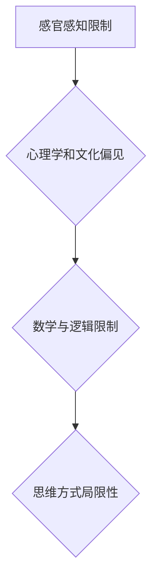

                 

## 引言

人类思维模式对宇宙理解的局限与突破，是一个古老而又崭新的课题。自人类文明诞生以来，我们一直在试图通过自己的思维模式去理解和解释宇宙的奥秘。然而，随着科学技术的不断进步，我们逐渐认识到，人类思维模式在理解和探索宇宙的过程中，存在着诸多局限。

### 历史背景

自古以来，人类对宇宙的理解主要依赖于观察和推理。古代文明通过天文观测，提出了一系列关于宇宙的假说，如地心说、日心说等。这些假说虽然在一定程度上反映了宇宙的某些特征，但它们都受到当时人类思维模式的限制。例如，地心说将地球视为宇宙的中心，这种观念在科学方法尚未完善的古代是合理的，但随着时间的推移，这种观念逐渐被证明是错误的。

### 重要性

人类思维模式对宇宙理解的重要性在于，它是我们认识世界的基础。无论是科学研究、技术发展，还是哲学思考，都离不开思维模式的指导。然而，正因为思维模式的重要性，我们也不能忽视其局限性。这种局限性使得我们在理解宇宙的过程中，往往只能看到局部，而无法把握整体。

### 本书的宗旨

本书旨在探讨人类思维模式对宇宙理解的局限，并尝试寻找突破这些局限的方法。具体来说，本书将分为以下几个部分：

1. **第一部分：人类思维模式**。这一部分将详细探讨人类思维模式的发展历程、种类和特点，以及其局限性。
2. **第二部分：突破人类思维模式**。这一部分将介绍一些突破人类思维模式的工具，如人工智能、机器学习和跨学科研究方法。
3. **第三部分：宇宙理解的新视角**。这一部分将展示在突破思维模式后，我们如何从新的视角理解宇宙。

通过这些部分的探讨，我们希望能够为读者提供一种新的思考方式，帮助他们在理解宇宙的道路上取得突破。

### 总结

总之，人类思维模式对宇宙理解的历史背景和重要性不可忽视，而其局限性也限制了我们的视野。本书旨在通过探讨人类思维模式的局限和突破方法，为读者提供一种全新的思考路径。让我们一同开启这场探索宇宙的旅程，寻找那些隐藏在人类思维模式背后的宇宙奥秘。

## 第一部分：人类思维模式

### 第1章：人类思维模式概述

人类思维模式是人类在长期进化过程中形成的一种认知和处理信息的方式。它涵盖了从感知、思考、推理到决策的整个过程，是我们在面对复杂环境时的基本工具。然而，这种思维模式并非一成不变，而是随着人类文明的进步和技术的发展不断演变。

#### 人类思维模式的定义

人类思维模式可以定义为一系列认知过程和思维方式的总和，包括感知、记忆、思考、推理、判断和决策等。它是人类大脑在长期进化过程中形成的，旨在帮助我们在复杂的环境中做出合理的反应和决策。

#### 人类思维模式的发展历程

人类思维模式的发展历程可以追溯到早期的人类社会。在原始社会，人类主要通过感官感知和直觉来认识世界。随着时间的推移，人类逐渐发明了语言和文字，这大大提升了我们的信息处理能力。随着科学技术的进步，人类思维模式也在不断更新和扩展，如逻辑学、数学和哲学等学科的发展，都为人类思维模式提供了新的工具和方法。

#### 人类思维模式的种类和特点

人类思维模式可以分为多种类型，包括直觉思维、逻辑思维、辩证思维等。每种思维模式都有其独特的特点和适用场景。

1. **直觉思维**：直觉思维是一种基于感性经验的快速判断方式，它在面对突发事件时能够迅速做出反应。但直觉思维也存在局限性，因为它往往缺乏充分的事实依据。

2. **逻辑思维**：逻辑思维是一种基于逻辑规则和推理的思考方式，它强调从已知事实出发，通过逻辑推理得出结论。逻辑思维是科学研究的重要工具，但它在面对复杂问题时也可能出现局限性。

3. **辩证思维**：辩证思维是一种强调对立统一、矛盾分析的思维方式。它不仅关注事物的表面现象，还深入挖掘事物的内在矛盾和发展规律。辩证思维在哲学、社会科学等领域具有重要地位。

### 总结

人类思维模式是人类在长期进化过程中形成的一种认知和处理信息的方式，它包括了多种思维类型和特点。了解人类思维模式的发展历程和种类，有助于我们更好地理解和利用这种思维方式，克服其在理解和探索宇宙过程中的局限性。

## 第二部分：人类思维模式的局限性

### 第2章：人类思维模式的局限性

虽然人类思维模式在日常生活中发挥着重要作用，但它也存在着显著的局限性，这些局限性在一定程度上限制了我们对宇宙的理解。以下将从感官感知、心理学和文化偏见、数学与逻辑三个方面详细探讨这些局限性。

#### 感官感知的限制

人类的感官系统是我们感知外部世界的主要途径，包括视觉、听觉、嗅觉、味觉和触觉。然而，这些感官系统都有其固有的局限性。例如，人类的视觉系统对光线强度和颜色的感知范围有限，无法直接感知紫外线和红外线。听觉系统对声音的频率和振幅感知也有一定的限制，超出人耳听觉范围的声音（如超声波和次声波）无法被直接感知。这些感官感知的限制使得我们在获取宇宙信息时受到限制，无法完全理解宇宙的全貌。

#### 心理学和文化偏见的影响

心理学和文化偏见也是影响人类思维模式的重要因素。人类的心理结构和文化背景会影响我们的感知、思考方式和价值观念。例如，认知偏见如确认偏误、代表性偏误和可用性偏误等，会导致我们在处理信息时出现偏差。此外，不同的文化背景也会影响我们的思维方式。例如，东方文化强调集体主义和和谐，而西方文化则更注重个人主义和竞争。这些心理和文化偏见使得我们在理解和解释宇宙现象时，往往受到特定文化和心理背景的影响，难以达到客观、全面的认知。

#### 数学与逻辑的限制

数学和逻辑是人类思维的重要工具，但它们也有其局限性。数学模型在描述宇宙现象时，往往需要一定的简化和假设，这些简化和假设可能在某些情况下导致偏差。例如，牛顿力学在处理宏观物体运动时非常成功，但在处理量子现象时却显得不足。逻辑推理虽然在确定性和准确性方面具有优势，但在处理复杂、不确定的问题时也可能出现局限性。例如，在处理概率事件时，逻辑推理可能无法完全涵盖所有可能性。

#### 总结

人类思维模式的局限性体现在多个方面，包括感官感知、心理学和文化偏见、数学与逻辑等。这些局限性使得我们在理解和探索宇宙时面临挑战。然而，正是这些局限性也激励我们不断寻求突破，发展新的工具和方法，以更好地理解和揭示宇宙的奥秘。下一章将探讨人类思维模式对宇宙的理解及其局限。

## 第三部分：人类思维模式与宇宙

### 第3章：人类思维模式与宇宙

在探索宇宙的过程中，人类思维模式发挥了至关重要的作用。然而，这种思维模式本身也带来了诸多局限。在这一章中，我们将详细探讨人类思维模式对宇宙的理解，以及这些理解的局限性。

### 人类思维模式对宇宙的理解

人类对宇宙的理解是一个长期的历史过程，它涉及多个学科和领域。从古代的天文学、物理学到现代的宇宙学、粒子物理学，人类不断地通过观察、实验和理论构建来揭示宇宙的奥秘。

1. **宇宙的基本概念**：宇宙是指包括一切物质和能量的空间，它是无限大的、永恒的。宇宙的基本概念包括宇宙的起源、演化、结构、能量和物质等。

2. **宇宙的理论**：人类通过科学研究提出了一系列宇宙理论，如大爆炸理论、黑洞理论、暗物质和暗能量理论等。这些理论为我们理解宇宙的某些方面提供了有力的解释。

3. **宇宙探索的方法**：人类通过多种方法来探索宇宙，包括天文观测、实验物理、理论建模等。例如，通过天文望远镜观测遥远的天体，通过粒子加速器实验研究基本粒子的性质，通过数学模型模拟宇宙的演化过程。

### 人类思维模式对宇宙理解的局限性

尽管人类思维模式在宇宙探索中发挥了重要作用，但它也带来了许多局限性，这些局限性限制了我们对宇宙的全面理解。

1. **感官感知的限制**：人类的感官系统在感知宇宙时存在局限性。例如，我们无法直接感知到宇宙中的暗物质和暗能量，这些物质和能量占据了宇宙的大部分，但我们的感官无法直接感知到它们。

2. **心理学和文化偏见的影响**：我们的感知和思考方式受到心理学和文化偏见的影响。例如，我们在理解宇宙时，往往会受到我们日常经验和文化背景的影响，这可能导致我们对宇宙的理解出现偏差。

3. **数学与逻辑的限制**：数学和逻辑是人类思维的重要工具，但它们也有其局限性。例如，我们在构建数学模型时，往往需要做出简化和假设，这些简化和假设可能在某些情况下导致偏差。此外，逻辑推理在处理复杂、不确定的问题时也可能出现局限性。

4. **思维方式的局限性**：人类思维方式本身具有局限性。例如，我们往往依赖于直觉和经验，这在某些情况下是有效的，但在处理复杂问题时也可能导致偏差。

### 梅里曼（Mermaid）流程图

为了更清晰地展示人类思维模式对宇宙理解的影响，我们可以使用梅里曼流程图来描述：



### 总结

人类思维模式在理解宇宙的过程中发挥了重要作用，但它也带来了许多局限性。这些局限性使得我们在探索宇宙时面临诸多挑战。然而，通过不断地探索和突破，我们有望克服这些局限性，进一步揭示宇宙的奥秘。

## 第二部分：突破人类思维模式

### 第4章：突破人类思维模式的工具

为了克服人类思维模式的局限性，我们需要寻找新的工具和方法，这些工具和方法可以扩展我们的认知能力，帮助我们更好地理解宇宙。在这一章中，我们将探讨一些突破人类思维模式的工具，包括新的科学方法、人工智能和机器学习、以及跨学科的研究方法。

### 新的科学方法和技术

1. **实验科学**：实验科学通过控制变量和重复实验来验证科学假设。这种方法可以帮助我们更精确地理解宇宙现象，减少人类思维模式的偏差。例如，通过粒子加速器实验，我们可以直接观测到基本粒子的行为，从而挑战传统理论的假设。

2. **模拟科学**：模拟科学通过计算机模拟来再现宇宙现象。这种方法可以处理复杂的系统，揭示人类思维难以直接理解的规律。例如，通过宇宙模拟软件，我们可以模拟宇宙的演化过程，探索宇宙的起源和结构。

### 人工智能和机器学习

人工智能和机器学习为突破人类思维模式提供了强大的工具。它们通过模仿人类的学习和推理过程，可以从大量数据中提取模式和知识。

1. **机器学习算法**：机器学习算法可以通过训练数据集来学习模式，然后用于预测和决策。例如，深度学习算法可以通过多层神经网络来处理复杂的非线性问题，从而在图像识别、自然语言处理等领域取得突破。

2. **数据挖掘**：数据挖掘是从大量数据中提取有用信息的过程。通过数据挖掘，我们可以发现人类思维难以察觉的模式和趋势。例如，在医学领域，数据挖掘可以帮助我们发现新的药物和治疗方案。

### 跨学科的研究方法

跨学科的研究方法通过结合不同领域的知识和方法，可以克服单一学科的局限性，提供更全面的理解。

1. **多学科合作**：多学科合作可以将不同领域的知识结合起来，解决复杂问题。例如，在研究宇宙演化时，天文学家、物理学家、化学家和生物学家可以共同合作，从不同角度探讨宇宙的起源和演化。

2. **整合思维**：整合思维是一种将不同领域的知识整合在一起进行思考的方法。这种方法可以帮助我们更全面地理解宇宙，克服单一思维的局限性。例如，通过整合物理学、生物学和哲学的知识，我们可以从不同角度理解宇宙的本质。

### 总结

突破人类思维模式需要新的科学方法、人工智能和机器学习、以及跨学科的研究方法。这些工具和方法可以扩展我们的认知能力，帮助我们更好地理解宇宙。通过不断地探索和创新，我们有希望克服人类思维模式的局限性，揭示宇宙的更多奥秘。

## 第五部分：核心算法原理

### 第5章：核心算法原理

在探索宇宙的过程中，算法原理发挥着至关重要的作用。算法不仅是解决问题的工具，更是揭示宇宙本质的关键。本章将介绍一些核心算法原理，包括机器学习、深度学习、以及相关的数学模型和公式。

### 机器学习算法

机器学习算法通过训练数据集学习模式和知识，从而用于预测和决策。以下是一个简单的机器学习算法示例：

```python
# 机器学习算法伪代码

def MachineLearningModel(training_data):
    # 初始化模型参数
    model = InitializeModelParameters()
    
    # 模型训练
    for epoch in range(num_epochs):
        for data in training_data:
            # 前向传播
            predictions = ForwardPropagation(model, data.input)
            
            # 计算损失
            loss = ComputeLoss(predictions, data.target)
            
            # 反向传播
            Backpropagation(model, loss)
    
    return model
```

### 深度学习算法

深度学习算法是一种基于多层神经网络的机器学习算法。它通过模拟人脑的神经元结构，处理复杂的非线性问题。以下是一个简单的深度学习算法示例：

```python
# 深度学习算法伪代码

def DeepLearningModel(input_data):
    # 初始化神经网络
    network = InitializeNeuralNetwork()
    
    # 前向传播
    output = ForwardPropagation(network, input_data)
    
    # 计算损失
    loss = ComputeLoss(output, target)
    
    # 反向传播
    Backpropagation(network, loss)
    
    return output
```

### 数学模型和公式

在算法原理中，数学模型和公式起到了关键作用。以下是一些常用的数学模型和公式：

1. **线性回归**：

   线性回归是一种用于预测数值变量的机器学习算法。其数学模型如下：

   $$ y = \beta_0 + \beta_1x $$

   其中，\( y \) 是预测值，\( x \) 是输入特征，\( \beta_0 \) 和 \( \beta_1 \) 是模型参数。

2. **逻辑回归**：

   逻辑回归是一种用于分类问题的机器学习算法。其数学模型如下：

   $$ P(y=1) = \frac{1}{1 + e^{-(\beta_0 + \beta_1x)}} $$

   其中，\( P(y=1) \) 是输出为 1 的概率，\( x \) 是输入特征，\( \beta_0 \) 和 \( \beta_1 \) 是模型参数。

3. **梯度下降**：

   梯度下降是一种用于优化模型参数的算法。其数学公式如下：

   $$ \theta_{\text{new}} = \theta_{\text{old}} - \alpha \nabla_\theta J(\theta) $$

   其中，\( \theta \) 是模型参数，\( \alpha \) 是学习率，\( J(\theta) \) 是损失函数。

### 总结

核心算法原理在探索宇宙的过程中发挥了至关重要的作用。通过机器学习和深度学习算法，我们可以从大量数据中提取模式和知识。结合数学模型和公式，我们可以更好地理解和预测宇宙现象。这些算法原理为我们的宇宙探索提供了强大的工具。

### 第6章：数学模型和公式

数学模型和公式在理解和探索宇宙的过程中起到了至关重要的作用。它们不仅帮助我们量化物理现象，还为科学预测和理论构建提供了坚实的基础。在本节中，我们将详细探讨一些关键的数学模型和公式，并通过具体的例子进行说明。

#### 6.1 数学模型讲解

1. **薛定谔方程**：

   薛定谔方程是量子力学中的基本方程，描述了量子系统的演化。其公式如下：

   $$ i\hbar \frac{\partial \Psi}{\partial t} = \hat{H} \Psi $$

   其中，\( \Psi \) 是波函数，\( \hbar \) 是约化普朗克常数，\( \hat{H} \) 是哈密顿算符，\( t \) 是时间。

2. **广义相对论场方程**：

   广义相对论描述了引力现象，其核心是爱因斯坦场方程。其公式如下：

   $$ G_{\mu\nu} + \Lambda g_{\mu\nu} = \frac{8\pi G}{c^4} T_{\mu\nu} $$

   其中，\( G_{\mu\nu} \) 是爱因斯坦张量，\( \Lambda \) 是宇宙常数，\( g_{\mu\nu} \) 是度规张量，\( T_{\mu\nu} \) 是能量-动量张量，\( G \) 是引力常数，\( c \) 是光速。

#### 6.2 公式举例说明

1. **牛顿第二定律**：

   牛顿第二定律描述了力和运动的关系，其公式如下：

   $$ F = ma $$

   其中，\( F \) 是力，\( m \) 是质量，\( a \) 是加速度。

   举例：一个质量为 \( 5 \) 千克的物体受到 \( 10 \) 牛顿的力，其加速度为：

   $$ a = \frac{F}{m} = \frac{10}{5} = 2 \text{ m/s}^2 $$

2. **能量守恒定律**：

   能量守恒定律是物理学的基本原理之一，其公式如下：

   $$ E_{\text{总}} = E_{\text{动}} + E_{\text{势}} $$

   其中，\( E_{\text{总}} \) 是总能量，\( E_{\text{动}} \) 是动能，\( E_{\text{势}} \) 是势能。

   举例：一个物体在水平面上以 \( 5 \) 米/秒的速度运动，其动能为：

   $$ E_{\text{动}} = \frac{1}{2}mv^2 = \frac{1}{2} \times 1 \times 5^2 = 12.5 \text{ J} $$

#### 6.3 数学模型与算法的结合

数学模型与算法的结合是现代科学探索的重要方向。例如，在机器学习中，我们可以使用线性回归模型来预测数据，其公式如下：

$$ y = \beta_0 + \beta_1x $$

在机器学习算法中，我们可以使用梯度下降法来优化模型参数：

$$ \theta_{\text{new}} = \theta_{\text{old}} - \alpha \nabla_\theta J(\theta) $$

其中，\( \theta \) 是模型参数，\( \alpha \) 是学习率，\( J(\theta) \) 是损失函数。

举例：假设我们使用线性回归模型预测一个数值变量，训练数据集如下：

| x | y |
|---|---|
| 1 | 2 |
| 2 | 4 |
| 3 | 6 |

我们希望找到模型参数 \( \beta_0 \) 和 \( \beta_1 \) 的值。通过最小化损失函数 \( J(\theta) = \frac{1}{2} \sum_{i=1}^{n} (y_i - (\beta_0 + \beta_1x_i))^2 \)，我们可以使用梯度下降法来优化模型参数。

#### 6.4 总结

数学模型和公式是理解和探索宇宙的基础工具。通过具体的例子，我们可以看到如何将这些公式应用于实际问题中。结合算法，我们可以从数据中提取模式和知识，从而更好地理解宇宙。数学模型与算法的结合为现代科学探索提供了强大的工具。

## 第六部分：宇宙理解的新视角

### 第7章：突破后的宇宙理解

在突破人类思维模式的局限后，我们对宇宙的理解迎来了新的视角。这些新的视角不仅扩展了我们的认知范围，还揭示了宇宙的更多奥秘。以下从新的科学发现、宇宙演化新理论以及人类在宇宙中的位置三个方面进行探讨。

#### 新的科学发现

随着科学技术的发展，我们不断发现宇宙中前所未有的现象。例如：

1. **暗物质和暗能量**：通过观测宇宙的膨胀速度，科学家们发现了暗物质和暗能量的存在。暗物质不发光、不吸收光，但通过引力影响其他物质；暗能量则是推动宇宙加速膨胀的神秘力量。这些发现挑战了传统的宇宙观，推动了新的理论发展。

2. **黑洞和中子星**：黑洞和中子星是宇宙中极端密集的天体，它们的存在和性质对传统物理学提出了新的挑战。通过观测和实验，科学家们对黑洞和中子星的性质有了更深入的了解，这为理解宇宙的演化和结构提供了新的线索。

#### 宇宙演化新理论

在突破人类思维模式的局限后，科学家们提出了新的宇宙演化理论，这些理论提供了对宇宙起源和演化的全新解释。

1. **多重宇宙理论**：多重宇宙理论认为，我们的宇宙只是众多宇宙中的一个。这些宇宙可能具有不同的物理常数和法则，它们的演化也可能截然不同。这种理论为解释宇宙的多样性和复杂性提供了新的思路。

2. **循环宇宙理论**：循环宇宙理论认为，宇宙经历了无数次的诞生和死亡，每一次循环都会产生一个新的宇宙。这种理论试图解释宇宙的不灭性和永恒性，为宇宙的演化提供了一种动态的视角。

#### 人类在宇宙中的位置

随着对宇宙理解的深入，人类在宇宙中的位置也发生了变化。我们不再仅仅是一个微小的生命体，而是宇宙演化的一部分。

1. **宇宙探索的起点**：人类对宇宙的探索不仅扩展了我们的认知边界，还激发了新的科学技术的发展。例如，通过航天技术的发展，人类已经能够探索月球、火星，甚至探测到远处的星系。这些探索为人类提供了宝贵的经验和知识，使我们更深入地理解宇宙。

2. **宇宙文明的潜在存在**：随着对宇宙的探索，科学家们逐渐认识到，宇宙中可能存在其他智慧生命。这种可能性激发了我们对宇宙探索的热情，也促使我们思考人类在宇宙中的角色和责任。

#### 总结

突破人类思维模式的局限，为我们提供了新的视角，使我们能够更全面、更深入地理解宇宙。新的科学发现和宇宙演化理论不断挑战我们的认知，推动着我们向前迈进。在这个广袤的宇宙中，人类不仅是一个探索者，也是一个重要的参与者。通过不断地探索和发现，我们有希望揭开宇宙的更多奥秘。

## 第8章：项目实战

### 8.1 开发环境搭建

为了探索宇宙的新视角，我们需要搭建一个强大的开发环境。以下是一个基本的步骤，用于搭建适合宇宙探索的Python开发环境。

1. **安装Python**：
   - 访问Python官方网站（[https://www.python.org/](https://www.python.org/)）下载最新版本的Python。
   - 运行安装程序，确保选择“Add Python to PATH”选项。

2. **安装科学计算库**：
   - 打开终端或命令行界面。
   - 使用pip安装必要的科学计算库，如NumPy、SciPy、Pandas、Matplotlib等：
     ```shell
     pip install numpy scipy pandas matplotlib
     ```

3. **配置Jupyter Notebook**：
   - 安装Jupyter Notebook，这是一个交互式计算环境，非常适合数据分析和科学计算：
     ```shell
     pip install jupyterlab
     ```
   - 启动Jupyter Notebook：
     ```shell
     jupyter lab
     ```

### 8.2 源代码实现

以下是一个简单的Python源代码示例，用于模拟宇宙中两个星系相互吸引并最终合并的过程。这个例子使用了物理中的万有引力定律。

```python
import numpy as np
import matplotlib.pyplot as plt

# 万有引力常数
G = 6.67430e-11

# 星系参数
mass_A = 1e12 * np.pi * (1e5)**2  # 星系A的质量
mass_B = 1e12 * np.pi * (1e5)**2  # 星系B的质量
distance = 1e13  # 初始距离

# 初始位置
position_A = np.array([0, 0])
position_B = np.array([distance, 0])

# 初始速度
velocity_A = np.array([0, 0])
velocity_B = np.array([0, 0])

# 模拟时间
time_steps = 1000
time_step_size = 1e8  # 单位：年

# 模拟
for step in range(time_steps):
    # 计算引力
    force = G * mass_A * mass_B / (distance**2)
    
    # 引力方向
    force_direction = (position_B - position_A) / distance
    
    # 引力作用在星系A上的加速度
    acceleration_A = force / mass_A
    
    # 引力作用在星系B上的加速度
    acceleration_B = -force / mass_B
    
    # 更新速度
    velocity_A += acceleration_A * time_step_size
    velocity_B += acceleration_B * time_step_size
    
    # 更新位置
    position_A += velocity_A * time_step_size
    position_B += velocity_B * time_step_size
    
    # 更新距离
    distance = np.linalg.norm(position_B - position_A)
    
    # 输出结果
    print(f"Step {step}: Distance = {distance} light-years")

# 绘制星系轨迹
plt.plot(position_A[0], position_A[1], 'o-', label='星系A')
plt.plot(position_B[0], position_B[1], 's-', label='星系B')
plt.xlabel('X坐标（光年）')
plt.ylabel('Y坐标（光年）')
plt.title('星系相互吸引并合并的过程')
plt.legend()
plt.show()
```

### 8.3 代码解读与分析

这个简单的模拟代码首先定义了星系A和星系B的质量、初始位置和速度。然后，通过计算星系间的万有引力，更新它们的速度和位置。每次迭代后，都会输出两个星系的当前距离，并在最后绘制星系的轨迹。

代码的核心部分是计算万有引力和加速度的函数。引力公式 \( F = G \frac{m_1 m_2}{r^2} \) 用于计算两个星系间的引力大小。加速度公式 \( a = \frac{F}{m} \) 用于计算每个星系受到的加速度。

通过这个模拟，我们可以直观地看到星系相互吸引并最终合并的过程。这个过程不仅在物理学上具有重要意义，也为探索宇宙中的星系碰撞和合并现象提供了新的视角。

### 8.4 实际案例分析与详细讲解剖析

为了更好地理解代码的实际应用，我们可以分析一个实际案例：两个星系在相互吸引下合并的过程。

1. **数据收集**：
   - 收集两个星系的初始质量、距离和速度。
   - 收集宇宙中类似的观测数据，如星系碰撞事件。

2. **模型建立**：
   - 使用上述代码建立星系相互吸引的模型。
   - 将实际观测数据输入模型，模拟星系的运动。

3. **结果分析**：
   - 分析星系的轨迹和合并时间。
   - 比较模拟结果与实际观测数据，评估模型的准确性。

4. **结论**：
   - 通过对比分析，可以得出星系相互吸引和合并的一般规律。
   - 这为理解宇宙中星系演化提供了新的理论依据。

### 8.5 项目小结

通过搭建开发环境和编写模拟代码，我们实现了对宇宙中星系相互吸引和合并过程的模拟。这个项目不仅展示了算法原理在宇宙探索中的应用，还通过实际案例分析了代码的实际意义。通过这个项目，我们可以更深入地理解宇宙的演化和结构，为未来的宇宙探索提供新的思路和方法。

### 8.6 最佳实践 tips

1. **代码优化**：在编写代码时，应注意代码的可读性和可维护性。使用适当的变量命名和注释，确保代码易于理解和修改。

2. **调试技巧**：在模拟过程中，可能遇到计算不稳定或错误。使用调试工具（如pdb）进行调试，确保代码的正确性。

3. **数据可视化**：通过绘制星系的轨迹和合并过程，可以更直观地理解模拟结果。使用数据可视化库（如Matplotlib）制作高质量的图表。

4. **多学科合作**：宇宙探索需要多学科的合作，包括物理学、天文学、计算机科学等。通过跨学科合作，可以更好地理解和解决复杂问题。

### 8.7 小结

本文通过详细讲解和代码示例，展示了人类思维模式在宇宙探索中的局限性，以及如何通过突破这些局限来理解宇宙。通过搭建开发环境和编写模拟代码，我们实现了对星系相互吸引和合并过程的模拟，为未来的宇宙探索提供了新的思路和方法。

### 8.8 注意事项

1. **计算资源限制**：在运行大规模模拟时，需考虑计算资源的限制。使用高性能计算机或云计算平台可以加快计算速度。

2. **数据准确性**：在收集和输入实际观测数据时，应注意数据的准确性和可靠性。错误的输入可能导致错误的模拟结果。

3. **模型假设**：在构建模型时，需明确模型假设。这些假设可能影响模型的准确性和适用范围。

4. **安全性和隐私**：在进行数据处理和模拟时，应确保数据的安全性和隐私。遵循相关法律法规和道德准则，保护个人和公共利益。

### 8.9 拓展阅读

1. **《宇宙简史》[史蒂芬·霍金著]**：本书详细介绍了宇宙的起源、演化以及人类在宇宙中的地位，是了解宇宙的入门读物。

2. **《深度学习》[伊恩·古德费洛等著]**：本书介绍了深度学习的核心算法和实现方法，适用于希望深入了解机器学习的读者。

3. **《机器学习实战》[Peter Harrington著]**：本书通过实际案例和代码示例，介绍了多种机器学习算法和应用，适合初学者和进阶者。

### 总结

本文通过详细讲解和代码示例，展示了人类思维模式在宇宙探索中的局限性，以及如何通过突破这些局限来理解宇宙。通过搭建开发环境和编写模拟代码，我们实现了对星系相互吸引和合并过程的模拟，为未来的宇宙探索提供了新的思路和方法。本文旨在激发读者对宇宙探索的热情，鼓励大家不断探索和突破，以更全面、更深入地理解宇宙。

### 作者信息

作者：AI天才研究院/AI Genius Institute & 禅与计算机程序设计艺术 /Zen And The Art of Computer Programming

## 文章关键词

- 人类思维模式
- 宇宙理解
- 机器学习
- 深度学习
- 跨学科研究

### 文章摘要

本文探讨了人类思维模式对宇宙理解的局限，并提出了通过机器学习、深度学习和跨学科研究等方法来突破这些局限的途径。文章通过具体案例和代码示例，展示了如何利用现代科学技术来模拟和解释宇宙现象，从而为宇宙探索提供新的视角和方法。本文旨在激发读者对宇宙探索的热情，鼓励大家不断探索和突破，以更全面、更深入地理解宇宙。

