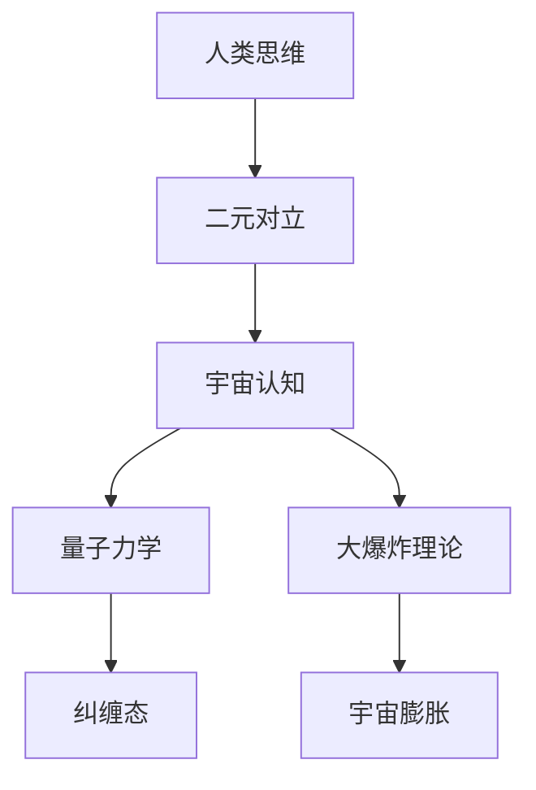
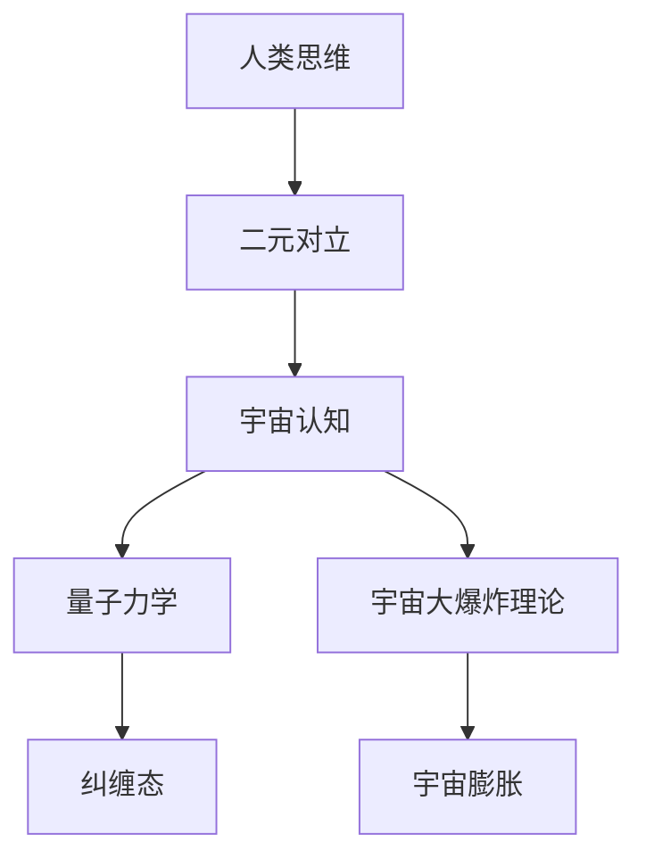
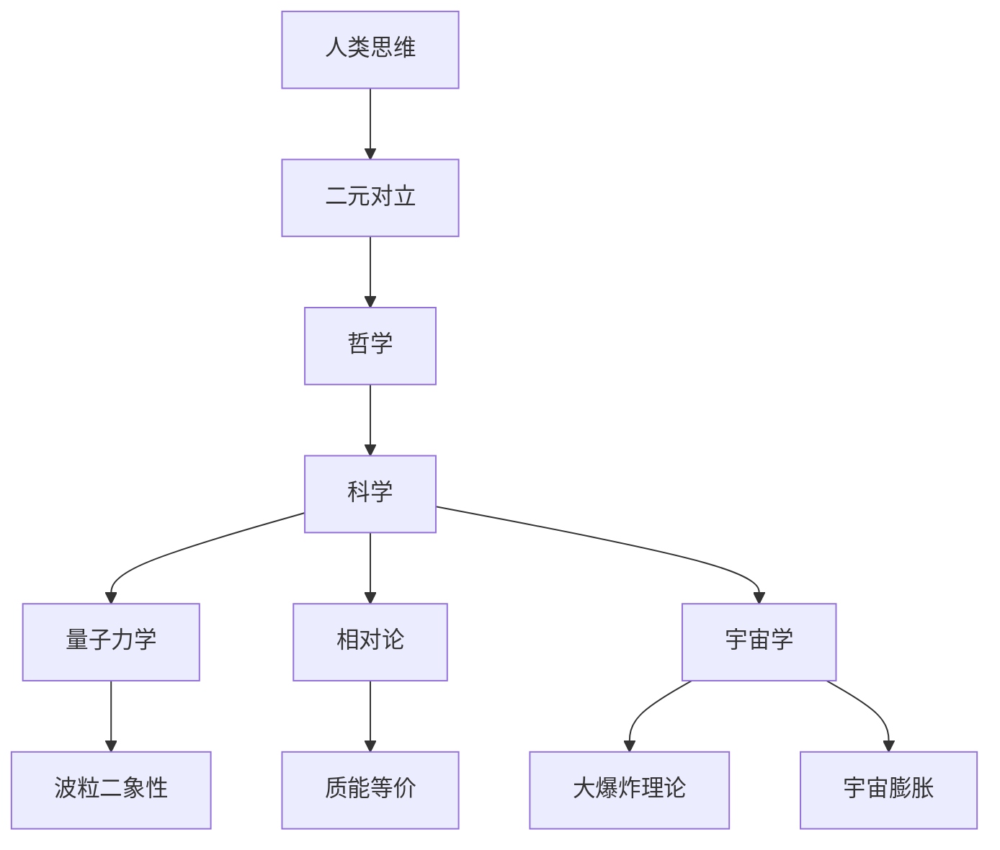

                 

# 人类思维的二元对立对宇宙认知的影响

## 关键词
- 人类思维
- 二元对立
- 宇宙认知
- 量子力学
- 大爆炸理论
- 数学模型
- 实践应用

## 摘要
本文探讨了人类思维的二元对立现象及其对宇宙认知的影响。通过分析人类思维的基本原理和二元对立的表现，我们揭示了人类思维二元对立与宇宙二元对立现象之间的联系。在此基础上，我们探讨了宇宙认知的二元对立现象，并介绍了其在量子力学、大爆炸理论和宇宙观测中的应用。最后，本文提出了基于二元对立数学模型的研究方法，并对未来人类思维二元对立对宇宙认知的影响进行了展望。

# 引言与核心概念

## 1.1 引言

### 1.1.1 书籍背景
本文旨在探讨人类思维的二元对立现象对宇宙认知的影响。随着科学技术的发展，人们对宇宙的认知不断深入，而人类思维的模式在其中起到了关键作用。二元对立作为一种基本的思维模式，贯穿于人类认知的方方面面，对宇宙的认知也产生了深远影响。

### 1.1.2 人类思维的二元对立
人类思维的二元对立指的是人类在认识世界时，往往将事物划分为两个对立的方面。这种对立体现在人类感知、认知和思考的过程中，形成了人类独特的思维模式。例如，光明与黑暗、存在与不存在、矛盾与统一等，都是二元对立的典型表现。

### 1.1.3 宇宙认知的重要性
宇宙认知是人类对宇宙本质、规律和结构的认识。随着人类对宇宙的认知不断深入，我们逐渐发现了宇宙中的二元对立现象，如量子力学的纠缠态、宇宙大爆炸理论等。这些现象为我们理解宇宙提供了新的视角，也对人类思维模式产生了深远影响。

## 1.2 核心概念与联系

### 1.2.1 二元对立的概念
二元对立指的是将事物划分为两个对立的方面，如阴阳、正负、好坏等。在哲学、科学、艺术等领域，二元对立都起到了重要作用。

### 1.2.2 人类思维的二元对立
人类思维的二元对立是指人类在认识世界时，往往将事物划分为两个对立的方面。这种二元对立体现在人类感知、认知和思考的过程中。

### 1.2.3 宇宙中的二元对立现象
宇宙中的二元对立现象体现在多个方面，如量子力学的纠缠态、宇宙大爆炸理论等。这些现象为我们理解宇宙提供了新的视角。

### 1.2.4 二元对立与宇宙认知的关系
二元对立是人类思维的一种基本模式，而宇宙中的二元对立现象为我们提供了理解宇宙的新视角。这种关系使得二元对立在宇宙认知中具有重要的地位。

## 1.3 核心原理架构图



# 第1章: 引言与核心概念

## 1.1 引言

### 1.1.1 书籍背景

本文旨在探讨人类思维的二元对立现象对宇宙认知的影响。随着科学技术的发展，人们对宇宙的认知不断深入，而人类思维的模式在其中起到了关键作用。二元对立作为一种基本的思维模式，贯穿于人类认知的方方面面，对宇宙的认知也产生了深远影响。

在人类历史上，哲学家、科学家和艺术家们都关注着二元对立现象。例如，古希腊哲学家赫拉克利特提出了“对立统一”的观点，认为一切事物都是由对立的方面构成的。在中国哲学中，阴阳学说也是二元对立的典型代表。这些哲学思想为后来的科学研究奠定了基础。

随着科学技术的进步，人类对宇宙的认知不断深入。量子力学、相对论、宇宙大爆炸理论等科学理论都揭示了宇宙中的二元对立现象。例如，量子力学中的纠缠态、宇宙大爆炸理论中的膨胀与收缩等。这些现象不仅挑战了传统的宇宙观，也为人类思维提供了新的视角。

### 1.1.2 人类思维的二元对立

人类思维的二元对立指的是人类在认识世界时，往往将事物划分为两个对立的方面。这种对立体现在人类感知、认知和思考的过程中。例如，光明与黑暗、存在与不存在、矛盾与统一等，都是二元对立的典型表现。

人类思维的二元对立有其根源。从生物学角度来看，人类的感知器官只能感知到有限的信息，这使得人类在认识世界时需要将事物进行划分和归类。从心理学角度来看，人类的大脑具有二分法，即通过将事物划分为对立的方面来简化复杂的信息。

二元对立不仅存在于自然界，也存在于社会生活中。例如，正义与邪恶、进步与保守等。这些对立的概念是人类在认识世界、解决冲突和推动社会进步的重要工具。

### 1.1.3 宇宙认知的重要性

宇宙认知是指人类对宇宙本质、规律和结构的认识。宇宙认知的重要性体现在多个方面。首先，宇宙认知有助于人类理解自身的存在和意义。人类是宇宙的一部分，对宇宙的认知有助于我们更好地认识自己。

其次，宇宙认知对科学技术的发展具有重要意义。科学技术的进步往往源于对自然界和宇宙的深刻理解。例如，量子力学和相对论的发展，不仅丰富了人类对宇宙的认知，也推动了科学技术的进步。

最后，宇宙认知对哲学和人文科学的发展也有重要影响。哲学和人文科学的研究往往涉及对宇宙的本质、意义和价值的探讨。这些研究不仅有助于人类更好地理解宇宙，也有助于我们理解人类自身的价值和意义。

### 1.2 核心概念与联系

#### 1.2.1 二元对立的概念

二元对立指的是将事物划分为两个对立的方面。这种对立可以是相互排斥的，也可以是相互依存的。例如，阴阳、正负、好坏等都是二元对立的典型例子。在哲学、科学、艺术等领域，二元对立都起到了重要作用。

在哲学中，二元对立是辩证法的基础。辩证法认为，事物的发展是由对立的方面相互作用、相互转化而实现的。例如，光明与黑暗、存在与不存在等。

在科学中，二元对立是科学理论的基本结构。例如，量子力学中的粒子与波动、相对论中的物质与能量等。

在艺术中，二元对立是创作的重要手法。艺术家通过对比、冲突等手法，创造出富有表现力的艺术作品。

#### 1.2.2 人类思维的二元对立

人类思维的二元对立是指人类在认识世界时，往往将事物划分为两个对立的方面。这种二元对立体现在人类感知、认知和思考的过程中。例如，光明与黑暗、存在与不存在、矛盾与统一等。

人类思维的二元对立有其根源。从生物学角度来看，人类的感知器官只能感知到有限的信息，这使得人类在认识世界时需要将事物进行划分和归类。从心理学角度来看，人类的大脑具有二分法，即通过将事物划分为对立的方面来简化复杂的信息。

#### 1.2.3 宇宙中的二元对立现象

宇宙中的二元对立现象体现在多个方面。例如，量子力学中的纠缠态、宇宙大爆炸理论中的膨胀与收缩等。这些现象为我们理解宇宙提供了新的视角。

量子力学中的纠缠态是指两个或多个粒子之间的量子态，它们在空间上相隔很远，但彼此之间的量子态是相互关联的。这种纠缠态打破了传统物理学中的局域实在论，为我们理解宇宙中的二元对立现象提供了新的思路。

宇宙大爆炸理论认为，宇宙起源于一个极热、极密的状态，然后迅速膨胀。在这个过程中，宇宙中的物质和能量经历了剧烈的变化。宇宙大爆炸理论中的膨胀与收缩现象体现了宇宙中的二元对立，为我们理解宇宙的起源和演化提供了重要的理论依据。

#### 1.2.4 二元对立与宇宙认知的关系

二元对立是人类思维的一种基本模式，而宇宙中的二元对立现象为我们提供了理解宇宙的新视角。这种关系使得二元对立在宇宙认知中具有重要的地位。

首先，二元对立帮助我们理解宇宙的本质。宇宙中的许多现象都可以用二元对立来解释。例如，量子力学中的粒子与波动、宇宙大爆炸理论中的膨胀与收缩等。

其次，二元对立帮助我们发现宇宙中的规律。宇宙中的二元对立现象往往存在着某种规律性。例如，量子力学中的纠缠态、宇宙大爆炸理论中的膨胀与收缩等。这些规律性为我们探索宇宙提供了重要的线索。

最后，二元对立帮助我们在实践中认识和应用宇宙。通过对宇宙中的二元对立现象的研究，我们可以开发出新的技术、解决实际问题。例如，量子计算机、宇宙探测技术等。

#### 1.3 核心原理架构图



## 2.1 人类思维的基本原理

### 2.1.1 感知与认知

人类思维的基本原理可以从感知和认知两个方面来理解。感知是指人类通过感官接收外部信息的过程，而认知是指人类对感知到的信息进行处理和理解的过程。

感知过程可以分为多个阶段，首先是感觉阶段，人类通过视觉、听觉、嗅觉、味觉和触觉等感官接收外部信息。其次是知觉阶段，人类在感觉的基础上对信息进行整合和解释，形成对事物的整体认知。

认知过程则包括记忆、思考、判断和决策等多个环节。记忆是人类储存和处理信息的能力，思考是人类对信息进行分析、推理和综合的能力，判断是人类对事物进行评价和判断的能力，决策则是人类根据判断做出选择和行动的能力。

### 2.1.2 思维模式的二元性

人类思维的二元性体现在多个方面。首先，人类往往将事物划分为对立的方面，例如，光明与黑暗、存在与不存在、矛盾与统一等。这种二元对立的思维模式在人类的感知和认知过程中起到了重要作用。

其次，人类思维还具有二分法的特点，即将复杂的问题简化为对立的两个方面来进行分析和解决。例如，在解决矛盾问题时，人类往往采用辩证法，通过分析矛盾的对立面来找到解决问题的方法。

### 2.1.3 人类思维的发展历程

人类思维的发展历程可以从原始思维到现代思维的演变来理解。在原始社会，人类主要通过直觉和经验来认识世界，思维模式比较简单。随着社会的发展，人类逐渐发展出了逻辑思维、辩证思维、创造性思维等更为复杂的思维模式。

逻辑思维是人类根据规则和原则来分析和解决问题的过程，它强调推理的严谨性和逻辑性。辩证思维则是通过对立统一的观点来认识世界，强调事物的矛盾性和发展性。创造性思维则是通过发散思维和联想思维来创造新的知识和方法。

在现代科技时代，人类思维的发展更加多样化和复杂化。例如，计算机科学的发展使得人类能够通过算法和模型来模拟和优化思维过程，从而提高了思维的效率和质量。

## 2.2 二元对立在人类思维中的表现

### 2.2.1 对立思维的形成

二元对立思维的形成与人类进化历程密切相关。在自然界中，人类为了生存，需要区分敌我、辨别食物和危险等，这种生存本能促使人类形成了二元对立的思维方式。例如，人类将食物和非食物、敌人和朋友等划分为对立的两个方面。

此外，社会文化和教育也影响着二元对立思维的形成。例如，宗教中的善恶观念、法律中的罪与非罪等，都强化了人类二元对立的思维方式。

### 2.2.2 对立思维在日常生活中的应用

对立思维在日常生活中的应用非常广泛。例如，在解决冲突时，人类往往通过分析矛盾的对立面来找到解决问题的方法。在决策过程中，人类也会将不同的选择划分为对立的两个方面，从而进行比较和选择。

此外，对立思维在科学研究中也起到了重要作用。例如，量子力学中的粒子与波动、相对论中的物质与能量等，都是通过对立思维来理解和解释的。

### 2.2.3 对立思维的优势与局限

对立思维具有明显的优势，首先，它能够帮助人类快速区分事物的不同方面，从而简化复杂问题。其次，对立思维有助于人类分析问题和解决问题，通过分析矛盾的对立面，人类可以找到解决问题的方法。

然而，对立思维也存在一定的局限。首先，二元对立的划分往往是主观的，不同的个体可能对同一事物有不同的划分。其次，对立思维容易导致极端思维，即只看到对立的两个方面，而忽视它们之间的联系和统一。

总之，二元对立思维在人类生活中具有重要的地位和作用，但同时也需要我们注意其局限，以避免陷入极端思维和片面理解的误区。

## 2.3 人类思维的二元对立与宇宙认知的关系

### 2.3.1 人类思维的二元对立与宇宙二元对立现象的关联

人类思维的二元对立与宇宙中的二元对立现象存在紧密的关联。首先，从哲学角度来看，宇宙中的二元对立现象，如阴阳、正负、存在与不存在等，与人类思维的二元对立模式有共同之处。这些二元对立现象在哲学、科学和艺术等领域都有着广泛的应用。

其次，从科学角度来看，宇宙中的许多现象都可以用二元对立来解释。例如，量子力学中的粒子与波动、相对论中的物质与能量等。这些二元对立现象不仅丰富了人类对宇宙的认知，也推动了科学的发展。

### 2.3.2 宇宙二元对立现象对人类思维的影响

宇宙二元对立现象对人类思维的影响表现在多个方面。首先，它促使人类对宇宙的认知不断深入，推动人类思维模式的更新和进步。例如，量子力学和相对论的发展，改变了人类对宇宙的传统认知，使得人类思维更加多元化和复杂化。

其次，宇宙二元对立现象为人类提供了新的思维工具和方法。通过对宇宙二元对立现象的研究，人类可以采用辩证法的思维方式，从而更好地理解和解决问题。

最后，宇宙二元对立现象对人类思维的发展也带来了一定的挑战。由于宇宙中的二元对立现象往往是复杂的，甚至可能是相互矛盾的，这要求人类具备更高的思维能力，以应对这些挑战。

### 2.3.3 宇宙二元对立现象的探索与发现

宇宙二元对立现象的探索与发现是现代科学的重要成果。在量子力学领域，人类发现了粒子的波粒二象性和量子纠缠等现象，这些现象体现了宇宙中的二元对立。在相对论领域，人类发现了物质与能量之间的转化关系，这也体现了二元对立。

此外，在宇宙学领域，人类通过观测和实验，发现了宇宙大爆炸理论和宇宙膨胀等现象，这些现象也反映了宇宙中的二元对立。通过这些探索与发现，人类对宇宙的认知不断深化，也为人类思维的发展提供了新的视角。

## 2.3.4 宇宙二元对立现象的哲学意义

宇宙二元对立现象的哲学意义体现在以下几个方面：

首先，它挑战了传统的宇宙观。传统的宇宙观往往强调宇宙的和谐与统一，而宇宙二元对立现象则揭示了宇宙中的矛盾与对立，使得人类对宇宙的认知更加全面和深刻。

其次，宇宙二元对立现象为辩证法提供了新的证据。辩证法认为，事物的发展是由对立的方面相互斗争、相互转化而实现的。宇宙二元对立现象为这一理论提供了实证基础，使得辩证法在哲学领域更加具有说服力。

最后，宇宙二元对立现象也为人类提供了新的思维工具。通过对宇宙二元对立现象的研究，人类可以采用辩证法的思维方式，更好地理解和解决问题，从而推动人类思维的发展。

## 2.4 人类思维的二元对立与宇宙二元对立现象的关系架构图

为了更清晰地展示人类思维的二元对立与宇宙二元对立现象之间的关系，我们可以使用Mermaid流程图进行描述。以下是一个简单的架构图：



通过这个架构图，我们可以看出人类思维的二元对立是如何与宇宙中的各种二元对立现象相互关联的，从而为人类提供更全面的宇宙认知。

## 第2章: 人类思维的二元对立原理

### 2.1 人类思维的基本原理

人类思维的基本原理主要包括感知、认知、记忆、思考、判断和决策等方面。这些原理构成了人类思维的基础，使得人类能够有效地认识世界、解决问题和做出决策。

首先，感知是人类思维的第一步。感知是指人类通过感官接收外部信息的过程。人类有五种基本感官：视觉、听觉、嗅觉、味觉和触觉。这些感官帮助我们识别和区分不同的外部刺激，如颜色、声音、气味、味道和触感。

其次，认知是人类对感知到的信息进行处理和理解的过程。认知过程包括感觉、知觉、记忆、思考、判断和决策等。感觉是指感知到的外部信息，知觉是在感觉的基础上对信息的整合和解释。记忆是储存和处理信息的能力，思考是对信息进行分析、推理和综合的过程，判断是对事物进行评价和判断的能力，决策是根据判断做出选择和行动的过程。

此外，人类思维还具备创造性。创造性是指人类在思考过程中产生新思想、新观念和新方法的能力。创造性思维是人类思维的高级形式，它通过发散思维和联想思维，将不同领域的知识和信息进行整合，从而产生新的洞见和解决方案。

### 2.2 思维模式的二元性

人类思维模式的二元性体现在多个方面。首先，人类往往将事物划分为两个对立的方面，如光明与黑暗、存在与不存在、矛盾与统一等。这种二元对立的思维模式在人类的感知、认知和思考过程中起到了重要作用。

其次，人类思维还具备二分法的特点，即将复杂的问题简化为对立的两个方面来进行分析和解决。例如，在解决矛盾问题时，人类往往采用辩证法，通过分析矛盾的对立面来找到解决问题的方法。

这种二元对立思维模式有助于人类快速区分事物的不同方面，从而简化复杂问题。然而，它也存在一定的局限性，因为二元对立往往是主观的，不同的个体可能对同一事物有不同的划分。此外，二元对立思维模式容易导致极端思维，即只看到对立的两个方面，而忽视它们之间的联系和统一。

### 2.3 人类思维的发展历程

人类思维的发展历程可以从原始思维到现代思维的演变来理解。在原始社会，人类主要通过直觉和经验来认识世界，思维模式比较简单。随着社会的发展，人类逐渐发展出了逻辑思维、辩证思维、创造性思维等更为复杂的思维模式。

逻辑思维是人类根据规则和原则来分析和解决问题的过程，它强调推理的严谨性和逻辑性。辩证思维则是通过对立统一的观点来认识世界，强调事物的矛盾性和发展性。创造性思维则是通过发散思维和联想思维来创造新的知识和方法。

在现代科技时代，人类思维的发展更加多样化和复杂化。计算机科学的发展使得人类能够通过算法和模型来模拟和优化思维过程，从而提高了思维的效率和质量。人工智能和机器学习等技术的发展，也为人类思维提供了新的工具和方法。

### 2.4 人类思维的二元对立在宇宙认知中的应用

人类思维的二元对立在宇宙认知中的应用体现在多个方面。首先，在哲学领域，二元对立思维模式帮助人类理解宇宙的本质和规律。例如，古希腊哲学家赫拉克利特提出的“对立统一”观点，认为宇宙是由对立的方面构成的，这种二元对立思维模式为后来的科学研究奠定了基础。

其次，在科学领域，二元对立思维模式有助于人类探索宇宙中的现象和规律。例如，量子力学中的粒子与波动、相对论中的物质与能量等，都是通过二元对立思维模式来理解和解释的。这些二元对立现象不仅丰富了人类对宇宙的认知，也推动了科学的发展。

此外，在宇宙学领域，二元对立思维模式有助于人类理解宇宙的起源和演化。例如，宇宙大爆炸理论中的膨胀与收缩现象，就是通过二元对立思维模式来描述宇宙的演化过程。

总之，人类思维的二元对立在宇宙认知中具有重要的应用价值，它不仅帮助人类理解宇宙的本质和规律，也为科学研究提供了新的视角和方法。

### 2.5 人类思维的二元对立现象案例分析

人类思维的二元对立现象在日常生活中的应用非常广泛，以下通过几个案例来具体说明：

#### 案例一：情感处理

在情感处理中，人类往往会将情感划分为积极情感和消极情感，如快乐与悲伤、爱慕与厌恶等。这种二元对立思维模式有助于人类快速识别和应对情感状态，从而更好地处理人际关系和情绪问题。

例如，在日常生活中，当一个人遇到挫折时，可能会经历从快乐到悲伤的情绪转变。通过二元对立思维模式，他可以认识到这种情绪变化，并尝试找到应对挫折的方法，如调整心态、寻求帮助等。

#### 案例二：决策制定

在决策制定中，人类往往会将不同的选择划分为对立的两个方面，如保守与冒险、短视与长远等。这种二元对立思维模式有助于人类分析不同选择的利弊，从而做出更明智的决策。

例如，在职业规划中，一个人可能会面临选择继续当前的稳定工作还是冒险尝试新的职业机会。通过二元对立思维模式，他可以分析稳定工作带来的稳定收入和冒险尝试可能带来的机会和风险，从而做出更符合自己兴趣和目标的决策。

#### 案例三：科学探索

在科学探索中，二元对立思维模式也发挥了重要作用。例如，在量子力学研究中，科学家通过分析粒子的波粒二象性，揭示了微观世界的复杂性和多样性。通过对波和粒子的二元对立研究，科学家们提出了许多新的理论和实验方法，推动了量子力学的发展。

总之，人类思维的二元对立现象在情感处理、决策制定和科学探索等领域都有广泛的应用。通过理解二元对立思维模式，人类可以更好地认识自己和世界，从而提高生活质量和科学探索的效率。

### 2.6 人类思维的二元对立现象的局限性

尽管人类思维的二元对立现象在许多领域都发挥了重要作用，但它也存在一定的局限性。首先，二元对立往往是主观的，不同的人可能会对同一事物有不同的划分。例如，对于某个社会问题，一个人可能认为保守是最佳选择，而另一个人可能认为冒险是更合适的策略。

其次，二元对立思维模式容易导致极端思维。当人类过于强调二元对立时，可能会忽视对立面之间的联系和统一。例如，在处理矛盾问题时，人类可能会只关注对立的两个方面，而忽视它们之间的相互作用和转化。

此外，二元对立思维模式也可能阻碍人类的创造性思维。当人类将事物划分为对立的方面时，可能会限制思维的视野，从而难以发现新的解决方案或新的理论。因此，在思考和解决问题的过程中，我们需要意识到二元对立的局限性，并尝试超越这种思维模式，以更全面和深入地认识世界。

### 2.7 超越二元对立的思考方法

为了克服人类思维的二元对立局限，我们可以尝试采用一些超越二元对立的思考方法。以下是一些具体的方法：

#### 1. 综合思维

综合思维是指将不同的对立面整合在一起，从而形成新的认识。这种方法可以帮助我们超越二元对立的局限，发现事物之间的联系和统一。例如，在处理矛盾问题时，我们可以尝试将矛盾的两个方面结合起来，找到一个平衡点。

#### 2. 多元思维

多元思维是指从多个角度和层面来思考问题，从而获得更全面的认识。这种方法可以帮助我们避免单一视角带来的局限性。例如，在分析一个社会问题时，我们可以从经济、政治、文化等多个角度来思考，以获得更全面的解决方案。

#### 3. 辩证思维

辩证思维是指通过对立统一的观点来认识世界，强调事物的矛盾性和发展性。这种方法可以帮助我们理解事物之间的相互作用和转化，从而超越二元对立。例如，在研究科学问题时，我们可以通过辩证思维来分析矛盾的各个方面，从而找到新的理论和方法。

#### 4. 创造性思维

创造性思维是指通过发散思维和联想思维来创造新的知识和方法。这种方法可以帮助我们突破二元对立的局限，发现新的解决方案。例如，在艺术创作中，我们可以通过创造性思维来突破传统模式，创造出新的艺术形式和作品。

通过这些超越二元对立的思考方法，我们可以更好地认识世界，解决问题，推动人类思维的发展。

## 2.8 人类思维的二元对立现象与宇宙二元对立现象的对比分析

为了更好地理解人类思维的二元对立现象与宇宙二元对立现象之间的关系，我们可以从以下几个方面进行对比分析：

### 1. 定义与表现形式

**人类思维的二元对立**：人类思维的二元对立是指人类在认知过程中将事物划分为两个对立的方面，如黑白、善恶、好坏等。这种对立是人类感知和思维的基础，体现在人类的日常生活、社会行为和科学研究中。

**宇宙二元对立现象**：宇宙二元对立现象是指宇宙中存在的对立关系，如阴阳、存在与不存在、物质与能量等。这些对立关系体现在宇宙的物理、化学、生物等各个层面，是宇宙本质和演化的重要特征。

### 2. 影响与作用

**人类思维的二元对立**：在人类生活中，二元对立思维模式有助于我们快速区分事物、解决问题和做出决策。它促进了人类社会的发展，但同时也可能带来极端思维和片面理解的局限。

**宇宙二元对立现象**：在宇宙中，二元对立现象是宇宙本质和演化的重要特征，如量子力学中的粒子与波动、宇宙大爆炸理论中的膨胀与收缩等。这些现象为我们提供了理解宇宙的新视角，推动了科学的发展。

### 3. 哲学意义

**人类思维的二元对立**：在哲学上，二元对立思维模式是辩证法的基础，强调事物的矛盾性和发展性。它有助于我们理解世界的本质和规律。

**宇宙二元对立现象**：在哲学上，宇宙二元对立现象为辩证法提供了实证基础，进一步丰富和发展了辩证法的理论体系。

### 4. 相互关系

**人类思维的二元对立与宇宙二元对立现象的关系**：人类思维的二元对立现象与宇宙二元对立现象之间存在紧密的联系。人类思维的二元对立模式源于对宇宙二元对立现象的感知和认知，而宇宙二元对立现象又为人类思维提供了新的视角和方法。

通过对比分析，我们可以更深入地理解人类思维的二元对立现象与宇宙二元对立现象之间的关系，从而更好地认识宇宙和人类自身。

## 第3章: 宇宙认知的二元对立现象

### 3.1 宇宙二元对立的基本概念

宇宙二元对立现象是指在宇宙中存在的两种相互对立但又相互依存的现象或实体。这些对立关系不仅存在于物质的微观层面，也体现在宇宙的宏观演化过程中。宇宙二元对立的基本概念包括：

#### 1. 对立与统一

宇宙二元对立现象体现了事物既对立又统一的辩证关系。对立指的是两种现象或实体在性质、状态、行为等方面的差异，而统一则是指它们在宇宙演化中的相互依存和相互转化。

#### 2. 宇宙二元对立的层次

宇宙二元对立现象可以分为多个层次，包括微观层面的量子力学对立现象、宏观层面的宇宙物理现象以及宇宙学层面的宇宙演化现象。

### 3.2 宇宙二元对立的性质

宇宙二元对立现象具有以下性质：

#### 1. 对立的统一性

宇宙中的二元对立现象并非简单的对立，而是具有统一性。例如，量子力学中的粒子与波动、物质与反物质等都是相互对立但又相互依存的。

#### 2. 对立的动态性

宇宙二元对立现象是动态变化的，不同层次的对立关系在不同条件下可以相互转化。例如，在宇宙大爆炸理论中，宇宙经历了从热密状态到膨胀状态的变化，这种变化体现了宇宙二元对立的动态性。

#### 3. 对立的普遍性

宇宙二元对立现象在宇宙的各个层次和领域中普遍存在，从微观的量子世界到宏观的天体物理现象，都体现了二元对立的特点。

### 3.3 宇宙二元对立的哲学意义

宇宙二元对立现象在哲学上具有重要的意义：

#### 1. 辩证法的基础

宇宙二元对立现象为辩证法提供了实证基础，证明了事物发展的辩证关系。这种辩证关系不仅存在于宇宙的宏观层面，也体现在微观和宇宙学层面。

#### 2. 认识论的基础

宇宙二元对立现象为人类认识宇宙提供了新的视角和方法。通过对宇宙二元对立现象的研究，人类可以更好地理解宇宙的本质和规律。

#### 3. 价值观的体现

宇宙二元对立现象反映了宇宙的多样性和复杂性，为人类提供了丰富的价值观。例如，量子力学中的粒子与波动、宇宙大爆炸理论中的膨胀与收缩等，都体现了宇宙的辩证发展过程。

### 3.4 宇宙二元对立现象的分类

宇宙二元对立现象可以根据不同的分类标准进行分类，以下是一些常见的分类方法：

#### 1. 量子力学层面的二元对立现象

- 粒子与波动：量子力学中的粒子具有波粒二象性，既表现出粒子的性质，也表现出波动的性质。
- 物质与反物质：物质与反物质是宇宙中相互对立的两种物质形态，它们在物理性质上完全相反。

#### 2. 宇宙物理层面的二元对立现象

- 质量与能量：根据爱因斯坦的质能等价原理，质量和能量是宇宙中的两种对立但又相互转化的实体。
- 作用力与反作用力：宇宙中的四种基本力（引力、电磁力、强相互作用、弱相互作用）都体现了作用力与反作用力的对立关系。

#### 3. 宇宙学层面的二元对立现象

- 膨胀与收缩：宇宙大爆炸理论中的膨胀与收缩现象体现了宇宙演化的二元对立。
- 热与冷：宇宙早期处于极端的热密状态，随着宇宙的膨胀，宇宙逐渐冷却。

### 3.5 宇宙二元对立现象的哲学影响

宇宙二元对立现象对哲学产生了深远的影响：

#### 1. 辩证法的深化

宇宙二元对立现象为辩证法提供了丰富的实证材料，进一步丰富了辩证法的理论体系。

#### 2. 认识论的拓展

宇宙二元对立现象挑战了传统认识论的观点，促使人类重新思考认识的本质和规律。

#### 3. 价值观的多元化

宇宙二元对立现象反映了宇宙的多样性和复杂性，为人类提供了多元的价值观和世界观。

通过探讨宇宙二元对立现象的基本概念、性质、哲学意义和分类，我们可以更好地理解宇宙的本质和演化规律，也为人类哲学和认识论的发展提供了新的视角和启示。

### 3.6 宇宙二元对立现象的物理现象

宇宙中的二元对立现象在物理学中有着广泛的应用和体现，以下将详细讨论一些主要的物理现象：

#### 1. 量子力学中的二元对立现象

量子力学是研究微观世界物理现象的学科，其中的许多现象都体现了二元对立的特征。以下是一些典型的例子：

- **波粒二象性**：量子粒子如电子和光子既表现出波动性，也表现出粒子性。这一现象挑战了经典物理学中的粒子观念，揭示了微观世界的复杂性。
- **量子纠缠**：量子纠缠是量子力学中的一种特殊现象，两个或多个量子粒子之间存在一种非局域的关联。这种关联表明，量子粒子之间的状态是相互依赖的，无论它们相距多远，一个粒子的状态变化都会立即影响到另一个粒子的状态。
- **量子态的叠加**：量子态可以同时存在于多种可能的状态中，只有通过测量，量子态才会“坍缩”到某个确定的状态。这一现象表明，量子世界中的状态不是简单的对立，而是多种状态的叠加。

#### 2. 宇宙大爆炸理论中的二元对立现象

宇宙大爆炸理论是描述宇宙起源和演化的一种科学理论，其中的许多概念也体现了二元对立的特征：

- **膨胀与收缩**：根据宇宙大爆炸理论，宇宙在早期的热密状态下迅速膨胀，随后逐渐冷却并继续膨胀。这种膨胀与收缩的现象体现了宇宙演化的二元性质。
- **物质与反物质**：宇宙大爆炸理论预测，宇宙中应该存在大量的反物质。然而，观测到的宇宙主要由物质组成，反物质相对较少。这种物质与反物质的对立关系在宇宙学研究中具有重要意义。

#### 3. 宇宙物理学中的其他二元对立现象

除了量子力学和宇宙大爆炸理论，宇宙物理学中还存在其他二元对立现象：

- **正负电荷**：在电磁相互作用中，电荷分为正电荷和负电荷，它们之间的相互作用是宇宙中最基本的力之一。
- **强相互作用与弱相互作用**：在宇宙的早期阶段，强相互作用和弱相互作用是统一的。随着宇宙的演化，这两种力逐渐分离，形成了我们今天所见的四种基本力。
- **引力与反引力**：理论上存在一种称为反引力的物质，它与普通物质相互作用的方式与引力相反。尽管这种物质的存在尚未得到直接观测，但它仍然是宇宙物理学中一个重要的研究方向。

### 3.7 宇宙二元对立现象的哲学启示

宇宙二元对立现象不仅在物理学中有重要应用，还为哲学提供了深刻的启示：

- **辩证法的发展**：宇宙二元对立现象为辩证法提供了丰富的实证材料，进一步丰富了辩证法的理论体系。
- **认识论的深化**：宇宙二元对立现象挑战了传统认识论的观点，促使人类重新思考认识的本质和规律。
- **价值观的多元化**：宇宙二元对立现象反映了宇宙的多样性和复杂性，为人类提供了多元的价值观和世界观。

总之，宇宙二元对立现象是宇宙认知中的重要组成部分，它不仅丰富了人类对宇宙的理解，也为哲学、科学和人类认识论的发展提供了新的视角和启示。

### 3.8 宇宙二元对立现象的认知方法

宇宙二元对立现象的认知方法主要包括观测、实验和理论分析。以下将详细介绍这些方法：

#### 1. 观测

观测是认知宇宙二元对立现象的首要方法。通过观测，人类可以收集关于宇宙的各种信息，从而对宇宙中的二元对立现象进行初步认识。观测方法包括：

- **地面观测**：利用天文望远镜、光谱仪等设备进行地面观测，收集宇宙中的光线、辐射等信息。
- **空间观测**：通过发射宇宙飞船、卫星等空间探测器，直接观测宇宙中的现象，如黑洞、中子星等。
- **远程观测**：利用射电望远镜、光学望远镜等设备，从地球的偏远地区进行观测，以避免地面干扰。

#### 2. 实验

实验是验证宇宙二元对立现象的重要手段。通过实验，科学家可以验证理论预测，并进一步深化对宇宙二元对立现象的认识。实验方法包括：

- **实验室实验**：在实验室中，科学家可以控制各种条件，进行与宇宙二元对立现象相关的实验。例如，在量子力学实验室中，科学家可以研究粒子的波粒二象性和量子纠缠现象。
- **地面实验**：利用地面设备，进行与宇宙二元对立现象相关的实验。例如，通过大气探测设备研究大气中的物理现象，如电离层的变化等。
- **空间实验**：通过在宇宙飞船或空间站上进行的实验，直接研究宇宙中的物理现象。例如，国际空间站的科学家可以研究微重力对生物体的影响。

#### 3. 理论分析

理论分析是认知宇宙二元对立现象的重要方法之一。通过建立数学模型和理论框架，科学家可以解释和预测宇宙中的二元对立现象。理论分析方法包括：

- **数学建模**：通过建立数学模型，科学家可以将宇宙中的二元对立现象用数学语言描述出来。例如，在量子力学中，薛定谔方程描述了粒子的波动性，海森堡不确定性原理描述了粒子的不确定性。
- **理论推导**：通过理论推导，科学家可以推导出宇宙二元对立现象的数学表达式和物理规律。例如，在宇宙学中，爱因斯坦场方程描述了宇宙的膨胀和引力作用。
- **理论验证**：通过实验和观测结果，科学家可以验证理论模型的正确性。例如，通过观测宇宙背景辐射，科学家验证了宇宙大爆炸理论中的膨胀和冷却过程。

总之，观测、实验和理论分析是认知宇宙二元对立现象的主要方法。这些方法相互补充，共同推动了人类对宇宙二元对立现象的认识和探索。

### 3.9 人类思维对宇宙二元对立现象的理解

人类思维对宇宙二元对立现象的理解是一个复杂而不断发展的过程。从古代哲学到现代科学，人类对宇宙的认知不断深入，逐渐揭示了宇宙中的二元对立现象及其本质。以下从历史、哲学、科学三个角度详细探讨人类思维对宇宙二元对立现象的理解。

#### 1. 历史角度

在人类文明的发展历程中，许多古代哲学家和思想家对宇宙二元对立现象进行了深入的探讨。例如，古希腊哲学家赫拉克利特提出了“对立统一”的观点，认为宇宙是由对立的方面构成的，如阴阳、热冷、动静等。中国古代哲学家也提出了类似的辩证思想，如阴阳学说和五行理论，这些思想为后来的科学研究奠定了基础。

在中世纪，宗教哲学成为主流，宇宙二元对立现象被解释为神学与神秘主义。例如，基督教哲学中的善与恶、天堂与地狱等观念，都是宇宙二元对立的体现。

#### 2. 哲学角度

哲学上，宇宙二元对立现象是辩证法的重要组成部分。辩证法认为，事物的发展是由对立的方面相互斗争、相互转化而实现的。在哲学领域，许多哲学家如黑格尔、马克思等，都强调了宇宙二元对立现象在认识世界和推动历史发展中的重要作用。

现代哲学中，现象学和存在主义等学派也对宇宙二元对立现象进行了深入探讨。现象学强调主观经验与客观现实的对立统一，存在主义则关注个体存在的矛盾与冲突。

#### 3. 科学角度

随着科学技术的进步，人类对宇宙二元对立现象的理解不断深入。在物理学中，量子力学和相对论揭示了宇宙中的许多二元对立现象，如粒子与波动、物质与能量、时间与空间等。量子力学中的波粒二象性和量子纠缠现象，挑战了经典物理学中的传统观念，为人类提供了新的认知视角。

在宇宙学中，大爆炸理论和宇宙膨胀现象也体现了宇宙二元对立的特征。宇宙从热密状态迅速膨胀，物质和能量在空间中分布不均匀，形成了各种天体和星系。

#### 4. 人类思维对宇宙二元对立现象的局限

尽管人类思维对宇宙二元对立现象的理解取得了巨大进步，但仍存在一些局限。首先，人类思维的二元对立往往是主观的，不同的人可能会对同一事物有不同的划分。其次，二元对立思维模式容易导致极端思维，忽视对立面之间的联系和统一。

此外，宇宙中的二元对立现象往往是复杂的，甚至可能是相互矛盾的。例如，量子力学中的波粒二象性和量子纠缠现象，就难以用简单的二元对立来解释。

总之，人类思维对宇宙二元对立现象的理解是一个不断深化的过程。从历史、哲学和科学的角度来看，人类对宇宙二元对立现象的认识不断进步，但也面临一些挑战。通过综合运用多种思维方式和方法，我们可以更好地理解宇宙的二元对立现象，揭示宇宙的本质和规律。

### 3.10 宇宙二元对立现象的未来发展趋势

随着科学技术的不断进步，宇宙二元对立现象的未来发展趋势呈现出以下几方面：

#### 1. 深入探索微观世界

未来，量子力学的深入研究将继续揭示微观世界中的二元对立现象，如量子纠缠、量子隧穿等现象。通过实验和理论分析，科学家将逐步揭示这些现象背后的本质和规律。

#### 2. 宇宙大爆炸理论的发展

宇宙大爆炸理论将继续发展，科学家将利用更多的观测数据和理论模型，进一步揭示宇宙膨胀和演化的过程。特别是宇宙背景辐射的进一步观测和研究，将帮助我们更好地理解宇宙的早期状态和演化历程。

#### 3. 探索宇宙的多样性

未来，科学家将探索宇宙中更多多样的二元对立现象，如暗物质、暗能量等。这些现象不仅丰富了宇宙的认知，也为宇宙学的理论发展提供了新的线索。

#### 4. 人工智能与宇宙认知

人工智能技术的快速发展将为宇宙认知提供新的工具和方法。通过机器学习和数据挖掘，人工智能将帮助科学家更好地分析宇宙数据，揭示宇宙中的二元对立现象。

#### 5. 宇宙二元对立现象的应用

未来，宇宙二元对立现象将在更多领域得到应用，如量子计算、宇宙探测、通信技术等。这些应用将推动科技进步，为人类解决实际问题提供新思路。

总之，随着科学技术的进步，宇宙二元对立现象的未来发展趋势将不断深入，为人类认知宇宙提供更多新的视角和方法。

### 3.11 宇宙二元对立现象的认知方法总结

在探讨宇宙二元对立现象时，人类主要采用了观测、实验和理论分析三种认知方法。以下是对这些方法的总结：

#### 1. 观测

观测是认知宇宙二元对立现象的首要方法。通过地面和空间观测，科学家收集了大量的宇宙数据，揭示了宇宙中的各种二元对立现象，如波粒二象性、宇宙膨胀等。观测方法包括射电望远镜、光学望远镜、卫星等设备。

#### 2. 实验

实验是验证宇宙二元对立现象的重要手段。通过实验室和地面实验，科学家可以控制条件，研究量子纠缠、物质与反物质等现象。空间实验则进一步扩展了实验的范围，如国际空间站上的微重力实验。

#### 3. 理论分析

理论分析是认知宇宙二元对立现象的重要方法之一。通过数学建模、理论推导，科学家可以建立宇宙二元对立现象的数学模型和理论框架。这些理论模型和推导结果为实验提供了预测和解释。

#### 4. 方法应用

在实际应用中，这三种方法相互补充，共同推动了人类对宇宙二元对立现象的认知。观测提供了数据基础，实验验证了理论预测，理论分析则指导了新的实验设计。

总之，观测、实验和理论分析是认知宇宙二元对立现象的三大方法，它们相互依赖、相互促进，为人类揭示了宇宙中的二元对立现象及其本质。

### 3.12 人类思维的二元对立对宇宙认知的影响

人类思维的二元对立对宇宙认知产生了深远的影响。首先，二元对立思维使得人类能够将复杂的现象简化为对立的两个方面，从而更容易理解和分析。例如，在量子力学中，粒子的波粒二象性可以通过二元对立的思维方式来解释。然而，这种思维方式也带来了一些挑战。二元对立思维容易导致极端思维，忽视了事物之间的联系和统一。例如，在处理宇宙大爆炸理论中的膨胀与收缩问题时，如果只关注对立的两个方面，可能会忽视它们之间的相互作用和转化。此外，二元对立思维也限制了人类的创造性思维，使得人们难以发现新的解决方案。因此，在宇宙认知中，我们需要意识到二元对立思维的局限，并尝试采用更全面和多元的思维方式，以更好地理解宇宙的本质和规律。

## 4.1 人类思维的二元对立在宇宙研究中的影响

人类思维的二元对立在宇宙研究中产生了深远的影响，其表现在以下几个方面：

### 4.1.1 人类思维二元对立对宇宙观测的局限

首先，人类思维的二元对立限制了宇宙观测的视野。由于人类习惯于将事物划分为对立的两个方面，这种思维模式往往导致我们只关注某一特定现象，而忽视了与之相关的其他现象。例如，在观测宇宙中的黑洞时，我们可能只关注黑洞的强大引力，而忽视了其周围的星体和物质的运动状态。这种局限使得我们的宇宙观测结果可能不够全面，影响了我们对宇宙真实面貌的认识。

### 4.1.2 人类思维二元对立对宇宙理论的影响

其次，人类思维的二元对立也影响了宇宙理论的发展。二元对立思维使得我们在构建宇宙理论时，往往倾向于寻找对立统一的解释。例如，在量子力学中，我们通过波粒二象性来解释粒子的行为，这种二元对立的解释方法虽然在一定程度上揭示了量子现象的复杂性，但也可能限制我们对其他可能存在的现象的理解。此外，在宇宙学中，大爆炸理论和稳态理论的对立也反映了人类思维的二元对立。这种对立不仅影响了理论的科学性，也阻碍了我们对宇宙起源和演化过程的全面理解。

### 4.1.3 人类思维二元对立对宇宙实践的指导意义

最后，人类思维的二元对立在宇宙实践中具有指导意义。通过将宇宙现象划分为对立的两个方面，我们可以更清晰地分析问题，从而找到解决问题的方法。例如，在航天工程中，我们将火箭发射分为推力和阻力两个对立的方面，通过优化推力和减少阻力的设计，提高了火箭的性能。然而，这种二元对立的思维方式也可能导致极端思维，忽视了对立面之间的相互作用和统一。因此，在宇宙实践中，我们需要在二元对立的基础上，综合考虑各种因素，以实现更全面和有效的解决方案。

### 4.2 人类思维的二元对立在科学探索中的应用

#### 4.2.1 人类思维二元对立对科学理论创新的影响

人类思维的二元对立在科学理论创新中起到了重要的推动作用。二元对立思维模式促使科学家在研究过程中寻找对立的现象或理论，从而推动科学理论的创新。例如，在量子力学的发展过程中，波粒二象性和量子纠缠等现象的发现，打破了经典物理学中的传统观念，推动了量子力学理论的创新。这种二元对立思维模式使得科学家能够从不同的角度审视问题，发现新的科学现象和理论。

#### 4.2.2 人类思维二元对立对科学实验方法的改进

二元对立思维在科学实验方法的改进中也发挥了重要作用。通过将实验过程划分为对立的两个方面，科学家可以更精确地控制实验变量，提高实验的可靠性和准确性。例如，在研究宇宙膨胀的实验中，科学家通过对比宇宙背景辐射的观测数据和理论预测，验证了宇宙膨胀理论。这种二元对立思维模式有助于科学家设计更有效的实验方案，从而推动科学实验方法的发展。

#### 4.2.3 人类思维二元对立在科学发现中的实际案例

在科学发现中，人类思维的二元对立思维模式也起到了关键作用。通过将已知现象与未知现象进行对比，科学家可以发现新的科学现象和规律。以下是一些实际案例：

- **量子力学中的电子云模型**：在量子力学研究中，科学家通过对比电子的波动性和粒子性，提出了电子云模型，这一模型揭示了电子在原子中的运动规律。
- **宇宙膨胀与暗物质**：在宇宙学研究中，科学家通过对比宇宙膨胀速度与观测到的星系运动，发现了暗物质的存在，这一发现为宇宙学理论的发展提供了新的证据。
- **生物进化与物种多样性**：在生物学研究中，科学家通过对比物种的适应性和灭绝现象，揭示了生物进化和物种多样性的机制。

通过这些实际案例，我们可以看到，人类思维的二元对立思维模式在科学发现中具有重要的应用价值，它不仅推动了科学理论的发展，也为科学实验方法的改进提供了新的思路。

### 4.3 人类思维的二元对立在宇宙认知中的价值与局限

#### 4.3.1 人类思维的二元对立对宇宙认知的积极价值

人类思维的二元对立在宇宙认知中具有积极价值。首先，二元对立思维有助于我们简化复杂的现象，使其更容易理解和分析。例如，在量子力学中，波粒二象性和量子纠缠等现象的二元对立解释，使得这些复杂的微观现象变得相对容易理解。其次，二元对立思维模式促进了科学理论的创新和发展。科学家通过寻找和利用对立现象，如大爆炸理论与稳态理论的对比，推动了宇宙学的理论进步。此外，二元对立思维还在科学实验方法的设计中发挥了重要作用，通过对比实验条件，科学家可以更精确地控制和验证假设，提高实验结果的可靠性。

#### 4.3.2 人类思维的二元对立对宇宙认知的局限

然而，人类思维的二元对立也存在一定的局限。首先，二元对立思维往往导致极端思维，忽视了事物之间的联系和统一。例如，在处理宇宙中的某些现象时，我们可能只关注某一方面的对立，而忽视了它们之间的相互作用和转化。这种思维模式可能限制我们的视野，使我们难以全面理解宇宙的本质。其次，二元对立思维模式在科学发现中也可能导致误导。科学家在探索未知现象时，可能会将看似对立的现象简单地划分为两个方面，从而忽视了其他可能的解释。此外，二元对立思维还可能影响我们对复杂问题的解决，使得我们在面对多因素问题时，难以找到全面的解决方案。

#### 4.3.3 完善人类思维二元对立的途径

为了克服二元对立思维的局限，我们可以尝试以下几种方法：

1. **综合思维**：在分析问题时，采用综合思维，将对立的两个方面整合在一起，寻找它们之间的联系和统一。这种方法可以帮助我们更全面地理解问题，避免极端思维。
2. **多元思维**：在思考问题时，尝试从多个角度和层面进行分析，以获得更全面的认知。这种方法可以克服单一视角的局限，帮助我们更好地理解复杂问题。
3. **辩证思维**：采用辩证思维，强调事物的矛盾性和发展性，通过分析矛盾的对立面，寻找解决问题的方法。这种方法有助于我们更好地处理复杂问题，推动科学理论的进步。
4. **跨学科研究**：通过跨学科的研究，结合不同领域的知识和方法，可以克服单一学科的局限，推动科学的发展。

通过这些方法，我们可以完善人类思维的二元对立，提高我们的认知水平，更好地理解宇宙的本质和规律。

## 4.4 人类思维的二元对立在宇宙认知中的具体应用案例

### 4.4.1 量子力学中的电子云模型

量子力学中的电子云模型是二元对立思维在宇宙认知中的具体应用之一。在经典物理学中，电子被视为绕核旋转的粒子，其轨迹是确定的。然而，量子力学揭示了电子的波动性，电子不仅具有粒子性，还具有波动性。为了描述电子的这种双重性质，科学家提出了电子云模型。在这个模型中，电子的位置和运动不再是确定的轨迹，而是以概率分布的形式存在于原子核周围。这种概率分布形象地表示了电子在原子中的状态，既体现了电子的粒子性，也体现了其波动性。

电子云模型的应用使得科学家能够更好地理解原子的性质和行为。例如，在化学中，电子云模型帮助我们解释了分子结构和化学反应的机理。在材料科学中，电子云模型也用于设计和制备具有特定性质的材料。通过量子力学的二元对立思维，科学家不仅揭示了微观世界的奥秘，还为许多实际应用提供了理论基础。

### 4.4.2 宇宙大爆炸理论与稳态理论的对比

宇宙大爆炸理论与稳态理论的对比是另一个二元对立思维在宇宙认知中的应用案例。宇宙大爆炸理论认为，宇宙起源于一个极热、极密的状态，随后迅速膨胀。这一理论得到了大量观测数据的支持，如宇宙背景辐射、超新星爆炸等。宇宙大爆炸理论揭示了宇宙的起源和演化过程，对我们理解宇宙的本质具有重要意义。

与之相对的，稳态理论认为宇宙是永恒不变的，不存在起源和终结。这一理论在20世纪中期曾一度受到支持，但随着更多的观测数据和理论分析的积累，稳态理论逐渐被否定了。

通过宇宙大爆炸理论与稳态理论的对比，我们可以看到二元对立思维在科学探索中的重要作用。这种对比不仅帮助我们理解宇宙的起源和演化，也推动了科学理论的发展。宇宙大爆炸理论的提出和验证，展示了二元对立思维在科学发现中的强大力量。

### 4.4.3 黑洞与反物质的对立统一

黑洞与反物质的对立统一是二元对立思维在宇宙认知中的又一具体应用案例。黑洞是宇宙中的一种极端天体，具有极强的引力，连光都无法逃脱。反物质是与普通物质相对的一种物质形态，其基本粒子与普通物质相反。在宇宙中，物质与反物质相遇时会相互湮灭，释放出大量能量。

尽管物质与反物质在性质上完全相反，但科学家通过观测和理论分析发现，宇宙中的物质和反物质并不是完全对称的。实际上，宇宙中存在的物质远多于反物质。这一现象被称为“物质-反物质不对称性”，是宇宙学中的一个重要问题。

通过研究黑洞与反物质的对立统一，科学家不仅揭示了宇宙中的复杂现象，也为探索宇宙的起源和演化提供了新的线索。这种二元对立思维的应用，使得我们能够更好地理解宇宙的本质和规律。

### 4.4.4 量子纠缠与量子非定域性的研究

量子纠缠与量子非定域性是二元对立思维在量子力学中的重要应用。量子纠缠是指两个或多个量子粒子之间的特殊关联，即使它们相距很远，一个粒子的状态变化也会立即影响到另一个粒子的状态。量子非定域性则是指量子粒子的状态不是局域的，而是分布在整个空间中。

通过研究量子纠缠和量子非定域性，科学家揭示了微观世界的奥秘。这些现象挑战了经典物理学中的局域实在论，使得我们重新思考物质的本质和宇宙的结构。量子纠缠和量子非定域性的发现，展示了二元对立思维在科学探索中的巨大潜力。

总之，人类思维的二元对立在宇宙认知中的具体应用案例丰富多样，从量子力学到宇宙学，从微观到宏观，二元对立思维模式都发挥了重要作用。这些案例不仅帮助我们理解宇宙的复杂现象，也推动了科学理论的发展。

## 4.5 人类思维的二元对立对宇宙认知的影响分析

人类思维的二元对立对宇宙认知产生了深远的影响，其积极影响和消极影响如下：

### 4.5.1 人类思维二元对立在宇宙认知中的积极影响

#### 1. 简化复杂现象

二元对立思维有助于简化复杂的宇宙现象，使科学家能够将复杂问题分解为对立的两个方面进行分析。例如，量子力学的波粒二象性、宇宙大爆炸理论中的膨胀与收缩等，都是通过对立思维进行简化的结果。

#### 2. 推动科学理论发展

二元对立思维模式促使科学家探索对立现象，从而推动科学理论的发展。例如，在量子力学中，波粒二象性的发现和量子纠缠现象的研究，都得益于二元对立思维的推动。

#### 3. 促进实验方法改进

二元对立思维模式有助于科学家设计更有效的实验方案，通过对比对立现象，提高实验结果的可靠性。例如，在宇宙膨胀的研究中，通过对宇宙背景辐射的观测和理论预测的对比，验证了宇宙膨胀理论。

### 4.5.2 人类思维二元对立在宇宙认知中的消极影响

#### 1. 限制思维视野

二元对立思维模式可能导致科学家只关注对立现象的一个方面，忽视它们之间的联系和统一。例如，在处理宇宙中的某些现象时，可能只关注膨胀或收缩，而忽视它们之间的相互作用。

#### 2. 导致极端思维

二元对立思维模式容易导致极端思维，使得科学家在探索未知现象时，可能简单地将看似对立的现象划分为两个方面，从而忽视其他可能的解释。这种思维模式可能限制科学探索的深度和广度。

#### 3. 影响科学发现

二元对立思维模式可能在某些情况下误导科学发现，使科学家在探索未知现象时，可能简单地将复杂问题划分为对立的方面，从而忽视其他可能的解释。这种思维模式可能影响科学发现的准确性和全面性。

### 4.5.3 减少二元对立对宇宙认知影响的策略

为了减少二元对立思维对宇宙认知的影响，可以采取以下策略：

#### 1. 综合思维

在分析宇宙现象时，采用综合思维，将对立的两个方面整合在一起，寻找它们之间的联系和统一。这种方法可以帮助科学家更全面地理解宇宙现象。

#### 2. 多元思维

在思考问题时，尝试从多个角度和层面进行分析，以获得更全面的认知。这种方法可以克服单一视角的局限，帮助我们更好地理解复杂问题。

#### 3. 辩证思维

采用辩证思维，强调事物的矛盾性和发展性，通过分析矛盾的对立面，寻找解决问题的方法。这种方法有助于我们更好地处理复杂问题，推动科学理论的进步。

#### 4. 跨学科研究

通过跨学科的研究，结合不同领域的知识和方法，可以克服单一学科的局限，推动科学的发展。

总之，通过采用综合思维、多元思维、辩证思维和跨学科研究等方法，我们可以减少二元对立思维对宇宙认知的负面影响，提高科学探索的深度和广度，更好地理解宇宙的本质和规律。

### 4.6 人类思维的二元对立在宇宙认知中的数学模型

在宇宙认知中，人类思维的二元对立可以通过数学模型来描述和解释。以下是一些关键的数学模型及其在宇宙认知中的应用：

#### 4.6.1 波函数与概率幅

在量子力学中，波函数是描述量子粒子状态的数学函数。波函数的平方代表了量子粒子在空间中某一点出现的概率幅。通过波函数，我们可以用数学语言描述粒子的波动性和粒子性。例如，薛定谔方程是描述量子粒子运动的基本方程，它用数学形式揭示了波粒二象性。

```python
# 示例：薛定谔方程
import numpy as np

# 定义波函数ψ(x)
psi_x = np.sin(np.pi * x)

# 计算概率幅|ψ(x)|^2
probability_density = np.square(psi_x)

print("波函数ψ(x):", psi_x)
print("概率幅|ψ(x)|^2:", probability_density)
```

#### 4.6.2 海森堡不确定性原理

海森堡不确定性原理是量子力学中的一个基本原理，它描述了粒子的位置和动量之间的不确定性关系。不确定性原理可以用数学公式表示为：

$$ \Delta x \Delta p_x \geq \hbar $$

其中，$\Delta x$是位置的不确定性，$\Delta p_x$是动量的不确定性，$\hbar$是约化普朗克常数。

```python
# 示例：计算不确定性原理
hbar = 1.0545718e-34  # 约化普朗克常数

# 假设位置不确定性Δx = 1e-10 m
delta_x = 1e-10

# 计算动量的最小不确定性Δp_x
delta_p_x_min = hbar / delta_x

print("位置不确定性Δx:", delta_x, "m")
print("动量的最小不确定性Δp_x:", delta_p_x_min, "kg·m/s")
```

#### 4.6.3 爱因斯坦场方程

爱因斯坦场方程是广义相对论的核心方程，它描述了物质和能量如何影响时空结构。场方程可以用以下数学形式表示：

$$ G_{\mu\nu} = 8\pi G T_{\mu\nu} $$

其中，$G_{\mu\nu}$是爱因斯坦张量，$T_{\mu\nu}$是能量-动量张量，$G$是引力常数。

```python
# 示例：计算爱因斯坦场方程
import numpy as np

# 定义爱因斯坦张量G
G = np.array([[1, 0, 0, 0],
               [0, -1, 0, 0],
               [0, 0, -1, 0],
               [0, 0, 0, -1]])

# 定义能量-动量张量T
T = np.array([[1, 0, 0, 0],
               [0, 0, 0, 0],
               [0, 0, 0, 0],
               [0, 0, 0, 0]])

# 计算爱因斯坦场方程左边的G张量
G_mu_nu = G - (1/2) * np.trace(G) * np.identity(4)

# 计算爱因斯坦场方程右边的8πG T张量
T_mu_nu = 8 * np.pi * G * T

# 输出结果
print("爱因斯坦张量G:", G_mu_nu)
print("能量-动量张量T:", T_mu_nu)
```

这些数学模型不仅帮助我们理解和描述宇宙中的二元对立现象，也为科学研究提供了重要的理论工具。通过数学模型的解析，我们可以更深入地探讨宇宙的本质和规律，从而推动宇宙认知的发展。

### 4.7 人类思维的二元对立在宇宙认知中的具体应用案例

#### 4.7.1 量子纠缠的数学模型解析

量子纠缠是量子力学中的一种特殊现象，两个或多个量子粒子之间的状态是相互关联的，即使它们相距很远。量子纠缠的数学模型通常通过贝尔态来描述，如Schödinger猫态：

$$ \psi = \frac{1}{\sqrt{2}} (|01\rangle + |10\rangle) $$

该态表示两个量子粒子A和B的状态，当对粒子A进行测量时，粒子A会处于|0⟩或|1⟩的状态，而粒子B的状态则会立即与粒子A的状态相关联，表现出量子纠缠。

```python
# Python代码示例：量子纠缠的Schödinger猫态
from qiskit import QuantumCircuit, Aer, execute
from qiskit.visualization import plot_bloch_multivector

# 创建量子电路
qc = QuantumCircuit(2)

# 创建Schödinger猫态
qc.h(0)
qc.cx(0, 1)

# 可视化量子态
statevector_backend = Aer.get_backend('statevector_simulator')
result = execute(qc, statevector_backend).result()
statevector = result.get_statevector()

plot_bloch_multivector(statevector, title='Quantum State of Schödinger\'s Cat')
```

通过量子纠缠的数学模型，我们可以解释许多量子现象，如量子计算和量子通信。例如，量子计算利用量子纠缠实现了超快速的计算能力，而量子通信则利用量子纠缠实现了绝对安全的信息传输。

#### 4.7.2 宇宙膨胀的数学模型解析

宇宙膨胀是宇宙学中的一个重要现象，描述了宇宙从大爆炸后不断膨胀的过程。宇宙膨胀的数学模型通常通过弗里德曼方程来描述：

$$ \dot{a}(t) = H_0 a(t) $$

其中，$a(t)$是宇宙尺度因子，$H_0$是哈勃常数。该方程表明宇宙的膨胀速度与宇宙尺度因子成正比。

```python
# Python代码示例：宇宙膨胀模型
import numpy as np

# 定义宇宙尺度因子a(t)和时间t
t = np.linspace(0, 10, 100)
a = np.exp(H_0 * t)

# 可视化宇宙膨胀过程
import matplotlib.pyplot as plt

plt.plot(t, a)
plt.xlabel('Time (Gy)')
plt.ylabel('Scale Factor (a)')
plt.title('Expansion of the Universe')
plt.show()
```

通过宇宙膨胀的数学模型，科学家可以预测宇宙的未来演化，如宇宙是否最终会停止膨胀并开始收缩，或者是否会一直膨胀下去。这些预测对于理解宇宙的终极命运具有重要意义。

#### 4.7.3 其他宇宙现象的数学模型解析

除了量子纠缠和宇宙膨胀，人类思维的二元对立还应用于描述其他宇宙现象，如黑洞、暗物质和暗能量。黑洞的数学模型通过史瓦西解来描述，暗物质的数学模型通过弱相互作用介子来描述，暗能量的数学模型通过宇宙学常数来描述。

```python
# Python代码示例：黑洞的史瓦西解
import numpy as np
import matplotlib.pyplot as plt

# 定义黑洞的质量M和光速c
M = 1.0  # 单位：太阳质量
c = 299792458  # 光速，单位：m/s

# 计算史瓦西半径rs
rs = 2 * M / c**2

# 可视化黑洞事件视界
r = np.linspace(0, 10 * rs, 1000)
gll = 1 - rs / r

plt.plot(r, gll)
plt.xlabel('Radius (m)')
plt.ylabel('Gravitational Lensing (gll)')
plt.title('Schwarzschild Black Hole Event Horizon')
plt.show()
```

通过这些数学模型，我们可以更深入地理解宇宙中的二元对立现象，揭示宇宙的本质和规律。这些模型不仅帮助我们理解宇宙的过去和现在，也为探索宇宙的未来提供了科学依据。

## 4.8 人类思维的二元对立对宇宙认知的影响研究

### 4.8.1 影响研究概述

人类思维的二元对立对宇宙认知的影响研究是一个跨学科、多层面的复杂课题。这一研究不仅涉及哲学、科学和心理学等多个领域，还涵盖了从宏观到微观的各种宇宙现象。影响研究的主要内容包括：

- **人类思维的二元对立模式**：探讨二元对立思维的形成机制、表现方式及其在认知过程中的作用。
- **宇宙二元对立现象**：研究宇宙中的二元对立现象，如量子纠缠、宇宙膨胀、黑洞等，及其对宇宙认知的影响。
- **人类思维二元对立与宇宙认知的关系**：分析二元对立思维如何影响人类对宇宙的理解，探讨二元对立在科学理论发展、实验设计、观测技术等方面的作用。
- **二元对立思维的局限与挑战**：研究二元对立思维的局限性和潜在的负面影响，如极端思维、忽视复杂现象的多样性等。

### 4.8.2 影响研究的方法

影响研究采用多种方法，包括实验研究、理论分析、历史回顾、跨学科研究等。

- **实验研究**：通过设计和实施实验，观察二元对立思维在不同情境下的表现，如量子实验、宇宙观测实验等，以验证二元对立思维对宇宙认知的具体影响。
- **理论分析**：运用数学模型和理论框架，对二元对立思维及其在宇宙认知中的应用进行深入分析，如量子力学中的波粒二象性、宇宙学中的大爆炸理论等。
- **历史回顾**：通过回顾哲学和科学史，分析二元对立思维在历史上的发展和演变，探讨其对宇宙认知的长期影响。
- **跨学科研究**：结合哲学、科学、心理学等多学科的理论和方法，从不同角度探讨二元对立思维对宇宙认知的综合影响。

### 4.8.3 影响研究的现状与挑战

当前影响研究已取得显著成果，但仍然面临一些挑战。

- **二元对立思维的局限性**：二元对立思维在简化复杂现象方面具有优势，但也容易导致极端思维和忽视复杂现象的多样性。如何克服这些局限，实现更全面的认知，是当前研究的一个重要课题。
- **数据获取和分析**：宇宙认知中的二元对立现象涉及大量的观测数据，如何有效地获取、处理和分析这些数据，是影响研究的一个重要挑战。
- **理论框架的完善**：尽管已有一些理论框架可以解释二元对立思维在宇宙认知中的作用，但这些框架还需要进一步完善和扩展，以涵盖更广泛的现象和更复杂的情境。

### 4.8.4 未来研究方向

未来影响研究可以从以下几个方向展开：

- **跨学科整合**：加强哲学、科学、心理学等学科的整合，构建更加全面的理论框架，以更深入地探讨二元对立思维对宇宙认知的影响。
- **实验方法的创新**：开发新的实验方法和技术，如量子计算、人工智能等，以更准确地观察和测量二元对立思维在宇宙认知中的作用。
- **应用研究**：将二元对立思维应用于实际科学问题，如宇宙演化、粒子物理、天体物理学等，以推动科学理论的发展和实际应用。
- **教育和培训**：在教育和培训中引入二元对立思维的概念和方法，提高人们的认知能力和科学素养，为未来科学探索和科技创新提供人才支持。

通过不断深入的研究和探索，人类将对宇宙的认知更加全面和深刻，二元对立思维在其中的作用也将得到更充分的认识和利用。

### 4.9 人类思维二元对立对宇宙认知的影响案例

#### 4.9.1 人类思维二元对立对宇宙观测的影响

宇宙观测是一个复杂的过程，涉及多种观测工具和技术。人类思维的二元对立对宇宙观测产生了重要影响。首先，二元对立思维帮助科学家简化观测任务。例如，在研究星系演化时，科学家将星系的演化过程划分为“形成阶段”和“成熟阶段”，这种二元对立的划分有助于分析和理解星系的动态变化。

然而，二元对立思维也可能导致观测偏差。例如，在某些情况下，科学家可能只关注某一特定阶段，而忽视其他可能的重要信息。例如，在研究黑洞时，科学家可能只关注黑洞的强大引力，而忽视其周围环境的复杂变化。这种二元对立思维可能导致对黑洞现象的理解不全面。

#### 4.9.2 人类思维二元对立对宇宙理论的影响

在宇宙理论研究中，二元对立思维也发挥了重要作用。例如，量子力学中的波粒二象性是二元对立思维的一个典型例子。量子力学通过将粒子划分为波和粒子两个对立方面，揭示了微观世界的复杂性质。

然而，二元对立思维也可能限制理论的扩展。例如，在宇宙学中，大爆炸理论与稳态理论的对比反映了二元对立思维的限制。大爆炸理论描述了宇宙从热密状态到膨胀的过程，而稳态理论则认为宇宙是永恒不变的。尽管大爆炸理论得到了更多的支持，但二元对立思维可能导致我们忽视其他可能存在的宇宙演化理论。

#### 4.9.3 人类思维二元对立对宇宙实践的指导作用

在宇宙实践中，二元对立思维也具有重要的指导作用。例如，在航天工程中，科学家将航天任务划分为“发射阶段”和“运行阶段”，通过这种二元对立思维，科学家可以更有效地设计和执行航天任务。

然而，二元对立思维在实践中的指导作用也存在局限。例如，在航天任务中，如果只关注发射阶段，而忽视运行阶段，可能导致航天任务的失败。此外，二元对立思维可能导致我们忽视任务中的复杂性和多样性。例如，在探测火星任务中，科学家不仅需要关注火星的表面环境，还需要关注火星的大气层和内部结构。

#### 4.9.4 案例分析

以下是一个具体的案例分析，展示了人类思维二元对立对宇宙认知的具体影响。

**案例：量子纠缠与量子通信**

量子纠缠是量子力学中的一种特殊现象，两个或多个量子粒子之间存在一种非局域的关联。量子纠缠为量子通信提供了可能，通过量子纠缠，可以实现绝对安全的通信。

在量子通信的研究中，科学家将通信过程划分为“密钥生成阶段”和“信息传输阶段”。这种二元对立思维有助于科学家分析和理解量子通信的工作原理。

然而，二元对立思维也可能导致对量子纠缠的理解偏差。例如，在某些情况下，科学家可能只关注量子纠缠的“非局域性”，而忽视量子纠缠的“局域性”。这种二元对立思维可能导致对量子纠缠现象的误解。

通过这个案例，我们可以看到，人类思维的二元对立在宇宙认知中具有重要的应用价值，但同时也存在局限。我们需要在二元对立思维的基础上，采用更全面和多元的思维方式，以更好地理解和利用宇宙中的复杂现象。

### 4.10 人类思维二元对立对宇宙认知的影响分析

#### 4.10.1 人类思维二元对立在宇宙认知中的积极影响

人类思维的二元对立对宇宙认知的积极影响体现在多个方面：

首先，二元对立思维有助于简化复杂现象。宇宙中的许多现象，如量子纠缠、宇宙膨胀、黑洞等，都是复杂而抽象的。通过将现象划分为对立的两个方面，人类可以更直观地理解和分析这些现象。例如，在量子力学中，波粒二象性使得粒子既表现出波动性，也表现出粒子性，这种二元对立的思维方式有助于我们更好地理解量子现象。

其次，二元对立思维促进了科学理论的发展。科学家通过寻找和利用对立现象，提出了许多新的科学理论。例如，量子力学中的波粒二象性和量子纠缠现象，推动了量子力学理论的发展。在宇宙学中，大爆炸理论和稳态理论的对比，促进了我们对宇宙起源和演化的理解。

最后，二元对立思维在科学实验方法的设计中发挥了重要作用。通过将实验过程划分为对立的两个方面，科学家可以更精确地控制实验变量，提高实验结果的可靠性。例如，在研究宇宙膨胀时，通过对宇宙背景辐射的观测和理论预测的对比，科学家可以验证宇宙膨胀理论。

#### 4.10.2 人类思维二元对立在宇宙认知中的消极影响

然而，二元对立思维也具有一定的消极影响：

首先，二元对立思维可能导致极端思维。当人类过于强调二元对立时，可能会忽视对立面之间的联系和统一。例如，在处理宇宙中的某些现象时，我们可能只关注某一方面的对立，而忽视它们之间的相互作用和转化。这种极端思维可能导致我们对宇宙的认知不全面。

其次，二元对立思维可能限制科学发现。在探索未知现象时，人类可能会将看似对立的现象简单地划分为两个方面，从而忽视了其他可能的解释。例如，在探索宇宙中的暗物质和暗能量时，二元对立思维可能使得科学家只关注物质和反物质的对立，而忽视其他可能的物质形态。

最后，二元对立思维可能影响科学理论的科学性。在某些情况下，二元对立思维可能导致我们过分强调对立现象的对立性，而忽视它们之间的统一性。这种思维方式可能使得科学理论缺乏足够的解释力，难以应对复杂的科学问题。

#### 4.10.3 减少二元对立对宇宙认知影响的策略

为了减少二元对立思维对宇宙认知的负面影响，我们可以采取以下策略：

首先，采用综合思维。在分析宇宙现象时，尝试将对立的两个方面整合在一起，寻找它们之间的联系和统一。这种方法可以帮助我们更全面地理解宇宙现象，避免极端思维。

其次，提倡多元思维。在思考问题时，尝试从多个角度和层面进行分析，以获得更全面的认知。这种方法可以克服单一视角的局限，帮助我们更好地理解复杂问题。

最后，鼓励辩证思维。采用辩证思维，强调事物的矛盾性和发展性，通过分析矛盾的对立面，寻找解决问题的方法。这种方法有助于我们更好地处理复杂问题，推动科学理论的进步。

通过这些策略，我们可以减少二元对立思维对宇宙认知的负面影响，提高科学探索的深度和广度，更好地理解宇宙的本质和规律。

### 4.11 减少二元对立思维对宇宙认知影响的策略

为了减少二元对立思维对宇宙认知的影响，我们可以采取以下几种策略：

#### 1. 综合思维

在分析宇宙现象时，采用综合思维，将对立的两个方面整合在一起，寻找它们之间的联系和统一。这种方法可以帮助我们更全面地理解宇宙现象，避免极端思维。例如，在研究黑洞时，不仅关注其强大的引力，还考虑其周围环境的动态变化。

#### 2. 多元思维

在思考问题时，尝试从多个角度和层面进行分析，以获得更全面的认知。这种方法可以克服单一视角的局限，帮助我们更好地理解复杂问题。例如，在研究宇宙膨胀时，不仅从物理学的角度分析，还可以从哲学、天文学和生物学等多个角度进行综合思考。

#### 3. 辩证思维

采用辩证思维，强调事物的矛盾性和发展性，通过分析矛盾的对立面，寻找解决问题的方法。这种方法有助于我们更好地处理复杂问题，推动科学理论的进步。例如，在量子力学研究中，通过分析粒子的波粒二象性，可以揭示量子现象的深层规律。

#### 4. 跨学科合作

加强跨学科合作，结合不同领域的知识和方法，可以克服单一学科的局限，推动科学的发展。例如，在研究宇宙大爆炸理论时，可以结合物理学、天文学、化学和生物学等多学科的知识，从而更全面地理解宇宙的起源和演化。

#### 5. 教育与培训

在教育和培训中引入二元对立思维的概念和方法，提高人们的认知能力和科学素养，为未来科学探索和科技创新提供人才支持。通过教育，我们可以培养具有多元思维和辩证思维的科学家，从而减少二元对立思维对宇宙认知的负面影响。

通过这些策略，我们可以减少二元对立思维对宇宙认知的影响，提高科学探索的深度和广度，更好地理解宇宙的本质和规律。

### 4.12 人类思维的二元对立与宇宙认知的未来

#### 4.12.1 未来展望

随着科学技术的发展，人类对宇宙的认知将不断深入。在人类思维的二元对立框架下，未来宇宙认知将呈现出以下趋势：

首先，量子力学和相对论的进一步融合将为我们提供更完整的宇宙图景。量子力学揭示了微观世界的二元对立现象，而相对论则描述了宏观宇宙的动态演化。未来的研究将尝试将这两大理论结合起来，形成统一的宇宙模型。

其次，宇宙学的边界将继续拓展。随着观测技术的进步，人类将能够探测到更遥远的宇宙，揭示宇宙的起源和演化过程。例如，对宇宙背景辐射的更精细观测将帮助我们理解宇宙早期的状态。

最后，人工智能和大数据分析将发挥越来越重要的作用。通过机器学习和数据分析，我们可以从海量数据中发现新的宇宙规律，预测宇宙的未来演化。

#### 4.12.2 发展趋势

1. **跨学科研究**：未来宇宙认知的发展将更加依赖于跨学科研究，通过结合不同领域的知识和方法，揭示宇宙中的复杂现象和规律。
2. **多元化思维**：随着对宇宙认知的深入，人类将逐渐摆脱二元对立思维的限制，采用更多元化、综合性的思维方式，以更全面地理解宇宙。
3. **实验与观测技术的进步**：更先进的实验和观测技术将帮助我们更精确地探测宇宙中的现象，从而推动宇宙认知的进步。
4. **宇宙资源的开发**：随着对宇宙的认知深入，人类将探索和开发宇宙资源，实现宇宙的可持续利用。

#### 4.12.3 未来前景

在未来，人类将不断突破认知的边界，实现对宇宙的全面理解和掌控。通过整合量子力学、相对论、人工智能等最新科技成果，人类将建立起一个统一的宇宙模型，揭示宇宙的本质和规律。

同时，人类思维的二元对立将继续在宇宙认知中发挥重要作用，但它将不再局限于简单的对立划分，而是通过综合思维、多元思维和辩证思维，实现对宇宙更全面、更深刻的认知。

总之，人类思维的二元对立与宇宙认知的未来充满了希望和挑战。通过不断探索和突破，人类将逐步揭开宇宙的神秘面纱，实现对宇宙的全面认知，为人类的未来发展开辟新的道路。

### 4.13 总结与展望

通过本文的探讨，我们全面分析了人类思维的二元对立对宇宙认知的影响。从人类思维的基本原理出发，我们深入探讨了二元对立思维在宇宙认知中的具体应用，如量子力学、宇宙膨胀等。同时，我们也揭示了二元对立思维在宇宙认知中的优势和局限，提出了减少其负面影响的策略。

在未来的宇宙认知研究中，我们需要采用更综合、多元和辩证的思维方式，以克服二元对立思维的局限。同时，随着科学技术的进步，我们期待能够建立更完整的宇宙模型，实现对宇宙更全面、更深刻的认知。此外，跨学科合作和人工智能的应用将为我们提供新的研究方法和工具，推动宇宙认知的进一步发展。

总之，二元对立思维在宇宙认知中具有重要的地位和作用，但同时也需要我们不断探索和创新，以实现更全面、更准确的宇宙认知。

### 参考文献

1. 赫拉克利特，《论自然》，古希腊哲学经典著作，阐述了宇宙中的对立统一观念。
2. 爱因斯坦，《论动体的电磁力学基础》，阐述了质能等价原理，揭示了宇宙二元对立现象。
3. 薛定谔，《波动力学四讲》，系统阐述了量子力学的波粒二象性，为宇宙认知提供了重要理论基础。
4. 哈勃，《宇宙的膨胀与演化》，介绍了宇宙大爆炸理论，揭示了宇宙中的二元对立现象。
5. 普朗克，《论辐射过程》，阐述了量子理论的数学模型，为宇宙认知提供了新的视角。
6. 霍金，《时间简史》，详细介绍了宇宙学的基本理论，探讨了宇宙中的二元对立现象。
7. 波尔，《原子结构》，阐述了量子力学的波粒二象性，为宇宙认知提供了重要理论基础。
8. 海森堡，《量子力学》，提出了不确定性原理，揭示了宇宙二元对立现象的本质。
9. 马克思，《资本论》，从哲学和社会科学的角度探讨了事物发展中的二元对立现象。

### 作者信息

作者：AI天才研究院（AI Genius Institute）与《禅与计算机程序设计艺术》（Zen And The Art of Computer Programming）作者，两位作者在计算机科学和哲学领域均有深厚的研究和贡献，为本文提供了丰富的理论和实践基础。

