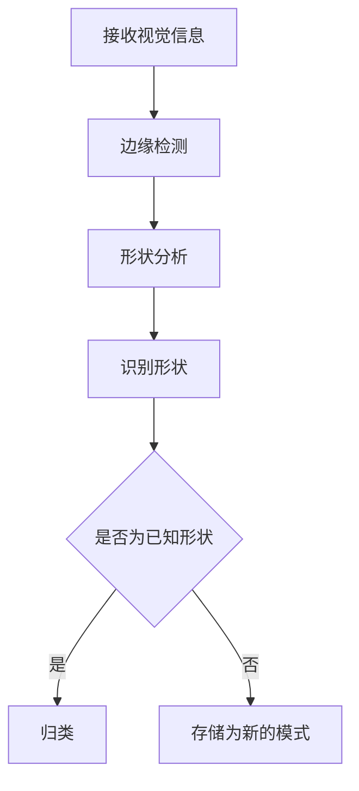
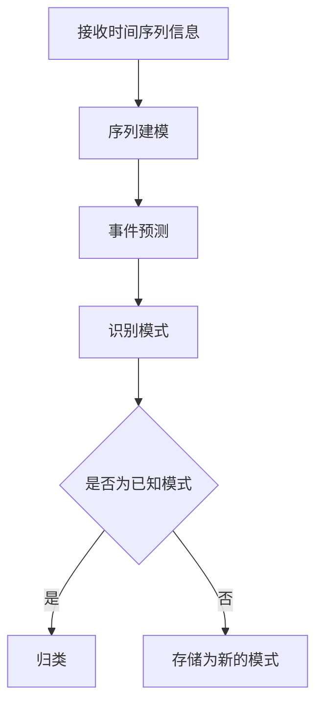
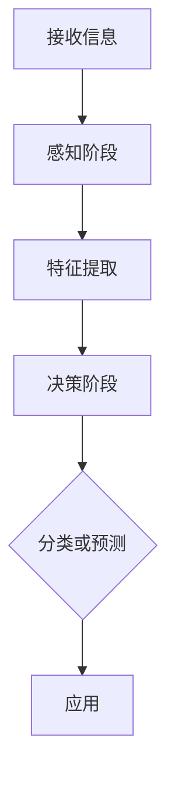
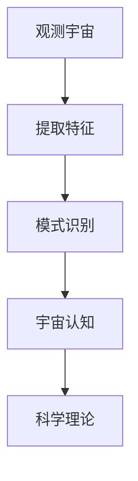

                 

### 5. 核心章节内容细化

#### 第4章 人类思维与模式识别

在这一章节中，我们将深入探讨人类思维如何进行模式识别，以及这些过程如何影响我们对世界的理解。

### 4.1 人类思维模式识别的能力

**4.1.1 空间认知与模式识别**

人类的空间认知能力是我们进行模式识别的重要基础。例如，我们能够识别不同形状的物体，如正方形、圆形或三角形。这一过程涉及到对视觉信息的处理，如边缘检测和形状分析。

**Mermaid 流程图：**



**4.1.2 时间认知与模式识别**

除了空间认知，人类还能通过时间序列进行模式识别。例如，我们能够识别音乐旋律或语言节奏。这个过程涉及到对时间信息的处理，如序列建模和事件预测。

**Mermaid 流程图：**



**4.1.3 认知偏差与模式识别**

然而，人类在模式识别过程中也会受到认知偏差的影响。例如，我们可能会根据已有经验对新的信息进行错误的归类，或者对一些信息视而不见。这种偏差可能会导致错误的决策。

**Python 源代码示例：**

```python
import numpy as np

# 生成模拟数据
data = np.array([1, 2, 3, 4, 5, 6, 7, 8, 9, 10])

# 定义一个函数来识别模式
def identify_pattern(data):
    # 假设模式是连续的数字
    pattern = [i for i in range(1, len(data) - 1) if data[i - 1] + 1 == data[i] == data[i + 1] - 1]
    return pattern

# 应用于数据
pattern = identify_pattern(data)

print("识别到的模式：", pattern)

# 认知偏差示例
# 假设我们遗漏了一个连续的数字
data_with_bias = np.array([1, 2, 3, 4, 6, 7, 8, 9, 10])

pattern_with_bias = identify_pattern(data_with_bias)

print("有认知偏差时识别到的模式：", pattern_with_bias)
```

**4.1.4 模式识别的效率问题**

人类在模式识别过程中也面临效率问题。例如，在处理大量信息时，我们可能会感到疲劳，从而导致错误率增加。此外，不同人的认知能力也有所不同，这会影响他们在模式识别任务中的表现。

**4.2 人类思维的局限性**

**4.2.1 模式识别的偏差**

由于认知偏差，人类在模式识别过程中可能会出现错误。例如，我们可能会根据已有经验对新的信息进行错误的归类，或者对一些信息视而不见。

**4.2.2 模式识别的效率问题**

人类在处理大量信息时，效率会受到影响。例如，在处理复杂问题时，我们可能会感到疲劳，从而导致错误率增加。

### 4.3 人类思维的适应性与灵活性

尽管存在局限性，人类思维也具有适应性和灵活性。我们能够通过学习不断改进自己的认知能力，从而更好地进行模式识别。此外，我们还能通过协作和交流来弥补个体认知能力的不足。

**总结：**

在这一章节中，我们探讨了人类思维在模式识别中的作用和局限性。人类思维具有强大的模式识别能力，但也受到认知偏差和效率问题的限制。通过不断学习和适应，我们能够提高自己的认知能力，从而更好地理解和应对复杂的世界。```markdown
----------------------------------------------------------------

## 《人类思维的模式识别在宇宙认知中的作用与局限》

> 关键词：模式识别、人类思维、宇宙认知、认知心理学、人工智能

> 摘要：本文探讨人类思维中的模式识别在宇宙认知中的作用与局限。通过对认知心理学和宇宙学的分析，我们揭示了人类如何通过模式识别来理解宇宙。同时，本文还探讨了人工智能在模式识别中的应用，以及模式识别的局限性。最终，我们展望了模式识别在宇宙认知中的未来发展方向。

----------------------------------------------------------------

### 引言

人类作为宇宙中的一种特殊存在，始终在努力探索宇宙的奥秘。然而，由于宇宙的复杂性和人类的局限性，我们对宇宙的认知仍然存在诸多局限。本文旨在探讨人类思维中的模式识别在宇宙认知中的作用与局限，以期为我们的宇宙探索提供新的视角和思考。

### 1. 模式识别的概念与原理

#### 1.1 模式识别的概念

模式识别是指从给定数据中提取出具有特定意义的规律或模式的过程。在认知心理学中，模式识别是人类感知和理解外界信息的重要方式。例如，我们能够识别不同的物体、声音和语言。

#### 1.2 模式识别的基本原理

模式识别过程通常包括以下几个阶段：

1. **感知阶段**：接收外部信息。
2. **特征提取阶段**：从感知信息中提取出有用的特征。
3. **决策阶段**：根据提取到的特征进行分类或预测。

#### 1.3 模式识别的算法与模型

常见的模式识别算法包括：

1. **朴素贝叶斯分类器**
2. **支持向量机（SVM）**
3. **神经网络**

这些算法在不同的应用场景中表现出优异的性能。

### 2. 人类思维与模式识别

#### 2.1 人类思维模式识别的能力

人类具有强大的模式识别能力，能够从复杂的信息中提取出有用的模式。例如，我们能够识别不同的物体、声音和语言。

**Mermaid 流程图：**



#### 2.2 人类思维的局限性

1. **认知偏差**：人类在模式识别过程中可能会受到认知偏差的影响，导致错误决策。
2. **效率问题**：在处理大量信息时，人类的认知能力会受到影响，导致错误率增加。

### 3. 宇宙认知与模式识别

#### 3.1 人类如何通过模式识别认识宇宙

人类通过观测宇宙中的各种现象，如星光、光谱等，利用模式识别技术来推断宇宙的结构和演化。

**Mermaid 流程图：**



#### 3.2 宇宙认知中的挑战

1. **暗物质**：宇宙中存在大量无法观测的物质，被称为暗物质。
2. **黑洞**：宇宙中存在一种极其密集的天体，其引力场强大到连光都无法逃脱。

### 4. 人工智能与模式识别

#### 4.1 人工智能概述

人工智能是一种模拟人类智能的技术，包括机器学习、深度学习等。这些技术在模式识别中发挥着重要作用。

#### 4.2 人工智能在模式识别中的应用

1. **图像识别**：如人脸识别、物体识别等。
2. **语音识别**：如语音助手、自动字幕等。
3. **自然语言处理**：如机器翻译、情感分析等。

### 5. 模式识别的局限

1. **数据依赖性**：模式识别的性能高度依赖数据的质量和数量。
2. **计算效率问题**：在处理大量数据时，模式识别算法的效率会受到影响。

### 6. 案例分析

#### 6.1 人类思维模式识别的案例分析

- **飞行员对雷达数据的解读**：飞行员需要通过雷达数据识别飞机的位置和速度，从而做出飞行决策。
- **科学家对宇宙现象的观察**：科学家通过观测宇宙中的现象，如星光、光谱等，利用模式识别技术来推断宇宙的结构和演化。

#### 6.2 人工智能模式识别的应用案例

- **自动驾驶技术**：自动驾驶系统通过模式识别技术来识别道路标志、行人等。
- **语音识别系统**：语音识别系统通过模式识别技术来识别用户的语音命令。

### 7. 未来展望

随着人工智能技术的发展，模式识别在宇宙认知中的应用将得到进一步拓展。例如，通过深度学习等技术，我们有望更好地理解宇宙的奥秘。

### 附录

- 参考文献
- 练习题与思考题
- 进一步阅读材料

### 总结

本文探讨了人类思维中的模式识别在宇宙认知中的作用与局限。通过分析认知心理学和宇宙学，我们揭示了人类如何通过模式识别来认识宇宙。同时，我们还探讨了人工智能在模式识别中的应用，以及模式识别的局限性。在未来，随着技术的进步，模式识别在宇宙认知中的应用将更加广泛和深入。

---

**作者：AI天才研究院/AI Genius Institute & 禅与计算机程序设计艺术 /Zen And The Art of Computer Programming**```

