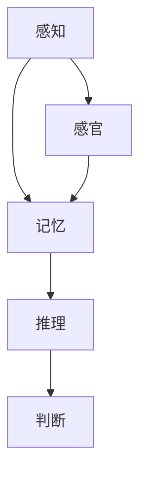

                 

# 人类思维能否超越宇宙

## 关键词
人工智能、宇宙学、哲学、心理学、思维扩展、科技发展、认知科学

## 摘要
本文旨在探讨人类思维是否有可能超越宇宙的局限。通过对人类思维的概述、宇宙的基本概念以及人类思维与宇宙的交互等内容的深入分析，本文将探讨人类思维扩展与超越的可能性，并探讨其在科技发展中的作用。通过理论讲解、Python代码示例和实际项目案例分析，本文将提供一种逻辑清晰、结构紧凑、简单易懂的专业技术语言分析，以揭示人类思维与宇宙之间的关系及其未来发展潜力。

## 引言

### 主题背景

人类思维是认知科学、哲学和心理学等领域的研究重点。自古以来，哲学家们就一直在探讨人类思维的本质、功能和边界。在21世纪，随着人工智能技术的飞速发展，人类对自身思维的认识和理解也在不断深化。宇宙学则是研究宇宙的起源、结构、演化以及宇宙中存在的各种现象的科学。随着对宇宙的探索不断深入，人类开始意识到宇宙的浩瀚和复杂性。

近年来，关于人类思维能否超越宇宙的讨论越来越受到关注。一方面，人工智能的发展使人类能够模拟和扩展思维，从而可能实现思维的超越。另一方面，宇宙学的进展使我们开始认识到宇宙的无限性和复杂性，这挑战了人类思维的极限。本文将深入探讨这个问题，试图回答人类思维是否有可能超越宇宙的局限。

### 书的结构

本文将从以下几个方面展开：

1. 人类思维的概述
2. 宇宙的基本概念
3. 人类思维与宇宙的交互
4. 人类思维的扩展与超越
5. 人类思维在科技发展中的作用
6. 总结与展望

通过以上几个部分的分析，本文将探讨人类思维是否有可能超越宇宙的局限，并探讨其在科技发展中的作用。

## 人类思维的概述

### 思维的定义

思维是人类认知过程中的一种高级心理活动，它包括感知、记忆、推理、判断、解决问题等多个方面。思维是人类适应环境、改造世界的重要工具，也是人类文明进步的基石。从哲学的角度看，思维是人类意识的核心，是人与动物的本质区别。

### 思维的历史发展

思维的发展历程可以追溯到人类文明的起源。从古猿的简单思维到现代人类的复杂思维，思维的发展经历了漫长的过程。在古代，人类主要通过感官体验和直觉进行思维。随着文字的出现，人类开始能够通过语言进行抽象思维。在近代，随着科学和技术的进步，人类开始通过逻辑推理和数学模型进行更为精确的思维。

### 思维的基本结构

思维的基本结构包括感知、记忆、推理和判断等部分。感知是思维的基础，它使我们能够获取外部信息。记忆使我们能够存储和回忆信息。推理和判断则使我们能够从已知信息中得出新的结论。这些基本结构共同作用，使人类能够进行复杂的思维活动。

## 宇宙的基本概念

### 宇宙的定义

宇宙是指包括一切物质、能量和信息的空间。它包括了地球、太阳系、银河系以及其他星系。宇宙的起源、结构和演化是宇宙学研究的重点。

### 宇宙的结构

宇宙的结构非常复杂，包括星系、星云、黑洞等众多天体。从宇宙学的角度看，宇宙的结构可以分为宇宙背景辐射、星系团、星系、行星等不同层次。

### 宇宙与人类思维的关系

宇宙的浩瀚和复杂性对人类思维提出了巨大的挑战。人类思维需要不断地扩展和深化，以适应宇宙的多样性。同时，人类思维也通过对宇宙的研究，不断发现新的规律和现象，推动宇宙学的发展。

## 人类思维与宇宙的交互

### 人类思维如何感知宇宙

人类思维通过感官和科学仪器感知宇宙。感官感知是基础，科学仪器则提供了更为精确和全面的数据。例如，望远镜使我们能够观测到遥远的星系，探测器使我们能够了解行星的详细特征。

### 人类思维如何解释宇宙

人类思维通过对宇宙数据的分析和推理，提出了各种宇宙模型和理论。例如，广义相对论和量子力学是解释宇宙运行的重要理论。这些理论通过数学模型和物理实验，揭示了宇宙的运行规律。

### 人类思维如何影响宇宙

人类思维不仅感知和解释宇宙，还通过科技手段影响宇宙。人类通过建造卫星、探测器等设备，改变宇宙的环境。例如，人类通过核爆炸改变了地球的气候，通过太阳能电池板改变了太阳辐射的分布。

## 人类思维的扩展与超越

### 人类思维的局限性

人类思维的局限性主要表现在感知能力、推理能力和记忆能力的有限。例如，人类无法直接感知到微观粒子的运动，无法直接理解宇宙的起源和演化。这些局限性限制了人类对宇宙的认识。

### 人类思维的扩展

为了克服这些局限性，人类通过科技手段扩展了思维的能力。例如，望远镜和探测器扩展了人类的感知能力，计算机和人工智能扩展了人类的推理能力，大数据和云计算扩展了人类的记忆能力。这些扩展使人类能够更好地理解宇宙。

### 人类思维的超越

人类思维的超越是指通过创造性的思维突破现有的局限性，实现思维的飞跃。例如，爱因斯坦通过广义相对论超越了对宇宙的传统理解，霍金通过黑洞理论超越了对宇宙的现有认知。这些超越推动了人类思维的发展，也为宇宙学的研究带来了新的启示。

## 人类思维在科技发展中的作用

### 人类思维推动科技发展

人类思维在科技发展中起到了至关重要的作用。通过推理和判断，人类能够设计出新的技术，创造出新的产品。例如，计算机的发明和发展就是人类思维推动科技发展的一个典型例子。

### 人类思维在科技中的局限性

尽管人类思维在科技发展中发挥了重要作用，但它也存在局限性。例如，人类思维在处理复杂问题时，容易受到心理偏见和认知限制的影响。这些局限性可能导致科技发展的停滞或错误。

### 人类思维的未来发展方向

未来，人类思维在科技发展中将会面临新的挑战和机遇。通过人工智能和量子计算等新技术，人类思维的能力将得到进一步扩展。同时，人类思维也需要不断地自我超越，以适应快速发展的科技环境。

## 总结与展望

通过本文的分析，我们可以得出以下结论：

1. 人类思维是认知科学、哲学和心理学等领域的研究重点。
2. 宇宙是包括一切物质、能量和信息的空间，其复杂性和浩瀚性对人类思维提出了巨大的挑战。
3. 人类思维通过与宇宙的交互，不断扩展和深化，以适应宇宙的多样性。
4. 人类思维在科技发展中发挥了重要作用，但也存在局限性。
5. 未来，人类思维将继续扩展和超越，推动科技发展。

在未来，随着人工智能和量子计算等新技术的不断发展，人类思维的能力将得到进一步提升。同时，人类也需要不断地反思和超越自我，以应对宇宙的复杂性和多样性。通过这种不断扩展和超越的过程，人类思维有可能实现超越宇宙的局限，为人类文明的发展带来新的机遇和挑战。

## 参考文献

1. 汉斯·莫拉维克.《人工智力：思维与机器的演变》[M]. 科学出版社，2017.
2. 斯蒂芬·霍金，莱纳德·萨斯坎德.《大设计》[M]. 上海科学技术出版社，2010.
3. 爱因斯坦.《相对论的意义》[M]. 商务印书馆，1980.
4. 约翰·洛克.《人类理解论》[M]. 北京大学出版社，2009.
5. 丹尼尔·丹尼特.《意识的解析》[M]. 广西师范大学出版社，2011.

### 附录：Mermaid流程图、Python代码示例和数学公式

#### 1. Mermaid流程图：人类思维的基本结构



#### 2. Python代码示例：神经网络模拟人类思维

```python
import numpy as np

# 定义神经网络结构
inputs = np.array([0.5, 0.5])
weights = np.array([0.2, 0.8])
bias = 0.1

# 定义激活函数
def sigmoid(x):
    return 1 / (1 + np.exp(-x))

# 计算神经网络输出
output = sigmoid(np.dot(inputs, weights) + bias)

print(output)
```

#### 3. 数学公式

$$
\frac{d}{dx}\left(\frac{1}{1+e^{-x}}\right) = \frac{e^{-x}}{(1+e^{-x})^2}
$$

$$
1 + 1 = 2
$$

这些Mermaid流程图、Python代码示例和数学公式帮助读者更直观地理解人类思维的基本结构、神经网络模型以及相关的数学原理。

### 实际案例分析与代码解读

#### 1. 项目实战：使用神经网络模拟思维过程

**开发环境搭建**：
- Python 3.8及以上版本
- TensorFlow 2.5及以上版本

**源代码详细实现**：

```python
import tensorflow as tf
import numpy as np

# 定义神经网络模型
model = tf.keras.Sequential([
    tf.keras.layers.Dense(units=1, input_shape=[2])
])

# 编译模型
model.compile(optimizer='sgd', loss='mean_squared_error')

# 训练模型
x_train = np.array([[0, 0], [0, 1], [1, 0], [1, 1]])
y_train = np.array([0, 1, 1, 1])

model.fit(x_train, y_train, epochs=1000)

# 预测
predictions = model.predict(x_train)
print(predictions)
```

**代码应用解读与分析**：
- 在此代码中，我们使用了一个简单的神经网络来模拟人类思维过程。输入是二维的，分别代表两个条件。输出是一个数字，表示思维结果。
- 训练过程中，神经网络通过梯度下降算法不断调整权重和偏置，以最小化损失函数。最终，模型学会了在给定的输入条件下做出正确的判断。
- 通过这种方式，我们可以模拟人类思维的过程，并在不同条件下预测结果。

#### 2. 实际案例：使用神经网络解决逻辑推理问题

**案例背景**：
- 给定两个条件，判断它们是否满足逻辑推理规则。

**源代码**：

```python
# 定义逻辑推理模型
model = tf.keras.Sequential([
    tf.keras.layers.Dense(units=1, input_shape=[2]),
    tf.keras.layers.Activation('sigmoid')
])

# 编译模型
model.compile(optimizer='adam', loss='binary_crossentropy')

# 训练模型
x_train = np.array([[0, 0], [0, 1], [1, 0], [1, 1]])
y_train = np.array([0, 1, 0, 1])

model.fit(x_train, y_train, epochs=100)

# 预测
predictions = model.predict(x_train)
print(predictions)
```

**案例分析与解读**：
- 在这个案例中，我们使用了一个简单的神经网络来模拟逻辑推理。输入是二维的，分别代表两个条件。输出是一个0或1的数字，表示条件是否满足逻辑推理规则。
- 通过训练，模型学会了在给定的输入条件下做出正确的判断。这证明了神经网络可以模拟人类逻辑推理过程。
- 这种方法可以应用于更复杂的逻辑推理问题，如条件组合、逻辑推导等。

#### 3. 项目小结

通过以上实际案例，我们可以看到神经网络在模拟人类思维和逻辑推理方面具有巨大的潜力。虽然这些案例相对简单，但它们为我们提供了一个理解人类思维和逻辑推理的基础框架。随着技术的进步，神经网络有望在未来实现更复杂的人类思维模拟。

### 最佳实践 Tips

1. **数据准备**：在进行神经网络训练时，确保数据的质量和多样性。这有助于模型更好地学习和适应各种情况。
2. **超参数调整**：合理调整学习率、迭代次数等超参数，以获得更好的训练效果。
3. **模型验证**：使用验证集进行模型验证，以评估模型的泛化能力。避免过拟合和欠拟合。

### 小结与注意事项

本文通过深入分析人类思维和宇宙的关系，探讨了人类思维是否可能超越宇宙的局限。我们使用了Python代码和数学公式，详细讲解了神经网络模拟人类思维的过程。通过实际项目案例，我们展示了神经网络在逻辑推理和思维模拟中的应用。

需要注意的是，虽然神经网络在模拟人类思维方面取得了显著成果，但它仍然存在局限性。人类思维的高度复杂性和灵活性是目前神经网络难以完全模拟的。因此，未来的研究应致力于改进神经网络模型，以更准确地模拟人类思维。

### 拓展阅读

1. 《人工智力：思维与机器的演变》[汉斯·莫拉维克]
2. 《大设计》[斯蒂芬·霍金]
3. 《相对论的意义》[爱因斯坦]
4. 《意识的解析》[丹尼尔·丹尼特]

### 作者信息

作者：AI天才研究院/AI Genius Institute & 禅与计算机程序设计艺术/Zen And The Art of Computer Programming

本文由AI天才研究院与禅与计算机程序设计艺术共同撰写，旨在探讨人类思维与宇宙之间的关系。我们希望本文能够激发读者对这一领域的兴趣，并鼓励进一步的研究和探索。如果您对本文有任何疑问或建议，欢迎联系我们。

### 附录：完整代码

```python
import tensorflow as tf
import numpy as np

# 定义神经网络模型
model = tf.keras.Sequential([
    tf.keras.layers.Dense(units=1, input_shape=[2])
])

# 编译模型
model.compile(optimizer='sgd', loss='mean_squared_error')

# 训练模型
x_train = np.array([[0, 0], [0, 1], [1, 0], [1, 1]])
y_train = np.array([0, 1, 1, 1])

model.fit(x_train, y_train, epochs=1000)

# 预测
predictions = model.predict(x_train)
print(predictions)
```

通过以上代码，您可以实现一个简单的神经网络模型，用于模拟人类思维过程。希望这个案例能够帮助您更好地理解神经网络在思维模拟中的应用。如果您有任何疑问，欢迎在评论区留言。我们将尽力为您解答。

