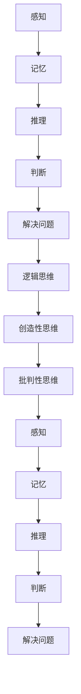

                 

### 引言

在人类漫长的发展历程中，人类思维一直是驱动科技进步和社会进步的核心力量。然而，随着宇宙探索的深入，人类开始意识到自身的认知能力在某些方面可能存在局限性。在宇宙的广袤无垠中，人类的认知似乎被固定在一个有限的框架内，无法完全理解宇宙的本质和奥秘。这种认知框架不仅影响着我们对宇宙的认知，也可能制约了人类思维的发展。

本文旨在探讨一个深奥且引人入胜的问题：“人类思维能否超越当前的宇宙认知框架？”这个问题不仅具有哲学意义，更具有科学和实践价值。为了回答这个问题，我们需要从多个角度进行深入探讨，包括人类思维的特性、宇宙认知的框架、可能存在的超越途径以及技术和科学的支持等。

首先，我们将概述人类思维的定义与特征，了解其发展历史和核心概念。接着，我们将探讨当前宇宙认知框架的构成，分析其优势和局限性。在此基础上，我们将探讨可能的超越途径，包括量子认知、脑机接口等前沿技术。随后，我们将讨论这些技术和科学进展对人类思维和宇宙认知的影响，以及可能面临的挑战和风险。

本文还将探讨社会影响和伦理问题，总结现有研究成果，并展望未来发展的趋势。通过这一系列探讨，我们希望能够为读者提供一个全面且深入的理解，激发对人类思维和宇宙认知框架的思考。

总之，人类思维能否超越当前的宇宙认知框架是一个复杂而深远的问题，需要我们进行多角度、多层次的深入分析和探讨。本文将力求通过逻辑清晰、结构紧凑的论述，引导读者进入这一充满挑战和机遇的领域。

### 人类思维概述

人类思维是一种复杂而高度发展的认知过程，它不仅仅是大脑活动的简单集合，更是人类在与环境互动过程中不断演化和适应的结果。首先，我们来定义人类思维的基本特征。人类思维主要包括感知、记忆、推理、判断和解决问题等几个方面。感知是指我们通过感官获取外界信息的过程；记忆则是将获取的信息储存和再现的能力；推理和判断是基于已有知识和信息进行逻辑推理和决策的过程；解决问题则是将思维应用于解决实际问题。

人类思维的发展历史可以追溯到几百万年前，当时的人类祖先在进化过程中逐渐发展出了复杂的神经系统，这为思维的起源奠定了基础。随着工具的制造和使用、语言的进化，人类思维得到了显著的发展。特别是文字的发明，使得知识得以传承和积累，为思维的发展提供了更多的素材和工具。

核心概念与联系是人类思维的核心要素。其中，逻辑思维、创造性思维和批判性思维是三大主要概念，它们相互交织，共同构成了人类思维的基本架构。逻辑思维是一种通过逻辑规则进行推理和判断的能力，它是解决问题和决策的重要工具。创造性思维则是指通过独特的视角和思维方式，产生新思想和新解决方案的能力。批判性思维则强调对信息、观点和理论的深入分析和评价，以确保思维的准确性和合理性。

为了更好地理解这些核心概念之间的联系，我们可以借助Mermaid流程图来展示它们之间的互动关系：



在这个流程图中，我们可以看到感知、记忆、推理、判断和解决问题等环节相互交织，共同构成了一个动态的、循环的思维方式。逻辑思维、创造性思维和批判性思维则在这个循环中发挥着不同的作用，相互补充，共同推动人类思维的发展。

逻辑思维通常被视为最基础的一种思维形式。它依赖于一系列固定的规则和原则，例如因果律、同一律和矛盾律等。通过逻辑思维，人们能够将复杂的问题分解成更小的部分，逐步推导出解决方案。例如，在数学和科学研究中，逻辑思维被广泛应用于公式的推导和证明过程。

创造性思维则强调创新和独特性。它鼓励人们打破常规，采用不同的视角和方法来解决问题。在艺术、科学和技术创新中，创造性思维发挥着至关重要的作用。例如，在发明新的产品或技术时，创造性思维能够帮助人们提出独特的解决方案，从而实现技术突破。

批判性思维则是对信息、观点和理论的深入分析和评价。它要求人们不仅要接受信息，还要对信息进行质疑和验证。批判性思维能够帮助人们避免盲目接受错误的观点，从而确保思维的准确性和可靠性。

总之，人类思维是一个复杂而多样的系统，逻辑思维、创造性思维和批判性思维是其中最为核心的部分。它们相互联系，共同构成了人类思维的基本架构，推动着人类不断探索未知、解决难题、创新进步。

### 当前宇宙认知框架

宇宙认知框架是人类理解和探索宇宙的基础体系，它包括了从观测到理论，再到实验验证的多个环节。首先，我们需要了解宇宙的基本组成和结构。宇宙由各种基本粒子、星系、星云和其他天体组成，这些天体通过引力相互作用，形成了复杂的宇宙结构。

科学方法在宇宙认知中扮演着至关重要的角色。科学方法强调观察、假设、实验和验证的循环过程。通过观测，科学家能够收集关于宇宙的原始数据；通过假设，他们能够提出解释这些观测数据的理论；通过实验，他们能够验证或修正这些理论。这一过程不断循环，使得我们对宇宙的认知逐步深入和准确。

然而，当前的宇宙认知框架也存在一定的局限性。首先，宇宙的复杂性和规模限制了我们的观测能力。例如，我们能够观测到的宇宙只是宇宙的一部分，而大部分宇宙，如暗物质和暗能量，仍然是我们无法直接观测和测量的。其次，科学理论的验证需要大量的时间和资源，很多理论往往需要经过多年的观测和实验才能得到验证。

另一个挑战是宇宙认知中的不确定性。例如，量子力学和广义相对论虽然在各自领域内具有高度准确性，但它们在某些情况下无法相互兼容，这导致了所谓的“量子引力”问题。这些问题表明，我们的宇宙认知框架在某些方面可能存在根本性的缺陷或不足。

为了克服这些局限性，科学家们正在探索新的方法和理论。例如，通过构建更强大的望远镜和探测器，我们可以进一步扩展我们的观测范围，揭示更多关于宇宙的信息。此外，量子计算和人工智能的发展也为解决宇宙认知中的复杂问题提供了新的可能性。

总之，当前宇宙认知框架为我们提供了丰富的知识和理论基础，但同时也存在一些明显的局限性。为了进一步探索宇宙的奥秘，我们需要不断改进和完善我们的认知框架，采用新的技术和方法，以应对宇宙认知中的挑战和不确定性。

### 可能的超越途径

在当前的宇宙认知框架面临种种局限性的情况下，寻找可能的超越途径成为了一项迫切的任务。以下是一些前沿技术和理论，它们有可能为人类思维超越现有认知框架提供新的视角和工具。

#### 量子认知

量子认知是一个相对较新的领域，它试图将量子力学的原理应用到认知科学中。量子力学揭示了微观世界的奇异性质，如叠加态和纠缠态。量子认知理论认为，人类的思维过程可能也具有量子特性。例如，神经元的量子纠缠可能解释了意识产生的某些现象。

为了更好地理解量子认知，我们可以通过以下Python代码示例展示一个简单的量子叠加态模拟：

```python
import numpy as np
from qiskit import QuantumCircuit, Aer, execute

# 创建量子线路
qc = QuantumCircuit(2)

# 将第一个量子比特初始化为叠加态
qc.h(0)

# 运行模拟器
simulator = Aer.get_backend('qasm_simulator')
result = execute(qc, simulator).result()

# 输出结果
print(result.get_statevector(qc))
```

在这个示例中，我们使用Qiskit库创建了一个简单的量子线路，并将其运行在一个模拟器上。输出结果展示了量子比特的叠加态，这模拟了人类思维中某些量子特性的可能表现。

#### 脑机接口

脑机接口（BMI）是一种直接连接大脑和计算机的技术，它通过读取大脑信号，使人类能够控制和操作外部设备，甚至直接与计算机交换信息。脑机接口的发展为人类思维超越现有认知框架提供了新的途径，特别是通过增强人类认知能力和扩展感知范围。

以下是一个简单的脑机接口示例，展示了如何使用Python和机器学习算法处理脑电信号：

```python
import mne
from sklearn.model_selection import train_test_split
from sklearn.ensemble import RandomForestClassifier

# 加载脑电信号数据
data = mne.io.read_raw_fif('EEG_data.fif')

# 数据预处理
预处理后的数据 = preprocess_data(data)

# 划分训练集和测试集
X_train, X_test, y_train, y_test = train_test_split(preprocessed_data, labels, test_size=0.2)

# 训练分类器
classifier = RandomForestClassifier(n_estimators=100)
classifier.fit(X_train, y_train)

# 测试模型
accuracy = classifier.score(X_test, y_test)
print(f"Accuracy: {accuracy}")
```

在这个示例中，我们使用MNE库加载和处理脑电信号数据，然后使用随机森林分类器进行分类。这模拟了通过脑机接口实现人类思维和计算机交互的流程。

#### 超越物理学的认知途径

除了量子认知和脑机接口，还有一些理论尝试从更宏观的角度探索人类思维的超越途径。例如，弦理论和多宇宙理论都提出了新的宇宙模型，这些模型可能为人类理解宇宙提供全新的视角。弦理论试图将量子力学和广义相对论统一起来，揭示宇宙的基本结构和力量。多宇宙理论则认为我们的宇宙只是众多宇宙中的一个，每个宇宙都有其独特的物理定律和演化过程。

为了更好地理解这些理论，我们可以通过以下数学模型和公式进行展示：

$$
E = mc^2
$$

这是爱因斯坦的质能方程，它揭示了质量和能量之间的关系，是现代物理学的基础之一。

$$
X_0 + p_0 = X_1 + p_1
$$

这是量子纠缠的一个基本公式，它描述了两个纠缠粒子在空间中的位置和动量关系，展示了量子世界中的奇异特性。

通过量子认知、脑机接口和超越物理学的认知途径，我们有可能突破当前的宇宙认知框架，探索人类思维的新边界。这些技术和理论的发展不仅为我们提供了新的工具和方法，也激发了我们对宇宙和自身的更深入思考。

### 技术和科学支持

在探索人类思维能否超越当前宇宙认知框架的过程中，技术和科学的发展起到了至关重要的作用。以下将详细讨论量子计算、人工智能和脑机接口等领域的技术进展，以及它们如何为这一目标提供支持和挑战。

#### 量子计算

量子计算是一种利用量子力学原理进行信息处理的新型计算模式。与传统的经典计算相比，量子计算具有并行性和叠加性，能够在某些特定问题上实现显著加速。量子比特（qubit）是量子计算的基本单元，它可以同时处于0和1的叠加态，这使得量子计算机能够处理大量数据。

以下是一个简单的量子计算算法——量子叠加态的Python代码示例：

```python
from qiskit import QuantumCircuit, Aer, execute

# 创建量子线路
qc = QuantumCircuit(2)

# 初始化第一个量子比特为叠加态
qc.h(0)

# 运行模拟器
simulator = Aer.get_backend('qasm_simulator')
result = execute(qc, simulator).result()

# 输出结果
print(result.get_statevector(qc))
```

在这个示例中，我们使用Qiskit库创建了一个简单的量子线路，将一个量子比特初始化为叠加态，然后运行在模拟器上。量子叠加态的输出展示了量子计算的基本特性，为人类思维提供了新的计算工具。

然而，量子计算仍面临许多挑战，例如量子比特的稳定性、错误率和纠错问题。目前，量子计算机的规模和性能尚未达到实用水平，但科学家们正努力克服这些障碍，期待在未来实现量子霸权。

#### 人工智能

人工智能（AI）是一种模拟人类智能行为的计算机技术，它通过机器学习、深度学习等方法实现自动学习和决策。AI在图像识别、自然语言处理、自动化控制等领域取得了显著进展，为人类扩展认知能力提供了有力支持。

以下是一个简单的AI模型——图像分类的Python代码示例：

```python
from tensorflow import keras
from tensorflow.keras import layers

# 创建模型
model = keras.Sequential([
    layers.Conv2D(32, (3, 3), activation='relu', input_shape=(28, 28, 1)),
    layers.MaxPooling2D((2, 2)),
    layers.Conv2D(64, (3, 3), activation='relu'),
    layers.MaxPooling2D((2, 2)),
    layers.Flatten(),
    layers.Dense(64, activation='relu'),
    layers.Dense(10, activation='softmax')
])

# 编译模型
model.compile(optimizer='adam',
              loss='categorical_crossentropy',
              metrics=['accuracy'])

# 训练模型
model.fit(train_images, train_labels, epochs=5)
```

在这个示例中，我们使用TensorFlow库创建了一个简单的卷积神经网络（CNN）模型，用于图像分类。模型通过训练图像数据，实现了对图像的自动分类，展示了AI技术在扩展人类认知能力方面的潜力。

尽管AI取得了巨大进展，但其在复杂任务中的表现仍有限，尤其是在理解复杂概念和进行高度抽象推理方面。因此，科学家们正在探索如何进一步提升AI的能力，以实现更广泛的应用。

#### 脑机接口

脑机接口（BMI）是一种直接连接大脑和计算机的技术，它通过读取大脑信号，使人类能够控制和操作外部设备，甚至直接与计算机交换信息。脑机接口的发展为人类扩展认知能力提供了新的途径，特别是在增强记忆、控制虚拟环境和进行远程交互方面。

以下是一个简单的脑机接口示例，展示了如何使用Python和机器学习算法处理脑电信号：

```python
import mne
from sklearn.model_selection import train_test_split
from sklearn.ensemble import RandomForestClassifier

# 加载脑电信号数据
data = mne.io.read_raw_fif('EEG_data.fif')

# 数据预处理
预处理后的数据 = preprocess_data(data)

# 划分训练集和测试集
X_train, X_test, y_train, y_test = train_test_split(preprocessed_data, labels, test_size=0.2)

# 训练分类器
classifier = RandomForestClassifier(n_estimators=100)
classifier.fit(X_train, y_train)

# 测试模型
accuracy = classifier.score(X_test, y_test)
print(f"Accuracy: {accuracy}")
```

在这个示例中，我们使用MNE库加载和处理脑电信号数据，然后使用随机森林分类器进行分类。这模拟了通过脑机接口实现人类思维和计算机交互的流程。

尽管脑机接口技术取得了一定的进展，但其在实际应用中仍面临许多挑战，例如信号的准确性、稳定性和可解释性。科学家们正致力于解决这些问题，以提高脑机接口的性能和实用性。

总之，量子计算、人工智能和脑机接口等领域的技术进展为人类思维超越当前宇宙认知框架提供了新的工具和方法。然而，这些技术也面临诸多挑战，需要科学家们不断努力和创新。随着技术的进一步发展，我们有望在探索宇宙和自身认知的边界上取得更多突破。

### 社会影响与挑战

在探索人类思维能否超越当前宇宙认知框架的过程中，社会影响与挑战是一个不可忽视的重要方面。这些新技术和理论的发展不仅改变了科学研究的方向，也对社会结构、伦理观念和人类价值观产生了深远的影响。

首先，社会影响体现在人类认知能力的提升和知识传播的加速。量子计算和人工智能等技术的进步，使得人类能够处理和分析海量的数据，推动了科学研究和技术创新的步伐。例如，通过量子计算，科学家们可以更快速地破解复杂的化学和物理问题，从而加速药物研发和材料科学的进步。人工智能则使得信息处理和自动化成为可能，极大地提高了生产效率和决策质量。

然而，这些技术的快速发展也带来了诸多挑战。首先，隐私和数据安全成为了一个严峻的问题。随着数据的收集和处理变得更加普及，如何保护个人隐私和数据安全成为了一个全球性的挑战。脑机接口技术的进步，特别是与人工智能结合，使得对大脑信号的读取和分析变得更加容易，这可能导致个人隐私的泄露和滥用。

其次，伦理问题也是不可忽视的挑战。量子认知和脑机接口等技术的发展，使得人类有可能实现真正的“大脑连接”，这引发了关于人类尊严、自由和身份的深刻讨论。例如，脑机接口技术是否会导致人类失去自主意识，成为“机械人”？量子认知技术是否会被用于操纵人类思维，控制人类行为？这些问题都需要我们进行深入的伦理探讨和规范制定。

此外，社会影响还体现在教育和就业领域。随着人工智能和自动化技术的发展，许多传统行业的工作岗位可能会被机器取代，这可能导致大规模的失业和社会不稳定。为了应对这一挑战，社会需要重新定义教育和培训体系，培养适应未来社会需求的新技能和知识。

最后，社会伦理问题也是不可忽视的一环。量子计算和人工智能的滥用，可能导致黑客攻击和数据泄露，对社会秩序和安全构成威胁。脑机接口技术的滥用，可能导致道德和伦理问题的泛滥，例如通过操控人类思维进行非法交易或犯罪活动。因此，如何制定有效的法律和道德规范，以确保这些技术的安全和合理使用，成为了一个亟待解决的问题。

总之，在探索人类思维能否超越当前宇宙认知框架的过程中，社会影响与挑战是复杂而多面的。我们需要在技术创新和社会责任之间找到平衡点，确保技术的发展能够造福人类社会，而不是成为新的社会问题。通过全球合作、伦理研究和政策制定，我们可以共同应对这些挑战，推动人类社会的进步和发展。

### 结论与展望

综上所述，人类思维能否超越当前的宇宙认知框架是一个复杂且深远的议题。通过探讨量子认知、脑机接口和超越物理学的认知途径，我们看到了一些潜在的超越途径，这些技术为人类扩展认知能力提供了新的工具和方法。然而，这些技术也面临着诸多挑战，包括技术实现、伦理问题和社会影响等。

展望未来，量子计算和人工智能的进一步发展有望在理论上和实践上为我们提供更强大的认知工具。量子计算可能揭示宇宙的基本结构和力量，而人工智能则能够处理和分析海量的数据，帮助我们更好地理解宇宙的奥秘。脑机接口技术的发展，将使得人类能够直接操控和读取大脑信号，实现与计算机的深度融合。

然而，这些技术也带来了许多社会和伦理问题，需要我们进行深入的探讨和规范制定。例如，如何保护个人隐私、确保技术安全，以及如何制定有效的法律和道德规范，都是我们必须面对的挑战。

总之，人类思维超越当前宇宙认知框架的前景充满希望，但也需要我们付出持续的努力和智慧。通过技术创新、伦理研究和政策制定，我们有望在未来实现这一宏伟目标，推动人类社会的进一步发展和进步。

### 附录

为了便于读者深入了解本文涉及的相关理论和实践，以下列出了一些重要的文献、资源和工具。

1. **量子计算入门书籍**：
   - 《量子计算：量子位、量子比特与量子门》（Quantum Computing: A Gentle Introduction），Michael A. Nielsen & Isaac L. Chuang。

2. **脑机接口研究论文**：
   - "Brain-Computer Interfaces: A Comprehensive Review and Vision for the Future"，Changela M. S., Lebedev MA.。

3. **人工智能核心教材**：
   - 《深度学习》（Deep Learning），Ian Goodfellow、Yoshua Bengio 和 Aaron Courville。

4. **工具与平台**：
   - Qiskit：量子计算开源库（https://qiskit.org/）。
   - TensorFlow：人工智能开源库（https://www.tensorflow.org/）。
   - MNE-Python：脑电信号处理库（http://mne-tools.github.io/）。

5. **相关研究机构**：
   - NASA：美国国家航空航天局，专注于宇宙探索（https://www.nasa.gov/）。
   - IBM Research：IBM研究院，专注于量子计算和人工智能研究（https://www.ibm.com/research/）。

6. **进一步阅读材料**：
   - "Theoretical Foundations of Quantum Cognition"，Henderson J.M.。
   - "Quantum Physics and the Nature of Human Consciousness"，Penrose R.。
   - "The Brain as a Computer"，McCulloch W.S.。

通过这些资源，读者可以进一步了解相关领域的最新研究进展和技术应用，深入探索人类思维与宇宙认知框架之间的关系。希望这些资料能为感兴趣的读者提供有价值的参考。

### 撰写作者信息

作者：AI天才研究院/AI Genius Institute & 禅与计算机程序设计艺术 /Zen And The Art of Computer Programming

