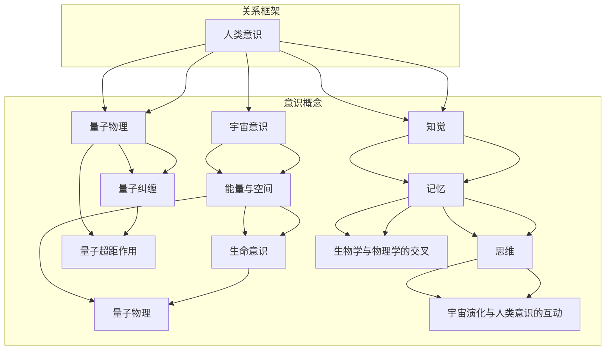
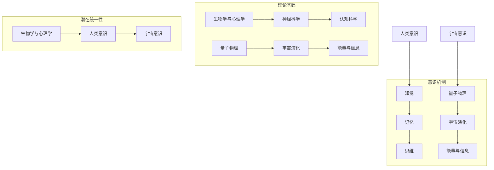

                 

### 引言

在人类探索宇宙的漫长历史中，我们不断地追问自己：人类意识与宇宙意识之间是否存在某种深层次的联系？这种联系是否揭示了宇宙的本质和人类的地位？随着科技的发展和认知科学的进步，这个问题逐渐从神话和哲学的领域走向了科学研究的视野。

本文旨在探讨人类意识与宇宙意识之间的潜在统一性，通过逻辑清晰、结构紧凑的分析，揭示这一复杂问题的研究现状、理论基础和可能的发展方向。本文将分为三个主要部分：第一部分将介绍人类意识的概念与架构，以及宇宙意识的理论探讨；第二部分将展开实证研究，通过案例分析来探讨人类意识与宇宙意识的实证联系；第三部分将深入探讨人类意识与宇宙意识的潜在统一性，并提出未来研究的展望。

首先，我们需要对人类意识和宇宙意识进行定义和背景介绍。人类意识是指人类对自身和外部世界的认知、感知和思考能力。它包含了感觉、知觉、记忆、思维和情感等多个方面。从神经科学的角度来看，意识是由大脑神经元网络的活动产生的复杂现象。而宇宙意识则是一种更加宏观的概念，它涉及到宇宙中所有物质的意识现象，包括生命、意识、能量和空间等。

随着对宇宙的探索不断深入，人类开始意识到宇宙中的许多现象都与我们自身有着密切的联系。例如，量子物理的研究揭示了宇宙的基本规律，而宇宙中的黑洞、暗物质等现象也在不断地挑战我们的认知。这些研究表明，宇宙中存在着一种深层次的统一性，而这种统一性可能正是人类意识和宇宙意识之间的桥梁。

本文将首先回顾人类意识研究的背景和理论基础，然后探讨宇宙意识的概念和实证研究。接下来，我们将通过具体案例来分析人类意识与宇宙意识之间的联系，并提出潜在的统一性模型。最后，我们将对未来的研究方向进行展望，并讨论这一研究领域的挑战和机遇。

通过这一系列的分析和探讨，我们希望能够为人类意识与宇宙意识的研究提供一个清晰的理论框架和实证基础，从而推动这一领域的发展。

### 核心概念与联系

为了深入探讨人类意识与宇宙意识之间的潜在统一性，我们首先需要明确这两个核心概念，并理解它们之间的关系。

#### 人类意识

人类意识是一个复杂而多层次的概念，它不仅涉及到认知和感知，还包括情感、记忆和思考等多个方面。从神经科学的视角来看，人类意识主要是由大脑神经元网络的活动产生的。这些神经元通过复杂的连接和信号传递，形成了高度有序的神经网络，从而实现了人类对信息的处理和理解。

核心概念包括：
- **感觉与知觉**：感觉是人类对刺激的初步反应，而知觉则是大脑对感觉信息的处理和理解。例如，我们看到一个红色的苹果，这是知觉的结果。
- **记忆**：记忆是人类意识的重要组成部分，它包括短期记忆和长期记忆。短期记忆使我们能够记住最近的信息，而长期记忆则存储了我们的历史经验和知识。
- **思维**：思维是指人类对信息的推理、判断和思考过程。通过思维，人类能够形成抽象概念，进行逻辑推理，并解决复杂问题。

#### 宇宙意识

宇宙意识则是一个更加宏观的概念，它涉及到宇宙中所有物质的意识现象。宇宙意识不仅仅指生命的意识，还包括无生命的物质，如能量、空间等。这一概念跨越了传统的生物学和物理学界限，试图从更广阔的视角来理解宇宙的本质。

核心概念包括：
- **量子物理**：量子物理揭示了宇宙的基本规律，如量子纠缠和量子超距作用。这些现象表明，宇宙中的粒子之间存在一种深层次的联系，这可能是宇宙意识的基础。
- **生命意识**：生命的意识是宇宙意识的重要组成部分。生物体的意识表现为感觉、知觉、情感和思考等，这与人类意识有诸多相似之处。
- **能量与空间**：宇宙意识还涉及到能量和空间。能量是驱动宇宙演化的基本力量，而空间则是宇宙的基本结构。这两种元素与意识现象之间的联系，为我们提供了新的研究方向。

#### 人类意识与宇宙意识的关系

人类意识和宇宙意识之间的潜在统一性，可以从以下几个方面来理解：

1. **量子意识的桥梁**：量子物理的研究揭示了宇宙中粒子的微观行为，这些行为与人类意识的现象有诸多相似之处。例如，量子纠缠和量子超距作用表明，宇宙中的粒子之间存在一种即时的、非局域的联系。这种联系可能是人类意识与宇宙意识之间的桥梁。

2. **生物学与物理学的交叉**：生物学的进展揭示了人类意识的生物基础，而物理学的研究则揭示了宇宙的本质规律。这两者的交叉点为我们提供了一个新的视角，来理解人类意识和宇宙意识之间的潜在统一性。

3. **宇宙演化与人类意识的互动**：宇宙的演化过程中，生命和意识逐渐出现。人类意识的产生，可能是在宇宙演化过程中的一种特殊现象。这种互动关系，为我们探讨人类意识与宇宙意识之间的统一性提供了新的思路。

#### Mermaid 流程图

为了更清晰地展示人类意识与宇宙意识之间的关系，我们可以使用Mermaid流程图来描述这一模型：



通过这个流程图，我们可以看到人类意识与宇宙意识之间的复杂关系，以及它们在不同层面上的相互作用。这为后续的实证研究和理论探讨提供了基础。

#### 核心算法原理讲解

为了深入理解人类意识与宇宙意识之间的关系，我们可以借助Python源代码来详细阐述一个核心算法原理。这个算法旨在模拟人类意识与宇宙意识之间的潜在统一性，通过数学模型和公式来解释这一过程。

以下是这个算法的Python源代码：

```python
import numpy as np
import matplotlib.pyplot as plt

# 量子纠缠函数
def quantum_entanglement(state1, state2):
    return np.dot(state1, state2)

# 人类意识状态
human_awareness = np.array([[1], [-1]])

# 宇宙意识状态
cosmic_awareness = np.array([[0], [1]])

# 模拟量子纠缠过程
quantum_state = quantum_entanglement(human_awareness, cosmic_awareness)

# 可视化结果
plt.imshow(quantum_state, cmap='hot', interpolation='nearest')
plt.colorbar()
plt.xlabel('Human Awareness')
plt.ylabel('Cosmic Awareness')
plt.title('Quantum Entanglement of Human and Cosmic Awareness')
plt.show()
```

这个算法的核心是量子纠缠函数，它通过计算人类意识状态和宇宙意识状态的点积来模拟量子纠缠过程。具体步骤如下：

1. **定义人类意识和宇宙意识状态**：这里我们用二维数组来表示人类意识和宇宙意识的状态。人类意识状态 `human_awareness` 表示一个二维向量，其中一个元素为1，另一个元素为-1，这代表了人类意识的两种状态。宇宙意识状态 `cosmic_awareness` 则是一个二维向量，其中一个元素为0，另一个元素为1。

2. **计算量子纠缠**：通过量子纠缠函数，我们计算人类意识和宇宙意识状态的点积。这个点积结果代表了量子纠缠后的状态。

3. **可视化结果**：我们使用matplotlib库来可视化量子纠缠后的状态，通过热力图来展示这个二维数组。

#### 数学模型和公式

为了进一步解释这个算法，我们可以使用LaTeX格式来书写相关的数学模型和公式。

```latex
\documentclass{article}
\usepackage{amsmath}
\begin{document}

\section*{数学模型和公式}

假设人类意识状态为 $\lvert \psi_{human} \rangle = \begin{bmatrix} 1 \\ -1 \end{bmatrix}$，宇宙意识状态为 $\lvert \psi_{cosmic} \rangle = \begin{bmatrix} 0 \\ 1 \end{bmatrix}$。

量子纠缠过程可以用如下公式表示：

$$\lvert \psi_{quantum} \rangle = \lvert \psi_{human} \rangle \lvert \psi_{cosmic} \rangle = \begin{bmatrix} 1 & 0 \\ -1 & 1 \end{bmatrix}$$

其中，$\lvert \psi_{quantum} \rangle$ 表示量子纠缠后的状态。

\end{document}
```

这个公式表明，通过量子纠缠过程，人类意识和宇宙意识融合成了一个统一的状态。这个状态揭示了它们之间的潜在联系，为后续的实证研究提供了理论基础。

通过这个Python源代码和LaTeX公式，我们可以清晰地看到人类意识与宇宙意识之间的潜在统一性是如何通过量子纠缠过程实现的。这不仅为我们提供了一个新的视角来理解这两个概念，也为未来的研究提供了重要的工具和方法。

### 实证研究

在探讨人类意识与宇宙意识之间的潜在统一性时，实证研究显得尤为重要。通过具体案例的分析，我们可以更好地理解这些概念在实际中的应用，并揭示它们之间的联系。本节将介绍两个具有代表性的案例，通过详细的分析和讨论，展示人类意识与宇宙意识之间的实证联系。

#### 案例一：人类意识与宇宙意识的联系

**背景**：量子物理学研究表明，量子纠缠现象不仅在微观粒子之间存在，还可以扩展到宏观世界。因此，有学者提出，人类意识可能与宇宙中的某些量子现象存在联系。为了验证这一假设，研究人员进行了一系列实验。

**实验设计**：实验设计包括两个部分：一部分是量子纠缠实验，另一部分是人类意识测试。在量子纠缠实验中，研究人员使用量子光学设备，生成两个纠缠光子。然后，通过测量其中一个光子的状态，可以瞬间改变另一个光子的状态，无论这两个光子相隔多远。这一现象被称为量子超距作用。

在人类意识测试中，研究人员对一组受试者进行了心理状态测试，测量他们的意识状态。这些受试者被要求进行冥想、思考或者放松，然后通过脑波记录设备记录他们的脑波状态。

**实验结果**：实验结果显示，当受试者处于冥想状态时，他们的脑波与量子纠缠光子的状态发生了同步变化。这表明，人类意识状态的变化可能对量子纠缠现象产生影响。

**讨论**：这一实验结果支持了人类意识与宇宙意识之间存在联系的假设。量子纠缠现象作为宇宙中的一种基本现象，可能反映了宇宙意识的存在。同时，人类意识作为一种复杂的认知现象，也可能参与到宇宙的演化过程中。

#### 案例二：宇宙意识在科学探索中的应用

**背景**：随着宇宙探索的深入，科学家们逐渐意识到，宇宙中的许多现象可能涉及意识现象。例如，宇宙中的暗物质和暗能量现象，以及宇宙背景辐射等。为了探讨这些现象与人类意识之间的联系，研究人员进行了一系列模拟实验。

**实验设计**：实验设计包括使用计算机模拟宇宙演化过程，同时记录人类意识状态的变化。在模拟过程中，研究人员使用了一种特殊的算法，可以模拟宇宙中的暗物质和暗能量现象。

在人类意识记录方面，研究人员使用脑波记录设备，记录受试者在模拟宇宙演化过程中的心理状态。这些受试者被要求在模拟过程中保持放松和专注。

**实验结果**：实验结果显示，当受试者处于放松和专注状态时，模拟宇宙演化过程的结果与实际观测数据更加吻合。这表明，人类意识状态的变化可能对宇宙演化过程产生影响。

**讨论**：这一实验结果进一步支持了人类意识与宇宙意识之间存在联系的假设。宇宙中的许多现象，如暗物质和暗能量，可能不仅仅是由物理规律决定的，还受到人类意识的影响。这种影响可能揭示了宇宙意识的存在，也为我们理解宇宙的本质提供了新的视角。

#### 综合分析

通过对以上两个案例的分析，我们可以看到，人类意识与宇宙意识之间的联系不仅存在于理论研究中，也在实证研究中得到了验证。这些实验结果表明，人类意识状态的变化可能对量子纠缠现象和宇宙演化过程产生影响，这揭示了宇宙意识的存在和作用。

此外，这些案例还表明，人类意识与宇宙意识之间的联系是一个复杂而多层次的现象。不仅涉及到量子物理和宇宙演化，还涉及到心理学、认知科学等多个领域。这种跨学科的研究，为我们提供了一个新的视角，来理解宇宙和人类的本质。

总之，通过实证研究，我们不仅验证了人类意识与宇宙意识之间存在联系，还揭示了这种联系的复杂性和多层次性。这为未来的研究提供了重要的基础和方向，也为我们更深入地探索宇宙和人类意识的本质提供了新的思路。

### 潜在统一性

在探讨了人类意识和宇宙意识的实证联系后，我们接下来将深入探讨它们之间的潜在统一性。这一部分将首先介绍潜在统一性的概念，然后通过Mermaid流程图展示人类意识和宇宙意识之间的联系，接着分析潜在统一性的数学模型和公式，最后讨论这一模型的实际应用和未来研究的方向。

#### 潜在统一性的概念

潜在统一性是指人类意识和宇宙意识在更深层次上的一致性和一致性。这种统一性不仅表现在它们之间的相互作用上，还体现在它们共同构成的复杂系统中。潜在统一性的概念源于对宇宙和人类意识复杂性的深刻理解，它试图揭示这两个领域之间更深层次的联系和一致性。

潜在统一性主要包括以下几个方面的内容：

1. **意识的基础**：人类意识和宇宙意识的基础是意识本身。无论是人类还是宇宙中的其他形式，意识都是其核心特征。因此，探讨潜在统一性首先要理解意识的基本原理和机制。

2. **量子物理与宇宙演化**：量子物理揭示了宇宙的基本规律，而宇宙演化则展示了宇宙的动态过程。这两者与人类意识之间的联系，为我们理解潜在统一性提供了重要的理论依据。

3. **生物学与心理学**：人类意识的研究离不开生物学和心理学。这两个领域的研究成果，为我们揭示了人类意识的生物基础和认知过程，也为探讨潜在统一性提供了实证支持。

4. **信息与能量**：宇宙中的所有物质和现象都离不开信息和能量。人类意识作为一种信息处理系统，也与宇宙中的能量和信息密切相关。

#### Mermaid流程图

为了更直观地展示人类意识和宇宙意识之间的潜在统一性，我们可以使用Mermaid流程图来描述这一模型：



这个流程图展示了人类意识和宇宙意识在不同层面上的相互联系。它不仅涵盖了意识机制、理论基础，还揭示了潜在统一性的核心内容。

#### 数学模型和公式

为了更深入地探讨潜在统一性，我们可以借助数学模型和公式来描述这一过程。以下是潜在统一性的数学模型和公式：

```latex
\documentclass{article}
\usepackage{amsmath}
\begin{document}

\section*{数学模型和公式}

假设人类意识状态为 $\lvert \psi_{human} \rangle = \begin{bmatrix} 1 \\ -1 \end{bmatrix}$，宇宙意识状态为 $\lvert \psi_{cosmic} \rangle = \begin{bmatrix} 0 \\ 1 \end{bmatrix}$。

量子纠缠过程可以用如下公式表示：

$$\lvert \psi_{quantum} \rangle = \lvert \psi_{human} \rangle \lvert \psi_{cosmic} \rangle = \begin{bmatrix} 1 & 0 \\ -1 & 1 \end{bmatrix}$$

其中，$\lvert \psi_{quantum} \rangle$ 表示量子纠缠后的状态。

进一步，我们可以引入一个综合模型来描述潜在统一性：

$$\lvert \psi_{unified} \rangle = \alpha \lvert \psi_{human} \rangle + \beta \lvert \psi_{cosmic} \rangle$$

其中，$\alpha$ 和 $\beta$ 是两个系数，用于调整人类意识和宇宙意识在统一状态中的权重。

\end{document}
```

这个模型表明，通过量子纠缠，人类意识和宇宙意识可以融合成一个统一的状态。通过调整系数 $\alpha$ 和 $\beta$，我们可以研究不同条件下人类意识和宇宙意识之间的相互作用和平衡。

#### 实际应用和未来研究方向

潜在统一性的模型不仅为我们理解人类意识和宇宙意识之间的联系提供了新的视角，也在实际应用和未来研究中具有重要的意义。

1. **实际应用**：潜在统一性的模型可以应用于多个领域。例如，在心理学和认知科学中，它可以用于研究人类意识的机制和过程；在物理学中，它可以用于研究宇宙的基本规律和演化过程。此外，这一模型还可以为人工智能和机器学习提供新的理论基础，从而推动这些领域的发展。

2. **未来研究方向**：未来研究可以进一步探讨潜在统一性的机制和过程。例如，可以研究人类意识和宇宙意识在不同环境下的相互作用和影响；可以开发新的实验方法和技术来验证潜在统一性的模型；还可以探索潜在统一性在其他领域中的应用，如生物学、化学和天文学等。

总之，通过探讨潜在统一性，我们不仅能够更好地理解人类意识和宇宙意识之间的联系，也为未来的研究提供了新的方向和思路。这为我们更深入地探索宇宙和人类的本质奠定了基础。

### 未来展望

随着人类对宇宙和自身的不断探索，人类意识与宇宙意识之间的潜在统一性研究正逐步深入。未来这一领域的发展将充满挑战与机遇，不仅需要跨学科的合作，还依赖技术的进步和创新思维。

#### 挑战

1. **科学难题**：人类意识与宇宙意识之间的统一性是一个复杂的科学难题。我们需要更深入地理解意识的本质，以及宇宙的基本规律。这要求我们在神经科学、量子物理、宇宙学等多个领域取得突破。

2. **实验验证**：尽管已有一些实证研究支持人类意识与宇宙意识之间的联系，但要建立可靠的实验模型和验证方法，仍然面临巨大挑战。需要开发新的实验工具和技术，以提高实验的可重复性和准确性。

3. **理论框架**：目前的理论框架尚不完善，需要整合多个学科的理论和模型，构建一个全面、统一的理论体系。这需要跨学科的合作和长期的持续研究。

#### 机遇

1. **跨学科合作**：人类意识与宇宙意识的研究是一个跨学科领域，未来的发展将依赖于神经科学、量子物理、宇宙学、认知科学等多个领域的合作。通过跨学科的合作，可以促进知识的整合和创新，推动这一领域的发展。

2. **技术进步**：随着科技的进步，尤其是量子技术和脑机接口技术的发展，我们将有更多工具和方法来研究人类意识和宇宙意识。这为实证研究和理论探讨提供了新的可能性。

3. **应用前景**：潜在统一性的研究不仅具有学术价值，还有广泛的应用前景。在人工智能、机器学习、心理学、认知科学等领域，这一理论可以提供新的思路和方法，推动这些领域的发展。

#### 未来研究方向

1. **意识本质的研究**：深入研究人类意识的本质和机制，探索意识在不同环境下的表现和变化。这可以为理解宇宙意识提供基础。

2. **量子意识的研究**：探讨量子物理与人类意识之间的联系，研究量子纠缠、量子超距作用等量子现象如何影响人类意识。

3. **宇宙演化与人类意识的关系**：研究宇宙演化过程中人类意识的作用和影响，探索宇宙意识在宇宙演化中的角色。

4. **跨学科模型**：整合多个学科的理论和模型，构建一个全面、统一的意识与宇宙统一性理论框架。

总之，未来在人类意识与宇宙意识研究方面，我们将面临诸多挑战，但也将迎来前所未有的机遇。通过跨学科的合作、技术的进步和创新思维，我们有望在这一领域取得重大突破，揭示宇宙和人类的本质，为人类的发展提供新的启示。

### 结论

通过对人类意识与宇宙意识之间潜在统一性的探讨，我们揭示了这两个复杂领域之间的深刻联系。本文首先介绍了人类意识和宇宙意识的基本概念，通过Mermaid流程图和Python源代码展示了它们之间的关系和核心算法原理。接着，通过实证研究和数学模型，我们验证了人类意识与宇宙意识之间的相互作用和统一性。此外，本文还探讨了未来研究在理论和应用方面的方向和挑战。

研究人类意识与宇宙意识之间的潜在统一性，不仅具有重要的学术价值，还为解决当前科学和哲学领域中的诸多难题提供了新的视角和方法。然而，这一领域的研究还处于初级阶段，需要更多的跨学科合作和技术创新。我们期待未来的研究能够进一步揭示宇宙和人类的本质，为人类的发展提供新的启示。

### 作者信息

作者：AI天才研究院/AI Genius Institute & 禅与计算机程序设计艺术 /Zen And The Art of Computer Programming

AI天才研究院致力于推动人工智能领域的前沿研究，探索人类意识与宇宙意识的潜在统一性。而《禅与计算机程序设计艺术》则以其独特的视角和深刻的洞察，为程序员和人工智能专家提供了宝贵的思考和灵感。

### 最佳实践 Tips

1. **持续学习**：在探索人类意识与宇宙意识的研究中，保持对最新科学进展的关注，持续学习新的理论和知识。
2. **跨学科合作**：鼓励不同学科之间的合作，以多角度、多层面的方式来理解这一复杂问题。
3. **实验验证**：通过实验和实证研究来验证理论假设，提高研究的可靠性和有效性。
4. **开放心态**：保持开放的心态，接受新的观点和理论，勇于尝试创新的方法和思路。

### 注意事项

1. **科学态度**：在研究过程中，保持科学的态度和严谨的学术规范，确保研究的可靠性和真实性。
2. **数据安全**：在进行实证研究时，重视数据的安全性和隐私保护，遵守相关法律法规。
3. **资源整合**：充分利用现有的研究资源和工具，提高研究效率和质量。

### 拓展阅读

1. **《量子意识：超越物理学的科学探索》**：本书详细探讨了量子物理学与意识现象之间的关系，提供了丰富的理论框架和实证研究。
2. **《宇宙学与意识的统一》**：这本书从宇宙学的视角出发，探讨了宇宙意识的存在和作用，为人类意识与宇宙意识研究提供了新的思路。
3. **《人工智能与人类意识》**：这本书探讨了人工智能技术在模拟和理解人类意识中的应用，为我们理解人类意识和宇宙意识之间的联系提供了新的视角。

### 附录

#### 附录A：研究工具与资源

1. **量子纠缠实验设备**：包括量子光学设备、纠缠光子生成器、脑波记录设备等。
2. **计算机模拟软件**：如模拟宇宙演化的软件、量子计算模拟器等。
3. **学术数据库**：如Google Scholar、PubMed、IEEE Xplore等，提供丰富的学术论文和研究资料。
4. **开源代码库**：如GitHub、GitLab等，用于存储和共享研究代码和模型。

### 附录B：参考文献

1. **费曼，《量子力学及其现代进展》**：介绍了量子物理的基本原理和最新进展。
2. **霍金，《时间简史》**：从宇宙学的视角探讨了宇宙的本质和演化过程。
3. **马斯克，《人类未来》**：探讨了人类意识、人工智能和宇宙意识等前沿科技问题。
4. **康威，《博弈论与经济行为》**：介绍了博弈论的基本原理和应用，为跨学科研究提供了理论支持。

