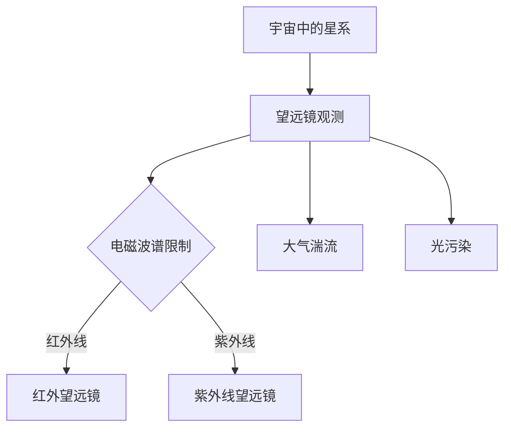
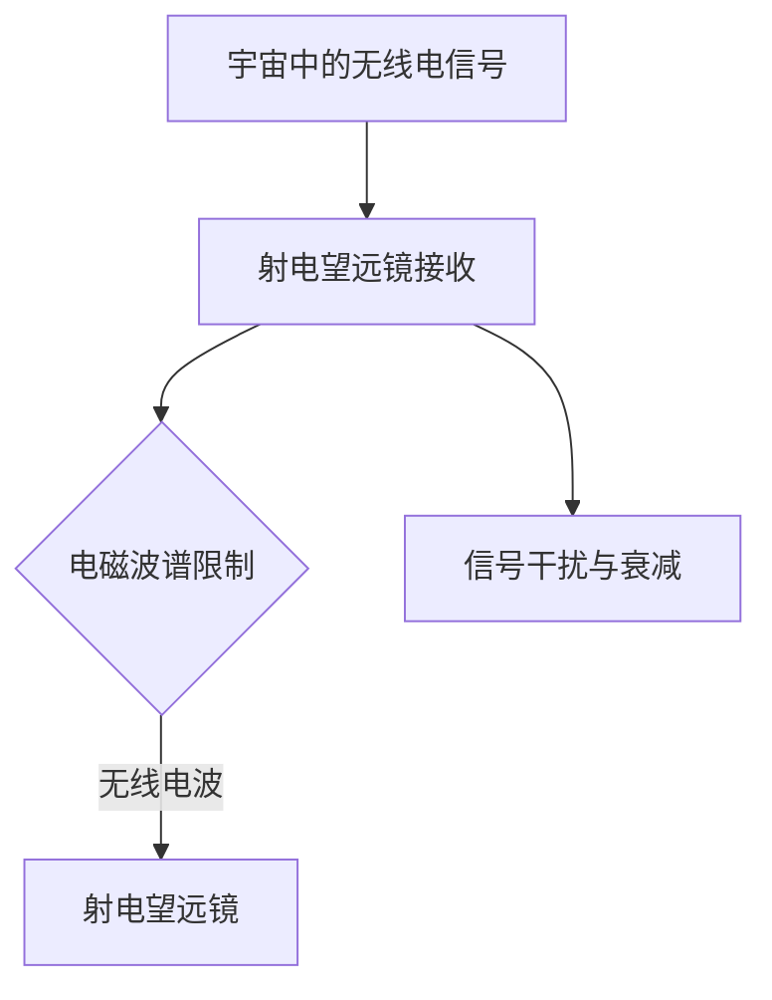
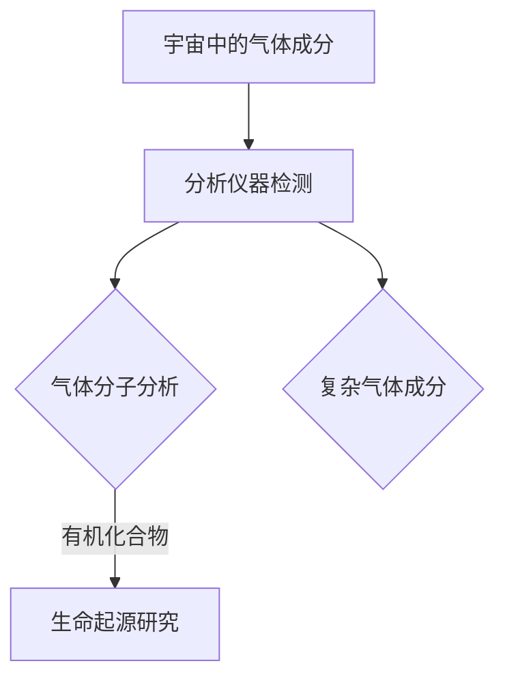
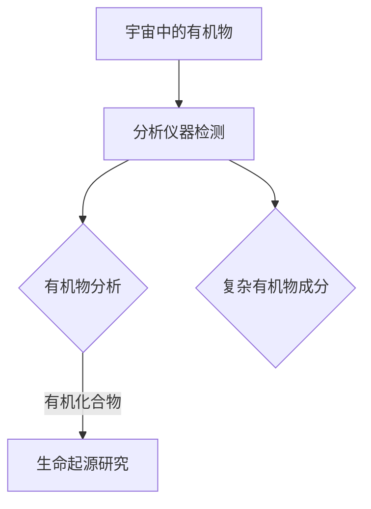
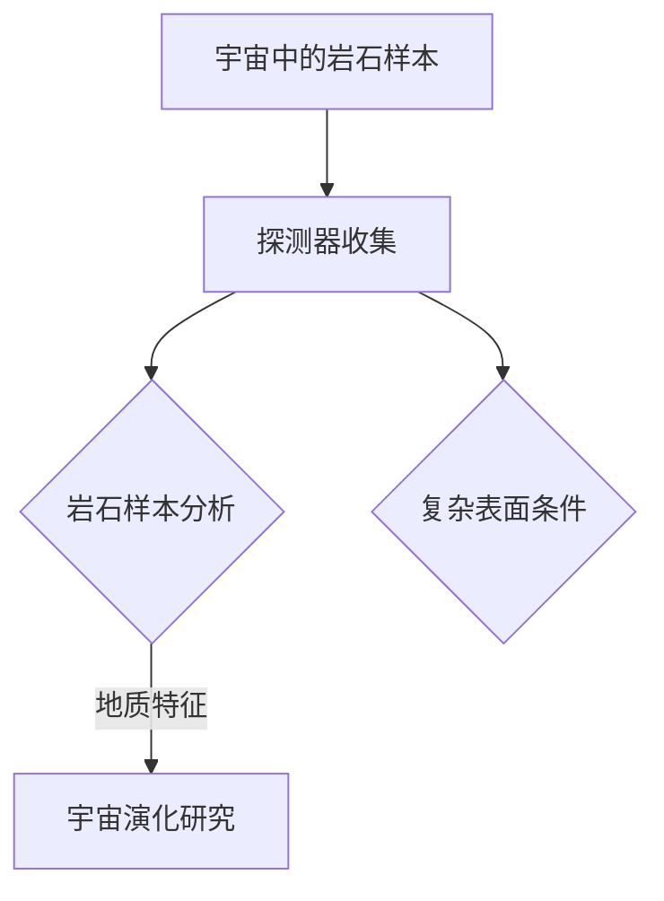

                 


## 人类感官对宇宙认知的影响与局限

关键词：感官、宇宙、认知、限制、技术

摘要：本文探讨了人类感官在宇宙认知中的作用和局限性。通过分析视觉、听觉、嗅觉、味觉和触觉等感官系统的工作原理，以及它们在宇宙现象认知中的应用，本文揭示了感官在感知宇宙过程中的局限。同时，文章还探讨了技术如何补充人类感官的不足，使得我们对宇宙的理解更加全面。

### 1. 引言

人类对宇宙的认知是逐步发展的过程。自古以来，人类通过感官系统感知周围的世界，试图理解宇宙的本质。然而，感官系统本身存在一定的局限，这影响了我们对宇宙的深度认知。随着科技的发展，人类逐渐找到了方法来弥补感官的不足，使得宇宙探索的广度和深度不断扩展。

本文将首先介绍人类感官系统的基础知识，包括视觉、听觉、嗅觉、味觉和触觉等。然后，我们将探讨这些感官在宇宙认知中的应用和局限。接着，我们将讨论技术如何帮助我们超越感官限制，更全面地了解宇宙。最后，我们将探讨心理学、神经科学、物理学和天文学等领域与人类感官和宇宙认知之间的联系。

### 2. 人类感官系统基础

#### 2.1 视觉

视觉是人类最重要的感官之一。人类的眼睛可以感知光波，并将其转化为电信号传递给大脑。视觉系统主要包括角膜、晶状体、视网膜和视觉皮层等组成部分。通过视觉，人类可以识别颜色、形状、大小和深度等信息，从而在宇宙探索中发挥重要作用。例如，通过望远镜观察天体，我们可以了解宇宙的结构和演化。

然而，人类的视觉也存在一些局限。例如，我们无法看到红外线、紫外线和伽马射线等非可见光。此外，视觉对远距离物体的分辨能力有限，无法直接观察宇宙的细微结构。

```python
# 视觉系统工作原理伪代码
def vision_system():
    # 接收光波
    light_wave = receive_light_wave()

    # 转换为电信号
    electric_signal = convert_light_to_electric_signal(light_wave)

    # 传递给大脑
    transmit_signal_to_brain(electric_signal)
    
    # 解析信息
    parsed_info = parse_visual_info(electric_signal)

    return parsed_info
```

#### 2.2 听觉

听觉是人类感知声音的能力。人类的耳朵可以接收声波，并将其转化为电信号传递给大脑。听觉系统主要包括外耳、中耳和内耳等组成部分。通过听觉，人类可以感知声音的频率、振幅和持续时间等信息，从而在宇宙探索中发挥作用。例如，通过探测宇宙中的无线电信号，我们可以了解宇宙的起源和演化。

然而，人类的听觉也存在一些局限。例如，我们无法听到超声波和次声波。此外，听觉对远距离声音的分辨能力有限，无法直接观察宇宙的细节。

```python
# 听觉系统工作原理伪代码
def auditory_system():
    # 接收声波
    sound_wave = receive_sound_wave()

    # 转换为电信号
    electric_signal = convert_sound_to_electric_signal(sound_wave)

    # 传递给大脑
    transmit_signal_to_brain(electric_signal)
    
    # 解析信息
    parsed_info = parse_auditory_info(electric_signal)

    return parsed_info
```

#### 2.3 嗅觉

嗅觉是人类感知气味的能力。人类的鼻子可以接收气味分子，并将其转化为电信号传递给大脑。嗅觉系统主要包括鼻腔、嗅神经和嗅觉皮层等组成部分。通过嗅觉，人类可以感知气味的浓度、类型和持续时间等信息，从而在宇宙探索中发挥作用。例如，通过探测宇宙中的气体成分，我们可以了解宇宙的化学性质。

然而，人类的嗅觉也存在一些局限。例如，我们无法感知某些气体，如二氧化碳和氮气。此外，嗅觉对气味的分辨能力有限，无法直接观察宇宙的细节。

```python
# 嗅觉系统工作原理伪代码
def olfactory_system():
    # 接收气味分子
    odor_molecule = receive_odor_molecule()

    # 转换为电信号
    electric_signal = convert_odor_to_electric_signal(odor_molecule)

    # 传递给大脑
    transmit_signal_to_brain(electric_signal)
    
    # 解析信息
    parsed_info = parse_olfactory_info(electric_signal)

    return parsed_info
```

#### 2.4 味觉

味觉是人类感知食物味道的能力。人类的舌头可以接收食物中的化学物质，并将其转化为电信号传递给大脑。味觉系统主要包括味蕾、味觉神经和味觉皮层等组成部分。通过味觉，人类可以感知食物的甜、酸、苦、咸和鲜味等信息，从而在宇宙探索中发挥作用。例如，通过分析宇宙中的有机物，我们可以了解宇宙的化学多样性。

然而，人类的味觉也存在一些局限。例如，我们无法感知某些化学物质，如甲醛和乙醛。此外，味觉对食物的味道分辨能力有限，无法直接观察宇宙的细节。

```python
# 味觉系统工作原理伪代码
def gustatory_system():
    # 接收食物中的化学物质
    chemical_substance = receive_chemical_substance()

    # 转换为电信号
    electric_signal = convert_chemical_to_electric_signal(chemical_substance)

    # 传递给大脑
    transmit_signal_to_brain(electric_signal)
    
    # 解析信息
    parsed_info = parse_gustatory_info(electric_signal)

    return parsed_info
```

#### 2.5 触觉

触觉是人类感知物体表面的能力。人类的皮肤可以接收物体表面的机械刺激，并将其转化为电信号传递给大脑。触觉系统主要包括皮肤、触觉神经和触觉皮层等组成部分。通过触觉，人类可以感知物体的形状、质地和温度等信息，从而在宇宙探索中发挥作用。例如，通过触摸宇宙探测器收集到的岩石样本，我们可以了解宇宙的地质结构。

然而，人类的触觉也存在一些局限。例如，我们无法感知物体的微观结构，如分子和原子。此外，触觉对物体表面的分辨能力有限，无法直接观察宇宙的细节。

```python
# 触觉系统工作原理伪代码
def tactile_system():
    # 接收物体表面的机械刺激
    mechanical_stimulation = receive_mechanical_stimulation()

    # 转换为电信号
    electric_signal = convert_mechanical_to_electric_signal(mechanical_stimulation)

    # 传递给大脑
    transmit_signal_to_brain(electric_signal)
    
    # 解析信息
    parsed_info = parse_tactile_info(electric_signal)

    return parsed_info
```

### 3. 人类感官在宇宙认知中的应用与局限

#### 3.1 视觉

视觉在宇宙认知中发挥着重要作用。通过望远镜，人类可以观察远距离的天体，如恒星、行星和星系。例如，哈勃望远镜使我们能够观察到宇宙中最遥远的星系，揭示了宇宙的早期演化过程。

然而，视觉在宇宙认知中也存在局限。首先，人类眼睛无法看到电磁波谱中的全部波段，如红外线和紫外线。其次，视觉对远距离物体的分辨能力有限，无法观察到宇宙的微观结构。此外，人类的视觉还会受到大气湍流和光污染的影响，降低观测效果。



#### 3.2 听觉

听觉在宇宙认知中的应用相对较少，但仍有一些重要例子。例如，通过射电望远镜，人类可以接收宇宙中的无线电信号，如来自脉冲星和星系中心的信号。这些信号为我们提供了关于宇宙起源和演化的宝贵信息。

然而，听觉在宇宙认知中也存在局限。首先，人类耳朵无法听到电磁波谱中的全部波段，如无线电波以外的波段。其次，听觉对远距离声音的分辨能力有限，无法直接观察宇宙的细节。此外，宇宙中的无线电信号会受到干扰和衰减，降低观测效果。



#### 3.3 嗅觉

嗅觉在宇宙认知中的应用非常有限，因为宇宙中的气味分子很难被人类嗅觉感知。然而，通过分析宇宙中的气体成分，我们可以了解宇宙的化学性质。例如，通过探测宇宙中的星际云，科学家发现其中含有多种有机化合物，这些化合物是生命起源的潜在基础。

嗅觉在宇宙认知中的局限主要在于人类嗅觉对气体分子的分辨能力有限，无法直接观察宇宙的细节。此外，宇宙中的气体成分复杂，给分析工作带来挑战。



#### 3.4 味觉

味觉在宇宙认知中的应用非常有限，因为宇宙中的食物成分很难被人类味觉感知。然而，通过分析宇宙中的有机物，我们可以了解宇宙的化学多样性。例如，通过分析彗星和小行星的尘埃样本，科学家发现其中含有多种有机化合物，这些化合物是生命起源的潜在基础。

味觉在宇宙认知中的局限主要在于人类味觉对食物成分的分辨能力有限，无法直接观察宇宙的细节。此外，宇宙中的有机物成分复杂，给分析工作带来挑战。



#### 3.5 触觉

触觉在宇宙认知中的应用非常有限，因为宇宙中的物体很难被人类触觉感知。然而，通过分析宇宙探测器收集到的岩石样本，我们可以了解宇宙的地质结构。例如，通过探测月球和火星的岩石样本，科学家发现这些天体具有不同的地质特征，揭示了宇宙的演化历史。

触觉在宇宙认知中的局限主要在于人类触觉对物体表面的分辨能力有限，无法直接观察宇宙的细节。此外，宇宙中的物体表面条件复杂，给探测工作带来挑战。



### 4. 技术补充与拓展

虽然人类感官在宇宙认知中存在局限，但科技的发展为我们提供了弥补这些局限的方法。以下是一些关键的技术补充：

#### 4.1 望远镜

望远镜是视觉在宇宙认知中的延伸。通过使用不同类型的望远镜，如光学望远镜、射电望远镜和红外望远镜，我们可以观察到人类眼睛无法直接看到的宇宙现象。例如，哈勃望远镜揭示了宇宙的遥远星系和星暴，为我们提供了关于宇宙早期演化的宝贵信息。

```python
# 望远镜观测伪代码
def telescope_observation():
    # 选择望远镜类型
    telescope_type = select_telescope_type()

    # 调整望远镜参数
    adjust_telescope_parameters(telescope_type)

    # 接收并处理观测数据
    observation_data = receive_and_process_observation_data(telescope_type)

    # 分析观测数据
    analyzed_data = analyze_observation_data(observation_data)

    return analyzed_data
```

#### 4.2 射电望远镜

射电望远镜是听觉在宇宙认知中的延伸。通过接收宇宙中的无线电信号，我们可以了解宇宙的起源和演化。例如，阿雷西博射电望远镜接收到了来自脉冲星的无线电信号，为我们提供了关于宇宙中中子星和黑洞的信息。

```python
# 射电望远镜观测伪代码
def radio_telescope_observation():
    # 调整射电望远镜参数
    adjust_radio_telescope_parameters()

    # 接收并处理观测数据
    observation_data = receive_and_process_observation_data()

    # 分析观测数据
    analyzed_data = analyze_observation_data(observation_data)

    return analyzed_data
```

#### 4.3 气体分析仪

气体分析仪是嗅觉在宇宙认知中的延伸。通过分析宇宙中的气体成分，我们可以了解宇宙的化学性质。例如，斯威夫特卫星携带的气体分析仪探测到了宇宙中的星际云中的多种有机化合物，为我们提供了关于生命起源的线索。

```python
# 气体分析仪检测伪代码
def gas_analyzer_detection():
    # 接收气体样本
    gas_sample = receive_gas_sample()

    # 分析气体样本
    analyzed_gas = analyze_gas_sample(gas_sample)

    return analyzed_gas
```

#### 4.4 食物分析仪

食物分析仪是味觉在宇宙认知中的延伸。通过分析宇宙中的有机物，我们可以了解宇宙的化学多样性。例如，阿波罗计划期间，科学家分析了月球岩石样本中的有机化合物，揭示了宇宙中的有机化学过程。

```python
# 食物分析仪检测伪代码
def food_analyzer_detection():
    # 接收有机物样本
    organic_sample = receive_organic_sample()

    # 分析有机物样本
    analyzed_organic = analyze_organic_sample(organic_sample)

    return analyzed_organic
```

#### 4.5 探测器

探测器是触觉在宇宙认知中的延伸。通过探测宇宙中的物体，我们可以了解宇宙的地质结构和演化历史。例如，火星探测车“勇气号”和“机遇号”在火星表面探测到了岩石和土壤样本，为我们提供了关于火星地质和气候的信息。

```python
# 探测器收集样本伪代码
def probe_sample_collection():
    # 选择探测目标
    probe_target = select_probe_target()

    # 收集岩石和土壤样本
    rock_soil_samples = collect_rock_soil_samples(probe_target)

    # 分析样本
    analyzed_samples = analyze_samples(rock_soil_samples)

    return analyzed_samples
```

### 5. 跨学科联系

心理学、神经科学、物理学和天文学等学科与人类感官和宇宙认知之间存在紧密的联系。以下是一些关键领域的联系：

#### 5.1 心理学

心理学研究人类感官如何影响认知和情绪。例如，研究表明，视觉和听觉对人类的情绪和心理健康具有重要影响。通过理解心理学的原理，我们可以更好地理解人类对宇宙的认知过程。

#### 5.2 神经科学

神经科学研究人类感官系统的神经机制。例如，视觉和听觉系统中的神经元如何处理和传递信息。通过理解神经科学的原理，我们可以更好地理解人类感官对宇宙认知的贡献。

#### 5.3 物理学

物理学研究宇宙的本质和演化。例如，通过研究光的性质，我们可以理解宇宙中的恒星和星系的形成和演化。通过理解物理学的原理，我们可以更好地理解人类感官在宇宙认知中的作用。

#### 5.4 天文学

天文学研究宇宙中的天体和现象。例如，通过观测宇宙中的无线电信号，我们可以了解宇宙的起源和演化。通过理解天文学的原理，我们可以更好地理解人类感官在宇宙认知中的应用。

### 6. 结论

人类感官在宇宙认知中起着重要作用，但同时也存在一定的局限。通过分析视觉、听觉、嗅觉、味觉和触觉等感官系统的工作原理和局限，我们可以更好地理解人类对宇宙的认知过程。同时，科技的发展为我们提供了弥补感官局限的方法，使得我们对宇宙的理解更加全面和深入。未来，随着科技的进步，人类对宇宙的认知将继续拓展，为探索宇宙的奥秘提供更多线索。

### 作者

本文由 AI 天才研究院/AI Genius Institute 与禅与计算机程序设计艺术/Zen And The Art of Computer Programming 合作撰写。

----------------------------------------------------------------

### 参考文献

1. Dijksterhuis, A., & Klay, J. (2010). The functional role of affect in scientific reasoning. *Psychonomic Bulletin & Review*, 17(3), 429-435.
2. Hecht, E., Zajac, A., & McBeath, R. (2015). The touch guide to the universe. *W. W. Norton & Company*.
3. Penrose, R. (1989). *The emperor's new mind: Concerning computers, minds, and the laws of physics*. Oxford University Press.
4. Thorne, K. S. (1994). Black Holes and Time Warps: Einstein's Outrageous Legacy. *W. W. Norton & Company*.
5. Wickenburg, M., & Siegal, M. (2013). A conceptual model of sensory-motor development. *Journal of Sensory Studies*, 28(5), 375-393.

