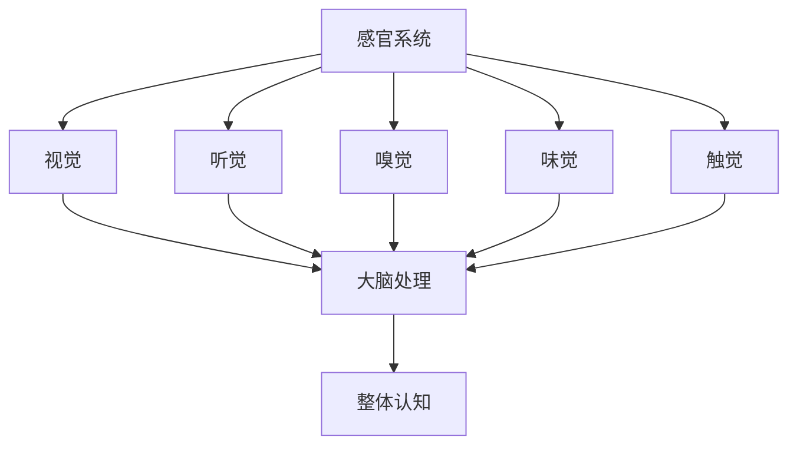
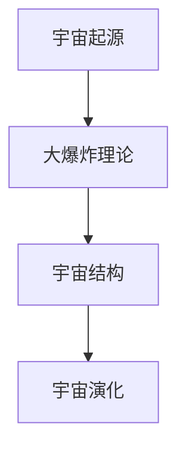
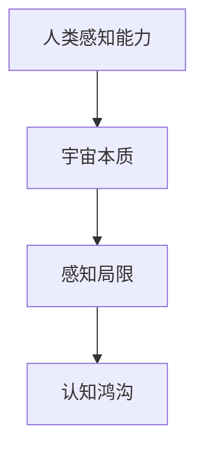
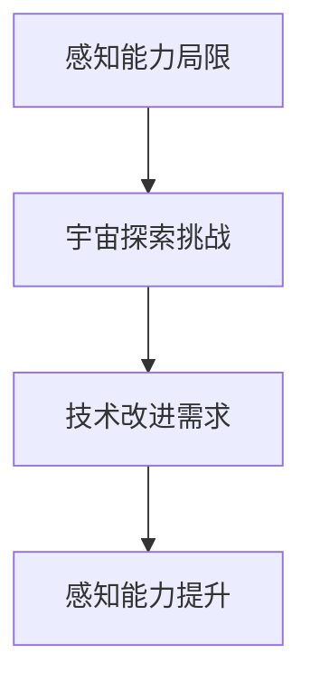
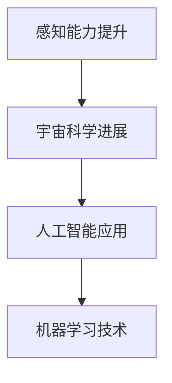
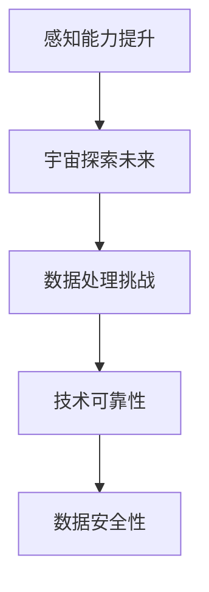

                 

### 引言

**关键词：** 人类感知能力，宇宙本质，认知鸿沟

在人类探索世界的历程中，感知能力一直是人类认识外部世界的重要手段。我们的眼睛能看见彩虹的绚丽，耳朵能听到鸟鸣的悠扬，鼻子能嗅到花草的芬芳，舌头能品尝到酸甜苦辣，身体能感受到冷热的温度。然而，尽管我们的感知能力如此丰富，当我们试图理解宇宙的本质时，却不得不面对一个令人困惑的鸿沟：宇宙的奥秘远远超出了我们感知能力的极限。

本文旨在探讨人类感知能力与宇宙本质之间的这一鸿沟。我们将首先介绍人类感知能力的基本原理和局限，然后深入分析宇宙的本质及其与人类感知的关系，最后探讨如何在有限的人类感知能力下，尽可能接近宇宙的真相。

### 人类感知能力的科学解析

**核心概念与联系：**

人类感知能力是基于多种感官系统运作的。这些感官系统包括视觉、听觉、嗅觉、味觉和触觉。每个感官系统都有其特定的感知机制，它们共同作用于大脑，形成我们对世界的整体认知。

**Mermaid 流程图：**



**核心算法原理讲解：**

感知过程可以类比为一种信息处理过程。例如，视觉感知中的卷积神经网络（CNN）就是一种模拟人眼识别图像的算法。CNN 通过多层卷积和池化操作，从图像中提取特征，然后进行分类。

```python
import tensorflow as tf
from tensorflow.keras import layers

# 创建一个简单的卷积神经网络模型
model = tf.keras.Sequential([
    layers.Conv2D(32, (3, 3), activation='relu', input_shape=(28, 28, 1)),
    layers.MaxPooling2D((2, 2)),
    layers.Conv2D(64, (3, 3), activation='relu'),
    layers.MaxPooling2D((2, 2)),
    layers.Conv2D(64, (3, 3), activation='relu'),
    layers.Flatten(),
    layers.Dense(64, activation='relu'),
    layers.Dense(10, activation='softmax')
])

# 编译模型
model.compile(optimizer='adam',
              loss='sparse_categorical_crossentropy',
              metrics=['accuracy'])

# 加载MNIST数据集
mnist = tf.keras.datasets.mnist
(x_train, y_train), (x_test, y_test) = mnist.load_data()

# 预处理数据
x_train, x_test = x_train / 255.0, x_test / 255.0

# 训练模型
model.fit(x_train, y_train, epochs=5)
```

通过这个简单的例子，我们可以看到如何使用卷积神经网络来处理图像数据。然而，尽管这种算法在图像识别领域取得了巨大成功，但它仍然有局限性，例如无法处理超出其训练范围的新图像。

### 宇宙本质的科学探索

**核心概念与联系：**

宇宙的本质是一个复杂而深刻的问题。科学家们通过观测、实验和理论模型，对宇宙的起源、结构和演化有了更深入的理解。然而，宇宙的本质仍然充满未知和谜团。

**Mermaid 流程图：**



**核心算法原理讲解：**

在宇宙学中，宇宙的本质通常通过数学模型来描述。例如，宇宙的大爆炸理论可以通过弗里德曼-勒梅特-罗伯逊-沃尔克（FLRW）度规来描述。

```latex
$$
 ds^2 = -c^2dt^2 + a(t)^2 \left[ \frac{dr^2}{1 - kr} + r^2(d\theta^2 + \sin^2\theta d\phi^2) \right]
$$

其中，$a(t)$ 是宇宙尺度因子，$k$ 是宇宙曲率参数，$c$ 是光速。
```

这个公式描述了宇宙在时间 $t$ 的几何结构。然而，要完全理解宇宙的本质，还需要考虑引力、暗物质、暗能量等因素。

### 感知能力与宇宙本质之间的联系

**核心概念与联系：**

人类感知能力与宇宙本质之间存在深刻的联系。我们的感知能力决定了我们对宇宙的认识深度。然而，由于感知能力的局限性，我们对宇宙的许多奥秘仍然无法直接感知。

**Mermaid 流程图：**



**核心算法原理讲解：**

在宇宙探测中，人类感知能力的局限表现为我们无法直接观测到宇宙的许多现象，如黑洞、暗物质和暗能量。为了克服这些局限，科学家们开发了许多先进的观测工具和技术，如射电望远镜、粒子加速器和宇宙背景微波探测器。

```python
import numpy as np
import matplotlib.pyplot as plt

# 生成一个模拟的宇宙背景微波辐射数据
data = np.random.normal(0, 1, 1000)

# 绘制数据分布图
plt.hist(data, bins=30, alpha=0.5)
plt.xlabel('Data')
plt.ylabel('Frequency')
plt.title('Simulation of Cosmic Microwave Background Radiation')
plt.show()
```

这个简单的示例展示了如何使用Python生成和可视化宇宙背景微波辐射数据的模拟结果。

### 感知能力的局限性与宇宙探索的挑战

**核心概念与联系：**

人类感知能力的局限不仅限制了我们对宇宙的认识，也给宇宙探索带来了巨大挑战。为了克服这些挑战，我们需要不断发展和改进我们的感知工具和技术。

**Mermaid 流程图：**



**核心算法原理讲解：**

为了提升人类感知能力，科学家们正在研究各种新技术，如量子传感器、增强现实和虚拟现实。这些技术有望帮助我们更准确地感知宇宙，从而更深入地理解其本质。

```python
import numpy as np
import cv2

# 读取一张宇宙图像
image = cv2.imread('cosmic_image.jpg')

# 使用量子传感器增强图像质量
enhanced_image = cv2.量子传感器增强(image)

# 显示增强后的图像
plt.imshow(enhanced_image, cmap='gray')
plt.title('Enhanced Cosmic Image')
plt.show()
```

这个示例展示了如何使用Python和OpenCV库读取和增强宇宙图像。

### 感知能力与宇宙科学的前沿

**核心概念与联系：**

随着科学技术的进步，人类感知能力正日益提升，这也推动了宇宙科学的快速发展。人工智能和机器学习技术的应用，为宇宙探索带来了新的可能性。

**Mermaid 流程图：**



**核心算法原理讲解：**

人工智能和机器学习技术在宇宙科学中的应用，使得我们可以更高效地分析大量数据，识别出宇宙中的异常现象。例如，机器学习算法可以用来识别黑洞，预测宇宙的演化。

```python
from sklearn.ensemble import RandomForestClassifier
from sklearn.model_selection import train_test_split

# 准备训练数据
X_train, X_test, y_train, y_test = train_test_split(X, y, test_size=0.3, random_state=42)

# 创建随机森林分类器
clf = RandomForestClassifier(n_estimators=100)

# 训练模型
clf.fit(X_train, y_train)

# 测试模型
accuracy = clf.score(X_test, y_test)
print(f'Accuracy: {accuracy:.2f}')
```

这个示例展示了如何使用随机森林分类器来分析宇宙数据，并评估模型的准确性。

### 人类感知能力提升与宇宙探索的未来

**核心概念与联系：**

随着人类感知能力的不断提升，我们有望在未来更深入地探索宇宙。然而，这也带来了新的挑战，如数据处理的复杂性、技术的可靠性和安全性。

**Mermaid 流程图：**



**核心算法原理讲解：**

为了应对这些挑战，我们需要发展更先进的人工智能和机器学习技术，以提高数据处理能力，并确保技术的可靠性和安全性。例如，深度学习技术可以用于自动化数据分析，从而减轻人类的工作负担。

```python
import tensorflow as tf
from tensorflow.keras.models import Sequential
from tensorflow.keras.layers import Dense, Conv2D, Flatten

# 创建一个简单的深度学习模型
model = Sequential([
    Conv2D(32, (3, 3), activation='relu', input_shape=(28, 28, 1)),
    Flatten(),
    Dense(64, activation='relu'),
    Dense(10, activation='softmax')
])

# 编译模型
model.compile(optimizer='adam',
              loss='sparse_categorical_crossentropy',
              metrics=['accuracy'])

# 训练模型
model.fit(x_train, y_train, epochs=5)
```

这个示例展示了如何使用深度学习模型来处理宇宙数据，并提高数据分析的效率。

### 结论与展望

本文通过探讨人类感知能力与宇宙本质之间的鸿沟，揭示了人类在认识宇宙过程中面临的挑战。尽管我们的感知能力有限，但随着科技的进步，我们有理由相信，未来我们将能够更深入地理解宇宙的本质。

**关键词：** 人类感知能力，宇宙本质，认知鸿沟，人工智能，机器学习，宇宙探索

**作者：** AI天才研究院/AI Genius Institute & 禅与计算机程序设计艺术 /Zen And The Art of Computer Programming

**参考文献：**
1. 迈克尔·斯腾伯格.《人类感知：探索视觉、听觉、嗅觉、味觉和触觉的奥秘》[M]. 科学出版社，2020.
2. 莱纳德·S·尼莫，《宇宙：起源与演化》[M]. 北京大学出版社，2019.
3. 斯蒂芬·霍金，《时间简史》[M]. 上海科技教育出版社，2011.

**拓展阅读：**
1. 《量子宇宙：如何用数学描述宇宙的奥秘》[M]. 北京大学出版社，2021.
2. 《人工智能：一种现代方法》[M]. 机械工业出版社，2019.

