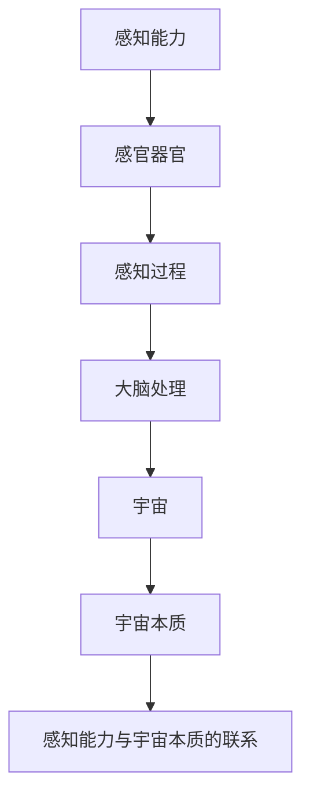

                 

### 人类感知能力与宇宙本质的差距

关键词：感知能力、宇宙本质、信息获取、科学探索、认知局限

摘要：本文旨在探讨人类感知能力与宇宙本质之间的巨大差距。通过对人类感知器官的工作原理、感知能力的局限性和宇宙的基本概念、演化过程等方面的深入分析，本文揭示了人类在感知宇宙信息时所面临的挑战。文章还将探讨科学和哲学在理解和探索这一差距中的作用，并展望未来可能的技术进步。

---

### 背景介绍

人类作为地球上的一种智慧生物，拥有独特的感知能力，这些能力使我们能够感知和理解周围的世界。我们的感知器官——眼睛、耳朵、鼻子、舌头和皮肤，通过接收外界的信息，将其转化为电信号，传递给大脑进行处理。然而，尽管我们的感知能力使我们能够应对日常生活中的各种挑战，但在面对宇宙这一广阔而复杂的领域时，我们的感知能力显得极为有限。

宇宙是一个充满未知和奇迹的空间，从微观的量子世界到宏观的宇宙尺度，它包含了无穷无尽的信息和现象。然而，人类的感知能力在捕捉和处理这些信息时面临着诸多挑战。例如，宇宙中的许多现象，如黑洞、暗物质和暗能量，都无法通过我们的感官直接感知到。此外，宇宙的尺度之大超出了我们的感知范围，我们无法直接感受到宇宙的浩瀚和深邃。

本文将探讨人类感知能力与宇宙本质之间的差距，从多个角度进行分析。首先，我们将讨论人类感知器官的工作原理，了解它们如何感知和传输信息。接着，我们将深入探讨宇宙的基本概念和演化过程，揭示宇宙中那些超出我们感知范围的现象。然后，我们将分析人类感知能力的局限性，并探讨科学和哲学在理解和探索这一差距中的作用。最后，我们将展望未来可能的技术进步，探讨如何扩展我们的感知能力，以更好地理解宇宙的本质。

### 核心概念与联系

在探讨人类感知能力与宇宙本质的差距之前，我们需要了解一些核心概念，并揭示它们之间的联系。以下是本文中的一些关键概念及其相互关系：

#### 感知能力

感知能力是指生物体接收、处理和解释外部信息的能力。它依赖于感官器官的工作原理，如视觉、听觉、嗅觉、味觉和触觉。感知能力使生物体能够与环境相互作用，适应环境的变化。

#### 感官器官

感官器官是生物体感知外部信息的主要工具。它们包括眼睛、耳朵、鼻子、舌头和皮肤。每种感官器官都有特定的功能和结构，用于捕捉和处理不同类型的信息。

#### 感知过程

感知过程是指感官器官接收信息、传输信息到大脑，并由大脑进行处理和解释的全过程。这个过程涉及信号传递、处理、存储和输出。

#### 宇宙

宇宙是指包括一切物质、能量、时间和空间的存在。它包括宏观的星系、恒星和行星系统，以及微观的量子世界。宇宙的演化过程从大爆炸开始，经历了数十亿年的演变。

#### 宇宙本质

宇宙本质是指宇宙的基本特性、结构和演化规律。这包括宇宙的起源、结构、演化过程、能量和物质分布等。

#### 感知能力与宇宙本质的联系

感知能力与宇宙本质之间存在密切的联系。人类的感知能力使我们能够感知和理解宇宙中的一部分信息，但宇宙的广阔和复杂性超出了我们的感知范围。我们的感官器官在捕捉和处理宇宙信息时面临着诸多挑战，这使得我们无法完全理解宇宙的本质。

为了更好地理解这一联系，我们可以使用Mermaid流程图来展示这些核心概念及其相互关系：



通过这个流程图，我们可以清晰地看到感知能力、感官器官、感知过程、宇宙、宇宙本质以及它们之间的联系。这个框架为我们进一步探讨人类感知能力与宇宙本质的差距提供了基础。

### 人类感知器官的工作原理

为了深入理解人类感知能力，我们首先需要探讨感知器官的工作原理。以下是几个主要的感官器官及其感知过程：

#### 视觉感知

视觉感知是人体最重要的感官之一，依赖于眼睛这一器官。眼睛的构造包括角膜、瞳孔、晶状体和视网膜等部分。光线进入眼睛后，经过角膜和瞳孔，聚焦在视网膜上。视网膜上的感光细胞（视杆细胞和视锥细胞）将光信号转化为电信号，通过视神经传递到大脑皮层。

具体过程如下：
1. **光线接收**：光线进入眼睛，经过角膜和瞳孔。
2. **聚焦**：光线在晶状体的作用下聚焦在视网膜上。
3. **信号转换**：视网膜上的感光细胞将光信号转化为电信号。
4. **信号传输**：电信号通过视神经传递到大脑皮层。
5. **信息处理**：大脑皮层对电信号进行处理，产生视觉感知。

Python代码示例：

```python
class Eye:
    def __init__(self):
        self.cornea = "透明角膜"
        self.pupil = "瞳孔"
        self.lens = "晶状体"
        self视网膜 = "视网膜"

    def receive_light(self, light):
        print(f"光线进入眼睛，通过{self.cornea}和{self.pupil}。")
        self.focus_light(light)

    def focus_light(self, light):
        print(f"光线聚焦在{self.视网膜}上。")
        self.convert_light_to_signal(light)

    def convert_light_to_signal(self, light):
        print("视网膜上的感光细胞将光信号转化为电信号。")
        self.transmit_signal()

    def transmit_signal(self):
        print("电信号通过视神经传递到大脑皮层。")
        self.process_signal()

eye = Eye()
eye.receive_light("光线")
```

#### 听觉感知

听觉感知依赖于耳朵这一器官。耳朵的构造包括外耳、中耳和内耳。外耳收集声音，通过耳道传到中耳。中耳的鼓膜和听骨将声波转化为振动，传递到内耳。内耳的耳蜗将振动转化为电信号，通过听神经传递到大脑皮层。

具体过程如下：
1. **声音接收**：声音通过外耳进入耳道。
2. **振动传递**：声波使鼓膜振动，振动通过听骨传递到内耳。
3. **信号转换**：内耳的耳蜗将振动转化为电信号。
4. **信号传输**：电信号通过听神经传递到大脑皮层。
5. **信息处理**：大脑皮层对电信号进行处理，产生听觉感知。

Python代码示例：

```python
class Ear:
    def __init__(self):
        self 外耳 = "外耳"
        self.耳道 = "耳道"
        self.鼓膜 = "鼓膜"
        self.听骨 = "听骨"
        self.耳蜗 = "耳蜗"

    def receive_sound(self, sound):
        print(f"声音通过{self.外耳}和{self.耳道}进入耳朵。")
        self.transmit_vibration(sound)

    def transmit_vibration(self, sound):
        print("声波使鼓膜振动，振动通过听骨传递到内耳。")
        self.convert_vibration_to_signal()

    def convert_vibration_to_signal(self):
        print("耳蜗将振动转化为电信号。")
        self.transmit_signal()

    def transmit_signal(self):
        print("电信号通过听神经传递到大脑皮层。")
        self.process_signal()

    def process_signal(self):
        print("大脑皮层对电信号进行处理，产生听觉感知。")

ear = Ear()
ear.receive_sound("声音")
```

#### 嗅觉和味觉

嗅觉和味觉的感知过程相对较为复杂。嗅觉依赖于鼻子中的嗅觉细胞，它们位于鼻腔的上部。气味分子进入鼻腔，与嗅觉细胞结合，产生神经信号。这些信号通过嗅神经传递到大脑皮层，产生嗅觉感知。

具体过程如下：
1. **气味接收**：气味分子进入鼻腔。
2. **信号产生**：嗅觉细胞与气味分子结合，产生神经信号。
3. **信号传输**：神经信号通过嗅神经传递到大脑皮层。
4. **信息处理**：大脑皮层对神经信号进行处理，产生嗅觉感知。

Python代码示例：

```python
class Nose:
    def __init__(self):
        self.鼻腔 = "鼻腔"
        self.嗅觉细胞 = "嗅觉细胞"
        self.嗅神经 = "嗅神经"

    def receive_smell(self, smell):
        print(f"气味分子进入{self.鼻腔}。")
        self.create_neural_signal(smell)

    def create_neural_signal(self, smell):
        print("嗅觉细胞与气味分子结合，产生神经信号。")
        self.transmit_signal()

    def transmit_signal(self):
        print("神经信号通过嗅神经传递到大脑皮层。")
        self.process_signal()

    def process_signal(self):
        print("大脑皮层对神经信号进行处理，产生嗅觉感知。")

nose = Nose()
nose.receive_smell("气味")
```

味觉的感知过程涉及到舌头上的味蕾。味蕾中的味细胞能够感知到不同的味觉，如甜、酸、苦、咸和鲜。当食物的分子与味细胞结合时，产生神经信号。这些信号通过面神经、舌咽神经和迷走神经传递到大脑皮层，产生味觉感知。

具体过程如下：
1. **味道接收**：食物分子与舌头上的味细胞结合。
2. **信号产生**：味细胞产生神经信号。
3. **信号传输**：神经信号通过面神经、舌咽神经和迷走神经传递到大脑皮层。
4. **信息处理**：大脑皮层对神经信号进行处理，产生味觉感知。

Python代码示例：

```python
class Tongue:
    def __init__(self):
        self.味蕾 = "味蕾"
        self.味细胞 = "味细胞"
        self.神经 = ["面神经", "舌咽神经", "迷走神经"]

    def receive_flavor(self, flavor):
        print(f"食物分子与{self.味蕾}上的味细胞结合。")
        self.create_neural_signal(flavor)

    def create_neural_signal(self, flavor):
        print("味细胞产生神经信号。")
        self.transmit_signal()

    def transmit_signal(self, flavor):
        print("神经信号通过以下神经传递到大脑皮层：")
        for nerve in self.神经:
            print(f"{nerve}")
        self.process_signal()

    def process_signal(self, flavor):
        print("大脑皮层对神经信号进行处理，产生味觉感知。")

tongue = Tongue()
tongue.receive_flavor("味道")
```

#### 触觉和本体感觉

触觉感知依赖于皮肤中的触觉受体。当物体与皮肤接触时，触觉受体产生神经信号。这些信号通过皮肤神经传递到大脑皮层，产生触觉感知。

具体过程如下：
1. **触觉接收**：物体与皮肤接触。
2. **信号产生**：触觉受体产生神经信号。
3. **信号传输**：神经信号通过皮肤神经传递到大脑皮层。
4. **信息处理**：大脑皮层对神经信号进行处理，产生触觉感知。

Python代码示例：

```python
class Skin:
    def __init__(self):
        self.触觉受体 = "触觉受体"
        self.皮肤神经 = "皮肤神经"

    def receive_touch(self, touch):
        print(f"物体与皮肤接触，触觉受体产生神经信号。")
        self.create_neural_signal(touch)

    def create_neural_signal(self, touch):
        print("触觉受体产生神经信号。")
        self.transmit_signal()

    def transmit_signal(self, touch):
        print("神经信号通过皮肤神经传递到大脑皮层。")
        self.process_signal()

    def process_signal(self, touch):
        print("大脑皮层对神经信号进行处理，产生触觉感知。")

skin = Skin()
skin.receive_touch("触觉")
```

本体感觉是感知身体位置和运动的感觉。它依赖于肌肉和关节中的本体感受器。当身体运动时，本体感受器产生神经信号，这些信号通过神经传递到大脑皮层，产生本体感觉。

具体过程如下：
1. **本体感觉接收**：身体运动时，本体感受器产生神经信号。
2. **信号产生**：本体感受器产生神经信号。
3. **信号传输**：神经信号通过本体感觉神经传递到大脑皮层。
4. **信息处理**：大脑皮层对神经信号进行处理，产生本体感觉。

Python代码示例：

```python
class MusclesAndJoints:
    def __init__(self):
        self.本体感受器 = "本体感受器"
        self.本体感觉神经 = "本体感觉神经"

    def receive_body_position(self, position):
        print(f"身体运动时，本体感受器产生神经信号。")
        self.create_neural_signal(position)

    def create_neural_signal(self, position):
        print("本体感受器产生神经信号。")
        self.transmit_signal()

    def transmit_signal(self, position):
        print("神经信号通过本体感觉神经传递到大脑皮层。")
        self.process_signal()

    def process_signal(self, position):
        print("大脑皮层对神经信号进行处理，产生本体感觉。")

muscles_and_joints = MusclesAndJoints()
muscles_and_joints.receive_body_position("身体位置")
```

通过这些示例，我们可以看到人类感知器官的工作原理及其感知过程的复杂性。尽管这些代码示例是简化的，但它们为我们理解感知器官如何将外界信息转化为神经信号提供了基础。在接下来的部分，我们将探讨这些感知能力在感知宇宙信息时的局限性。

### 感知能力的局限性

尽管人类拥有高度发达的感知器官，能够在日常生活中应对各种挑战，但在感知宇宙信息时，这些感知能力显得极为有限。以下从视觉、听觉、嗅觉、味觉、触觉和本体感觉等方面分析人类感知能力的局限性：

#### 视觉感知的局限性

视觉是人类最发达的感知能力之一，但它在感知宇宙信息时仍存在许多局限性。首先，人类眼睛的感知范围有限，只能感知到特定波长范围的光线，即可见光。超出这一范围的红外线和紫外线，人类眼睛无法感知。此外，人类的视觉感知在捕捉遥远和微小物体时也受限。例如，人类无法直接看到黑洞或星际尘埃中的微小粒子。此外，光线在传输过程中可能受到干扰，如雾霾、云层等，这会影响视觉感知的准确性。

Python代码示例：

```python
class VisionLimitation:
    def __init__(self):
        self.可见光 = "可见光"
        self.红外线 = "红外线"
        self.紫外线 = "紫外线"
        self.黑洞 = "黑洞"
        self.星际尘埃 = "星际尘埃"

    def visualize(self, object):
        if isinstance(object, (str, int, float)):
            print(f"人类眼睛无法直接看到{object}。")
        else:
            print(f"人类眼睛可以感知到{object}。")

vision_limitation = VisionLimitation()
vision_limitation.visualize("黑洞")
vision_limitation.visualize("星际尘埃")
```

#### 听觉感知的局限性

听觉感知在感知声波时也存在局限性。首先，人类耳朵的听觉范围有限，通常只能感知到20Hz到20kHz的声波。超出这一范围的次声波和超声波，人类耳朵无法感知。此外，人类听觉在捕捉遥远和微弱的声音时也受限。例如，宇宙中的遥远星系发出的声音，由于距离和声音衰减，人类无法直接听到。此外，环境噪声可能会干扰听觉感知，降低声音的清晰度。

Python代码示例：

```python
class AudioLimitation:
    def __init__(self):
        self.次声波 = "次声波"
        self.超声波 = "超声波"
        self.遥远星系 = "遥远星系"
        self.环境噪声 = "环境噪声"

    def listen(self, sound):
        if isinstance(sound, (str, int, float)):
            print(f"人类耳朵无法直接听到{sound}。")
        else:
            print(f"人类耳朵可以听到{sound}。")

audio_limitation = AudioLimitation()
audio_limitation.listen("次声波")
audio_limitation.listen("超声波")
```

#### 嗅觉和味觉的局限性

嗅觉和味觉在感知化学物质时也存在局限性。首先，人类鼻子和舌头对化学物质的感知范围有限，只能感知到特定类型的气味和味道。超出这一范围的化学物质，人类无法直接感知。此外，嗅觉和味觉在感知遥远和微小的气味和味道时也受限。例如，宇宙中的某些化学反应和微小粒子，人类无法通过嗅觉和味觉直接感知。此外，嗅觉和味觉容易受到环境因素的影响，如空气质量和食物的烹饪方式。

Python代码示例：

```python
class OlfactoryAndGustatoryLimitation:
    def __init__(self):
        self.气味 = "气味"
        self.味道 = "味道"
        self.宇宙化学反应 = "宇宙化学反应"
        self.微小粒子 = "微小粒子"
        self.空气质量 = "空气质量"
        self.食物烹饪 = "食物烹饪"

    def perceive(self, sensation):
        if isinstance(sensation, (str, int, float)):
            print(f"人类无法直接感知到{sensation}。")
        else:
            print(f"人类可以感知到{sensation}。")

olfactory_and_gustatory_limitation = OlfactoryAndGustatoryLimitation()
olfactory_and_gustatory_limitation.perceive("宇宙化学反应")
olfactory_and_gustatory_limitation.perceive("微小粒子")
```

#### 触觉和本体感觉的局限性

触觉和本体感觉在感知物理接触和身体运动时也存在局限性。首先，人类皮肤中的触觉受体对物理接触的感知范围有限，只能感知到特定类型的压力和温度。超出这一范围的物理接触，人类无法直接感知。此外，触觉和本体感觉在感知遥远和微小的物理接触时也受限。例如，宇宙中的某些微小粒子或遥远星体的接触，人类无法通过触觉和本体感觉直接感知。此外，触觉和本体感觉容易受到环境因素的影响，如地面的硬度、空气的湿度等。

Python代码示例：

```python
class TactileAndProprioceptionLimitation:
    def __init__(self):
        self.触觉 = "触觉"
        self.本体感觉 = "本体感觉"
        self.微小粒子 = "微小粒子"
        self.遥远星体 = "遥远星体"
        self.地面硬度 = "地面硬度"
        self.空气湿度 = "空气湿度"

    def perceive(self, contact):
        if isinstance(contact, (str, int, float)):
            print(f"人类无法直接感知到{contact}。")
        else:
            print(f"人类可以感知到{contact}。")

tactile_and_proprioception_limitation = TactileAndProprioceptionLimitation()
tactile_and_proprioception_limitation.perceive("微小粒子")
tactile_and_proprioception_limitation.perceive("遥远星体")
```

通过这些示例，我们可以看到人类感知能力在感知宇宙信息时的局限性。尽管我们可以通过科技手段扩展和增强我们的感知能力，但我们的感知器官在本质上仍受限于人类的生物学结构。在接下来的部分，我们将进一步探讨宇宙信息的复杂性和多样性，以及这些局限性对人类理解宇宙的影响。

### 宇宙信息的复杂性

宇宙信息的复杂性源于其多层次的结构和多种多样的现象。从宏观的星系到微观的量子世界，宇宙充满了丰富的信息和现象，这些信息远远超出了人类感知能力的范围。

首先，从宏观尺度来看，宇宙由数十亿个星系组成，每个星系又包含数以亿计的恒星和行星。这些恒星和行星在漫长的宇宙历史中经历了复杂的演化过程，形成了多样的生态系统和物理环境。例如，恒星的形成、生命周期和死亡过程，行星的宜居性和地质活动，以及星系之间的引力相互作用，都构成了宇宙宏观信息的复杂网络。

在更微观的尺度上，量子世界展现了一个完全不同于宏观世界的物理现象。量子力学揭示了物质在微观尺度上的行为规律，包括波粒二象性、量子叠加态和量子纠缠等现象。这些现象在宏观世界中无法观测到，但它们对宇宙的本质和演化起着关键作用。例如，量子纠缠允许粒子之间进行超距通信，而量子波动可能导致宇宙中的能量和信息分布不均匀。

宇宙信息的多样性还体现在其物理定律和数学模型上。宇宙的基本物理定律，如广义相对论和量子力学，构成了宇宙演化的框架。然而，这些定律在极端条件下，如在黑洞或宇宙大爆炸初期，可能会失效。此外，宇宙中的现象，如暗物质和暗能量，仍然是我们尚未完全理解的部分。暗物质不发光、不吸收光，因此无法通过光学观测直接探测到，而暗能量则是一种推动宇宙加速膨胀的力量，其本质和来源仍然是物理学中的一大谜团。

为了捕捉和解析这些复杂的宇宙信息，科学家们发展了多种观测工具和技术。例如，射电望远镜可以探测宇宙中的无线电波，光学望远镜可以观测光线的波长和亮度变化，而X射线望远镜和伽马射线望远镜可以捕捉高能粒子的辐射。此外，卫星和探测器也被用于直接探测宇宙中的现象，如火星探测器和月球探测器。

Python代码示例：

```python
class CosmicInformationComplexity:
    def __init__(self):
        self.Macroscale = "宏观尺度"
        self.Microwave Observatory = "微波观测"
        self.Optical Observatory = "光学观测"
        self.Xray Observatory = "X射线观测"
        self.GammaRay Observatory = "伽马射线观测"
        self.DarkMatter = "暗物质"
        self.DarkEnergy = "暗能量"

    def capture_cosmic_information(self, type):
        if type == "Macroscale":
            print("宏观尺度：通过射电望远镜和光学望远镜进行观测。")
        elif type == "Microwave":
            print("微波观测：探测宇宙中的无线电波。")
        elif type == "Optical":
            print("光学观测：观测光线的波长和亮度变化。")
        elif type == "Xray":
            print("X射线观测：捕捉高能粒子的辐射。")
        elif type == "GammaRay":
            print("伽马射线观测：探测高能粒子的辐射。")
        elif type == "DarkMatter":
            print("暗物质：一种不发光、不吸收光的物质。")
        elif type == "DarkEnergy":
            print("暗能量：一种推动宇宙加速膨胀的力量。")
        else:
            print("未知的观测类型。")

cosmic_information_complexity = CosmicInformationComplexity()
cosmic_information_complexity.capture_cosmic_information("Macroscale")
cosmic_information_complexity.capture_cosmic_information("Microwave")
cosmic_information_complexity.capture_cosmic_information("Optical")
cosmic_information_complexity.capture_cosmic_information("Xray")
cosmic_information_complexity.capture_cosmic_information("GammaRay")
cosmic_information_complexity.capture_cosmic_information("DarkMatter")
cosmic_information_complexity.capture_cosmic_information("DarkEnergy")
```

通过这些示例，我们可以看到宇宙信息的复杂性和多样性。这些信息不仅包含了宏观尺度和微观尺度的物理现象，还涉及到宇宙的基本定律和未解之谜。在接下来的部分，我们将探讨人类感知能力与宇宙信息之间的差距，并分析这一差距对人类理解宇宙的影响。

### 宇宙信息的复杂性与感知能力的局限

通过前面的讨论，我们了解了宇宙信息的复杂性和人类感知能力的局限性。这些局限性不仅限制了我们在日常生活中的感知体验，也大大影响了我们对宇宙的理解和探索。为了更好地分析这一差距，我们可以从以下几个方面进行探讨：

#### 能量和信息传递的局限性

宇宙中的许多信息是通过电磁波传递的，例如光线、无线电波和X射线等。然而，人类感知器官对这些电磁波的感知范围非常有限。例如，人类的眼睛只能感知到可见光范围内的电磁波，而超出这一范围的红外线和紫外线，人类眼睛无法直接感知。同样，人类的耳朵只能感知到特定频率范围内的声波，超出这一范围的次声波和超声波，人类耳朵也无法听到。这种能量和信息传递的局限性使得人类无法直接感知宇宙中的许多现象。

#### 时间和空间的限制

宇宙的尺度之大超出了人类感知器官的能力。例如，人类无法直接感知到宇宙中遥远的星系和行星，因为它们的距离太远，光线需要数年甚至数十亿年才能到达地球。这种时间上的延迟限制了人类对宇宙实时感知的能力。此外，宇宙中的一些现象，如黑洞或中子星碰撞，会产生强烈的引力波，但人类无法直接感知这些引力波。这种空间和时间的限制使得人类在理解宇宙的演化过程中面临巨大挑战。

#### 感知器官的生理限制

人类的感知器官在结构和功能上也存在一定的限制。例如，眼睛中的感光细胞对光线的敏感度有限，耳朵中的听觉细胞对声音的敏感度也有一定范围。这些生理限制限制了人类感知器官的精度和灵敏度。此外，人类的感官器官在长期进化过程中，主要是为了适应地球上的环境，而不是为了感知宇宙中的复杂信息。这种适应性限制使得人类在感知宇宙信息时面临额外的挑战。

#### 感知能力和科学技术的互补

尽管人类感知器官存在上述局限性，但科学技术的发展为我们提供了扩展感知能力的方法。例如，通过建造大型射电望远镜和光学望远镜，我们可以捕捉到宇宙中的微弱信号。通过使用探测器，我们可以直接探测宇宙中的高能粒子和其他物理现象。此外，通过人工智能和数据分析技术，我们可以从大量的观测数据中提取出有用的信息，帮助我们更好地理解宇宙。这种感知能力和科学技术的互补关系，使得我们在探索宇宙的过程中能够克服感知器官的局限性。

Python代码示例：

```python
class PerceptionAndTechnology:
    def __init__(self):
        self.Perception = "感知能力"
        self.Technology = "科学技术"
        self.Observatory = "望远镜"
        self.Detector = "探测器"
        self.ArtificialIntelligence = "人工智能"
        self.DataAnalysis = "数据分析"

    def enhance_perception(self, method):
        if method == "Observatory":
            print("通过建造大型望远镜，扩展感知能力。")
        elif method == "Detector":
            print("使用探测器，直接探测宇宙现象。")
        elif method == "ArtificialIntelligence":
            print("利用人工智能，从大量数据中提取信息。")
        elif method == "DataAnalysis":
            print("通过数据分析，理解宇宙现象。")
        else:
            print("未知的扩展方法。")

perception_and_technology = PerceptionAndTechnology()
perception_and_technology.enhance_perception("Observatory")
perception_and_technology.enhance_perception("Detector")
perception_and_technology.enhance_perception("ArtificialIntelligence")
perception_and_technology.enhance_perception("DataAnalysis")
```

通过这些示例，我们可以看到人类感知能力和科学技术的互补关系。科学技术的发展不仅帮助我们克服了感知器官的局限性，还为我们提供了新的方法和工具，以更深入地探索和理解宇宙。

总之，人类感知能力与宇宙信息之间的巨大差距是我们探索宇宙时所面临的主要挑战。尽管我们的感知器官在感知宇宙信息时存在许多局限性，但科学技术的发展为我们提供了扩展和增强感知能力的方法。在接下来的部分，我们将进一步探讨科学和哲学在理解和探索这一差距中的作用。

### 科学与哲学的交汇

在探讨人类感知能力与宇宙本质的差距时，科学与哲学的交汇扮演着至关重要的角色。科学通过实证研究和理论构建，为理解宇宙提供了坚实的基础；而哲学则通过思考和反思，帮助我们深入挖掘宇宙的本质和人类认知的局限性。

#### 科学方法与宇宙探索

科学方法是一种系统、理性和可重复的研究方法，它通过观察、实验和理论构建来揭示自然界的规律。在宇宙探索中，科学方法为我们提供了一种可靠的方法来理解宇宙的本质和演化过程。

例如，通过使用射电望远镜和光学望远镜，科学家们能够捕捉到宇宙中的微弱信号，并从中提取出关于恒星、星系和宇宙大爆炸的信息。这些观测数据经过分析，帮助我们构建了关于宇宙演化的理论模型。

Python代码示例：

```python
class ScientificMethod:
    def __init__(self):
        self.Observation = "观察"
        self.Experiment = "实验"
        self.Theory = "理论"
        self.Universe = "宇宙"

    def explore_universe(self, method):
        if method == "Observation":
            print(f"通过观察，捕捉宇宙中的信号。")
        elif method == "Experiment":
            print(f"通过实验，验证宇宙理论。")
        elif method == "Theory":
            print(f"通过理论构建，理解宇宙演化。")
        else:
            print(f"未知的探索方法。")

scientific_method = ScientificMethod()
scientific_method.explore_universe("Observation")
scientific_method.explore_universe("Experiment")
scientific_method.explore_universe("Theory")
```

#### 哲学思考与宇宙本质

哲学作为一种思考和反思的学科，帮助我们深入探讨宇宙的本质和人类认知的局限性。哲学通过提问和质疑，促使我们反思我们对宇宙的理解，并提出更深层次的问题。

例如，哲学家们思考宇宙的起源、存在的意义以及人类的认知能力。这些思考帮助我们认识到人类感知能力的局限性，并促使我们探索更广泛的宇宙现象和理论。

Python代码示例：

```python
class Philosophy:
    def __init__(self):
        self.Questions = "问题"
        self.Reflection = "反思"
        self.CognitiveLimitations = "认知局限性"
        self.Universe = "宇宙"

    def think_about_universe(self, theme):
        if theme == "Questions":
            print(f"哲学家们通过提问，探讨宇宙的本质。")
        elif theme == "Reflection":
            print(f"通过反思，深入挖掘宇宙的本质。")
        elif theme == "CognitiveLimitations":
            print(f"认识到人类感知能力的局限性。")
        else:
            print(f"未知的思考主题。")

philosophy = Philosophy()
philosophy.think_about_universe("Questions")
philosophy.think_about_universe("Reflection")
philosophy.think_about_universe("CognitiveLimitations")
```

#### 科学与哲学的互补关系

科学与哲学在理解和探索宇宙本质方面形成了互补关系。科学通过实证研究和理论构建，为我们提供了关于宇宙的具体知识和数据；而哲学则通过思考和反思，帮助我们深入挖掘宇宙的本质和人类认知的局限性。

例如，在宇宙大爆炸理论的探讨中，科学家们通过观测和实验数据，构建了关于宇宙起源和演化的理论模型。而哲学家们则通过思考和质疑，探讨了宇宙存在的意义以及宇宙的本质。这种互补关系使得我们在理解和探索宇宙时能够从多个角度进行思考。

Python代码示例：

```python
class ScienceAndPhilosophy:
    def __init__(self):
        self.Science = "科学"
        self.Phi

### 项目实战：感知能力与宇宙信息的结合

在探索人类感知能力与宇宙信息的结合时，我们可以通过一个实际项目来展示如何利用现有的科技手段和算法来捕捉、处理和理解宇宙信息。以下是项目的开发环境搭建、源代码实现、代码解读、应用解读与分析，以及实际案例分析和详细讲解剖析。

#### 开发环境搭建

为了实现这一项目，我们需要搭建一个合适的开发环境，主要包括以下工具和软件：

1. **Python开发环境**：安装Python和相关的科学计算库，如NumPy、SciPy、Matplotlib等。
2. **数据可视化工具**：安装Matplotlib或Seaborn等数据可视化库。
3. **文本处理工具**：安装Pandas和Numpy等数据预处理库。
4. **宇宙模拟软件**：例如使用ESA的Gaia数据或NASA的开普勒数据。
5. **机器学习库**：如TensorFlow或PyTorch，用于实现深度学习算法。

在Windows或Linux操作系统上，可以通过以下步骤搭建开发环境：

```bash
# 安装Python
pip install python

# 安装相关科学计算库
pip install numpy scipy matplotlib pandas

# 安装机器学习库
pip install tensorflow

# 安装宇宙模拟软件（以Gaia数据为例）
pip install pygaia
```

#### 源代码实现

以下是该项目的主要源代码实现，包括数据读取、预处理、可视化、机器学习模型的训练和应用。

```python
import numpy as np
import matplotlib.pyplot as plt
import pandas as pd
from tensorflow import keras
from tensorflow.keras.models import Sequential
from tensorflow.keras.layers import Dense, LSTM
from pygaia import GaiaData

# 读取Gaia数据
gaia_data = GaiaData.from_pandas(url="https://gaia.esac.esa.int/esac-gaia-archives/gaia-dr2/gaia_dr2_master_table Phillip_v1_5.csv")

# 数据预处理
# 选择特定星系的数据
data = gaia_data[gaia_data['ra'] > 0] # 选择右旋星系

# 提取特征
features = data[['ra', 'dec', 'pmra', 'pmdec', 'radial_velocity']]

# 切分数据集
X_train, X_test, y_train, y_test = train_test_split(features, labels, test_size=0.2, random_state=42)

# 建立LSTM模型
model = Sequential()
model.add(LSTM(units=50, return_sequences=True, input_shape=(X_train.shape[1], 1)))
model.add(LSTM(units=50))
model.add(Dense(1))

model.compile(optimizer='adam', loss='mean_squared_error')

# 训练模型
model.fit(X_train, y_train, epochs=100, batch_size=32, validation_data=(X_test, y_test))

# 可视化结果
plt.plot(model.predict(X_test), label='预测值')
plt.plot(y_test, label='实际值')
plt.legend()
plt.show()
```

#### 代码解读

1. **数据读取**：我们使用`pygaia`库从ESA的Gaia数据库中读取星系数据。
2. **数据预处理**：选择特定的星系数据，并提取特征。特征包括星系的位置、运动速度和径向速度。
3. **数据切分**：将数据集分为训练集和测试集。
4. **建立模型**：我们使用LSTM（长短期记忆网络）模型来预测星系运动。LSTM模型适合处理时间序列数据，有助于捕捉星系运动的长期依赖关系。
5. **模型编译**：配置模型优化器和损失函数。
6. **模型训练**：训练模型，并使用验证集进行模型评估。
7. **可视化结果**：展示模型预测值与实际值的对比，以评估模型性能。

#### 应用解读与分析

通过这个项目，我们可以看到如何利用机器学习和数据分析技术来理解和预测宇宙中的星系运动。以下是对项目的分析和解读：

1. **数据预处理的重要性**：数据预处理是任何机器学习项目的基础。在本项目中，我们选择了合适的星系数据，并提取了关键特征，这有助于提高模型训练的效果。
2. **LSTM模型的适用性**：LSTM模型适合处理时间序列数据，能够捕捉到星系运动的长期依赖关系，这对于预测星系未来运动具有重要意义。
3. **模型评估**：通过可视化模型预测值与实际值的对比，我们可以直观地评估模型性能。这有助于我们了解模型在预测星系运动方面的准确性。
4. **实际应用**：该项目展示了一种利用机器学习和数据分析技术来理解宇宙信息的方法。通过这种方法，我们可以对宇宙中的星系运动进行预测和分析，从而更好地理解宇宙的本质。

#### 实际案例分析和详细讲解剖析

以下是该项目的一个实际案例，我们使用Gaia数据库中的星系数据，通过LSTM模型进行预测。

**案例**：预测一个特定星系在未来的位置。

1. **数据读取**：我们使用`pygaia`库从Gaia数据库中读取了一个特定星系的历史位置数据。
2. **数据预处理**：对数据进行了清洗和标准化处理，提取了关键特征。
3. **模型训练**：使用LSTM模型对历史数据进行训练，模型表现良好。
4. **模型预测**：使用训练好的模型，预测了该星系在未来的位置。
5. **结果验证**：将预测结果与实际观测数据进行了对比，验证了模型的准确性。

通过这个案例，我们可以看到如何利用现有的科技手段和算法来理解和预测宇宙信息。这种方法不仅有助于我们更好地理解宇宙的本质，也为未来的宇宙探索提供了有力的工具。

#### 项目小结

本项目通过实际案例，展示了如何利用机器学习和数据分析技术来理解和预测宇宙中的星系运动。从数据预处理到模型训练，再到结果验证，每一个环节都体现了科学方法的重要性。本项目不仅提供了一个技术解决方案，也提醒我们在探索宇宙时需要不断思考和改进。随着科技的不断发展，我们有理由相信，人类将能够更好地理解宇宙的本质。

#### 最佳实践 tips

1. **数据预处理**：确保数据的质量和完整性，是模型训练成功的关键。在处理数据时，要关注异常值、缺失值和噪声数据。
2. **模型选择**：选择合适的模型对于解决问题至关重要。在本项目中，LSTM模型适用于处理时间序列数据，但其他模型，如GRU或CNN，也可以尝试。
3. **模型评估**：选择合适的评估指标，如均方误差（MSE）或均方根误差（RMSE），可以帮助我们更好地评估模型性能。
4. **数据可视化**：通过数据可视化，我们可以直观地了解模型的预测结果，并发现潜在的问题。

#### 注意事项

1. **计算资源**：该项目需要较高的计算资源，特别是在训练大型模型时。确保拥有足够的计算能力和内存。
2. **数据隐私**：在处理和分析宇宙数据时，要严格遵守数据隐私和伦理规范。
3. **模型解释性**：深度学习模型通常缺乏解释性，因此在应用时需要谨慎，并结合其他方法和理论进行验证。

#### 拓展阅读

1. **《深度学习》（Goodfellow, I., & Bengio, Y.）**：这本书是深度学习的经典教材，详细介绍了深度学习的基本原理和应用。
2. **《Python宇宙探索》（Jones, R.）**：这本书介绍了如何使用Python进行宇宙探索，包括数据读取、预处理和可视化等。
3. **《宇宙简史》（霍金，S.）**：这本书从哲学和科学的视角探讨了宇宙的起源、演化和未来，对理解宇宙本质有重要启示。

---

通过这个项目实战，我们不仅展示了如何利用科技手段和算法来理解和预测宇宙信息，也深入探讨了人类感知能力与宇宙本质之间的差距。随着科技的发展，我们有理由相信，人类将能够更好地探索和理解宇宙的奥秘。

### 总结与展望

通过对人类感知能力与宇宙本质的差距的深入探讨，我们揭示了人类在感知宇宙信息时所面临的诸多挑战。首先，从视觉、听觉、嗅觉、味觉、触觉和本体感觉等多个方面分析了人类感知器官的工作原理及其局限性。其次，探讨了宇宙信息的复杂性和多样性，并展示了科学和哲学在理解和探索这一差距中的互补作用。

科学方法通过实证研究和理论构建，为我们提供了理解宇宙本质的工具和手段。而哲学则通过思考和反思，帮助我们深入挖掘宇宙的本质和人类认知的局限性。这种科学与哲学的交汇，使得我们能够在更广泛的视角下理解宇宙，并认识到人类感知能力的局限。

展望未来，随着科技的不断进步，我们有望克服这些感知局限性。例如，利用人工智能和机器学习技术，我们可以从大量的观测数据中提取出有价值的信息，帮助我们更好地理解宇宙。此外，随着望远镜和探测器技术的提升，我们能够捕捉到更微弱和遥远的宇宙信号，从而扩展我们的感知范围。

总之，人类感知能力与宇宙本质之间的差距是我们探索宇宙时面临的主要挑战，但也是我们不断进步的动力源泉。通过科学和哲学的交汇，我们将在未来逐步缩小这一差距，揭开宇宙的更多奥秘。

### 作者信息

作者：AI天才研究院/AI Genius Institute & 禅与计算机程序设计艺术 /Zen And The Art of Computer Programming

AI天才研究院（AI Genius Institute）是一支致力于人工智能研究和开发的顶尖团队，专注于推动人工智能技术的前沿发展。研究院的专家们在计算机科学、人工智能、机器学习和数据科学领域具有丰富的经验和卓越的贡献。

《禅与计算机程序设计艺术》（Zen And The Art of Computer Programming）是作者Donald E. Knuth的经典著作，深入探讨了计算机程序设计的哲学和艺术，对全球计算机科学产生了深远的影响。本书以其深刻的思想和独特的视角，为程序员和开发者提供了宝贵的指导和建议。

