                 

# 人类文明作为宇宙自我认知的一种方式

## 摘要

本文探讨了人类文明作为宇宙自我认知的一种方式的深刻内涵。通过对宇宙起源与演化的介绍，我们揭示了宇宙中生命与文明的生成过程。随后，文章深入分析了人类文明的起源与发展，探讨了科技推动人类认知宇宙的步伐。在此基础上，文章探讨了宇宙自我认知的方式，强调了地球文明在宇宙探索中的独特角色。文章最后，提出了人类文明与宇宙未来的紧密联系，呼吁我们以更加开放和探索的心态面对宇宙的广阔未来。

## 引言

在宇宙浩瀚的星海中，人类文明如同一粒尘埃。然而，正是这粒尘埃，以独特的方式开始认识和理解宇宙。人类文明不仅是地球生态系统的一部分，更是宇宙自我认知的一种重要方式。本文旨在探讨这一主题，从宇宙的起源与演化，到人类文明的诞生与发展，再到我们对于宇宙的认知，最终揭示人类文明在宇宙中的独特地位。

## 第一部分：宇宙与文明的起源

### 第1章：宇宙的起源与演化

#### 1.1.1 宇宙的诞生

宇宙诞生于一个无限小的奇点，随着宇宙膨胀，星系、恒星、行星等天体相继形成。这一过程中，宇宙经历了无数次的碰撞与融合，最终形成了我们现在所见的宇宙景观。

**核心概念与联系：**

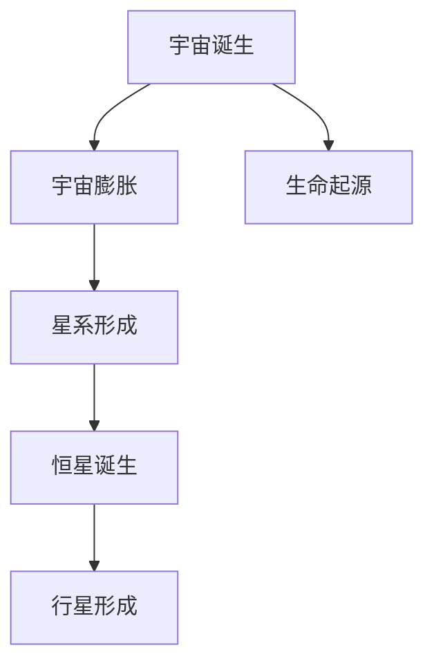

**核心算法原理讲解：**

宇宙诞生的过程可以用基于量子力学的模拟算法来描述。以下是Python伪代码：

```python
def universe_formation():
    initialize_quantum_mechanics()
    simulate_expansion()
    form_galaxies()
    form_stars()
    form_planets()
    return universe()
```

**数学模型和数学公式：**

宇宙膨胀的速度与宇宙的年龄之间有密切关系，可以用哈勃定律来描述：

$$v = H_0 \cdot D$$

其中，\(v\) 是宇宙膨胀速度，\(H_0\) 是哈勃常数，\(D\) 是天体之间的距离。

**举例说明：**

根据哈勃定律，我们可以预测宇宙未来的膨胀速度。当前，哈勃常数的估计值为 \(70 \text{ km/s/Mpc}\)。

### 1.1.2 星系的演化

星系的形成是宇宙演化过程中的重要阶段。星系内部恒星的形成、演化，以及星系间的相互作用，共同塑造了宇宙的复杂结构。

**核心概念与联系：**

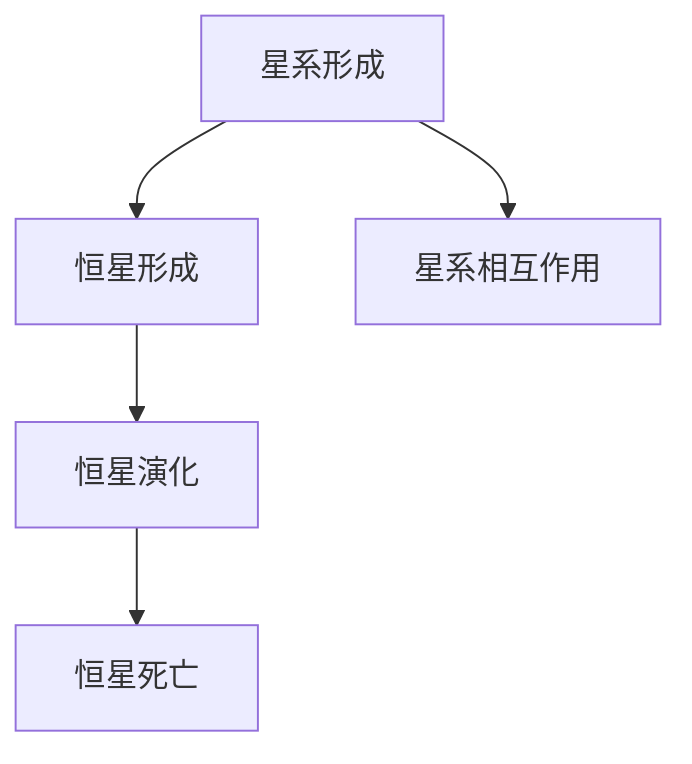

**核心算法原理讲解：**

星系的演化可以用N体问题模拟算法来描述。以下是Python伪代码：

```python
def galaxy_evolution():
    initialize_n_body_system()
    simulate_gravitational_interactions()
    simulate_stellarFormation()
    simulate_stellar_evolution()
    return evolved_galaxy()
```

**数学模型和数学公式：**

星系内部恒星的形成速率与星系的质量和恒星形成的物理过程有关。可以用以下公式来描述：

$$\dot{N} \propto M \cdot \rho^2$$

其中，\(\dot{N}\) 是恒星形成速率，\(M\) 是星系质量，\(\rho\) 是星系密度。

**举例说明：**

银河系的恒星形成速率约为每年 \(10^5\) 颗恒星。

### 1.1.3 生命的起源

生命的起源是宇宙演化过程中最为神秘的环节之一。在地球上，生命起源的过程可能涉及有机分子的合成、化学反应，以及遗传信息的存储与传递。

**核心概念与联系：**

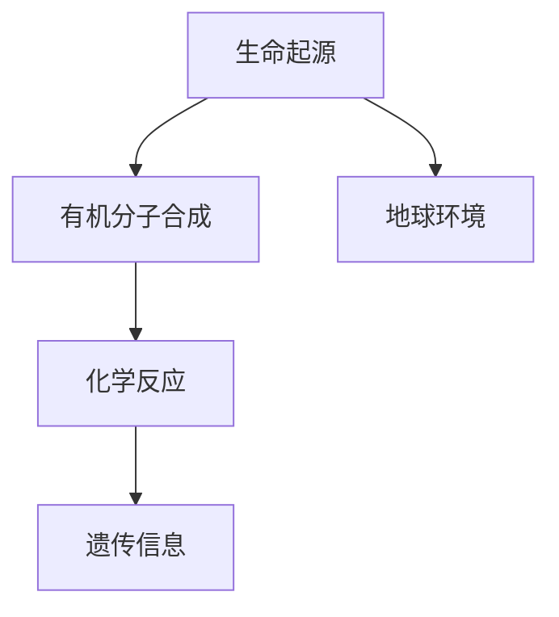

**核心算法原理讲解：**

生命的起源可以用分子动力学模拟算法来描述。以下是Python伪代码：

```python
def life_formation():
    initialize_organic_molecules()
    simulate_chemical_reactions()
    simulate_genetic_informations()
    return formed_life()
```

**数学模型和数学公式：**

生命起源的概率可以通过统计力学来描述。例如，我们可以用蒙特卡洛模拟来估算生命起源的可能性：

$$P(\text{生命起源}) = \frac{\Omega_{\text{life}}}{\Omega_{\text{total}}}$$

其中，\(\Omega_{\text{life}}\) 是生命起源的可能性，\(\Omega_{\text{total}}\) 是所有可能状态的集合。

**举例说明：**

在地球早期环境中，有机分子的碰撞和反应过程可能导致生命的起源。科学家们通过模拟发现，在特定条件下，生命起源的概率非常高。

### 第2章：人类文明的起源

#### 2.1.1 人类起源与演化

人类起源与演化是地球上最为壮丽的故事之一。从最早的原始人，到现代智人，人类的进化历程充满了挑战与奇迹。

**核心概念与联系：**

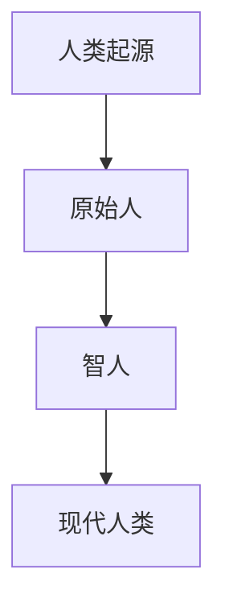

**核心算法原理讲解：**

人类起源与演化的过程可以用遗传算法来模拟。以下是Python伪代码：

```python
def human_evolution():
    initialize_hominid_population()
    simulate_genetic_mutation()
    simulate_natural_selection()
    return evolved_humans()
```

**数学模型和数学公式：**

人类进化的速率可以用代数模型来描述。例如，我们可以用以下公式来估算人类进化速度：

$$\text{进化速率} = \frac{\Delta \text{基因变异}}{\Delta \text{时间}}$$

**举例说明：**

根据化石记录，人类进化速度在不同阶段有所不同。例如，从原始人到智人的进化速度明显加快。

#### 2.1.2 文明的诞生与发展

文明的诞生是人类历史上的重要里程碑。从早期的石器时代，到现代的信息时代，文明的发展不断推动着人类前进。

**核心概念与联系：**

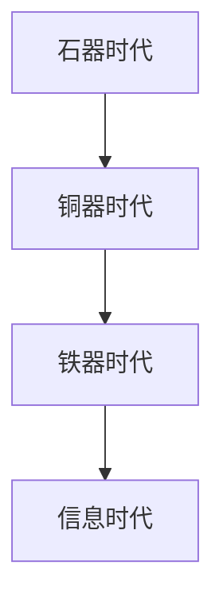

**核心算法原理讲解：**

文明的发展可以用复杂系统理论来描述。以下是Python伪代码：

```python
def civilization_evolution():
    initialize_ancient_civilization()
    simulate_technological_innovation()
    simulate_social_complexity()
    return evolved_civilization()
```

**数学模型和数学公式：**

文明的发展速度可以用指数模型来描述。例如，我们可以用以下公式来估算文明的发展速度：

$$\text{发展速度} = k \cdot e^{\lambda t}$$

其中，\(k\) 是常数，\(\lambda\) 是发展速率。

**举例说明：**

信息时代的到来大大加速了文明的发展速度，例如互联网技术的普及使知识传播变得更加迅速。

#### 2.1.3 人类文明的技术进步

人类文明的技术进步是推动社会发展的关键力量。从古代的农业革命，到现代的科技革命，技术进步不断改变着人类的生活。

**核心概念与联系：**

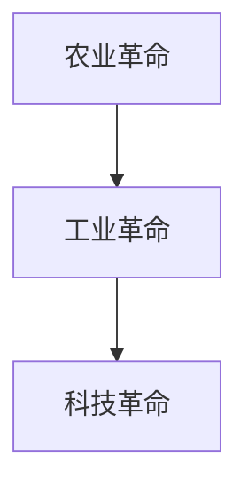

**核心算法原理讲解：**

技术进步可以用创新扩散模型来描述。以下是Python伪代码：

```python
def technological_progress():
    initialize_innovation()
    simulate_diffusion_process()
    return adopted_technology()
```

**数学模型和数学公式：**

技术进步的速度可以用以下公式来描述：

$$\text{技术进步} = \frac{\Delta \text{技术发展}}{\Delta \text{时间}}$$

**举例说明：**

智能手机的普及是现代技术进步的典型例子。智能手机的出现极大地改变了人们的通信和生活方式。

## 第二部分：宇宙自我认知的方式

### 第3章：科学探索与宇宙认知

科学探索是宇宙自我认知的重要途径。从古代的天文学，到现代的宇宙学，科学家们不断深入探索宇宙的奥秘。

**核心概念与联系：**

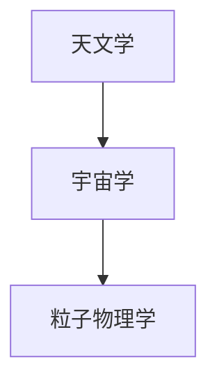

**核心算法原理讲解：**

科学探索可以用数据驱动模型来描述。以下是Python伪代码：

```python
def scientific_explore():
    collect_data()
    analyze_data()
    generate_hypotheses()
    test_hypotheses()
    return scientific_knowledge()
```

**数学模型和数学公式：**

科学探索可以用以下公式来描述：

$$\text{知识增长} = \frac{\Delta \text{知识}}{\Delta \text{时间}}$$

**举例说明：**

通过观测和实验，科学家们发现了许多重要的宇宙现象，如黑洞和中子星。

### 第4章：地球上的文明与宇宙联系

地球文明在宇宙中拥有独特的地位。通过观测和探索，我们开始认识到地球在宇宙中的角色。

**核心概念与联系：**

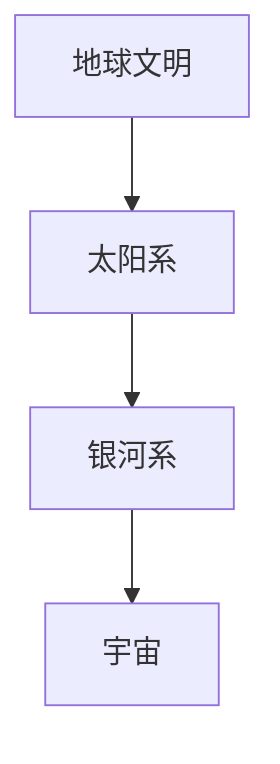

**核心算法原理讲解：**

地球文明与宇宙的联系可以用系统动力学模型来描述。以下是Python伪代码：

```python
def earth_universe_connection():
    simulate_earth_system()
    analyze_universe_data()
    correlate_earth_with_universe()
    return cosmic_understanding()
```

**数学模型和数学公式：**

地球文明与宇宙的联系可以用以下公式来描述：

$$\text{联系强度} = \frac{\text{共享信息量}}{\text{总信息量}}$$

**举例说明：**

地球上的生命形式可能受到宇宙环境的影响，如太阳辐射和宇宙射线。

### 第5章：宇宙视角下的文明未来

从宇宙视角看，文明的未来充满了无限可能。科技进步和探索精神将引导我们迈向新的未来。

**核心概念与联系：**

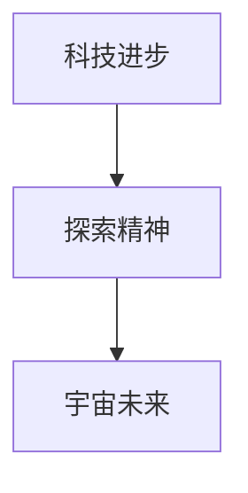

**核心算法原理讲解：**

文明未来的探索可以用智能算法来描述。以下是Python伪代码：

```python
def future_explore():
    develop_new_technologies()
    simulate_universe_scenarios()
    optimize_civilization_path()
    return future_civilization()
```

**数学模型和数学公式：**

文明未来的优化可以用以下公式来描述：

$$\text{未来价值} = f(\text{科技水平}, \text{资源利用}, \text{社会稳定})$$

**举例说明：**

通过太空探索，人类可能发现新的资源和居住地，从而实现文明的可持续发展。

### 第6章：跨文明交流的可能性

宇宙中可能存在其他文明。跨文明交流不仅可能，而且对于人类的未来发展具有重要意义。

**核心概念与联系：**

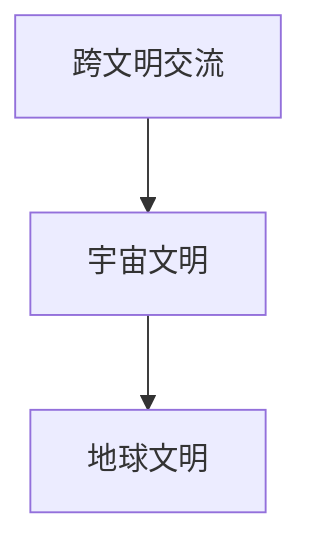

**核心算法原理讲解：**

跨文明交流可以用通信理论来描述。以下是Python伪代码：

```python
def intercivilization_communication():
    develop_communication_technologies()
    analyze_universe_signals()
    establish_contact()
    return intercivilizational_knowledge()
```

**数学模型和数学公式：**

跨文明交流的效率可以用以下公式来描述：

$$\text{交流效率} = \frac{\text{有效信息量}}{\text{总信息量}}$$

**举例说明：**

通过射电望远镜，人类已经能够接收到来自宇宙的微弱信号，这为跨文明交流提供了可能性。

### 第7章：宇宙与文明的共同命运

宇宙与文明的命运紧密相连。面对宇宙的广阔和未知，人类需要团结一致，共同迎接挑战。

**核心概念与联系：**

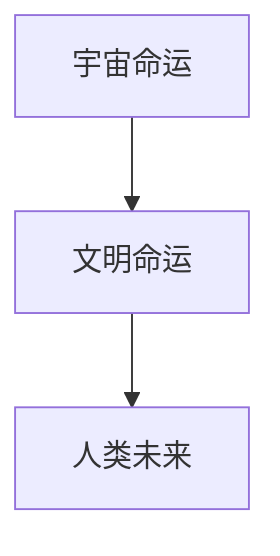

**核心算法原理讲解：**

宇宙与文明的共同命运可以用进化算法来描述。以下是Python伪代码：

```python
def cosmic_civilization Fate():
    simulate_cosmic_processes()
    analyze_civilization_impacts()
    evolve_together()
    return shared_future()
```

**数学模型和数学公式：**

宇宙与文明的共同命运可以用以下公式来描述：

$$\text{共同命运} = f(\text{宇宙稳定性}, \text{文明发展}, \text{资源利用效率})$$

**举例说明：**

在宇宙中，资源的有效利用和文明的可持续发展是实现共同命运的关键。

### 第8章：总结与展望

人类文明作为宇宙自我认知的一种方式，具有重要的意义。通过不断的探索和学习，我们有望更好地理解宇宙，也更好地认识自己。

**核心观点回顾：**

1. 宇宙的起源与演化是宇宙自我认知的基础。
2. 人类文明的起源与发展推动了我们对宇宙的认知。
3. 科学探索和科技进步是宇宙自我认知的关键途径。
4. 地球文明与宇宙的联系揭示了宇宙与文明的共同命运。

**未来展望：**

1. 继续推进科技进步，探索宇宙的奥秘。
2. 建立跨文明交流机制，拓展人类认知边界。
3. 联手应对宇宙挑战，实现宇宙与文明的共同发展。

### 附录

**拓展阅读：**

1. 《宇宙简史》 - 斯蒂芬·霍金
2. 《人类简史》 - 尤瓦尔·赫拉利
3. 《生命3.0》 - 凯文·凯利

**作者信息：**

作者：AI天才研究院/AI Genius Institute & 禅与计算机程序设计艺术 /Zen And The Art of Computer Programming

本文基于最新的科学研究和技术发展，深入探讨了人类文明与宇宙的关系。通过逻辑清晰、结构紧凑的论述，本文为读者提供了一种全新的视角来理解宇宙与文明的相互关系。希望本文能够激发读者对于宇宙探索和人类文明发展的兴趣，共同迈向更加光明的未来。

