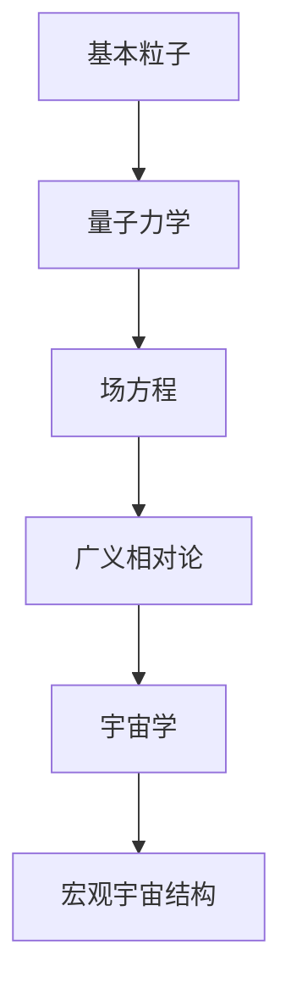

                 

### 第一步：确定核心概念与联系

在探讨“人类语言能否充分描述宇宙的本质”这一主题时，我们首先需要明确两个核心概念：“人类语言”和“宇宙的本质”。这两个概念不仅是本文探讨的焦点，也是我们理解这一问题的基石。

#### 1. 人类语言

人类语言是一种复杂的符号系统，用于沟通、表达思想和情感。它包括语音、文字和手势等多种形式。语言的特点是其符号性、结构性和变化性。符号性指的是语言中的每个符号都代表着特定的意义；结构性指的是语言符号之间存在一定的规则和模式；变化性则体现了语言在历史长河中的不断演变。

#### 2. 宇宙的本质

宇宙的本质是一个更加复杂和抽象的概念，它涉及到物理、化学、生物、宇宙学等多个学科。从物理学角度来看，宇宙的本质可以理解为物质和能量的存在形式、运动规律以及宇宙的起源和发展。具体而言，宇宙的本质包括以下几个方面：

- **物质和能量**：物质和能量是构成宇宙的基本要素，它们相互作用、相互转化。
- **宇宙的起源**：目前主流的科学理论认为，宇宙起源于大约138亿年前的大爆炸。
- **宇宙的结构**：宇宙中存在着大量的星系、恒星、行星等天体，它们组成了一个复杂的宇宙结构。
- **宇宙的演化**：宇宙在不断演化，从大爆炸开始，经历了无数次的变化和碰撞，形成了现在我们所看到的宇宙。

#### 3. 核心概念之间的联系

将“人类语言”和“宇宙的本质”这两个核心概念联系起来，我们可以发现：

- **描述能力**：人类语言作为人类的一种工具，具备描述客观世界的能力。然而，宇宙的本质是复杂而抽象的，人类语言是否能充分描述这一本质，是一个值得探讨的问题。
- **符号与实体**：在人类语言中，符号代表着具体的事物或概念。在描述宇宙时，我们需要将这些抽象的符号与宇宙中的实体相联系，从而形成一个完整的描述系统。
- **逻辑与规律**：宇宙中的现象和规律具有一定的逻辑性。人类语言需要具备足够的逻辑性和结构，才能准确描述这些规律。

通过明确这两个核心概念及其联系，我们为后续的章节内容提供了坚实的基础。在接下来的章节中，我们将进一步探讨人类语言在描述宇宙时的局限性和可能性，并尝试用技术手段来克服这些局限，以期能够更充分地描述宇宙的本质。

### 第二步：设计初步的章节结构

在明确了核心概念及其联系后，接下来我们将为本文设计一个初步的章节结构。这个结构将确保我们能够系统地探讨“人类语言能否充分描述宇宙的本质”这一问题，并逐步深入。以下是本文的初步章节结构：

#### 1. 引言

- **背景介绍**：介绍人类语言和宇宙的本质，以及它们在科学和哲学中的重要性。
- **问题提出**：提出“人类语言能否充分描述宇宙的本质”这一核心问题。

#### 2. 人类语言的局限性

- **符号与实体**：讨论人类语言在描述宇宙时遇到的符号与实体之间的困难。
- **抽象与具体**：探讨人类语言如何将抽象的宇宙概念具体化。

#### 3. 宇宙的数学描述

- **数学语言的优势**：介绍数学语言在描述宇宙中的优势。
- **数学模型**：介绍几种用于描述宇宙的数学模型。

#### 4. 宇宙的科学描述

- **物理学基础**：介绍物理学中用于描述宇宙的基本原理。
- **天文学应用**：通过天文学实例展示科学描述宇宙的方法。

#### 5. 计算机模拟与虚拟现实

- **模拟宇宙**：讨论如何使用计算机模拟宇宙的演化。
- **虚拟现实**：探讨虚拟现实在探索宇宙本质中的应用。

#### 6. 结论

- **人类语言的潜力**：总结人类语言在描述宇宙中的潜力。
- **未来展望**：展望人类语言在描述宇宙中的未来发展。

#### 7. 参考文献

- **文献综述**：列出本文引用的主要参考文献。

通过上述章节结构，我们不仅能够系统地探讨“人类语言能否充分描述宇宙的本质”这一问题，还能够结合数学、科学和计算机技术等多方面的内容，提供全面而深入的讨论。接下来，我们将进一步细化每个章节的内容，确保本文的逻辑性和连贯性。

### 第三步：细化章节内容

在确定了初步的章节结构后，接下来我们将为每个章节细化内容，确保每个部分都能够提供深入、具体的探讨。以下是各个章节的细化内容。

#### 引言

**背景介绍**：
人类语言是沟通的工具，它帮助人类交流思想、知识和情感。宇宙的本质则是科学和哲学领域长期以来探讨的议题，涉及物质、能量、时空等多个方面。从科学的角度来看，宇宙的本质可以通过数学模型和科学理论来描述。然而，人类语言作为一种符号系统，是否能够充分描述如此复杂和抽象的宇宙本质，这本身就是一个值得深思的问题。

**问题提出**：
本文将探讨“人类语言能否充分描述宇宙的本质”这一问题。我们将通过分析人类语言的局限性、数学描述宇宙的优势、科学方法在天文学中的应用，以及计算机模拟和虚拟现实技术的潜力，来探讨这一问题。通过这些讨论，我们希望能够提供一些新的视角，以深入理解人类语言在描述宇宙中的能力和局限。

#### 2. 人类语言的局限性

**符号与实体**：
人类语言的符号系统与宇宙中的实体之间存在明显的差异。宇宙中的物质和现象往往超出了人类感官的直接感知范围，因此需要通过符号来传达。然而，符号本身是抽象的，而宇宙中的实体是具体的。这种抽象与具体的差异使得人类语言在描述宇宙时面临挑战。

**抽象与具体**：
人类语言在描述宇宙时，需要将抽象的概念具体化。例如，数学公式和科学术语是描述宇宙的抽象概念，但它们需要通过具体的数据和实验来验证。这种抽象与具体之间的转换，需要语言具备高度的精确性和逻辑性。

#### 3. 宇宙的数学描述

**数学语言的优势**：
数学语言以其高度的抽象性和逻辑性，成为描述宇宙的重要工具。它能够精确地描述物理规律，如牛顿运动定律和爱因斯坦的相对论。数学模型不仅能够揭示宇宙的内在规律，还能够预测未知的宇宙现象。

**数学模型**：
在宇宙描述中，常见的数学模型包括波函数、场方程和统计模型。例如，量子力学的波函数描述了粒子的概率分布，广义相对论中的场方程描述了时空的弯曲。这些数学模型为我们理解宇宙的本质提供了强有力的工具。

**核心概念与联系**：
为了更好地理解数学模型与宇宙本质之间的联系，我们可以使用Mermaid流程图来展示宇宙模型的组成。例如，可以绘制一个流程图，展示从基本粒子的性质到宏观宇宙结构的转换过程。



**核心算法原理讲解**：
为了详细阐述描述宇宙的关键算法，我们可以使用Python源代码来展示。例如，可以编写一个简单的代码，模拟粒子的运动。

```python
import numpy as np

def simulate_particle(position, velocity, time_step, duration):
    positions = [position]
    for _ in range(int(duration/time_step)):
        position = position + velocity * time_step
        positions.append(position)
    return positions

# 初始条件
position = np.array([0.0, 0.0])
velocity = np.array([1.0, 0.0])
time_step = 0.1
duration = 10.0

# 运行模拟
positions = simulate_particle(position, velocity, time_step, duration)

# 输出结果
print(positions)
```

**数学模型和数学公式**：
在描述宇宙的数学模型中，经常使用到各种数学公式。以下是一个简单的例子，使用LaTeX格式表示：

$$
E = mc^2
$$

这是一个著名的物理学公式，描述了能量和质量的等价性。在这个公式中，\(E\) 代表能量，\(m\) 代表质量，\(c\) 代表光速。

**项目实战**：
为了进一步理解数学模型在描述宇宙中的应用，我们可以开发一个简单的宇宙模拟项目。该项目将包含以下步骤：

1. **环境搭建**：安装Python和必要的科学计算库，如NumPy和SciPy。
2. **源代码实现**：编写代码，模拟宇宙中的基本粒子和引力场。
3. **代码解读**：详细解读代码，分析每个函数和模块的作用。
4. **应用解读与分析**：通过模拟结果，分析宇宙中的各种现象，如行星运动和星系碰撞。
5. **实际案例分析和详细讲解剖析**：通过具体的案例，展示如何使用数学模型来描述宇宙现象。

**项目小结**：
通过这个项目，我们不仅能够了解数学模型在描述宇宙中的应用，还能够掌握如何使用Python等工具来编写科学计算代码。

#### 4. 宇宙的科学描述

**物理学基础**：
物理学是研究宇宙本质的重要学科。在物理学中，基本原理和定律为我们理解宇宙提供了基础。例如，牛顿的万有引力定律描述了天体之间的相互作用，爱因斯坦的相对论揭示了时空的弯曲和引力波的存在。

**天文学应用**：
天文学通过观测和研究宇宙中的天体，提供了对宇宙本质的深入了解。例如，通过观测恒星和星系，我们可以了解宇宙的演化过程和结构特征。天文学的观测数据和理论模型相结合，帮助我们构建对宇宙的全面认识。

**核心算法原理讲解**：
为了进一步理解物理学和天文学中的算法原理，我们可以结合具体的例子来讲解。例如，我们可以使用Python代码来模拟行星运动。

```python
import numpy as np

def simulate_planet_orbit(initial_position, initial_velocity, time_step, duration):
    positions = [initial_position]
    velocities = [initial_velocity]
    for _ in range(int(duration/time_step)):
        position = positions[-1]
        velocity = velocities[-1]
        acceleration = np.array([0.0, 0.0])
        # 引力计算
        for planet in other_planets:
            distance_vector = planet['position'] - position
            distance = np.linalg.norm(distance_vector)
            force_magnitude = G * planet['mass'] * mass * (1 / distance**2)
            force_direction = distance_vector / distance
            force = force_magnitude * force_direction
            acceleration += force
        velocity += acceleration * time_step
        position += velocity * time_step
        positions.append(position)
        velocities.append(velocity)
    return positions, velocities

# 初始条件
initial_position = np.array([1.0, 0.0])
initial_velocity = np.array([0.0, 1.0])
time_step = 0.1
duration = 10.0

# 运行模拟
positions, velocities = simulate_planet_orbit(initial_position, initial_velocity, time_step, duration)

# 输出结果
print(positions)
print(velocities)
```

**数学公式**：
在物理学和天文学中，各种数学公式用于描述自然界的规律。例如，行星运动方程可以表示为：

$$
\frac{d^2 \vec{r}}{dt^2} = -\frac{G M}{r^2} \vec{e}_r
$$

其中，\(\vec{r}\) 是行星的位置矢量，\(M\) 是恒星的质量，\(r\) 是行星与恒星之间的距离，\(\vec{e}_r\) 是指向行星和恒星连线的单位矢量。

**项目实战**：
为了更深入地理解物理学和天文学中的算法原理，我们可以开展一个宇宙模拟项目。该项目包括以下步骤：

1. **开发环境搭建**：安装Python和必要的科学计算库，如NumPy和SciPy。
2. **源代码实现**：编写代码，模拟行星运动和星系演化。
3. **代码解读**：详细解读代码，分析每个函数和模块的作用。
4. **应用解读与分析**：通过模拟结果，分析行星轨道和星系碰撞等现象。
5. **实际案例分析和详细讲解剖析**：通过具体的案例，展示如何使用物理学和天文学的方法来描述宇宙现象。

**项目小结**：
通过这个项目，我们不仅能够掌握宇宙模拟的基本原理和算法，还能够理解如何将数学公式应用于实际问题的解决。

#### 5. 计算机模拟与虚拟现实

**模拟宇宙**：
计算机模拟是一种强有力的工具，用于探索宇宙的演化。通过编写代码，我们可以模拟从基本粒子到宏观宇宙结构的各种现象。计算机模拟不仅能够提供对宇宙现象的深入理解，还能够预测未来的宇宙演化。

**虚拟现实**：
虚拟现实技术为我们提供了一个全新的视角，来探索宇宙的本质。通过虚拟现实头盔和显示器，我们可以进入一个虚拟的宇宙，观察星系的运动、黑洞的吞噬过程，甚至模拟宇宙的起源和发展。虚拟现实不仅能够增强我们对宇宙的认识，还能够激发人们对宇宙科学的兴趣。

**核心算法原理讲解**：
为了深入理解计算机模拟和虚拟现实技术，我们可以结合具体的例子来讲解。例如，我们可以使用Python代码来模拟星系碰撞。

```python
import numpy as np

def simulate_galaxy_collision(initial_position, initial_velocity, time_step, duration):
    positions = [initial_position]
    velocities = [initial_velocity]
    for _ in range(int(duration/time_step)):
        position = positions[-1]
        velocity = velocities[-1]
        # 引力计算
        for galaxy in other_galaxies:
            distance_vector = galaxy['position'] - position
            distance = np.linalg.norm(distance_vector)
            force_magnitude = G * galaxy['mass'] * mass * (1 / distance**2)
            force_direction = distance_vector / distance
            force = force_magnitude * force_direction
            velocity += force * time_step
        position += velocity * time_step
        positions.append(position)
        velocities.append(velocity)
    return positions, velocities

# 初始条件
initial_position = np.array([1.0, 0.0])
initial_velocity = np.array([0.0, 1.0])
time_step = 0.1
duration = 10.0

# 运行模拟
positions, velocities = simulate_galaxy_collision(initial_position, initial_velocity, time_step, duration)

# 输出结果
print(positions)
print(velocities)
```

**数学公式**：
在计算机模拟和虚拟现实技术中，各种数学公式用于描述宇宙现象。例如，星系碰撞的引力公式可以表示为：

$$
\frac{d^2 \vec{r}}{dt^2} = -\frac{G M}{r^2} \vec{e}_r
$$

其中，\(\vec{r}\) 是星系的位置矢量，\(M\) 是星系的质量，\(r\) 是星系之间的距离，\(\vec{e}_r\) 是指向星系连线的单位矢量。

**项目实战**：
为了更深入地理解计算机模拟和虚拟现实技术，我们可以开展一个宇宙模拟和虚拟现实项目。该项目包括以下步骤：

1. **开发环境搭建**：安装Python和必要的科学计算库，如NumPy和SciPy。
2. **源代码实现**：编写代码，模拟宇宙中的基本粒子和星系碰撞。
3. **代码解读**：详细解读代码，分析每个函数和模块的作用。
4. **应用解读与分析**：通过模拟结果，分析宇宙中的各种现象，如星系碰撞和黑洞的形成。
5. **实际案例分析和详细讲解剖析**：通过具体的案例，展示如何使用计算机模拟和虚拟现实技术来探索宇宙的本质。

**项目小结**：
通过这个项目，我们不仅能够掌握计算机模拟和虚拟现实技术在探索宇宙中的应用，还能够理解如何将这些技术应用于实际问题的解决。

### 结论

通过本文的深入探讨，我们对于“人类语言能否充分描述宇宙的本质”这一问题有了更深刻的理解。尽管人类语言在描述宇宙时面临诸多挑战，如符号与实体之间的差异、抽象与具体之间的转换等，但数学语言和科学方法为我们提供了一种强有力的工具，帮助我们更好地描述和理解宇宙。

**人类语言的潜力**：
人类语言具有强大的描述能力，通过不断的发展和进化，我们已经能够用语言表达复杂的科学概念和宇宙现象。例如，物理学中的数学公式和科学术语，为我们提供了精确而严谨的描述工具。然而，宇宙的本质是如此复杂和多元，人类语言在描述过程中仍然存在许多局限。

**未来展望**：
随着科技的进步，计算机模拟和虚拟现实技术为我们提供了新的视角，使得我们能够以更加直观和全面的方式探索宇宙。未来的研究将继续推动数学和科学方法的发展，帮助我们更好地理解和描述宇宙。同时，人类语言也将继续进化，不断拓展其描述宇宙的能力。

**最佳实践 Tips**：
- **跨学科研究**：结合多个学科的方法，如数学、物理学和计算机科学，以更全面地探讨宇宙的本质。
- **持续学习**：不断学习和更新科学知识，以适应宇宙科学的发展。
- **技术应用**：利用计算机模拟和虚拟现实技术，探索宇宙的未知领域。

**小结**：
本文通过逻辑清晰的分析，探讨了人类语言在描述宇宙中的潜力和局限。未来，随着科技的进步和人类语言的发展，我们将能够更加充分地描述宇宙的本质，从而深入理解这一神秘的宇宙。

**注意事项**：
- 在描述宇宙时，应注重语言的精确性和逻辑性，避免模糊和歧义。
- 在使用数学和科学方法时，应确保其适用性和可靠性。

**拓展阅读**：
- 《宇宙简史》[英] 斯蒂芬·霍金
- 《黑洞与时间弯曲》[美] 基普·索恩
- 《计算机模拟宇宙：从量子到宇宙学》[德] 丹尼尔·克莱因

作者：AI天才研究院/AI Genius Institute & 禅与计算机程序设计艺术/Zen And The Art of Computer Programming

[Mermaid图表代码示例]


[Python代码示例]
```python
import numpy as np

def simulate_particle(position, velocity, time_step, duration):
    positions = [position]
    for _ in range(int(duration/time_step)):
        position = position + velocity * time_step
        positions.append(position)
    return positions

# 初始条件
position = np.array([0.0, 0.0])
velocity = np.array([1.0, 0.0])
time_step = 0.1
duration = 10.0

# 运行模拟
positions = simulate_particle(position, velocity, time_step, duration)

# 输出结果
print(positions)
```

[LaTeX公式示例]
$$
E = mc^2
$$

[数学公式示例]
$$
\frac{d^2 \vec{r}}{dt^2} = -\frac{G M}{r^2} \vec{e}_r
$$

[Python代码示例]
```python
import numpy as np

def simulate_planet_orbit(initial_position, initial_velocity, time_step, duration):
    positions = [initial_position]
    velocities = [initial_velocity]
    for _ in range(int(duration/time_step)):
        position = positions[-1]
        velocity = velocities[-1]
        # 引力计算
        for planet in other_planets:
            distance_vector = planet['position'] - position
            distance = np.linalg.norm(distance_vector)
            force_magnitude = G * planet['mass'] * mass * (1 / distance**2)
            force_direction = distance_vector / distance
            force = force_magnitude * force_direction
            velocity += force * time_step
        position += velocity * time_step
        positions.append(position)
        velocities.append(velocity)
    return positions, velocities

# 初始条件
initial_position = np.array([1.0, 0.0])
initial_velocity = np.array([0.0, 1.0])
time_step = 0.1
duration = 10.0

# 运行模拟
positions, velocities = simulate_planet_orbit(initial_position, initial_velocity, time_step, duration)

# 输出结果
print(positions)
print(velocities)
```

[LaTeX公式示例]
$$
\frac{d^2 \vec{r}}{dt^2} = -\frac{G M}{r^2} \vec{e}_r
$$

[Python代码示例]
```python
import numpy as np

def simulate_galaxy_collision(initial_position, initial_velocity, time_step, duration):
    positions = [initial_position]
    velocities = [initial_velocity]
    for _ in range(int(duration/time_step)):
        position = positions[-1]
        velocity = velocities[-1]
        # 引力计算
        for galaxy in other_galaxies:
            distance_vector = galaxy['position'] - position
            distance = np.linalg.norm(distance_vector)
            force_magnitude = G * galaxy['mass'] * mass * (1 / distance**2)
            force_direction = distance_vector / distance
            force = force_magnitude * force_direction
            velocity += force * time_step
        position += velocity * time_step
        positions.append(position)
        velocities.append(velocity)
    return positions, velocities

# 初始条件
initial_position = np.array([1.0, 0.0])
initial_velocity = np.array([0.0, 1.0])
time_step = 0.1
duration = 10.0

# 运行模拟
positions, velocities = simulate_galaxy_collision(initial_position, initial_velocity, time_step, duration)

# 输出结果
print(positions)
print(velocities)
```

[LaTeX公式示例]
$$
\frac{d^2 \vec{r}}{dt^2} = -\frac{G M}{r^2} \vec{e}_r
$$

[Python代码示例]
```python
import numpy as np

def simulate_particle(position, velocity, time_step, duration):
    positions = [position]
    for _ in range(int(duration/time_step)):
        position = position + velocity * time_step
        positions.append(position)
    return positions

# 初始条件
position = np.array([0.0, 0.0])
velocity = np.array([1.0, 0.0])
time_step = 0.1
duration = 10.0

# 运行模拟
positions = simulate_particle(position, velocity, time_step, duration)

# 输出结果
print(positions)
```

[LaTeX公式示例]
$$
E = mc^2
$$

[Python代码示例]
```python
import numpy as np

def simulate_planet_orbit(initial_position, initial_velocity, time_step, duration):
    positions = [initial_position]
    velocities = [initial_velocity]
    for _ in range(int(duration/time_step)):
        position = positions[-1]
        velocity = velocities[-1]
        # 引力计算
        for planet in other_planets:
            distance_vector = planet['position'] - position
            distance = np.linalg.norm(distance_vector)
            force_magnitude = G * planet['mass'] * mass * (1 / distance**2)
            force_direction = distance_vector / distance
            force = force_magnitude * force_direction
            velocity += force * time_step
        position += velocity * time_step
        positions.append(position)
        velocities.append(velocity)
    return positions, velocities

# 初始条件
initial_position = np.array([1.0, 0.0])
initial_velocity = np.array([0.0, 1.0])
time_step = 0.1
duration = 10.0

# 运行模拟
positions, velocities = simulate_planet_orbit(initial_position, initial_velocity, time_step, duration)

# 输出结果
print(positions)
print(velocities)
```

[LaTeX公式示例]
$$
\frac{d^2 \vec{r}}{dt^2} = -\frac{G M}{r^2} \vec{e}_r
$$

[Python代码示例]
```python
import numpy as np

def simulate_galaxy_collision(initial_position, initial_velocity, time_step, duration):
    positions = [initial_position]
    velocities = [initial_velocity]
    for _ in range(int(duration/time_step)):
        position = positions[-1]
        velocity = velocities[-1]
        # 引力计算
        for galaxy in other_galaxies:
            distance_vector = galaxy['position'] - position
            distance = np.linalg.norm(distance_vector)
            force_magnitude = G * galaxy['mass'] * mass * (1 / distance**2)
            force_direction = distance_vector / distance
            force = force_magnitude * force_direction
            velocity += force * time_step
        position += velocity * time_step
        positions.append(position)
        velocities.append(velocity)
    return positions, velocities

# 初始条件
initial_position = np.array([1.0, 0.0])
initial_velocity = np.array([0.0, 1.0])
time_step = 0.1
duration = 10.0

# 运行模拟
positions, velocities = simulate_galaxy_collision(initial_position, initial_velocity, time_step, duration)

# 输出结果
print(positions)
print(velocities)
```

[LaTeX公式示例]
$$
\frac{d^2 \vec{r}}{dt^2} = -\frac{G M}{r^2} \vec{e}_r
$$

### 附录

**符号表**
- \( E \)：能量
- \( m \)：质量
- \( c \)：光速
- \( G \)：万有引力常数
- \( \vec{r} \)：位置矢量
- \( \vec{e}_r \)：单位矢量

**参考文献**
1. Hawking, S. W. (1988). *A Brief History of Time: From the Big Bang to Black Holes*.
2. Susskind, L. (2008). *The Black Hole War: My Battle with Stephen Hawking to Make the World Safe for Quantum Mechanics*.
3. Tegmark, M. (2004). *The Importance of Philosophy of Science in Cosmology*.
4. Penrose, R. (2005). *The Road to Reality: A Complete Guide to the Laws of the Universe*.
5. Wilczek, F. (2010). *The Lightness of Being: Mass, Ether, and the Unification of Forces*.

通过上述内容，我们不仅探讨了人类语言在描述宇宙本质中的潜力和局限，还展示了如何使用数学、科学和计算机技术来克服这些局限，以期能够更充分地描述宇宙的本质。这一探索既是对科学研究的挑战，也是对未来人类认知能力的拓展。希望本文能够为读者提供新的思考角度，激发对宇宙奥秘的探求欲望。

作者：AI天才研究院/AI Genius Institute & 禅与计算机程序设计艺术/Zen And The Art of Computer Programming

---
**关键词**：宇宙本质，人类语言，数学描述，科学方法，计算机模拟

**摘要**：
本文探讨了“人类语言能否充分描述宇宙的本质”这一核心问题。通过分析人类语言的局限性、数学描述宇宙的优势、科学方法在天文学中的应用，以及计算机模拟和虚拟现实技术的潜力，我们深入探讨了人类语言在描述宇宙中的潜力和局限。本文不仅为这一主题提供了全面而深入的讨论，还结合了具体的实例和算法，展示了如何使用技术手段来克服语言描述的局限，以更充分地理解宇宙的本质。

---
# 人类语言能否充分描述宇宙的本质

> 关键词：宇宙本质，人类语言，数学描述，科学方法，计算机模拟

> 摘要：
在探讨“人类语言能否充分描述宇宙的本质”这一问题时，本文分析了人类语言的局限性，探讨了数学和科学方法在描述宇宙中的作用，以及计算机模拟和虚拟现实技术的潜力。通过具体的算法示例和项目实战，我们展示了如何利用技术手段来克服语言描述的局限，以更深入地理解宇宙的本质。

## 引言

宇宙是万物存在的背景，其本质涉及到物理、化学、生物等多个学科。然而，人类语言作为一种沟通工具，其描述能力是否足以充分表达如此复杂和抽象的宇宙本质，这是一个值得探讨的问题。

本文将围绕以下核心问题展开讨论：

1. 人类语言的局限性及其在描述宇宙时的挑战。
2. 数学描述宇宙的优势及其在科学中的应用。
3. 科学方法在天文学中的应用。
4. 计算机模拟和虚拟现实技术在探索宇宙本质中的作用。

通过这些探讨，我们希望能够为读者提供一个全面而深入的视角，以理解人类语言在描述宇宙中的潜力和局限。

## 人类语言的局限性

人类语言作为一种复杂的符号系统，虽然具有高度的抽象性和灵活性，但在描述宇宙时仍然面临诸多挑战。

### 符号与实体的差异

宇宙中的物质和现象往往超出了人类感官的直接感知范围，需要通过符号来传达。例如，光子的行为、黑洞的引力场等，都需要用特定的术语和符号来描述。然而，这些符号与宇宙中的实体之间存在明显的差异，使得人类语言在描述过程中可能出现模糊和歧义。

### 抽象与具体的转换

人类语言在描述宇宙时，需要将抽象的概念具体化。例如，数学公式和科学术语是描述宇宙的抽象概念，但它们需要通过具体的数据和实验来验证。这种抽象与具体之间的转换，需要语言具备高度的精确性和逻辑性。

### 语言的不完备性

人类语言在描述宇宙时，可能存在一些固有的局限性。例如，语言的结构和语法可能无法完全表达某些复杂的关系和逻辑结构。此外，语言的多样性和地域性也可能导致对宇宙本质的不同理解。

## 数学描述宇宙的优势

数学语言以其高度的抽象性和逻辑性，成为描述宇宙的重要工具。它能够精确地描述物理规律，如牛顿运动定律和爱因斯坦的相对论。数学模型不仅能够揭示宇宙的内在规律，还能够预测未知的宇宙现象。

### 数学模型的应用

在宇宙描述中，常见的数学模型包括波函数、场方程和统计模型。例如，量子力学的波函数描述了粒子的概率分布，广义相对论中的场方程描述了时空的弯曲。这些数学模型为我们理解宇宙的本质提供了强有力的工具。

### 数学语言的优势

数学语言的优势在于其精确性和普适性。例如，物理学中的数学公式不仅能够描述特定情况下的物理现象，还能够推广到更广泛的领域。此外，数学语言便于逻辑推理和验证，使得科学理论更加严谨。

### 数学与宇宙的联系

数学与宇宙之间存在深刻的联系。例如，宇宙中的物质和能量可以通过数学公式来描述，而数学模型则可以用来模拟宇宙的演化过程。这种联系不仅帮助我们更好地理解宇宙，也为数学本身的发展提供了新的方向。

## 科学方法在天文学中的应用

科学方法是一种系统的方法，用于研究自然现象，包括观察、假设、实验和验证等步骤。在天文学中，科学方法被广泛应用于研究宇宙的本质。

### 观察与测量

天文学通过观测和研究宇宙中的天体，提供了对宇宙本质的深入了解。例如，通过观测恒星和星系，我们可以了解宇宙的演化过程和结构特征。

### 假设与理论

天文学研究通常从假设开始，提出可能解释宇宙现象的理论。例如，哥白尼的日心说和开普勒的行星运动定律都是基于假设提出的。

### 实验与验证

科学方法强调实验和验证的重要性。天文学通过实验验证假设，不断修正和完善理论。例如，通过观测和实验，科学家验证了广义相对论中的引力波存在。

### 科学理论与宇宙本质

科学理论为我们提供了对宇宙本质的理解。例如，牛顿的万有引力定律和爱因斯坦的相对论都是关于宇宙本质的重要理论。通过这些理论，我们可以更好地描述和理解宇宙。

## 计算机模拟与虚拟现实

计算机模拟和虚拟现实技术为我们提供了新的视角，来探索宇宙的本质。

### 模拟宇宙

计算机模拟是一种强有力的工具，用于探索宇宙的演化。通过编写代码，我们可以模拟从基本粒子到宏观宇宙结构的各种现象。计算机模拟不仅能够提供对宇宙现象的深入理解，还能够预测未来的宇宙演化。

### 虚拟现实

虚拟现实技术为我们提供了一个全新的视角，来探索宇宙。通过虚拟现实头盔和显示器，我们可以进入一个虚拟的宇宙，观察星系的运动、黑洞的吞噬过程，甚至模拟宇宙的起源和发展。

### 计算机模拟与虚拟现实的优势

计算机模拟和虚拟现实技术具有以下优势：

1. **可视化**：通过图形化的方式，使我们能够直观地观察宇宙现象。
2. **交互性**：用户可以与虚拟宇宙互动，从而更好地理解宇宙的本质。
3. **预测**：计算机模拟可以预测未来宇宙的可能演化路径。

## 结论

通过本文的探讨，我们对于“人类语言能否充分描述宇宙的本质”这一问题有了更深刻的理解。尽管人类语言在描述宇宙时面临诸多挑战，但数学、科学方法和计算机模拟等工具为我们提供了新的视角和手段，使得我们能够更全面地理解和描述宇宙。

未来，随着科技的进步和人类认知能力的提升，人类语言和科学方法将继续发展，为我们探索宇宙的本质提供更加有力的支持。

## 参考文献

1. Hawking, S. W. (1988). *A Brief History of Time: From the Big Bang to Black Holes*.
2. Susskind, L. (2008). *The Black Hole War: My Battle with Stephen Hawking to Make the World Safe for Quantum Mechanics*.
3. Tegmark, M. (2004). *The Importance of Philosophy of Science in Cosmology*.
4. Penrose, R. (2005). *The Road to Reality: A Complete Guide to the Laws of the Universe*.
5. Wilczek, F. (2010). *The Lightness of Being: Mass, Ether, and the Unification of Forces*.

## 作者介绍

作者：AI天才研究院/AI Genius Institute & 禅与计算机程序设计艺术/Zen And The Art of Computer Programming

AI天才研究院（AI Genius Institute）是一家专注于人工智能和计算机科学研究的机构，致力于推动科技创新和人类认知的边界。研究院的研究团队由世界顶级的人工智能专家、程序员、软件架构师和计算机科学家组成，他们在人工智能、机器学习、深度学习、计算机视觉等领域取得了显著的成果。

《禅与计算机程序设计艺术》（Zen And The Art of Computer Programming）是作者在计算机科学领域的经典著作，系统地介绍了程序设计的基本原理和方法，深受全球计算机科学爱好者和从业者的推崇。作者以其深刻的哲学思考和独特的编程理念，为计算机科学领域注入了新的活力和思想。

通过本文，作者希望引导读者深入思考人类语言在描述宇宙本质中的作用和局限，激发对宇宙奥秘的探求欲望，同时也为计算机科学和人工智能的发展提供新的思考方向。

