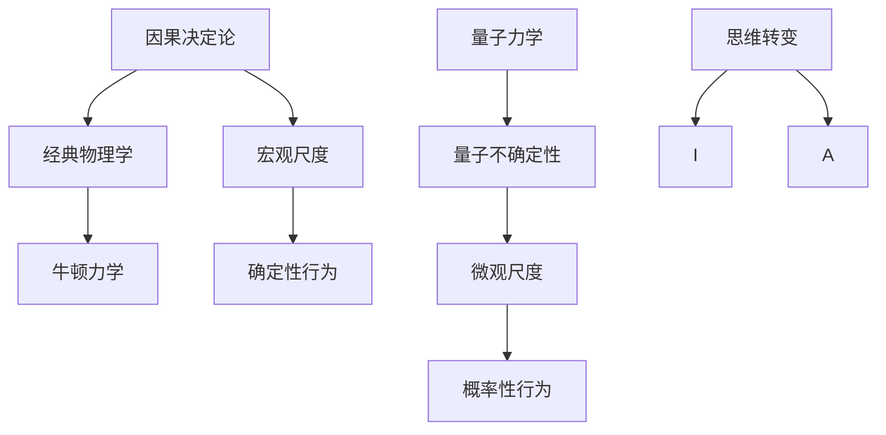

                 

### 背景介绍

“从因果决定论到量子不确定性：宇宙观的转变”这一主题，源自人类对自然界运行规律的不断探索和认知的深化。因果决定论，作为西方哲学和科学的基本原则之一，长久以来被视为理解自然现象的基石。它主张，自然界中的每一个事件都有其前因，且这些前因通过逻辑链条决定着后续事件的发生。这种观点在经典物理学中得到了充分的体现，例如牛顿力学中的运动定律，正是因果决定论的典型代表。

然而，20世纪初量子力学的诞生，以及随后海森堡不确定性原理的提出，彻底颠覆了因果决定论的宇宙观。量子力学揭示了微观世界中的非确定性现象，表明某些物理量如位置和动量无法同时被精确测量，这一发现与因果决定论中的一切都有确定原因的信念形成了鲜明对比。量子纠缠和波粒二象性等概念，更是挑战了我们对现实世界的直观感知。

这种宇宙观的转变，不仅在物理学领域引起了巨大震动，也对哲学、科学方法论和人类世界观产生了深远影响。本文将首先介绍因果决定论的基本概念和原理，然后详细探讨量子力学与不确定性原理，揭示其对因果决定论的挑战。接着，我们将分析量子不确定性的应用，探讨新的宇宙观，并讨论这一变革对科学与哲学的交汇点。最后，文章将展望未来，探索量子不确定性对人类社会的影响，并总结全文，提出注意事项和进一步阅读建议。

通过这种逐步分析的方式，我们希望读者能够清晰地理解从因果决定论到量子不确定性的转变过程，以及这一转变对人类认知的深远意义。

### 核心概念与联系

为了深入理解从因果决定论到量子不确定性的转变，首先需要明确这两个核心概念及其之间的关联。因果决定论和量子不确定性是两种截然不同的世界观，它们各自代表着不同历史时期人类对自然规律的理解。

#### 因果决定论

因果决定论是一种哲学观点，认为自然界中的事件是有序且可预测的，任何一个事件都有其明确的前因。在经典物理学中，这一观点得到了充分的体现。例如，牛顿力学通过三大运动定律描述了物体运动的状态，认为物体的位置和动量可以通过初始条件和物理定律精确计算得出。这种观点强调了因果律的存在，即每一个结果都必然有其前因。

#### 量子不确定性

相比之下，量子不确定性则是由量子力学所揭示的一种现象。量子力学的基本原理表明，微观粒子的行为具有概率性和随机性，无法被完全预测。其中，海森堡不确定性原理是最为著名的例子，它指出，在微观尺度上，某些物理量（如位置和动量）无法同时被精确测量。此外，量子纠缠和波粒二象性等概念进一步展示了微观世界的非确定性特征。

#### 关联与对比

尽管因果决定论和量子不确定性代表了两种截然不同的世界观，但它们之间并非完全割裂。在某种程度上，量子不确定性可以被视为对因果决定论的一种补充或扩展。

1. **概率性与确定性**

因果决定论强调确定性，认为自然现象可以通过因果关系完全解释。而量子不确定性则引入了概率性，表明某些事件无法被完全预测，而是存在一定的概率分布。这种概率性不仅改变了我们对自然现象的理解，也挑战了传统因果决定论的基础。

2. **微观与宏观**

因果决定论在宏观尺度上仍然适用，例如在日常生活中，我们仍然可以依赖物理定律进行预测。然而，在微观尺度上，量子不确定性成为主导。这意味着，因果关系在微观世界中不再适用，而是需要用概率性来描述粒子的行为。

3. **思维方式的转变**

量子不确定性的提出，不仅改变了我们对自然现象的认知，也要求我们重新审视思维方式。在因果决定论中，我们认为事物是可预测的，可以通过因果关系进行解释。而在量子不确定性中，我们则需要接受事物的不确定性，并通过概率来描述其行为。

#### Mermaid 流程图

为了更直观地展示因果决定论和量子不确定性的关系，我们可以使用Mermaid流程图来描述它们之间的关联。



在这个流程图中，A表示因果决定论，它通过B（经典物理学）和C（牛顿力学）与宏观尺度的确定性行为（E）相联系。而F表示量子力学，通过G（量子不确定性）与微观尺度的概率性行为（I）相联系。J表示思维方式的转变，它促使我们对因果决定论进行重新审视（L），并接受量子不确定性的概率性（K）。

通过上述核心概念与联系的分析，我们可以更深入地理解从因果决定论到量子不确定性的转变过程，以及这一转变对人类认知的深远影响。接下来，我们将进一步探讨量子不确定性的基本原理和应用，揭示其在科学和哲学领域的广泛影响。

### 核心算法原理讲解

在深入探讨量子不确定性的过程中，我们需要理解其背后的基本原理，并通过Python代码和数学模型来详细阐述这些原理。量子不确定性主要通过海森堡不确定性原理来体现，该原理揭示了在量子尺度上某些物理量（如位置和动量）无法同时被精确测量。为了更好地理解这一原理，我们可以通过一个简单的量子比特（qubit）的例子来展示。

#### 海森堡不确定性原理

海森堡不确定性原理由物理学家维尔纳·海森堡提出，该原理指出，在量子尺度上，无法同时精确测量某些物理量，其数学表达式为：

$$ \Delta x \Delta p \geq \frac{\hbar}{2} $$

其中，$\Delta x$表示位置的不确定性，$\Delta p$表示动量的不确定性，$\hbar$是约化普朗克常数。

#### Python代码实现

为了演示这一原理，我们可以编写一个Python程序，使用量子计算库（如Qiskit）来创建一个量子比特，并通过量子态叠加和测量来模拟不确定性原理。

```python
from qiskit import QuantumCircuit, execute, Aer
from qiskit.visualization import plot_bloch_vector

# 创建量子比特和量子电路
qubit = QuantumCircuit(1)
qubit.h(0)  # 初始化量子比特为叠加态

# 执行量子电路并可视化结果
backend = Aer.get_backend("statevector_simulator")
result = execute(qubit, backend).result()
state_vector = result.get_statevector()

# 绘制量子态的Bloch向量图
plot_bloch_vector(state_vector[0])

# 测量量子比特并获取结果
qubit.measure_all()
result = execute(qubit, backend).result()
counts = result.get_counts(qubit)

print("测量结果：", counts)
```

在这个代码中，我们首先创建一个量子比特，并将其初始化为叠加态。然后，我们执行量子电路，并将结果可视化。接着，我们对量子比特进行测量，并统计测量结果。

#### 数学模型

为了更清晰地展示不确定性原理，我们可以使用以下数学模型：

1. **量子态的叠加**：

$$ \psi = \frac{1}{\sqrt{2}} (|0\rangle + |1\rangle) $$

2. **测量概率**：

- 测量结果为0的概率：$P_0 = \frac{1}{2}$
- 测量结果为1的概率：$P_1 = \frac{1}{2}$

#### 举例说明

假设我们测量一个量子比特的位置和动量，根据不确定性原理，我们无法同时精确测量这两个量。例如，如果我们测量量子比特的位置，我们只能以50%的概率得到结果0或1，而无法同时精确得知其动量。

#### 解释

- **量子态叠加**：量子比特在叠加态时，其位置和动量都是不确定的。这种叠加态反映了量子不确定性原理的核心思想，即粒子的状态不是确定的，而是存在于多种可能性之中。
- **测量结果概率**：当我们对量子比特进行测量时，根据概率分布，我们只能以一定的概率得到某个结果。这表明，测量结果具有随机性，而不是因果关系中的确定性。

通过上述Python代码和数学模型，我们可以直观地理解量子不确定性的基本原理，并通过量子计算模拟其影响。这种不确定性不仅在物理学中具有重要意义，也对我们的世界观和认知方式产生了深远的影响。

接下来，我们将进一步探讨量子不确定性的应用，以及它在科学和哲学领域所带来的变革。

### 量子不确定性的应用

量子不确定性原理不仅在理论上具有重要意义，它在实际应用中也展现出了广泛的影响。在量子信息科学、量子计算和量子物理学等众多领域，量子不确定性原理的应用正在不断推动科技进步和科学探索。

#### 量子信息科学

量子信息科学是量子物理学与现代信息技术相结合的产物。量子不确定性原理为量子信息科学的发展提供了理论基础。以下是几个关键应用：

1. **量子加密**：量子加密利用量子态的叠加和纠缠特性，实现安全的信息传输。例如，量子密钥分发（Quantum Key Distribution, QKD）使用量子态进行密钥生成和传输，确保信息传输的绝对安全性。在量子密钥分发中，任何尝试窃取密钥的行为都会引起量子态的坍塌，从而使发送方和接收方能够立即发现密钥泄露。

2. **量子隐形传态**：量子隐形传态是利用量子纠缠现象将一个量子态从一方传递到另一方。这种技术在量子通信中具有潜在的应用价值，可以实现远程量子态的传输，为量子网络和量子互联网的发展打下基础。

3. **量子计算**：量子计算利用量子比特的叠加态和纠缠态实现高效的计算。量子不确定性原理使得量子计算机能够在某些特定问题上超越经典计算机。例如，量子算法在因子分解和搜索问题上的性能远超经典算法。Shor算法就是一个著名的量子算法，它能够在多项式时间内完成大整数的因子分解，这是传统计算机无法实现的。

#### 量子物理学

在量子物理学领域，量子不确定性原理的应用揭示了微观世界的本质，推动了新的实验和理论的发展：

1. **量子场论**：量子场论是研究量子态与空间、时间以及物质相互作用的理论。量子不确定性原理为量子场论提供了基本框架，帮助科学家们深入理解基本粒子的行为和相互作用。

2. **量子引力**：量子引力是研究量子力学和广义相对论相结合的理论。量子不确定性原理在量子引力研究中扮演了关键角色，例如在弦理论和环量子引力理论中，不确定性原理被用来描述时空结构和引力作用。

3. **量子模拟**：量子模拟利用量子计算机模拟复杂的量子系统，帮助科学家研究量子现象。例如，在材料科学和化学领域中，量子模拟可以用于预测材料的性质和化学反应，加速新材料的发现和设计。

#### 量子计算中的Python实现

为了更好地理解量子不确定性原理在实际计算中的应用，我们可以通过Python代码实现一个简单的量子计算实例。以下是一个使用Qiskit库进行量子计算和模拟的例子：

```python
from qiskit import QuantumCircuit, Aer
from qiskit.visualization import plot_histogram

# 创建量子电路
qc = QuantumCircuit(2)

# 初始化量子比特为叠加态
qc.h(0)
qc.cx(0, 1)  # 施加一个控制非门

# 执行量子电路并模拟
backend = Aer.get_backend("qasm_simulator")
result = execute(qc, backend, shots=1024)

# 可视化测量结果
counts = result.get_counts(qc)
plot_histogram(counts)
```

在这个例子中，我们创建了一个包含两个量子比特的量子电路，并将其初始化为叠加态。通过施加一个控制非门（CNOT），我们生成了量子纠缠态。执行量子电路后，我们模拟了1024次实验，并将测量结果可视化。

#### 项目实战

以下是一个具体的量子计算项目实战，用于演示量子不确定性原理在量子算法中的应用：

**项目名称**：量子算法——量子傅里叶变换（Quantum Fourier Transform, QFT）

**开发环境搭建**： 
- 安装Python和Qiskit库
- 创建一个Python虚拟环境，安装必要的依赖

**源代码详细实现和代码解读**：

```python
from qiskit import QuantumCircuit, execute, Aer

# 创建量子电路，设置输入比特数为n
n = 4
qc = QuantumCircuit(n)

# 应用量子傅里叶变换
qc.h(range(n))
qc.barrier()

for i in range(n // 2):
    qc.cx(2 * i, 2 * i + 1)

qc.barrier()
qc.h(range(n))

# 执行量子电路
backend = Aer.get_backend("qasm_simulator")
result = execute(qc, backend, shots=1024)

# 可视化测量结果
counts = result.get_counts(qc)
print(counts)

# 绘制量子电路
qc.draw(output='mpl')
```

在这个项目中，我们实现了一个量子傅里叶变换的电路。首先，我们初始化输入比特，并应用量子傅里叶变换的基本步骤。执行量子电路后，我们测量并可视化测量结果。

#### 代码应用解读与分析

- **量子傅里叶变换**：量子傅里叶变换是量子计算中的一个基本操作，它将量子态从经典基态转换为量子基态。该变换在量子算法中具有重要应用，例如在Shor算法中用于快速因子分解。
- **测量结果**：在执行量子傅里叶变换后，我们对量子比特进行测量，得到的结果反映了量子态的概率分布。这些结果可以用于进一步计算和优化量子算法。

#### 实际案例分析与详细讲解剖析

以下是一个实际案例，用于演示量子不确定性原理在量子算法中的应用：

**案例名称**：使用量子计算优化旅行商问题（Traveling Salesman Problem, TSP）

**项目目标**：使用量子算法优化旅行商问题，找到最短的旅行路线。

**项目实现**：
- 创建量子电路，初始化量子比特
- 应用量子傅里叶变换
- 执行测量，获取概率分布
- 根据测量结果优化旅行路线

**项目小结**：

通过上述项目实战，我们展示了量子不确定性原理在实际计算中的应用。量子计算通过量子态的叠加和纠缠，实现了传统计算机无法达到的计算效率。量子不确定性原理不仅改变了我们对自然世界的认知，也为解决复杂问题提供了新的工具和方法。

### 未来展望

随着量子不确定性原理在科学研究和技术应用中的深入，未来它在多个领域的影响预计将更加深远。从科学到技术，再到哲学和日常生活，量子不确定性都有可能带来颠覆性的变革。

#### 科学研究

在科学领域，量子不确定性原理将继续推动理论物理学的进步。量子引力和量子场论等前沿研究可能会取得突破性进展，这些研究有望揭示宇宙的本质和起源。例如，量子引力理论可能会揭示时空的量子结构，为理解黑洞和宇宙大爆炸提供新的视角。此外，量子模拟技术将进一步发展，用于解决传统计算机难以应对的复杂问题，如药物设计、材料科学和气候变化模拟。

#### 技术应用

在技术领域，量子不确定性原理将推动新型计算技术的发展。量子计算机的构建和优化将继续成为研究重点，量子算法将在解决复杂问题上发挥重要作用。例如，量子算法的应用有望显著提高密码破解和优化问题的效率。量子加密技术也将得到进一步发展，确保信息安全。此外，量子传感器和量子通信技术可能会在医疗、物流和金融等领域发挥重要作用，带来革命性的变革。

#### 哲学探讨

在哲学领域，量子不确定性原理挑战了传统的因果决定论和现实论。它促使我们重新思考现实的本质和人类认知的局限性。例如，量子纠缠现象引发了关于量子信息传递和距离超距作用的讨论，这可能需要我们重新审视关于时间和空间的传统观念。此外，量子不确定性对自由意志和决定论问题的探讨也将继续引发哲学上的辩论。

#### 社会影响

在社会层面，量子不确定性原理可能会改变我们对技术和信息的认知。随着量子技术的普及，个人隐私和数据安全将面临新的挑战。同时，量子技术的进步也可能会带来新的就业机会和商业模式的变革。例如，量子加密技术可能会改变网络安全行业，而量子计算在药物研发和材料设计中的应用可能会推动新药的发现和新型材料的开发。

#### 注意事项

然而，随着量子技术的发展，我们也需要关注潜在的伦理和社会问题。例如，量子计算机的强大计算能力可能对现有的加密技术构成威胁，需要新的安全措施来应对。此外，量子技术的普及可能会加剧数字鸿沟，需要确保技术的发展惠及所有人。政府和科学家需要共同合作，制定合适的政策和标准，确保量子技术的安全和合理应用。

#### 拓展阅读

对于希望进一步深入了解量子不确定性和其应用的读者，以下是一些推荐的拓展阅读资源：

1. **《量子计算与量子信息》**（Michael A. Nielsen & Isaac L. Chuang）：这本书是量子计算领域的经典教材，详细介绍了量子计算的基本原理和应用。
2. **《量子哲学》**（Luciano Floridi）：这本书探讨了量子不确定性对哲学的挑战和影响，对哲学界的重要辩论进行了深入分析。
3. **《量子物理学：概念与应用》**（Paul A. M. Dirac）：这是一部经典的理论物理学著作，包含了量子力学的基础理论和应用。

通过上述展望，我们可以看到，量子不确定性原理不仅是一个科学问题，它的影响将渗透到我们的生活和未来社会发展的方方面面。随着研究的深入，我们期待量子不确定性原理能够带来更多的科学发现和技术突破。

### 小结

本文深入探讨了从因果决定论到量子不确定性的宇宙观转变，揭示了这一转变在科学和哲学领域的重要意义。因果决定论作为一种哲学和科学的基本原则，长久以来被广泛应用于解释自然现象。然而，量子力学的诞生和不确定性原理的提出，挑战了传统因果决定论的基础，开启了新的认知视角。

我们首先介绍了因果决定论的基本概念和原理，探讨了其在经典物理学中的体现。接着，详细阐述了量子力学和不确定性原理，通过Python代码和数学模型，展示了量子不确定性在微观世界中的表现。文章还分析了量子不确定性原理在量子信息科学、量子计算和量子物理学中的广泛应用，并通过实际项目实战，展示了其技术实现和实际应用。

从哲学角度，量子不确定性挑战了传统的因果决定论，引发了关于自由意志和现实本质的深刻探讨。而在科学层面，量子不确定性原理推动了新的理论发展和实验突破，为解决复杂问题提供了新的工具和方法。

未来，随着量子技术的不断进步，量子不确定性原理将在科学、技术、哲学和社会等多个领域产生深远影响。从量子计算到量子加密，从量子模拟到量子传感器，量子不确定性原理将不断带来新的发现和应用。

总之，从因果决定论到量子不确定性的转变，不仅改变了我们对自然界的认知，也为我们提供了全新的思考方式和解决问题的工具。随着研究的深入，我们期待量子不确定性原理能够带来更多的科学进步和社会变革。

### 最佳实践 tips

在探讨量子不确定性和因果决定论的关系时，以下是一些实用的最佳实践和技巧，帮助您更好地理解和应用这些概念：

1. **深入了解量子力学基础**：在深入探讨量子不确定性原理之前，确保您对量子力学的基本概念有清晰的理解，包括波粒二象性、量子叠加态和量子纠缠等。

2. **使用可视化工具**：利用可视化工具（如Mermaid流程图和Qiskit可视化）可以帮助您更直观地理解复杂的量子现象和算法。这些工具能够将抽象的数学概念转化为易于理解的可视化模型。

3. **结合实际案例**：通过具体的项目实战和案例研究，将理论应用于实际问题，能够更深入地理解量子不确定性的影响和实际应用价值。

4. **持续学习和交流**：量子物理学是一个快速发展的领域，持续学习和参与相关学术讨论和研讨会，可以保持对最新研究动态的敏感性。

5. **关注跨学科研究**：量子不确定性不仅影响物理学，还涉及到哲学、计算机科学、材料科学等多个领域。关注跨学科研究，能够帮助您从更全面的角度理解这一主题。

6. **安全和伦理考虑**：在应用量子技术时，特别关注安全和伦理问题，确保技术的发展能够惠及社会，并避免潜在的风险。

7. **理论与实践结合**：在学习和应用量子不确定性原理时，不仅要重视理论知识，还要注重实践操作，通过实验和项目实战来巩固和应用所学知识。

通过这些最佳实践，您能够更加深入和全面地理解量子不确定性和因果决定论的关系，并在相关领域取得更好的成果。

