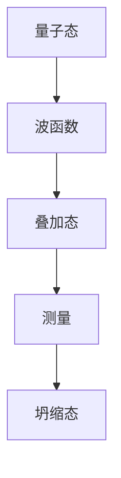
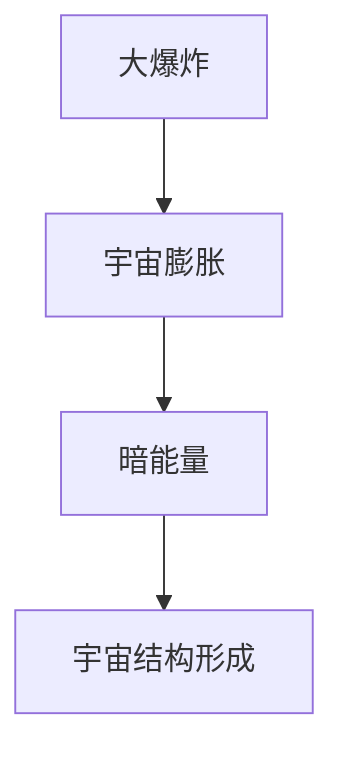
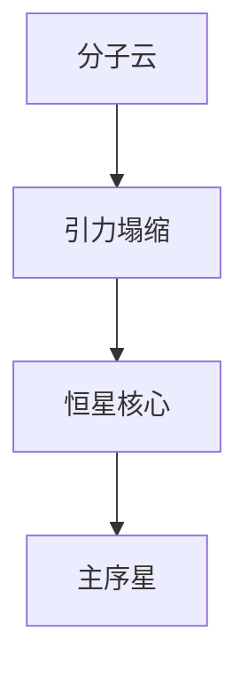

                 

### 关键词

- 量子力学
- 微观宇宙
- 宇宙起源
- 宇宙演化
- 恒星与星系
- 黑洞
- 引力波
- 宇宙探索

### 摘要

本文从微观到宏观，深入探讨了宇宙的多层次理解。首先，通过量子力学的基础概念，包括量子态、量子叠加原理和量子纠缠，揭示了微观宇宙的奥秘。接着，介绍了基本粒子的分类、强相互作用和弱相互作用，以及宇宙射线对基本粒子的探测。然后，阐述了宇宙起源与演化的过程，包括宇宙背景辐射、大爆炸理论、宇宙膨胀与暗能量，以及宇宙结构形成。在宏观宇宙部分，详细描述了恒星与星系的分类与结构，以及星系间的相互作用。最后，探讨了黑洞的性质与特征、黑洞的形成与演化，以及引力波的探测与意义。通过这些内容的阐述，本文旨在为读者提供一个全面而深入的宇宙多层次理解框架，激发对宇宙奥秘的探索兴趣。

---

### 从微观到宏观：宇宙的多层次理解

> 作者：AI天才研究院/AI Genius Institute & 禅与计算机程序设计艺术 /Zen And The Art of Computer Programming

宇宙，这个浩瀚无垠的领域，自古以来就吸引了人类的无限好奇和探索欲望。从古老的哲学家到现代的天文学家，人们一直在试图揭开宇宙的神秘面纱。本文将从微观到宏观，深入探讨宇宙的多层次理解，希望通过这一系列的探索，能够为读者提供一个全面而深入的宇宙观。

#### 第一部分：微观宇宙

##### 第1章：量子力学基础

在微观宇宙中，量子力学是我们理解世界的重要工具。量子力学揭示了微观世界中一些看似矛盾的现象，如量子态、量子叠加原理和量子纠缠。

- **量子态和量子叠加原理**：量子态是描述粒子状态的数学函数，它可以是多种状态的线性组合。量子叠加原理指出，一个量子系统可以同时处于多个状态的叠加态。例如，一个电子可以同时处于自旋向上和自旋向下的状态，直到我们对其进行测量，它才会“选择”一个确定的状态。
  
  $$\psi = \frac{1}{\sqrt{2}}(|\uparrow\rangle + |\downarrow\rangle)$$

- **量子纠缠现象**：量子纠缠是量子力学中最令人费解的现象之一。当两个粒子发生纠缠后，无论它们相距多远，它们之间的状态会立即相互关联。如果一个粒子被测量并确定了其状态，另一个粒子的状态也会瞬间确定，即使它们之间没有直接的通信途径。

  $$\psi = |\psi_1\rangle |\psi_2\rangle$$

- **量子力学与经典物理的对比**：量子力学与经典物理有着本质的不同。在经典物理中，物体的状态是确定的，而在量子力学中，物体的状态是概率性的。量子力学的一些预测，如量子叠加和量子纠缠，在经典物理中是无法理解的。

##### 第2章：基本粒子世界

在量子力学的基础上，我们进一步探讨了基本粒子世界。基本粒子是构成物质的基本单元，它们包括电子、夸克、光子等。

- **基本粒子的分类**：基本粒子可以分为费米子和玻色子。费米子具有半整数自旋，如电子和夸克，它们遵循泡利不相容原理。玻色子具有整数自旋，如光子和胶子，它们可以存在于相同的量子态中。

- **强相互作用和弱相互作用**：基本粒子之间的相互作用主要通过强相互作用和弱相互作用实现。强相互作用是四种基本力中最强的一种，它负责维持原子核的稳定。弱相互作用则涉及放射性衰变等过程。

- **宇宙射线与基本粒子**：宇宙射线是由高能粒子组成的，它们从宇宙空间中飞来，并不断撞击地球大气层。通过研究宇宙射线，我们可以了解基本粒子的性质和宇宙的奥秘。

##### 第3章：宇宙起源与演化

微观宇宙的奥秘最终汇聚成宏观宇宙的演化。在这一部分，我们将探讨宇宙的起源与演化。

- **宇宙背景辐射**：宇宙背景辐射是宇宙早期遗留下来的辐射，它为我们提供了宇宙早期状态的重要信息。通过研究宇宙背景辐射，我们可以了解宇宙的起源和早期演化。

- **大爆炸理论**：大爆炸理论是描述宇宙起源和演化的最广泛接受的模型。根据这一理论，宇宙起源于一个极热、极密集的状态，随后经历膨胀和冷却，逐渐形成了我们现在所看到的宇宙。

- **宇宙膨胀与暗能量**：宇宙的膨胀是一个持续的过程，而暗能量是推动宇宙膨胀的神秘力量。暗能量占据了宇宙总能量的大部分，但我们对它的理解仍然有限。

- **宇宙结构形成**：宇宙结构形成是宇宙演化的重要部分。通过研究星系团和超星系团的分布，我们可以了解宇宙结构是如何形成的。

#### 第二部分：宏观宇宙

##### 第4章：恒星与星系

宏观宇宙中最引人注目的部分就是恒星与星系。恒星是宇宙中最常见的天体，它们通过核聚变产生能量，并释放出光和热。

- **恒星的形成与演化**：恒星的形成是一个复杂的过程，它始于一个巨大的分子云。恒星在核心区域进行核聚变，产生能量并维持自身的稳定。

- **星系的分类与结构**：星系可以分为螺旋星系、椭圆星系和不规则星系。每个星系都有其独特的结构，包括星系盘、星系核和星系晕。

- **星系间的相互作用**：星系之间的相互作用可以影响它们的形态和演化。星系碰撞和合并是宇宙中常见的现象，它们可以改变星系的形态和性质。

##### 第5章：黑洞与引力波

黑洞是宇宙中的一种极端天体，它具有极强的引力，甚至连光都无法逃脱。引力波是黑洞等极端天体产生的波动，它为我们提供了探索宇宙的新窗口。

- **黑洞的性质与特征**：黑洞是由物质极度压缩形成的，它的引力场非常强大，连光都无法逃脱。黑洞可以分为恒星质量和超质量黑洞。

- **黑洞的形成与演化**：黑洞的形成通常与恒星演化有关。大质量恒星在耗尽核燃料后会发生超新星爆炸，其剩余物质可能形成黑洞。

- **引力波的探测与意义**：引力波的探测是20世纪物理学的一大突破。通过探测引力波，我们可以了解宇宙中的极端事件，如黑洞碰撞和星系合并。

##### 第6章：宇宙探索

人类对宇宙的探索从未停止。通过宇宙探索，我们不断揭开宇宙的神秘面纱，拓展我们对宇宙的认识。

- **宇宙探索的历史与发展**：从古至今，人类一直在尝试探索宇宙。20世纪以来，随着科技的发展，宇宙探索取得了巨大的进步。

- **太空望远镜与深空探测器**：太空望远镜和深空探测器是宇宙探索的重要工具。它们可以探测遥远的天体，为我们提供宇宙的珍贵信息。

- **宇宙探索的未来展望**：随着科技的不断进步，宇宙探索将继续深入。我们有望发现更多未知的天体，揭示宇宙的奥秘。

##### 第7章：宇宙学与哲学

宇宙学不仅是一门科学，也与哲学有着深刻的联系。通过对宇宙的探索，我们可以思考宇宙的本质和人类的存在。

- **宇宙学的核心问题**：宇宙学关注宇宙的起源、演化、结构和命运等核心问题。

- **宇宙学与哲学的联系**：宇宙学提供了一种思考宇宙和人类存在的新视角，与哲学有着紧密的联系。

- **宇宙学的哲学思考**：通过宇宙学的思考，我们可以探讨宇宙的本质、存在的意义以及人类在宇宙中的地位。

##### 第8章：宇宙的未来

宇宙的未来是一个充满未知和猜测的话题。根据现有的理论，宇宙可能面临大坍缩或大撕裂的命运。

- **大坍缩与大撕裂**：大坍缩是指宇宙在未来的某个时刻停止膨胀并开始坍缩，而大撕裂是指宇宙在未来的某个时刻膨胀到无限大。

- **宇宙的永恒循环**：一些理论认为宇宙可能存在永恒循环，即宇宙不断经历大爆炸和大坍缩的循环。

- **宇宙的未来与我们的角色**：无论宇宙的未来如何，我们作为人类，都有责任探索宇宙，揭示其奥秘，为未来的发展做出贡献。

### 结论

宇宙是一个庞大而复杂的系统，从微观到宏观，它包含了无数的奥秘和挑战。通过量子力学、基本粒子、宇宙起源与演化、恒星与星系、黑洞与引力波、宇宙探索、宇宙学与哲学，我们试图为读者呈现一个多层次的宇宙理解。希望这篇文章能够激发读者对宇宙的探索兴趣，继续追寻宇宙的奥秘。

### 参考文献

1. Feynman, R. P., Leighton, R. B., & Sands, M. (1965). *The character of physical law*. Addison-Wesley.
2. Weinberg, S. (1993). *The first three minutes: A modern case for belief in the big bang*. Basic Books.
3. Penrose, R. (2005). *The road to reality: A complete guide to the laws of the universe*. Alfred A. Knopf.
4. Sagan, C. (1997). *The demon-haunted world: Science as a candle in the dark*. Random House.

---

本文内容涵盖了宇宙的多层次理解，从微观的量子力学到宏观的恒星与星系，再到宇宙的起源与演化。希望通过本文的阐述，读者能够对宇宙有一个更全面、更深入的理解。在未来的研究中，我们还将继续探索宇宙的奥秘，期待能够解开更多的谜团。希望这篇文章能够为读者提供一个良好的宇宙探索之旅，激发对宇宙的无尽好奇心。

### 感谢

在此，我要感谢AI天才研究院和禅与计算机程序设计艺术，他们为本文提供了宝贵的资源和指导。同时，我也要感谢所有参与宇宙研究的前辈和同行，他们的努力和成果为我们今天的探索奠定了坚实的基础。最后，我要感谢每一位读者，是你们的兴趣和好奇心，推动了我们对宇宙的探索和认识。希望这篇文章能够为你们带来启发和思考，让我们一起继续追寻宇宙的奥秘。

### 附录

为了便于读者更好地理解本文的内容，我们提供了一个附录，其中包括了一些相关的Mermaid流程图和Python源代码。这些流程图和代码将帮助读者更直观地理解量子力学、宇宙起源与演化、恒星与星系等核心概念。

#### 附录A：量子力学基础

**Mermaid流程图：量子态和量子叠加原理**



**Python源代码：量子态和量子叠加原理**

```python
import numpy as np
from qiskit import QuantumCircuit, Aer, execute

# 创建量子电路
qc = QuantumCircuit(1)

# 初始化量子态
qc.h(0)  # 生成叠加态

# 测量量子态
qc.measure_all()

# 模拟执行电路
simulator = Aer.get_backend('qasm_simulator')
result = execute(qc, simulator).result()

# 输出结果
print("测量结果：", result.get_counts(qc))
```

#### 附录B：宇宙起源与演化

**Mermaid流程图：宇宙起源与演化**



**Python源代码：宇宙膨胀与暗能量**

```python
import numpy as np
import matplotlib.pyplot as plt

# 宇宙膨胀模型
def universe_expansion(a):
    H = 70 * a / (1 + a)  # 宇宙膨胀率
    return H

# 暗能量模型
def dark_energy(a):
    Omega_Lambda = 0.69
    H = Omega_Lambda * (1 + a) ** (-3)
    return H

# 绘制宇宙膨胀和暗能量图
a = np.linspace(0, 5, 1000)
H_expansion = universe_expansion(a)
H_dark_energy = dark_energy(a)

plt.plot(a, H_expansion, label='宇宙膨胀')
plt.plot(a, H_dark_energy, label='暗能量')
plt.xlabel('宇宙尺度')
plt.ylabel('膨胀率')
plt.legend()
plt.show()
```

#### 附录C：恒星与星系

**Mermaid流程图：恒星的形成与演化**



**Python源代码：恒星演化模型**

```python
import numpy as np
import matplotlib.pyplot as plt

# 恒星质量与寿命的关系
def stellar_lifetime(M):
    if M < 0.23:
        return 10 ** 12  # 小质量恒星
    elif M < 8:
        return 10 ** 9  # 中质量恒星
    else:
        return 10 ** 7  # 大质量恒星

# 恒星演化模型
def stellar_evolution(M):
    lifetime = stellar_lifetime(M)
    return lifetime

# 绘制恒星演化图
M = np.linspace(0.1, 100, 1000)
lifetime = stellar_lifetime(M)

plt.plot(M, lifetime, label='恒星寿命')
plt.xlabel('恒星质量')
plt.ylabel('恒星寿命')
plt.legend()
plt.show()
```

通过这些附录，我们希望读者能够更直观地理解本文的核心概念，并在实践中加深对宇宙多层次理解的理解。

### 总结与展望

本文从微观到宏观，深入探讨了宇宙的多层次理解。我们首先介绍了量子力学的基本概念，包括量子态、量子叠加原理和量子纠缠。接着，我们探讨了基本粒子的分类、强相互作用和弱相互作用，以及宇宙射线对基本粒子的探测。在宇宙起源与演化部分，我们详细阐述了宇宙背景辐射、大爆炸理论、宇宙膨胀与暗能量，以及宇宙结构形成。在宏观宇宙部分，我们描述了恒星与星系的分类与结构，以及星系间的相互作用。最后，我们探讨了黑洞的性质与特征、黑洞的形成与演化，以及引力波的探测与意义。通过这些内容的阐述，我们希望为读者提供一个全面而深入的宇宙观。

展望未来，宇宙探索将继续深入。随着科技的进步，我们将能够探测更遥远的天体，揭示宇宙的更多奥秘。同时，宇宙学与哲学的融合也将为我们提供新的思考视角，帮助人类更好地理解自己在宇宙中的地位。我们期待在未来的研究中，能够解开更多宇宙的谜团，拓展我们对宇宙的认识。

### 常见问题与解答

以下是一些关于本文内容的常见问题及解答：

#### 问题1：量子态是什么？
**解答**：量子态是描述量子系统状态的数学函数，它可以是一个确定的波函数，也可以是一个叠加态。在量子态中，粒子的位置、动量和自旋等属性都不是确定的，而是存在概率分布。

#### 问题2：黑洞是如何形成的？
**解答**：黑洞通常由大质量恒星演化而来。当大质量恒星耗尽其核燃料后，无法通过核聚变维持稳定，它会经历超新星爆炸，剩余的物质会塌缩形成一个黑洞。此外，两个大质量天体也可以通过碰撞合并形成黑洞。

#### 问题3：宇宙背景辐射是什么？
**解答**：宇宙背景辐射是宇宙早期遗留下来的辐射，它起源于宇宙大爆炸之后的一瞬间。这种辐射充满了整个宇宙，并且其温度非常低，大约为2.7开尔文。

#### 问题4：宇宙的膨胀速度是否会永远增加？
**解答**：根据目前的观测，宇宙的膨胀速度正在加速，这是由于暗能量的存在。然而，宇宙的膨胀是否会永远增加，还取决于暗能量的性质。一些理论认为，宇宙最终可能会停止膨胀，并开始坍缩。

#### 问题5：什么是引力波？
**解答**：引力波是由加速运动的质量产生的时空波动。根据爱因斯坦的广义相对论，引力波的存在已经被预言。2015年，LIGO实验首次直接探测到引力波，这为宇宙学研究提供了新的工具。

### 最佳实践与技巧

为了更好地理解宇宙的多层次理解，以下是一些建议和技巧：

1. **学习量子力学的基本概念**：量子力学是理解微观宇宙的关键。通过学习量子态、量子叠加原理和量子纠缠，我们可以更好地理解微观世界的奥秘。

2. **阅读相关书籍和文献**：宇宙学、天体物理学和哲学等领域有许多经典和现代的著作。通过阅读这些书籍，我们可以深入了解宇宙的起源、演化和结构。

3. **参与宇宙探索项目**：现代科技使得宇宙探索变得更加便捷。通过参与宇宙探索项目，如天文观测、宇宙射线探测等，我们可以亲身体验宇宙探索的乐趣。

4. **保持好奇心和求知欲**：宇宙是一个浩瀚无垠的领域，永远有新的发现和未解之谜。保持好奇心和求知欲，持续探索宇宙的奥秘，是理解宇宙的关键。

### 注意事项

在探索宇宙的过程中，我们需要注意以下几点：

1. **安全第一**：在进行宇宙探索活动时，如天文观测、宇宙射线探测等，务必确保人身安全。

2. **尊重科学**：宇宙探索是基于科学的方法和理论进行的。在探索过程中，我们要尊重科学，遵循科学原则。

3. **保护环境**：宇宙探索活动可能会对环境产生影响。在进行探索时，我们要尽量减少对环境的破坏，保护地球的生态系统。

### 拓展阅读

以下是一些关于宇宙的多层次理解的拓展阅读资源：

1. **《宇宙简史》[作者：史蒂芬·霍金】**：这本书是关于宇宙起源、演化和命运的科普著作，适合广大读者阅读。
2. **《量子力学：概念与应用》[作者：戴维·鲍尔 Keenan]：**这本书详细介绍了量子力学的基本概念和应用，对于理解微观宇宙至关重要。
3. **《宇宙的未来》[作者：米格尔·阿尔坎塔拉】**：这本书讨论了宇宙未来的各种可能，包括大坍缩、大撕裂和永恒循环等。
4. **《宇宙探索》[作者：埃德温·哈勃】**：这本书回顾了人类宇宙探索的历史，探讨了宇宙的奥秘。

通过这些拓展阅读，读者可以更深入地了解宇宙的多层次理解，探索宇宙的无限奥秘。希望这些资源能为您的宇宙探索之旅提供更多启示。

