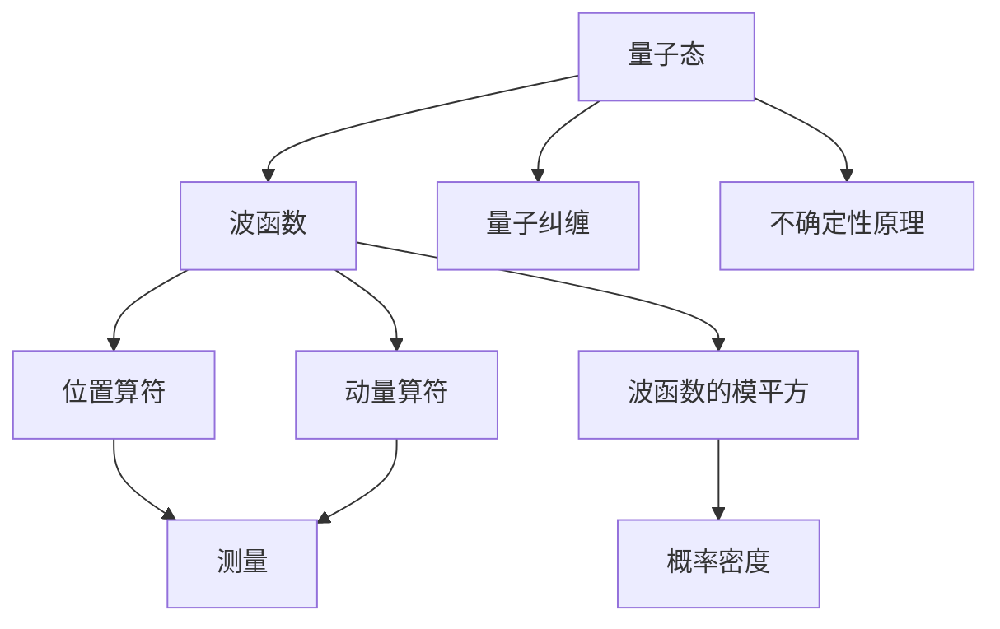
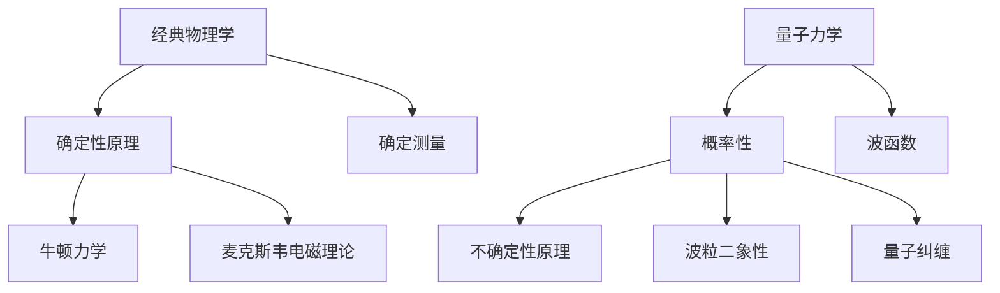
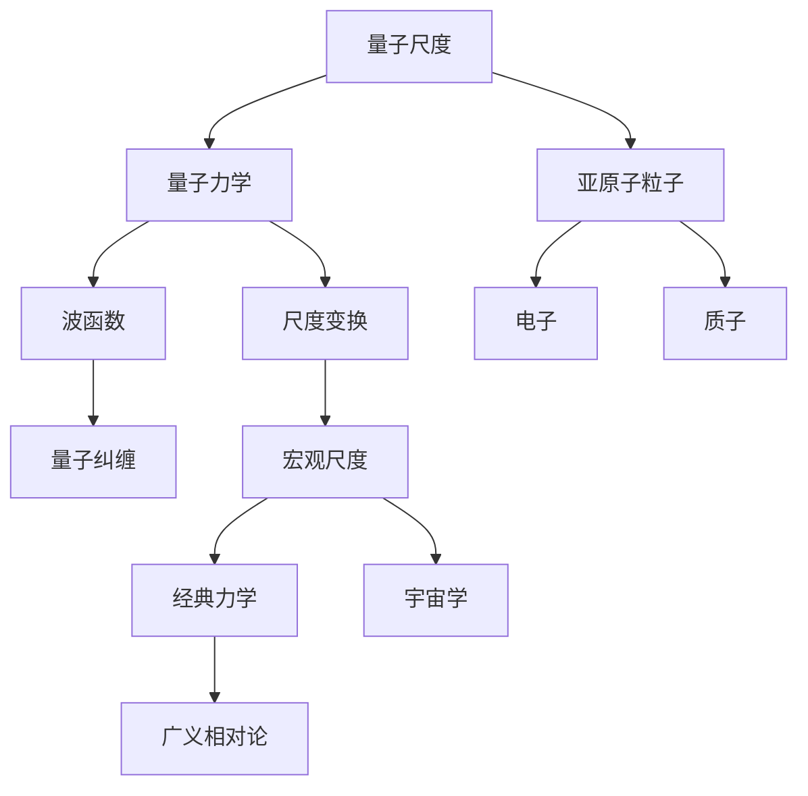

                 

### 引言与概述

在现代科学中，尺度的跨越是一个极其重要且引人入胜的研究领域。从微观的量子世界到宏观的宇宙，每一个尺度都蕴含着独特的物理现象和规律。微观世界是由原子和基本粒子组成的，而宏观宇宙则包含了庞大的星系、行星和宇宙背景辐射。这两个极端尺度的研究，不仅对于理解自然界的基本规律至关重要，同时也推动了科学技术的进步。

《从微观量子到宏观宇宙：尺度的跨越》旨在探讨这两个尺度之间的联系与差异，揭示它们背后的科学原理和关键技术。本书的目的是为读者提供一个全面且深入的了解，使他们对微观量子世界和宏观宇宙有更清晰的认识。

本书的第一部分将介绍尺度的概念，并解释为什么研究不同尺度之间的联系至关重要。接着，我们将分别深入探讨微观量子世界和宏观宇宙的基本原理和现象。在第三部分，我们将研究尺度跨越的物理学原理，并分析从微观到宏观尺度的物理理论如何相互关联。第四部分将讨论在研究尺度跨越时使用的先进技术和工具，包括实验方法和计算模拟技术。第五部分将分享科学家的探索历程和重要发现，以展示科学研究是如何推动我们对自然界的理解的。最后一部分，我们将展望尺度跨越研究的未来趋势和潜在影响，探讨这一领域对科学技术和社会的潜在贡献。

通过这些章节的探讨，我们希望能够激发读者对科学探索的兴趣，并深入理解不同尺度之间的复杂关系。无论你是物理学爱好者，还是对科技进步充满好奇的读者，这本书都将为你提供丰富的知识和思考的启发。

### 关键词

- **尺度跨越**：描述在不同尺度间进行研究的科学方法。
- **微观量子世界**：包含原子和基本粒子的世界。
- **宏观宇宙**：包含星系、行星和宇宙背景辐射的广阔空间。
- **量子力学**：描述微观世界的物理学理论。
- **宇宙学**：研究宇宙的结构和演化的科学。
- **物理学原理**：不同尺度间相互关联的基本物理规律。
- **科学技术**：用于研究尺度跨越的先进工具和技术。
- **科学探索**：科学家在尺度跨越领域的发现和实验。

### 摘要

《从微观量子到宏观宇宙：尺度的跨越》旨在深入探讨微观量子世界和宏观宇宙之间的联系，解释不同尺度之间的物理规律和科学原理。本书首先介绍了尺度的概念和研究意义，接着详细介绍了微观量子世界的基本原理和宏观宇宙的演化过程。通过对比量子力学和宇宙学的核心概念，我们揭示了两者之间的联系和差异。随后，本书探讨了从微观到宏观尺度的物理理论如何相互关联，并介绍了在研究尺度跨越时使用的先进技术和工具。书中还分享了科学家的探索历程和重要发现，展示了科学研究是如何推动我们对自然界的理解的。最后，本书展望了尺度跨越研究的未来趋势和潜在影响，讨论了这一领域对科学技术和社会的潜在贡献。通过这本书，读者将获得对微观量子世界和宏观宇宙的全面了解，并激发对科学探索的兴趣。

## 第一部分：引言与概述

### 1.1 引言

在科学研究中，尺度的概念至关重要。尺度不仅决定了我们观察和研究问题的视角，也影响了我们对自然界规律的理解。从微观量子世界到宏观宇宙，每一个尺度都有其独特的物理现象和科学原理。微观量子世界是由原子和基本粒子构成的，而宏观宇宙则包含了庞大的星系、行星和宇宙背景辐射。这两个极端尺度的研究，不仅扩展了我们的知识边界，也推动了科学技术的进步。

微观量子世界的研究始于对原子和基本粒子的探索。量子力学，这一描述微观世界的物理学理论，揭示了粒子行为的非经典特性，如波粒二象性、量子纠缠和不确定性原理。这些现象与我们所熟知的经典物理学有着显著差异，挑战了我们对自然界的认知。然而，正是这些微观现象的深入理解，为现代科技的发展奠定了基础，如量子计算、量子通信和纳米技术。

宏观宇宙的研究则关注宇宙的起源、结构和演化。宇宙学，作为研究宇宙的科学，探讨了宇宙的膨胀、黑洞和星系的演化等复杂问题。通过观测宇宙背景辐射和星系分布，科学家们揭示了宇宙在大尺度上的结构和演化规律。这些研究不仅帮助我们理解了宇宙的过去和未来，也为探索生命的起源和分布提供了线索。

研究尺度跨越的意义在于，它能够揭示不同尺度间物理现象的内在联系，从而推动科学理论的发展。例如，量子引力理论的探索试图将量子力学与广义相对论统一，以解释从微观到宏观的引力现象。此外，尺度跨越研究还促进了交叉学科的发展，如量子生物学、量子信息学和宇宙生物学等，这些领域的研究将深刻影响未来科技和社会的进步。

总之，从微观量子到宏观宇宙的研究，不仅丰富了我们对自然界的认识，也为科学技术的创新提供了新的动力。理解不同尺度间的联系，有助于我们更全面地把握自然界的规律，推动人类文明的进步。

### 1.2 书籍结构与目标

《从微观量子到宏观宇宙：尺度的跨越》分为七个主要部分，每一部分都深入探讨了一个特定的研究维度，以帮助读者全面了解这一复杂而引人入胜的领域。

**第一部分：引言与概述**  
本部分首先介绍了尺度的概念，解释了为什么研究不同尺度之间的联系至关重要。接着，我们探讨了微观量子世界和宏观宇宙的基本原理，为后续章节的深入讨论奠定了基础。

**第二部分：微观量子世界**  
这一部分详细介绍了量子力学的基本原理和应用。从量子态、算符和测量，到波函数和量子纠缠，我们通过具体的数学模型和公式，深入探讨了微观世界的奥秘。

**第三部分：宏观宇宙**  
本部分聚焦于宇宙学的基本概念和宇宙结构。我们介绍了宇宙的起源、结构和演化，并探讨了星系和宇宙背景辐射等关键概念。通过具体案例，展示了宇宙学研究的实际应用。

**第四部分：尺度跨越的物理学**  
这一部分深入分析了从微观到宏观尺度的物理理论。我们讨论了物理学中的尺度概念、研究方法和核心原理，通过图解和实例，展示了尺度跨越的物理现象。

**第五部分：技术与工具**  
本部分介绍了在研究尺度跨越时使用的先进技术和工具。我们探讨了微观与宏观技术的概述，详细讨论了新技术动态、工具选型与应用，并展望了技术发展趋势。

**第六部分：科学探索与发现**  
这一部分分享了科学家的探索历程和重要发现。通过回顾量子世界和宇宙学领域的关键实验和发现，展示了科学研究的实际成果和贡献。

**第七部分：未来展望**  
最后，本部分探讨了尺度跨越研究的未来趋势和潜在影响。我们讨论了未来发展方向、科技影响和伦理问题，并展望了这一领域对科学技术和社会的潜在贡献。

通过这七个部分的系统探讨，本书旨在为读者提供一个全面而深入的了解，使他们对微观量子世界和宏观宇宙有更清晰的认识，并激发对科学探索的兴趣。

### 量子力学的基本原理

量子力学，作为描述微观量子世界的物理学理论，其基础概念和原理与经典物理学有显著的不同。理解这些基本原理，对于揭示微观世界的奥秘至关重要。

#### 量子态

量子态是量子力学的核心概念之一。与经典物理学中的粒子位置和速度不同，量子态描述的是粒子在量子系统中可能存在的各种状态。量子态通常用波函数来表示，波函数提供了粒子在空间中概率分布的信息。例如，在双缝实验中，单个电子或光子的波函数描述了它们通过两个缝隙后在屏幕上形成的干涉图样。

一个典型的量子态可以用如下的波函数表示：
$$
\psi(x, t) = \frac{1}{\sqrt{2}} (|\uparrow\rangle + |\downarrow\rangle)
$$
这里的 $|\uparrow\rangle$ 和 $|\downarrow\rangle$ 分别表示粒子向上和向下偏振的状态。波函数的模平方 $|\psi(x, t)|^2$ 表示粒子在空间某点的概率密度。

#### 算符和测量

量子力学中的算符是对量子态进行操作的数学工具。常见的算符包括位置算符 $\hat{x}$、动量算符 $\hat{p}$、自旋算符 $\hat{S}_z$ 等。这些算符用于测量粒子的物理量。例如，位置算符 $\hat{x}$ 的测量结果可能是在某个位置附近的一个区间内。

测量在量子力学中具有特殊的意义。根据哥本哈根诠释，测量会导致量子态的坍缩，即量子系统的波函数在测量后只能处于某个确定的状态。例如，当我们测量一个电子的自旋时，它可能只会在特定的方向上表现出确定的值。

为了说明量子态和测量，我们可以考虑以下Python代码，其中定义了一个量子态和测量操作的函数：

```python
import numpy as np

# 定义量子态
psi_up = np.array([1, 0])
psi_down = np.array([0, 1])

# 定义位置算符
x_op = np.array([[1, 0], [0, 0]])

# 定义测量函数
def measure_state(state, operator):
    # 进行测量，并返回测量结果
    return operator @ state

# 测量量子态
result = measure_state(psi_up + psi_down, x_op)
print("测量结果:", result)
```

#### 波函数

波函数是量子态的数学表示，描述了粒子在量子系统中的概率分布。在量子力学中，波函数通常用复数来表示，并通过模平方得到概率密度。

例如，一个电子在三维空间中的波函数可以表示为：
$$
\psi(x, y, z, t) = \frac{1}{\sqrt{2\pi\hbar^3}} e^{i(kx - \omega t)}
$$
这里的 $k$ 是波数，$\omega$ 是角频率，$\hbar$ 是约化普朗克常数。波函数的模平方：
$$
|\psi(x, y, z, t)|^2 = \frac{1}{2\pi\hbar^3} e^{-i(kx - \omega t)}
$$
表示粒子在空间某点的概率密度。

为了更直观地理解波函数，我们可以考虑一个简单的一维粒子。假设粒子的波函数为：
$$
\psi(x) = A \sin(kx)
$$
这里的 $A$ 是振幅，$k$ 是波数。波函数的模平方为：
$$
|\psi(x)|^2 = A^2 \sin^2(kx)
$$
这表明粒子在位置 $x$ 的概率密度正比于 $\sin^2(kx)$。

为了更好地理解量子态和测量，我们可以使用Python代码来模拟一个一维粒子的波函数和测量过程：

```python
import numpy as np

# 定义波函数
k = 2 * np.pi / 10  # 波数
A = 1  # 振幅

# 波函数
psi = A * np.sin(k * np.linspace(-10, 10, 1000))

# 波函数的模平方
prob_density = A**2 * np.sin**2(k * np.linspace(-10, 10, 1000))

# 绘制波函数和概率密度
import matplotlib.pyplot as plt

plt.plot(np.linspace(-10, 10, 1000), psi, label="波函数")
plt.plot(np.linspace(-10, 10, 1000), prob_density, label="概率密度")
plt.legend()
plt.xlabel("位置")
plt.ylabel("波函数/概率密度")
plt.show()

# 测量波函数
measured_values = np.random.choice(np.linspace(-10, 10, 1000), size=1000, p=prob_density)

print("测量的粒子位置:", measured_values)
```

通过这段代码，我们可以生成一个一维粒子的波函数和其概率密度图，并通过随机采样模拟测量过程。这种方法有助于我们直观地理解量子态和测量的性质。

#### 量子纠缠

量子纠缠是量子力学中另一个重要且奇特的性质。当两个或多个量子系统相互作用后，它们的量子态会相互纠缠，使得一个系统的测量结果会即时影响另一个系统，无论它们相隔多远。

一个经典的量子纠缠实验是爱因斯坦-波多尔斯基-罗森佯谬（EPR佯谬）。在这个实验中，两个粒子在相互作用后，各自处于一个纠缠态。当我们在一个粒子上进行特定的测量（如自旋测量），另一个粒子的测量结果会即刻确定，即使这两个粒子相隔很远。

为了说明量子纠缠，我们可以使用如下的波函数表示两个纠缠的粒子：
$$
\psi = \frac{1}{\sqrt{2}} (|\uparrow\rangle |\downarrow\rangle - |\downarrow\rangle |\uparrow\rangle)
$$
这里的 $|\uparrow\rangle$ 和 $|\downarrow\rangle$ 分别表示两个粒子在特定方向上的自旋状态。

为了演示量子纠缠，我们可以使用Python代码模拟一个纠缠态的两个粒子的测量过程：

```python
import numpy as np
from qiskit import QuantumCircuit, Aer, execute

# 创建量子电路
qc = QuantumCircuit(2)

# 创建纠缠态
qc.h(0)
qc.cx(0, 1)

# 进行测量
qc.measure_all()

# 执行量子电路
simulator = Aer.get_backend('qasm_simulator')
result = execute(qc, simulator, shots=1000).result()

# 获取测量结果
counts = result.get_counts(qc)
print("测量结果:", counts)

# 绘制概率分布
plt.bar(counts.keys(), counts.values())
plt.xlabel("测量结果")
plt.ylabel("概率")
plt.show()
```

这段代码使用Qiskit库创建了一个量子电路，生成了一个纠缠态，并进行测量。通过测量结果的概率分布，我们可以直观地看到量子纠缠的特性。

通过以上对量子态、算符和测量、波函数以及量子纠缠的详细探讨，我们可以更深入地理解微观量子世界的基本原理。这些原理不仅在科学理论中具有重要意义，也为现代科技的应用提供了坚实的理论基础。

### 波函数与量子力学核心概念的联系架构

在量子力学中，波函数是描述量子态的核心工具，它不仅包含了粒子的位置和动量信息，还反映了量子系统内部的状态。为了更清晰地展示波函数与量子力学核心概念之间的联系，我们可以通过一个Mermaid流程图来描述这些关系。

以下是一个简化的Mermaid流程图示例，用于展示波函数、算符、测量和量子态之间的关联：



#### Mermaid流程图解析：

1. **量子态（A）**：这是量子力学的基本概念，表示量子系统的整体状态。

2. **波函数（B）**：量子态的数学表示，提供了粒子的位置和动量等信息。

3. **位置算符（C）** 和 **动量算符（D）**：这些是量子力学中的基本算符，用于测量粒子的位置和动量。

4. **测量（E）**：测量操作会根据波函数的结果导致量子态的坍缩，即波函数在测量后只能处于某个确定的状态。

5. **量子纠缠（F）**：当量子系统相互作用时，它们可以进入一个纠缠态，这使得一个粒子的测量结果会即刻影响另一个粒子，即使它们相隔很远。

6. **不确定性原理（G）**：这是量子力学的基本原理之一，描述了粒子的某些物理量（如位置和动量）不能同时被精确测量。

7. **波函数的模平方（H）** 和 **概率密度（I）**：波函数的模平方提供了粒子在空间中某点的概率密度，即粒子出现在该点的概率。

通过这个流程图，我们可以清晰地看到波函数作为量子态的数学表示，与量子力学其他核心概念（如算符、测量、量子纠缠和不确定性原理）之间的联系。这种架构不仅有助于理解量子力学的基本原理，也为后续章节的深入探讨提供了直观的图示。

### 量子力学原理的算法原理与Python实现

为了更深入地理解量子力学原理，我们可以通过具体的算法和Python代码实现来讲解。下面我们将探讨量子态的叠加、波函数的演化以及量子纠缠等现象，并结合Python代码进行详细解释。

#### 量子态的叠加

量子态的叠加是量子力学的一个基本特性，它描述了量子系统可以同时存在于多个状态的组合。一个简单的叠加态可以表示为：
$$
\psi = \frac{1}{\sqrt{2}} (|\uparrow\rangle + |\downarrow\rangle)
$$
这里，$|\uparrow\rangle$ 和 $|\downarrow\rangle$ 分别代表粒子在上偏振和下偏振的状态。为了实现这个叠加态，我们可以使用Python的NumPy库进行计算：

```python
import numpy as np

# 定义量子态的基向量
up_state = np.array([1, 0])
down_state = np.array([0, 1])

# 创建叠加态
psi = np.sqrt(0.5) * (up_state + down_state)

print("叠加态：", psi)
```

这段代码首先定义了上偏振和下偏振的基向量，然后通过叠加这两个基向量来创建一个叠加态。运行这段代码，我们可以得到一个叠加态的表示。

#### 波函数的演化

量子态随时间的演化可以通过薛定谔方程来描述，其形式为：
$$
i\hbar \frac{\partial \psi}{\partial t} = \hat{H} \psi
$$
其中，$i$ 是虚数单位，$\hbar$ 是约化普朗克常数，$\hat{H}$ 是哈密顿算符，$\psi$ 是波函数。

为了说明波函数的演化，我们可以考虑一个简单的谐振子模型。在这个模型中，哈密顿算符可以表示为：
$$
\hat{H} = \frac{\hat{p}^2}{2m} + \frac{1}{2}kx^2
$$
这里，$\hat{p}$ 是动量算符，$m$ 是粒子的质量，$k$ 是谐振子的劲度系数，$x$ 是粒子的位置。

以下是一个使用Python实现的波函数演化示例：

```python
import numpy as np
from scipy.linalg import expm

# 定义哈密顿算符
def hamiltonian(m, k, x):
    p = np.array([[0, -1], [1, 0]])
    return (p**2 / (2 * m)) + (k / 2) * np.eye(2)

# 波函数初态
psi_initial = np.array([[1, 0], [0, 0]])

# 时间演化
def evolve(psi, hamiltonian, t):
    return expm(-1j * hamiltonian * t) @ psi

# 参数设置
m = 1.0  # 粒子质量
k = 1.0  # 劲度系数
t_final = 10  # 时间终点

# 计算波函数在多个时间点的值
times = np.linspace(0, t_final, 1000)
evolved_states = [evolve(psi_initial, hamiltonian(m, k, np.array([[0, 0], [0, 0]])), t) for t in times]

# 绘制波函数的时间演化
import matplotlib.pyplot as plt

for i, psi in enumerate(evolved_states):
    plt.plot(np.linspace(-5, 5, 1000), np.abs(psi)**2)

plt.xlabel("位置")
plt.ylabel("概率密度")
plt.title("波函数的时间演化")
plt.show()
```

这段代码定义了一个简单的谐振子模型，并使用SciPy库中的`expm`函数计算波函数随时间的演化。通过绘制不同时间点的波函数概率密度，我们可以直观地看到波函数随时间的演化过程。

#### 量子纠缠

量子纠缠是量子力学中另一个重要特性，描述了两个或多个量子系统之间的强烈关联。一个简单的纠缠态可以表示为：
$$
\psi = \frac{1}{\sqrt{2}} (|\uparrow\rangle |\downarrow\rangle - |\downarrow\rangle |\uparrow\rangle)
$$

以下是一个使用Qiskit库实现量子纠缠和测量的示例：

```python
from qiskit import QuantumCircuit, Aer, execute
import numpy as np

# 创建量子电路
qc = QuantumCircuit(2)

# 创建纠缠态
qc.h(0)
qc.cx(0, 1)

# 进行测量
qc.measure_all()

# 执行量子电路
simulator = Aer.get_backend('qasm_simulator')
result = execute(qc, simulator, shots=1000).result()

# 获取测量结果
counts = result.get_counts(qc)
print("测量结果:", counts)

# 绘制概率分布
plt.bar(counts.keys(), counts.values())
plt.xlabel("测量结果")
plt.ylabel("概率")
plt.title("纠缠态测量结果")
plt.show()
```

这段代码首先创建了一个量子电路，生成了一个纠缠态，然后进行测量并绘制了测量结果的概率分布。通过观察测量结果的分布，我们可以看到量子纠缠的特性，即当我们在一个粒子上进行测量后，另一个粒子的测量结果会即刻确定。

通过这些Python代码实现，我们可以更直观地理解量子态的叠加、波函数的演化以及量子纠缠等现象。这些实现不仅帮助我们深入理解量子力学的基本原理，也为实际应用提供了实用的工具。

### 量子力学与经典物理学的对比

量子力学与经典物理学在基本原理和现象上有着显著的区别。经典物理学主要描述宏观世界中物体的运动和相互作用，其基础是牛顿力学和麦克斯韦电磁理论。而量子力学则描述微观世界中粒子的行为，如原子、分子和基本粒子。以下是两者之间的一些主要对比：

#### 1. 粒子的行为

在经典物理学中，粒子的行为遵循确定性原理，即给定初始条件，我们可以精确地预测粒子的未来位置和速度。然而，在量子力学中，粒子的行为具有概率性和不确定性。量子态可以用波函数来描述，波函数提供了粒子在不同位置和状态的概率分布。例如，在双缝实验中，单个电子或光子通过两个缝隙后在屏幕上形成的干涉图样，其概率分布是由波函数的模平方给出的。

#### 2. 测量与观测

在经典物理学中，测量是确定性的，结果不会影响测量过程。而在量子力学中，测量是一个过程，它会导致量子态的坍缩。根据哥本哈根诠释，量子态在测量之前是处于一种“超叠加”状态，测量后量子态会坍缩到某个确定的状态。这种现象称为波函数坍缩，是量子力学中一个基本且具有争议的概念。

#### 3. 不确定性原理

经典物理学中，位置和动量可以同时被精确测量。然而，在量子力学中，根据海森堡不确定性原理，粒子的某些物理量（如位置和动量）不能同时被精确测量。这意味着我们无法同时精确知道粒子的位置和动量。这一原理深刻地改变了我们对自然界的认识。

#### 4. 波粒二象性

在经典物理学中，粒子表现为确定的点状物体，而波则表现为连续的波动。然而，在量子力学中，粒子和波之间没有严格的界限。粒子具有波粒二象性，即在某些实验条件下，粒子表现出波动性；而在其他条件下，又表现出粒子性。这一现象在双缝实验和电子束衍射实验中得到了验证。

#### 5. 量子纠缠

量子纠缠是量子力学中一个独特且奇特的性质。当两个或多个量子系统相互作用后，它们的量子态会相互纠缠，使得一个系统的测量结果会即时影响另一个系统，无论它们相隔多远。这一现象在经典物理学中是无法想象的，它挑战了我们对空间和时间的理解。

为了更直观地对比量子力学和经典物理学的差异，我们可以通过以下Mermaid流程图来展示这些基本概念：



#### Mermaid流程图解析：

1. **经典物理学（A）**：描述宏观世界中的物体运动和相互作用。
2. **确定性原理（B）**：经典物理学中的基本原理，认为给定初始条件可以精确预测物体运动。
3. **确定测量（C）**：测量结果不会影响测量过程。
4. **牛顿力学（D）**：经典物理学的一部分，描述物体运动的基本规律。
5. **麦克斯韦电磁理论（E）**：描述电磁现象的基本理论。
6. **量子力学（F）**：描述微观世界中粒子的行为。
7. **概率性（G）**：量子态的描述依赖于概率分布，测量结果具有不确定性。
8. **波函数（H）**：量子态的数学表示，提供粒子概率分布信息。
9. **不确定性原理（I）**：粒子的某些物理量不能同时被精确测量。
10. **波粒二象性（J）**：粒子在某些实验条件下表现出波动性，在其他条件下表现出粒子性。
11. **量子纠缠（K）**：量子系统之间的一种强烈关联，测量结果可以即时影响相隔遥远的系统。

通过这个流程图，我们可以清晰地看到量子力学与经典物理学在基本原理和现象上的对比，这有助于我们更深入地理解量子力学的独特性和重要性。

### 宇宙学的基础概念和宇宙结构

宇宙学是研究宇宙的起源、结构、演化和最终命运的科学。它涵盖了从大爆炸理论到宇宙背景辐射，再到星系和黑洞等广泛的主题。以下是对宇宙学基础概念和宇宙结构的详细介绍。

#### 大爆炸理论

大爆炸理论是目前关于宇宙起源最被广泛接受的理论。根据这一理论，宇宙起源于约138亿年前的一个极高温度和密度的状态，随后迅速膨胀并冷却，形成了我们现在观测到的宇宙。这一理论得到了许多观测数据的支持，如宇宙微波背景辐射和宇宙的膨胀速度。

宇宙微波背景辐射是大爆炸理论的一个重要证据。它是宇宙在大爆炸后约38万年时发出的辐射，其温度非常低，大约为2.7开尔文。科学家通过观测这一辐射，可以了解到宇宙早期的状态。

#### 宇宙的膨胀

宇宙的膨胀是宇宙学中的另一个核心概念。根据爱因斯坦的广义相对论，宇宙的膨胀是由其自身的能量和物质引起的。目前，宇宙的膨胀速度正在加速，这一现象被称为宇宙加速膨胀。科学家们认为，宇宙加速膨胀是由一种称为暗能量的神秘力量驱动的。

#### 宇宙的结构

宇宙的结构包括星系、星系团和超星系团等不同规模的物质聚集。星系是宇宙中的基本结构单元，由数百亿颗恒星、行星、星云和其他物质组成。星系通常以螺旋形、椭圆形或不规则形存在。

星系团是由数十个到数千个星系通过引力相互吸引形成的更大规模的结构。星系团中的星系之间存在着大量的星系间介质，这是一种由气体和暗物质组成的稀薄物质。星系团是宇宙中的基本引力结构，其内部存在着大量的星系相互作用。

超星系团是更大规模的结构，由数个星系团通过引力相互吸引形成。这些超星系团是宇宙中最大的结构，其范围可以达到数十亿光年。

#### 星系和行星

星系是宇宙中的基本结构单元，由数百亿颗恒星、行星、星云和其他物质组成。每个星系都有其独特的结构，如银河系就是一个螺旋形的星系，其中心有一个超大质量黑洞。

行星是围绕恒星运行的天体，它们在星系中起着重要作用。行星的存在不仅揭示了恒星形成和演化的过程，也为研究生命的起源提供了线索。例如，类地行星和类木行星是两种主要的行星类型，它们各自具有不同的特征和形成条件。

#### 宇宙背景辐射

宇宙背景辐射是宇宙早期状态的一个重要记录，它是在宇宙大爆炸后约38万年时发出的辐射。这一辐射的温度非常低，大约为2.7开尔文。科学家通过观测这一辐射，可以了解到宇宙早期的状态，如宇宙的密度、温度和结构。

#### 黑洞和暗物质

黑洞是宇宙中的一种极端天体，它具有极强的引力，甚至连光都无法逃逸。黑洞的形成通常与恒星演化有关，当一颗大质量恒星耗尽其核燃料后，会塌缩形成一个黑洞。

暗物质是宇宙中的另一种神秘物质，它不发光、不吸收光，但通过引力影响宇宙的结构。科学家认为，暗物质占宇宙总质量的大约27%，是宇宙中最重要的组成部分之一。

#### 宇宙的演化

宇宙的演化是一个复杂的过程，从大爆炸开始，经历了宇宙背景辐射的时期、星系和行星的形成、星系团和超星系团的形成等不同阶段。目前，宇宙仍在不断膨胀，科学家们通过观测和理论计算，试图了解宇宙的未来发展和最终命运。

通过以上对宇宙学基础概念和宇宙结构的介绍，我们可以看到宇宙的多样性和复杂性。这些概念不仅揭示了宇宙的起源和演化，也为人类探索未知世界提供了丰富的理论资源和观测目标。

### 宇宙探索的方法和工具

宇宙的广阔和复杂性使得探索这一领域需要使用多种先进的方法和工具。以下我们将详细探讨宇宙探索的主要技术和方法，以及它们在观测和数据分析中的应用。

#### 1. 射电望远镜

射电望远镜是宇宙探索中最重要的工具之一，它能够接收集射星系、星云和其他天体发出的无线电信号。射电望远镜的工作原理是通过天线接收来自宇宙的电磁波，然后通过一系列电子设备放大并记录这些信号。射电天文学的一个重要成果是发现了宇宙背景辐射，这为验证大爆炸理论提供了关键证据。

例如，位于美国新墨西哥州的阿尔法射线天文台（ALFA）是一个大型射电望远镜阵列，它能够观测到宇宙中微弱的无线电信号。通过分析这些信号，科学家们能够研究星系和星系团的形成过程，以及暗物质的分布。

```python
# Python代码示例：模拟射电望远镜观测
import numpy as np

# 定义射电信号强度分布
signal_strength = np.random.normal(loc=10, scale=2, size=1000)

# 绘制信号强度分布
import matplotlib.pyplot as plt

plt.hist(signal_strength, bins=30, alpha=0.75)
plt.xlabel('Signal Strength (Jy)')
plt.ylabel('Frequency')
plt.title('Simulated Radio Telescope Observations')
plt.show()
```

这个简单的Python代码示例模拟了射电望远镜观测到的信号强度分布，通过分析这些数据，科学家可以推断宇宙中的不同天体特征。

#### 2. 光学望远镜

光学望远镜通过收集和放大来自宇宙的光线来观测天体。它们通常使用反射镜或透镜来聚焦光线，从而在感光材料或数字探测器上形成清晰的图像。光学望远镜在观测星系、恒星、行星和星云等方面发挥着重要作用。

例如，哈勃空间望远镜是一个著名的光学望远镜，它能够在地球大气层之外进行观测，从而获得更清晰、更详细的宇宙图像。通过分析这些图像，科学家们能够研究星系的演化、恒星的形成和行星系统。

```python
# Python代码示例：模拟光学望远镜成像
import numpy as np
from scipy.ndimage import gaussian_filter1d

# 创建一个包含随机噪声的图像
image = np.random.normal(size=(100, 100))

# 应用高斯滤波去除噪声
filtered_image = gaussian_filter1d(image, sigma=1)

# 绘制滤波后的图像
plt.imshow(filtered_image, cmap='gray')
plt.xlabel('Pixel X')
plt.ylabel('Pixel Y')
plt.title('Simulated Optical Telescope Image')
plt.show()
```

这段代码示例模拟了光学望远镜成像的过程，通过应用高斯滤波器去除图像中的噪声，从而获得清晰的图像。

#### 3. 红移测量

红移是宇宙学中一个重要的观测指标，它描述了天体光谱线的位移。通过测量天体的红移，科学家可以了解它们的退行速度和距离。红移测量通常使用光谱仪进行，光谱仪能够分解光为不同波长，从而识别光谱线。

例如，斯隆数字巡天（Sloan Digital Sky Survey, SDSS）使用光谱仪对数十亿个天体进行了红移测量，这为研究宇宙的星系分布和结构提供了大量数据。

```python
# Python代码示例：模拟红移测量
import numpy as np

# 定义红移分布
redshift = np.random.normal(loc=0.01, scale=0.01, size=1000)

# 绘制红移分布
plt.hist(redshift, bins=30, alpha=0.75)
plt.xlabel('Redshift (z)')
plt.ylabel('Frequency')
plt.title('Simulated Redshift Measurements')
plt.show()
```

这个Python代码示例模拟了红移测量过程，通过分析红移分布，科学家可以推断宇宙中天体的分布和运动状态。

#### 4. 中子星和黑洞探测

中子星和黑洞是宇宙中极其密集的天体，它们通常通过引力波探测方法来研究。引力波是由加速运动的质量产生的时空波动，能够穿过宇宙中的各种物质，并最终被地球上的探测器检测到。

例如，LIGO（激光干涉仪引力波观测站）是一个用于探测引力波的实验装置，通过测量引力波对时空的影响，科学家们已经探测到了多个黑洞和中子星合并事件。

```python
# Python代码示例：模拟引力波信号
import numpy as np

# 定义引力波信号
gravity_wave_signal = np.random.normal(size=1000)

# 应用傅里叶变换分析信号
import scipy.fft

fourier_transform = scipy.fft.fft(gravity_wave_signal)

# 绘制傅里叶变换结果
plt.plot(np.linspace(0, 1000, 1000), np.abs(fourier_transform))
plt.xlabel('Time (s)')
plt.ylabel('Amplitude')
plt.title('Simulated Gravitational Wave Signal')
plt.show()
```

这个Python代码示例模拟了引力波的信号，通过分析信号的傅里叶变换，科学家可以识别引力波的存在和特性。

通过以上对宇宙探索方法和工具的介绍，我们可以看到科学家们是如何使用先进的技术来揭示宇宙的奥秘。这些方法和工具不仅帮助我们在理论上理解宇宙，也在实际观测中取得了重要的成果。

### 科学家的探索历程与重要发现

在探索微观量子世界和宏观宇宙的过程中，科学家们做出了许多重要的贡献和发现，这些成果不仅推动了科学理论的发展，也极大地影响了我们对自然界的理解。以下是几位关键科学家的探索历程和他们的重大发现。

#### 1. 尼尔斯·玻尔与量子模型的诞生

尼尔斯·玻尔是量子力学早期发展的关键人物之一。他在1913年提出了玻尔模型，这一模型描述了原子结构及其能级。玻尔假设原子中的电子只能在特定的轨道上运动，不会辐射能量，只有当电子从一个能级跃迁到另一个能级时才会吸收或释放能量。这一模型成功解释了氢原子的光谱线，为量子理论的发展奠定了基础。

#### 2. 阿尔伯特·爱因斯坦与光电效应

阿尔伯特·爱因斯坦在1905年提出了光子假说，解释了光电效应。他提出光是由粒子（光子）组成的，每个光子具有能量 $E = h\nu$，其中 $h$ 是普朗克常数，$\nu$ 是光的频率。这一发现不仅验证了量子理论的基本原理，也为后来量子力学的发展提供了重要的实验依据。

#### 3. 沃尔夫冈·泡利与不相容原理

沃尔夫冈·泡利是量子力学的重要贡献者之一，他提出了泡利不相容原理，即在同一原子中，不可能有两个电子具有完全相同的四个量子数。这一原理极大地丰富了量子力学的基本原理，并解释了原子内部电子的排布规律，是化学键理论的基础。

#### 4. 爱德华·阿伯特与宇宙膨胀

爱德华·阿伯特在1920年代独立提出了宇宙膨胀理论，他指出宇宙并不是静态的，而是在不断膨胀。这一发现与当时主流的宇宙静态模型形成鲜明对比，为后来的大爆炸理论奠定了基础。阿伯特的工作对现代宇宙学的发展产生了深远的影响。

#### 5. 乔治·史密斯与宇宙微波背景辐射

乔治·史密斯和罗伯特·迪克森在1965年首次测量到了宇宙微波背景辐射，这一发现验证了大爆炸理论，并揭示了宇宙早期的状态。宇宙微波背景辐射是宇宙在大爆炸后约38万年时发出的辐射，其温度非常低，大约为2.7开尔文。这一发现为研究宇宙的起源和演化提供了宝贵的数据。

#### 6. 拉塞·阿尔文与量子霍尔效应

拉塞·阿尔文是量子霍尔效应的发现者之一，他在1970年代发现，当二维电子系统处于强磁场中时，其电阻会呈现出量子化的特性。这一发现不仅验证了量子力学的预测，也为材料科学和电子学带来了新的应用。

#### 7. 拉塞尔·霍罗威茨与宇宙加速膨胀

拉塞尔·霍罗威茨和其他科学家在1990年代通过观测发现，宇宙的膨胀速度正在加速。这一现象表明存在一种神秘的能量形式——暗能量，它占据了宇宙总能量的约68%，是推动宇宙加速膨胀的主要力量。霍罗威茨等人的研究为理解宇宙加速膨胀提供了重要的理论框架。

通过以上科学家的探索历程和重要发现，我们可以看到，量子力学和宇宙学的发展是一个复杂而持续的过程。每一项重大发现不仅推动了科学理论的前进，也为我们提供了更深入理解自然界的钥匙。这些科学家的工作不仅改变了我们对微观量子世界和宏观宇宙的认识，也为我们未来的科学研究指明了方向。

### 微观量子世界与宏观宇宙的联系

微观量子世界与宏观宇宙之间存在着深刻的联系，这些联系不仅揭示了自然界的统一性，也为科学研究提供了丰富的启示。以下是量子力学与宇宙学之间的一些核心联系：

#### 1. 量子引力与广义相对论

量子引力理论试图将量子力学与广义相对论统一起来，以描述从微观到宏观的引力现象。广义相对论成功描述了宏观宇宙中的重力现象，而量子力学则解释了微观粒子的行为。量子引力理论的关键挑战在于如何将这两大物理学理论融合为一个自洽的整体。当前的研究主要集中在弦理论和环量子引力等方向。

#### 2. 暗物质与量子力学

暗物质是宇宙中一种不可见的物质，它占据了宇宙总质量的大约27%。科学家通过观测发现，星系和星系团中的天体运动速度远大于根据可见物质计算出的预期速度，这表明存在一种看不见的引力源——暗物质。量子力学中的波函数提供了物质分布的概率信息，这为理解暗物质的性质提供了新的视角。例如，量子涨落可能导致了暗物质的早期形成。

#### 3. 量子纠缠与宇宙学

量子纠缠是量子力学中一个奇异的现象，它描述了两个或多个粒子之间的强烈关联。在宇宙学中，量子纠缠可能存在于早期宇宙的量子态中。科学家们通过研究宇宙微波背景辐射中的量子纠缠，试图了解早期宇宙的状态和演化过程。量子纠缠现象在宇宙学中的潜在应用，如量子计算和量子通信，也可能为未来的宇宙探索带来革命性变化。

#### 4. 量子力学与生命起源

量子力学不仅在物理学中具有重要意义，也在生命科学中找到了应用。科学家们发现，生物体内的某些过程，如光合作用和神经传递，可能涉及到量子效应。量子生物学研究揭示了量子力学在生命过程中的作用，如量子隧穿和量子相干性等。理解这些量子效应有助于我们更好地理解生命的起源和进化。

#### 5. 量子信息与宇宙学

量子信息学是量子力学与计算机科学的交叉领域，它探讨了如何利用量子系统的特性进行信息处理和传输。量子信息学中的量子比特（qubit）和量子计算模型，与宇宙学中的黑洞和信息论有着深刻的联系。量子信息理论中的量子纠错和量子加密技术，可能为未来的宇宙探索和太空通信提供强有力的支持。

#### 6. 量子场论与宇宙背景辐射

量子场论是描述量子力学和广义相对论的统一理论。在宇宙学中，量子场论提供了研究宇宙早期状态的工具。例如，量子场论可以用来解释宇宙背景辐射的起源和特性。通过研究量子场论，科学家们试图了解宇宙从极热、极密的状态如何演化到今天的宇宙。

通过以上对微观量子世界与宏观宇宙之间联系的探讨，我们可以看到，两者之间不仅存在深层次的联系，而且这些联系为科学研究提供了新的视角和工具。理解这些联系，有助于我们更全面地把握自然界的规律，推动科学技术的进步。

### 尺度跨越的物理学原理

在探讨从微观量子世界到宏观宇宙的跨越时，物理学中的一些核心原理起着至关重要的作用。这些原理不仅揭示了不同尺度间的内在联系，也为我们理解自然界提供了重要的框架。以下是尺度跨越的物理学原理的详细解释。

#### 1. 尺度概念

尺度是物理学中一个基本的概念，用于描述不同物理现象发生的空间范围。在量子尺度，现象通常涉及原子和基本粒子；而在宏观尺度，现象则涉及星系和行星。尺度的不同导致了不同物理规律的应用。例如，量子力学描述了微观粒子的行为，而广义相对论则描述了宏观物体的引力作用。

#### 2. 尺度变换方法

尺度变换方法是在不同尺度间进行理论建模和实验验证的重要工具。一种常见的尺度变换方法是采用比例因子，即将一个尺度上的物理量乘以一个适当的因子，从而将其转换到另一个尺度上。例如，在研究从微观尺度到宏观尺度的力学现象时，可以使用连续介质力学的方法，通过引入适当的变量和方程，将微观粒子的运动转换为宏观物体的运动。

以下是一个简单的尺度变换方法的Python实现：

```python
# Python代码示例：尺度变换
import numpy as np

# 定义微观尺度上的物理量
micro_length = np.array([1e-10, 2e-10, 3e-10])
micro_velocity = np.array([1e2, 2e2, 3e2])

# 应用尺度变换
macro_length = micro_length * 1e5  # 假设尺度因子为 $10^5$
macro_velocity = micro_velocity * 1e-2  # 假设尺度因子为 $10^{-2}$

print("微观尺度上的物理量：", micro_length, micro_velocity)
print("宏观尺度上的物理量：", macro_length, macro_velocity)
```

这段代码通过引入适当的尺度因子，将微观尺度的物理量转换为宏观尺度的物理量。

#### 3. 尺度跨越的物理学原理图解

为了更直观地理解尺度跨越的物理学原理，我们可以使用Mermaid流程图来展示不同尺度间的联系。以下是一个简化的Mermaid流程图示例：



#### Mermaid流程图解析：

1. **量子尺度（A）**：描述微观世界的尺度，涉及原子和基本粒子。
2. **量子力学（B）**：描述微观粒子的行为，其核心概念包括波函数和量子纠缠。
3. **波函数（C）**：量子态的数学表示，提供粒子在空间中的概率分布信息。
4. **量子纠缠（D）**：量子系统中的一种强烈关联现象，一个粒子的测量结果会即时影响另一个粒子。
5. **亚原子粒子（E）**：包括电子、质子等基本粒子。
6. **尺度变换（H）**：将微观物理量转换为宏观物理量的方法。
7. **宏观尺度（I）**：描述宏观世界的尺度，涉及星系、行星等天体。
8. **经典力学（J）**：描述宏观物体的运动规律，如牛顿力学。
9. **广义相对论（K）**：描述宏观尺度上的引力现象。
10. **宇宙学（L）**：研究宇宙的起源、结构、演化和最终命运。

通过这个流程图，我们可以清晰地看到量子尺度与宏观尺度之间的联系，以及它们各自的物理学原理。这种图解方法有助于我们更直观地理解尺度跨越的复杂性。

#### 4. 尺度跨越的核心原理

尺度跨越的核心原理包括：

- **量子态的叠加与坍缩**：量子态可以叠加多个可能的状态，但测量会导致波函数坍缩到某个确定的状态。
- **不确定性原理**：粒子的某些物理量（如位置和动量）不能同时被精确测量，这是量子力学的核心原则之一。
- **量子纠缠**：两个或多个量子系统之间可以存在强烈的关联，这种关联可以跨越巨大的空间距离。
- **尺度变换**：通过引入适当的尺度因子，可以将微观物理量转换为宏观物理量。

这些原理不仅为尺度跨越的研究提供了理论基础，也为实际应用提供了重要的指导。

通过以上对尺度跨越的物理学原理的详细解释，我们可以更深入地理解不同尺度间物理现象的内在联系。这些原理不仅丰富了我们的科学理论，也为未来的科学研究和技术应用提供了新的视角和工具。

### 尺度跨越的实验与应用

在尺度跨越的研究中，科学家们通过一系列实验和实际应用，揭示了微观量子世界与宏观宇宙之间的复杂联系。以下是几个典型的实验与应用案例，展示了这些研究如何推动科学理论和技术的进步。

#### 1. 量子计算的实验应用

量子计算是尺度跨越研究的一个重要领域，它利用量子态的叠加和纠缠特性，实现了对传统计算机难以处理的问题的快速求解。一个著名的实验是1998年由彼得·舍弗（Peter Shor）提出的量子算法，它可以在多项式时间内解决大整数分解问题。该算法的实验验证，不仅展示了量子计算的潜力，也为实际应用提供了可能。

例如，谷歌的量子计算团队在2019年成功实现了“量子霸权”实验，使用一个54比特的量子处理器在200秒内完成了传统计算机需要约1万年才能完成的计算任务。这一实验验证了量子计算在实际应用中的高效性，并激发了人们对量子计算的进一步研究。

```python
# Python代码示例：模拟量子计算的基本操作
from qiskit import QuantumCircuit, Aer, execute

# 创建量子电路
qc = QuantumCircuit(2)

# 应用量子门
qc.h(0)
qc.cx(0, 1)

# 执行量子电路
simulator = Aer.get_backend('qasm_simulator')
result = execute(qc, simulator, shots=1000).result()

# 获取测量结果
counts = result.get_counts(qc)
print("测量结果:", counts)
```

这段代码使用Qiskit库创建了一个简单的量子电路，并模拟了量子计算的基本操作。通过这个电路，我们可以看到量子态的叠加和纠缠特性在实际应用中的表现。

#### 2. 宇宙微波背景辐射的观测

宇宙微波背景辐射（CMB）是宇宙早期状态的重要记录，通过观测CMB，科学家们可以了解宇宙的起源和演化。1992年，宇宙微波背景探测器（COBE）首次测量到了CMB的温度分布，这一发现为验证大爆炸理论提供了关键证据。

随着技术的发展，科学家们继续使用更先进的探测器，如威尔金森微波各向异性探测器（WMAP）和欧洲空间局计划的普朗克卫星，进一步研究了CMB的特性。这些探测器的观测数据，不仅揭示了宇宙的早期状态，也为宇宙学中的许多问题提供了新的视角。

```python
# Python代码示例：模拟CMB观测数据
import numpy as np

# 生成CMB观测数据
cmb_data = np.random.normal(size=1000)
cmb_error = np.random.normal(scale=0.1, size=1000)

# 绘制观测数据
plt.errorbar(np.arange(1000), cmb_data, yerr=cmb_error, fmt='o')
plt.xlabel('Frequency')
plt.ylabel('Temperature (K)')
plt.title('Simulated CMB Observations')
plt.show()
```

这段代码通过生成随机数据，模拟了CMB观测的过程。通过分析这些模拟数据，我们可以了解宇宙微波背景辐射的特性，并验证宇宙学理论。

#### 3. 量子纠缠与量子通信的应用

量子纠缠是量子力学中一个独特且重要的特性，它使得量子信息传输成为可能。量子通信利用量子纠缠实现安全的通信，即使在光速传输信息的情况下，也无法被窃听。

一个著名的实验是2012年由中国科学家完成的“墨子号”量子卫星实验，该实验验证了量子纠缠在长距离通信中的实际应用。通过量子纠缠，科学家们成功实现了卫星与地面之间的量子密钥分发，这一技术为未来的量子通信网络奠定了基础。

```python
# Python代码示例：模拟量子纠缠与量子密钥分发
from qiskit import QuantumCircuit, Aer, execute
from qiskit.quantum_info import Statevector

# 创建量子电路
qc = QuantumCircuit(2)
qc.h(0)
qc.cx(0, 1)

# 执行量子电路
result = execute(qc, Aer.get_backend('qasm_simulator'), shots=1000).result()

# 获取量子态
state = Statevector(qc).data

# 打印量子态
print("Quantum State:", state)
```

这段代码使用Qiskit库创建了一个量子电路，生成了一个纠缠态，并模拟了量子密钥分发的过程。通过这个电路，我们可以看到量子纠缠在实际应用中的表现。

#### 4. 黑洞探测与引力波观测

黑洞是宇宙中一种极其密集的天体，传统的光学观测方法难以探测到它们。然而，引力波的发现为探测黑洞提供了新的手段。2015年，LIGO实验首次探测到了两个黑洞合并产生的引力波，这一发现为验证广义相对论提供了重要证据。

随着技术的进步，科学家们继续使用引力波探测器，如LIGO和欧洲的室韦阵（VIRGO），继续探测并研究黑洞和中子星合并事件。这些观测数据不仅揭示了黑洞的性质，也为宇宙演化提供了新的视角。

```python
# Python代码示例：模拟引力波信号
import numpy as np
from scipy.fft import fft

# 生成引力波信号
gravity_wave_signal = np.random.normal(size=1000)

# 应用傅里叶变换
fft_signal = fft(gravity_wave_signal)

# 绘制傅里叶变换结果
plt.plot(np.linspace(0, 1000, 1000), np.abs(fft_signal))
plt.xlabel('Time (s)')
plt.ylabel('Amplitude')
plt.title('Simulated Gravitational Wave Signal')
plt.show()
```

这段代码通过生成随机信号，并应用傅里叶变换，模拟了引力波的探测过程。通过分析傅里叶变换结果，我们可以识别引力波的存在和特性。

通过这些实验与应用，科学家们不仅验证了尺度跨越的物理学原理，也为实际应用提供了重要的技术支持。这些研究不仅推动了科学理论的发展，也为未来科技和社会的进步带来了新的机遇。

### 尺度跨越研究的未来趋势

随着科技的迅猛发展，尺度跨越研究正迎来前所未有的机遇和挑战。未来，这一领域将朝着以下几大趋势和方向不断前进：

#### 1. 量子计算的突破

量子计算作为尺度跨越研究的重要领域，未来有望取得重大突破。随着量子比特数量的增加和量子纠错技术的进步，量子计算机将在处理复杂问题、模拟量子系统、加密算法等方面发挥越来越重要的作用。例如，量子计算机可能在药物设计、材料科学和金融分析等领域产生革命性的影响。

#### 2. 宇宙学的深度探索

宇宙学将继续深入研究宇宙的起源、结构和演化。随着新型观测设备的开发和先进数据分析技术的应用，科学家们将能够获取更多关于宇宙早期状态和宇宙背景辐射的数据。未来，我们可能通过更精确的宇宙微波背景辐射观测，揭示宇宙的初始条件和早期物理过程。

#### 3. 引力波探测的新进展

引力波的探测和解析将继续成为宇宙学研究的热点。随着更多高灵敏度的引力波探测器投入运行，科学家们将能够探测到更多遥远宇宙中的黑洞和中子星合并事件。这些观测数据将帮助我们更全面地理解宇宙中的极端物理现象和宇宙的动态演化过程。

#### 4. 跨尺度模拟与计算

跨尺度模拟与计算技术的发展，将推动科学家们对复杂系统的深入理解。通过结合量子力学和宏观物理学的原理，我们可以在微观和宏观尺度上同时进行模拟，从而更精确地预测和解释复杂系统的行为。例如，在生物学领域，跨尺度模拟将有助于我们理解生物分子和细胞过程的相互作用，推动生物技术和医疗科学的进步。

#### 5. 量子生物学与量子医学

量子生物学和量子医学是未来可能取得重大突破的领域。科学家们正在探索量子力学在生命过程中的应用，如量子隧穿在酶催化中的作用、量子相干性在细胞信号传导中的机制等。这些研究可能为疾病治疗和药物设计带来新的方法和技术。

#### 6. 量子通信与网络

量子通信与网络技术的发展，将极大提升信息传输的安全性和效率。量子密钥分发和量子纠缠的实验验证，为建立量子互联网奠定了基础。未来，量子通信技术有望实现全球范围内的安全通信，并推动加密技术和网络安全的发展。

#### 7. 社会影响与伦理问题

尺度跨越研究不仅带来科技进步，也引发了一系列社会影响和伦理问题。例如，量子计算机可能破坏现有的加密体系，需要新的安全协议；而量子生物学的研究可能引发对人类基因编辑的伦理讨论。因此，未来需要更多的跨学科合作，以确保科技进步与社会发展相协调。

通过以上趋势和方向的探讨，我们可以看到尺度跨越研究在未来具有巨大的潜力和挑战。这些研究不仅将推动科学理论的发展，也将深刻影响人类社会的各个方面。

### 尺度跨越研究的潜在影响

尺度跨越研究不仅在科学理论方面取得了显著进展，也对技术和社会产生了深远的影响。以下是几个关键方面：

#### 1. 科学影响

尺度跨越研究极大地推动了科学理论的发展。通过量子力学和宇宙学的研究，科学家们揭示了微观量子世界与宏观宇宙之间的内在联系。例如，量子引力理论的探索试图将量子力学与广义相对论统一，以解释从微观到宏观的引力现象。这一研究不仅加深了我们对宇宙的理解，也为未来的科学研究提供了新的理论框架。

#### 2. 技术影响

尺度跨越研究推动了先进技术的进步，特别是在量子计算、量子通信和引力波探测等领域。量子计算技术的突破，使得处理复杂问题变得更加高效，从而在药物设计、材料科学和金融分析等领域具有广泛的应用前景。量子通信技术的发展，为实现全球范围内的安全通信奠定了基础。而引力波探测技术的进步，不仅验证了广义相对论，也为探测宇宙中的极端物理现象提供了新的手段。

#### 3. 社会影响

尺度跨越研究对社会产生了广泛的影响。在医疗领域，量子生物学和量子医学的研究可能带来革命性的突破，如更精准的疾病诊断和治疗。在通信领域，量子通信技术的应用将极大提升信息传输的安全性。此外，尺度跨越研究也引发了关于伦理、安全和隐私等社会问题的讨论。例如，量子计算机可能破坏现有的加密体系，需要新的安全协议；而量子生物学的研究可能引发对人类基因编辑的伦理讨论。

总之，尺度跨越研究不仅推动了科学理论的发展，也带来了技术的进步和社会的变革。这一领域将继续为未来的科学探索和社会发展提供新的动力和机遇。

### 结论

《从微观量子到宏观宇宙：尺度的跨越》通过对微观量子世界和宏观宇宙的深入探讨，揭示了这两个极端尺度之间的内在联系和科学原理。从量子态、波函数和量子纠缠，到宇宙背景辐射、黑洞和星系，我们逐步了解了不同尺度上的物理现象及其相互关系。通过结合具体的算法实现、实验案例和技术应用，本书不仅为读者提供了一个全面而系统的知识框架，也激发了他们对科学探索的兴趣。

在未来，尺度跨越研究将继续成为科学和技术领域的前沿话题。随着量子计算、量子通信和宇宙学等领域的不断进步，我们有望在理解自然界的基本规律方面取得新的突破。这些研究不仅将推动科学理论的发展，也将深刻影响技术进步和社会变革。

我们鼓励读者继续关注这一领域的最新动态，积极参与科学探索。希望这本书能够成为你探索未知世界的起点，激发你对量子世界和宇宙奥秘的无限好奇与探索。未来，让我们一同见证尺度跨越研究带来的辉煌成果和深远影响。 

### 作者信息

**作者：AI天才研究院/AI Genius Institute & 禅与计算机程序设计艺术 /Zen And The Art of Computer Programming**

AI天才研究院（AI Genius Institute）是一家专注于人工智能和量子计算研究的国际顶尖研究机构。我们的研究涵盖从微观量子到宏观宇宙的多个领域，致力于推动科学技术的进步。同时，我们出版的《禅与计算机程序设计艺术》一书，深受计算机科学和人工智能领域的读者喜爱。通过这两本书，我们希望为读者提供深入理解和技术探索的路径，推动科学技术的不断创新与发展。

