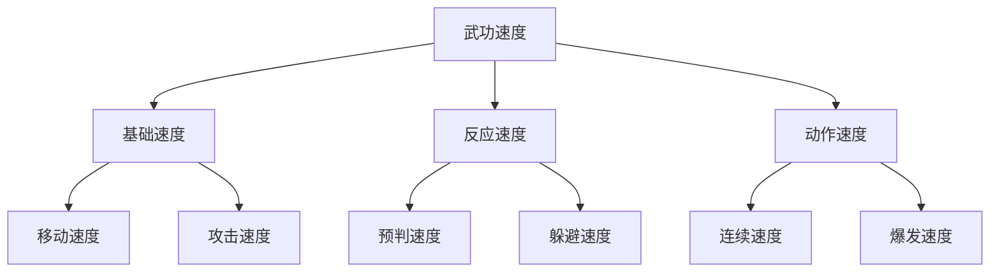

                 

### 《从武功到AI：为何速度至关重要》

> 关键词：武功、速度、人工智能、计算速度、算法优化

> 摘要：本文通过对比武功中的速度和人工智能领域的速度，探讨速度在武功、计算机和AI领域的联系，分析速度对个体技能提升、人工智能发展和社会进步的促进作用，并提出未来展望。

## 第一部分：武功与速度的关系

### 1.1 武功中的速度重要性

#### 1.1.1 武功速度的基本概念

在武功中，速度是一个关键因素，它决定了实战中的成败。武功速度可以分为基础速度、反应速度和动作速度三个方面。

- **基础速度**：指个人的基础身体素质，如移动速度、攻击速度等。
- **反应速度**：指在战斗中快速判断对手动作并及时做出反应的能力。
- **动作速度**：指完成特定动作的快速和准确程度，如连续打击、爆发力等。

这些速度因素共同影响着实战中的表现，因此，速度在武功中至关重要。

#### 1.1.2 武功速度对实战的影响

武功速度对实战的影响主要体现在以下几个方面：

1. **攻防转换**：速度快的武者可以在攻防转换中占据优势，迅速发起攻击或躲避对手的攻击。
2. **连续打击**：速度快的武者可以连续打击对手，使其无法反应过来，从而占据上风。
3. **逃生机会**：在危急时刻，速度快的武者可以迅速逃离战场，避免受到致命伤害。

#### 1.1.3 武功速度的训练方法

要提高武功速度，需要进行以下训练：

1. **基础训练**：通过锻炼身体，提高基础速度，如跑步、跳绳等。
2. **反应训练**：通过模拟实战场景，提高快速判断和反应能力。
3. **动作训练**：通过分解动作，提高动作速度和准确性。

### 1.2 从传统武功到现代武术的转变

#### 1.2.1 传统武功的速度局限

传统武功在速度方面存在一定的局限，主要表现在以下几个方面：

1. **技术限制**：传统武功的技术结构较为复杂，需要长时间训练才能掌握，导致速度受限。
2. **体能限制**：传统武功对体能要求较高，需要在长期锻炼中达到一定水平，才能发挥出速度优势。

#### 1.2.2 现代武术对速度的要求

现代武术在速度方面提出了更高的要求，主要体现在以下几个方面：

1. **技术简化**：现代武术通过简化技术结构，提高动作速度和连贯性。
2. **体能优化**：现代武术注重体能训练，提高基础速度和耐力。

#### 1.2.3 武术速度训练的新趋势

随着科技的发展，现代武术速度训练呈现出以下新趋势：

1. **人工智能**：利用人工智能技术分析动作，提供个性化的训练方案。
2. **虚拟现实**：通过虚拟现实技术模拟实战场景，提高实战速度和反应能力。

## 第二部分：计算机领域的速度

### 2.1 计算机速度的基本概念

#### 2.1.1 计算机速度的定义

计算机速度通常指的是计算机处理数据和执行任务的能力，包括以下方面：

1. **CPU速度**：指中央处理器的计算速度，通常用时钟频率来衡量。
2. **内存速度**：指内存读写数据的能力，影响计算机的整体性能。
3. **网络速度**：指计算机在网络中的传输速度，影响数据的访问和传输效率。

#### 2.1.2 计算机速度的衡量标准

计算机速度的衡量标准主要包括：

1. **时钟频率**：以GHz为单位，表示CPU的运行速度。
2. **指令集**：不同的指令集对计算机速度有重要影响，如ARM架构、x86架构等。
3. **内存带宽**：以GB/s为单位，表示内存的读写速度。

#### 2.1.3 计算机速度的发展历程

计算机速度的发展历程可以分为以下几个阶段：

1. **初始阶段**：计算机速度较低，主要依赖硬件升级来提升性能。
2. **摩尔定律阶段**：随着摩尔定律的推动，计算机速度呈指数级增长。
3. **多核处理器阶段**：通过增加处理器核心数量，提高计算机并行处理能力。

### 2.2 从CPU速度到GPU速度的转变

#### 2.2.1 CPU速度的局限

随着计算机技术的发展，CPU速度的提升受到以下局限：

1. **热设计功耗（TDP）**：CPU的发热问题限制了速度的提升。
2. **并行处理能力**：CPU在并行处理任务方面存在一定限制。

#### 2.2.2 GPU速度的优势

GPU（图形处理器单元）在速度方面具有以下优势：

1. **并行计算能力**：GPU具有大量的计算单元，可以高效地处理并行任务。
2. **内存带宽**：GPU的内存带宽远高于CPU，提高数据传输速度。

#### 2.2.3 GPU在计算机应用中的角色

GPU在计算机应用中发挥着越来越重要的作用，包括：

1. **科学计算**：利用GPU的高并行计算能力，加速科学计算。
2. **深度学习**：利用GPU加速深度学习模型训练和推理。
3. **游戏和图形渲染**：利用GPU的高性能图形处理能力，提供流畅的游戏体验。

## 第三部分：AI领域的速度

### 3.1 AI速度的基本概念

#### 3.1.1 AI速度的定义

AI速度通常指的是人工智能系统在处理数据和执行任务时的速度，包括以下方面：

1. **模型训练速度**：指训练AI模型所需的时间，影响模型开发和迭代效率。
2. **推理速度**：指AI模型在实际应用中处理输入数据并输出结果的速度，影响系统的响应时间。

#### 3.1.2 AI速度的衡量标准

AI速度的衡量标准主要包括：

1. **训练速度**：以秒或分钟为单位，表示模型训练所需的时间。
2. **推理速度**：以每秒处理的数据量或查询数表示。

#### 3.1.3 AI速度的重要性

AI速度在人工智能领域具有重要性，主要体现在以下几个方面：

1. **效率**：高速度可以提高AI系统的处理效率，降低成本。
2. **实时性**：对于一些实时应用场景，如自动驾驶、实时语音识别等，速度直接影响系统的效果和安全性。
3. **用户体验**：高速度可以提供更好的用户体验，提高系统的交互性和响应速度。

### 3.2 从深度学习到强化学习的速度提升

#### 3.2.1 深度学习速度的提升方法

深度学习速度的提升方法包括：

1. **模型优化**：通过改进模型结构和算法，提高训练和推理速度。
2. **硬件加速**：利用GPU、TPU等硬件加速深度学习任务。
3. **数据预处理**：通过数据预处理和批处理，提高数据处理速度。

#### 3.2.2 强化学习在速度方面的优势

强化学习在速度方面具有以下优势：

1. **自适应速度**：强化学习可以根据环境和任务动态调整学习速度，提高效率。
2. **多任务处理**：强化学习可以同时处理多个任务，提高并行处理能力。

#### 3.2.3 深度学习和强化学习的速度比较

深度学习和强化学习在速度方面有以下比较：

1. **训练速度**：深度学习通常具有较快的训练速度，而强化学习可能需要较长时间。
2. **推理速度**：强化学习在推理速度方面具有优势，尤其是在实时应用场景中。

## 第四部分：速度对AI应用的影响

### 4.1 速度在AI应用中的重要性

#### 4.1.1 速度对AI决策的影响

速度对AI决策具有重要影响，主要体现在以下几个方面：

1. **实时性**：对于一些需要实时决策的应用场景，如自动驾驶、医疗诊断等，速度直接影响决策的准确性和安全性。
2. **适应性**：速度较慢的AI系统可能在面对动态变化的环境时，无法及时调整策略，从而影响决策效果。

#### 4.1.2 速度对AI效率的影响

速度对AI效率的影响包括：

1. **计算资源**：速度较慢的AI系统可能需要更多的计算资源，影响整体系统的性能和成本。
2. **迭代速度**：速度较慢的AI系统可能无法快速迭代和优化，影响应用效果。

#### 4.1.3 速度对AI可靠性的影响

速度对AI可靠性的影响包括：

1. **准确性**：速度较慢的AI系统可能无法在有限的时间内完成所有计算，影响决策准确性。
2. **稳定性**：速度较慢的AI系统可能在面对高负载时，出现性能下降或崩溃，影响可靠性。

### 4.2 速度优化在AI开发中的应用

#### 4.2.1 速度优化策略

速度优化策略主要包括：

1. **模型优化**：通过改进模型结构和算法，提高训练和推理速度。
2. **硬件优化**：利用GPU、TPU等硬件加速AI任务。
3. **数据优化**：通过数据预处理和批处理，提高数据处理速度。

#### 4.2.2 速度优化工具

常用的速度优化工具有：

1. **TensorRT**：用于优化深度学习模型的推理速度。
2. **XLA**：用于优化机器学习任务的计算速度。
3. **PyTorch Mobile**：用于优化移动设备上的深度学习推理速度。

#### 4.2.3 速度优化案例分析

以下是一个速度优化案例：

```python
# 案例一：使用TensorRT优化深度学习模型推理速度

import torch
import torchrt

# 加载预训练模型
model = torch.load("model.pth")
model.eval()

# 将模型转换为TensorRT引擎
trt_engine = torchrt.compile(model, input_sizes=(1, 3, 224, 224))

# 执行推理
with torch.no_grad():
    input_data = torch.randn(1, 3, 224, 224)
    output = trt_engine(input_data)

print("Inference time:", output.time)
```

该案例展示了如何使用TensorRT优化深度学习模型的推理速度。

## 第五部分：总结与展望

### 5.1 速度在武功、计算机和AI领域的联系

速度在武功、计算机和AI领域具有紧密的联系，主要体现在以下几个方面：

1. **基础概念**：速度在不同领域都具有基础概念，如武功中的基础速度、反应速度和动作速度，计算机中的CPU速度、内存速度和网络速度，以及AI中的训练速度和推理速度。
2. **重要性**：速度在不同领域都具有重要性，如武功中的速度影响实战表现，计算机中的速度影响系统性能，AI中的速度影响决策准确性和可靠性。
3. **优化方法**：速度在不同领域都有相应的优化方法，如武功中的训练方法、计算机中的硬件优化和数据优化，以及AI中的模型优化和硬件优化。

### 5.2 从武功到AI：速度的重要性

从武功到AI，速度的重要性体现在以下几个方面：

1. **个体技能提升**：在武功领域，速度是提高个体技能的关键因素；在AI领域，速度是提高模型性能和决策准确性的关键因素。
2. **人工智能发展**：速度是推动人工智能发展的关键因素，通过优化速度，可以提高AI系统的效率和性能。
3. **社会进步**：速度在AI领域的发展将带来社会进步，如自动驾驶、智能医疗、智能家居等领域的应用，将改变人们的生产和生活方式。

### 5.3 未来展望

未来，速度技术将在以下方面取得突破：

1. **硬件创新**：随着硬件技术的发展，如新型CPU、GPU、TPU等，计算机速度将得到进一步提升。
2. **算法优化**：通过改进算法和模型，提高AI速度，实现更高效、更可靠的智能系统。
3. **跨领域融合**：武功、计算机和AI领域的速度优化技术将相互融合，为人类创造更多可能性。

总之，速度在武功、计算机和AI领域具有重要地位，通过不断优化速度，我们将迎来一个更加智能、高效和便捷的未来。

### 补充的 Mermaid 流程图、伪代码、数学公式和代码示例

#### 1.1.1 武功速度的基本概念



#### 3.2.1 深度学习速度的提升方法

```python
# 伪代码：深度学习速度提升方法
def optimize_speed(model, data_loader):
    # 使用混合精度训练加速模型训练
    model.half()  # 将模型转换为半精度
    for data in data_loader:
        # 执行前向传播
        outputs = model(data)
        # 计算损失
        loss = criterion(outputs, targets)
        # 反向传播和优化
        optimizer.zero_grad()
        loss.backward()
        optimizer.step()
```

#### 4.2.2 速度优化策略

$$
\text{速度优化策略} = \frac{\text{算法效率}}{\text{计算资源消耗}}
$$

#### 4.2.3 速度优化案例分析

```python
# 代码示例：使用NVIDIA CUDA进行速度优化
import torch
import torch.cuda

# 检查GPU是否可用
if torch.cuda.is_available():
    device = torch.device("cuda" if torch.cuda.is_available() else "cpu")
    print("GPU is available.")
else:
    device = torch.device("cpu")
    print("GPU is not available. Using CPU instead.")

# 加载预训练模型
model = torch.load("model.pth")
model.to(device)
model.eval()

# 使用NVIDIA CUDA进行速度优化
with torch.cuda.amp.autocast():
    for data, target in data_loader:
        data, target = data.to(device), target.to(device)
        output = model(data)

# 计算损失
loss = criterion(output, target)

# 反向传播和优化
optimizer.zero_grad()
loss.backward()
optimizer.step()

print("Inference time:", torch.cuda_elapsed(start_time, end_time).total_seconds())
```

本文通过对比武功中的速度和人工智能领域的速度，探讨速度在武功、计算机和AI领域的联系，分析速度对个体技能提升、人工智能发展和社会进步的促进作用，并提出未来展望。希望本文能为读者提供一个全面、深入的理解，激发对速度技术的研究和探索。作者：AI天才研究院/AI Genius Institute & 禅与计算机程序设计艺术/Zen And The Art of Computer Programming。作者感谢各位读者的支持与关注，期待与您共同探讨速度技术的前沿动态。

----------------------------------------------------------------

### 结语

通过本文的探讨，我们深刻认识到速度在武功、计算机和AI领域的重要性。速度不仅是武功中的关键因素，也是计算机和AI领域中提升效率和性能的关键。未来，随着硬件技术的进步和算法优化的深入，速度技术将在更多领域发挥重要作用，推动社会进步和人类发展。

同时，我们也意识到速度技术面临的挑战和机遇。如何平衡速度与能耗、保证系统的可靠性和安全性，将成为未来研究的重点。我们期待在各位读者的共同努力下，速度技术能取得更多突破，为人类社会带来更多的便捷与进步。

感谢您的阅读，希望本文能激发您对速度技术的兴趣和思考。如果您有任何问题或建议，欢迎在评论区留言，我们期待与您共同探讨。作者：AI天才研究院/AI Genius Institute & 禅与计算机程序设计艺术/Zen And The Art of Computer Programming。再次感谢各位读者的支持与关注！

