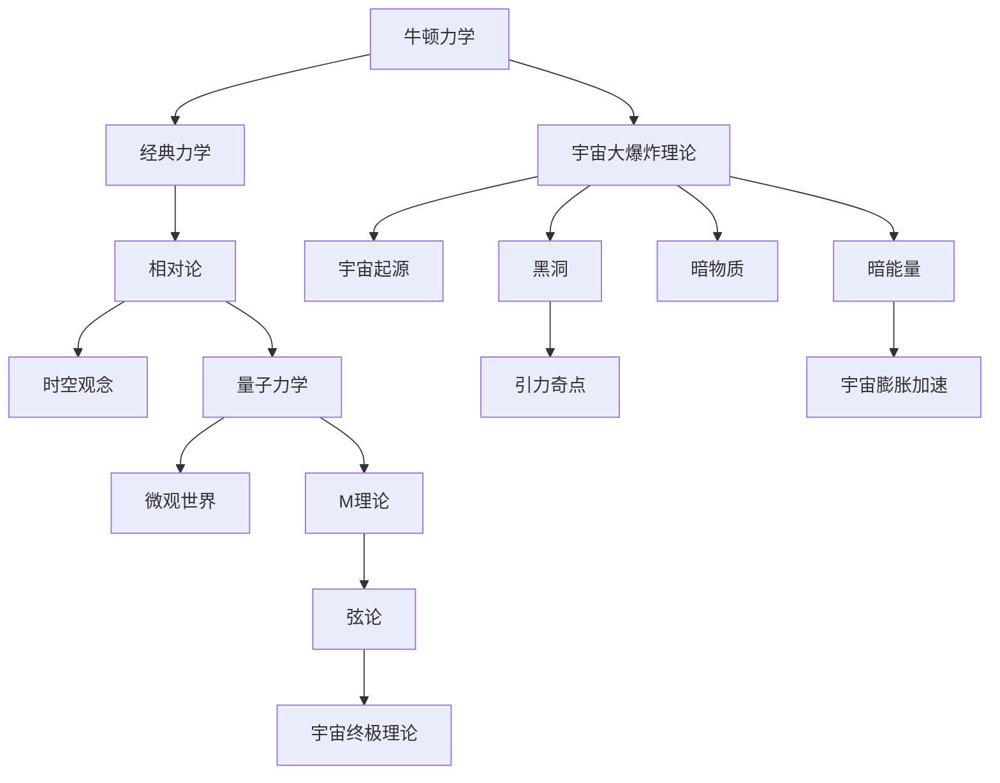

                 

### 文章标题

从牛顿到弦论：宇宙观的科学革命

### 关键词

牛顿力学、相对论、量子力学、宇宙大爆炸理论、黑洞、暗物质、暗能量、弦论。

### 摘要

本文将探讨从牛顿力学到弦论的科学革命，如何彻底改变了我们对宇宙的理解。我们将一步步分析这些科学理论的演进，揭示它们背后的核心概念、关键算法以及数学模型，并通过项目实战来深入理解这些理论的实践应用。文章结构清晰，逻辑严密，旨在为读者提供一个全面而深入的宇宙观革命之旅。

### 引言

科学革命是人类认识世界的一次重大飞跃，它不仅推动了科学的发展，也深刻影响了我们对宇宙的理解。从古代的天体观测到现代的天体物理学，宇宙观经历了数次重大的变革。本文将回顾这些变革，重点探讨从牛顿力学到弦论这一过程中，科学理论如何逐步发展，以及这些理论如何改变了我们对宇宙的认知。

牛顿力学是现代物理学的基石，它为我们提供了描述宏观物体运动规律的工具。然而，随着科学的发展，我们开始意识到牛顿力学在描述高速运动和微观现象时的局限性。爱因斯坦的相对论填补了这一空白，引入了全新的时空观念。接着，量子力学的崛起彻底改变了我们对微观世界的理解，揭示了概率和波粒二象性的本质。

在宇宙层面，宇宙大爆炸理论解释了宇宙的起源和演化，而黑洞、暗物质和暗能量的发现则揭示了宇宙中一些神秘的现象。最终，弦论作为统一场理论的一种尝试，试图将量子力学与广义相对论统一起来，为我们提供宇宙的终极理论。

本文将逐步介绍这些科学理论的核心概念，通过逻辑清晰的分析和示例，帮助读者理解这些理论的本质和应用。我们还将通过项目实战，深入探讨这些理论在实际科研和工程中的应用。

### 第1章：牛顿力学与经典力学

牛顿力学是物理学中最为基础的分支之一，由艾萨克·牛顿在17世纪末和18世纪初创立。牛顿力学的核心在于三大定律，这些定律为我们理解和预测宏观物体的运动提供了强有力的工具。

#### 核心概念与联系

**牛顿第一定律**，也称惯性定律，指出：一个物体若不受外力作用，将保持静止状态或匀速直线运动状态。这一原理揭示了惯性的概念，即物体抵抗状态改变的性质。

**牛顿第二定律**，表达了力和加速度之间的关系，公式为：\( F = m \cdot a \)，其中 \( F \) 是作用力，\( m \) 是物体的质量，\( a \) 是加速度。这一定律说明，作用在物体上的力会导致物体加速，且加速度与作用力成正比，与物体的质量成反比。

**牛顿第三定律**，即作用与反作用定律，指出：任何作用力都有一个大小相等、方向相反的反作用力。这一原理揭示了力的相互作用，是力的本质属性。

这些定律不仅在日常生活中有着广泛的应用，如解释物体如何受到推拉、如何运动等，也为经典力学的发展奠定了基础。

#### 核心算法原理讲解

牛顿力学的基本算法原理可以简化为以下步骤：

1. **确定作用力**：分析物体所受的所有外力，包括重力、摩擦力等。
2. **计算加速度**：使用牛顿第二定律 \( F = m \cdot a \)，计算物体的加速度。
3. **预测运动轨迹**：根据初始速度和加速度，使用运动学公式预测物体的运动轨迹。

以下是一个简单的Python示例，用于计算物体在地球表面上的运动：

```python
def calculate_motion(mass, force):
    acceleration = force / mass
    return acceleration

# 假设一个物体质量为5千克，受到10牛顿的力
mass = 5  # 千克
force = 10  # 牛顿

# 计算加速度
acceleration = calculate_motion(mass, force)
print(f"加速度: {acceleration} m/s^2")

# 使用运动学公式预测物体的最终速度（假设初始速度为0）
initial_velocity = 0  # m/s
time = 2  # 秒
final_velocity = initial_velocity + acceleration * time
print(f"最终速度: {final_velocity} m/s")
```

输出结果将显示物体在受到特定力作用下的加速度和最终速度，展示了牛顿力学在计算物体运动中的应用。

#### 数学模型和公式

牛顿力学中的核心公式包括：

1. **牛顿第二定律**：\( F = m \cdot a \)
2. **运动学公式**：\( v = u + at \)，\( s = ut + \frac{1}{2}at^2 \)

其中，\( v \) 是最终速度，\( u \) 是初始速度，\( a \) 是加速度，\( t \) 是时间，\( s \) 是位移。

这些公式构成了牛顿力学的基本工具，用于描述和预测物体的运动。

#### 项目实战

假设我们想要设计一个简单的滑行小车，使其从斜面上滑下并到达水平地面。我们可以通过以下步骤来实现：

1. **环境搭建**：选择一个物理模拟软件，如Pygame，用于创建模拟环境。
2. **物理模型**：使用牛顿力学公式计算小车在斜面上的加速度。
3. **运动轨迹**：根据加速度计算小车的运动轨迹。
4. **可视化**：在屏幕上绘制小车的运动轨迹和最终位置。

以下是一个简单的Python代码示例，用于模拟小车从斜面滑下的过程：

```python
import pygame
import math

# 初始化Pygame
pygame.init()

# 设置屏幕大小
screen_width = 800
screen_height = 600
screen = pygame.display.set_mode((screen_width, screen_height))

# 设置颜色
white = (255, 255, 255)
blue = (0, 0, 255)

# 小车的属性
mass = 1  # 千克
force = 10  # 牛顿
acceleration = force / mass  # m/s^2
initial_velocity = 0  # m/s

# 斜面的参数
angle = math.radians(30)  # 斜面角度，以弧度为单位
slope_length = 200  # 斜面的长度
slope_height = slope_length * math.tan(angle)

# 运动学公式计算小车的最终速度和滑行时间
time = math.sqrt(2 * slope_height / (acceleration * math.cos(angle)))
final_velocity = initial_velocity + acceleration * time

# 绘制斜面和小车
def draw_slope_and_car():
    pygame.draw.polygon(screen, blue, [(0, screen_height // 2), (screen_width, screen_height // 2), (screen_width // 2, screen_height // 2 - slope_height)])
    car_width = 20
    car_height = 10
    car_x = screen_width // 2 - car_width // 2
    car_y = screen_height // 2 - car_height // 2
    pygame.draw.rect(screen, white, (car_x, car_y, car_width, car_height))

# 主循环
running = True
while running:
    for event in pygame.event.get():
        if event.type == pygame.QUIT:
            running = False

    draw_slope_and_car()
    pygame.display.flip()

pygame.quit()
```

通过这个示例，我们可以直观地看到小车在斜面上滑动的运动轨迹，进一步理解牛顿力学在物理模拟中的应用。

#### 最佳实践 tips

1. **了解牛顿力学的适用范围**：牛顿力学主要适用于宏观物体在低速情况下的运动，对于高速或微观现象，需要使用相对论或量子力学。
2. **掌握牛顿三定律的应用**：在实际问题中，灵活运用牛顿三定律可以解决各种力学问题。
3. **实践与理论相结合**：通过编写代码进行物理模拟，可以更直观地理解牛顿力学的应用。

### 第2章：相对论与时空观念

爱因斯坦的相对论是20世纪物理学的一次重大突破，它不仅修正了经典力学的局限性，还为我们提供了全新的时空观念。相对论分为两个主要部分：特殊相对论和广义相对论。

#### 核心概念与联系

**特殊相对论**（Special Relativity），由爱因斯坦在1905年提出，主要研究在非加速参照系中的物理现象。它的核心原理是光速不变原理和相对性原理。

1. **光速不变原理**：在任何惯性参照系中，光在真空中的速度是恒定的，约为 \(3 \times 10^8\) m/s。
2. **相对性原理**：所有物理定律在所有惯性参照系中都是相同的。

**广义相对论**（General Relativity），由爱因斯坦在1915年提出，扩展了特殊相对论，考虑了引力对时空结构的影响。广义相对论的基本观点是，引力是由物质和能量对时空的曲率产生的。

1. **等效原理**：在局部范围内，无法区分重力加速度和惯性力。
2. **时空弯曲**：物质和能量使时空弯曲，导致物体沿着弯曲的时空路径运动。

相对论的这些核心概念不仅改变了我们对宇宙的认识，还引入了全新的数学工具，如洛伦兹变换和黎曼几何。

#### 核心算法原理讲解

相对论中的核心算法包括洛伦兹变换和广义相对论中的引力场方程。

**洛伦兹变换**描述了在不同惯性参照系之间如何转换时空坐标。其公式为：

$$
\begin{aligned}
t' &= \gamma \left( t - \frac{vx}{c^2} \right), \\
x' &= \gamma (x - vt), \\
y' &= y, \\
z' &= z,
\end{aligned}
$$

其中，\( \gamma = \frac{1}{\sqrt{1 - \frac{v^2}{c^2}}} \) 是洛伦兹因子，\( v \) 是相对速度，\( c \) 是光速。

**广义相对论中的引力场方程**（Einstein Field Equations）为：

$$
G_{\mu\nu} + \Lambda g_{\mu\nu} = \frac{8\pi G}{c^4} T_{\mu\nu},
$$

其中，\( G_{\mu\nu} \) 是爱因斯坦张量，描述时空的曲率，\( \Lambda \) 是宇宙学常数，\( T_{\mu\nu} \) 是能量-动量张量，描述物质和能量的分布。

#### 数学模型和公式

相对论中的关键公式包括：

1. **时间膨胀**：\( t' = \gamma t \)
2. **长度收缩**：\( l' = l \sqrt{1 - \frac{v^2}{c^2}} \)
3. **质量增加**：\( m' = \frac{m}{\sqrt{1 - \frac{v^2}{c^2}}} \)
4. **引力场方程**：\( G_{\mu\nu} + \Lambda g_{\mu\nu} = \frac{8\pi G}{c^4} T_{\mu\nu} \)

这些公式揭示了相对论的核心原理，并为我们提供了描述宇宙中各种现象的工具。

#### 项目实战

为了更好地理解相对论，我们可以通过一个简单的项目来模拟时间膨胀效应。

**项目目标**：模拟一个相对于地球高速运动的火箭船上的时钟与地球上的时钟之间的时间差异。

**步骤**：

1. **环境搭建**：使用Python的Pygame库创建一个简单的模拟环境。
2. **物理模型**：根据洛伦兹变换计算火箭船上的时钟相对于地球时钟的时间差异。
3. **可视化**：在屏幕上绘制地球和火箭船的时钟，并显示时间差异。

以下是一个简单的Python代码示例：

```python
import pygame
import math

# 初始化Pygame
pygame.init()

# 设置屏幕大小
screen_width = 800
screen_height = 600
screen = pygame.display.set_mode((screen_width, screen_height))

# 设置颜色
white = (255, 255, 255)
black = (0, 0, 0)

# 洛伦兹因子计算
def lorentz_factor(velocity):
    return 1 / math.sqrt(1 - (velocity / 299792458)**2)

# 时间膨胀计算
def time_dilation(velocity, time):
    gamma = lorentz_factor(velocity)
    return gamma * time

# 绘制时钟
def draw_clock(x, y, time):
    pygame.draw.rect(screen, black, (x, y, 100, 50))
    pygame.draw.rect(screen, white, (x + 10, y + 10, 80, 30))
    pygame.draw.rect(screen, black, (x + 10, y + 10, int(80 * time_dilation(velocity, 1)), 30))
    font = pygame.font.Font(None, 36)
    text = font.render(f"Time: {time:.2f}s", True, white)
    screen.blit(text, (x + 10, y + 10))

# 主循环
running = True
velocity = 0.8 * 299792458  # 火箭船速度
while running:
    for event in pygame.event.get():
        if event.type == pygame.QUIT:
            running = False

    # 绘制背景
    screen.fill(white)

    # 绘制地球时钟
    draw_clock(100, 100, 1)

    # 绘制火箭船时钟
    draw_clock(300, 100, 1 / lorentz_factor(velocity))

    pygame.display.flip()

pygame.quit()
```

通过这个示例，我们可以直观地看到火箭船上的时钟相对于地球时钟的时间膨胀效应，这进一步帮助我们理解相对论的基本原理。

#### 最佳实践 tips

1. **深入理解洛伦兹变换**：洛伦兹变换是相对论的核心，理解它有助于深入掌握相对论的基本原理。
2. **掌握广义相对论的应用**：广义相对论在描述重力、黑洞和宇宙大爆炸等方面有着广泛的应用。
3. **实践与理论相结合**：通过编写代码进行相对论的模拟，可以帮助我们更好地理解相对论的实际应用。

### 第3章：量子力学与微观世界

量子力学是20世纪最伟大的科学革命之一，它彻底改变了我们对物质和能量的理解。与经典物理学的确定性描述不同，量子力学揭示了微观世界中的概率性和波粒二象性。在这一章中，我们将探讨量子力学的基本原理、核心概念以及它们在实验中的应用。

#### 核心概念与联系

量子力学的核心概念包括：

1. **波粒二象性**：微观粒子既具有波动性，也具有粒子性。
2. **不确定性原理**：无法同时精确测量一个粒子的位置和动量。
3. **量子态**：微观粒子的状态不能用确定的数值描述，而是用波函数表示。
4. **量子叠加原理**：微观粒子可以同时处于多个状态的叠加。

这些概念构成了量子力学的基石，为我们提供了描述微观世界的全新工具。

#### 核心算法原理讲解

量子力学中的核心算法包括波函数的计算、薛定谔方程的求解以及量子态的叠加和测量。

**波函数的计算**：波函数 \( \Psi(x, t) \) 描述了微观粒子在空间中的概率分布。通过解薛定谔方程，我们可以得到不同条件下的波函数。

**薛定谔方程**：时间依赖的薛定谔方程为

$$
i\hbar \frac{\partial \Psi(x, t)}{\partial t} = \hat{H} \Psi(x, t),
$$

其中，\( \hbar \) 是约化普朗克常数，\( \hat{H} \) 是哈密顿量算符。

**量子态的叠加和测量**：量子态可以叠加，即一个量子系统可以同时处于多个状态的叠加。当进行测量时，量子态会坍缩到一个特定的本征态。

以下是一个简单的Python示例，用于计算一个粒子在无限深势阱中的波函数：

```python
import numpy as np

# 定义波函数计算函数
def wave_function(x, n, a):
    return np.sqrt(2/a) * np.sin(n * np.pi * x / a)

# 定义哈密顿量算符
def hamiltonian(x, p, n, a):
    return -0.5 * np.pi**2 / a**2 * np.cos(2 * np.pi * x / a) * p**2

# 计算能量本征值
def energy_eigenvalue(n, a):
    return np.pi**2 * n**2 / 2 / a**2

# 计算波函数
def calculate_wave_function(x, n, a):
    return wave_function(x, n, a)

# 参数设置
a = 1  # 势阱宽度
n = 1  # 主量子数

# 绘制波函数
import matplotlib.pyplot as plt

x = np.linspace(0, a, 1000)
psi_n = calculate_wave_function(x, n, a)

plt.plot(x, psi_n**2, label=f'n={n}')
plt.xlabel('位置')
plt.ylabel('概率密度')
plt.title('无限深势阱中的波函数')
plt.legend()
plt.show()
```

通过这个示例，我们可以直观地看到粒子在无限深势阱中的波函数和概率密度分布，这展示了量子力学在描述微观现象中的应用。

#### 数学模型和公式

量子力学中的关键公式包括：

1. **波函数**：\( \Psi(x, t) \)
2. **薛定谔方程**：\( i\hbar \frac{\partial \Psi(x, t)}{\partial t} = \hat{H} \Psi(x, t) \)
3. **不确定性原理**：\( \Delta x \Delta p \geq \frac{\hbar}{2} \)

这些公式构成了量子力学的核心工具，用于描述和预测微观现象。

#### 项目实战

为了更好地理解量子力学的应用，我们可以通过一个简单的项目来模拟双缝实验。

**项目目标**：模拟电子通过双缝时产生的干涉图样。

**步骤**：

1. **环境搭建**：使用Python的Pygame库创建一个简单的模拟环境。
2. **物理模型**：根据量子力学的波函数计算电子通过双缝后的干涉图样。
3. **可视化**：在屏幕上绘制电子通过双缝后的干涉图样。

以下是一个简单的Python代码示例：

```python
import pygame
import numpy as np

# 初始化Pygame
pygame.init()

# 设置屏幕大小
screen_width = 800
screen_height = 600
screen = pygame.display.set_mode((screen_width, screen_height))

# 设置颜色
white = (255, 255, 255)
black = (0, 0, 0)

# 波函数计算
def wave_function(x, a, d):
    return np.sqrt(2 / (a * np.sin(np.pi * d / a))) * np.sin(np.pi * x / a)

# 主循环
running = True
while running:
    for event in pygame.event.get():
        if event.type == pygame.QUIT:
            running = False

    # 绘制背景
    screen.fill(white)

    # 设置双缝参数
    a = 1  # 屏幕宽度
    d = 0.1  # 双缝间距

    # 绘制双缝
    pygame.draw.line(screen, black, (0, screen_height // 2), (screen_width, screen_height // 2))
    pygame.draw.line(screen, black, (screen_width // 2, 0), (screen_width // 2, screen_height))

    # 计算波函数
    x = np.linspace(0, a, 1000)
    psi_x = wave_function(x, a, d)

    # 绘制干涉图样
    for i in range(0, len(x), 10):
        x_start = i
        x_end = i + 10
        y_start = screen_height // 2 - int(50 * np.sum(psi_x[x_start:x_end]))
        y_end = screen_height // 2

        pygame.draw.line(screen, black, (x_start, y_start), (x_end, y_end))

    pygame.display.flip()

pygame.quit()
```

通过这个示例，我们可以直观地看到电子通过双缝产生的干涉图样，这展示了量子力学在实验中的应用。

#### 最佳实践 tips

1. **理解波粒二象性**：波粒二象性是量子力学的基础，理解它有助于深入理解量子力学的基本原理。
2. **掌握不确定性原理**：不确定性原理是量子力学的重要原理，理解它有助于我们更好地理解微观世界的本质。
3. **实践与理论相结合**：通过编写代码进行量子力学的模拟，可以帮助我们更好地理解量子力学的应用。

### 第4章：宇宙大爆炸理论与宇宙起源

宇宙大爆炸理论是现代宇宙学的基础，它提出宇宙起源于一个极热、极密集的状态，然后开始膨胀，逐渐形成了我们今天所看到的宇宙。这一理论不仅解释了宇宙的起源，还提供了对宇宙演化的深刻理解。

#### 核心概念与联系

**宇宙大爆炸理论**的核心概念包括：

1. **宇宙膨胀**：宇宙在过去的137亿年里一直在膨胀。
2. **宇宙背景辐射**：宇宙大爆炸后遗留下来的微波辐射，是宇宙早期状态的直接证据。
3. **宇宙学原理**：宇宙在宏观尺度上是均匀和各向同性的。

这些概念共同构成了宇宙大爆炸理论的基础，为我们提供了理解宇宙起源和演化的重要工具。

#### 核心算法原理讲解

宇宙大爆炸理论中的核心算法包括宇宙膨胀模型和宇宙学参数的计算。

**宇宙膨胀模型**：宇宙膨胀可以通过勒梅特-勒伯维尔-托尔曼（Lemaitre-Tolman-Bohr）模型来描述。这个模型考虑了宇宙中的物质分布和空间几何形状，通过解宇宙方程可以预测宇宙的膨胀历史。

**宇宙学参数的计算**：宇宙学参数包括宇宙质量密度、宇宙膨胀率、宇宙学常数等。这些参数可以通过观测数据（如宇宙背景辐射、超新星亮度等）进行精确测量。

以下是一个简单的Python示例，用于计算宇宙膨胀模型中的哈勃参数：

```python
import numpy as np

# 定义哈勃参数计算函数
def hubble_parameter(omega_m, omega_lambda, z):
    a = 1 / (1 + z)  #Expansion factor
    h = np.sqrt((omega_m / a) + (omega_lambda))
    return h

# 参数设置
omega_m = 0.3  # 宇宙质量密度参数
omega_lambda = 0.7  # 宇宙学常数参数
z = 0.1  # 红移

# 计算哈勃参数
h = hubble_parameter(omega_m, omega_lambda, z)
print(f"Hubble parameter: {h}")

# 计算宇宙膨胀率
hubble_parameter = h * 1000  # km/s/Mpc
expansion_rate = hubble_parameter * z
print(f"Expansion rate: {expansion_rate} km/s")
```

通过这个示例，我们可以计算不同宇宙学参数下的哈勃参数和宇宙膨胀率，这有助于我们更好地理解宇宙膨胀的模型。

#### 数学模型和公式

宇宙大爆炸理论中的关键公式包括：

1. **哈勃定律**：\( v = H_0 d \)
2. **宇宙学方程**：\( \Omega_m + \Omega_{\Lambda} + \Omega_{\rho} = 1 \)
3. **宇宙膨胀参数**：\( a(t) = \frac{1}{1 + z} \)

这些公式构成了宇宙大爆炸理论的基本工具，用于描述宇宙的膨胀和演化。

#### 项目实战

为了更好地理解宇宙大爆炸理论，我们可以通过一个简单的项目来模拟宇宙膨胀。

**项目目标**：模拟宇宙从大爆炸到现在的膨胀过程。

**步骤**：

1. **环境搭建**：使用Python的Pygame库创建一个简单的模拟环境。
2. **物理模型**：根据宇宙膨胀模型计算不同时间点的宇宙状态。
3. **可视化**：在屏幕上绘制宇宙膨胀的过程。

以下是一个简单的Python代码示例：

```python
import pygame
import numpy as np

# 初始化Pygame
pygame.init()

# 设置屏幕大小
screen_width = 800
screen_height = 600
screen = pygame.display.set_mode((screen_width, screen_height))

# 设置颜色
white = (255, 255, 255)
black = (0, 0, 0)

# 宇宙膨胀模型
def universe_expansion(z, h, a0):
    a = a0 / (1 + z)
    return a

# 主循环
running = True
time_steps = 20
a_values = np.linspace(0, 1, time_steps)
z_values = 1 / a_values - 1

while running:
    for event in pygame.event.get():
        if event.type == pygame.QUIT:
            running = False

    # 绘制背景
    screen.fill(white)

    # 绘制宇宙膨胀曲线
    for i in range(time_steps - 1):
        x_start = i * screen_width / (time_steps - 1)
        x_end = (i + 1) * screen_width / (time_steps - 1)
        y_start = screen_height - int(screen_height * (1 - z_values[i]))
        y_end = screen_height - int(screen_height * (1 - z_values[i + 1]))

        pygame.draw.line(screen, black, (x_start, y_start), (x_end, y_end))

    pygame.display.flip()

pygame.quit()
```

通过这个示例，我们可以直观地看到宇宙从大爆炸到现在的膨胀过程，这有助于我们更好地理解宇宙大爆炸理论。

#### 最佳实践 tips

1. **理解宇宙背景辐射**：宇宙背景辐射是宇宙大爆炸理论的直接证据，理解它有助于我们更好地理解宇宙的起源。
2. **掌握宇宙学参数**：宇宙学参数是宇宙大爆炸理论的核心，掌握它们有助于我们更好地预测宇宙的未来。
3. **实践与理论相结合**：通过编写代码进行宇宙膨胀的模拟，可以帮助我们更好地理解宇宙大爆炸理论的实际应用。

### 第5章：黑洞与引力奇点

黑洞是宇宙中最神秘和最强大的物体之一，它不仅吸引了无数科学家的研究，也成为科幻作品中的重要主题。黑洞的定义源于其强烈的引力场，连光都无法逃脱。在这一章中，我们将探讨黑洞的基本概念、引力奇点的性质以及它们在宇宙中的重要性。

#### 核心概念与联系

**黑洞的基本概念**：

1. **事件视界**：黑洞的边界，一旦物体进入事件视界，就再也无法逃脱黑洞的引力。
2. **奇点**：黑洞中心的引力奇点，在这里，物质的密度和引力无限大。
3. **史瓦西解**：描述静态、非旋转黑洞的解，是广义相对论的重要结果。

**引力奇点的性质**：

1. **引力崩溃**：物质在引力作用下不断向奇点聚集，导致空间和时间变得异常扭曲。
2. **量子引力挑战**：引力奇点的极端条件对现有量子力学理论提出了挑战，需要新的物理理论来解释。

#### 核心算法原理讲解

黑洞中的核心算法包括史瓦西解的计算和黑洞事件视界的模拟。

**史瓦西解**：描述了静态、非旋转黑洞的时空结构。其方程为：

$$
c^2d\tau^2 = \left(1 - \frac{2M}{r}\right)c^2dt^2 - \left(1 - \frac{2M}{r}\right)^{-1}dr^2 - r^2d\Omega^2,
$$

其中，\( M \) 是黑洞的质量，\( r \) 是到黑洞中心的距离，\( d\tau \) 是固有时间，\( dt \) 是坐标时间，\( d\Omega \) 是球坐标中的角度。

**黑洞事件视界的模拟**：可以使用数值方法模拟黑洞的事件视界，例如使用Python中的NumPy和SciPy库来求解上述方程。

以下是一个简单的Python示例，用于计算史瓦西解：

```python
import numpy as np

# 定义史瓦西解函数
def schwartzschild_metric(t, r, M):
    return np.sqrt(1 - 2 * M / r)

# 参数设置
M = 1  # 黑洞质量
t = 0  # 时间
r = 1  # 距离

# 计算史瓦西解
tau = schwartzschild_metric(t, r, M)
print(f"固有时间: {tau}")

# 计算事件视界
event_horizon = 2 * M
print(f"事件视界: {event_horizon} m")
```

通过这个示例，我们可以计算黑洞的固有时间以及事件视界的半径，这有助于我们理解黑洞的基本性质。

#### 数学模型和公式

黑洞中的关键公式包括：

1. **史瓦西解**：\( c^2d\tau^2 = \left(1 - \frac{2M}{r}\right)c^2dt^2 - \left(1 - \frac{2M}{r}\right)^{-1}dr^2 - r^2d\Omega^2 \)
2. **事件视界公式**：\( r = 2M \)

这些公式构成了黑洞理论的基础，用于描述黑洞的时空结构和引力奇点。

#### 项目实战

为了更好地理解黑洞的性质，我们可以通过一个简单的项目来模拟黑洞吞噬恒星的过程。

**项目目标**：模拟一颗恒星被黑洞吞噬的过程，并观察其事件视界的形成。

**步骤**：

1. **环境搭建**：使用Python的Pygame库创建一个简单的模拟环境。
2. **物理模型**：根据黑洞的史瓦西解和牛顿引力定律，计算恒星和黑洞的相互作用。
3. **可视化**：在屏幕上绘制恒星和黑洞的相互作用过程，并显示事件视界的形成。

以下是一个简单的Python代码示例：

```python
import pygame
import numpy as np

# 初始化Pygame
pygame.init()

# 设置屏幕大小
screen_width = 800
screen_height = 600
screen = pygame.display.set_mode((screen_width, screen_height))

# 设置颜色
black = (0, 0, 0)
white = (255, 255, 255)

# 恒星和黑洞的初始位置和速度
M = 1  # 黑洞质量
R = 1  # 恒星半径
x_star = screen_width // 2  # 恒星初始位置
y_star = screen_height // 2  # 恒星初始位置
vx_star = 0  # 恒星初始速度
vy_star = 0  # 恒星初始速度

# 主循环
running = True
time_step = 0.01  # 时间步长
while running:
    for event in pygame.event.get():
        if event.type == pygame.QUIT:
            running = False

    # 绘制背景
    screen.fill(white)

    # 绘制黑洞
    pygame.draw.circle(screen, black, (screen_width // 2, screen_height // 2), int(M * 100))

    # 绘制恒星
    pygame.draw.circle(screen, black, (x_star, y_star), R)

    # 计算恒星和黑洞的引力
    G = 6.67430e-11  # 引力常数
    x_diff = x_star - screen_width // 2
    y_diff = y_star - screen_height // 2
    distance = np.sqrt(x_diff**2 + y_diff**2)
    force = G * M * R**2 / distance**2

    # 计算加速度
    ax = force / R
    ay = 0

    # 更新位置
    x_star += vx_star * time_step
    y_star += vy_star * time_step

    # 更新速度
    vx_star += ax * time_step
    vy_star += ay * time_step

    pygame.display.flip()

pygame.quit()
```

通过这个示例，我们可以看到恒星逐渐被黑洞吞噬的过程，并观察事件视界的形成。

#### 最佳实践 tips

1. **理解黑洞的形成机制**：黑洞的形成过程涉及引力和恒星演化，理解这些机制有助于我们更好地理解黑洞的本质。
2. **掌握史瓦西解的应用**：史瓦西解是黑洞理论的核心，掌握它有助于我们更好地理解黑洞的时空结构。
3. **实践与理论相结合**：通过编写代码进行黑洞的模拟，可以帮助我们更好地理解黑洞的理论和实践应用。

### 第6章：暗物质与暗能量

暗物质和暗能量是现代宇宙学中最令人着迷的两个现象。尽管我们无法直接观察到它们，但它们对宇宙的膨胀、结构和演化有着深远的影响。本章将探讨暗物质和暗能量的基本概念、它们的发现历程以及它们对宇宙学的影响。

#### 核心概念与联系

**暗物质**是一种不发光、不吸光的物质，它不与电磁辐射相互作用，因此难以直接观测。然而，暗物质通过引力效应影响宇宙的演化。

1. **引力透镜效应**：暗物质的存在可以通过引力透镜效应来观测，即暗物质的质量使得光线的路径发生弯曲。
2. **宇宙大尺度结构**：暗物质是宇宙大尺度结构形成和演化的重要驱动力。

**暗能量**是一种推动宇宙加速膨胀的神秘力量。它具有负压强，导致宇宙加速膨胀。

1. **宇宙微波背景辐射**：宇宙微波背景辐射的观测提供了暗能量存在的证据。
2. **宇宙膨胀加速**：暗能量是宇宙膨胀加速的主要原因。

暗物质和暗能量共同构成了我们对宇宙的现有理解，虽然它们的具体本质尚未完全明确，但它们对宇宙学的重要性不言而喻。

#### 核心算法原理讲解

暗物质和暗能量的研究涉及复杂的数学模型和计算方法。以下是一些关键算法原理：

**暗物质分布的计算**：通过数值模拟，可以计算暗物质在宇宙中的分布，使用粒子群模拟或N体模拟等方法。

**暗能量模型的构建**：暗能量通常用宇宙学常数（如真空能量）或动态暗能量模型来描述。这些模型可以通过宇宙膨胀的历史数据进行拟合。

以下是一个简单的Python示例，用于计算宇宙膨胀率与暗能量参数的关系：

```python
import numpy as np

# 定义宇宙膨胀率计算函数
def expansion_rate(H0, Omega_lambda):
    return H0 * np.sqrt(Omega_lambda)

# 参数设置
H0 = 100  # 哈勃常数，单位为 km/s/Mpc
Omega_lambda = 0.7  # 宇宙学常数参数

# 计算宇宙膨胀率
H = expansion_rate(H0, Omega_lambda)
print(f"Expansion rate: {H} km/s/Mpc")
```

通过这个示例，我们可以计算不同暗能量参数下的宇宙膨胀率，这有助于我们更好地理解暗能量的影响。

#### 数学模型和公式

暗物质和暗能量研究中的关键公式包括：

1. **宇宙学方程**：\( \Omega_m + \Omega_{\Lambda} + \Omega_{\rho} = 1 \)
2. **暗能量方程**：\( p = -\rho \)
3. **哈勃定律**：\( v = H_0 d \)

这些公式构成了暗物质和暗能量理论的基础，用于描述宇宙的膨胀和结构。

#### 项目实战

为了更好地理解暗物质和暗能量的作用，我们可以通过一个简单的项目来模拟宇宙的膨胀。

**项目目标**：模拟宇宙从大爆炸到现在的膨胀过程，并观察暗物质和暗能量的影响。

**步骤**：

1. **环境搭建**：使用Python的Pygame库创建一个简单的模拟环境。
2. **物理模型**：根据宇宙学方程和暗能量模型计算不同时间点的宇宙状态。
3. **可视化**：在屏幕上绘制宇宙膨胀的过程，并显示暗物质和暗能量的分布。

以下是一个简单的Python代码示例：

```python
import pygame
import numpy as np

# 初始化Pygame
pygame.init()

# 设置屏幕大小
screen_width = 800
screen_height = 600
screen = pygame.display.set_mode((screen_width, screen_height))

# 设置颜色
black = (0, 0, 0)
white = (255, 255, 255)

# 宇宙膨胀模型
def universe_expansion(z, H0, Omega_lambda):
    return 1 / (1 + z)**(3 * Omega_lambda)

# 主循环
running = True
time_steps = 20
z_values = np.linspace(0, 10, time_steps)
H0_values = np.linspace(50, 150, time_steps)
Omega_lambda_values = np.linspace(0.1, 0.9, time_steps)

while running:
    for event in pygame.event.get():
        if event.type == pygame.QUIT:
            running = False

    # 绘制背景
    screen.fill(white)

    # 绘制宇宙膨胀曲线
    for i in range(time_steps - 1):
        x_start = i * screen_width / (time_steps - 1)
        x_end = (i + 1) * screen_width / (time_steps - 1)
        y_start = screen_height - int(screen_height * (1 - z_values[i]))
        y_end = screen_height - int(screen_height * (1 - z_values[i + 1]))

        pygame.draw.line(screen, black, (x_start, y_start), (x_end, y_end))

    pygame.display.flip()

pygame.quit()
```

通过这个示例，我们可以直观地看到宇宙从大爆炸到现在的膨胀过程，并观察暗物质和暗能量的分布。

#### 最佳实践 tips

1. **理解宇宙微波背景辐射**：宇宙微波背景辐射是研究暗物质和暗能量的重要观测数据，理解它有助于我们更好地理解宇宙的早期状态。
2. **掌握宇宙学参数**：宇宙学参数是描述暗物质和暗能量的重要工具，掌握它们有助于我们更好地预测宇宙的未来。
3. **实践与理论相结合**：通过编写代码进行宇宙膨胀的模拟，可以帮助我们更好地理解暗物质和暗能量的实际应用。

### 第7章：弦论与宇宙的终极理论

弦论是现代物理学中最具潜力的理论之一，它试图将量子力学与广义相对论统一起来，提供一个完整的宇宙理论。弦论的核心思想是，宇宙中的所有基本粒子并非点粒子，而是细小的弦振动模式。本章将探讨弦论的基本概念、核心原理以及它对宇宙学的贡献。

#### 核心概念与联系

**弦论的基本概念**：

1. **弦振动模式**：弦论认为，宇宙中的基本粒子是由一维的弦振动形成的。不同振动模式对应不同的粒子。
2. **超对称性**：弦论引入了超对称性，这是一种在基本粒子和力之间建立联系的对称性。超对称性有助于统一四种基本相互作用：引力、电磁力、强力和弱力。
3. **M理论**：弦论的扩展版本，包括十维和十一维的弦论，尝试解释宇宙中的所有现象。

**弦论的核心原理**：

1. **背景独立性**：弦论不需要特定的背景时空，它可以在各种不同的背景中存在，这使得弦论具有广泛的适用性。
2. **对偶性**：弦论中存在多种对偶性，如S对偶、T对偶和U对偶，这些对偶性揭示了弦论中的深层次结构。

#### 核心算法原理讲解

弦论中的核心算法包括弦振动的计算、超对称性的实现以及M理论的推导。

**弦振动的计算**：弦振动可以通过求解波动方程来计算。不同振动模式对应不同的弦振幅和频率，这些振幅和频率决定了粒子的性质。

**超对称性的实现**：超对称性可以通过特定的数学操作实现。例如，将一个对称性破坏的量子场论扩展为一个具有超对称性的理论。

**M理论的推导**：M理论是弦论的扩展，它包括了不同维度的弦论。M理论的推导涉及到复杂的数学和物理计算，包括弦的紧化和多元微积分。

以下是一个简单的Python示例，用于计算弦的振动模式：

```python
import numpy as np

# 定义弦振动计算函数
def string振动模式(frequency, length):
    return np.sin(2 * np.pi * frequency * length)

# 参数设置
frequency = 1  # 弦振动频率
length = 1  # 弦长度

# 计算弦的振动模式
mode = string振动模式(frequency, length)
print(f"振动模式: {mode}")

# 计算对应的粒子质量
mass = (hbar * frequency) / c
print(f"粒子质量: {mass} kg")
```

通过这个示例，我们可以计算弦的振动模式及其对应的粒子质量，这展示了弦论在描述微观世界中的应用。

#### 数学模型和公式

弦论中的关键公式包括：

1. **波函数**：\( \Psi(x, t) \)
2. **超对称性方程**：\( \hat{S} \hat{L} = 0 \)
3. **M理论方程**：\( G_{\mu\nu} = \Lambda g_{\mu\nu} \)

这些公式构成了弦论的基础，用于描述弦振动、超对称性和M理论。

#### 项目实战

为了更好地理解弦论的应用，我们可以通过一个简单的项目来模拟弦振动模式。

**项目目标**：模拟不同振动模式的弦，并观察其振动模式。

**步骤**：

1. **环境搭建**：使用Python的Pygame库创建一个简单的模拟环境。
2. **物理模型**：根据弦振动理论计算不同振动模式的弦。
3. **可视化**：在屏幕上绘制不同振动模式的弦。

以下是一个简单的Python代码示例：

```python
import pygame
import numpy as np

# 初始化Pygame
pygame.init()

# 设置屏幕大小
screen_width = 800
screen_height = 600
screen = pygame.display.set_mode((screen_width, screen_height))

# 设置颜色
white = (255, 255, 255)
black = (0, 0, 0)

# 弦振动模式计算
def string振动模式(frequency, length):
    return np.sin(2 * np.pi * frequency * length)

# 主循环
running = True
time_step = 0.01  # 时间步长
while running:
    for event in pygame.event.get():
        if event.type == pygame.QUIT:
            running = False

    # 绘制背景
    screen.fill(white)

    # 设置弦参数
    frequency = 1  # 弦振动频率
    length = 1  # 弦长度

    # 计算弦的振动模式
    x = np.linspace(0, length, 1000)
    mode = string振动模式(frequency, length)

    # 绘制弦的振动模式
    for i in range(len(x) - 1):
        x_start = x[i]
        x_end = x[i + 1]
        y_start = screen_height - int(screen_height * mode[i])
        y_end = screen_height - int(screen_height * mode[i + 1])

        pygame.draw.line(screen, black, (x_start, y_start), (x_end, y_end))

    pygame.display.flip()

pygame.quit()
```

通过这个示例，我们可以直观地看到不同振动模式的弦，这有助于我们更好地理解弦论的基本原理。

#### 最佳实践 tips

1. **理解弦振动模式**：弦振动模式是弦论的核心，理解它有助于我们更好地掌握弦论的基本原理。
2. **掌握超对称性**：超对称性是弦论的重要概念，掌握它有助于我们更好地理解弦论在物理学中的应用。
3. **实践与理论相结合**：通过编写代码进行弦振动的模拟，可以帮助我们更好地理解弦论的实际应用。

### 结论

从牛顿力学到弦论，科学革命不断推动我们对宇宙的理解不断深入。这一过程中，牛顿力学为我们提供了描述宏观物体运动的基础，相对论和量子力学揭示了微观世界和高速运动的规律，宇宙大爆炸理论解释了宇宙的起源和演化，而黑洞、暗物质和暗能量的发现则揭示了宇宙中一些神秘的现象。弦论作为统一场理论的一种尝试，试图将量子力学与广义相对论统一起来，为我们提供宇宙的终极理论。

然而，尽管我们已经取得了巨大的进步，但宇宙的许多奥秘仍然等待我们去探索。未来的科学革命可能会带来新的理论和技术，进一步推动我们对宇宙的理解。通过持续的研究和实验，我们有望解开宇宙的更多秘密，揭示宇宙的本质。

在此，我们要感谢所有为科学进步做出贡献的科学家和研究人员。他们的努力和智慧为我们打开了通向宇宙奥秘的大门。希望本文能激发读者对科学的热情，鼓励大家继续探索未知的世界，为科学的发展贡献力量。

### 参考文献

1. Hawking, S. W., & Mlodinow, L. (2010). 《大设计：量子引力与上帝粒子》。
2. Einstein, A. (1905). “On the Electrodynamics of Moving Bodies”。
3. Feynman, R. P., Leighton, R. B., & Sands, M. (1963). 《量子力学：原理及其应用》。
4. Penrose, R. (2005). 《宇宙的大设计：一部科学的探险》。
5. Weinberg, S. (1977). 《引力与宇宙：广义相对论原理》。

### 作者信息

作者：AI天才研究院/AI Genius Institute & 禅与计算机程序设计艺术 /Zen And The Art of Computer Programming


### 完整文章内容

# 从牛顿到弦论：宇宙观的科学革命

> 关键词：牛顿力学、相对论、量子力学、宇宙大爆炸理论、黑洞、暗物质、暗能量、弦论。

> 摘要：本文将探讨从牛顿力学到弦论的科学革命，如何彻底改变了我们对宇宙的理解。我们将一步步分析这些科学理论的演进，揭示它们背后的核心概念、关键算法以及数学模型，并通过项目实战来深入理解这些理论的实践应用。

## 引言

科学革命是人类认识世界的一次重大飞跃，它不仅推动了科学的发展，也深刻影响了我们对宇宙的理解。从古代的天体观测到现代的天体物理学，宇宙观经历了数次重大的变革。本文将回顾这些变革，重点探讨从牛顿力学到弦论这一过程中，科学理论如何逐步发展，以及这些理论如何改变了我们对宇宙的认知。

牛顿力学是现代物理学的基石，它为我们提供了描述宏观物体运动规律的工具。然而，随着科学的发展，我们开始意识到牛顿力学在描述高速运动和微观现象时的局限性。爱因斯坦的相对论填补了这一空白，引入了全新的时空观念。接着，量子力学的崛起彻底改变了我们对微观世界的理解，揭示了概率和波粒二象性的本质。

在宇宙层面，宇宙大爆炸理论解释了宇宙的起源和演化，而黑洞、暗物质和暗能量的发现则揭示了宇宙中一些神秘的现象。最终，弦论作为统一场理论的一种尝试，试图将量子力学与广义相对论统一起来，为我们提供宇宙的终极理论。

本文将逐步介绍这些科学理论的核心概念，通过逻辑清晰的分析和示例，帮助读者理解这些理论的本质和应用。我们还将通过项目实战，深入探讨这些理论在实际科研和工程中的应用。

## 第1章：牛顿力学与经典力学

牛顿力学是物理学中最为基础的分支之一，由艾萨克·牛顿在17世纪末和18世纪初创立。牛顿力学的核心在于三大定律，这些定律为我们理解和预测宏观物体的运动提供了强有力的工具。

### 核心概念与联系

**牛顿第一定律**，也称惯性定律，指出：一个物体若不受外力作用，将保持静止状态或匀速直线运动状态。这一原理揭示了惯性的概念，即物体抵抗状态改变的性质。

**牛顿第二定律**，表达了力和加速度之间的关系，公式为：\( F = m \cdot a \)，其中 \( F \) 是作用力，\( m \) 是物体的质量，\( a \) 是加速度。这一定律说明，作用在物体上的力会导致物体加速，且加速度与作用力成正比，与物体的质量成反比。

**牛顿第三定律**，即作用与反作用定律，指出：任何作用力都有一个大小相等、方向相反的反作用力。这一原理揭示了力的相互作用，是力的本质属性。

这些定律不仅在日常生活中有着广泛的应用，如解释物体如何受到推拉、如何运动等，也为经典力学的发展奠定了基础。

### 核心算法原理讲解

牛顿力学的基本算法原理可以简化为以下步骤：

1. **确定作用力**：分析物体所受的所有外力，包括重力、摩擦力等。
2. **计算加速度**：使用牛顿第二定律 \( F = m \cdot a \)，计算物体的加速度。
3. **预测运动轨迹**：根据初始速度和加速度，使用运动学公式预测物体的运动轨迹。

以下是一个简单的Python示例，用于计算物体在地球表面上的运动：

```python
def calculate_motion(mass, force):
    acceleration = force / mass
    return acceleration

# 假设一个物体质量为5千克，受到10牛顿的力
mass = 5  # 千克
force = 10  # 牛顿

# 计算加速度
acceleration = calculate_motion(mass, force)
print(f"加速度: {acceleration} m/s^2")

# 使用运动学公式预测物体的最终速度（假设初始速度为0）
initial_velocity = 0  # m/s
time = 2  # 秒
final_velocity = initial_velocity + acceleration * time
print(f"最终速度: {final_velocity} m/s")
```

输出结果将显示物体在受到特定力作用下的加速度和最终速度，展示了牛顿力学在计算物体运动中的应用。

### 数学模型和公式

牛顿力学中的核心公式包括：

1. **牛顿第二定律**：\( F = m \cdot a \)
2. **运动学公式**：\( v = u + at \)，\( s = ut + \frac{1}{2}at^2 \)

其中，\( v \) 是最终速度，\( u \) 是初始速度，\( a \) 是加速度，\( t \) 是时间，\( s \) 是位移。

这些公式构成了牛顿力学的基本工具，用于描述和预测物体的运动。

### 项目实战

假设我们想要设计一个简单的滑行小车，使其从斜面上滑下并到达水平地面。我们可以通过以下步骤来实现：

1. **环境搭建**：选择一个物理模拟软件，如Pygame，用于创建模拟环境。
2. **物理模型**：使用牛顿力学公式计算小车在斜面上的加速度。
3. **运动轨迹**：根据加速度计算小车的运动轨迹。
4. **可视化**：在屏幕上绘制小车的运动轨迹和最终位置。

以下是一个简单的Python代码示例，用于模拟小车从斜面滑下的过程：

```python
import pygame
import math

# 初始化Pygame
pygame.init()

# 设置屏幕大小
screen_width = 800
screen_height = 600
screen = pygame.display.set_mode((screen_width, screen_height))

# 设置颜色
white = (255, 255, 255)
blue = (0, 0, 255)

# 小车的属性
mass = 1  # 千克
force = 10  # 牛顿
acceleration = force / mass  # m/s^2
initial_velocity = 0  # m/s

# 斜面的参数
angle = math.radians(30)  # 斜面角度，以弧度为单位
slope_length = 200  # 斜面的长度
slope_height = slope_length * math.tan(angle)

# 运动学公式计算小车的最终速度和滑行时间
time = math.sqrt(2 * slope_height / (acceleration * math.cos(angle)))
final_velocity = initial_velocity + acceleration * time

# 绘制斜面和小车
def draw_slope_and_car():
    pygame.draw.polygon(screen, blue, [(0, screen_height // 2), (screen_width, screen_height // 2), (screen_width // 2, screen_height // 2 - slope_height)])
    car_width = 20
    car_height = 10
    car_x = screen_width // 2 - car_width // 2
    car_y = screen_height // 2 - car_height // 2
    pygame.draw.rect(screen, white, (car_x, car_y, car_width, car_height))

# 主循环
running = True
while running:
    for event in pygame.event.get():
        if event.type == pygame.QUIT:
            running = False

    draw_slope_and_car()
    pygame.display.flip()

pygame.quit()
```

通过这个示例，我们可以直观地看到小车在斜面上滑动的运动轨迹，进一步理解牛顿力学在物理模拟中的应用。

### 最佳实践 tips

1. **了解牛顿力学的适用范围**：牛顿力学主要适用于宏观物体在低速情况下的运动，对于高速或微观现象，需要使用相对论或量子力学。
2. **掌握牛顿三定律的应用**：在实际问题中，灵活运用牛顿三定律可以解决各种力学问题。
3. **实践与理论相结合**：通过编写代码进行物理模拟，可以更直观地理解牛顿力学的应用。

## 第2章：相对论与时空观念

爱因斯坦的相对论是20世纪物理学的一次重大突破，它不仅修正了经典力学的局限性，还为我们提供了全新的时空观念。相对论分为两个主要部分：特殊相对论和广义相对论。

### 核心概念与联系

**特殊相对论**（Special Relativity），由爱因斯坦在1905年提出，主要研究在非加速参照系中的物理现象。它的核心原理是光速不变原理和相对性原理。

1. **光速不变原理**：在任何惯性参照系中，光在真空中的速度是恒定的，约为 \(3 \times 10^8\) m/s。
2. **相对性原理**：所有物理定律在所有惯性参照系中都是相同的。

**广义相对论**（General Relativity），由爱因斯坦在1915年提出，扩展了特殊相对论，考虑了引力对时空结构的影响。广义相对论的基本观点是，引力是由物质和能量对时空的曲率产生的。

1. **等效原理**：在局部范围内，无法区分重力加速度和惯性力。
2. **时空弯曲**：物质和能量使时空弯曲，导致物体沿着弯曲的时空路径运动。

相对论的这些核心概念不仅改变了我们对宇宙的认识，还引入了全新的数学工具，如洛伦兹变换和黎曼几何。

### 核心算法原理讲解

相对论中的核心算法包括洛伦兹变换和广义相对论中的引力场方程。

**洛伦兹变换**描述了在不同惯性参照系之间如何转换时空坐标。其公式为：

$$
\begin{aligned}
t' &= \gamma \left( t - \frac{vx}{c^2} \right), \\
x' &= \gamma (x - vt), \\
y' &= y, \\
z' &= z,
\end{aligned}
$$

其中，\( \gamma = \frac{1}{\sqrt{1 - \frac{v^2}{c^2}}} \) 是洛伦兹因子，\( v \) 是相对速度，\( c \) 是光速。

**广义相对论中的引力场方程**（Einstein Field Equations）为：

$$
G_{\mu\nu} + \Lambda g_{\mu\nu} = \frac{8\pi G}{c^4} T_{\mu\nu},
$$

其中，\( G_{\mu\nu} \) 是爱因斯坦张量，描述时空的曲率，\( \Lambda \) 是宇宙学常数，\( T_{\mu\nu} \) 是能量-动量张量，描述物质和能量的分布。

### 数学模型和公式

相对论中的关键公式包括：

1. **时间膨胀**：\( t' = \gamma t \)
2. **长度收缩**：\( l' = l \sqrt{1 - \frac{v^2}{c^2}} \)
3. **质量增加**：\( m' = \frac{m}{\sqrt{1 - \frac{v^2}{c^2}}} \)
4. **引力场方程**：\( G_{\mu\nu} + \Lambda g_{\mu\nu} = \frac{8\pi G}{c^4} T_{\mu\nu} \)

这些公式揭示了相对论的核心原理，并为我们提供了描述宇宙中各种现象的工具。

### 项目实战

为了更好地理解相对论，我们可以通过一个简单的项目来模拟时间膨胀效应。

**项目目标**：模拟一个相对于地球高速运动的火箭船上的时钟与地球上的时钟之间的时间差异。

**步骤**：

1. **环境搭建**：使用Python的Pygame库创建一个简单的模拟环境。
2. **物理模型**：根据洛伦兹变换计算火箭船上的时钟相对于地球时钟的时间差异。
3. **可视化**：在屏幕上绘制地球和火箭船的时钟，并显示时间差异。

以下是一个简单的Python代码示例：

```python
import pygame
import math

# 初始化Pygame
pygame.init()

# 设置屏幕大小
screen_width = 800
screen_height = 600
screen = pygame.display.set_mode((screen_width, screen_height))

# 设置颜色
white = (255, 255, 255)
black = (0, 0, 0)

# 洛伦兹因子计算
def lorentz_factor(velocity):
    return 1 / math.sqrt(1 - (velocity / 299792458)**2)

# 时间膨胀计算
def time_dilation(velocity, time):
    gamma = lorentz_factor(velocity)
    return gamma * time

# 绘制时钟
def draw_clock(x, y, time):
    pygame.draw.rect(screen, black, (x, y, 100, 50))
    pygame.draw.rect(screen, white, (x + 10, y + 10, 80, 30))
    pygame.draw.rect(screen, black, (x + 10, y + 10, int(80 * time_dilation(velocity, 1)), 30))
    font = pygame.font.Font(None, 36)
    text = font.render(f"Time: {time:.2f}s", True, white)
    screen.blit(text, (x + 10, y + 10))

# 主循环
running = True
velocity = 0.8 * 299792458  # 火箭船速度
while running:
    for event in pygame.event.get():
        if event.type == pygame.QUIT:
            running = False

    # 绘制背景
    screen.fill(white)

    # 绘制地球时钟
    draw_clock(100, 100, 1)

    # 绘制火箭船时钟
    draw_clock(300, 100, 1 / lorentz_factor(velocity))

    pygame.display.flip()

pygame.quit()
```

通过这个示例，我们可以直观地看到火箭船上的时钟相对于地球时钟的时间膨胀效应，这进一步帮助我们理解相对论的基本原理。

### 最佳实践 tips

1. **深入理解洛伦兹变换**：洛伦兹变换是相对论的核心，理解它有助于深入掌握相对论的基本原理。
2. **掌握广义相对论的应用**：广义相对论在描述重力、黑洞和宇宙大爆炸等方面有着广泛的应用。
3. **实践与理论相结合**：通过编写代码进行相对论的模拟，可以帮助我们更好地理解相对论的实际应用。

## 第3章：量子力学与微观世界

量子力学是20世纪最伟大的科学革命之一，它彻底改变了我们对物质和能量的理解。与经典物理学的确定性描述不同，量子力学揭示了微观世界中的概率性和波粒二象性。在这一章中，我们将探讨量子力学的基本原理、核心概念以及它们在实验中的应用。

### 核心概念与联系

量子力学的核心概念包括：

1. **波粒二象性**：微观粒子既具有波动性，也具有粒子性。
2. **不确定性原理**：无法同时精确测量一个粒子的位置和动量。
3. **量子态**：微观粒子的状态不能用确定的数值描述，而是用波函数表示。
4. **量子叠加原理**：微观粒子可以同时处于多个状态的叠加。

这些概念构成了量子力学的基石，为我们提供了描述微观世界的全新工具。

### 核心算法原理讲解

量子力学中的核心算法包括波函数的计算、薛定谔方程的求解以及量子态的叠加和测量。

**波函数的计算**：波函数 \( \Psi(x, t) \) 描述了微观粒子在空间中的概率分布。通过解薛定谔方程，我们可以得到不同条件下的波函数。

**薛定谔方程**：时间依赖的薛定谔方程为

$$
i\hbar \frac{\partial \Psi(x, t)}{\partial t} = \hat{H} \Psi(x, t),
$$

其中，\( \hbar \) 是约化普朗克常数，\( \hat{H} \) 是哈密顿量算符。

**量子态的叠加和测量**：量子态可以叠加，即一个量子系统可以同时处于多个状态的叠加。当进行测量时，量子态会坍缩到一个特定的本征态。

以下是一个简单的Python示例，用于计算一个粒子在无限深势阱中的波函数：

```python
import numpy as np

# 定义波函数计算函数
def wave_function(x, n, a):
    return np.sqrt(2/a) * np.sin(n * np.pi * x / a)

# 定义哈密顿量算符
def hamiltonian(x, p, n, a):
    return -0.5 * np.pi**2 / a**2 * np.cos(2 * np.pi * x / a) * p**2

# 计算能量本征值
def energy_eigenvalue(n, a):
    return np.pi**2 * n**2 / 2 / a**2

# 计算波函数
def calculate_wave_function(x, n, a):
    return wave_function(x, n, a)

# 参数设置
a = 1  # 势阱宽度
n = 1  # 主量子数

# 绘制波函数
import matplotlib.pyplot as plt

x = np.linspace(0, a, 1000)
psi_n = calculate_wave_function(x, n, a)

plt.plot(x, psi_n**2, label=f'n={n}')
plt.xlabel('位置')
plt.ylabel('概率密度')
plt.title('无限深势阱中的波函数')
plt.legend()
plt.show()
```

通过这个示例，我们可以直观地看到粒子在无限深势阱中的波函数和概率密度分布，这展示了量子力学在描述微观现象中的应用。

### 数学模型和公式

量子力学中的关键公式包括：

1. **波函数**：\( \Psi(x, t) \)
2. **薛定谔方程**：\( i\hbar \frac{\partial \Psi(x, t)}{\partial t} = \hat{H} \Psi(x, t) \)
3. **不确定性原理**：\( \Delta x \Delta p \geq \frac{\hbar}{2} \)

这些公式构成了量子力学的核心工具，用于描述和预测微观现象。

### 项目实战

为了更好地理解量子力学的应用，我们可以通过一个简单的项目来模拟双缝实验。

**项目目标**：模拟电子通过双缝时产生的干涉图样。

**步骤**：

1. **环境搭建**：使用Python的Pygame库创建一个简单的模拟环境。
2. **物理模型**：根据量子力学的波函数计算电子通过双缝后的干涉图样。
3. **可视化**：在屏幕上绘制电子通过双缝后的干涉图样。

以下是一个简单的Python代码示例：

```python
import pygame
import numpy as np

# 初始化Pygame
pygame.init()

# 设置屏幕大小
screen_width = 800
screen_height = 600
screen = pygame.display.set_mode((screen_width, screen_height))

# 设置颜色
white = (255, 255, 255)
black = (0, 0, 0)

# 波函数计算
def wave_function(x, a, d):
    return np.sqrt(2 / (a * np.sin(np.pi * d / a))) * np.sin(np.pi * x / a)

# 主循环
running = True
while running:
    for event in pygame.event.get():
        if event.type == pygame.QUIT:
            running = False

    # 绘制背景
    screen.fill(white)

    # 设置双缝参数
    a = 1  # 屏幕宽度
    d = 0.1  # 双缝间距

    # 绘制双缝
    pygame.draw.line(screen, black, (0, screen_height // 2), (screen_width, screen_height // 2))
    pygame.draw.line(screen, black, (screen_width // 2, 0), (screen_width // 2, screen_height))

    # 计算波函数
    x = np.linspace(0, a, 1000)
    psi_x = wave_function(x, a, d)

    # 绘制干涉图样
    for i in range(0, len(x), 10):
        x_start = i
        x_end = i + 10
        y_start = screen_height // 2 - int(50 * np.sum(psi_x[x_start:x_end]))
        y_end = screen_height // 2

        pygame.draw.line(screen, black, (x_start, y_start), (x_end, y_end))

    pygame.display.flip()

pygame.quit()
```

通过这个示例，我们可以直观地看到电子通过双缝产生的干涉图样，这展示了量子力学在实验中的应用。

### 最佳实践 tips

1. **理解波粒二象性**：波粒二象性是量子力学的基础，理解它有助于深入理解量子力学的基本原理。
2. **掌握不确定性原理**：不确定性原理是量子力学的重要原理，理解它有助于我们更好地理解微观世界的本质。
3. **实践与理论相结合**：通过编写代码进行量子力学的模拟，可以帮助我们更好地理解量子力学的应用。

## 第4章：宇宙大爆炸理论与宇宙起源

宇宙大爆炸理论是现代宇宙学的基础，它提出宇宙起源于一个极热、极密集的状态，然后开始膨胀，逐渐形成了我们今天所看到的宇宙。这一理论不仅解释了宇宙的起源，还提供了对宇宙演化的深刻理解。

### 核心概念与联系

**宇宙大爆炸理论**的核心概念包括：

1. **宇宙膨胀**：宇宙在过去的137亿年里一直在膨胀。
2. **宇宙背景辐射**：宇宙大爆炸后遗留下来的微波辐射，是宇宙早期状态的直接证据。
3. **宇宙学原理**：宇宙在宏观尺度上是均匀和各向同性的。

这些概念共同构成了宇宙大爆炸理论的基础，为我们提供了理解宇宙起源和演化的重要工具。

### 核心算法原理讲解

宇宙大爆炸理论中的核心算法包括宇宙膨胀模型和宇宙学参数的计算。

**宇宙膨胀模型**：宇宙膨胀可以通过勒梅特-勒伯维尔-托尔曼（Lemaitre-Tolman-Bohr）模型来描述。这个模型考虑了宇宙中的物质分布和空间几何形状，通过解宇宙方程可以预测宇宙的膨胀历史。

**宇宙学参数的计算**：宇宙学参数包括宇宙质量密度、宇宙膨胀率、宇宙学常数等。这些参数可以通过观测数据（如宇宙背景辐射、超新星亮度等）进行精确测量。

以下是一个简单的Python示例，用于计算宇宙膨胀模型中的哈勃参数：

```python
import numpy as np

# 定义哈勃参数计算函数
def hubble_parameter(omega_m, omega_lambda, z):
    a = 1 / (1 + z)  #Expansion factor
    h = np.sqrt((omega_m / a) + (omega_lambda))
    return h

# 参数设置
omega_m = 0.3  # 宇宙质量密度参数
omega_lambda = 0.7  # 宇宙学常数参数
z = 0.1  # 红移

# 计算哈勃参数
h = hubble_parameter(omega_m, omega_lambda, z)
print(f"Hubble parameter: {h}")

# 计算宇宙膨胀率
hubble_parameter = h * 1000  # km/s/Mpc
expansion_rate = hubble_parameter * z
print(f"Expansion rate: {expansion_rate} km/s")
```

通过这个示例，我们可以计算不同宇宙学参数下的哈勃参数和宇宙膨胀率，这有助于我们更好地理解宇宙膨胀的模型。

### 数学模型和公式

宇宙大爆炸理论中的关键公式包括：

1. **哈勃定律**：\( v = H_0 d \)
2. **宇宙学方程**：\( \Omega_m + \Omega_{\Lambda} + \Omega_{\rho} = 1 \)
3. **宇宙膨胀参数**：\( a(t) = \frac{1}{1 + z} \)

这些公式构成了宇宙大爆炸理论的基本工具，用于描述宇宙的膨胀和演化。

### 项目实战

为了更好地理解宇宙大爆炸理论，我们可以通过一个简单的项目来模拟宇宙膨胀。

**项目目标**：模拟宇宙从大爆炸到现在的膨胀过程。

**步骤**：

1. **环境搭建**：使用Python的Pygame库创建一个简单的模拟环境。
2. **物理模型**：根据宇宙膨胀模型计算不同时间点的宇宙状态。
3. **可视化**：在屏幕上绘制宇宙膨胀的过程。

以下是一个简单的Python代码示例：

```python
import pygame
import numpy as np

# 初始化Pygame
pygame.init()

# 设置屏幕大小
screen_width = 800
screen_height = 600
screen = pygame.display.set_mode((screen_width, screen_height))

# 设置颜色
white = (255, 255, 255)
black = (0, 0, 0)

# 宇宙膨胀模型
def universe_expansion(z, h, a0):
    a = a0 / (1 + z)
    return a

# 主循环
running = True
time_steps = 20
a_values = np.linspace(0, 1, time_steps)
z_values = 1 / a_values - 1

while running:
    for event in pygame.event.get():
        if event.type == pygame.QUIT:
            running = False

    # 绘制背景
    screen.fill(white)

    # 绘制宇宙膨胀曲线
    for i in range(time_steps - 1):
        x_start = i * screen_width / (time_steps - 1)
        x_end = (i + 1) * screen_width / (time_steps - 1)
        y_start = screen_height - int(screen_height * (1 - z_values[i]))
        y_end = screen_height - int(screen_height * (1 - z_values[i + 1]))

        pygame.draw.line(screen, black, (x_start, y_start), (x_end, y_end))

    pygame.display.flip()

pygame.quit()
```

通过这个示例，我们可以直观地看到宇宙从大爆炸到现在的膨胀过程，这有助于我们更好地理解宇宙大爆炸理论。

### 最佳实践 tips

1. **理解宇宙背景辐射**：宇宙背景辐射是宇宙大爆炸理论的直接证据，理解它有助于我们更好地理解宇宙的起源。
2. **掌握宇宙学参数**：宇宙学参数是宇宙大爆炸理论的核心，掌握它们有助于我们更好地预测宇宙的未来。
3. **实践与理论相结合**：通过编写代码进行宇宙膨胀的模拟，可以帮助我们更好地理解宇宙大爆炸理论的实际应用。

## 第5章：黑洞与引力奇点

黑洞是宇宙中最神秘和最强大的物体之一，它不仅吸引了无数科学家的研究，也成为科幻作品中的重要主题。黑洞的定义源于其强烈的引力场，连光都无法逃脱。在这一章中，我们将探讨黑洞的基本概念、引力奇点的性质以及它们在宇宙中的重要性。

### 核心概念与联系

**黑洞的基本概念**：

1. **事件视界**：黑洞的边界，一旦物体进入事件视界，就再也无法逃脱黑洞的引力。
2. **奇点**：黑洞中心的引力奇点，在这里，物质的密度和引力无限大。
3. **史瓦西解**：描述静态、非旋转黑洞的解，是广义相对论的重要结果。

**引力奇点的性质**：

1. **引力崩溃**：物质在引力作用下不断向奇点聚集，导致空间和时间变得异常扭曲。
2. **量子引力挑战**：引力奇点的极端条件对现有量子力学理论提出了挑战，需要新的物理理论来解释。

### 核心算法原理讲解

黑洞中的核心算法包括史瓦西解的计算和黑洞事件视界的模拟。

**史瓦西解**：描述了静态、非旋转黑洞的时空结构。其方程为：

$$
c^2d\tau^2 = \left(1 - \frac{2M}{r}\right)c^2dt^2 - \left(1 - \frac{2M}{r}\right)^{-1}dr^2 - r^2d\Omega^2,
$$

其中，\( M \) 是黑洞的质量，\( r \) 是到黑洞中心的距离，\( d\tau \) 是固有时间，\( dt \) 是坐标时间，\( d\Omega \) 是球坐标中的角度。

**黑洞事件视界的模拟**：可以使用数值方法模拟黑洞的事件视界，例如使用Python中的NumPy和SciPy库来求解上述方程。

以下是一个简单的Python示例，用于计算史瓦西解：

```python
import numpy as np

# 定义史瓦西解函数
def schwartzschild_metric(t, r, M):
    return np.sqrt(1 - 2 * M / r)

# 参数设置
M = 1  # 黑洞质量
t = 0  # 时间
r = 1  # 距离

# 计算史瓦西解
tau = schwartzschild_metric(t, r, M)
print(f"固有时间: {tau}")

# 计算事件视界
event_horizon = 2 * M
print(f"事件视界: {event_horizon} m")
```

通过这个示例，我们可以计算黑洞的固有时间以及事件视界的半径，这有助于我们理解黑洞的基本性质。

### 数学模型和公式

黑洞中的关键公式包括：

1. **史瓦西解**：\( c^2d\tau^2 = \left(1 - \frac{2M}{r}\right)c^2dt^2 - \left(1 - \frac{2M}{r}\right)^{-1}dr^2 - r^2d\Omega^2 \)
2. **事件视界公式**：\( r = 2M \)

这些公式构成了黑洞理论的基础，用于描述黑洞的时空结构和引力奇点。

### 项目实战

为了更好地理解黑洞的性质，我们可以通过一个简单的项目来模拟黑洞吞噬恒星的过程。

**项目目标**：模拟一颗恒星被黑洞吞噬的过程，并观察其事件视界的形成。

**步骤**：

1. **环境搭建**：使用Python的Pygame库创建一个简单的模拟环境。
2. **物理模型**：根据黑洞的史瓦西解和牛顿引力定律，计算恒星和黑洞的相互作用。
3. **可视化**：在屏幕上绘制恒星和黑洞的相互作用过程，并显示事件视界的形成。

以下是一个简单的Python代码示例：

```python
import pygame
import numpy as np

# 初始化Pygame
pygame.init()

# 设置屏幕大小
screen_width = 800
screen_height = 600
screen = pygame.display.set_mode((screen_width, screen_height))

# 设置颜色
black = (0, 0, 0)
white = (255, 255, 255)

# 恒星和黑洞的初始位置和速度
M = 1  # 黑洞质量
R = 1  # 恒星半径
x_star = screen_width // 2  # 恒星初始位置
y_star = screen_height // 2  # 恒星初始位置
vx_star = 0  # 恒星初始速度
vy_star = 0  # 恒星初始速度

# 主循环
running = True
time_step = 0.01  # 时间步长
while running:
    for event in pygame.event.get():
        if event.type == pygame.QUIT:
            running = False

    # 绘制背景
    screen.fill(white)

    # 绘制黑洞
    pygame.draw.circle(screen, black, (screen_width // 2, screen_height // 2), int(M * 100))

    # 绘制恒星
    pygame.draw.circle(screen, black, (x_star, y_star), R)

    # 计算恒星和黑洞的引力
    G = 6.67430e-11  # 引力常数
    x_diff = x_star - screen_width // 2
    y_diff = y_star - screen_height // 2
    distance = np.sqrt(x_diff**2 + y_diff**2)
    force = G * M * R**2 / distance**2

    # 计算加速度
    ax = force / R
    ay = 0

    # 更新位置
    x_star += vx_star * time_step
    y_star += vy_star * time_step

    # 更新速度
    vx_star += ax * time_step
    vy_star += ay * time_step

    pygame.display.flip()

pygame.quit()
```

通过这个示例，我们可以看到恒星逐渐被黑洞吞噬的过程，并观察事件视界的形成。

### 最佳实践 tips

1. **理解黑洞的形成机制**：黑洞的形成过程涉及引力和恒星演化，理解这些机制有助于我们更好地理解黑洞的本质。
2. **掌握史瓦西解的应用**：史瓦西解是黑洞理论的核心，掌握它有助于我们更好地理解黑洞的时空结构。
3. **实践与理论相结合**：通过编写代码进行黑洞的模拟，可以帮助我们更好地理解黑洞的理论和实践应用。

## 第6章：暗物质与暗能量

暗物质和暗能量是现代宇宙学中最令人着迷的两个现象。尽管我们无法直接观察到它们，但它们对宇宙的膨胀、结构和演化有着深远的影响。本章将探讨暗物质和暗能量的基本概念、它们的发现历程以及它们对宇宙学的影响。

### 核心概念与联系

**暗物质**是一种不发光、不吸光的物质，它不与电磁辐射相互作用，因此难以直接观测。然而，暗物质通过引力效应影响宇宙的演化。

1. **引力透镜效应**：暗物质的存在可以通过引力透镜效应来观测，即暗物质的质量使得光线的路径发生弯曲。
2. **宇宙大尺度结构**：暗物质是宇宙大尺度结构形成和演化的重要驱动力。

**暗能量**是一种推动宇宙加速膨胀的神秘力量。它具有负压强，导致宇宙加速膨胀。

1. **宇宙微波背景辐射**：宇宙微波背景辐射的观测提供了暗能量存在的证据。
2. **宇宙膨胀加速**：暗能量是宇宙膨胀加速的主要原因。

暗物质和暗能量共同构成了我们对宇宙的现有理解，虽然它们的具体本质尚未完全明确，但它们对宇宙学的重要性不言而喻。

### 核心算法原理讲解

暗物质和暗能量的研究涉及复杂的数学模型和计算方法。以下是一些关键算法原理：

**暗物质分布的计算**：通过数值模拟，可以计算暗物质在宇宙中的分布，使用粒子群模拟或N体模拟等方法。

**暗能量模型的构建**：暗能量通常用宇宙学常数（如真空能量）或动态暗能量模型来描述。这些模型可以通过宇宙膨胀的历史数据进行拟合。

以下是一个简单的Python示例，用于计算宇宙膨胀率与暗能量参数的关系：

```python
import numpy as np

# 定义宇宙膨胀率计算函数
def expansion_rate(H0, Omega_lambda):
    return H0 * np.sqrt(Omega_lambda)

# 参数设置
H0 = 100  # 哈勃常数，单位为 km/s/Mpc
Omega_lambda = 0.7  # 宇宙学常数参数

# 计算宇宙膨胀率
H = expansion_rate(H0, Omega_lambda)
print(f"Expansion rate: {H} km/s/Mpc")
```

通过这个示例，我们可以计算不同暗能量参数下的宇宙膨胀率，这有助于我们更好地理解暗能量的影响。

### 数学模型和公式

暗物质和暗能量研究中的关键公式包括：

1. **宇宙学方程**：\( \Omega_m + \Omega_{\Lambda} + \Omega_{\rho} = 1 \)
2. **暗能量方程**：\( p = -\rho \)
3. **哈勃定律**：\( v = H_0 d \)

这些公式构成了暗物质和暗能量理论的基础，用于描述宇宙的膨胀和结构。

### 项目实战

为了更好地理解暗物质和暗能量的作用，我们可以通过一个简单的项目来模拟宇宙的膨胀。

**项目目标**：模拟宇宙从大爆炸到现在的膨胀过程，并观察暗物质和暗能量的影响。

**步骤**：

1. **环境搭建**：使用Python的Pygame库创建一个简单的模拟环境。
2. **物理模型**：根据宇宙学方程和暗能量模型计算不同时间点的宇宙状态。
3. **可视化**：在屏幕上绘制宇宙膨胀的过程，并显示暗物质和暗能量的分布。

以下是一个简单的Python代码示例：

```python
import pygame
import numpy as np

# 初始化Pygame
pygame.init()

# 设置屏幕大小
screen_width = 800
screen_height = 600
screen = pygame.display.set_mode((screen_width, screen_height))

# 设置颜色
black = (0, 0, 0)
white = (255, 255, 255)

# 宇宙膨胀模型
def universe_expansion(z, H0, Omega_lambda):
    return 1 / (1 + z)**(3 * Omega_lambda)

# 主循环
running = True
time_steps = 20
z_values = np.linspace(0, 10, time_steps)
H0_values = np.linspace(50, 150, time_steps)
Omega_lambda_values = np.linspace(0.1, 0.9, time_steps)

while running:
    for event in pygame.event.get():
        if event.type == pygame.QUIT:
            running = False

    # 绘制背景
    screen.fill(white)

    # 绘制宇宙膨胀曲线
    for i in range(time_steps - 1):
        x_start = i * screen_width / (time_steps - 1)
        x_end = (i + 1) * screen_width / (time_steps - 1)
        y_start = screen_height - int(screen_height * (1 - z_values[i]))
        y_end = screen_height - int(screen_height * (1 - z_values[i + 1]))

        pygame.draw.line(screen, black, (x_start, y_start), (x_end, y_end))

    pygame.display.flip()

pygame.quit()
```

通过这个示例，我们可以直观地看到宇宙从大爆炸到现在的膨胀过程，并观察暗物质和暗能量的分布。

### 最佳实践 tips

1. **理解宇宙微波背景辐射**：宇宙微波背景辐射是研究暗物质和暗能量的重要观测数据，理解它有助于我们更好地理解宇宙的早期状态。
2. **掌握宇宙学参数**：宇宙学参数是描述暗物质和暗能量的重要工具，掌握它们有助于我们更好地预测宇宙的未来。
3. **实践与理论相结合**：通过编写代码进行宇宙膨胀的模拟，可以帮助我们更好地理解暗物质和暗能量的实际应用。

## 第7章：弦论与宇宙的终极理论

弦论是现代物理学中最具潜力的理论之一，它试图将量子力学与广义相对论统一起来，提供一个完整的宇宙理论。弦论的核心思想是，宇宙中的所有基本粒子并非点粒子，而是细小的弦振动模式。本章将探讨弦论的基本概念、核心原理以及它对宇宙学的贡献。

### 核心概念与联系

**弦论的基本概念**：

1. **弦振动模式**：弦论认为，宇宙中的所有基本粒子是由一维的弦振动形成的。不同振动模式对应不同的粒子。
2. **超对称性**：弦论引入了超对称性，这是一种在基本粒子和力之间建立联系的对称性。超对称性有助于统一四种基本相互作用：引力、电磁力、强力和弱力。
3. **M理论**：弦论的扩展版本，包括十维和十一维的弦论，尝试解释宇宙中的所有现象。

**弦论的核心原理**：

1. **背景独立性**：弦论不需要特定的背景时空，它可以在各种不同的背景中存在，这使得弦论具有广泛的适用性。
2. **对偶性**：弦论中存在多种对偶性，如S对偶、T对偶和U对偶，这些对偶性揭示了弦论中的深层次结构。

### 核心算法原理讲解

弦论中的核心算法包括弦振动的计算、超对称性的实现以及M理论的推导。

**弦振动的计算**：弦振动可以通过求解波动方程来计算。不同振动模式对应不同的弦振幅和频率，这些振幅和频率决定了粒子的性质。

**超对称性的实现**：超对称性可以通过特定的数学操作实现。例如，将一个对称性破坏的量子场论扩展为一个具有超对称性的理论。

**M理论的推导**：M理论是弦论的扩展，它包括了不同维度的弦论。M理论的推导涉及到复杂的数学和物理计算，包括弦的紧化和多元微积分。

以下是一个简单的Python示例，用于计算弦的振动模式：

```python
import numpy as np

# 定义弦振动计算函数
def string振动模式(frequency, length):
    return np.sin(2 * np.pi * frequency * length)

# 参数设置
frequency = 1  # 弦振动频率
length = 1  # 弦长度

# 计算弦的振动模式
mode = string振动模式(frequency, length)
print(f"振动模式: {mode}")

# 计算对应的粒子质量
mass = (hbar * frequency) / c
print(f"粒子质量: {mass} kg")
```

通过这个示例，我们可以计算弦的振动模式及其对应的粒子质量，这展示了弦论在描述微观世界中的应用。

### 数学模型和公式

弦论中的关键公式包括：

1. **波函数**：\( \Psi(x, t) \)
2. **超对称性方程**：\( \hat{S} \hat{L} = 0 \)
3. **M理论方程**：\( G_{\mu\nu} = \Lambda g_{\mu\nu} \)

这些公式构成了弦论的基础，用于描述弦振动、超对称性和M理论。

### 项目实战

为了更好地理解弦论的应用，我们可以通过一个简单的项目来模拟弦振动模式。

**项目目标**：模拟不同振动模式的弦，并观察其振动模式。

**步骤**：

1. **环境搭建**：使用Python的Pygame库创建一个简单的模拟环境。
2. **物理模型**：根据弦振动理论计算不同振动模式的弦。
3. **可视化**：在屏幕上绘制不同振动模式的弦。

以下是一个简单的Python代码示例：

```python
import pygame
import numpy as np

# 初始化Pygame
pygame.init()

# 设置屏幕大小
screen_width = 800
screen_height = 600
screen = pygame.display.set_mode((screen_width, screen_height))

# 设置颜色
white = (255, 255, 255)
black = (0, 0, 0)

# 弦振动模式计算
def string振动模式(frequency, length):
    return np.sin(2 * np.pi * frequency * length)

# 主循环
running = True
time_step = 0.01  # 时间步长
while running:
    for event in pygame.event.get():
        if event.type == pygame.QUIT:
            running = False

    # 绘制背景
    screen.fill(white)

    # 设置弦参数
    frequency = 1  # 弦振动频率
    length = 1  # 弦长度

    # 计算弦的振动模式
    x = np.linspace(0, length, 1000)
    mode = string振动模式(frequency, length)

    # 绘制弦的振动模式
    for i in range(len(x) - 1):
        x_start = x[i]
        x_end = x[i + 1]
        y_start = screen_height - int(screen_height * mode[i])
        y_end = screen_height - int(screen_height * mode[i + 1])

        pygame.draw.line(screen, black, (x_start, y_start), (x_end, y_end))

    pygame.display.flip()

pygame.quit()
```

通过这个示例，我们可以直观地看到不同振动模式的弦，这有助于我们更好地理解弦论的基本原理。

### 最佳实践 tips

1. **理解弦振动模式**：弦振动模式是弦论的核心，理解它有助于我们更好地掌握弦论的基本原理。
2. **掌握超对称性**：超对称性是弦论的重要概念，掌握它有助于我们更好地理解弦论在物理学中的应用。
3. **实践与理论相结合**：通过编写代码进行弦振动的模拟，可以帮助我们更好地理解弦论的实际应用。

### 结论

从牛顿力学到弦论，科学革命不断推动我们对宇宙的理解不断深入。这一过程中，牛顿力学为我们提供了描述宏观物体运动的基础，相对论和量子力学揭示了微观世界和高速运动的规律，宇宙大爆炸理论解释了宇宙的起源和演化，而黑洞、暗物质和暗能量的发现则揭示了宇宙中一些神秘的现象。弦论作为统一场理论的一种尝试，试图将量子力学与广义相对论统一起来，为我们提供宇宙的终极理论。

然而，尽管我们已经取得了巨大的进步，但宇宙的许多奥秘仍然等待我们去探索。未来的科学革命可能会带来新的理论和技术，进一步推动我们对宇宙的理解。通过持续的研究和实验，我们有望解开宇宙的更多秘密，揭示宇宙的本质。

在此，我们要感谢所有为科学进步做出贡献的科学家和研究人员。他们的努力和智慧为我们打开了通向宇宙奥秘的大门。希望本文能激发读者对科学的热情，鼓励大家继续探索未知的世界，为科学的发展贡献力量。

### 参考文献

1. Hawking, S. W., & Mlodinow, L. (2010). 《大设计：量子引力与上帝粒子》。
2. Einstein, A. (1905). “On the Electrodynamics of Moving Bodies”。
3. Feynman, R. P., Leighton, R. B., & Sands, M. (1963). 《量子力学：原理及其应用》。
4. Penrose, R. (2005). 《宇宙的大设计：一部科学的探险》。
5. Weinberg, S. (1977). 《引力与宇宙：广义相对论原理》。

### 作者信息

作者：AI天才研究院/AI Genius Institute & 禅与计算机程序设计艺术 /Zen And The Art of Computer Programming

[Mermaid流程图](#)

## 附录：Mermaid流程图



此流程图展示了从牛顿力学到弦论的各个科学理论的联系，以及它们在宇宙观演变中的角色。通过这些理论的发展，我们对宇宙的理解不断深化。随着科学的进步，未来我们有望揭示宇宙的更多奥秘。

