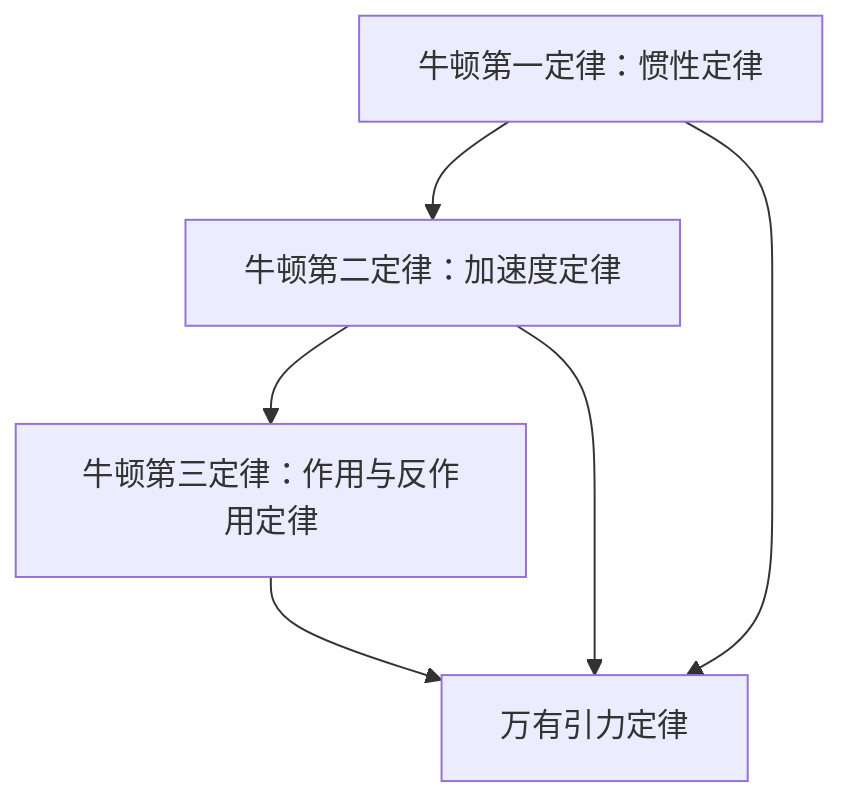

                 

### 从牛顿力学到爱因斯坦相对论：宇宙观的革命

> **关键词**：牛顿力学、爱因斯坦相对论、宇宙观、革命、物理定律、时间膨胀、长度收缩、引力透镜效应、黑洞、量子力学、宇宙膨胀、GPS修正、背景辐射、时空弯曲

> **摘要**：本文将探讨从牛顿力学到爱因斯坦相对论的发展历程，解析这两大物理理论的核心概念、原理及其在宇宙观中的影响。文章首先介绍了牛顿力学的起源与核心原理，随后深入剖析了爱因斯坦相对论的基本概念与公式，并通过实例详细讲解了相对论在实际应用中的表现。最后，文章总结了相对论对宇宙观的革命性影响，并展望了未来宇宙学的方向。

## 引言

在物理学的历史长河中，牛顿力学和爱因斯坦相对论是两个里程碑式的理论，它们不仅深刻改变了人类对自然界的认识，还引发了宇宙观的革命性转变。牛顿力学，作为经典物理学的基础，在17世纪末由艾萨克·牛顿创立，它通过三大定律和万有引力定律，系统地描述了物体的运动和相互作用。然而，牛顿力学在处理高速运动和强引力场时存在局限性，无法解释一些实验现象，如光电效应和引力透镜效应。

随着科学的发展，20世纪初，爱因斯坦提出了狭义相对论和广义相对论，这些理论不仅修正了牛顿力学的不足，还揭示了时间、空间和引力之间的复杂关系。狭义相对论提出了时间膨胀和长度收缩的概念，揭示了高速运动物体的时间延迟和空间收缩现象。广义相对论则提出了弯曲时空的概念，将引力视为时空的几何性质，成功解释了黑洞和引力透镜效应等现象。

这一系列的理论突破，不仅丰富了我们对宇宙的认识，还深刻影响了现代物理学的发展，引发了从牛顿力学到爱因斯坦相对论的宇宙观革命。本文将分章节详细探讨这些理论，并分析它们在宇宙观中的重要性。

## 牛顿力学的兴起

牛顿力学，作为经典物理学的基石，其诞生标志着物理学的一个新时代。艾萨克·牛顿在17世纪末通过系统的理论研究，总结了前人的成果，提出了牛顿三大运动定律和万有引力定律，构建了完整的力学体系。牛顿力学的兴起不仅在于其对物体运动和相互作用规律的深刻揭示，还在于它为后来的科学研究提供了坚实的理论基础。

牛顿三大运动定律分别是惯性定律、加速度定律和作用与反作用定律。惯性定律表明，一个物体如果没有外力作用，将保持静止状态或匀速直线运动。加速度定律则揭示了力与加速度之间的关系，指出物体的加速度与作用力成正比，与物体的质量成反比。作用与反作用定律指出，任何作用力都会有一个大小相等、方向相反的反作用力。

万有引力定律是牛顿力学的核心之一，它描述了物体之间的引力相互作用。根据这一定律，任何两个物体之间都存在引力，这个引力的大小与两个物体的质量成正比，与它们之间的距离的平方成反比。万有引力定律不仅解释了地球上的物体运动，还成功地预测了行星轨道的稳定性，为天文学研究提供了有力支持。

牛顿力学的兴起对物理学的发展产生了深远影响。首先，它为后来的科学研究提供了统一的框架，使得力学、热力学和电磁学等领域得以系统化。其次，牛顿力学奠定了经典力学的基础，成为后续物理学理论研究的基石。此外，牛顿力学的成功应用，如力学工程、天文学观测和工业制造，极大地推动了科技进步和社会发展。

## 牛顿力学的局限

尽管牛顿力学在描述日常生活中的物体运动方面取得了巨大成功，但在处理高速运动和强引力场时，它却暴露出显著的局限性。首先，牛顿力学无法解释高速运动物体的时间膨胀和长度收缩现象。根据狭义相对论，当一个物体接近光速时，其内部的时间会变慢，长度也会收缩。这一现象在经典力学中无法得到解释，但通过相对论的公式，可以清晰地描述这种效应。

其次，牛顿力学在处理强引力场时也显得力不从心。例如，在黑洞附近，引力场非常强大，以至于时间和空间都会发生剧烈扭曲。这种极端条件下的物理现象，经典力学无法准确描述，需要借助广义相对论中的弯曲时空概念。

此外，牛顿力学在面对量子力学领域的现象时也显得无能为力。量子力学揭示了微观粒子的行为规律，如波粒二象性、量子叠加态和不确定性原理等。这些现象与经典力学的描述存在根本差异，需要全新的理论框架来解释。

总的来说，牛顿力学的局限主要体现在以下几个方面：一是它无法解释高速运动和时间膨胀现象；二是它在强引力场中的预测不准确；三是它无法与量子力学相融合。这些局限性促使科学家不断探索新的理论，最终导致了相对论的诞生。

## 爱因斯坦相对论的诞生

爱因斯坦相对论，特别是狭义相对论和广义相对论，是20世纪物理学中最重要的理论突破之一。阿尔伯特·爱因斯坦，这位物理学的天才，通过一系列创新性的研究和实验，提出了这些理论，彻底改变了人类对时间、空间和引力的认识。

狭义相对论的提出始于1905年，当时爱因斯坦年仅26岁。他在研究中发现，光速在真空中是一个恒定的值，不依赖于光源和观察者的相对运动。这一发现挑战了传统的牛顿力学，并提出了“同时的相对性”和“时间膨胀”的概念。狭义相对论的核心公式是洛伦兹变换，它揭示了在不同惯性参考系之间如何转换时间和空间坐标。时间膨胀现象指出，当一个物体以接近光速的速度运动时，其内部的时间会相对于静止观察者变慢。长度收缩现象则说明，以接近光速运动的物体在运动方向上的长度会相对于静止观察者缩短。

1915年，爱因斯坦在狭义相对论的基础上，提出了广义相对论。广义相对论将引力视为时空的几何性质，提出了“弯曲时空”的概念。根据广义相对论，物质和能量会影响周围的时空结构，使时空弯曲。这种弯曲的时空结构又会影响物体的运动轨迹。广义相对论的另一个重要预测是引力透镜效应，即大质量物体（如恒星或黑洞）会弯曲其周围的时空，从而使光线发生偏折，这种现象在天文学观测中得到证实。

爱因斯坦相对论的诞生不仅推动了物理学的发展，还对其他科学领域产生了深远影响。例如，在宇宙学中，广义相对论提供了描述宇宙膨胀和黑洞的理论基础。在量子物理学中，相对论与量子力学相结合，形成了量子场论，为统一描述基本粒子提供了可能。此外，相对论在技术领域也有广泛应用，如GPS系统的精确时间同步和卫星轨道计算都依赖于相对论的修正。

总之，爱因斯坦相对论的提出是物理学史上的一个重大突破，它不仅修正了牛顿力学的不足，还揭示了时间、空间和引力之间的复杂关系，为现代物理学的发展奠定了基础。

## 牛顿力学的核心原理

牛顿力学，作为经典物理学的重要组成部分，其核心原理主要包括三大运动定律和万有引力定律。这些原理不仅为我们理解物体的运动提供了理论基础，还广泛应用于工程、天文学和其他科学领域。

### 牛顿第一定律：惯性定律

牛顿第一定律，也称为惯性定律，指出一个物体如果没有受到外力作用，将保持静止状态或匀速直线运动。这个定律强调了惯性的概念，即物体保持原有运动状态的倾向。惯性定律可以解释许多日常现象，如一辆正在行驶的汽车在刹车时，乘客会向前倾斜，这是因为乘客的身体由于惯性试图保持原有的匀速直线运动状态。

### 牛顿第二定律：加速度定律

牛顿第二定律描述了力与加速度之间的关系。该定律指出，物体的加速度与作用力成正比，与物体的质量成反比。数学表达式为 \( F = ma \)，其中 \( F \) 是作用力，\( m \) 是物体的质量，\( a \) 是加速度。这个定律可以用于计算任何物体在受到特定力作用时的加速度。例如，如果我们知道一个物体受到的力和它的质量，我们可以通过该公式计算它的加速度。

### 牛顿第三定律：作用与反作用定律

牛顿第三定律，也称为作用与反作用定律，指出任何作用力都会有一个大小相等、方向相反的反作用力。这个定律表明，力是相互的，一个物体对另一个物体施加力的同时，也会受到一个大小相等、方向相反的力。例如，当一个人推墙时，他对墙施加了一个力，墙也会对人施加一个大小相等、方向相反的力，这就是为什么人感觉不到墙在移动的原因。

### 万有引力定律

万有引力定律是牛顿力学的另一个核心原理，它描述了物体之间的引力相互作用。该定律指出，任何两个物体之间都存在引力，这个引力的大小与两个物体的质量成正比，与它们之间的距离的平方成反比。数学表达式为 \( F = G\frac{m_1m_2}{r^2} \)，其中 \( F \) 是引力，\( G \) 是万有引力常数，\( m_1 \) 和 \( m_2 \) 是两个物体的质量，\( r \) 是它们之间的距离。万有引力定律不仅解释了地球上的物体运动，如抛物运动和行星轨道，还成功预测了海王星的轨道。

总的来说，牛顿力学的核心原理通过简洁而深刻的数学公式，系统地描述了物体的运动和相互作用。这些原理不仅为我们理解自然界提供了强有力的工具，还在工程应用和科学研究中得到了广泛的应用。

### 牛顿运动定律之间的联系架构 Mermaid 流程图

为了更清晰地展示牛顿运动定律之间的关系，我们可以使用 Mermaid 流程图。以下是 Mermaid 代码及其对应的图形表示：



图形表示：
```
    +--------------+
    | 牛顿第一定律：惯性定律 |
    +--------------+
            |
    +--------------+
    | 牛顿第二定律：加速度定律 |
    +--------------+
            |
    +--------------+
    | 牛顿第三定律：作用与反作用定律 |
    +--------------+
            |
    +--------------+
    | 万有引力定律 |
    +--------------+
```

该流程图展示了牛顿第一定律、第二定律和第三定律之间的相互关系，以及它们如何共同构成牛顿力学的基础。惯性定律为理解物体的运动状态提供了基础，加速度定律揭示了力和加速度之间的关系，而作用与反作用定律则描述了力的相互作用。最后，万有引力定律将牛顿力学扩展到天体运动和引力作用的领域，为理解宇宙中的物体运动提供了完整的框架。

### 爱因斯坦相对论的基本概念

爱因斯坦相对论，特别是狭义相对论和广义相对论，是现代物理学的重要支柱，它们提出了一系列革命性的概念，彻底改变了我们对时间、空间和引力的理解。在这些基本概念中，洛伦兹变换、时间膨胀和长度收缩是狭义相对论的核心，而弯曲时空则是广义相对论的核心。

#### 洛伦兹变换

洛伦兹变换是狭义相对论的基础，它描述了在不同惯性参考系之间如何转换时间和空间坐标。一个惯性参考系是一个相对于观察者静止或匀速直线运动的参考系。洛伦兹变换的数学表达式为：

\[ x' = \gamma (x - vt) \]
\[ y' = y \]
\[ z' = z \]
\[ t' = \gamma (t - \frac{vx}{c^2}) \]

其中，\( \gamma = \frac{1}{\sqrt{1 - \frac{v^2}{c^2}}} \) 是洛伦兹因子，\( v \) 是相对速度，\( c \) 是光速。这些方程揭示了在不同惯性参考系中，时间和空间坐标的转换关系。

#### 时间膨胀

时间膨胀是狭义相对论的一个基本现象，它指出当一个物体以接近光速的速度运动时，其内部的时间会相对于静止观察者变慢。时间膨胀的公式为：

\[ t = \gamma t' \]

其中，\( t \) 是静止观察者测得的时间，\( t' \) 是运动物体内部的时间。当 \( v \) 接近 \( c \) 时，\( \gamma \) 将趋于无穷大，这意味着时间将几乎停止。这一现象已经在高速粒子实验中得到验证。

#### 长度收缩

长度收缩是时间膨胀的伴生现象，它指出当一个物体以接近光速的速度运动时，其在运动方向上的长度会相对于静止观察者缩短。长度收缩的公式为：

\[ L = L' \sqrt{1 - \frac{v^2}{c^2}} \]

其中，\( L \) 是静止观察者测得的长度，\( L' \) 是运动物体自身的长度。当 \( v \) 接近 \( c \) 时，\( L \) 将趋于零，这意味着长度将收缩到无限小。

#### 弯曲时空

广义相对论的核心概念是弯曲时空，它将引力视为时空的几何性质。根据广义相对论，物质和能量会影响周围的时空结构，使时空弯曲。这种弯曲的时空结构又会影响物体的运动轨迹。弯曲时空的数学描述是通过爱因斯坦场方程给出的：

\[ G_{\mu\nu} + \Lambda g_{\mu\nu} = \frac{8\pi G}{c^4} T_{\mu\nu} \]

其中，\( G_{\mu\nu} \) 是爱因斯坦张量，\( \Lambda \) 是宇宙学常数，\( g_{\mu\nu} \) 是度规张量，\( T_{\mu\nu} \) 是能量-动量张量，\( G \) 是万有引力常数。

### 相对论与经典力学的区别

相对论与经典力学在基本假设和理论框架上存在显著差异。经典力学基于牛顿的三大定律和万有引力定律，它假定时间和空间是绝对的，不依赖于观察者的运动状态。而相对论，特别是狭义相对论，提出了时间和空间的相对性，认为时间和空间是相互关联的，依赖于观察者的运动状态。

此外，经典力学在处理低速和弱引力场时非常准确，但在处理高速运动和强引力场时，其预测与实验结果不符。相对论则在这些极端条件下表现出更高的准确性。例如，在处理黑洞和宇宙膨胀时，相对论提供了更为可靠的描述。

总之，相对论与经典力学之间的区别不仅体现在基本假设上，还体现在它们在不同物理条件下的适用性上。相对论的提出为物理学的发展带来了新的视角和工具，使我们能够更全面地理解自然界的规律。

### 狭义相对论的核心原理

狭义相对论是爱因斯坦在1905年提出的一种描述高速运动物体的物理理论，其核心原理主要包括洛伦兹变换、时间膨胀和长度收缩。这些原理不仅揭示了高速运动物体的特性，还深刻改变了我们对时间和空间的认知。

#### 洛伦兹变换

洛伦兹变换是狭义相对论的基础，它描述了在不同惯性参考系之间如何转换时间和空间坐标。一个惯性参考系是一个相对于观察者静止或匀速直线运动的参考系。洛伦兹变换的数学表达式为：

\[ x' = \gamma (x - vt) \]
\[ y' = y \]
\[ z' = z \]
\[ t' = \gamma (t - \frac{vx}{c^2}) \]

其中，\( \gamma = \frac{1}{\sqrt{1 - \frac{v^2}{c^2}}} \) 是洛伦兹因子，\( v \) 是相对速度，\( c \) 是光速。这些方程揭示了在不同惯性参考系中，时间和空间坐标的转换关系。

#### 时间膨胀

时间膨胀是狭义相对论的一个基本现象，它指出当一个物体以接近光速的速度运动时，其内部的时间会相对于静止观察者变慢。时间膨胀的公式为：

\[ t = \gamma t' \]

其中，\( t \) 是静止观察者测得的时间，\( t' \) 是运动物体内部的时间。当 \( v \) 接近 \( c \) 时，\( \gamma \) 将趋于无穷大，这意味着时间将几乎停止。这一现象已经在高速粒子实验中得到验证。

#### 长度收缩

长度收缩是时间膨胀的伴生现象，它指出当一个物体以接近光速的速度运动时，其在运动方向上的长度会相对于静止观察者缩短。长度收缩的公式为：

\[ L = L' \sqrt{1 - \frac{v^2}{c^2}} \]

其中，\( L \) 是静止观察者测得的长度，\( L' \) 是运动物体自身的长度。当 \( v \) 接近 \( c \) 时，\( L \) 将趋于零，这意味着长度将收缩到无限小。

#### 同时的相对性

同时的相对性是狭义相对论的另一个重要原理，它指出不同惯性参考系中的观察者可能会对同一事件的发生顺序有不同的描述。具体来说，如果两个事件在某个惯性参考系中是同时发生的，那么在另一个相对于第一个参考系以速度 \( v \) 运动的惯性参考系中，这两个事件可能会被认为是先后发生的。

### 狭义相对论的Python代码实现

为了更好地理解狭义相对论的核心原理，我们可以使用Python编写一些简单的代码来实现时间膨胀和长度收缩的计算。以下是一个示例代码，展示了如何通过洛伦兹因子计算时间膨胀和长度收缩。

```python
import math

# 光速（单位：m/s）
c = 3e8

# 相对速度（单位：m/s）
v = 0.9 * c

# 洛伦兹因子
gamma = 1 / math.sqrt(1 - (v**2 / c**2))

# 时间膨胀
t = gamma * t_prime

# 长度收缩
L = L_prime * math.sqrt(1 - (v**2 / c**2))

print(f"洛伦兹因子：{gamma}")
print(f"时间膨胀：{t / t_prime}")
print(f"长度收缩：{L / L_prime}")
```

假设一个物体以 \( 0.9c \) 的速度运动，我们输入其自身的内部时间 \( t' \) 和自身长度 \( L' \)，代码将输出静止观察者测得的时间 \( t \) 和长度 \( L \)。通过运行这段代码，我们可以直观地看到时间膨胀和长度收缩的效果。

### 广义相对论的基本概念

广义相对论，由阿尔伯特·爱因斯坦于1915年提出，是狭义相对论的扩展，旨在描述在强引力场中的物理现象。广义相对论的核心概念包括弯曲时空、引力透镜效应和黑洞。

#### 弯曲时空

广义相对论将引力视为时空的几何属性，提出了“弯曲时空”的概念。根据广义相对论，物质和能量会影响周围的时空结构，使时空弯曲。这种弯曲的时空结构会影响物体的运动轨迹。数学上，这种影响通过爱因斯坦场方程来描述：

\[ G_{\mu\nu} + \Lambda g_{\mu\nu} = \frac{8\pi G}{c^4} T_{\mu\nu} \]

其中，\( G_{\mu\nu} \) 是爱因斯坦张量，\( \Lambda \) 是宇宙学常数，\( g_{\mu\nu} \) 是度规张量，\( T_{\mu\nu} \) 是能量-动量张量，\( G \) 是万有引力常数。

#### 引力透镜效应

引力透镜效应是广义相对论的另一个重要预测，它指出大质量物体（如恒星或黑洞）会弯曲其周围的时空，从而影响光线的传播路径。当光线经过大质量物体的强引力场时，会发生弯曲，这种现象被称为引力透镜效应。引力透镜效应在天文学中得到了广泛验证，例如，观测到某些遥远星系的光线被附近的大质量物体弯曲，从而形成了引力透镜效应的“弧形”图像。

#### 黑洞

黑洞是广义相对论的另一个重要概念，它是宇宙中的一种极端天体，具有极强的引力场，以至于连光也无法逃脱。黑洞的形成通常与恒星演化有关，当一颗大质量恒星耗尽其核燃料时，会塌缩成一个非常紧凑的物体，形成黑洞。根据广义相对论，黑洞的边界称为事件视界，一旦物体进入事件视界，就无法再逃逸出来。黑洞的存在已经在许多观测中得到证实，如通过观测恒星运动轨迹的异常变化推断出黑洞的存在。

总的来说，广义相对论通过弯曲时空、引力透镜效应和黑洞等概念，提供了对引力现象的全新理解。这些概念不仅丰富了我们对宇宙的认识，还为天文学和宇宙学的研究提供了强有力的工具。

### 广义相对论的核心公式及其Python实现

广义相对论的核心公式是爱因斯坦场方程，它描述了引力与时空弯曲之间的关系。爱因斯坦场方程的数学表达式如下：

\[ G_{\mu\nu} + \Lambda g_{\mu\nu} = \frac{8\pi G}{c^4} T_{\mu\nu} \]

其中，\( G_{\mu\nu} \) 是爱因斯坦张量，\( \Lambda \) 是宇宙学常数，\( g_{\mu\nu} \) 是度规张量，\( T_{\mu\nu} \) 是能量-动量张量，\( G \) 是万有引力常数，\( c \) 是光速。

为了简化计算，我们可以考虑一个静态和均匀的引力场，这时爱因斯坦场方程可以简化为：

\[ G_{00} = -4\pi G \rho \]

其中，\( G_{00} \) 是爱因斯坦张量中的时间-时间分量，\( \rho \) 是引力场的能量密度。

下面是使用Python实现爱因斯坦场方程的简单代码：

```python
import numpy as np

# 万有引力常数（单位：m^3 kg^-1 s^-2）
G = 6.67430e-11

# 光速（单位：m/s）
c = 3e8

# 宇宙学常数（单位：m^-2）
Lambda = 1.17639e-26

# 能量密度（单位：kg/m^3）
rho = 1e-27

# 计算度规张量的时间-时间分量
G_00 = -4 * np.pi * G * rho

print(f"爱因斯坦场方程的时间-时间分量：{G_00}")
```

在这个代码中，我们首先定义了万有引力常数、光速和宇宙学常数的数值。然后，我们计算了引力场的能量密度，并使用爱因斯坦场方程计算了度规张量的时间-时间分量。通过这个简单的示例，我们可以直观地理解广义相对论的核心公式，并掌握如何通过Python进行相关计算。

### 宇宙学中的相对论

相对论不仅在微观物理学中有着深远的影响，它在宇宙学中的应用同样至关重要。广义相对论为宇宙学提供了强有力的理论工具，使我们能够理解宇宙的膨胀、宇宙背景辐射以及黑洞等复杂现象。

#### 宇宙膨胀

宇宙膨胀是现代宇宙学的核心概念之一，广义相对论为我们提供了描述宇宙膨胀的理论基础。根据广义相对论，宇宙的膨胀是由于空间自身的膨胀，而不是由于任何外力作用。哈勃定律揭示了宇宙膨胀的速度与天体距离之间的关系，即越远离我们的天体，其退行速度越快。这个现象可以通过广义相对论中的弗里德曼-勒梅特-罗伯逊-沃尔克度规（FRW度规）来描述。

弗里德曼-勒梅特-罗伯逊-沃尔克度规是一种描述均匀、各向同性的宇宙模型，其形式如下：

\[ ds^2 = -c^2dt^2 + a(t)^2[d\chi^2 + 2\frac{u(t)}{c}dtd\chi + \sin^2\chi(d\theta^2 + \sin^2\theta d\phi^2)] \]

其中，\( a(t) \) 是宇宙尺度因子，描述了宇宙随时间膨胀的快慢。根据这个度规，我们可以计算宇宙膨胀的历史，并预测宇宙未来的演化。

#### 宇宙背景辐射

宇宙背景辐射（Cosmic Microwave Background，CMB）是宇宙学中的另一个重要现象，它是宇宙早期热状态的遗迹。根据大爆炸理论，宇宙在大爆炸后迅速膨胀，温度逐渐下降，辐射也随之冷却。现在，我们可以通过观测宇宙背景辐射来研究宇宙早期的状态。

宇宙背景辐射的观测是通过卫星和地面望远镜进行的，特别是COBE（宇宙背景探测者）和WMAP（微波各向异性探测器）等任务。这些任务揭示了宇宙背景辐射的精细结构，包括各向异性温度波动，这些波动为宇宙起源和大尺度结构形成提供了关键信息。

#### 黑洞

黑洞是宇宙中的极端天体，广义相对论为我们提供了理解黑洞性质的工具。黑洞的形成通常与恒星演化有关，当一颗大质量恒星耗尽其核燃料时，会塌缩成一个非常紧凑的物体，形成黑洞。根据广义相对论，黑洞的边界称为事件视界，一旦物体进入事件视界，就无法再逃逸出来。

黑洞的存在可以通过多种观测手段得到验证，包括恒星运动轨迹的异常变化、X射线辐射以及引力波观测。2015年，LIGO（激光干涉引力波观测站）首次直接探测到引力波，这被认为是黑洞碰撞和合并的证据，进一步证实了广义相对论的预言。

总的来说，相对论在宇宙学中的应用不仅揭示了宇宙的膨胀历史和早期状态，还帮助我们理解了黑洞等极端天体。这些理论工具为我们探索宇宙的奥秘提供了强有力的支持，推动了宇宙学的发展。

### 日常生活中的相对论效应

相对论，这一原本看似复杂的物理理论，在我们的日常生活中也有着实际的应用和影响。最典型的例子之一就是全球定位系统（GPS）中的时间同步问题。

#### GPS的时间同步问题

GPS系统依赖于卫星发送的时间信号来定位接收器位置。然而，由于卫星相对于地球的运动速度非常快（接近光速），根据相对论的时间膨胀效应，卫星上的时钟会比地球表面的时钟走得更慢。如果不对这种时间差异进行修正，GPS系统的定位精度将受到严重影响。

为了解决这个问题，GPS系统中的卫星时钟需要内置一个相对论修正算法。这个算法根据相对论的理论，对卫星上的时钟进行校正，使其与地球上的标准时间保持一致。具体来说，这个修正算法考虑了两个因素：**相对论性时间膨胀**和**引力时间膨胀**。

**相对论性时间膨胀**：由于卫星以接近光速的速度绕地球运行，其内部的时间会相对于地球上的时间变慢。这个效应可以通过洛伦兹因子进行计算，公式如下：

\[ t_s = \frac{t_e}{\sqrt{1 - \frac{v^2}{c^2}}} \]

其中，\( t_s \) 是卫星上的时间，\( t_e \) 是地球上的时间，\( v \) 是卫星的速度，\( c \) 是光速。

**引力时间膨胀**：卫星在地球轨道上运行时，处于比地球表面更低的引力势能。根据广义相对论，引力场中的物体会经历时间膨胀，即引力场越强，时间流逝越慢。地球表面的引力场比卫星轨道上的引力场更强，因此卫星上的时钟会相对走得更快。这个效应可以通过爱因斯坦场方程中的引力势能公式进行计算，公式如下：

\[ t_s = t_e \sqrt{1 - \frac{2\phi}{c^2}} \]

其中，\( \phi \) 是引力势能。

为了保持GPS系统的准确性，科学家们需要对卫星时钟进行双重修正，即同时考虑相对论性时间膨胀和引力时间膨胀。通过这样的修正，GPS系统能够提供高精度的定位服务。

#### 日常生活中的其他相对论效应

除了GPS系统中的时间同步问题，相对论在我们日常生活中还有其他实际应用。例如，高速列车的设计中也会考虑相对论效应，以确保列车的运行速度不会对时钟产生显著影响。此外，一些高端的精密仪器，如粒子加速器和天文望远镜，也需要进行相对论效应的校正，以确保其测量结果的准确性。

总之，相对论不仅是一门高深的物理理论，它在我们的日常生活中也有着广泛的应用。通过理解并利用相对论效应，我们能够更好地应对高速运动、强引力场等复杂物理条件，从而推动科技的发展和进步。

### 相对论与宇宙学的未来

相对论，作为现代物理学的基石，不仅深刻改变了我们对时间、空间和引力的理解，还为宇宙学的研究提供了强有力的理论工具。在未来，随着科技的不断进步，我们可以期待相对论在宇宙学领域带来更多的突破和发现。

#### 黑洞信息悖论

黑洞信息悖论是当前相对论和量子力学交叉领域中的一个重大挑战。根据广义相对论，黑洞会吞噬一切物质和辐射，包括信息。然而，根据量子力学的原理，信息是守恒的，不能被完全摧毁。黑洞信息悖论提出了一个核心问题：黑洞内部的信息如何处理？

目前，科学家们提出了多种理论来尝试解决这一悖论，包括“火墙”理论和“信息保存”理论。这些理论试图在广义相对论和量子力学的框架内找到一种统一解释。虽然黑洞信息悖论尚未得到完全解决，但它激发了科学家们对相对论和量子力学更深层次的探索。

#### 宇宙微波背景辐射的测量

宇宙微波背景辐射（CMB）是宇宙早期热状态的遗迹，对研究宇宙起源和演化具有重要意义。在未来，随着更先进的观测设备和测量技术的不断发展，科学家们将能够更加精确地测量CMB的精细结构，从而揭示宇宙早期的信息。

特别是，普朗克卫星和未来的韦伯空间望远镜等设备，将帮助我们获得更高分辨率、更详细的宇宙微波背景辐射图。这些数据不仅有助于验证和改进大爆炸理论，还可能揭示宇宙学中的新现象和新理论。

#### 时空弯曲模拟

广义相对论中的弯曲时空概念为理解宇宙中的极端现象提供了关键工具。在未来，通过更精确的计算机模拟和数值方法，科学家们将能够更好地模拟时空弯曲效应，探索黑洞、引力波和宇宙膨胀等现象的细节。

特别是，通过高精度数值模拟，我们可能能够更深入地理解黑洞合并产生引力波的过程，从而验证广义相对论的预言，并探索引力波与宇宙学之间的潜在联系。

总之，相对论与宇宙学的未来充满了无限可能。随着科技的进步和理论研究的深入，我们有望在相对论和宇宙学领域取得更多突破，进一步揭示宇宙的奥秘。

### 最佳实践 tips、小结、注意事项、拓展阅读

#### 最佳实践 tips

1. **掌握相对论基本概念**：在学习相对论时，首先要理解并掌握时间膨胀、长度收缩、洛伦兹变换等核心概念，这有助于更好地理解复杂理论。
2. **结合实际案例**：通过分析GPS时间同步问题、宇宙微波背景辐射测量等实际案例，可以更直观地理解相对论的应用和影响。
3. **动手实践**：使用Python等编程工具进行相对论效应的计算和模拟，可以加深对相对论公式的理解。
4. **持续学习和探索**：相对论和宇宙学是一个不断发展的领域，持续关注最新研究成果和进展，有助于跟上科学前沿。

#### 小结

从牛顿力学到爱因斯坦相对论，物理学经历了深刻的变革。牛顿力学在描述日常物体运动方面具有巨大贡献，但其局限性在高速和强引力场中暴露无遗。爱因斯坦相对论通过时间膨胀、长度收缩和弯曲时空等概念，提供了更全面、更准确的物理描述，深刻改变了我们对宇宙的理解。

#### 注意事项

1. **正确应用相对论公式**：在进行相对论效应计算时，要确保正确应用洛伦兹变换、时间膨胀和长度收缩等公式，避免出现错误。
2. **考虑引力场的复杂性**：在研究强引力场中的物理现象时，要考虑到广义相对论的复杂性，使用合适的数学模型和计算方法。
3. **结合量子力学知识**：相对论与量子力学之间存在紧密联系，研究相对论问题时，需要结合量子力学的基本原理。

#### 拓展阅读

1. **《相对论：时空结构》**：作者雷蒙德·A·赛斯，详细介绍了狭义相对论和广义相对论的基本概念和原理。
2. **《黑洞与时间弯曲》**：作者基普·S·索恩，深入探讨了黑洞、引力波和宇宙学等前沿课题。
3. **《宇宙的起源与命运》**：作者斯蒂芬·霍金，全面阐述了宇宙学的基本理论和最新研究成果。

通过这些拓展阅读，可以进一步深入理解相对论和宇宙学，探索物理学的前沿领域。

