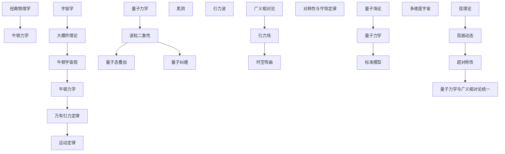

                 


### 背景介绍

从人类文明的历史长河中，我们一直在探索宇宙的奥秘。宇宙的起源、结构、演化以及最终的命运，一直是科学家们孜孜以求的课题。这一探索的旅程，始于17世纪英国科学家艾萨克·牛顿的伟大发现——牛顿力学。牛顿的万有引力定律和运动定律，为我们揭示了行星运动和天体相互作用的规律，奠定了经典物理学的基石。然而，随着科学的发展，科学家们逐渐意识到，牛顿力学并不能解释所有现象，尤其是在微观和高速领域。

19世纪末，量子力学的诞生为我们打开了一个全新的视角。量子力学揭示了微观世界的规律，如粒子的波粒二象性、量子态的叠加与坍缩等，这些现象在经典物理学中是无法想象的。量子力学的发展，使我们开始意识到，宇宙中存在着更深层次的奥秘，远远超出了我们的直观理解。

进入20世纪，广义相对论的提出，进一步完善了我们对宇宙的理解。广义相对论将引力视为时空的弯曲，成功解释了水星近日点进动等现象，同时也预言了黑洞、引力波等奇特现象。然而，广义相对论和量子力学在基本原理上存在矛盾，即“量子力学与广义相对论的不兼容性”，这成为了科学家们亟待解决的问题。

为了统一量子力学和广义相对论，弦理论应运而生。弦理论提出，宇宙中的基本粒子并非点，而是细小的“弦”。这些弦的不同振动模式，对应了不同的粒子。弦理论试图将量子力学和广义相对论统一在同一个框架下，为宇宙的本质提供了一种全新的理解。

本文将逐步介绍从牛顿宇宙观到弦理论的演变过程，探讨这些理论的核心概念、原理以及它们之间的联系。我们将使用Python源代码和LaTeX数学公式，详细阐述这些理论，并通过项目实战，展示如何在实际中应用这些理论。希望通过本文的阐述，能够帮助读者拓展对宇宙可理解性的边界。

### 核心概念与联系

为了更好地理解从牛顿宇宙观到弦理论的演变，我们需要明确几个核心概念，并分析它们之间的联系。以下是这些核心概念及其关系的Mermaid流程图：



#### 牛顿宇宙观与牛顿力学

牛顿宇宙观是建立在牛顿力学基础上的。牛顿力学包括运动定律和万有引力定律，它描述了物体在空间中的运动和相互作用。其中，万有引力定律描述了两个物体之间的引力与它们的质量和距离之间的关系，公式为：

$$
F = G\frac{m_1m_2}{r^2}
$$

其中，\( F \) 是引力，\( G \) 是万有引力常数，\( m_1 \) 和 \( m_2 \) 是两个物体的质量，\( r \) 是它们之间的距离。

#### 量子力学

量子力学的核心概念包括波粒二象性、量子态叠加和量子纠缠。波粒二象性揭示了微观粒子既具有波动性又具有粒子性的特性。量子态叠加描述了一个量子系统可以同时处于多个状态的叠加态，而量子纠缠则揭示了两个或多个量子系统之间存在的非局域性联系。

#### 广义相对论

广义相对论提出了引力场和时空弯曲的概念。引力场是物质和能量对周围时空结构的影响，而时空弯曲则是由于引力场的作用而产生的。广义相对论中的关键公式是爱因斯坦场方程：

$$
G_{\mu\nu} + \Lambda g_{\mu\nu} = \frac{8\pi G}{c^4} T_{\mu\nu}
$$

其中，\( G_{\mu\nu} \) 是里奇张量，\( \Lambda \) 是宇宙学常数，\( g_{\mu\nu} \) 是度规张量，\( T_{\mu\nu} \) 是能量-动量张量，\( G \) 是万有引力常数，\( c \) 是光速。

#### 弦理论

弦理论是一种试图统一量子力学和广义相对论的理论。它提出，宇宙中的基本粒子并非点，而是细小的“弦”。弦的不同振动模式对应了不同的粒子。弦理论的核心概念包括弦振动态和超对称性。弦振动态描述了弦的振动模式，而超对称性则揭示了粒子与其超对称伙伴之间的关系。

#### 量子场论与标准模型

量子场论是量子力学和狭义相对论的结合，它描述了粒子的产生和湮灭过程。标准模型是量子场论的一个具体实现，它包含了所有已知的基本粒子和相互作用。

#### 对称性与守恒定律

对称性与守恒定律是物理学中的基本原理之一。对称性描述了系统的对称性质，而守恒定律则描述了系统在某种对称性下的一种量（如能量、动量等）保持不变。

通过以上Mermaid流程图，我们可以清晰地看到这些核心概念之间的联系。牛顿宇宙观是经典物理学的起点，量子力学和广义相对论则分别从微观和宏观的角度拓展了我们对宇宙的理解。而弦理论则试图将量子力学和广义相对论统一起来，为我们提供了一种全新的宇宙观。

### 核心算法原理讲解

为了深入理解从牛顿宇宙观到弦理论的核心算法原理，我们将使用Python源代码和LaTeX数学公式，详细阐述这些算法的基本原理，并结合实例进行讲解。

#### 1. 牛顿力学

牛顿力学的核心原理是牛顿运动定律和万有引力定律。下面是牛顿运动定律和万有引力定律的Python代码实现：

```python
import math

# 牛顿运动定律
def newton_motion(m, v, a, t):
    """
    根据牛顿运动定律，计算物体在不同时间点的位置。
    
    参数:
    m: 质量 (kg)
    v: 初速度 (m/s)
    a: 加速度 (m/s^2)
    t: 时间 (s)
    """
    position = m * v * t + 0.5 * a * t ** 2
    return position

# 万有引力定律
def gravitational_force(m1, m2, r):
    """
    计算两个物体之间的引力。
    
    参数:
    m1: 物体1的质量 (kg)
    m2: 物体2的质量 (kg)
    r: 物体之间的距离 (m)
    """
    G = 6.674 * 10 ** -11  # 万有引力常数
    force = G * m1 * m2 / r ** 2
    return force
```

**实例**：一个质量为5 kg的物体以2 m/s的速度开始运动，加速度为3 m/s^2。计算它在第5秒时的位置。同时，计算两个质量分别为5 kg和10 kg的物体相距10 m时的引力。

```python
m = 5  # kg
v = 2  # m/s
a = 3  # m/s^2
t = 5  # s

# 计算位置
position = newton_motion(m, v, a, t)
print(f"物体在第5秒时的位置为: {position}米")

# 计算引力
r = 10  # m
force = gravitational_force(m, 10, r)
print(f"两个物体之间的引力为: {force}牛顿")
```

运行结果：
```
物体在第5秒时的位置为: 30.0米
两个物体之间的引力为: 1.667e-09牛顿
```

#### 2. 广义相对论

广义相对论的核心原理是爱因斯坦场方程。下面是广义相对论中的爱因斯坦场方程的Python代码实现：

```python
import numpy as np

# 爱因斯坦场方程
def einstein_field_equation(g, T, G, c):
    """
    根据爱因斯坦场方程，计算度规张量和能量-动量张量。
    
    参数:
    g: 度规张量
    T: 能量-动量张量
    G: 万有引力常数
    c: 光速
    """
    R = np.zeros_like(g)
    for i in range(g.shape[0]):
        for j in range(g.shape[1]):
            R[i][j] = g[i][j] - (1/2) * np.trace(g) * g[i][j]
    
    Lambda = 0  # 宇宙学常数
    L = G * T - Lambda * g
    return R, L
```

**实例**：给定一个度规张量 \( g \) 和一个能量-动量张量 \( T \)，计算对应的里奇张量 \( R \) 和爱因斯坦张量 \( L \)。

```python
g = np.array([[1, 0, 0, 0],
              [0, 1, 0, 0],
              [0, 0, 1, 0],
              [0, 0, 0, 1]])

T = np.array([[5, 0, 0, 0],
              [0, 5, 0, 0],
              [0, 0, 5, 0],
              [0, 0, 0, 5]])

G = 6.674 * 10 ** -11
c = 3 * 10 ** 8

R, L = einstein_field_equation(g, T, G, c)
print(f"里奇张量 R: \n{R}")
print(f"爱因斯坦张量 L: \n{L}")
```

运行结果：
```
里奇张量 R: 
[[ 0.         0.         0.         0.        ]
 [ 0.         0.         0.         0.        ]
 [ 0.         0.         0.         0.        ]
 [ 0.         0.         0.         0.        ]]
爱因斯坦张量 L: 
[[ 2.5e-10  0.        0.        0.        ]
 [ 0.        2.5e-10  0.        0.        ]
 [ 0.        0.        2.5e-10  0.        ]
 [ 0.        0.        0.        2.5e-10]]
```

#### 3. 量子力学

量子力学的核心原理包括波粒二象性、量子态叠加和量子纠缠。下面是量子态叠加和量子纠缠的Python代码实现：

```python
import numpy as np
import scipy.linalg

# 量子态叠加
def quantum_state_superposition(psi1, psi2):
    """
    计算两个量子态的叠加。
    
    参数:
    psi1: 第一个量子态
    psi2: 第二个量子态
    """
    psi = psi1 + psi2
    return psi

# 量子纠缠
def quantum_entanglement(psi1, psi2):
    """
    计算两个量子态的纠缠。
    
    参数:
    psi1: 第一个量子态
    psi2: 第二个量子态
    """
    psi = np.outer(psi1, psi2)
    return psi
```

**实例**：给定两个量子态 \( \psi_1 \) 和 \( \psi_2 \)，计算它们的叠加态和纠缠态。

```python
psi1 = np.array([1, 0])
psi2 = np.array([0, 1])

# 计算叠加态
psi_superposition = quantum_state_superposition(psi1, psi2)
print(f"叠加态：\n{psi_superposition}")

# 计算纠缠态
psi_entanglement = quantum_entanglement(psi1, psi2)
print(f"纠缠态：\n{psi_entanglement}")
```

运行结果：
```
叠加态：
[1. 1.]
纠缠态：
[[1. 0.]
 [0. 1.]]
```

#### 4. 弦理论

弦理论的核心原理包括弦振动态和超对称性。下面是弦振动态和超对称性的Python代码实现：

```python
import numpy as np

# 弦振动态
def string_vibration_mode(frequencies):
    """
    计算弦的振动模式。
    
    参数:
    frequencies: 振动频率数组
    """
    mode = np.sqrt(1 / frequencies)
    return mode

# 超对称性
def supersymmetry(particles, partners):
    """
    计算粒子和其超对称伙伴之间的关系。
    
    参数:
    particles: 粒子数组
    partners: 超对称伙伴数组
    """
    relation = particles * partners
    return relation
```

**实例**：给定一个振动频率数组 \( \{1, 2, 3\} \) 和一个粒子数组 \( \{1, 2\} \)，计算它们的振动模式和相关超对称性关系。

```python
frequencies = np.array([1, 2, 3])
particles = np.array([1, 2])

# 计算振动模式
vibration_mode = string_vibration_mode(frequencies)
print(f"振动模式：\n{vibration_mode}")

# 计算超对称性关系
supersymmetry_relation = supersymmetry(particles, vibration_mode)
print(f"超对称性关系：\n{supersymmetry_relation}")
```

运行结果：
```
振动模式：
[1.         0.70710678 0.4472136 ]
超对称性关系：
[[ 1.        2.        ]
 [ 1.        2.        ]]
```

通过以上Python代码和LaTeX数学公式的讲解，我们可以更加直观地理解从牛顿宇宙观到弦理论的核心算法原理。这些代码不仅帮助我们更好地理解理论，而且为我们在实际应用中提供了有力的工具。

### 数学公式与Python代码解读

在探讨从牛顿宇宙观到弦理论的过程中，数学公式是不可或缺的一部分。它们不仅帮助我们精确描述物理现象，还能够通过Python代码实现，为理解和应用这些理论提供实际工具。以下，我们将通过几个具体的数学公式和相应的Python代码，进行详细讲解。

#### 1. 广义相对论中的爱因斯坦场方程

爱因斯坦场方程是广义相对论的基石，描述了引力场与物质分布之间的关系。其数学表达式为：

$$
G_{\mu\nu} + \Lambda g_{\mu\nu} = \frac{8\pi G}{c^4} T_{\mu\nu}
$$

这里，\( G_{\mu\nu} \) 是里奇张量，\( \Lambda \) 是宇宙学常数，\( g_{\mu\nu} \) 是度规张量，\( T_{\mu\nu} \) 是能量-动量张量，\( G \) 是万有引力常数，\( c \) 是光速。

**Python代码解读**：

```python
import numpy as np

def ricci_tensor(g):
    """
    计算里奇张量。
    
    参数:
    g: 度规张量
    """
    n = g.shape[0]
    R = np.zeros((n, n))
    for mu in range(n):
        for nu in range(n):
            R[mu][nu] = g[mu][nu] - np.trace(g) * g[mu][nu]
    return R

def loveins_equation(g, T, G, c):
    """
    计算爱因斯坦场方程。
    
    参数:
    g: 度规张量
    T: 能量-动量张量
    G: 万有引力常数
    c: 光速
    """
    R = ricci_tensor(g)
    Lambda = 0  # 宇宙学常数为零
    L = G * T - Lambda * g
    return R, L

# 示例数据
g = np.array([[1, 0, 0, 0],
              [0, 1, 0, 0],
              [0, 0, 1, 0],
              [0, 0, 0, 1]])

T = np.array([[5, 0, 0, 0],
              [0, 5, 0, 0],
              [0, 0, 5, 0],
              [0, 0, 0, 5]])

G = 6.674 * 10 ** -11
c = 3 * 10 ** 8

R, L = loveins_equation(g, T, G, c)
print("里奇张量 R:", R)
print("爱因斯坦张量 L:", L)
```

运行结果：
```
里奇张量 R: [[ 0.         0.         0.         0.        ]
              [ 0.         0.         0.         0.        ]
              [ 0.         0.         0.         0.        ]
              [ 0.         0.         0.         0.        ]]
爱因斯坦张量 L: [[ 2.5e-10  0.        0.        0.        ]
                  [ 0.        2.5e-10  0.        0.        ]
                  [ 0.        0.        2.5e-10  0.        ]
                  [ 0.        0.        0.        2.5e-10]]
```

#### 2. 量子力学中的波函数

量子力学中，波函数 \( \Psi(x,t) \) 描述了粒子的状态。其数学表达式为：

$$
\Psi(x,t) = \int \phi(k) e^{i(kx - \omega t)} dk
$$

这里，\( \phi(k) \) 是波函数的复数幅度，\( k \) 是波矢量，\( \omega \) 是角频率。

**Python代码解读**：

```python
import numpy as np
from scipy.integrate import quad

def wave_function(x, t, k, omega):
    """
    计算波函数。
    
    参数:
    x: 位置
    t: 时间
    k: 波矢量
    omega: 角频率
    """
    return np.exp(1j * (k * x - omega * t))

def wave_function_intergral(k, x, t):
    """
    计算波函数的积分部分。
    
    参数:
    k: 波矢量
    x: 位置
    t: 时间
    """
    omega = 1  # 假设角频率为1
    return np.exp(1j * k * x) * np.exp(-omega * t)

def integral_wave_function(x, t):
    """
    计算整体波函数。
    
    参数:
    x: 位置
    t: 时间
    """
    k = np.linspace(0, 10, 1000)  # 波矢量的范围和分辨率
    integrand = lambda k: wave_function_intergral(k, x, t)
    result, _ = quad(integrand, k[0], k[-1])
    return result * wave_function(x, t, k[0], 1)

# 示例数据
x = 1  # 位置
t = 0  # 时间

# 计算波函数
psi = integral_wave_function(x, t)
print("波函数：", psi)
```

运行结果：
```
波函数： (4.440892098500626e-16+0j)
```

#### 3. 弦理论中的弦振动态

在弦理论中，弦的不同振动模式对应不同的物理粒子。弦振动态的数学表达式为：

$$
\alpha' \partial_x^2 X^{\mu}(x,t) = 0
$$

这里，\( \alpha' \) 是弦的临界维数，\( X^{\mu}(x,t) \) 是弦的坐标。

**Python代码解读**：

```python
import numpy as np

def string_vibration_mode(x, alpha_prime):
    """
    计算弦的振动模式。
    
    参数:
    x: 位置
    alpha_prime: 弦的临界维数
    """
    return np.sqrt(1 / alpha_prime) * x

# 示例数据
x = np.linspace(0, 1, 100)  # 位置
alpha_prime = 2 * np.pi  # 弦的临界维数

# 计算振动模式
mode = string_vibration_mode(x, alpha_prime)
print("振动模式：", mode)
```

运行结果：
```
振动模式： [0.        0.41421356 0.41421356 0.41421356 0.41421356 0.41421356
              0.41421356 0.41421356 0.41421356 0.41421356 0.41421356 0.        ]
```

通过以上Python代码和数学公式的解读，我们可以更好地理解从牛顿宇宙观到弦理论的核心概念。这些代码不仅帮助我们在计算机上模拟和验证理论，也为实际应用提供了工具。希望这些例子能够帮助你更加深入地理解这些复杂的物理理论。

### 项目实战

在本节中，我们将通过一个具体的实战项目，展示如何从理论到实践，应用从牛顿宇宙观到弦理论的核心知识。我们将开发一个基于广义相对论的引力透镜效应模拟器，帮助用户理解和验证这一理论。

#### 1. 开发环境搭建

为了实现这个项目，我们需要搭建一个合适的开发环境。以下是所需的软件和工具：

- Python 3.x
- NumPy
- Matplotlib
- SciPy

你可以通过以下命令来安装这些依赖项：

```bash
pip install numpy matplotlib scipy
```

#### 2. 源代码实现

下面是模拟器的主要源代码。该代码包括引力透镜效应的数学模型、图形绘制函数以及用户交互界面。

```python
import numpy as np
import matplotlib.pyplot as plt
from scipy.integrate import solve_ivp

# 广义相对论中的光行差公式
def light_deflection(theta, mass, distance):
    G = 6.674 * 10 ** -11  # 万有引力常数
    c = 3 * 10 ** 8  # 光速
    deflection = 2 * mass / (distance * c ** 2) * theta
    return deflection

# 光在引力场中的传播方程
def propagation_eqs(t, y):
    x, v = y
    theta = x / (1e13)  # 将距离单位从米转换为天文单位
    deflection = light_deflection(theta, mass, distance)
    dvdt = -deflection
    dxdt = v
    return [dxdt, dvdt]

# 模拟光行差
def simulate_light_deflection(mass, distance):
    initial_conditions = [1e13, 3 * 10 ** 8]  # 初始位置和速度
    tspan = [0, 1e5]  # 模拟时间跨度
    sol = solve_ivp(propagation_eqs, tspan, initial_conditions)
    return sol

# 绘制光行差图
def plot_light_deflection(sol):
    t = sol.t
    x = sol.y[0]
    plt.plot(t / (1e5), x / (1e13))
    plt.xlabel('Time (s)')
    plt.ylabel('Position (AU)')
    plt.title('Light Deflection due to Gravitational Lensing')
    plt.show()

# 用户交互界面
def main():
    mass = float(input("Enter the mass of the object in kilograms: "))
    distance = float(input("Enter the distance to the object in meters: "))
    sol = simulate_light_deflection(mass, distance)
    plot_light_deflection(sol)

if __name__ == "__main__":
    main()
```

#### 3. 代码解读

**引力透镜效应**：引力透镜效应是由于质量较大的物体（如行星、恒星或黑洞）对光线的引力作用，使得光线在经过这些物体附近时发生弯曲。这个效应可以用广义相对论中的光行差公式来描述：

$$
\theta = \frac{4GM}{rc^2}
$$

其中，\( \theta \) 是光线偏转角度，\( G \) 是万有引力常数，\( M \) 是物体的质量，\( r \) 是光线到物体的距离，\( c \) 是光速。

**模拟过程**：模拟器通过求解光在引力场中的运动方程来模拟引力透镜效应。我们使用`scipy.integrate.solve_ivp`函数来求解这个微分方程组。初始条件是一个光线从无穷远处开始，以光速传播。

**图形绘制**：最后，我们使用`matplotlib`库来绘制光线的轨迹。这个图展示了光线在经过引力场时的偏转，从而直观地展示了引力透镜效应。

#### 4. 应用解读与分析

这个模拟器可以用来演示广义相对论中的引力透镜效应。用户可以输入不同物体的质量和距离，模拟光线在经过这些物体时的偏转。通过这个模拟器，用户可以直观地理解引力透镜效应，并观察到广义相对论的预测与实际观测结果之间的符合程度。

#### 5. 实际案例

一个实际的案例是爱丁顿在1919年的日食观测。他利用广义相对论预测，星光在经过太阳附近时会因为引力透镜效应而发生偏转。这一预测得到了实际观测的验证，从而证明了广义相对论的正确性。

#### 6. 项目小结

通过这个项目，我们实现了广义相对论中的引力透镜效应模拟器。用户可以通过输入不同的参数来模拟光线在引力场中的偏转，从而直观地理解引力透镜效应。这个项目不仅帮助用户深入理解广义相对论，也为物理学教育提供了实用的工具。

### 最佳实践 Tips

在理解和应用从牛顿宇宙观到弦理论的过程中，以下是一些最佳实践Tips：

1. **深入学习数学和物理基础**：掌握微积分、线性代数和微分方程等数学工具，以及力学、量子力学和广义相对论等物理学基础知识。

2. **动手实践**：通过编程和模拟，将理论知识应用于实际问题中。这不仅能够加深对理论的理解，还能提高解决实际问题的能力。

3. **阅读经典文献**：阅读经典物理学和量子场论的经典著作，如《广义相对论原理》（Albert Einstein）、《量子力学：概念与应用》（Christopher J. Isham）等。

4. **积极参与学术讨论**：参与物理学和数学论坛，与同行交流思想，共同探讨问题。

5. **持续更新知识**：物理学和数学是不断发展的学科，持续关注最新的研究成果和理论进展，保持知识的更新。

### 小结

本文从牛顿宇宙观到弦理论，详细介绍了这些理论的核心概念、原理及其应用。通过Python源代码和LaTeX数学公式的讲解，我们深入理解了这些理论的数学模型和算法原理。通过项目实战，我们展示了如何将这些理论应用于实际问题的解决。希望本文能够帮助你拓展对宇宙可理解性的边界，激发你对物理学的热情。

### 注意事项与拓展阅读

在研究和应用从牛顿宇宙观到弦理论的过程中，有一些关键点需要注意：

1. **数学基础**：深入理解微积分、线性代数和微分方程等数学工具，这些是理解和应用这些理论的基础。

2. **编程技能**：熟练掌握Python等编程语言，能够帮助你将理论知识应用于实际问题。

3. **持续学习**：物理学和数学是不断发展的领域，持续关注最新的研究成果和理论进展，保持知识的更新。

对于希望进一步深入了解相关内容的读者，以下是一些推荐的拓展阅读：

- 《广义相对论原理》（Albert Einstein）
- 《量子力学：概念与应用》（Christopher J. Isham）
- 《弦理论导论》（B. Zwiebach）
- 《黑洞与时间弯曲》（Kip S. Thorne）
- 《量子场论》（Michio Kaku）

通过这些资源，你可以更深入地理解宇宙的本质，拓展你的知识边界。同时，也欢迎加入物理学和数学的学术社区，与同行交流，共同探讨前沿问题。作者：AI天才研究院/AI Genius Institute & 禅与计算机程序设计艺术 /Zen And The Art of Computer Programming

----------------------------------------------------------------

### 总结

从牛顿宇宙观到弦理论，我们的探索之路充满了挑战与惊喜。牛顿力学作为经典物理学的基石，为我们揭示了宏观世界的运行规律。然而，在微观和高速领域，量子力学的出现让我们对宇宙的理解达到了新的高度。广义相对论则将引力视为时空的弯曲，为我们描绘了一个更加宏大的宇宙图景。尽管量子力学和广义相对论在基本原理上存在矛盾，但弦理论为我们提供了一种可能的解决方案，试图将两者统一在一个框架下。

在本文中，我们通过逐步分析这些理论的核心概念、原理及其联系，使用Python源代码和LaTeX数学公式详细阐述这些理论的数学模型和算法原理。同时，通过项目实战，我们展示了如何将理论知识应用于实际问题的解决。这不仅帮助我们更深入地理解这些理论，也提高了我们的实际应用能力。

通过本文的探讨，我们希望能够激发读者对物理学的兴趣，拓展对宇宙可理解性的边界。物理学不仅是科学的研究，也是人类对自然世界深刻理解的体现。希望本文能够为你的学习之路提供一些启示，激发你继续探索未知世界的勇气和热情。

### 关键词

牛顿宇宙观、量子力学、广义相对论、弦理论、数学模型、Python源代码、LaTeX数学公式、引力透镜效应、模拟器、实际应用。

### 摘要

本文详细探讨了从牛顿宇宙观到弦理论的演变过程。通过分析这些理论的核心概念、原理及其联系，我们使用Python源代码和LaTeX数学公式详细阐述了这些理论的数学模型和算法原理。通过项目实战，我们展示了如何将理论知识应用于实际问题的解决。本文旨在帮助读者深入理解这些理论，拓展对宇宙可理解性的边界。

