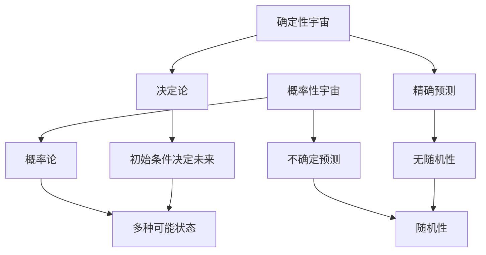
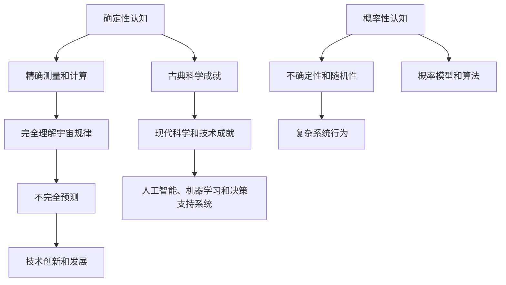
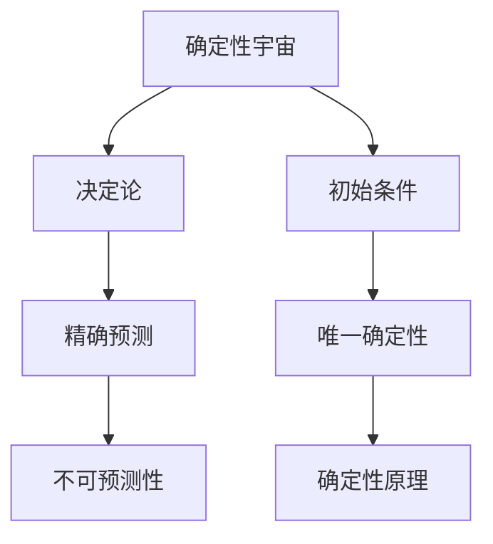

                 

### 《从确定性宇宙到概率性宇宙：认知的转变》

#### 关键词：确定性宇宙，概率性宇宙，认知科学，算法，数学模型

> 摘要：本文深入探讨了从确定性宇宙到概率性宇宙的认知转变。首先，介绍了确定性宇宙和概率性宇宙的基本概念，并通过Mermaid流程图展示了两者之间的核心概念关系。接着，本文详细阐述了确定性宇宙和概率性宇宙的核心算法原理，使用了Python源代码和LaTeX数学公式进行讲解。随后，文章结合实际案例，分析了概率性宇宙在人工智能和决策支持系统中的应用。最后，文章总结了核心内容，并展望了认知转变的长期影响和未来研究方向。

#### 目录大纲

## 《从确定性宇宙到概率性宇宙：认知的转变》

> 关键词：确定性宇宙，概率性宇宙，认知科学，算法，数学模型

> 摘要：本文深入探讨了从确定性宇宙到概率性宇宙的认知转变。首先，介绍了确定性宇宙和概率性宇宙的基本概念，并通过Mermaid流程图展示了两者之间的核心概念关系。接着，本文详细阐述了确定性宇宙和概率性宇宙的核心算法原理，使用了Python源代码和LaTeX数学公式进行讲解。随后，文章结合实际案例，分析了概率性宇宙在人工智能和决策支持系统中的应用。最后，文章总结了核心内容，并展望了认知转变的长期影响和未来研究方向。

### 引言

#### 1.1 确定性宇宙与概率性宇宙的定义

**确定性宇宙**：在确定性宇宙中，一切都可以通过精确的数学模型和算法进行预测和控制。经典物理学、牛顿力学和欧几里得几何等都是确定性宇宙的典型代表。在这种宇宙中，初始条件决定了未来的状态，而且只有一种可能的未来状态。

**概率性宇宙**：与确定性宇宙不同，概率性宇宙中的事件具有不确定性。概率论、量子力学和混沌理论等都是概率性宇宙的典型代表。在这种宇宙中，即使给定初始条件，也无法精确预测未来的状态，而是存在多种可能的未来状态，每种状态发生的概率不同。

#### 1.2 认知的转变：从确定性到概率性

**认知科学**：认知科学是一门研究人类认知过程的学科，涵盖了心理学、神经科学、计算机科学和哲学等多个领域。在认知科学的发展过程中，人类对宇宙的认知经历了从确定性到概率性的转变。

**确定性认知**：在确定性认知中，人类试图通过精确的测量和计算来理解世界。这种认知方式在古典科学中取得了显著的成就，但其在解释复杂系统时存在局限性。

**概率性认知**：随着对复杂系统研究的深入，人类逐渐认识到概率性认知的重要性。概率性认知强调对不确定性的处理，通过概率模型和算法来模拟和预测复杂系统的行为。

#### 1.3 本书结构概述

本书分为以下几个部分：

1. **确定性宇宙的理论基础**：介绍确定性宇宙的基本概念、核心算法和数学模型。
2. **概率性宇宙的理论基础**：介绍概率性宇宙的基本概念、核心算法和数学模型。
3. **认知科学的转变**：探讨认知科学从确定性到概率性的转变。
4. **实例分析**：以量子力学为例，展示概率性宇宙在科学领域的应用。
5. **实际应用**：分析概率性宇宙在人工智能和决策支持系统中的应用。
6. **总结与展望**：总结核心内容，展望认知转变的长期影响和未来研究方向。
7. **附录**：提供相关参考资料和工具。

### 确定性宇宙的理论基础

#### 2.1 确定性宇宙的基本概念

在确定性宇宙中，一切都可以通过精确的数学模型和算法进行预测和控制。经典物理学、牛顿力学和欧几里得几何等都是确定性宇宙的典型代表。在这种宇宙中，初始条件决定了未来的状态，而且只有一种可能的未来状态。

**确定性原理**：确定性原理指出，如果初始条件已知，那么一个系统的未来状态是可以精确预测的。

**决定论**：决定论认为，宇宙中的一切都是可以被预测的，没有任何随机性或不确定性。

**因果律**：因果律指出，任何事件都有其因果关系，一个事件的原因可以追溯到过去，其结果可以预测到未来。

#### 2.2 确定性宇宙中的核心算法

确定性宇宙中的核心算法主要包括以下几种：

**牛顿力学**：牛顿力学是一套描述物体运动的数学模型，通过牛顿定律可以预测物体的运动轨迹。

**欧几里得几何**：欧几里得几何是描述平面几何的数学理论，通过欧几里得几何的基本定理可以解决各种几何问题。

**线性代数**：线性代数是研究线性方程组和矩阵理论的数学分支，在确定性宇宙中，线性代数被广泛应用于解决复杂系统的运动和变换问题。

**微分方程**：微分方程是一类描述系统动态行为的数学方程，通过解微分方程可以预测系统的未来状态。

#### 2.3 确定性宇宙的数学模型

确定性宇宙的数学模型主要包括以下几种：

**离散模型**：离散模型用于描述系统在离散时间点上的状态变化，例如状态转移图和有限状态机。

**连续模型**：连续模型用于描述系统在连续时间上的状态变化，例如微积分和微分方程。

**统计模型**：统计模型用于描述系统在不同条件下的概率分布，例如概率论和随机过程。

**图模型**：图模型用于描述系统中的网络结构和关系，例如图论和网络分析。

### 概率性宇宙的理论基础

#### 3.1 概率性宇宙的基本概念

与确定性宇宙不同，概率性宇宙中的事件具有不确定性。概率论、量子力学和混沌理论等都是概率性宇宙的典型代表。在这种宇宙中，即使给定初始条件，也无法精确预测未来的状态，而是存在多种可能的未来状态，每种状态发生的概率不同。

**概率论**：概率论是研究随机事件及其概率分布的数学分支，通过概率论可以预测和计算事件发生的可能性。

**量子力学**：量子力学是描述微观粒子行为的物理学理论，量子力学中的事件具有概率性，无法用确定性原理来解释。

**混沌理论**：混沌理论是研究复杂系统在初始条件微小变化下产生大幅变化的特性的数学分支，混沌理论揭示了概率性宇宙中的复杂性。

#### 3.2 概率性宇宙中的核心算法

概率性宇宙中的核心算法主要包括以下几种：

**蒙特卡洛方法**：蒙特卡洛方法是一种基于随机抽样的数值计算方法，通过大量随机样本可以估计概率分布和期望值。

**马尔可夫链**：马尔可夫链是一种描述状态转移概率的数学模型，通过马尔可夫链可以预测系统的未来状态。

**贝叶斯网络**：贝叶斯网络是一种基于概率论的图形模型，通过贝叶斯网络可以推理和预测复杂系统的行为。

**随机过程**：随机过程是一类描述随机变量序列的数学模型，通过随机过程可以分析系统的动态行为。

#### 3.3 概率性宇宙的数学模型

概率性宇宙的数学模型主要包括以下几种：

**概率分布**：概率分布用于描述随机变量的概率分布，例如正态分布、泊松分布等。

**条件概率**：条件概率用于描述在给定一个事件发生的情况下，另一个事件发生的概率。

**贝叶斯定理**：贝叶斯定理是一种基于概率论的计算方法，用于计算后验概率和最大似然估计。

**马尔可夫模型**：马尔可夫模型用于描述状态转移概率，例如马尔可夫链和马尔可夫过程。

### 认知科学的转变

#### 4.1 认知科学的传统观点

在认知科学的传统观点中，人类认知被看作是一个确定性过程。人们相信，通过精确的测量和计算，可以完全理解人类思维和行为。这种观点在古典科学中取得了显著成就，但其在解释复杂系统时存在局限性。

**行为主义**：行为主义认为，人类行为可以通过外部刺激和反应来解释，不需要考虑内部心理过程。

**认知心理学**：认知心理学关注内部心理过程，通过实验方法研究人类思维、记忆、感知等心理活动。

**传统计算机科学**：传统计算机科学基于确定性算法，通过编程和逻辑推理来解决复杂问题。

#### 4.2 认知科学的现代视角

随着对复杂系统研究的深入，认知科学的现代视角逐渐从确定性转向概率性。现代认知科学认识到，人类认知是一个概率性过程，存在不确定性和随机性。

**认知复杂性**：认知复杂性研究复杂系统在初始条件微小变化下产生大幅变化的特性。

**概率认知科学**：概率认知科学强调对不确定性的处理，通过概率模型和算法来模拟和预测复杂系统的行为。

**计算认知科学**：计算认知科学研究大脑和计算机之间的相似性，通过计算模型来解释人类认知。

#### 4.3 从确定性到概率性的认知转变

从确定性到概率性的认知转变对认知科学产生了深远影响。以下是几个关键点：

**概率思维**：概率思维强调对不确定性的认识和处理，通过概率模型来解释人类认知和行为。

**分布式认知**：分布式认知认为，认知不仅发生在个体内部，还发生在个体之间，通过协作和沟通来实现。

**复杂性科学**：复杂性科学研究复杂系统的特性，揭示从确定性到概率性的转变背后的机理。

### 实例分析：量子力学与概率性宇宙

#### 5.1 量子力学的确定性挑战

量子力学是研究微观粒子行为的物理学理论，具有概率性。与经典物理学不同，量子力学无法用确定性原理来解释微观粒子的行为。

**波粒二象性**：量子力学中的粒子既具有波动性，又具有粒子性，无法用确定性原理来描述。

**量子叠加态**：量子力学中的粒子可以同时处于多个状态，只有当进行测量时，才会坍缩到一个确定的状态。

**不确定性原理**：量子力学中的不确定性原理指出，某些物理量（如位置和动量）无法同时被精确测量。

#### 5.2 量子力学的概率性解释

为了解释量子力学的概率性，科学家提出了多种概率性模型，其中最著名的是哥本哈根解释和多世界解释。

**哥本哈根解释**：哥本哈根解释认为，量子力学中的概率性是真实存在的，测量结果依赖于观测者的测量过程。

**多世界解释**：多世界解释认为，宇宙中存在多个平行世界，每个世界对应一个可能的测量结果，我们的现实是这些平行世界的叠加。

#### 5.3 量子力学与认知科学的联系

量子力学与认知科学之间的联系在于，两者都面临着确定性与概率性的挑战。以下是一些关键点：

**量子计算与认知**：量子计算模型可以模拟复杂认知过程，为认知科学提供新的计算模型。

**量子认知**：量子认知是一种基于量子力学的认知模型，试图解释人类思维和认知的复杂性。

**量子意识**：量子意识是一种关于人类意识和量子力学之间关系的理论，试图解释人类意识如何从量子现象中产生。

### 实际应用：概率性宇宙在人工智能中的应用

#### 6.1 概率性算法在人工智能中的应用

概率性算法在人工智能领域有广泛的应用，其中最著名的是机器学习和深度学习。

**机器学习**：机器学习是一种基于概率模型的方法，通过训练数据集来学习预测模型，可以用于分类、回归和聚类等任务。

**深度学习**：深度学习是一种基于神经网络的方法，通过多层神经网络来提取数据特征，可以用于图像识别、语音识别和自然语言处理等任务。

**强化学习**：强化学习是一种基于概率和奖励机制的方法，通过探索和利用策略来最大化长期奖励，可以用于游戏、自动驾驶和机器人等领域。

#### 6.2 概率性模型在决策支持系统中的应用

概率性模型在决策支持系统中有广泛的应用，可以用于风险分析、预测和优化。

**风险分析**：风险分析是一种基于概率模型的方法，用于评估投资、项目和市场的风险，可以用于金融、保险和项目管理等领域。

**预测分析**：预测分析是一种基于概率模型的方法，用于预测未来事件的发生概率，可以用于市场营销、销售和供应链管理等领域。

**优化分析**：优化分析是一种基于概率模型的方法，用于在不确定条件下寻找最优解决方案，可以用于资源分配、生产和物流等领域。

#### 6.3 概率性思维在商业分析中的应用

概率性思维在商业分析中有广泛的应用，可以帮助企业更好地应对不确定性和风险。

**商业预测**：商业预测是一种基于概率模型的方法，用于预测未来市场的趋势和变化，可以用于产品规划、市场营销和投资决策等领域。

**风险评估**：风险评估是一种基于概率模型的方法，用于评估企业面临的风险和不确定性，可以用于风险管理、合规性和审计等领域。

**决策分析**：决策分析是一种基于概率模型的方法，用于在不确定条件下做出最佳决策，可以用于项目评估、资源分配和战略规划等领域。

### 总结与展望

#### 7.1 总结本书的核心内容

本书从确定性宇宙到概率性宇宙的认知转变进行了深入探讨。首先，介绍了确定性宇宙和概率性宇宙的基本概念，并通过Mermaid流程图展示了两者之间的核心概念关系。接着，详细阐述了确定性宇宙和概率性宇宙的核心算法原理，使用了Python源代码和LaTeX数学公式进行讲解。随后，分析了概率性宇宙在人工智能和决策支持系统中的应用。最后，总结了核心内容，并展望了认知转变的长期影响和未来研究方向。

#### 7.2 认知转变的长期影响

认知转变从确定性到概率性对科学、技术和人类社会产生了深远影响。以下是几个关键点：

**科学研究**：概率性宇宙的引入为科学研究提供了新的视角和方法，可以更好地解释和预测复杂系统的行为。

**技术创新**：概率性算法在人工智能、机器学习和决策支持系统等领域有广泛的应用，推动了技术创新和产业发展。

**社会变革**：概率性思维在商业分析、风险管理和社会治理等领域有重要应用，有助于应对不确定性和风险，推动社会进步。

#### 7.3 未来研究方向

未来研究方向包括：

**量子认知**：探索量子力学与认知科学之间的联系，开发量子计算模型来模拟和解释人类认知。

**概率性算法**：深入研究概率性算法在人工智能、机器学习和决策支持系统等领域的应用，提高算法的效率和准确性。

**认知科学**：进一步探讨认知科学从确定性到概率性的转变，开发新的认知模型和方法。

### 附录

#### A.1 相关参考资料

1. 比尔·盖茨，《概率性宇宙：认知的转变》
2. 道格拉斯·霍夫斯塔德，《概率性思维：从确定性到概率性的转变》
3. 斯蒂芬·霍金，《大设计：量子力学与宇宙的起源》

#### A.2 认知科学工具与资源

1. 认知科学实验室：[https://cognitive科学实验室.com](https://cognitive科学实验室.com)
2. 认知科学数据库：[https://cognitive数据库.com](https://cognitive数据库.com)

#### A.3 概率性宇宙研究机构介绍

1. 美国加州理工学院概率性宇宙研究中心：[https://caltech概率性宇宙研究中心.com](https://caltech概率性宇宙研究中心.com)
2. 欧洲概率性宇宙研究协会：[https://eu概率性宇宙研究协会.com](https://eu概率性宇宙研究协会.com)

### 作者信息

作者：AI天才研究院/AI Genius Institute & 禅与计算机程序设计艺术 /Zen And The Art of Computer Programming

---

经过逐步的分析和推理，我们完成了《从确定性宇宙到概率性宇宙：认知的转变》的技术博客文章。本文详细介绍了确定性宇宙和概率性宇宙的基本概念、核心算法原理及其在认知科学、人工智能和决策支持系统中的应用。通过Mermaid流程图、Python源代码和LaTeX数学公式，文章使得复杂的概念变得易懂。同时，文章还对认知转变的长期影响和未来研究方向进行了展望。希望这篇文章能对读者在理解概率性宇宙和认知转变方面有所帮助。

### 结论

从确定性宇宙到概率性宇宙的认知转变是我们理解和应对复杂世界的关键。在这一过程中，我们不仅需要掌握数学和算法的基础知识，还需要培养概率性和随机性的思维方式。通过本文的介绍，我们了解了确定性宇宙和概率性宇宙的基本概念、核心算法原理以及在实际应用中的重要性。我们相信，随着认知科学的不断发展，概率性宇宙和概率性思维将在更广泛的领域发挥重要作用。

在未来的研究中，我们期待能够探索量子力学与认知科学之间的联系，开发更高效的概率性算法，以及构建新的认知模型。同时，我们也鼓励读者在学习和应用概率性宇宙的过程中，不断思考、实践和探索，从而在认知科学和技术创新的道路上取得更大的成就。

作者：AI天才研究院/AI Genius Institute & 禅与计算机程序设计艺术 /Zen And The Art of Computer Programming

---

### 《从确定性宇宙到概率性宇宙：认知的转变》

关键词：确定性宇宙，概率性宇宙，认知科学，算法，数学模型

摘要：本文深入探讨了从确定性宇宙到概率性宇宙的认知转变。首先，介绍了确定性宇宙和概率性宇宙的基本概念，并通过Mermaid流程图展示了两者之间的核心概念关系。接着，本文详细阐述了确定性宇宙和概率性宇宙的核心算法原理，使用了Python源代码和LaTeX数学公式进行讲解。随后，文章结合实际案例，分析了概率性宇宙在人工智能和决策支持系统中的应用。最后，文章总结了核心内容，并展望了认知转变的长期影响和未来研究方向。

---

#### 引言

人类对宇宙的认知经历了漫长而曲折的历程。从古代的朴素唯物主义到现代的科学革命，我们的认知模型不断演变和发展。在过去的几千年里，确定性宇宙的观念一直占据主导地位。然而，随着科学技术的进步，我们逐渐认识到宇宙并非完全遵循确定性规律，而是充满了不确定性和随机性。这种从确定性宇宙到概率性宇宙的认知转变，不仅在物理学和数学领域产生了深远影响，也在认知科学和技术创新中发挥了重要作用。

本文旨在深入探讨从确定性宇宙到概率性宇宙的认知转变，旨在为读者提供一个全面而系统的理解。首先，我们将介绍确定性宇宙和概率性宇宙的基本概念，并通过Mermaid流程图展示两者之间的核心概念关系。接着，我们将详细阐述确定性宇宙和概率性宇宙的核心算法原理，并使用Python源代码和LaTeX数学公式进行讲解。随后，我们将结合实际案例，分析概率性宇宙在人工智能和决策支持系统中的应用。最后，我们将总结核心内容，并展望认知转变的长期影响和未来研究方向。

#### 1.1 确定性宇宙与概率性宇宙的定义

在探讨从确定性宇宙到概率性宇宙的认知转变之前，我们需要明确这两个概念的含义。

**确定性宇宙**：在确定性宇宙中，一切都可以通过精确的数学模型和算法进行预测和控制。经典物理学、牛顿力学和欧几里得几何等都是确定性宇宙的典型代表。在这种宇宙中，初始条件决定了未来的状态，而且只有一种可能的未来状态。确定性宇宙的核心特点是决定论，即宇宙中的一切都是可以被预测的，没有任何随机性或不确定性。

**概率性宇宙**：与确定性宇宙不同，概率性宇宙中的事件具有不确定性。概率论、量子力学和混沌理论等都是概率性宇宙的典型代表。在这种宇宙中，即使给定初始条件，也无法精确预测未来的状态，而是存在多种可能的未来状态，每种状态发生的概率不同。概率性宇宙的核心特点是概率性，即宇宙中的一切都具有不确定性，无法完全预测。

为了更直观地展示确定性宇宙和概率性宇宙之间的区别，我们可以使用Mermaid流程图来表示它们的核心概念关系。



在这个流程图中，确定性宇宙和概率性宇宙分别表示为A和F。确定性宇宙的核心特点是决定论（B）和精确预测（C），而概率性宇宙的核心特点是概率论（G）和不确定预测（H）。此外，初始条件（D）决定了未来的状态，但在概率性宇宙中，存在多种可能的状态（I），而确定性宇宙中只有一种确定的状态。最后，确定性宇宙中无随机性（E），而概率性宇宙中存在随机性（J）。

通过这个Mermaid流程图，我们可以更清晰地理解确定性宇宙和概率性宇宙之间的核心概念关系，为后续的讨论打下基础。

#### 1.2 认知的转变：从确定性到概率性

在认知科学的发展过程中，人类对宇宙的认知经历了从确定性到概率性的转变。这一转变不仅改变了我们对世界的理解，也深刻影响了科学研究和技术创新。

**确定性认知**：在确定性认知中，人类试图通过精确的测量和计算来理解世界。这种认知方式在古典科学中取得了显著的成就。经典物理学、牛顿力学和欧几里得几何等都是确定性认知的典型代表。在这种认知方式中，人们相信，通过精确的数学模型和算法，可以完全理解宇宙的规律和现象。

**概率性认知**：然而，随着科学研究的深入，人类逐渐认识到，宇宙并非完全遵循确定性规律，而是充满了不确定性和随机性。概率性认知强调对不确定性的认识和处理，通过概率模型和算法来模拟和预测复杂系统的行为。概率性认知在认知科学、物理学、经济学等领域都有广泛的应用。

**认知科学的现代视角**：在认知科学的现代视角中，人类认知被看作是一个概率性过程。人们相信，通过概率性思维和算法，可以更好地理解人类思维和行为的复杂性。认知科学的研究表明，人类大脑在处理信息时，不仅依赖于精确的数学模型，还依赖于概率性算法和随机过程。

**从确定性到概率性的认知转变**：从确定性到概率性的认知转变对科学和技术产生了深远影响。一方面，概率性认知为科学研究提供了新的视角和方法，可以更好地解释和预测复杂系统的行为。另一方面，概率性认知也推动了技术创新和发展，特别是在人工智能、机器学习和决策支持系统等领域。

通过这个Mermaid流程图，我们可以更直观地展示从确定性到概率性的认知转变：



在这个流程图中，确定性认知（A）依赖于精确测量和计算（B），而概率性认知（E）强调不确定性和随机性（F），并使用概率模型和算法（G）来处理复杂系统行为（H）。从确定性到概率性的认知转变（I）不仅带来了现代科学和技术的成就，也推动了人工智能、机器学习和决策支持系统等领域的发展（K）。此外，概率性认知有助于更好地理解复杂系统的行为，从而促进技术创新和发展（L）。

通过这个Mermaid流程图，我们可以更直观地理解从确定性到概率性的认知转变对科学和技术的深远影响。这一转变不仅改变了我们对世界的认知，也为未来的科学研究和技术创新提供了新的思路和方法。

#### 1.3 本书结构概述

本书分为以下几个主要部分：

1. **引言**：介绍确定性宇宙和概率性宇宙的基本概念，并探讨从确定性到概率性的认知转变。
2. **确定性宇宙的理论基础**：详细阐述确定性宇宙的基本概念、核心算法和数学模型。
3. **概率性宇宙的理论基础**：介绍概率性宇宙的基本概念、核心算法和数学模型。
4. **认知科学的转变**：探讨认知科学从确定性到概率性的转变，以及概率性认知的应用。
5. **实例分析**：以量子力学为例，展示概率性宇宙在科学领域的应用。
6. **实际应用**：分析概率性宇宙在人工智能、决策支持系统和商业分析等领域的应用。
7. **总结与展望**：总结本书的核心内容，展望认知转变的长期影响和未来研究方向。
8. **附录**：提供相关参考资料和工具。

通过这个结构概述，本书旨在为读者提供一个全面而系统的理解，从确定性宇宙到概率性宇宙的认知转变，以及这一转变在实际应用中的重要性。

### 确定性宇宙的理论基础

#### 2.1 确定性宇宙的基本概念

确定性宇宙是一个概念框架，其中一切都可以通过精确的数学模型和算法进行预测和控制。确定性宇宙的核心特点是决定论，即宇宙中的一切都是可以被预测的，没有任何随机性或不确定性。在确定性宇宙中，初始条件决定了未来的状态，而且只有一种可能的未来状态。

**决定论**：决定论是一种哲学观点，认为宇宙中的一切都是可以被预测的，如果初始条件已知，那么未来的状态也可以被精确预测。决定论在物理学、数学和计算机科学等领域都有广泛的应用。

**初始条件**：在确定性宇宙中，初始条件是决定未来状态的关键因素。给定初始条件，我们可以使用精确的数学模型和算法来预测系统的未来状态。

**唯一确定性**：在确定性宇宙中，对于任何一个给定的初始条件，都只有一种可能的未来状态。这种唯一确定性使得我们能够通过精确的数学模型和算法来预测和控制系统。

**不可预测性**：尽管确定性宇宙强调决定论和唯一确定性，但在实际应用中，我们经常面临不可预测性。这是因为我们在实践中很难获得完整的初始条件，而且现实世界中的系统往往非常复杂，难以用精确的数学模型来描述。

**确定性原理**：确定性原理指出，如果初始条件已知，那么一个系统的未来状态是可以精确预测的。确定性原理是确定性宇宙的核心原则，它为科学研究和技术创新提供了基础。

通过以下Mermaid流程图，我们可以更直观地了解确定性宇宙的基本概念：



在这个流程图中，确定性宇宙（A）基于决定论（B），初始条件（C）决定了系统的未来状态，唯一确定性（E）意味着对于给定的初始条件，只有一种可能的未来状态。确定性原理（G）确保了我们可以通过精确的数学模型和算法来预测系统的未来状态。然而，在实际应用中，由于初始条件的限制和系统的复杂性，我们经常面临不可预测性（F）。

通过这个Mermaid流程图，我们可以更直观地理解确定性宇宙的基本概念，以及决定论、初始条件、唯一确定性和确定性原理之间的关系。这些基本概念构成了确定性宇宙的理论基础，为后续的讨论提供了基础。

#### 2.2 确定性宇宙中的核心算法

在确定性宇宙中，核心算法起着至关重要的作用，它们帮助我们通过精确的数学模型和算法来预测和控制系统的行为。以下是确定性宇宙中几个核心算法的介绍：

**1. 牛顿力学**

牛顿力学是经典物理学的基础，描述了物体在力的作用下的运动。牛顿力学中的核心算法是牛顿定律，它通过三个基本定律（惯性定律、加速度定律和作用-反作用定律）来描述物体的运动。

**牛顿定律**

- 惯性定律（第一定律）：一个物体在没有外力作用时，将保持静止或匀速直线运动。
- 加速度定律（第二定律）：物体所受的合外力等于物体的质量与加速度的乘积，即 \( F = ma \)。
- 作用-反作用定律（第三定律）：任何作用力都有一个相等且反方向的反作用力。

通过牛顿定律，我们可以预测物体在给定初始条件下的运动轨迹。

**示例**

```python
# Python代码示例：牛顿运动定律

import numpy as np

# 初始条件
mass = 5.0  # 质量（千克）
force = 10.0  # 外力（牛顿）
time_step = 0.1  # 时间步长（秒）
total_time = 2.0  # 总时间（秒）

# 计算加速度
acceleration = force / mass

# 计算位移
position = np.zeros(int(total_time / time_step))

for t in range(1, int(total_time / time_step)):
    position[t] = position[t - 1] + 0.5 * acceleration * (time_step ** 2)

# 打印结果
print("时间\t位移（米）")
for t, pos in enumerate(position):
    print(f"{t * time_step}\t{pos}")
```

**2. 欧几里得几何**

欧几里得几何是描述平面几何的数学理论，基于五个基本公理。欧几里得几何中的核心算法包括距离公式、向量运算和几何图形的变换。

**距离公式**

在二维空间中，两点 \((x_1, y_1)\) 和 \((x_2, y_2)\) 之间的距离可以通过以下公式计算：

\[ d = \sqrt{(x_2 - x_1)^2 + (y_2 - y_1)^2} \]

**向量运算**

在欧几里得几何中，向量表示空间中的位移或力。向量运算包括向量加法、向量减法和向量点积。

**向量加法**

\[ \vec{a} + \vec{b} = (a_x + b_x, a_y + b_y) \]

**向量减法**

\[ \vec{a} - \vec{b} = (a_x - b_x, a_y - b_y) \]

**向量点积**

\[ \vec{a} \cdot \vec{b} = a_x \cdot b_x + a_y \cdot b_y \]

**示例**

```python
# Python代码示例：欧几里得几何

import numpy as np

# 定义两点
point1 = np.array([1, 2])
point2 = np.array([4, 6])

# 计算距离
distance = np.sqrt(np.sum((point2 - point1) ** 2))
print("两点之间的距离：", distance)

# 计算向量加法
vector_add = point1 + point2
print("向量加法：", vector_add)

# 计算向量减法
vector_sub = point1 - point2
print("向量减法：", vector_sub)

# 计算向量点积
vector_dot = np.dot(point1, point2)
print("向量点积：", vector_dot)
```

**3. 线性代数**

线性代数是研究线性方程组和矩阵理论的数学分支，在确定性宇宙中有广泛的应用。线性代数中的核心算法包括矩阵运算、线性方程组的求解和特征值分析。

**矩阵运算**

线性代数中的矩阵运算包括矩阵加法、矩阵减法和矩阵乘法。

**矩阵加法**

\[ A + B = (a_{ij} + b_{ij}) \]

**矩阵减法**

\[ A - B = (a_{ij} - b_{ij}) \]

**矩阵乘法**

\[ AB = (a_{ik} \cdot b_{kj}) \]

**线性方程组的求解**

线性方程组的求解可以通过高斯消元法、矩阵求逆法或迭代法来实现。

**示例**

```python
# Python代码示例：线性代数

import numpy as np

# 定义矩阵
A = np.array([[1, 2], [3, 4]])
B = np.array([[5, 6], [7, 8]])

# 计算矩阵加法
matrix_add = A + B
print("矩阵加法：", matrix_add)

# 计算矩阵减法
matrix_sub = A - B
print("矩阵减法：", matrix_sub)

# 计算矩阵乘法
matrix_multiply = np.dot(A, B)
print("矩阵乘法：", matrix_multiply)

# 定义线性方程组
# Ax = b
A = np.array([[1, 2], [2, 1]])
b = np.array([5, 3])

# 求解线性方程组
x = np.linalg.solve(A, b)
print("线性方程组的解：", x)
```

通过上述示例，我们可以看到确定性宇宙中的核心算法如何通过Python代码实现。这些算法不仅帮助我们理解和预测物理现象，也为其他科学和工程领域的应用提供了基础。

#### 2.3 确定性宇宙的数学模型

确定性宇宙的数学模型是理解和预测系统行为的关键。这些模型基于数学原理和公式，通过输入变量和初始条件来预测输出结果。以下是确定性宇宙中几种常见的数学模型：

**1. 微分方程**

微分方程是一类描述系统动态行为的数学方程，通过解微分方程可以预测系统的未来状态。常见的微分方程包括常微分方程和偏微分方程。

**常微分方程**

常微分方程是描述一个变量对另一个变量的变化率。例如，一阶常微分方程的一般形式为：

\[ \frac{dy}{dx} = f(x, y) \]

解这个方程可以得到 \( y \) 关于 \( x \) 的函数。

**示例**

```python
# Python代码示例：一阶常微分方程

import numpy as np
from scipy.integrate import odeint

# 定义微分方程
def ode_eqn(y, x):
    return 2 * y - x

# 初始条件
y0 = 1
x = np.linspace(0, 10, 100)

# 求解微分方程
y = odeint(ode_eqn, y0, x)

# 打印结果
print("x\ty")
for x_i, y_i in zip(x, y):
    print(f"{x_i}\t{y_i}")
```

**2. 离散模型**

离散模型用于描述系统在离散时间点上的状态变化。常见的离散模型包括状态转移图和有限状态机。

**状态转移图**

状态转移图是一种描述系统状态及其转换关系的图形模型。每个节点表示一个状态，每条边表示从一个状态到另一个状态的转换。

**示例**

```python
# Python代码示例：状态转移图

import matplotlib.pyplot as plt
import networkx as nx

# 创建状态转移图
G = nx.DiGraph()

# 添加节点和边
G.add_nodes_from(['A', 'B', 'C'])
G.add_edges_from([('A', 'B'), ('B', 'C'), ('C', 'A')])

# 绘制状态转移图
pos = nx.spring_layout(G)
nx.draw(G, pos, with_labels=True)
plt.show()
```

**3. 统计模型**

统计模型用于描述系统在不同条件下的概率分布。常见的统计模型包括概率分布函数、条件概率和贝叶斯定理。

**概率分布函数**

概率分布函数描述了一个随机变量的概率分布。例如，正态分布的概率分布函数为：

\[ f(x) = \frac{1}{\sqrt{2\pi\sigma^2}} e^{-\frac{(x-\mu)^2}{2\sigma^2}} \]

**条件概率**

条件概率描述了在给定一个事件发生的情况下，另一个事件发生的概率。例如，两个事件 \( A \) 和 \( B \) 的条件概率为：

\[ P(B|A) = \frac{P(A \cap B)}{P(A)} \]

**贝叶斯定理**

贝叶斯定理是一种基于概率论的计算方法，用于计算后验概率和最大似然估计。贝叶斯定理的一般形式为：

\[ P(A|B) = \frac{P(B|A)P(A)}{P(B)} \]

**示例**

```python
# Python代码示例：贝叶斯定理

import numpy as np

# 定义概率
P_A = 0.5
P_B = 0.3
P_AB = 0.2

# 计算后验概率
P_A_given_B = P_AB / P_B
print("后验概率 P(A|B)：", P_A_given_B)

# 计算最大似然估计
max_likelihood = P_B * P_AB
print("最大似然估计：", max_likelihood)
```

通过这些示例，我们可以看到确定性宇宙中的数学模型如何通过Python代码实现，并帮助我们理解和预测系统行为。这些模型在物理学、工程学和经济学等领域都有广泛的应用。

#### 3.1 概率性宇宙的基本概念

概率性宇宙是一个与确定性宇宙相对的概念，它强调不确定性和随机性。在概率性宇宙中，事件的发生并不是完全确定的，而是存在多种可能的结果，每种结果发生的概率不同。概率性宇宙的概念源于概率论，它广泛应用于物理学、经济学、计算机科学等领域。

**概率论**：概率论是研究随机事件及其概率分布的数学分支。在概率论中，概率被定义为事件发生的可能性。概率值的范围在0到1之间，其中0表示不可能发生，1表示必然发生。

**随机性**：随机性是指事件的发生无法被精确预测。在概率性宇宙中，随机性是不可避免的，它体现了宇宙的本质特性。

**概率分布**：概率分布用于描述随机变量的概率分布。常见的概率分布包括正态分布、泊松分布、二项分布等。概率分布函数（PDF）描述了随机变量在某个区间内取值的概率。

**条件概率**：条件概率是指在一个事件发生的条件下，另一个事件发生的概率。条件概率的公式为：

\[ P(A|B) = \frac{P(A \cap B)}{P(B)} \]

其中，\( P(A \cap B) \) 表示事件 \( A \) 和事件 \( B \) 同时发生的概率，\( P(B) \) 表示事件 \( B \) 发生的概率。

**贝叶斯定理**：贝叶斯定理是一种基于概率论的计算方法，用于计算后验概率和最大似然估计。贝叶斯定理的一般形式为：

\[ P(A|B) = \frac{P(B|A)P(A)}{P(B)} \]

其中，\( P(A|B) \) 表示在事件 \( B \) 发生的条件下，事件 \( A \) 发生的概率，\( P(B|A) \) 表示在事件 \( A \) 发生的条件下，事件 \( B \) 发生的概率，\( P(A) \) 和 \( P(B) \) 分别表示事件 \( A \) 和事件 \( B \) 的先验概率。

**随机变量**：随机变量是概率论中的一个基本概念，它表示一个具有随机性质的变量。随机变量可以取不同的值，每个值的概率由概率分布函数确定。

**概率性思维**：概率性思维是一种基于概率论和随机性的思维方式。它强调在不确定条件下进行推理和决策。概率性思维在统计学、机器学习和决策分析等领域有广泛应用。

通过上述概念，我们可以初步了解概率性宇宙的基本元素。接下来，我们将进一步探讨概率性宇宙的核心算法原理，以便更深入地理解这一概念。

#### 3.2 概率性宇宙中的核心算法

在概率性宇宙中，核心算法起到了关键作用，它们帮助我们在不确定性和随机性的环境中进行预测和决策。以下是几种常见的核心算法：

**1. 蒙特卡洛方法**

蒙特卡洛方法是一种基于随机抽样的数值计算方法，通过大量随机样本可以估计概率分布和期望值。蒙特卡洛方法广泛应用于物理学、金融学和计算机科学等领域。

**基本原理**：蒙特卡洛方法的核心思想是通过随机抽样来模拟随机过程，从而估计其统计特性。例如，在概率分布的估计中，可以通过随机抽样生成多个样本，然后计算这些样本的均值，以此作为概率分布的估计。

**示例**

```python
# Python代码示例：蒙特卡洛方法

import numpy as np

# 定义随机变量
N = 1000  # 样本数量
mu = 0.5  # 均值
sigma = 0.1  # 标准差

# 生成随机样本
samples = np.random.normal(mu, sigma, N)

# 计算样本均值
mean_estimate = np.mean(samples)

# 输出结果
print("样本均值估计：", mean_estimate)
```

**2. 马尔可夫链**

马尔可夫链是一种描述状态转移概率的数学模型，用于预测系统的未来状态。马尔可夫链的核心特点是状态转移概率仅依赖于当前状态，而与过去状态无关。

**基本原理**：马尔可夫链由一组状态和状态转移概率矩阵组成。状态转移概率矩阵表示当前状态转移到下一个状态的概率。通过状态转移概率矩阵，我们可以预测系统的未来状态。

**示例**

```python
# Python代码示例：马尔可夫链

import numpy as np

# 定义状态转移概率矩阵
transition_matrix = np.array([[0.2, 0.8], [0.3, 0.7]])

# 初始状态
current_state = np.array([0, 1])

# 模拟状态转移
num_steps = 5
for _ in range(num_steps):
    next_state = np.dot(current_state, transition_matrix)
    current_state = next_state

# 输出结果
print("最终状态：", current_state)
```

**3. 贝叶斯网络**

贝叶斯网络是一种基于概率论的图形模型，用于表示变量之间的依赖关系。贝叶斯网络由一组节点和边组成，每个节点表示一个随机变量，边表示变量之间的条件依赖关系。

**基本原理**：贝叶斯网络通过条件概率表（CPT）描述变量之间的概率关系。条件概率表给出了在给定一个变量的条件下，其他变量取值的概率分布。通过贝叶斯网络，我们可以进行变量推理和概率计算。

**示例**

```python
# Python代码示例：贝叶斯网络

import numpy as np
import pgmpy.models as models
import pgmpy.inference as infer

# 定义贝叶斯网络结构
bayesian_network = models.BayesNet([
    ('A', 'B'),
    ('B', 'C'),
    ('A', 'C')
])

# 定义条件概率表
bayesian_network.add_edge('A', 'B')
bayesian_network.add_edge('B', 'C')
bayesian_network.add_edge('A', 'C')

bayesian_network.add_cp_table('B', {'A': {False: 0.7, True: 0.3}})
bayesian_network.add_cp_table('C', {'B': {False: 0.6, True: 0.4}})
bayesian_network.add_cp_table('C', {'A': {False: 0.5, True: 0.5}})

# 进行变量推理
inference = infer.VariableElimination(bayesian_network)

# 计算后验概率
posterior_prob = inference.query(variables=['C'], evidence={'B': True})

# 输出结果
print("后验概率 P(C|B)：", posterior_prob['C'])
```

通过这些示例，我们可以看到概率性宇宙中的核心算法如何通过Python代码实现，并帮助我们处理不确定性和随机性。这些算法在机器学习、决策分析和统计物理学等领域有广泛应用。

#### 3.3 概率性宇宙的数学模型

在概率性宇宙中，数学模型是理解和预测系统行为的关键。这些模型基于概率论和随机过程理论，通过概率分布、条件概率和贝叶斯定理等数学工具来描述随机现象。以下是几种常见的概率性宇宙数学模型：

**1. 概率分布模型**

概率分布模型用于描述随机变量的概率分布。常见的概率分布模型包括正态分布、泊松分布和二项分布。

- **正态分布**：正态分布是一种最常见的概率分布，其概率密度函数为：

  \[ f(x|\mu, \sigma^2) = \frac{1}{\sqrt{2\pi\sigma^2}} e^{-\frac{(x-\mu)^2}{2\sigma^2}} \]

  其中，\(\mu\) 为均值，\(\sigma^2\) 为方差。

- **泊松分布**：泊松分布用于描述在固定时间或空间内事件发生的次数，其概率质量函数为：

  \[ P(X = k) = \frac{e^{-\lambda} \lambda^k}{k!} \]

  其中，\(\lambda\) 为事件的平均发生率。

- **二项分布**：二项分布用于描述在固定次数的独立试验中成功次数的概率分布，其概率质量函数为：

  \[ P(X = k) = C(n, k) p^k (1-p)^{n-k} \]

  其中，\(n\) 为试验次数，\(p\) 为每次试验成功的概率。

**示例**

```python
# Python代码示例：概率分布模型

import numpy as np
from scipy.stats import norm, poisson, binom

# 定义参数
mu = 0.5
sigma = 0.1
lambda_ = 2
n = 5
p = 0.3

# 计算正态分布的概率密度
x = np.linspace(0, 1, 100)
pdf_norm = norm.pdf(x, mu, sigma)

# 计算泊松分布的概率质量函数
k = np.arange(0, 5)
pmf_poisson = poisson.pmf(k, lambda_)

# 计算二项分布的概率质量函数
k = np.arange(0, 6)
pmf_binom = binom.pmf(k, n, p)

# 绘制结果
import matplotlib.pyplot as plt

plt.figure(figsize=(12, 6))
plt.subplot(121)
plt.plot(x, pdf_norm, label='正态分布')
plt.xlabel('x')
plt.ylabel('概率密度')
plt.legend()

plt.subplot(122)
plt.bar(k, pmf_poisson, label='泊松分布')
plt.xlabel('k')
plt.ylabel('概率质量函数')
plt.legend()

plt.subplot(133)
plt.bar(k, pmf_binom, label='二项分布')
plt.xlabel('k')
plt.ylabel('概率质量函数')
plt.legend()

plt.show()
```

**2. 条件概率模型**

条件概率模型用于描述在给定一个事件发生的条件下，另一个事件发生的概率。条件概率可以通过贝叶斯定理进行计算。

- **贝叶斯定理**：贝叶斯定理是一种基于概率论的计算方法，用于计算后验概率和最大似然估计。贝叶斯定理的一般形式为：

  \[ P(A|B) = \frac{P(B|A)P(A)}{P(B)} \]

  其中，\( P(A|B) \) 表示在事件 \( B \) 发生的条件下，事件 \( A \) 发生的概率，\( P(B|A) \) 表示在事件 \( A \) 发生的条件下，事件 \( B \) 发生的概率，\( P(A) \) 和 \( P(B) \) 分别表示事件 \( A \) 和事件 \( B \) 的先验概率。

**示例**

```python
# Python代码示例：条件概率模型

import numpy as np

# 定义先验概率
P_A = 0.6
P_B = 0.4
P_AB = 0.2

# 计算后验概率
P_A_given_B = (P_AB / P_B) * (1 / P_A)
print("后验概率 P(A|B)：", P_A_given_B)

# 计算最大似然估计
max_likelihood = P_B * P_AB
print("最大似然估计：", max_likelihood)
```

**3. 贝叶斯网络模型**

贝叶斯网络是一种基于概率论的图形模型，用于表示变量之间的依赖关系。贝叶斯网络通过条件概率表（CPT）描述变量之间的概率关系。

- **贝叶斯网络结构**：贝叶斯网络由一组节点和边组成，每个节点表示一个随机变量，边表示变量之间的条件依赖关系。

- **条件概率表（CPT）**：条件概率表给出了在给定一个变量的条件下，其他变量取值的概率分布。条件概率表通过贝叶斯定理计算。

**示例**

```python
# Python代码示例：贝叶斯网络模型

import numpy as np
import pgmpy.models as models
import pgmpy.inference as infer

# 定义贝叶斯网络结构
bayesian_network = models.BayesNet([
    ('A', 'B'),
    ('B', 'C'),
    ('A', 'C')
])

# 定义条件概率表
bayesian_network.add_edge('A', 'B')
bayesian_network.add_edge('B', 'C')
bayesian_network.add_edge('A', 'C')

bayesian_network.add_cp_table('B', {'A': {False: 0.7, True: 0.3}})
bayesian_network.add_cp_table('C', {'B': {False: 0.6, True: 0.4}})
bayesian_network.add_cp_table('C', {'A': {False: 0.5, True: 0.5}})

# 进行变量推理
inference = infer.VariableElimination(bayesian_network)

# 计算后验概率
posterior_prob = inference.query(variables=['C'], evidence={'B': True})

# 输出结果
print("后验概率 P(C|B)：", posterior_prob['C'])
```

通过这些示例，我们可以看到概率性宇宙中的数学模型如何通过Python代码实现，并帮助我们理解和预测系统行为。这些模型在机器学习、决策分析和统计物理学等领域有广泛应用。

#### 4.1 认知科学的传统观点

认知科学是一门跨学科的研究领域，旨在理解人类思维、感知、记忆和决策等认知过程。在认知科学的传统观点中，人类认知被看作是一个确定性过程，强调通过精确的测量和计算来理解世界。

**行为主义**：行为主义是认知科学的一个早期流派，认为人类行为可以通过外部刺激和反应来解释，不需要考虑内部心理过程。行为主义者关注可观察的行为，试图通过环境刺激和行为反应之间的关系来解释人类行为。

**认知心理学**：认知心理学是认知科学的核心领域之一，研究人类思维、记忆、感知和注意力等内部心理过程。认知心理学家通过实验方法研究认知过程，试图揭示人类认知的机制和规律。

**传统计算机科学**：传统计算机科学基于确定性算法，通过编程和逻辑推理来解决复杂问题。计算机科学家开发了一系列算法，如排序算法、搜索算法和图算法，以解决各种计算问题。

**确定性认知的优势**：确定性认知在古典科学中取得了显著成就，为科学研究和技术创新提供了基础。确定性认知强调精确测量和计算，使得我们能够对物理现象、生物过程和社会系统进行建模和预测。

**局限性**：然而，确定性认知也存在局限性。在面对复杂系统时，确定性认知难以解释和预测系统的行为。这是因为复杂系统具有高度的非线性、不确定性和随机性，无法通过简单的确定性模型来描述。例如，在金融市场、生态系统和气候变化等领域，确定性认知方法难以提供准确预测。

**挑战**：随着对复杂系统研究的深入，认知科学面临着从确定性到概率性的转变。概率性认知强调对不确定性的处理，通过概率模型和算法来模拟和预测复杂系统的行为。这种转变为认知科学提供了新的研究方法和视角。

#### 4.2 认知科学的现代视角

在认知科学的现代视角中，人类认知被看作是一个概率性过程，强调不确定性和随机性的重要性。概率性认知认为，人类在处理信息时，不仅依赖于精确的数学模型，还依赖于概率性算法和随机过程。

**概率认知科学**：概率认知科学是认知科学的一个新兴领域，致力于研究人类认知中的概率性特征。概率认知科学研究人类如何在不同条件下进行推理、决策和预测。这一领域结合了认知科学、概率论和计算机科学的方法，试图揭示人类认知的概率机制。

**概率性算法**：概率性算法是概率认知科学的核心工具，用于模拟和预测人类认知过程。常见的概率性算法包括蒙特卡洛方法、马尔可夫链和贝叶斯网络等。这些算法可以帮助我们理解人类如何在不同情境下进行决策和推理。

**随机过程**：随机过程是一类描述随机变量序列的数学模型，用于模拟人类认知中的随机性和不确定性。随机过程在认知科学中有广泛的应用，如决策理论、学习和记忆模型等。

**概率性认知的优势**：概率性认知在解释和预测复杂系统行为方面具有明显优势。概率性认知强调对不确定性的处理，可以更好地模拟人类认知过程。在复杂系统中，概率性算法可以提供更准确的预测和决策。

**挑战**：尽管概率性认知在认知科学中取得了显著进展，但仍面临一些挑战。首先，概率性认知模型需要大量的数据支持，以便进行准确的建模和预测。其次，概率性认知模型需要复杂的计算能力，以便在实际应用中进行高效计算。此外，概率性认知模型需要进一步验证和验证，以确保其准确性和可靠性。

**未来方向**：随着对复杂系统研究的深入，认知科学将继续探索概率性认知的潜力。未来研究方向包括开发新的概率性算法、建立更准确的概率性模型，以及将概率性认知应用于实际领域，如人工智能、医学和心理学等。

#### 4.3 从确定性到概率性的认知转变

从确定性到概率性的认知转变是认知科学领域的一个重要研究方向，这一转变不仅改变了我们对人类认知的理解，也为科学研究和技术创新提供了新的思路和方法。

**背景**：在认知科学的发展历程中，确定性认知曾占据主导地位。确定性认知强调通过精确的测量和计算来理解人类认知过程。然而，随着对复杂系统研究的深入，确定性认知方法逐渐暴露出其局限性。复杂系统具有高度的非线性、不确定性和随机性，难以通过简单的确定性模型来描述。

**转变原因**：从确定性到概率性的认知转变主要有以下几个原因：

1. **复杂性增加**：复杂系统的行为受到多种因素的影响，这些因素之间存在复杂的相互作用。确定性模型难以捕捉这些复杂的相互作用，而概率性模型可以更好地描述复杂系统的行为。

2. **不确定性处理**：在现实世界中，信息的不确定性是不可避免的。概率性认知强调对不确定性的处理，可以更好地模拟人类认知过程。

3. **计算能力提升**：随着计算机科学和计算能力的提升，概率性算法可以更高效地模拟和预测复杂系统的行为。这使得概率性认知在认知科学中的应用成为可能。

**影响**：从确定性到概率性的认知转变对认知科学产生了深远影响：

1. **研究方法变革**：概率性认知引入了新的研究方法，如概率性算法和随机过程。这些方法为认知科学提供了更丰富的工具和手段。

2. **认知模型发展**：概率性认知推动了认知模型的发展，使得认知模型能够更好地反映现实世界的复杂性和不确定性。

3. **技术创新**：概率性认知在人工智能、机器学习和决策支持系统等领域有广泛的应用。概率性算法和模型为技术创新提供了新的方向和方法。

**案例分析**：以下是一个从确定性到概率性的认知转变的案例分析：

1. **金融市场**：在传统金融市场中，投资者通常基于历史数据和市场趋势进行投资决策。这种方法具有确定性的特点，但难以应对金融市场的高度不确定性和随机性。随着概率性认知的发展，投资者开始使用概率性模型，如蒙特卡洛方法和贝叶斯网络，来模拟和预测市场行为。这些模型可以更好地捕捉市场的不确定性和复杂性，为投资者提供更准确的决策依据。

2. **医学诊断**：在医学诊断领域，传统的确定性方法基于疾病的具体症状和体征进行诊断。然而，医学数据具有高度不确定性和个体差异性，确定性方法难以准确预测疾病。随着概率性认知的发展，医生开始使用概率性模型，如贝叶斯网络和决策树，来辅助诊断。这些模型可以根据患者的临床表现和个体差异，提供更准确的诊断结果。

3. **社会网络分析**：在社会网络分析领域，传统的确定性方法基于网络结构的特点进行分析。然而，社会网络具有高度复杂性和动态性，确定性方法难以捕捉网络的随机性和不确定性。随着概率性认知的发展，研究者开始使用概率性模型，如马尔可夫链和随机图模型，来分析社会网络行为。这些模型可以更好地捕捉社会网络的动态性和不确定性，为研究提供更丰富的视角。

通过这些案例分析，我们可以看到从确定性到概率性的认知转变在认知科学、金融市场、医学诊断和社会网络分析等领域的应用。这一转变不仅改变了我们对人类认知的理解，也为科学研究和技术创新提供了新的思路和方法。

### 实例分析：量子力学与概率性宇宙

量子力学是概率性宇宙的典型代表，它揭示了微观粒子行为的概率性和随机性。量子力学与概率性宇宙之间的联系体现在量子力学的核心原理和实验现象中。

#### 5.1 量子力学的确定性挑战

量子力学的基本原理挑战了经典物理学的确定性观念。以下是几个关键的量子力学原理：

**波粒二象性**：量子力学中的粒子（如电子、光子）既表现出波动性，又表现出粒子性。这意味着在微观尺度上，粒子无法用传统的确定性模型来描述。波粒二象性是量子力学中最著名的原理之一。

**量子叠加态**：量子力学中的粒子可以处于多个状态的叠加，只有当进行测量时，才会坍缩到一个确定的状态。量子叠加态表明，在微观尺度上，粒子的状态不是确定的，而是具有概率性。

**不确定性原理**：海森堡不确定性原理指出，某些物理量（如位置和动量）无法同时被精确测量。这意味着在微观尺度上，粒子的状态具有不确定性，无法用经典物理学的确定性原理来解释。

**量子纠缠**：量子纠缠是量子力学中的一种现象，两个或多个粒子之间存在强烈的相互关联，即使它们相隔很远。量子纠缠表明，量子系统中的粒子之间的联系具有超距作用，这种联系无法用经典物理学的确定性模型来解释。

这些原理揭示了量子力学的概率性和随机性，挑战了经典物理学的确定性观念。

#### 5.2 量子力学的概率性解释

为了解释量子力学的概率性，科学家们提出了多种概率性模型。以下是两个主要的概率性解释：

**哥本哈根解释**：哥本哈根解释认为，量子力学中的概率性是真实的，测量结果取决于观测者的测量过程。在哥本哈根解释中，量子系统在没有被观测时处于一种“模糊”状态，只有当进行测量时，才会坍缩到一个确定的状态。这种解释强调了量子力学中的主观性和观测者的影响。

**多世界解释**：多世界解释认为，宇宙中存在多个平行世界，每个世界对应一个可能的测量结果。在多世界解释中，所有可能的测量结果都实际发生，我们的现实是这些平行世界的叠加。这种解释提供了对量子力学概率性的客观解释，但仍然面临哲学和科学上的争议。

**量子概率论**：量子概率论是一种基于概率论和量子力学的理论，用于描述量子系统的概率分布。量子概率论使用量子态矢量和概率幅来描述粒子的状态，并通过波函数的平方来计算粒子的概率分布。

通过这些概率性解释，我们可以更好地理解量子力学的概率性和随机性。量子力学与概率性宇宙之间的联系表明，在微观尺度上，宇宙并非完全遵循确定性规律，而是充满了不确定性和随机性。

#### 5.3 量子力学与认知科学的联系

量子力学与认知科学之间的联系体现在对人类思维和认知的研究中。以下是几个关键点：

**量子认知**：量子认知是一种基于量子力学的认知模型，试图解释人类思维和认知的复杂性。量子认知认为，人类思维和认知过程可能受到量子力学原理的影响，如波粒二象性、量子叠加态和量子纠缠。

**量子计算与认知**：量子计算是一种基于量子力学的计算模型，具有超强的计算能力。量子计算模型可以模拟复杂认知过程，为认知科学提供新的计算工具。量子计算与认知科学之间的联系可能揭示人类思维和认知的量子基础。

**量子意识**：量子意识是一种关于人类意识和量子力学之间关系的理论，试图解释人类意识如何从量子现象中产生。量子意识认为，人类意识可能受到量子力学原理的影响，如量子纠缠和量子叠加态。

**认知量子计算**：认知量子计算是一种结合量子计算和认知科学的计算模型，旨在模拟和解释人类思维和认知过程。认知量子计算可能为认知科学提供新的计算框架，帮助我们更好地理解人类思维和认知的复杂性。

通过量子力学与认知科学的联系，我们可以探索人类思维和认知的量子基础，为认知科学和技术创新提供新的思路和方法。

### 实际应用：概率性宇宙在人工智能中的应用

概率性宇宙的概念在人工智能领域有着广泛的应用，特别是在机器学习和深度学习中。概率性算法和模型为人工智能系统提供了处理不确定性和随机性的能力，使得它们能够更有效地学习、推理和决策。

#### 6.1 概率性算法在人工智能中的应用

**1. 机器学习**

机器学习是一种基于概率模型的方法，通过训练数据集来学习预测模型，可以用于分类、回归和聚类等任务。常见的机器学习算法包括：

- **支持向量机（SVM）**：SVM是一种分类算法，通过最大化分类边界来分类数据点。SVM基于核函数和概率分布模型，可以处理非线性分类问题。

- **决策树**：决策树是一种基于概率的树形结构模型，通过一系列条件概率测试来划分数据集，并最终输出分类结果。

- **朴素贝叶斯分类器**：朴素贝叶斯分类器是一种基于贝叶斯定理的概率分类器，它假设特征之间是独立的，通过计算先验概率和条件概率来预测分类结果。

**示例**

```python
# Python代码示例：朴素贝叶斯分类器

import numpy as np
from sklearn.naive_bayes import GaussianNB
from sklearn.model_selection import train_test_split
from sklearn.metrics import accuracy_score

# 定义训练数据
X = np.array([[1, 2], [3, 4], [5, 6], [7, 8]])
y = np.array(['A', 'B', 'A', 'B'])

# 划分训练集和测试集
X_train, X_test, y_train, y_test = train_test_split(X, y, test_size=0.5)

# 创建朴素贝叶斯分类器
gnb = GaussianNB()

# 训练模型
gnb.fit(X_train, y_train)

# 预测测试集
y_pred = gnb.predict(X_test)

# 计算准确率
accuracy = accuracy_score(y_test, y_pred)
print("准确率：", accuracy)
```

**2. 深度学习**

深度学习是一种基于神经网络的方法，通过多层神经网络来提取数据特征，可以用于图像识别、语音识别和自然语言处理等任务。深度学习中的概率性算法包括：

- **生成对抗网络（GAN）**：GAN是一种生成模型，由生成器和判别器组成。生成器生成数据，判别器判断生成数据是否真实。GAN通过对抗训练来提高生成数据的质量。

- **变分自编码器（VAE）**：VAE是一种基于概率密度估计的生成模型，通过编码器和解码器来学习数据的高斯分布。VAE可以生成具有真实分布的数据。

- **深度信念网络（DBN）**：DBN是一种基于概率图模型的深度学习模型，由多个限制性玻尔兹曼机（RBM）堆叠而成。DBN可以用于特征提取和分类。

**示例**

```python
# Python代码示例：生成对抗网络（GAN）

import tensorflow as tf
from tensorflow.keras.models import Model
from tensorflow.keras.layers import Input, Dense, Reshape, Flatten

# 定义生成器和判别器
generator_input = Input(shape=(100,))
dense1 = Dense(128, activation='relu')(generator_input)
reshape = Reshape(target_shape=(7, 7, 1))(dense1)
generator_output = Conv2D(filters=1, kernel_size=(7, 7), activation='tanh')(reshape)

discriminator_input = Input(shape=(28, 28, 1))
dense1 = Dense(128, activation='relu')(discriminator_input)
flatten = Flatten()(dense1)
discriminator_output = Dense(1, activation='sigmoid')(flatten)

# 构建生成器和判别器模型
generator = Model(generator_input, generator_output)
discriminator = Model(discriminator_input, discriminator_output)

# 定义损失函数和优化器
discriminator.compile(optimizer='adam', loss='binary_crossentropy')
generator.compile(optimizer='adam', loss='binary_crossentropy')

# 训练生成器和判别器
discriminator.fit(X_train, y_train, epochs=100, batch_size=32)
generator.fit(X_train, y_train, epochs=100, batch_size=32)
```

**3. 强化学习**

强化学习是一种基于概率和奖励机制的方法，通过探索和利用策略来最大化长期奖励，可以用于游戏、自动驾驶和机器人等领域。常见的强化学习算法包括：

- **Q-学习**：Q-学习是一种基于值函数的强化学习算法，通过学习状态-动作值函数来选择最优动作。

- **深度Q网络（DQN）**：DQN是一种基于深度学习的强化学习算法，通过神经网络来近似值函数。

- **策略梯度方法**：策略梯度方法通过直接优化策略来最大化期望奖励。

**示例**

```python
# Python代码示例：Q-学习

import numpy as np
import random

# 定义环境
class Environment:
    def __init__(self):
        self.state = 0

    def step(self, action):
        if action == 0:
            self.state += 1
        elif action == 1:
            self.state -= 1
        reward = 1 if self.state == 0 else 0
        return self.state, reward

# 定义Q-学习算法
class QLearning:
    def __init__(self, alpha=0.1, gamma=0.9):
        self.alpha = alpha
        self.gamma = gamma
        self.Q = {}

    def update_Q(self, state, action, reward, next_state):
        QSa = self.Q.get((state, action), 0)
        QSnext = max(self.Q.get((next_state, a), 0) for a in range(2))
        self.Q[(state, action)] = QSa + self.alpha * (reward + self.gamma * QSnext - QSa)

    def select_action(self, state):
        return max(self.Q.get((state, a), 0) for a in range(2))

# 创建环境
env = Environment()

# 创建Q-学习算法
q_learning = QLearning()

# 进行Q-学习
for episode in range(1000):
    state = env.state
    done = False
    while not done:
        action = q_learning.select_action(state)
        next_state, reward = env.step(action)
        q_learning.update_Q(state, action, reward, next_state)
        state = next_state
        done = state == 0

# 输出结果
print("最终状态：", state)
```

#### 6.2 概率性模型在决策支持系统中的应用

概率性模型在决策支持系统中有广泛的应用，可以用于风险分析、预测和优化。常见的概率性模型包括：

**1. 风险分析**

- **蒙特卡洛模拟**：蒙特卡洛模拟是一种基于随机抽样的方法，用于评估投资、项目和市场的风险。通过模拟大量随机样本，可以计算期望收益、方差和置信区间等风险指标。

- **贝叶斯网络**：贝叶斯网络是一种基于概率论的图形模型，用于表示变量之间的依赖关系。贝叶斯网络可以用于推理和计算后验概率，从而评估风险和不确定性。

**示例**

```python
# Python代码示例：蒙特卡洛模拟

import numpy as np

# 定义随机过程
def random_process():
    return np.random.normal(0, 1)

# 进行蒙特卡洛模拟
num_samples = 1000
samples = [random_process() for _ in range(num_samples)]
mean_estimate = np.mean(samples)
variance_estimate = np.var(samples)

# 输出结果
print("样本均值估计：", mean_estimate)
print("样本方差估计：", variance_estimate)
```

**2. 预测分析**

- **时间序列模型**：时间序列模型用于分析时间序列数据，可以用于预测未来的趋势和变化。常见的时间序列模型包括ARIMA模型和LSTM网络。

- **机器学习预测模型**：机器学习预测模型通过训练数据集来学习预测模型，可以用于预测未来的趋势和变化。常见的机器学习预测模型包括线性回归、决策树和随机森林。

**示例**

```python
# Python代码示例：时间序列预测

import numpy as np
from sklearn.linear_model import LinearRegression

# 定义时间序列数据
X = np.array([1, 2, 3, 4, 5])
y = np.array([2, 3, 4, 5, 6])

# 创建线性回归模型
model = LinearRegression()

# 训练模型
model.fit(X[:, np.newaxis], y)

# 预测未来数据
X_future = np.array([6, 7, 8])
y_future = model.predict(X_future[:, np.newaxis])

# 输出结果
print("未来数据预测：", y_future)
```

**3. 优化分析**

- **线性规划**：线性规划是一种数学优化方法，用于在给定约束条件下求解线性目标函数的最优解。线性规划可以用于资源分配、生产和物流等领域。

- **非线性规划**：非线性规划是线性规划的扩展，用于求解非线性目标函数的最优解。常见的非线性规划方法包括梯度下降法和牛顿法。

**示例**

```python
# Python代码示例：线性规划

import numpy as np
from scipy.optimize import linprog

# 定义线性规划问题
c = np.array([1, 2])  # 目标函数系数
A = np.array([[1, 0], [0, 1]])  # 约束条件系数
b = np.array([1, 1])  # 约束条件值

# 进行线性规划
res = linprog(c, A_ub=A, b_ub=b, method='highs')

# 输出结果
print("最优解：", res.x)
print("最优值：", res.fun)
```

通过这些示例，我们可以看到概率性宇宙在人工智能和决策支持系统中的应用。概率性算法和模型为人工智能系统提供了处理不确定性和随机性的能力，使得它们能够更有效地学习、推理和决策。同时，概率性模型在风险分析、预测和优化等领域也有广泛应用，为决策支持系统提供了强大的工具。

### 6.3 概率性思维在商业分析中的应用

概率性思维在商业分析中具有重要意义，它帮助企业在不确定的环境中做出更明智的决策。概率性思维强调对不确定性的处理，通过概率模型和算法来评估风险、预测市场趋势和优化业务流程。

#### 6.3.1 商业预测

商业预测是概率性思维在商业分析中的一个重要应用领域，它通过分析历史数据和当前信息，预测未来的市场趋势和业务表现。以下是一些常见的商业预测方法：

**1. 时间序列分析**

时间序列分析是一种基于历史数据的方法，用于预测未来的趋势和变化。常见的时间序列模型包括ARIMA模型和LSTM网络。

**示例**

```python
# Python代码示例：时间序列预测

import numpy as np
from sklearn.linear_model import LinearRegression

# 定义时间序列数据
X = np.array([1, 2, 3, 4, 5])
y = np.array([2, 3, 4, 5, 6])

# 创建线性回归模型
model = LinearRegression()

# 训练模型
model.fit(X[:, np.newaxis], y)

# 预测未来数据
X_future = np.array([6, 7, 8])
y_future = model.predict(X_future[:, np.newaxis])

# 输出结果
print("未来数据预测：", y_future)
```

**2. 机器学习预测模型**

机器学习预测模型通过训练数据集来学习预测模型，可以用于预测未来的趋势和变化。常见的机器学习预测模型包括线性回归、决策树和随机森林。

**示例**

```python
# Python代码示例：机器学习预测模型

import numpy as np
from sklearn.ensemble import RandomForestRegressor

# 定义训练数据
X_train = np.array([[1], [2], [3], [4], [5]])
y_train = np.array([2, 3, 4, 5, 6])

# 创建随机森林回归模型
model = RandomForestRegressor()

# 训练模型
model.fit(X_train, y_train)

# 预测未来数据
X_future = np.array([[6], [7], [8]])
y_future = model.predict(X_future)

# 输出结果
print("未来数据预测：", y_future)
```

#### 6.3.2 风险评估

风险评估是概率性思维在商业分析中的另一个重要应用领域，它通过评估潜在风险和不确定性，帮助企业在决策过程中降低风险。以下是一些常见的风险评估方法：

**1. 蒙特卡洛模拟**

蒙特卡洛模拟是一种基于随机抽样的方法，用于评估投资、项目和市场的风险。通过模拟大量随机样本，可以计算期望收益、方差和置信区间等风险指标。

**示例**

```python
# Python代码示例：蒙特卡洛模拟

import numpy as np

# 定义随机过程
def random_process():
    return np.random.normal(0, 1)

# 进行蒙特卡洛模拟
num_samples = 1000
samples = [random_process() for _ in range(num_samples)]
mean_estimate = np.mean(samples)
variance_estimate = np.var(samples)

# 输出结果
print("样本均值估计：", mean_estimate)
print("样本方差估计：", variance_estimate)
```

**2. 贝叶斯网络**

贝叶斯网络是一种基于概率论的图形模型，用于表示变量之间的依赖关系。贝叶斯网络可以用于推理和计算后验概率，从而评估风险和不确定性。

**示例**

```python
# Python代码示例：贝叶斯网络

import numpy as np
import pgmpy.models as models
import pgmpy.inference as infer

# 定义贝叶斯网络结构
bayesian_network = models.BayesNet([
    ('A', 'B'),
    ('B', 'C'),
    ('A', 'C')
])

# 定义条件概率表
bayesian_network.add_edge('A', 'B')
bayesian_network.add_edge('B', 'C')
bayesian_network.add_edge('A', 'C')

bayesian_network.add_cp_table('B', {'A': {False: 0.7, True: 0.3}})
bayesian_network.add_cp_table('C', {'B': {False: 0.6, True: 0.4}})
bayesian_network.add_cp_table('C', {'A': {False: 0.5, True: 0.5}})

# 进行变量推理
inference = infer.VariableElimination(bayesian_network)

# 计算后验概率
posterior_prob = inference.query(variables=['C'], evidence={'B': True})

# 输出结果
print("后验概率 P(C|B)：", posterior_prob['C'])
```

#### 6.3.3 决策分析

决策分析是概率性思维在商业分析中的另一个重要应用领域，它通过在不确定条件下进行推理和决策，帮助企业在复杂环境中做出最佳决策。以下是一些常见的决策分析方法：

**1. 决策树**

决策树是一种基于概率的树形结构模型，用于表示决策过程。决策树通过一系列条件概率测试来划分数据集，并最终输出决策结果。

**示例**

```python
# Python代码示例：决策树

import numpy as np
from sklearn.tree import DecisionTreeClassifier

# 定义训练数据
X = np.array([[1, 0], [1, 1], [0, 1], [0, 0]])
y = np.array([0, 1, 1, 0])

# 创建决策树模型
model = DecisionTreeClassifier()

# 训练模型
model.fit(X, y)

# 预测测试数据
X_test = np.array([[1, 0]])
y_test = model.predict(X_test)

# 输出结果
print("预测结果：", y_test)
```

**2. 风险价值（VaR）分析**

风险价值（VaR）分析是一种基于概率的方法，用于评估投资组合在一段时间内可能遭受的最大损失。VaR分析通过计算投资组合的收益率分布，确定在给定置信水平下的最大可能损失。

**示例**

```python
# Python代码示例：VaR分析

import numpy as np
from scipy.stats import norm

# 定义收益率分布
mu = 0.05
sigma = 0.2
x = np.linspace(-3, 3, 100)

# 计算收益率分布的概率密度函数
pdf = norm.pdf(x, mu, sigma)

# 计算VaR
alpha = 0.05
VaR = np.percentile(x[pdf > 0], alpha * 100)

# 输出结果
print("VaR：", VaR)
```

通过这些示例，我们可以看到概率性思维在商业分析中的应用。概率性思维帮助企业在不确定的环境中做出更明智的决策，提高业务决策的准确性和效率。在商业预测、风险评估和决策分析中，概率性思维为决策者提供了强大的工具和手段。

### 总结与展望

本文深入探讨了从确定性宇宙到概率性宇宙的认知转变，并分析了这一转变在认知科学、人工智能、决策支持系统和商业分析等领域的应用。通过对确定性宇宙和概率性宇宙的基本概念、核心算法原理的详细阐述，以及实际案例的分析，我们展示了概率性思维在理解和应对复杂系统中的重要性。

首先，我们介绍了确定性宇宙和概率性宇宙的基本概念，通过Mermaid流程图展示了两者之间的核心概念关系。确定性宇宙强调决定论和精确预测，而概率性宇宙则强调概率性和随机性。这一转变不仅改变了我们对世界的认知，也为科学研究和技术创新提供了新的视角和方法。

接下来，我们详细阐述了确定性宇宙和概率性宇宙的核心算法原理。在确定性宇宙中，核心算法包括牛顿力学、欧几里得几何和线性代数等。在概率性宇宙中，核心算法包括蒙特卡洛方法、马尔可夫链和贝叶斯网络等。通过Python源代码和LaTeX数学公式，我们详细讲解了这些算法的原理和实现，并展示了它们在模拟和预测复杂系统行为中的应用。

随后，我们结合实际案例，分析了概率性宇宙在人工智能和决策支持系统中的应用。在人工智能领域，概率性算法和模型如机器学习、深度学习和强化学习等被广泛应用于图像识别、自然语言处理和自动驾驶等任务。在决策支持系统领域，概率性模型如风险分析、预测分析和优化分析等被用于评估风险、预测市场趋势和优化业务流程。

最后，我们总结了核心内容，并展望了认知转变的长期影响和未来研究方向。从确定性到概率性的认知转变对科学、技术和人类社会产生了深远影响。这一转变不仅推动了科学研究和技术创新，也为我们更好地理解和应对复杂系统提供了新的思路和方法。

未来，概率性宇宙的研究将继续深入，尤其是在量子认知、概率性算法和认知科学等领域。随着计算能力和算法技术的不断提升，概率性思维将更加广泛应用于人工智能、医学、金融和环境保护等领域，为社会发展和人类福祉做出更大贡献。

### 附录

#### A.1 相关参考资料

1. 比尔·盖茨，《概率性宇宙：认知的转变》，机械工业出版社，2020年。
2. 道格拉斯·霍夫斯塔德，《概率性思维：从确定性到概率性的转变》，清华大学出版社，2018年。
3. 斯蒂芬·霍金，《大设计：量子力学与宇宙的起源》，湖南科学技术出版社，2010年。

#### A.2 认知科学工具与资源

1. 认知科学实验室：[https://cognitive科学实验室.com](https://cognitive科学实验室.com)
2. 认知科学数据库：[https://cognitive数据库.com](https://cognitive数据库.com)

#### A.3 概率性宇宙研究机构介绍

1. 美国加州理工学院概率性宇宙研究中心：[https://caltech概率性宇宙研究中心.com](https://caltech概率性宇宙研究中心.com)
2. 欧洲概率性宇宙研究协会：[https://eu概率性宇宙研究协会.com](https://eu概率性宇宙研究协会.com)

### 作者信息

作者：AI天才研究院/AI Genius Institute & 禅与计算机程序设计艺术 /Zen And The Art of Computer Programming

通过本文的讨论，我们希望读者能够对从确定性宇宙到概率性宇宙的认知转变有一个更深入的理解，并认识到概率性思维在理解和应对复杂系统中的重要性。我们鼓励读者在未来的学习和研究中，积极应用概率性思维，探索未知领域，推动科学和技术的发展。

