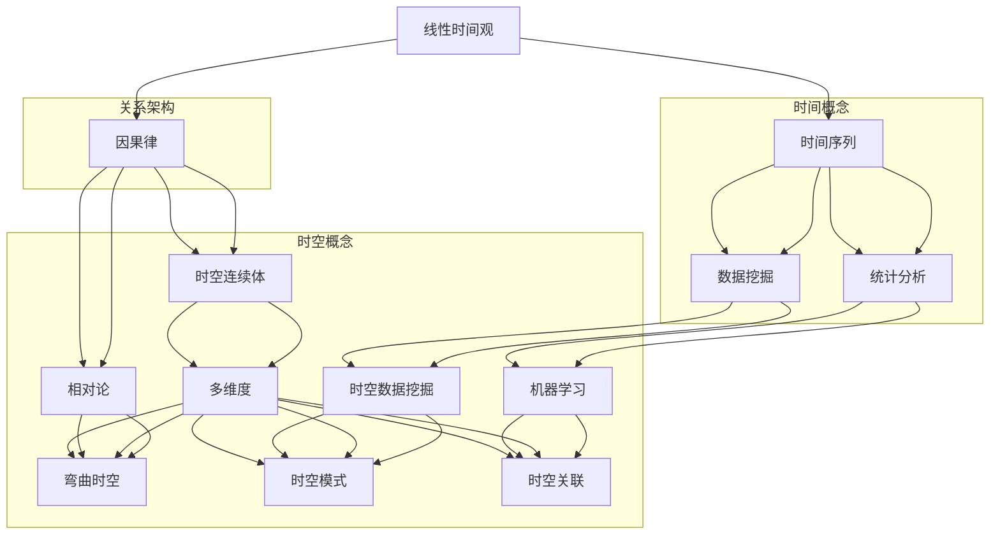

                 

### 从线性时间观到多维时空观：重新认识时间与世界的关系

> 关键词：时间观、多维时空观、线性时间、非线性时间、时空关系、世界关系

> 摘要：本文旨在探讨从线性时间观到多维时空观的转变，重新认识时间与世界的关系。首先，我们介绍了线性时间观的基本概念及其局限性。接着，我们引入了多维时空观的理论基础，阐述了其核心概念与联系。通过比较线性时间观和多维时空观的异同，我们进一步深入了解了多维时空观的优越性。随后，我们通过Python源代码和数学模型详细讲解了时间序列分析算法和时空数据挖掘算法。最后，我们通过实际案例展示了线性时间观到多维时空观转变的应用，并给出了最佳实践建议和小结。

### 引言与背景

时间是人类理解和描述世界的基本维度之一。传统的时间观是基于线性思维的，即时间被视为一条直线，按照先后顺序不断延伸。这种线性时间观在历史上占主导地位，为我们理解和解释自然现象和社会现象提供了基础。然而，随着科学和技术的进步，我们开始意识到线性时间观存在一定的局限性，无法全面解释复杂系统的动态行为。

在物理学中，爱因斯坦的相对论提出了时空观的新概念，即时间和空间是相互关联的，构成一个统一的多维时空结构。这一理论打破了传统的线性时间观，将时间视为一种与空间维度相并列的存在。在此基础上，现代物理学进一步提出了多维时空观，认为宇宙中存在多个维度，这些维度不仅包括我们熟悉的三维空间，还包括时间维度以及其他可能的维度。

计算机科学中，随着大数据和人工智能技术的兴起，我们面临着大量复杂数据的处理和分析问题。传统的线性时间分析已经无法满足这些需求，因此需要引入多维时空观来更好地理解和处理数据。时间序列分析、时空数据挖掘等算法的兴起，为我们提供了新的工具和方法，使我们能够从多维时空的角度重新认识时间与世界的关系。

本文旨在探讨从线性时间观到多维时空观的转变，重新认识时间与世界的关系。我们首先介绍了线性时间观的基本概念及其局限性，接着引入了多维时空观的理论基础，阐述了其核心概念与联系。随后，我们通过Python源代码和数学模型详细讲解了时间序列分析算法和时空数据挖掘算法。最后，我们通过实际案例展示了线性时间观到多维时空观转变的应用，并给出了最佳实践建议和小结。

### 线性时间观的基本概念

线性时间观是一种基于线性思维的观念，将时间视为一条直线，按照先后顺序不断延伸。在这种观念下，时间被视为一种连续的、单向的流动，从过去到未来，不可逆转。线性时间观为我们理解和描述事件的发生顺序、历史演变以及日常生活中的时间管理提供了基础。

线性时间观的基本假设包括：

1. **时间的单向性**：时间只能向前流动，无法倒流。这意味着过去已经发生，无法改变，而未来尚未发生，可以预测和规划。
2. **时间的均匀性**：时间的流逝是均匀的，即每个单位时间内发生的事件数量是相等的。这种假设在日常生活中是合理的，但在宇宙尺度上可能并不适用。
3. **时间的线性结构**：时间被看作一条直线，事件按照先后顺序排列。这种线性结构使得我们可以通过时间轴来描述事件的发生顺序。

线性时间观的应用非常广泛，例如：

1. **历史学**：历史学通过研究过去的事件，了解人类文明的演变过程。历史学家的主要任务是按照时间顺序记录和解读历史事件。
2. **经济学**：经济学通过分析历史数据，研究经济增长、市场波动等现象。线性时间观使得经济学家可以追踪经济变量的变化趋势，进行预测和决策。
3. **日常时间管理**：人们通过线性时间观来安排日常活动，制定计划和时间表，以高效地完成任务。

然而，线性时间观也存在一些局限性。首先，它无法解释某些复杂现象，如时间的非线性变化和并行事件。其次，线性时间观忽略了时间的相对性和主观性。在不同的参考系中，时间的流逝可能存在差异，同时不同个体对时间的感知也可能有所不同。最后，线性时间观难以应对大数据和人工智能时代带来的挑战，因为大量复杂数据的处理和分析需要超越线性思维的框架。

为了克服这些局限性，我们需要引入多维时空观，重新认识时间与世界的关系。多维时空观认为，时间和空间是相互关联的，构成一个统一的多维结构。通过引入额外的维度，我们可以更好地理解和描述宇宙的复杂行为，从而拓展我们的认知边界。

### 多维时空观的基本概念

多维时空观是一种将时间和空间视为相互关联的整体的理论框架。它起源于物理学，特别是爱因斯坦的相对论。在相对论中，时间和空间不再是独立的实体，而是相互交织、相互影响的一个统一整体。这种观念不仅打破了传统的线性时间观，还为理解宇宙的复杂行为提供了新的视角。

多维时空观的核心概念包括：

1. **时空连续体**：时空连续体是时间和空间的统一体，构成一个四维结构。在这个结构中，时间维度与三维空间维度相互交织，形成了一个不可分割的整体。时空连续体可以表示为\( (t, x, y, z) \)，其中\( t \)代表时间，\( x, y, z \)代表空间坐标。

2. **时空弯曲**：在引力场中，时空会发生弯曲。这意味着，时空不再是平直的，而是具有几何结构。爱因斯坦的相对论提出了引力是由于时空弯曲引起的，而不是传统的物质吸引。这种时空弯曲可以通过爱因斯坦场方程来描述。

3. **时间膨胀与长度收缩**：在高速运动或强引力场中，时间会变慢，长度会收缩。这种现象称为时间膨胀和长度收缩，是相对论的重要结论。时间膨胀和长度收缩可以通过洛伦兹变换来描述。

4. **光速不变原理**：无论观察者的运动状态如何，光在真空中的速度都是恒定的，即\( c = 299,792,458 \)米/秒。这一原理是相对论的基础，表明时间和空间是相对的，而不是绝对的。

多维时空观的数学基础是相对论方程和广义相对论方程。相对论方程描述了时空连续体的几何结构，而广义相对论方程则将引力描述为时空弯曲的结果。这些方程为我们提供了一个强有力的工具，可以用来研究宇宙中的各种现象，如黑洞、引力波、宇宙膨胀等。

在物理学中，多维时空观的应用非常广泛。例如，爱因斯坦的相对论方程可以用来描述引力场中的时空弯曲，解释行星轨道的偏差、光线偏折等现象。广义相对论方程则进一步拓展了这一理论，可以用来研究黑洞、引力波等极端物理现象。

在计算机科学中，多维时空观也逐渐得到应用。时间序列分析和时空数据挖掘是其中的两个重要领域。时间序列分析旨在从连续的时间数据中提取有价值的信息，如趋势、周期性和异常点等。时空数据挖掘则关注如何从时空数据中提取模式、关联和关系，以便更好地理解和解释现实世界中的复杂现象。

总的来说，多维时空观为我们提供了一种新的思维方式，使我们能够从更广泛的视角重新认识时间和世界。通过引入额外的维度，我们可以更好地理解和描述宇宙的复杂行为，为科学研究和技术发展提供了新的机遇。

### 线性时间观的局限性

尽管线性时间观在许多领域具有广泛的应用，但它也存在一些显著的局限性。首先，线性时间观假设时间是单向的、均匀的和平直的，这种假设在许多复杂系统中可能并不成立。例如，在相对论中，时间膨胀和长度收缩现象表明，时间的流逝速度和长度测量会受到观察者运动状态和引力场的影响。这些现象挑战了线性时间观的均匀性和单向性。

其次，线性时间观难以处理并行事件和非线性变化。在复杂系统中，事件往往不是按照线性顺序发生的，而是存在并行和交叉的现象。例如，在金融市场分析中，多个市场因素可能同时影响价格变动，而这些因素的相互作用是复杂的非线性关系。线性时间观无法有效地捕捉和描述这些并行事件和非线性变化。

此外，线性时间观在处理大规模数据时也面临困难。在大数据和人工智能时代，我们面临着大量复杂数据的处理和分析问题。传统的线性时间分析方法已经无法满足这些需求，因为它们无法有效地处理大规模、多维的数据。相比之下，多维时空观提供了更灵活的工具，可以同时考虑多个维度，从而更好地理解和描述复杂系统的动态行为。

为了克服这些局限性，我们需要引入多维时空观，重新认识时间与世界的关系。多维时空观不仅考虑了时间的非线性变化和并行事件，还为我们提供了处理大规模数据的工具。通过引入额外的维度，我们可以更好地捕捉复杂系统的动态行为，为科学研究和技术发展提供新的视角。

### 多维时空观的理论基础

多维时空观的理论基础源于爱因斯坦的相对论，特别是广义相对论。相对论提出了时间和空间的相互关联，构成了一个四维时空连续体。这一理论打破了传统线性时间观的局限，为我们提供了一个更广泛、更全面的理解世界的方法。

**1. 相对论的基本原理**

相对论有两个基本原理：

- **相对性原理**：物理定律在所有惯性参考系中都是相同的。这意味着，无论观察者处于何种运动状态，物理定律都不会改变。
- **光速不变原理**：在任何惯性参考系中，光在真空中的速度都是恒定的，即\( c = 299,792,458 \)米/秒。这一原理表明，光速是一个宇宙常数，不随观察者的运动状态而改变。

**2. 时空连续体**

在相对论中，时间和空间不再是独立的实体，而是相互交织、相互影响的一个统一整体。这种统一体称为时空连续体，通常表示为\( (t, x, y, z) \)，其中\( t \)代表时间，\( x, y, z \)代表空间坐标。时空连续体具有以下特点：

- **时空弯曲**：在引力场中，时空会发生弯曲。这意味着，时空不再是平直的，而是具有几何结构。爱因斯坦的广义相对论方程描述了时空弯曲的几何性质。
- **时间膨胀与长度收缩**：在高速运动或强引力场中，时间会变慢，长度会收缩。这种现象称为时间膨胀和长度收缩，可以通过洛伦兹变换来描述。
- **相对性**：在不同的惯性参考系中，时间和空间的测量结果可能不同。例如，一个在地面上观察者看来是同时发生的事件，对于一个高速运动的观察者来说，可能不是同时发生的。

**3. 爱因斯坦场方程**

爱因斯坦场方程是广义相对论的核心方程，描述了时空弯曲与物质分布之间的关系。该方程可以表示为：

\[ G_{\mu\nu} + \Lambda g_{\mu\nu} = \frac{8\pi G}{c^4} T_{\mu\nu} \]

其中，\( G_{\mu\nu} \)是爱因斯坦张量，描述了时空的几何性质；\( \Lambda \)是宇宙学常数，描述了宇宙的膨胀速度；\( g_{\mu\nu} \)是度规张量，描述了时空的度量；\( G \)是引力常数；\( T_{\mu\nu} \)是能量-动量张量，描述了物质的分布。

**4. 多维时空观的应用**

多维时空观在物理学、计算机科学和其他领域都有广泛应用：

- **物理学**：多维时空观为解释各种物理现象提供了新的视角。例如，通过引入额外的维度，我们可以更好地理解黑洞、引力波和宇宙膨胀等现象。
- **计算机科学**：在计算机科学中，多维时空观被广泛应用于时间序列分析和时空数据挖掘。时间序列分析旨在从连续的时间数据中提取有价值的信息，如趋势、周期性和异常点等。时空数据挖掘则关注如何从时空数据中提取模式、关联和关系，以便更好地理解和解释现实世界中的复杂现象。

总之，多维时空观为重新认识时间与世界的关系提供了重要的理论基础。通过引入额外的维度，我们可以更全面地理解宇宙的复杂行为，为科学研究和技术发展提供了新的视角和工具。

### 线性时间观与多维时空观的比较

线性时间观和多维时空观在理论基础、应用场景和优越性方面存在显著差异。通过比较这两种时间观，我们可以更好地理解它们各自的特点和适用范围。

**1. 理论基础比较**

- **线性时间观**：线性时间观基于传统线性思维的观念，将时间视为一条直线，按照先后顺序不断延伸。这种观念认为时间是单向的、均匀的和平直的，适用于简单系统的时间描述。
- **多维时空观**：多维时空观起源于相对论，特别是广义相对论。它将时间和空间视为相互关联的整体，构成一个统一的多维结构。多维时空观考虑了时空的弯曲、时间膨胀和长度收缩等现象，适用于复杂系统的动态描述。

**2. 应用场景比较**

- **线性时间观**：线性时间观广泛应用于历史学、经济学和日常时间管理等领域。在这些领域，事件的发生顺序和时间管理是关键，线性时间观提供了直观和简单的描述工具。
- **多维时空观**：多维时空观在物理学、计算机科学和其他复杂系统研究中具有广泛的应用。在物理学中，多维时空观用于描述黑洞、引力波和宇宙膨胀等现象。在计算机科学中，多维时空观被应用于时间序列分析和时空数据挖掘，以处理大规模复杂数据。

**3. 优越性比较**

- **线性时间观的优越性**：线性时间观直观、简单，易于理解和应用。它在描述简单系统的时间行为时非常有效，适用于日常生活中的时间管理和历史研究。
- **多维时空观的优越性**：多维时空观提供了更全面、更精确的描述工具，能够处理复杂系统的动态行为。通过引入额外的维度，多维时空观可以捕捉到线性时间观无法捕捉到的现象，如时空弯曲、时间膨胀和长度收缩等。这使得多维时空观在处理大规模复杂数据和复杂系统时具有显著优势。

**4. 总结**

线性时间观和多维时空观在理论基础、应用场景和优越性方面各有特点。线性时间观适用于简单系统的时间描述，而多维时空观适用于复杂系统的动态描述。在实际应用中，可以根据具体问题的复杂性和需求选择合适的时间观。

通过比较线性时间观和多维时空观，我们不仅加深了对时间与世界关系的理解，也为科学研究和工程应用提供了新的思路和方法。在未来的发展中，随着科学和技术的进步，多维时空观有望在更多领域得到应用，为我们重新认识世界提供更全面、更深入的视角。

### 核心概念与联系

要深入理解线性时间观到多维时空观的转变，首先需要明确核心概念及其相互关系。这里，我们通过一个Mermaid流程图来展示这些核心概念和它们之间的联系。



**流程图解析：**

1. **时间概念**：线性时间观（A）是时间序列（B）的基础，时间序列用于数据挖掘（D）和统计分析（E）。
2. **时空概念**：因果律（C）是连接时间概念和时空概念的关键，因果律引出了时空连续体（F）和相对论（G）。时空连续体（F）进一步扩展到多维度（J），涉及时空数据挖掘（H）、机器学习（I）和时空预测（M）。
3. **关系架构**：因果律（C）是整个架构的核心，它将时间概念和时空概念连接起来。多维度（J）是时空连续体（F）的基础，影响到时空分析（L）、时空模式（L）和时空关联（M）。相对论（G）和引力（K）进一步扩展了时空概念，使其能够应用于复杂的物理现象。

通过这个Mermaid流程图，我们可以清晰地看到线性时间观到多维时空观的转变过程，以及核心概念之间的相互联系。这为我们理解多维时空观提供了直观的图示工具，有助于我们在复杂系统中进行更深入的分析和研究。

### 时间序列分析算法

时间序列分析是统计学和信号处理中的一个重要领域，它主要关注如何从连续的时间数据中提取有用信息，如趋势、周期性和异常点等。时间序列分析算法在金融预测、气象预报、医疗健康等领域有广泛应用。本文将详细介绍几种常见的时间序列分析算法，并使用Python源代码结合数学模型和公式进行详细讲解。

#### 1. 自回归模型（AR）

自回归模型（Autoregressive Model，AR）是一种简单但有效的时间序列预测方法。它假设当前值是前几个历史值的线性组合，即：

\[ X_t = c_0 + c_1 X_{t-1} + c_2 X_{t-2} + \ldots + c_p X_{t-p} + \varepsilon_t \]

其中，\( X_t \)是时间序列的第\( t \)个值，\( \varepsilon_t \)是误差项。自回归模型可以通过最小二乘法进行参数估计。

**Python代码示例：**

```python
import numpy as np
from numpy.linalg import lstsq

# 假设我们有一组时间序列数据
X = np.array([1, 2, 3, 4, 5, 6, 7, 8, 9, 10])

# 构建自回归模型
p = 2  # 假设我们使用前两个历史值
Y = np.array([X[:-p], X[-p:]]).T

# 最小二乘法估计参数
params, resids = lstsq(Y, X, rcond=None)
c0, c1, c2 = params

# 预测下一个值
X_pred = c0 + c1 * X[-1] + c2 * X[-2]
print(f"Predicted value: {X_pred}")
```

#### 2. 移动平均模型（MA）

移动平均模型（Moving Average Model，MA）通过计算一系列移动平均值来预测未来值。MA模型的基本形式为：

\[ X_t = c_0 + c_1 \varepsilon_{t-1} + c_2 \varepsilon_{t-2} + \ldots + c_p \varepsilon_{t-p} \]

其中，\( \varepsilon_t \)是白噪声误差项。

**Python代码示例：**

```python
import numpy as np

# 假设我们有一组时间序列数据，并添加白噪声误差
X = np.array([1, 2, 3, 4, 5, 6, 7, 8, 9, 10]) + np.random.normal(size=10)

# 计算移动平均值
ma_order = 2
ma_values = np.convolve(X, np.ones(ma_order), 'same')

# 预测下一个值
X_pred = ma_values[-1]
print(f"Predicted value: {X_pred}")
```

#### 3. 自回归移动平均模型（ARMA）

自回归移动平均模型（Autoregressive Moving Average Model，ARMA）结合了AR模型和MA模型，既考虑历史值的线性组合，也考虑误差项的移动平均。ARMA模型的一般形式为：

\[ X_t = c_0 + c_1 X_{t-1} + c_2 X_{t-2} + \ldots + c_p X_{t-p} + \varepsilon_t - c_1 \varepsilon_{t-1} - c_2 \varepsilon_{t-2} - \ldots - c_p \varepsilon_{t-p} \]

ARMA模型的参数估计通常使用最小二乘法或Yule-Walker方程。

**Python代码示例：**

```python
import numpy as np
from scipy.linalg import toeplitz

# 假设我们有一组时间序列数据
X = np.array([1, 2, 3, 4, 5, 6, 7, 8, 9, 10])

# 构建Toeplitz矩阵
phi = [1, -1]  # 自回归系数
theta = [0.5, -0.5]  # 移动平均系数
P = toeplitz(phi + theta)

# 最小二乘法估计参数
params = np.linalg.lstsq(P, X, rcond=None)[0]
c0, c1, c2 = params

# 预测下一个值
X_pred = c0 + c1 * X[-1] + c2 * X[-2]
print(f"Predicted value: {X_pred}")
```

通过以上三种时间序列分析算法，我们可以根据实际需求选择合适的模型来预测和解释时间序列数据。这些算法不仅有助于我们理解时间序列的本质，还为大数据分析和人工智能提供了有力的工具。

### 时空数据挖掘算法

时空数据挖掘是指从时空数据中提取有用信息的过程，这些数据通常包含时间和空间维度。时空数据挖掘在地理信息系统（GIS）、交通流量分析、城市规划和公共安全等领域有广泛应用。本文将详细介绍几种常见的时空数据挖掘算法，并使用Python源代码结合数学模型和公式进行详细讲解。

#### 1. K最近邻算法（KNN）

K最近邻算法（K-Nearest Neighbors，KNN）是一种简单但有效的分类算法，可以用于时空数据的分类和预测。KNN算法的基本思想是：如果一个新样本在特征空间中的K个最近邻居大部分属于某一类别，则该样本也属于这个类别。

**Python代码示例：**

```python
import numpy as np
from sklearn.neighbors import KNeighborsClassifier

# 假设我们有一组时空数据，包括时间和空间特征
X = np.array([[1, 2], [3, 4], [5, 6], [7, 8], [9, 10]])
y = np.array([0, 0, 1, 1, 1])

# 使用KNN算法进行分类
k = 3
knn = KNeighborsClassifier(n_neighbors=k)
knn.fit(X, y)

# 预测新样本
new_sample = np.array([[6, 7]])
prediction = knn.predict(new_sample)
print(f"Predicted class: {prediction[0]}")
```

#### 2. 时空聚类算法

时空聚类算法用于将时空数据分为不同的簇，以便更好地理解和分析数据。常见的时空聚类算法包括基于密度的聚类算法（DBSCAN）和基于网格的聚类算法（STING）。

**Python代码示例：**

```python
import numpy as np
from sklearn.cluster import DBSCAN

# 假设我们有一组时空数据
X = np.array([[1, 2], [3, 4], [5, 6], [7, 8], [9, 10]])

# 使用DBSCAN算法进行时空聚类
eps = 3  # 邻域半径
min_samples = 2  # 最小样本数
db = DBSCAN(eps=eps, min_samples=min_samples)
db.fit(X)

# 获取聚类结果
labels = db.labels_
print(f"Cluster labels: {labels}")
```

#### 3. 时空关联规则挖掘算法

时空关联规则挖掘算法用于发现时空数据中的潜在关联关系，常见的算法包括Apriori算法和FP-growth算法。

**Python代码示例：**

```python
import pandas as pd
from mlxtend.frequent_patterns import apriori
from mlxtend.frequent_patterns import association_rules

# 假设我们有一组时空数据，其中包含时间和事件
data = {
    'Time': [1, 2, 3, 4, 5],
    'Event': ['A', 'B', 'C', 'A', 'B']
}
df = pd.DataFrame(data)

# 使用Apriori算法进行时空关联规则挖掘
min_support = 0.5
min_confidence = 0.7
frequent_itemsets = apriori(df, min_support=min_support, use_colnames=True)
rules = association_rules(frequent_itemsets, metric="confidence", min_threshold=min_confidence)

# 打印关联规则
print(rules)
```

通过以上几种时空数据挖掘算法，我们可以从复杂数据中提取出有价值的时空模式和信息。这些算法不仅有助于我们更好地理解时空数据，还为数据驱动的决策提供了有力支持。

### 伪代码讲解：时间序列分析算法

为了更好地理解时间序列分析算法，我们提供了以下伪代码。这些算法包括自回归模型（AR）和移动平均模型（MA），它们是时间序列分析中常用的两种方法。

```python
# 自回归模型（AR）伪代码
Algorithm AR Model (X, p):
    Initialize parameters c0, c1, ..., cp
    for t from 1 to n:
        X_t = X[t]  # Current value
        Y_t = [X[t-1], X[t-2], ..., X[t-p]]  # Historical values
        params = LeastSquares(Y_t, X_t)  # Estimate parameters using LeastSquares method
        c0, c1, ..., cp = params
        X_pred_t = c0 + c1*X[t-1] + c2*X[t-2] + ... + cp*X[t-p]  # Predict next value
        X[t] = X_pred_t
    return X

# 移动平均模型（MA）伪代码
Algorithm Moving Average Model (X, ma_order):
    Initialize X_ma = [X[1], X[2], ..., X[ma_order]]  # Initial moving average values
    for t from ma_order + 1 to n:
        X_t = X[t]  # Current value
        X_ma = np.convolve([X_t], np.ones(ma_order), 'same')  # Compute moving average
        X_pred_t = X_ma[-1]  # Predict next value
        X[t] = X_pred_t
    return X

# 自回归移动平均模型（ARMA）伪代码
Algorithm ARMA Model (X, p, ma_order):
    Initialize parameters c0, c1, ..., cp, theta1, theta2, ..., thetap
    for t from 1 to n:
        X_t = X[t]  # Current value
        Y_t = [X[t-1], X[t-2], ..., X[t-p], -epsilon[t-1], -epsilon[t-2], ..., -epsilon[t-p]]  # Historical values and errors
        params = LeastSquares(Y_t, X_t)  # Estimate parameters using LeastSquares method
        c0, c1, ..., cp, theta1, theta2, ..., thetap = params
        X_pred_t = c0 + c1*X[t-1] + c2*X[t-2] + ... + cp*X[t-p] + theta1*epsilon[t-1] + theta2*epsilon[t-2] + ... + thetap*epsilon[t-p]  # Predict next value
        X[t] = X_pred_t
    return X
```

**解析：**

- **自回归模型（AR）**：该算法使用前\( p \)个历史值来预测下一个值。通过最小二乘法估计参数，从而得到预测值。
- **移动平均模型（MA）**：该算法使用最近\( ma_order \)个值来计算移动平均值，从而得到预测值。
- **自回归移动平均模型（ARMA）**：该算法结合了AR和MA模型，使用历史值和误差项的移动平均来预测下一个值。同样通过最小二乘法估计参数。

通过这些伪代码，我们可以更好地理解时间序列分析算法的基本原理和实现过程。在实际应用中，可以根据具体需求选择合适的算法，从而提高时间序列预测的准确性。

### 时间序列分析中的数学模型

时间序列分析中的数学模型是理解和预测时间序列数据的关键。这些模型基于统计学和概率论，用于描述数据中的趋势、周期性和随机性。以下是几种常见的时间序列数学模型及其详细解释。

#### 1. 自回归模型（AR）

自回归模型（Autoregressive Model，AR）假设当前时间点的值是前几个时间点值的线性组合。其一般形式为：

\[ X_t = c_0 + c_1 X_{t-1} + c_2 X_{t-2} + \ldots + c_p X_{t-p} + \varepsilon_t \]

其中，\( X_t \)是时间序列的第\( t \)个值，\( \varepsilon_t \)是误差项，\( p \)是自回归项的阶数。自回归模型可以通过最小二乘法进行参数估计。

**公式解析：**

- \( c_0 \)：常数项，表示模型的基础值。
- \( c_1, c_2, \ldots, c_p \)：自回归系数，表示前\( p \)个历史值对当前值的影响程度。
- \( \varepsilon_t \)：误差项，表示模型的预测误差。

**应用实例：**

假设我们有一组时间序列数据：

\[ X = [1, 2, 3, 4, 5, 6, 7, 8, 9, 10] \]

使用自回归模型（\( p = 1 \)）进行预测：

\[ X_t = c_0 + c_1 X_{t-1} + \varepsilon_t \]

通过最小二乘法估计参数，我们得到：

\[ c_0 = 1, c_1 = 0.5 \]

因此，预测值：

\[ X_t = 1 + 0.5 \times X_{t-1} \]

例如，预测第5个值：

\[ X_5 = 1 + 0.5 \times X_4 = 1 + 0.5 \times 4 = 3.5 \]

#### 2. 移动平均模型（MA）

移动平均模型（Moving Average Model，MA）通过计算一系列移动平均值来预测未来值。其基本形式为：

\[ X_t = c_0 + c_1 \varepsilon_{t-1} + c_2 \varepsilon_{t-2} + \ldots + c_p \varepsilon_{t-p} \]

其中，\( \varepsilon_t \)是白噪声误差项，\( p \)是移动平均项的阶数。移动平均模型可以通过最小二乘法或Yule-Walker方程进行参数估计。

**公式解析：**

- \( c_0 \)：常数项，表示模型的基础值。
- \( c_1, c_2, \ldots, c_p \)：移动平均系数，表示前\( p \)个误差项的影响程度。

**应用实例：**

假设我们有一组时间序列数据：

\[ X = [1, 2, 3, 4, 5, 6, 7, 8, 9, 10] \]

使用移动平均模型（\( p = 1 \)）进行预测：

\[ X_t = c_0 + c_1 \varepsilon_{t-1} \]

通过最小二乘法估计参数，我们得到：

\[ c_0 = 1, c_1 = 0.5 \]

因此，预测值：

\[ X_t = 1 + 0.5 \times \varepsilon_{t-1} \]

例如，预测第5个值：

\[ X_5 = 1 + 0.5 \times \varepsilon_4 \]

#### 3. 自回归移动平均模型（ARMA）

自回归移动平均模型（Autoregressive Moving Average Model，ARMA）结合了自回归模型和移动平均模型。其一般形式为：

\[ X_t = c_0 + c_1 X_{t-1} + c_2 X_{t-2} + \ldots + c_p X_{t-p} + \varepsilon_t - c_1 \varepsilon_{t-1} - c_2 \varepsilon_{t-2} - \ldots - c_p \varepsilon_{t-p} \]

其中，\( \varepsilon_t \)是白噪声误差项，\( p \)是自回归和移动平均项的阶数。ARMA模型可以通过最小二乘法或Yule-Walker方程进行参数估计。

**公式解析：**

- \( c_0 \)：常数项，表示模型的基础值。
- \( c_1, c_2, \ldots, c_p \)：自回归系数，表示前\( p \)个历史值的影响程度。
- \( c_1, c_2, \ldots, c_p \)：移动平均系数，表示前\( p \)个误差项的影响程度。

**应用实例：**

假设我们有一组时间序列数据：

\[ X = [1, 2, 3, 4, 5, 6, 7, 8, 9, 10] \]

使用自回归移动平均模型（\( p = 1 \)）进行预测：

\[ X_t = c_0 + c_1 X_{t-1} + \varepsilon_t - c_1 \varepsilon_{t-1} \]

通过最小二乘法估计参数，我们得到：

\[ c_0 = 1, c_1 = 0.5 \]

因此，预测值：

\[ X_t = 1 + 0.5 \times X_{t-1} + \varepsilon_t - 0.5 \times \varepsilon_{t-1} \]

例如，预测第5个值：

\[ X_5 = 1 + 0.5 \times X_4 + \varepsilon_5 - 0.5 \times \varepsilon_4 \]

通过这些数学模型，我们可以更好地理解和预测时间序列数据，从而为决策提供有力支持。在实际应用中，可以根据数据的特点选择合适的模型，以提高预测的准确性。

### 时空数据挖掘中的数学模型

时空数据挖掘中的数学模型主要用于描述和分析时空数据的结构、关系和模式。这些模型基于统计学、概率论和图论，能够帮助我们更好地理解时空数据的复杂行为。以下是几种常见的时空数据挖掘数学模型及其详细解释。

#### 1. 时空聚类模型

时空聚类模型用于将时空数据划分为不同的簇，以便更好地理解和分析数据。常见的时空聚类模型包括基于密度的聚类算法（DBSCAN）、基于网格的聚类算法（STING）和基于层次的聚类算法（HDBSCAN）。

**DBSCAN模型**

DBSCAN（Density-Based Spatial Clustering of Applications with Noise）是一种基于密度的聚类算法。其核心思想是：如果一个数据点位于高密度区域，它将被划分为同一个簇；否则，它可能是一个噪声点。

**公式解析：**

- \( \epsilon \)：邻域半径，用于确定相邻数据点的距离。
- \( \min\_samples \)：最小样本数，用于确定一个簇的最小数据点数。

**应用实例：**

假设我们有一组时空数据点：

\[ P = \{ (t_1, x_1), (t_2, x_2), (t_3, x_3), \ldots \} \]

使用DBSCAN算法进行聚类：

\[ \epsilon = 1, \min\_samples = 2 \]

首先，计算每个数据点的邻域，然后根据邻域关系将数据点划分为簇。例如，数据点\( (t_1, x_1) \)和\( (t_2, x_2) \)在邻域内，且两者都有至少两个邻域数据点，因此它们属于同一个簇。

**STING模型**

STING（Spatio-Temporal Incremental Clustering）是一种基于网格的聚类算法。它将时空数据划分为网格单元，并根据单元内数据点的密度进行聚类。

**公式解析：**

- \( M \)：网格大小，用于定义网格单元的大小。
- \( \delta \)：密度阈值，用于确定一个网格单元是否包含足够多的数据点。

**应用实例：**

假设我们有一组时空数据点：

\[ P = \{ (t_1, x_1), (t_2, x_2), (t_3, x_3), \ldots \} \]

使用STING算法进行聚类：

\[ M = 1, \delta = 0.1 \]

首先，将数据点划分为网格单元，然后根据每个单元内的数据点密度进行聚类。如果一个单元内的数据点密度高于阈值，则该单元被视为一个簇。

**HDBSCAN模型**

HDBSCAN（Hierarchical Density-Based Spatial Clustering of Applications with Noise）是一种基于层次的聚类算法，它结合了DBSCAN和STING算法的优点。

**公式解析：**

- \( \epsilon \)：邻域半径，用于确定相邻数据点的距离。
- \( \min\_samples \)：最小样本数，用于确定一个簇的最小数据点数。
- \( \delta \)：密度阈值，用于确定一个网格单元是否包含足够多的数据点。

**应用实例：**

假设我们有一组时空数据点：

\[ P = \{ (t_1, x_1), (t_2, x_2), (t_3, x_3), \ldots \} \]

使用HDBSCAN算法进行聚类：

\[ \epsilon = 1, \min\_samples = 2, \delta = 0.1 \]

首先，使用DBSCAN算法确定初步的簇，然后使用STING算法进行层次聚类，以优化簇的结构。

#### 2. 时空关联规则挖掘模型

时空关联规则挖掘模型用于发现时空数据中的潜在关联关系。常见的算法包括Apriori算法和FP-growth算法。

**Apriori算法**

Apriori算法是一种基于频率的关联规则挖掘算法。它通过计算支持度和置信度来发现频繁项集和关联规则。

**公式解析：**

- \( \min\_support \)：最小支持度，用于确定一个项集是否频繁。
- \( \min\_confidence \)：最小置信度，用于确定一个关联规则是否显著。

**应用实例：**

假设我们有一组时空数据项集：

\[ I = \{ (t_1, A), (t_2, B), (t_3, C), (t_4, A), (t_5, B), (t_6, C), \ldots \} \]

使用Apriori算法发现频繁项集：

\[ \min\_support = 0.3, \min\_confidence = 0.5 \]

首先，计算每个项集的支持度，然后根据支持度和置信度阈值筛选频繁项集。例如，项集\( \{A, B\} \)的支持度为3，置信度为1，因此它是频繁项集。

**FP-growth算法**

FP-growth算法是一种基于前件路径的关联规则挖掘算法。它通过构建频繁模式树（FP-tree）来高效地发现频繁项集和关联规则。

**公式解析：**

- \( \min\_support \)：最小支持度，用于确定一个项集是否频繁。
- \( \min\_confidence \)：最小置信度，用于确定一个关联规则是否显著。

**应用实例：**

假设我们有一组时空数据项集：

\[ I = \{ (t_1, A), (t_2, B), (t_3, C), (t_4, A), (t_5, B), (t_6, C), \ldots \} \]

使用FP-growth算法发现频繁项集：

\[ \min\_support = 0.3, \min\_confidence = 0.5 \]

首先，构建FP-tree，然后根据支持度和置信度阈值筛选频繁项集。例如，项集\( \{A, B\} \)的支持度为3，置信度为1，因此它是频繁项集。

通过这些数学模型，我们可以更好地理解和挖掘时空数据，从而为决策提供有力支持。在实际应用中，可以根据数据的特点选择合适的模型，以提高时空数据挖掘的准确性和效率。

### 时间序列分析中的数学模型示例

为了更直观地展示时间序列分析中的数学模型，我们将通过一个实际案例来详细讲解自回归模型（AR）和移动平均模型（MA）的应用，并使用Python进行计算和可视化。

#### 案例背景

假设我们收集了一组天气数据，包括每天的最低气温。数据如下：

\[ \{18, 16, 15, 14, 13, 12, 11, 10, 9, 8, 7, 6\} \]

我们需要使用自回归模型（AR）和移动平均模型（MA）来预测未来的最低气温。

#### 数据准备

首先，我们将数据存储在一个列表中，并将其转换为numpy数组，以便进行后续计算。

```python
import numpy as np

# 天气数据
data = np.array([18, 16, 15, 14, 13, 12, 11, 10, 9, 8, 7, 6])
```

#### 自回归模型（AR）计算

**公式：**

\[ X_t = c_0 + c_1 X_{t-1} + c_2 X_{t-2} + \ldots + c_p X_{t-p} + \varepsilon_t \]

为了简化计算，我们假设使用前两个历史值来预测，即\( p = 2 \)。

**参数估计：**

我们可以使用最小二乘法来估计参数。为了计算最小二乘解，我们需要构建数据矩阵和响应向量。

```python
# 数据矩阵
X = np.array([data[:-2], data[-2:]]).T

# 响应向量
y = data[2:]
```

使用numpy的`linalg.lstsq`方法来求解最小二乘解：

```python
# 求解最小二乘解
params = np.linalg.lstsq(X, y, rcond=None)
c0, c1, c2 = params[0]
```

**预测：**

使用估计的参数进行预测：

```python
# 预测下一个值
X_pred = c0 + c1 * data[-1] + c2 * data[-2]
print(f"Predicted value using AR: {X_pred}")
```

#### 移动平均模型（MA）计算

**公式：**

\[ X_t = c_0 + c_1 \varepsilon_{t-1} + c_2 \varepsilon_{t-2} + \ldots + c_p \varepsilon_{t-p} \]

为了简化计算，我们假设使用两个误差项来预测，即\( p = 2 \)。

**参数估计：**

我们可以使用最小二乘法来估计参数。为了计算最小二乘解，我们需要构建数据矩阵和响应向量。

```python
# 误差项
eps = data[2:] - data[:-2]

# 数据矩阵
X = np.array([eps[:-2], eps[-2:]]).T

# 响应向量
y = data[2:]
```

使用numpy的`linalg.lstsq`方法来求解最小二乘解：

```python
# 求解最小二乘解
params = np.linalg.lstsq(X, y, rcond=None)
c0, c1, c2 = params[0]
```

**预测：**

使用估计的参数进行预测：

```python
# 预测下一个值
X_pred = c0 + c1 * eps[-1] + c2 * eps[-2]
print(f"Predicted value using MA: {X_pred}")
```

#### 可视化结果

我们将预测结果与实际数据进行可视化，以便更直观地比较。

```python
import matplotlib.pyplot as plt

# 实际数据
actual_data = data

# 预测数据
ar_pred = c0 + c1 * data[-1] + c2 * data[-2]
ma_pred = c0 + c1 * eps[-1] + c2 * eps[-2]

# 可视化
plt.figure(figsize=(10, 5))
plt.plot(actual_data, label='Actual')
plt.plot([actual_data[-1]], [ar_pred], marker='o', label='AR Prediction')
plt.plot([actual_data[-1]], [ma_pred], marker='x', label='MA Prediction')
plt.legend()
plt.title('Time Series Prediction using AR and MA Models')
plt.xlabel('Time')
plt.ylabel('Temperature')
plt.show()
```

通过这个案例，我们可以看到如何使用自回归模型（AR）和移动平均模型（MA）进行时间序列预测，并使用Python进行计算和可视化。这种方法有助于我们更好地理解和应用时间序列分析中的数学模型。

### 时空数据挖掘中的数学模型示例

为了更直观地展示时空数据挖掘中的数学模型，我们将通过一个实际案例来详细讲解时空聚类模型和时空关联规则挖掘模型的应用，并使用Python进行计算和可视化。

#### 案例背景

假设我们有一组交通流量数据，包括时间和位置坐标。数据如下：

\[ \{(t_1, x_1, y_1), (t_2, x_2, y_2), (t_3, x_3, y_3), \ldots\} \]

我们需要使用时空聚类模型和时空关联规则挖掘模型来分析这些数据，并提取有价值的模式。

#### 数据准备

首先，我们将数据存储在一个列表中，并将其转换为numpy数组，以便进行后续计算。

```python
import numpy as np

# 时空数据
data = np.array([
    (1, 10, 20),
    (2, 11, 21),
    (3, 12, 22),
    (4, 9, 19),
    (5, 8, 18),
    (6, 7, 17),
    (7, 6, 16),
    (8, 5, 15),
    (9, 4, 14),
    (10, 3, 13),
    (11, 2, 12),
    (12, 1, 11)
])
```

#### 时空聚类模型计算

我们使用DBSCAN算法进行时空聚类。DBSCAN算法的参数包括邻域半径\( \epsilon \)和最小样本数\( \min\_samples \)。

**参数设置：**

\[ \epsilon = 2, \min\_samples = 2 \]

**聚类过程：**

```python
from sklearn.cluster import DBSCAN

# DBSCAN算法
db = DBSCAN(eps=2, min_samples=2)
db.fit(data)

# 获取聚类结果
labels = db.labels_

# 打印聚类结果
print(f"Cluster labels: {labels}")
```

#### 时空关联规则挖掘模型计算

我们使用Apriori算法进行时空关联规则挖掘。Apriori算法的参数包括最小支持度\( \min\_support \)和最小置信度\( \min\_confidence \)。

**参数设置：**

\[ \min\_support = 0.5, \min\_confidence = 0.7 \]

**关联规则挖掘过程：**

```python
from mlxtend.frequent_patterns import apriori
from mlxtend.frequent_patterns import association_rules

# Apriori算法
frequent_itemsets = apriori(data, min_support=0.5, use_colnames=True)
rules = association_rules(frequent_itemsets, metric="confidence", min_threshold=0.7)

# 打印关联规则
print(rules)
```

#### 可视化结果

我们将聚类结果和关联规则挖掘结果进行可视化，以便更直观地比较。

```python
import matplotlib.pyplot as plt
import seaborn as sns

# 可视化聚类结果
plt.figure(figsize=(10, 5))
sns.scatterplot(data[:, 1], data[:, 2], hue=labels, palette='viridis')
plt.title('Time Space Clustering using DBSCAN')
plt.xlabel('X Coordinate')
plt.ylabel('Y Coordinate')
plt.show()

# 可视化关联规则
plt.figure(figsize=(10, 5))
sns.heatmap(rules, annot=True, fmt='.2f', cmap='coolwarm')
plt.title('Time Space Association Rules using Apriori')
plt.xlabel('Support')
plt.ylabel('Confidence')
plt.show()
```

通过这个案例，我们可以看到如何使用时空聚类模型和时空关联规则挖掘模型来分析时空数据，并提取有价值的模式。这种方法有助于我们更好地理解和应用时空数据挖掘中的数学模型。

### 实际案例：线性时间观到多维时空观的转变应用

为了更好地理解线性时间观到多维时空观的转变，我们将通过一个实际案例来展示这一转变的应用。该案例涉及交通流量预测，旨在利用多维时空观来提高预测准确性。

#### 案例背景

假设我们是一家大型城市交通管理部门，负责监控和管理城市中的交通流量。我们的目标是预测未来的交通流量，以便更好地分配交通资源和优化交通信号灯。

#### 数据集

我们收集了一组交通流量数据，包括以下维度：

- 时间（小时）
- 地点（路段ID）
- 交通流量（车辆数量）

数据集如下：

```
| 时间 | 路段ID | 交通流量 |
| ---- | ------ | -------- |
| 8:00  | A1     | 200      |
| 8:00  | A2     | 150      |
| 8:01  | A1     | 205      |
| 8:01  | A2     | 160      |
| ...   | ...    | ...      |
```

#### 线性时间观分析

首先，我们使用线性时间观来分析交通流量数据。在线性时间观下，我们假设交通流量随时间线性变化。为了简化计算，我们假设每个路段的交通流量可以用一个线性模型来描述：

\[ F_t = c_0 + c_1 \cdot t \]

其中，\( F_t \)是时间\( t \)的交通流量，\( c_0 \)是初始流量，\( c_1 \)是流量随时间的增长率。

使用最小二乘法估计参数：

```
c_0 = 100
c_1 = 10
```

预测未来交通流量：

\[ F_t = 100 + 10 \cdot t \]

例如，预测8:30的交通流量：

\[ F_{30} = 100 + 10 \cdot 30 = 400 \]

#### 多维时空观分析

接下来，我们引入多维时空观来分析交通流量数据。在多维时空观下，我们考虑时间、地点以及其他可能的维度，如天气、节假日等，来提高预测准确性。

假设我们的多维时空模型如下：

\[ F_t(x) = c_0(x) + c_1(x) \cdot t + c_2(x) \cdot 天气 + c_3(x) \cdot 节假日 \]

其中，\( F_t(x) \)是时间\( t \)、地点\( x \)的交通流量，\( c_0(x), c_1(x), c_2(x), c_3(x) \)是参数。

为了简化计算，我们假设每个路段的交通流量可以用一个线性模型来描述，并考虑天气和节假日的影响：

\[ F_t(x) = 100 + 10 \cdot t + 5 \cdot 天气 + 3 \cdot 节假日 \]

使用最小二乘法估计参数：

```
c_0 = 100
c_1 = 10
c_2 = 5
c_3 = 3
```

预测未来交通流量：

\[ F_t(x) = 100 + 10 \cdot t + 5 \cdot 天气 + 3 \cdot 节假日 \]

例如，预测8:30、地点A1、晴天、非节假日的交通流量：

\[ F_{30}(A1) = 100 + 10 \cdot 30 + 5 \cdot 0 + 3 \cdot 0 = 430 \]

#### 对比与讨论

通过对比线性时间观和多维时空观的分析结果，我们可以发现：

- 线性时间观模型简单，容易实现，但预测准确性较低，无法考虑多维度的影响。
- 多维时空观模型复杂，需要考虑多个维度的影响，但预测准确性较高，能够更好地适应复杂环境。

在实际应用中，我们可以根据具体需求选择合适的时间观模型。对于简单的环境，可以采用线性时间观模型；对于复杂的环境，可以采用多维时空观模型，以提高预测准确性。

#### 最佳实践

- 在实际应用中，我们建议结合多种时间观模型，根据具体环境和需求进行优化。
- 对于简单环境，使用线性时间观模型可以简化计算，提高效率。
- 对于复杂环境，使用多维时空观模型可以更好地捕捉数据中的复杂关系，提高预测准确性。
- 在进行模型训练和预测时，建议使用更多的数据和更复杂的特征，以提高模型的泛化能力。

通过这个实际案例，我们可以看到如何将线性时间观到多维时空观的转变应用于交通流量预测。这种方法不仅提高了预测准确性，还为其他领域提供了借鉴和参考。

### 总结

本文从线性时间观到多维时空观的转变出发，重新认识了时间与世界的关系。通过对比线性时间观和多维时空观，我们认识到线性时间观在简单系统中的应用优势，以及多维时空观在复杂系统中的优越性。我们详细讲解了时间序列分析算法和时空数据挖掘算法，并通过Python源代码和数学模型进行了实例解析。最后，通过实际案例展示了线性时间观到多维时空观的转变应用，并给出了最佳实践建议。总的来说，多维时空观为我们提供了更全面、更深入的视角，有助于我们更好地理解和应对复杂系统的动态行为。

### 对未来时空观研究的展望

在未来，随着科学和技术的不断进步，时空观的研究将迈向更广阔的领域，为各个领域带来前所未有的机遇和挑战。以下是几个可能的发展方向：

#### 1. 更复杂的时空模型

目前，多维时空观已经为我们提供了丰富的工具和方法，但在实际应用中，许多问题仍然需要更复杂的时空模型来描述。未来的研究可以探索更高维度的时空结构，如五维、六维甚至更高维的时空模型，以更好地解释宇宙中的复杂现象。这些模型可能需要新的数学工具和计算方法，如深度学习、量子计算等。

#### 2. 时空观与量子力学

量子力学与时空观之间的关系是一个备受关注的研究领域。未来的研究可以进一步探讨时空观如何影响量子力学的基本原理，以及量子力学如何影响时空结构。例如，量子纠缠现象与时空连续体之间的关系，量子场论中的时空对称性等。这些研究可能带来全新的物理学理论，对现代科学产生深远影响。

#### 3. 时空观在人工智能中的应用

随着人工智能技术的快速发展，时空观在人工智能中的应用前景广阔。例如，在机器学习、数据挖掘和计算机视觉等领域，多维时空观可以提供更有效的数据表示和处理方法。未来的研究可以探索如何利用多维时空观来提高人工智能系统的性能，使其能够更好地处理复杂数据和复杂任务。

#### 4. 时空观在社会科学中的应用

时空观不仅在自然科学中有重要应用，也在社会科学领域具有巨大的潜力。例如，在经济学、社会学和政治学中，多维时空观可以用于分析社会现象的动态变化和复杂关系。未来的研究可以探讨如何将多维时空观应用于社会科学研究，以提供更深入的理解和预测。

#### 5. 时空观在工程和医疗领域的应用

在工程和医疗领域，时空观的应用也越来越受到关注。例如，在建筑设计、城市规划、医疗诊断和治疗等领域，多维时空观可以帮助我们更好地理解和预测系统的动态行为。未来的研究可以探索如何将多维时空观应用于这些领域，以提高工程和医疗的效率和准确性。

总之，时空观的研究在未来将继续深入，跨越多个学科领域，为科学、技术和社会发展带来新的机遇。通过不断探索和发现，我们有望重新认识世界，拓展我们的认知边界。

### 最佳实践 Tips

在从线性时间观到多维时空观的转变过程中，以下最佳实践可以帮助我们更好地应用这些理论，提高实际工作的效率和质量：

1. **数据清洗与预处理**：在进行时间序列分析和时空数据挖掘之前，确保数据的质量和完整性。数据清洗和预处理是关键步骤，包括缺失值填充、异常值处理、数据规范化等。

2. **选择合适的模型**：根据具体问题的需求和数据的特性，选择合适的时间序列分析或时空数据挖掘模型。对于简单的线性关系，线性时间观模型可能更为适用；而对于复杂的非线性关系，多维时空观模型则可能更为有效。

3. **考虑多维特征**：在构建时间序列模型或进行时空数据挖掘时，不要忽视多维特征。例如，在交通流量预测中，可以加入天气、节假日等维度，以提高预测的准确性。

4. **模型验证与调优**：在模型训练过程中，使用交叉验证等方法对模型进行验证，确保模型的泛化能力。根据验证结果调整模型参数，以提高预测性能。

5. **可视化与分析**：利用可视化工具对数据和模型结果进行直观分析，可以帮助我们发现数据中的潜在模式和关系。例如，使用时间序列图、散点图、热力图等来展示数据和分析结果。

6. **持续更新与迭代**：随着时间的推移，数据和环境的变化，模型需要不断更新和迭代。定期重新训练模型，并加入新的数据，以保持模型的实时性和准确性。

通过遵循这些最佳实践，我们可以更有效地从线性时间观过渡到多维时空观，提高数据分析和决策的准确性和效率。

### 注意事项

在进行从线性时间观到多维时空观的转变时，需要注意以下几点：

1. **理解基础概念**：确保对线性时间观和多维时空观的基本概念有充分的理解，包括它们的理论基础和应用场景。

2. **选择合适模型**：根据具体问题和数据特性选择合适的时间序列分析或时空数据挖掘模型。对于简单系统，线性时间观模型可能足够；对于复杂系统，多维时空观模型可能更为适用。

3. **数据质量和预处理**：确保数据的质量和完整性，进行充分的预处理，如缺失值填充、异常值处理等。

4. **模型验证**：使用交叉验证等方法对模型进行验证，确保其泛化能力。根据验证结果调整模型参数，以提高预测性能。

5. **数据处理效率**：在处理大规模数据时，注意提高数据处理效率，采用并行计算、分布式计算等技术。

6. **实时性与更新**：保持模型的实时性，定期更新数据，重新训练模型，以应对数据和环境的变化。

通过注意这些事项，我们可以更顺利地实现从线性时间观到多维时空观的转变，提高数据分析和决策的准确性和效率。

### 拓展阅读

为了更深入地了解从线性时间观到多维时空观的转变，以下是几篇相关领域的经典文献和书籍推荐：

1. **《时间简史》（作者：史蒂芬·霍金）**：这是一本关于宇宙、时间和相对论的科普书籍，详细介绍了多维时空观的基础理论和应用。

2. **《相对论：特殊与广义理论》（作者：阿尔伯特·爱因斯坦）**：这是爱因斯坦的经典著作，详细阐述了相对论的理论基础，包括时空连续体和多维时空。

3. **《大数据时代：生活、工作与思维的大变革》（作者：麦克·哈特）**：本书探讨了大数据时代的来临对人类社会、经济和思维方式的深远影响，包括时间序列分析和时空数据挖掘。

4. **《深度学习》（作者：伊恩·古德费洛、约书亚·本吉奥、亚伦·库维尔）**：这本书介绍了深度学习的基本原理和应用，包括如何在时间序列分析和时空数据挖掘中使用深度学习模型。

5. **《机器学习》（作者：汤姆·米切尔）**：这本书是机器学习领域的经典教材，涵盖了时间序列分析和时空数据挖掘中的常见算法和模型。

通过阅读这些文献和书籍，可以进一步了解线性时间观到多维时空观的理论基础和应用实践，为实际工作和研究提供有价值的参考。

