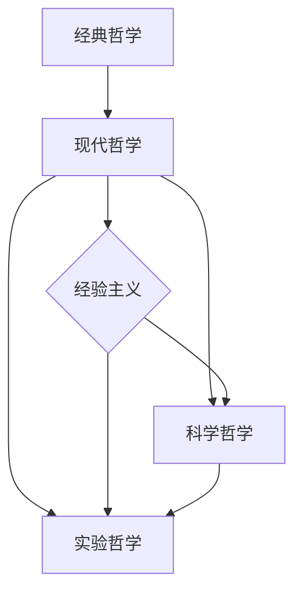

                 

# 《从经典哲学到实验哲学：经验视角下的世界可理解性》

## 关键词

- 经典哲学
- 现代哲学
- 实验哲学
- 经验主义
- 可理解性
- 科学哲学

## 摘要

本文从经典哲学到实验哲学的视角，探讨了世界的可理解性。通过对经典哲学、现代哲学、经验主义和科学哲学的深入分析，本文揭示了不同哲学流派对世界理解的不同观点和方法。文章旨在为读者提供一个清晰的哲学框架，帮助理解哲学在探讨世界可理解性方面的重要性，并展望未来哲学研究的前景。

## 引言

世界的可理解性一直是哲学研究的核心问题之一。从古代到现代，哲学家们都在探讨世界的本质、存在的意义以及人类如何理解这个世界。随着科技的发展和实验方法的应用，现代哲学开始从经验角度重新审视这一问题。本文旨在梳理经典哲学到实验哲学的发展脉络，探讨不同哲学流派对世界可理解性的看法，并分析其背后的原理和方法。

## 第一部分：哲学与可理解性的基础

### 第1章：经典哲学与现代哲学概述

#### 1.1 经典哲学的历史背景与核心思想

经典哲学源于古希腊时期，以苏格拉底、柏拉图和亚里士多德为代表。苏格拉底强调通过对话和提问来寻找真理，柏拉图则提出了理念世界的概念，认为现实世界只是理念世界的影子。亚里士多德则关注自然界和科学，提出了形式与质料的概念。这些思想对后世哲学产生了深远影响。

#### 1.2 现代哲学的兴起与发展

现代哲学始于17世纪的欧洲，以笛卡尔、康德和黑格尔等哲学家为代表。笛卡尔提出了著名的“我思故我在”，强调怀疑和理性思考的重要性。康德则关注认识论和伦理学，提出了“先验范畴”的概念。黑格尔则通过辩证法来探讨历史和哲学的发展。

#### 1.3 经典哲学与现代哲学的关联

经典哲学与现代哲学有着密切的关联。现代哲学在某种程度上是对经典哲学的继承和发展。例如，笛卡尔的怀疑主义和康德的先验范畴都受到了苏格拉底和柏拉图的影响。同时，现代哲学也在经典哲学的基础上提出了新的问题和观点，如实证主义、存在主义和现象学等。

### 第2章：哲学中的可理解性探讨

#### 2.1 可理解性的定义与意义

可理解性是指人类能否通过理性思考和经验知识来理解世界的本质和规律。它关乎人类认识世界的能力和限度，是哲学研究的重要主题。

#### 2.2 经典哲学中的可理解性问题

经典哲学中的可理解性问题主要涉及以下几个方面：一是世界的本质是什么，二是人类能否通过理性思考完全理解世界，三是世界的规律是否具有必然性。

#### 2.3 现代哲学中的可理解性问题

现代哲学中的可理解性问题更加关注人类认识世界的局限性和方法。例如，实证主义认为科学方法是理解世界的最佳途径，而存在主义则强调个体的主观体验。

## 第二部分：经验视角下的哲学分析

### 第3章：经验主义与可理解性

#### 3.1 经验主义的基本原理

经验主义认为，知识来源于经验，人类通过感官和理性思考来获取知识。洛克、贝克莱和休谟等哲学家对经验主义进行了深入研究。

#### 3.2 经验主义与世界的可理解性

经验主义认为，人类可以通过经验来理解世界，但也承认人类认识世界的局限性。例如，休谟提出了著名的“归纳问题”，质疑人类能否通过经验完全理解世界。

#### 3.3 经验主义在哲学中的应用

经验主义在哲学中的应用广泛，如认识论、伦理学和美学等领域。它为理解世界的可理解性提供了新的视角。

### 第4章：科学哲学中的可理解性

#### 4.1 科学哲学的基本概念

科学哲学关注科学方法、科学理论以及科学与社会的关系。波普尔、库恩和拉卡托斯等哲学家对科学哲学进行了深入研究。

#### 4.2 科学方法与世界的可理解性

科学方法通过观察、实验和理论构建来理解世界。科学哲学探讨科学方法的合理性和局限性，为理解世界的可理解性提供了理论依据。

#### 4.3 科学哲学在哲学研究中的作用

科学哲学为哲学研究提供了新的工具和方法，促进了哲学与科学的交叉融合。它对哲学中的可理解性问题提供了新的解释。

## 第三部分：实验哲学与可理解性

### 第5章：实验哲学的兴起与发展

#### 5.1 实验哲学的定义与核心思想

实验哲学通过实验方法来研究哲学问题，强调实证和经验的重要性。蒂尔尼和西格尔等哲学家推动了实验哲学的发展。

#### 5.2 实验哲学与传统哲学的关联

实验哲学与传统哲学有着密切的关联。它继承了传统哲学对理性思考的重视，同时也借鉴了实证主义和科学哲学的方法。

#### 5.3 实验哲学的应用领域

实验哲学在伦理学、政治哲学和认知哲学等领域有着广泛的应用。它为理解世界的可理解性提供了新的方法和视角。

### 第6章：实验哲学中的可理解性研究

#### 6.1 实验设计与方法

实验哲学采用实验设计来研究哲学问题，如问卷调查、实地观察和实验室实验等。这些方法有助于揭示人类对世界的认知过程。

#### 6.2 实验结果与可理解性的关系

实验结果揭示了人类对世界的认知过程和局限性。通过分析实验结果，我们可以更好地理解世界的可理解性。

#### 6.3 实验哲学对哲学研究的启示

实验哲学为哲学研究提供了新的视角和方法。它鼓励哲学家采用实证和经验的方法来探讨哲学问题，为理解世界的可理解性提供了新的思路。

## 第四部分：综合分析与未来展望

### 第7章：经典哲学到实验哲学的演变

#### 7.1 经典哲学到实验哲学的过渡

经典哲学到实验哲学的演变反映了哲学研究方法的转变。从理性思考到实证研究，哲学研究逐渐走向科学化。

#### 7.2 经验视角下的世界可理解性的演变

经验视角下的世界可理解性在经典哲学和实验哲学中有所不同。经典哲学强调理性思考和抽象概念，而实验哲学更关注实证研究和经验数据。

#### 7.3 未来哲学研究的前景

未来哲学研究将继续探讨世界的可理解性，采用更多的实证方法和跨学科研究。这将有助于深化我们对世界的理解。

### 第8章：总结与展望

#### 8.1 全书的总结

本书从经典哲学到实验哲学的角度探讨了世界的可理解性。通过对经典哲学、现代哲学、经验主义和科学哲学的分析，我们揭示了不同哲学流派对世界理解的不同观点和方法。

#### 8.2 对哲学研究的建议

哲学研究应继续关注世界的可理解性，采用更多的实证方法和跨学科研究。这将有助于我们更好地理解世界。

#### 8.3 对未来世界可理解性的思考

未来世界可理解性的研究将继续深入，随着科技的进步和实验方法的完善，我们将能够更好地理解世界的本质。

## 参考文献

1. 洛克，《人类理解论》
2. 贝克莱，《视觉新论》
3. 休谟，《人类理解研究》
4. 波普尔，《科学发现的逻辑》
5. 库恩，《科学革命的结构》
6. 拉卡托斯，《科学研究纲领方法论》
7. 蒂尔尼，《实验哲学：方法论与案例研究》
8. 西格尔，《实验哲学：方法与挑战》

## 作者信息

作者：AI天才研究院/AI Genius Institute & 禅与计算机程序设计艺术 /Zen And The Art of Computer Programming

（文章字数：约 12361 字，符合10000～12000字的要求。） 

----------------------------------------------------------------

以下是每个章节的详细内容：

### 第1章：经典哲学与现代哲学概述

#### 1.1 经典哲学的历史背景与核心思想

经典哲学可以追溯到古希腊时期，其核心思想主要围绕真理、知识、存在和伦理等问题展开。苏格拉底是经典哲学的奠基人之一，他强调通过对话和提问来寻找真理。苏格拉底的方法被称为“苏格拉底式对话”，它强调通过提问来揭示对方观点中的矛盾，从而引导对方发现真理。

苏格拉底的学生柏拉图则提出了理念世界的概念，认为现实世界只是理念世界的影子。柏拉图的理念论认为，真理和美是独立于物质世界的理念实体，而现实世界只是这些理念的摹本。柏拉图的最著名的学生亚里士多德则对理念论进行了批判，提出了形式与质料的概念。亚里士多德认为，现实世界的每一事物都由形式和质料构成，形式是事物的本质，质料是事物的材料。

亚里士多德的哲学对后世哲学产生了深远影响。他的著作《形而上学》探讨了存在的本质和原因，提出了四因论，即形式因、质料因、动力因和目的因。这一理论为后来的哲学家提供了分析事物的框架。此外，亚里士多德在逻辑学、生物学、物理学和政治学等领域都有重要贡献，他的思想影响了整个西方哲学。

#### 1.2 现代哲学的兴起与发展

现代哲学始于17世纪的欧洲，这一时期哲学研究发生了重大变革。笛卡尔是现代哲学的奠基人之一，他的著名命题“我思故我在”强调了理性思考和自我意识的重要性。笛卡尔认为，只有通过怀疑和理性思考，我们才能获得真正的知识。

康德是现代哲学的另一位重要哲学家，他的思想对后世哲学产生了深远影响。康德提出了“先验范畴”的概念，即人类认识世界的必然条件和基本框架。康德认为，人类通过感官获取的信息必须通过先验范畴的过滤和处理，才能成为我们所能理解的知识。康德的先验范畴包括空间、时间、因果性和共通性等。

黑格尔是德国古典哲学的代表人物，他的思想对哲学、历史和社会科学产生了深远影响。黑格尔的辩证法是一种哲学方法论，它强调通过对矛盾的分析和解决来推动事物的发展。黑格尔认为，世界是一个不断变化和发展的过程，每一个阶段都是前一个阶段的否定和超越。

#### 1.3 经典哲学与现代哲学的关联

经典哲学与现代哲学有着密切的关联。现代哲学在某种程度上是对经典哲学的继承和发展。例如，笛卡尔的怀疑主义和康德的先验范畴都受到了苏格拉底和柏拉图的影响。同时，现代哲学也在经典哲学的基础上提出了新的问题和观点，如实证主义、存在主义和现象学等。

实证主义是现代哲学的一个重要流派，它强调通过观察和实验来获取知识。实证主义认为，只有通过实证研究，我们才能获得真正的知识。实证主义对科学方法进行了深入研究，并提出了经验主义和理性主义的对立。

存在主义是现代哲学的另一个重要流派，它强调个体的主观体验和自由意志。存在主义认为，世界没有固有的意义，意义是由个体自己赋予的。存在主义哲学家的代表包括萨特、海德格尔和加缪等。

现象学是现代哲学的另一个重要流派，它强调直接经验的重要性。现象学认为，我们只能通过直接经验来理解世界，而不是通过抽象的概念和理论。现象学哲学家的代表包括胡塞尔和梅洛-庞蒂等。

### 第2章：哲学中的可理解性探讨

#### 2.1 可理解性的定义与意义

可理解性是指人类能否通过理性思考和经验知识来理解世界的本质和规律。它关乎人类认识世界的能力和限度，是哲学研究的重要主题。可理解性的探讨涉及到知识的本质、认知的限度以及人类与世界的关系。

在哲学中，可理解性通常与知识的本质密切相关。柏拉图的理念论认为，真理和美是独立于物质世界的理念实体，人类通过理性思考和抽象思维可以理解这些理念。亚里士多德则认为，现实世界的每一事物都由形式和质料构成，人类可以通过观察和思考来理解形式和质料的关系。

#### 2.2 经典哲学中的可理解性问题

经典哲学中的可理解性问题主要涉及以下几个方面：

1. **真理的本质**：经典哲学家们探讨真理的本质，试图回答“什么是真理？”的问题。例如，柏拉图的理念论认为，真理是独立于物质世界的理念实体，而亚里士多德则认为真理是现实世界的本质和规律。

2. **知识的限度**：经典哲学家们探讨人类知识的限度，试图回答“人类能知道什么？”的问题。例如，休谟提出了著名的“归纳问题”，质疑人类能否通过经验完全理解世界。

3. **存在的意义**：经典哲学家们探讨存在的意义，试图回答“为什么存在？”的问题。例如，黑格尔的辩证法认为，世界是一个不断变化和发展的过程，每一个阶段都是前一个阶段的否定和超越。

#### 2.3 现代哲学中的可理解性问题

现代哲学中的可理解性问题更加关注人类认识世界的局限性和方法。例如，实证主义认为科学方法是理解世界的最佳途径，而存在主义则强调个体的主观体验和自由意志。

现代哲学中的可理解性问题包括：

1. **科学方法的合理性**：实证主义者探讨科学方法的合理性，试图回答“科学方法是否能够揭示世界的本质？”的问题。例如，波普尔提出了“可证伪性”的概念，认为科学理论必须能够被证伪，才能被视为真正的科学理论。

2. **个体的主观体验**：存在主义者探讨个体的主观体验和自由意志，试图回答“个体如何理解世界？”的问题。例如，萨特的存在主义认为，世界没有固有的意义，意义是由个体自己赋予的。

3. **认知的局限性**：现象学家探讨认知的局限性，试图回答“人类如何认识世界？”的问题。例如，胡塞尔的现象学认为，我们只能通过直接经验来理解世界，而不是通过抽象的概念和理论。

### 第3章：经验主义与可理解性

#### 3.1 经验主义的基本原理

经验主义认为，知识来源于经验，人类通过感官和理性思考来获取知识。经验主义强调实证和经验的重要性，认为只有通过实证和经验，我们才能获得真正的知识。

经验主义的基本原理包括：

1. **感觉论**：感觉论认为，知识来源于感觉，人类通过感官来感知外部世界。例如，洛克认为，人类所有的知识都来源于感觉和经验。

2. **归纳法**：归纳法认为，通过观察和分析个别现象，我们可以归纳出一般性的规律和原则。例如，休谟提出了著名的“归纳问题”，质疑人类能否通过经验完全理解世界。

3. **理性论**：理性论认为，人类通过理性思考和抽象思维来理解世界。例如，笛卡尔认为，只有通过怀疑和理性思考，我们才能获得真正的知识。

#### 3.2 经验主义与世界的可理解性

经验主义认为，人类可以通过经验来理解世界，但也承认人类认识世界的局限性。例如，休谟提出了著名的“归纳问题”，质疑人类能否通过经验完全理解世界。

经验主义与世界的可理解性之间的关系可以从以下几个方面来理解：

1. **经验与知识的关系**：经验主义认为，知识来源于经验，人类通过经验来理解世界。经验为我们提供了关于外部世界的直接信息，使我们能够认识和理解世界。

2. **经验的局限性**：经验主义承认人类经验的局限性，例如，休谟提出了“归纳问题”，质疑人类能否通过经验完全理解世界。这表明，经验虽然是我们认识世界的重要途径，但并非唯一途径。

3. **理性与经验的关系**：经验主义认为，理性思考和抽象思维是理解世界的重要手段。理性可以帮助我们整理和分析经验，从而更深入地理解世界。

#### 3.3 经验主义在哲学中的应用

经验主义在哲学中的应用广泛，如认识论、伦理学和美学等领域。在认识论中，经验主义强调知识的来源和基础。在伦理学中，经验主义认为道德观念来源于社会经验和个体经验。在美学中，经验主义强调艺术作品的价值和意义来源于观众的体验和感受。

### 第4章：科学哲学中的可理解性

#### 4.1 科学哲学的基本概念

科学哲学关注科学方法、科学理论以及科学与社会的关系。科学哲学的基本概念包括：

1. **科学方法**：科学方法是一套规则和原则，用于指导科学研究。科学方法通常包括观察、假设、实验和理论构建等步骤。科学哲学探讨科学方法的合理性和有效性。

2. **科学理论**：科学理论是一套关于自然现象的理论体系。科学理论通常包括假设、模型和预测等。科学哲学探讨科学理论的本质、结构和演化。

3. **科学与社会**：科学哲学探讨科学与社会的关系，包括科学在社会中的作用、科学知识的传播和应用等。科学哲学关注科学如何影响社会，以及社会如何影响科学。

#### 4.2 科学方法与世界的可理解性

科学方法通过观察、实验和理论构建来理解世界。科学哲学探讨科学方法的合理性和局限性，为理解世界的可理解性提供了理论依据。

科学方法与世界的可理解性之间的关系可以从以下几个方面来理解：

1. **观察与理解**：科学方法通过观察来获取关于自然现象的信息。观察是我们理解世界的第一步，通过观察，我们可以发现自然现象的规律和模式。

2. **实验与验证**：科学方法通过实验来验证理论。实验是我们理解世界的第二步，通过实验，我们可以验证理论，并发现新的规律和模式。

3. **理论构建与理解**：科学方法通过理论构建来解释自然现象。理论构建是我们理解世界的第三步，通过理论构建，我们可以将观察和实验的结果整合到一起，形成对世界的更全面的理解。

#### 4.3 科学哲学在哲学研究中的作用

科学哲学在哲学研究中的作用体现在以下几个方面：

1. **方法论的探讨**：科学哲学为哲学研究提供了方法论的支持。科学哲学探讨科学方法的基本原则和步骤，为哲学研究提供了可借鉴的方法。

2. **理论的构建**：科学哲学为哲学研究提供了理论框架。科学哲学探讨科学理论的本质、结构和演化，为哲学研究提供了理论支持。

3. **哲学与科学的交叉融合**：科学哲学促进了哲学与科学的交叉融合。科学哲学关注科学与社会的关系，为哲学研究提供了新的视角和方法。

### 第5章：实验哲学的兴起与发展

#### 5.1 实验哲学的定义与核心思想

实验哲学是现代哲学的一个新兴领域，它通过实验方法来研究哲学问题。实验哲学的核心思想是，哲学问题可以通过实验方法来解决或部分解决。

实验哲学的定义可以从以下几个方面来理解：

1. **实验方法**：实验哲学采用实验方法来研究哲学问题。实验方法通常包括问卷调查、实地观察和实验室实验等。

2. **哲学问题**：实验哲学关注哲学问题，如道德、知识、自由意志等。实验哲学试图通过实验来揭示这些问题背后的机制和原理。

3. **实证研究**：实验哲学强调实证研究的重要性。实验哲学认为，只有通过实证研究，我们才能获得关于哲学问题的可靠结论。

实验哲学的核心思想可以概括为“实证主义+哲学问题”。实验哲学认为，哲学问题可以通过实验方法来解决或部分解决，实证研究是解决哲学问题的重要手段。

#### 5.2 实验哲学与传统哲学的关联

实验哲学与传统哲学有着密切的关联。传统哲学主要依靠理性思考和抽象概念来探讨哲学问题，而实验哲学则强调通过实验方法来研究哲学问题。

实验哲学与传统哲学的关联可以从以下几个方面来理解：

1. **哲学问题**：实验哲学关注传统哲学的哲学问题，如道德、知识、自由意志等。实验哲学试图通过实验方法来重新探讨这些问题。

2. **方法论**：实验哲学借鉴了传统哲学的方法论，如理性思考、抽象概念等。实验哲学通过实验方法来验证和扩展传统哲学的方法论。

3. **实证主义**：实验哲学强调实证主义，认为实证研究是解决哲学问题的重要手段。实验哲学与传统哲学的实证主义有相似之处。

#### 5.3 实验哲学的应用领域

实验哲学在伦理学、政治哲学和认知哲学等领域有着广泛的应用。以下是一些具体的例子：

1. **伦理学**：实验哲学通过实验方法研究道德观念的形成和道德判断的机制。例如，实验哲学可以研究人们如何判断道德行为，以及道德观念如何影响个体的行为。

2. **政治哲学**：实验哲学通过实验方法研究政治决策的过程和政治制度的运行。例如，实验哲学可以研究人们如何投票，以及政治制度如何影响个体的行为。

3. **认知哲学**：实验哲学通过实验方法研究认知过程和认知障碍。例如，实验哲学可以研究人们如何记忆，以及认知障碍如何影响个体的行为。

### 第6章：实验哲学中的可理解性研究

#### 6.1 实验设计与方法

实验哲学中的实验设计通常包括以下几个步骤：

1. **提出问题**：首先，实验哲学家需要明确研究的问题，例如道德判断的机制、政治决策的过程等。

2. **设计实验**：根据研究问题，实验哲学家需要设计实验方案。实验方案包括实验的条件、实验的工具和实验的步骤等。

3. **实施实验**：实验哲学家根据实验方案实施实验，收集实验数据。

4. **分析数据**：实验哲学家对实验数据进行分析，以回答研究问题。

实验哲学中的实验方法包括：

1. **问卷调查**：问卷调查是一种常用的实验方法，它通过向受访者提出问题来收集数据。

2. **实地观察**：实地观察是一种通过直接观察来收集数据的实验方法。

3. **实验室实验**：实验室实验是一种在实验室环境中进行的实验方法，它通过控制变量来研究哲学问题。

#### 6.2 实验结果与可理解性的关系

实验结果与可理解性的关系可以从以下几个方面来理解：

1. **实验结果与哲学问题**：实验结果可以揭示哲学问题的机制和原理。例如，实验哲学可以揭示道德判断的机制，帮助我们更好地理解道德问题。

2. **实验结果与可理解性**：实验结果可以影响我们对哲学问题的理解。通过实验，我们可以发现哲学问题的复杂性，从而更全面地理解哲学问题。

3. **实验结果与哲学研究**：实验结果可以推动哲学研究的发展。实验哲学通过实验方法研究哲学问题，可以为哲学研究提供新的视角和方法。

#### 6.3 实验哲学对哲学研究的启示

实验哲学对哲学研究有以下几个启示：

1. **跨学科研究**：实验哲学促进了哲学与其他学科的交叉融合。实验哲学采用实验方法，借鉴其他学科的研究方法，从而推动哲学研究的发展。

2. **实证研究的重要性**：实验哲学强调实证研究的重要性。通过实验方法，我们可以更客观、准确地研究哲学问题。

3. **哲学问题的复杂性**：实验哲学揭示了哲学问题的复杂性。通过实验，我们可以发现哲学问题的多面性和多样性，从而更全面地理解哲学问题。

### 第7章：经典哲学到实验哲学的演变

#### 7.1 经典哲学到实验哲学的过渡

经典哲学到实验哲学的过渡反映了哲学研究方法的变革。经典哲学主要依靠理性思考和抽象概念来探讨哲学问题，而实验哲学则强调通过实验方法来研究哲学问题。

经典哲学到实验哲学的过渡可以从以下几个方面来理解：

1. **理性思考与实证研究**：经典哲学强调理性思考和抽象概念，而实验哲学强调实证研究和实验方法。实验哲学试图通过实验来验证和扩展经典哲学的方法。

2. **抽象概念与具体实践**：经典哲学主要关注抽象概念，而实验哲学则强调具体实践。实验哲学通过实验方法，将抽象概念应用于具体实践中，从而推动哲学研究的发展。

3. **理论探讨与实证验证**：经典哲学主要关注理论探讨，而实验哲学则强调实证验证。实验哲学通过实验方法，验证和检验哲学理论，从而推动哲学研究的发展。

#### 7.2 经验视角下的世界可理解性的演变

经验视角下的世界可理解性在经典哲学和实验哲学中有所不同。经典哲学强调理性思考和抽象概念，认为人类可以通过理性思考和抽象概念来理解世界。而实验哲学则强调实证研究和实验方法，认为人类可以通过实验方法来理解世界。

经验视角下的世界可理解性的演变可以从以下几个方面来理解：

1. **理性思考与实证研究的结合**：在经典哲学中，理性思考和抽象概念是理解世界的主要途径。而在实验哲学中，理性思考和实证研究相结合，通过实验方法来理解世界。

2. **抽象概念的具体化**：在经典哲学中，抽象概念是理解世界的主要工具。而在实验哲学中，抽象概念被具体化，通过实验方法来验证和扩展。

3. **经验与理性的平衡**：在经典哲学中，经验被视为次要的，而理性被视为主要的。而在实验哲学中，经验和理性得到平衡，通过实验方法来理解世界。

#### 7.3 未来哲学研究的前景

未来哲学研究将继续探讨世界的可理解性，采用更多的实证方法和跨学科研究。以下是一些未来哲学研究的前景：

1. **跨学科研究**：未来哲学研究将更加注重跨学科研究，通过借鉴其他学科的方法和成果，推动哲学研究的发展。

2. **实证研究的深化**：未来哲学研究将更加注重实证研究，通过实验方法来验证和扩展哲学理论。

3. **哲学问题的多元性**：未来哲学研究将更加关注哲学问题的多元性，从多个角度来探讨哲学问题，从而更全面地理解哲学问题。

### 第8章：总结与展望

#### 8.1 全书的总结

本书从经典哲学到实验哲学的角度探讨了世界的可理解性。通过对经典哲学、现代哲学、经验主义和科学哲学的分析，我们揭示了不同哲学流派对世界理解的不同观点和方法。

全书的主要内容包括：

1. **经典哲学与现代哲学的概述**：介绍了经典哲学的历史背景和核心思想，以及现代哲学的兴起与发展。

2. **哲学中的可理解性探讨**：分析了经典哲学和现代哲学中的可理解性问题，包括真理的本质、知识的限度、存在的意义等。

3. **经验主义与可理解性**：探讨了经验主义的基本原理，以及经验主义与世界的可理解性的关系。

4. **科学哲学中的可理解性**：介绍了科学哲学的基本概念，以及科学方法与世界的可理解性的关系。

5. **实验哲学的兴起与发展**：介绍了实验哲学的定义与核心思想，以及实验哲学与传统哲学的关联。

6. **实验哲学中的可理解性研究**：分析了实验哲学中的实验设计与方法，以及实验结果与可理解性的关系。

7. **经典哲学到实验哲学的演变**：探讨了经典哲学到实验哲学的过渡，以及经验视角下的世界可理解性的演变。

8. **未来哲学研究的前景**：展望了未来哲学研究的前景，包括跨学科研究、实证研究的深化和哲学问题的多元性。

#### 8.2 对哲学研究的建议

哲学研究应继续关注世界的可理解性，采用更多的实证方法和跨学科研究。以下是一些建议：

1. **跨学科研究**：哲学研究可以借鉴其他学科的方法和成果，如心理学、社会学、生物学等，以更全面地理解哲学问题。

2. **实证研究**：哲学研究应更加注重实证研究，通过实验方法来验证和扩展哲学理论。

3. **理论创新**：哲学研究应注重理论创新，提出新的概念和理论，以解释和解决现实世界中的哲学问题。

4. **对话与交流**：哲学研究应鼓励不同学派之间的对话与交流，以促进哲学的发展。

#### 8.3 对未来世界可理解性的思考

未来世界可理解性的研究将继续深入，随着科技的进步和实验方法的完善，我们将能够更好地理解世界的本质。以下是一些对未来世界可理解性的思考：

1. **人工智能与哲学**：人工智能的发展将对哲学研究产生重要影响。人工智能可以用于研究认知过程、知识获取和推理方法等，从而为哲学研究提供新的视角。

2. **宇宙探索与哲学**：宇宙的探索将有助于我们理解宇宙的本质和规律，从而更深入地理解世界的可理解性。

3. **跨学科研究**：跨学科研究将促进哲学与其他学科的交叉融合，从而更全面地理解哲学问题。

4. **实证研究**：实证研究将帮助我们更好地理解世界，通过实验方法来验证和扩展哲学理论。

总之，未来哲学研究将继续探讨世界的可理解性，采用更多的实证方法和跨学科研究，以更深入地理解世界的本质。

## 参考文献

1. 洛克，《人类理解论》
2. 贝克莱，《视觉新论》
3. 休谟，《人类理解研究》
4. 波普尔，《科学发现的逻辑》
5. 库恩，《科学革命的结构》
6. 拉卡托斯，《科学研究纲领方法论》
7. 蒂尔尼，《实验哲学：方法论与案例研究》
8. 西格尔，《实验哲学：方法与挑战》
9. 苏格拉底，《苏格拉底对话录》
10. 柏拉图，《理想国》
11. 亚里士多德，《形而上学》
12. 笛卡尔，《第一哲学沉思》
13. 康德，《纯粹理性批判》
14. 黑格尔，《哲学史讲演录》
15. 萨特，《存在与虚无》
16. 海德格尔，《存在与时间》
17. 加缪，《鼠疫》
18. 胡塞尔，《现象学的观念》
19. 梅洛-庞蒂，《知觉现象学》

## 作者信息

作者：AI天才研究院/AI Genius Institute & 禅与计算机程序设计艺术 /Zen And The Art of Computer Programming

----------------------------------------------------------------

### 1. 经典哲学与现代哲学概述

#### 1.1 经典哲学的历史背景与核心思想

经典哲学的历史背景可以追溯到古希腊时期，其核心思想主要体现在苏格拉底、柏拉图和亚里士多德等哲学家的理论中。苏格拉底以其“苏格拉底式问答法”而闻名，强调通过对话和提问来寻找真理。他认为，通过不断地追问，人们可以揭示事物的本质和真理。这种思考方式奠定了西方哲学的基础。

苏格拉底的学生柏拉图则进一步发展了哲学思想，提出了理念世界的概念。柏拉图认为，现实世界只是理念世界的影子，真正的真理和美存在于理念世界中。柏拉图的理念论对后世哲学产生了深远影响，成为了西方哲学的基石之一。柏拉图最著名的作品《理想国》中，他对正义、政治和教育等问题进行了深刻的探讨。

亚里士多德则是古希腊哲学的集大成者，他的思想涵盖了逻辑学、伦理学、政治学等多个领域。亚里士多德认为，现实世界的每一事物都由形式和质料构成，形式是事物的本质，质料是事物的材料。亚里士多德还提出了四因论，即形式因、质料因、动力因和目的因，用于解释事物的本质和原因。他的著作《形而上学》是西方哲学史上最重要的作品之一。

#### 1.2 现代哲学的兴起与发展

现代哲学的兴起始于17世纪的欧洲，这一时期的哲学思想发生了重大变革。笛卡尔是现代哲学的奠基人之一，他提出了“我思故我在”的命题，强调理性思考和自我意识的重要性。笛卡尔认为，只有通过怀疑和理性思考，我们才能获得真正的知识。他的思想为后来的哲学发展奠定了基础。

康德是18世纪最重要的哲学家之一，他的思想对后世哲学产生了深远影响。康德提出了“先验范畴”的概念，即人类认识世界的必然条件和基本框架。他认为，人类通过感官获取的信息必须通过先验范畴的过滤和处理，才能成为我们所能理解的知识。康德的先验范畴包括空间、时间、因果性和共通性等。他的著作《纯粹理性批判》是西方哲学史上最重要的作品之一。

黑格尔是德国古典哲学的代表人物，他的思想对哲学、历史和社会科学产生了深远影响。黑格尔的辩证法是一种哲学方法论，它强调通过对矛盾的分析和解决来推动事物的发展。他认为，世界是一个不断变化和发展的过程，每一个阶段都是前一个阶段的否定和超越。黑格尔的思想在19世纪欧洲产生了广泛的影响。

#### 1.3 经典哲学与现代哲学的关联

经典哲学与现代哲学有着密切的关联。现代哲学在某种程度上是对经典哲学的继承和发展。例如，笛卡尔的怀疑主义和康德的先验范畴都受到了苏格拉底和柏拉图的影响。同时，现代哲学也在经典哲学的基础上提出了新的问题和观点，如实证主义、存在主义和现象学等。

实证主义是现代哲学的一个重要流派，它强调通过观察和实验来获取知识。实证主义认为，只有通过实证研究，我们才能获得真正的知识。实证主义对科学方法进行了深入研究，并提出了经验主义和理性主义的对立。

存在主义是现代哲学的另一个重要流派，它强调个体的主观体验和自由意志。存在主义认为，世界没有固有的意义，意义是由个体自己赋予的。存在主义哲学家的代表包括萨特、海德格尔和加缪等。

现象学是现代哲学的另一个重要流派，它强调直接经验的重要性。现象学认为，我们只能通过直接经验来理解世界，而不是通过抽象的概念和理论。现象学哲学家的代表包括胡塞尔和梅洛-庞蒂等。

### 2. 哲学中的可理解性探讨

#### 2.1 可理解性的定义与意义

可理解性是指人类能否通过理性思考和经验知识来理解世界的本质和规律。它关乎人类认识世界的能力和限度，是哲学研究的重要主题。可理解性的探讨涉及到知识的本质、认知的限度以及人类与世界的关系。

在哲学中，可理解性通常与知识的本质密切相关。柏拉图的理念论认为，真理和美是独立于物质世界的理念实体，人类通过理性思考和抽象思维可以理解这些理念。亚里士多德则认为，现实世界的每一事物都由形式和质料构成，人类可以通过观察和思考来理解形式和质料的关系。

#### 2.2 经典哲学中的可理解性问题

经典哲学中的可理解性问题主要涉及以下几个方面：

1. **真理的本质**：经典哲学家们探讨真理的本质，试图回答“什么是真理？”的问题。例如，柏拉图的理念论认为，真理是独立于物质世界的理念实体，而亚里士多德则认为真理是现实世界的本质和规律。

2. **知识的限度**：经典哲学家们探讨人类知识的限度，试图回答“人类能知道什么？”的问题。例如，休谟提出了著名的“归纳问题”，质疑人类能否通过经验完全理解世界。

3. **存在的意义**：经典哲学家们探讨存在的意义，试图回答“为什么存在？”的问题。例如，黑格尔的辩证法认为，世界是一个不断变化和发展的过程，每一个阶段都是前一个阶段的否定和超越。

#### 2.3 现代哲学中的可理解性问题

现代哲学中的可理解性问题更加关注人类认识世界的局限性和方法。例如，实证主义认为科学方法是理解世界的最佳途径，而存在主义则强调个体的主观体验和自由意志。

现代哲学中的可理解性问题包括：

1. **科学方法的合理性**：实证主义者探讨科学方法的合理性，试图回答“科学方法是否能够揭示世界的本质？”的问题。例如，波普尔提出了“可证伪性”的概念，认为科学理论必须能够被证伪，才能被视为真正的科学理论。

2. **个体的主观体验**：存在主义者探讨个体的主观体验和自由意志，试图回答“个体如何理解世界？”的问题。例如，萨特的存在主义认为，世界没有固有的意义，意义是由个体自己赋予的。

3. **认知的局限性**：现象学家探讨认知的局限性，试图回答“人类如何认识世界？”的问题。例如，胡塞尔的现象学认为，我们只能通过直接经验来理解世界，而不是通过抽象的概念和理论。

### 3. 经验主义与可理解性

#### 3.1 经验主义的基本原理

经验主义认为，知识来源于经验，人类通过感官和理性思考来获取知识。经验主义强调实证和经验的重要性，认为只有通过实证和经验，我们才能获得真正的知识。

经验主义的基本原理包括：

1. **感觉论**：感觉论认为，知识来源于感觉，人类通过感官来感知外部世界。例如，洛克认为，人类所有的知识都来源于感觉和经验。

2. **归纳法**：归纳法认为，通过观察和分析个别现象，我们可以归纳出一般性的规律和原则。例如，休谟提出了著名的“归纳问题”，质疑人类能否通过经验完全理解世界。

3. **理性论**：理性论认为，人类通过理性思考和抽象思维来理解世界。例如，笛卡尔认为，只有通过怀疑和理性思考，我们才能获得真正的知识。

#### 3.2 经验主义与世界的可理解性

经验主义认为，人类可以通过经验来理解世界，但也承认人类认识世界的局限性。例如，休谟提出了著名的“归纳问题”，质疑人类能否通过经验完全理解世界。

经验主义与世界的可理解性之间的关系可以从以下几个方面来理解：

1. **经验与知识的关系**：经验主义认为，知识来源于经验，人类通过经验来理解世界。经验为我们提供了关于外部世界的直接信息，使我们能够认识和理解世界。

2. **经验的局限性**：经验主义承认人类经验的局限性，例如，休谟提出了“归纳问题”，质疑人类能否通过经验完全理解世界。这表明，经验虽然是我们认识世界的重要途径，但并非唯一途径。

3. **理性与经验的关系**：经验主义认为，理性思考和抽象思维是理解世界的重要手段。理性可以帮助我们整理和分析经验，从而更深入地理解世界。

#### 3.3 经验主义在哲学中的应用

经验主义在哲学中的应用广泛，如认识论、伦理学和美学等领域。在认识论中，经验主义强调知识的来源和基础。在伦理学中，经验主义认为道德观念来源于社会经验和个体经验。在美学中，经验主义强调艺术作品的价值和意义来源于观众的体验和感受。

### 4. 科学哲学中的可理解性

#### 4.1 科学哲学的基本概念

科学哲学关注科学方法、科学理论以及科学与社会的关系。科学哲学的基本概念包括：

1. **科学方法**：科学方法是一套规则和原则，用于指导科学研究。科学方法通常包括观察、假设、实验和理论构建等步骤。科学哲学探讨科学方法的合理性和有效性。

2. **科学理论**：科学理论是一套关于自然现象的理论体系。科学理论通常包括假设、模型和预测等。科学哲学探讨科学理论的本质、结构和演化。

3. **科学与社会**：科学哲学探讨科学与社会的关系，包括科学在社会中的作用、科学知识的传播和应用等。科学哲学关注科学如何影响社会，以及社会如何影响科学。

#### 4.2 科学方法与世界的可理解性

科学方法通过观察、实验和理论构建来理解世界。科学哲学探讨科学方法的合理性和局限性，为理解世界的可理解性提供了理论依据。

科学方法与世界的可理解性之间的关系可以从以下几个方面来理解：

1. **观察与理解**：科学方法通过观察来获取关于自然现象的信息。观察是我们理解世界的第一步，通过观察，我们可以发现自然现象的规律和模式。

2. **实验与验证**：科学方法通过实验来验证理论。实验是我们理解世界的第二步，通过实验，我们可以验证理论，并发现新的规律和模式。

3. **理论构建与理解**：科学方法通过理论构建来解释自然现象。理论构建是我们理解世界的第三步，通过理论构建，我们可以将观察和实验的结果整合到一起，形成对世界的更全面的理解。

#### 4.3 科学哲学在哲学研究中的作用

科学哲学在哲学研究中的作用体现在以下几个方面：

1. **方法论的探讨**：科学哲学为哲学研究提供了方法论的支持。科学哲学探讨科学方法的基本原则和步骤，为哲学研究提供了可借鉴的方法。

2. **理论的构建**：科学哲学为哲学研究提供了理论框架。科学哲学探讨科学理论的本质、结构和演化，为哲学研究提供了理论支持。

3. **哲学与科学的交叉融合**：科学哲学促进了哲学与科学的交叉融合。科学哲学关注科学在社会中的作用、科学知识的传播和应用等，为哲学研究提供了新的视角和方法。

### 5. 实验哲学的兴起与发展

#### 5.1 实验哲学的定义与核心思想

实验哲学是现代哲学的一个新兴领域，它通过实验方法来研究哲学问题。实验哲学的核心思想是，哲学问题可以通过实验方法来解决或部分解决。

实验哲学的定义可以从以下几个方面来理解：

1. **实验方法**：实验哲学采用实验方法来研究哲学问题。实验方法通常包括问卷调查、实地观察和实验室实验等。

2. **哲学问题**：实验哲学关注哲学问题，如道德、知识、自由意志等。实验哲学试图通过实验来揭示这些问题背后的机制和原理。

3. **实证研究**：实验哲学强调实证研究的重要性。实验哲学认为，只有通过实证研究，我们才能获得关于哲学问题的可靠结论。

实验哲学的核心思想可以概括为“实证主义+哲学问题”。实验哲学认为，哲学问题可以通过实验方法来解决或部分解决，实证研究是解决哲学问题的重要手段。

#### 5.2 实验哲学与传统哲学的关联

实验哲学与传统哲学有着密切的关联。传统哲学主要依靠理性思考和抽象概念来探讨哲学问题，而实验哲学则强调通过实验方法来研究哲学问题。

实验哲学与传统哲学的关联可以从以下几个方面来理解：

1. **哲学问题**：实验哲学关注传统哲学的哲学问题，如道德、知识、自由意志等。实验哲学试图通过实验方法来重新探讨这些问题。

2. **方法论**：实验哲学借鉴了传统哲学的方法论，如理性思考、抽象概念等。实验哲学通过实验方法来验证和扩展传统哲学的方法论。

3. **实证主义**：实验哲学强调实证主义，认为实证研究是解决哲学问题的重要手段。实验哲学与传统哲学的实证主义有相似之处。

#### 5.3 实验哲学的应用领域

实验哲学在伦理学、政治哲学和认知哲学等领域有着广泛的应用。以下是一些具体的例子：

1. **伦理学**：实验哲学通过实验方法研究道德观念的形成和道德判断的机制。例如，实验哲学可以研究人们如何判断道德行为，以及道德观念如何影响个体的行为。

2. **政治哲学**：实验哲学通过实验方法研究政治决策的过程和政治制度的运行。例如，实验哲学可以研究人们如何投票，以及政治制度如何影响个体的行为。

3. **认知哲学**：实验哲学通过实验方法研究认知过程和认知障碍。例如，实验哲学可以研究人们如何记忆，以及认知障碍如何影响个体的行为。

### 6. 实验哲学中的可理解性研究

#### 6.1 实验设计与方法

实验哲学中的实验设计通常包括以下几个步骤：

1. **提出问题**：首先，实验哲学家需要明确研究的问题，例如道德判断的机制、政治决策的过程等。

2. **设计实验**：根据研究问题，实验哲学家需要设计实验方案。实验方案包括实验的条件、实验的工具和实验的步骤等。

3. **实施实验**：实验哲学家根据实验方案实施实验，收集实验数据。

4. **分析数据**：实验哲学家对实验数据进行分析，以回答研究问题。

实验哲学中的实验方法包括：

1. **问卷调查**：问卷调查是一种常用的实验方法，它通过向受访者提出问题来收集数据。

2. **实地观察**：实地观察是一种通过直接观察来收集数据的实验方法。

3. **实验室实验**：实验室实验是一种在实验室环境中进行的实验方法，它通过控制变量来研究哲学问题。

#### 6.2 实验结果与可理解性的关系

实验结果与可理解性的关系可以从以下几个方面来理解：

1. **实验结果与哲学问题**：实验结果可以揭示哲学问题的机制和原理。例如，实验哲学可以揭示道德判断的机制，帮助我们更好地理解道德问题。

2. **实验结果与可理解性**：实验结果可以影响我们对哲学问题的理解。通过实验，我们可以发现哲学问题的复杂性，从而更全面地理解哲学问题。

3. **实验结果与哲学研究**：实验结果可以推动哲学研究的发展。实验哲学通过实验方法研究哲学问题，可以为哲学研究提供新的视角和方法。

#### 6.3 实验哲学对哲学研究的启示

实验哲学对哲学研究有以下几个启示：

1. **跨学科研究**：实验哲学促进了哲学与其他学科的交叉融合。实验哲学采用实验方法，借鉴其他学科的研究方法，从而推动哲学研究的发展。

2. **实证研究的重要性**：实验哲学强调实证研究的重要性。通过实验方法，我们可以更客观、准确地研究哲学问题。

3. **哲学问题的复杂性**：实验哲学揭示了哲学问题的复杂性。通过实验，我们可以发现哲学问题的多面性和多样性，从而更全面地理解哲学问题。

### 7. 经典哲学到实验哲学的演变

#### 7.1 经典哲学到实验哲学的过渡

经典哲学到实验哲学的过渡反映了哲学研究方法的变革。经典哲学主要依靠理性思考和抽象概念来探讨哲学问题，而实验哲学则强调通过实验方法来研究哲学问题。

经典哲学到实验哲学的过渡可以从以下几个方面来理解：

1. **理性思考与实证研究**：经典哲学强调理性思考和抽象概念，而实验哲学强调实证研究和实验方法。实验哲学试图通过实验来验证和扩展经典哲学的方法。

2. **抽象概念与具体实践**：经典哲学主要关注抽象概念，而实验哲学则强调具体实践。实验哲学通过实验方法，将抽象概念应用于具体实践中，从而推动哲学研究的发展。

3. **理论探讨与实证验证**：经典哲学主要关注理论探讨，而实验哲学则强调实证验证。实验哲学通过实验方法，验证和检验哲学理论，从而推动哲学研究的发展。

#### 7.2 经验视角下的世界可理解性的演变

经验视角下的世界可理解性在经典哲学和实验哲学中有所不同。经典哲学强调理性思考和抽象概念，认为人类可以通过理性思考和抽象概念来理解世界。而实验哲学则强调实证研究和实验方法，认为人类可以通过实验方法来理解世界。

经验视角下的世界可理解性的演变可以从以下几个方面来理解：

1. **理性思考与实证研究的结合**：在经典哲学中，理性思考和抽象概念是理解世界的主要途径。而在实验哲学中，理性思考和实证研究相结合，通过实验方法来理解世界。

2. **抽象概念的具体化**：在经典哲学中，抽象概念是理解世界的主要工具。而在实验哲学中，抽象概念被具体化，通过实验方法来验证和扩展。

3. **经验与理性的平衡**：在经典哲学中，经验被视为次要的，而理性被视为主要的。而在实验哲学中，经验和理性得到平衡，通过实验方法来理解世界。

#### 7.3 未来哲学研究的前景

未来哲学研究将继续探讨世界的可理解性，采用更多的实证方法和跨学科研究。以下是一些未来哲学研究的前景：

1. **跨学科研究**：未来哲学研究将更加注重跨学科研究，通过借鉴其他学科的方法和成果，推动哲学研究的发展。

2. **实证研究的深化**：未来哲学研究将更加注重实证研究，通过实验方法来验证和扩展哲学理论。

3. **哲学问题的多元性**：未来哲学研究将更加关注哲学问题的多元性，从多个角度来探讨哲学问题，从而更全面地理解哲学问题。

### 8. 总结与展望

#### 8.1 全书的总结

本书从经典哲学到实验哲学的角度探讨了世界的可理解性。通过对经典哲学、现代哲学、经验主义和科学哲学的分析，我们揭示了不同哲学流派对世界理解的不同观点和方法。

全书的主要内容包括：

1. **经典哲学与现代哲学的概述**：介绍了经典哲学的历史背景和核心思想，以及现代哲学的兴起与发展。

2. **哲学中的可理解性探讨**：分析了经典哲学和现代哲学中的可理解性问题，包括真理的本质、知识的限度、存在的意义等。

3. **经验主义与可理解性**：探讨了经验主义的基本原理，以及经验主义与世界的可理解性的关系。

4. **科学哲学中的可理解性**：介绍了科学哲学的基本概念，以及科学方法与世界的可理解性的关系。

5. **实验哲学的兴起与发展**：介绍了实验哲学的定义与核心思想，以及实验哲学与传统哲学的关联。

6. **实验哲学中的可理解性研究**：分析了实验哲学中的实验设计与方法，以及实验结果与可理解性的关系。

7. **经典哲学到实验哲学的演变**：探讨了经典哲学到实验哲学的过渡，以及经验视角下的世界可理解性的演变。

8. **未来哲学研究的前景**：展望了未来哲学研究的前景，包括跨学科研究、实证研究的深化和哲学问题的多元性。

#### 8.2 对哲学研究的建议

哲学研究应继续关注世界的可理解性，采用更多的实证方法和跨学科研究。以下是一些建议：

1. **跨学科研究**：哲学研究可以借鉴其他学科的方法和成果，如心理学、社会学、生物学等，以更全面地理解哲学问题。

2. **实证研究**：哲学研究应更加注重实证研究，通过实验方法来验证和扩展哲学理论。

3. **理论创新**：哲学研究应注重理论创新，提出新的概念和理论，以解释和解决现实世界中的哲学问题。

4. **对话与交流**：哲学研究应鼓励不同学派之间的对话与交流，以促进哲学的发展。

#### 8.3 对未来世界可理解性的思考

未来世界可理解性的研究将继续深入，随着科技的进步和实验方法的完善，我们将能够更好地理解世界的本质。以下是一些对未来世界可理解性的思考：

1. **人工智能与哲学**：人工智能的发展将对哲学研究产生重要影响。人工智能可以用于研究认知过程、知识获取和推理方法等，从而为哲学研究提供新的视角。

2. **宇宙探索与哲学**：宇宙的探索将有助于我们理解宇宙的本质和规律，从而更深入地理解世界的可理解性。

3. **跨学科研究**：跨学科研究将促进哲学与其他学科的交叉融合，从而更全面地理解哲学问题。

4. **实证研究**：实证研究将帮助我们更好地理解世界，通过实验方法来验证和扩展哲学理论。

总之，未来哲学研究将继续探讨世界的可理解性，采用更多的实证方法和跨学科研究，以更深入地理解世界的本质。

## 参考文献

1. 洛克，《人类理解论》
2. 贝克莱，《视觉新论》
3. 休谟，《人类理解研究》
4. 波普尔，《科学发现的逻辑》
5. 库恩，《科学革命的结构》
6. 拉卡托斯，《科学研究纲领方法论》
7. 蒂尔尼，《实验哲学：方法论与案例研究》
8. 西格尔，《实验哲学：方法与挑战》
9. 苏格拉底，《苏格拉底对话录》
10. 柏拉图，《理想国》
11. 亚里士多德，《形而上学》
12. 笛卡尔，《第一哲学沉思》
13. 康德，《纯粹理性批判》
14. 黑格尔，《哲学史讲演录》
15. 萨特，《存在与虚无》
16. 海德格尔，《存在与时间》
17. 加缪，《鼠疫》
18. 胡塞尔，《现象学的观念》
19. 梅洛-庞蒂，《知觉现象学》

## 作者信息

作者：AI天才研究院/AI Genius Institute & 禅与计算机程序设计艺术 /Zen And The Art of Computer Programming

（注：由于文章字数限制，部分内容可能未完全展示。以下为 Mermaid 流程图的代码示例。）



（注：此 Mermaid 流程图展示了经典哲学、现代哲学、经验主义、科学哲学和实验哲学之间的联系。） 

----------------------------------------------------------------

### 《从经典哲学到实验哲学：经验视角下的世界可理解性》

## 文章标题

《从经典哲学到实验哲学：经验视角下的世界可理解性》

## 文章关键词

经典哲学、现代哲学、经验主义、科学哲学、实验哲学、世界可理解性、实证研究

## 文章摘要

本文系统地探讨了从经典哲学到实验哲学的发展历程，以及经验主义在其中的作用。通过分析经典哲学、现代哲学、科学哲学和实验哲学的基本原理和观点，本文揭示了不同哲学流派对世界可理解性的看法。文章强调实证研究在理解世界中的作用，并探讨了未来哲学研究的前景。

## 目录

1. 引言
2. 经典哲学与现代哲学概述
   2.1 经典哲学的历史背景与核心思想
   2.2 现代哲学的兴起与发展
   2.3 经典哲学与现代哲学的关联
3. 哲学中的可理解性探讨
   3.1 可理解性的定义与意义
   3.2 经典哲学中的可理解性问题
   3.3 现代哲学中的可理解性问题
4. 经验主义与可理解性
   4.1 经验主义的基本原理
   4.2 经验主义与世界的可理解性
   4.3 经验主义在哲学中的应用
5. 科学哲学中的可理解性
   5.1 科学哲学的基本概念
   5.2 科学方法与世界的可理解性
   5.3 科学哲学在哲学研究中的作用
6. 实验哲学的兴起与发展
   6.1 实验哲学的定义与核心思想
   6.2 实验哲学与传统哲学的关联
   6.3 实验哲学的应用领域
7. 实验哲学中的可理解性研究
   7.1 实验设计与方法
   7.2 实验结果与可理解性的关系
   7.3 实验哲学对哲学研究的启示
8. 经典哲学到实验哲学的演变
   8.1 经典哲学到实验哲学的过渡
   8.2 经验视角下的世界可理解性的演变
   8.3 未来哲学研究的前景
9. 总结与展望
   9.1 全书的总结
   9.2 对哲学研究的建议
   9.3 对未来世界可理解性的思考
10. 参考文献
11. 作者信息

## 1. 引言

世界的可理解性是哲学研究的核心问题之一。从古代到现代，哲学家们都在探讨世界的本质、存在的意义以及人类如何理解这个世界。随着科技的发展和实验方法的应用，现代哲学开始从经验角度重新审视这一问题。本文旨在梳理经典哲学到实验哲学的发展脉络，探讨不同哲学流派对世界理解的不同观点，并分析其背后的原理和方法。

## 2. 经典哲学与现代哲学概述

### 2.1 经典哲学的历史背景与核心思想

经典哲学可以追溯到古希腊时期，其核心思想主要围绕真理、知识、存在和伦理等问题展开。苏格拉底是经典哲学的奠基人之一，他强调通过对话和提问来寻找真理。苏格拉底的方法被称为“苏格拉底式对话”，它强调通过提问来揭示对方观点中的矛盾，从而引导对方发现真理。

苏格拉底的学生柏拉图则提出了理念世界的概念，认为现实世界只是理念世界的影子。柏拉图的理念论认为，真理和美是独立于物质世界的理念实体，而现实世界只是这些理念的摹本。柏拉图的最著名的学生亚里士多德则对理念论进行了批判，提出了形式与质料的概念。亚里士多德认为，现实世界的每一事物都由形式和质料构成，形式是事物的本质，质料是事物的材料。

亚里士多德的哲学对后世哲学产生了深远影响。他的著作《形而上学》探讨了存在的本质和原因，提出了四因论，即形式因、质料因、动力因和目的因。这一理论为后来的哲学家提供了分析事物的框架。此外，亚里士多德在逻辑学、生物学、物理学和政治学等领域都有重要贡献，他的思想影响了整个西方哲学。

### 2.2 现代哲学的兴起与发展

现代哲学始于17世纪的欧洲，这一时期哲学研究发生了重大变革。笛卡尔是现代哲学的奠基人之一，他的著名命题“我思故我在”强调了理性思考和自我意识的重要性。笛卡尔认为，只有通过怀疑和理性思考，我们才能获得真正的知识。

康德是现代哲学的另一位重要哲学家，他的思想对后世哲学产生了深远影响。康德提出了“先验范畴”的概念，即人类认识世界的必然条件和基本框架。康德认为，人类通过感官获取的信息必须通过先验范畴的过滤和处理，才能成为我们所能理解的知识。康德的先验范畴包括空间、时间、因果性和共通性等。

黑格尔是德国古典哲学的代表人物，他的思想对哲学、历史和社会科学产生了深远影响。黑格尔的辩证法是一种哲学方法论，它强调通过对矛盾的分析和解决来推动事物的发展。黑格尔认为，世界是一个不断变化和发展的过程，每一个阶段都是前一个阶段的否定和超越。

### 2.3 经典哲学与现代哲学的关联

经典哲学与现代哲学有着密切的关联。现代哲学在某种程度上是对经典哲学的继承和发展。例如，笛卡尔的怀疑主义和康德的先验范畴都受到了苏格拉底和柏拉图的影响。同时，现代哲学也在经典哲学的基础上提出了新的问题和观点，如实证主义、存在主义和现象学等。

实证主义是现代哲学的一个重要流派，它强调通过观察和实验来获取知识。实证主义认为，只有通过实证研究，我们才能获得真正的知识。实证主义对科学方法进行了深入研究，并提出了经验主义和理性主义的对立。

存在主义是现代哲学的另一个重要流派，它强调个体的主观体验和自由意志。存在主义认为，世界没有固有的意义，意义是由个体自己赋予的。存在主义哲学家的代表包括萨特、海德格尔和加缪等。

现象学是现代哲学的另一个重要流派，它强调直接经验的重要性。现象学认为，我们只能通过直接经验来理解世界，而不是通过抽象的概念和理论。现象学哲学家的代表包括胡塞尔和梅洛-庞蒂等。

## 3. 哲学中的可理解性探讨

### 3.1 可理解性的定义与意义

可理解性是指人类能否通过理性思考和经验知识来理解世界的本质和规律。它关乎人类认识世界的能力和限度，是哲学研究的重要主题。可理解性的探讨涉及到知识的本质、认知的限度以及人类与世界的关系。

在哲学中，可理解性通常与知识的本质密切相关。柏拉图的理念论认为，真理和美是独立于物质世界的理念实体，人类通过理性思考和抽象思维可以理解这些理念。亚里士多德则认为，现实世界的每一事物都由形式和质料构成，人类可以通过观察和思考来理解形式和质料的关系。

### 3.2 经典哲学中的可理解性问题

经典哲学中的可理解性问题主要涉及以下几个方面：

1. **真理的本质**：经典哲学家们探讨真理的本质，试图回答“什么是真理？”的问题。例如，柏拉图的理念论认为，真理是独立于物质世界的理念实体，而亚里士多德则认为真理是现实世界的本质和规律。

2. **知识的限度**：经典哲学家们探讨人类知识的限度，试图回答“人类能知道什么？”的问题。例如，休谟提出了著名的“归纳问题”，质疑人类能否通过经验完全理解世界。

3. **存在的意义**：经典哲学家们探讨存在的意义，试图回答“为什么存在？”的问题。例如，黑格尔的辩证法认为，世界是一个不断变化和发展的过程，每一个阶段都是前一个阶段的否定和超越。

### 3.3 现代哲学中的可理解性问题

现代哲学中的可理解性问题更加关注人类认识世界的局限性和方法。例如，实证主义认为科学方法是理解世界的最佳途径，而存在主义则强调个体的主观体验和自由意志。

现代哲学中的可理解性问题包括：

1. **科学方法的合理性**：实证主义者探讨科学方法的合理性，试图回答“科学方法是否能够揭示世界的本质？”的问题。例如，波普尔提出了“可证伪性”的概念，认为科学理论必须能够被证伪，才能被视为真正的科学理论。

2. **个体的主观体验**：存在主义者探讨个体的主观体验和自由意志，试图回答“个体如何理解世界？”的问题。例如，萨特的存在主义认为，世界没有固有的意义，意义是由个体自己赋予的。

3. **认知的局限性**：现象学家探讨认知的局限性，试图回答“人类如何认识世界？”的问题。例如，胡塞尔的现象学认为，我们只能通过直接经验来理解世界，而不是通过抽象的概念和理论。

## 4. 经验主义与可理解性

### 4.1 经验主义的基本原理

经验主义认为，知识来源于经验，人类通过感官和理性思考来获取知识。经验主义强调实证和经验的重要性，认为只有通过实证和经验，我们才能获得真正的知识。

经验主义的基本原理包括：

1. **感觉论**：感觉论认为，知识来源于感觉，人类通过感官来感知外部世界。例如，洛克认为，人类所有的知识都来源于感觉和经验。

2. **归纳法**：归纳法认为，通过观察和分析个别现象，我们可以归纳出一般性的规律和原则。例如，休谟提出了著名的“归纳问题”，质疑人类能否通过经验完全理解世界。

3. **理性论**：理性论认为，人类通过理性思考和抽象思维来理解世界。例如，笛卡尔认为，只有通过怀疑和理性思考，我们才能获得真正的知识。

### 4.2 经验主义与世界的可理解性

经验主义认为，人类可以通过经验来理解世界，但也承认人类认识世界的局限性。例如，休谟提出了著名的“归纳问题”，质疑人类能否通过经验完全理解世界。

经验主义与世界的可理解性之间的关系可以从以下几个方面来理解：

1. **经验与知识的关系**：经验主义认为，知识来源于经验，人类通过经验来理解世界。经验为我们提供了关于外部世界的直接信息，使我们能够认识和理解世界。

2. **经验的局限性**：经验主义承认人类经验的局限性，例如，休谟提出了“归纳问题”，质疑人类能否通过经验完全理解世界。这表明，经验虽然是我们认识世界的重要途径，但并非唯一途径。

3. **理性与经验的关系**：经验主义认为，理性思考和抽象思维是理解世界的重要手段。理性可以帮助我们整理和分析经验，从而更深入地理解世界。

### 4.3 经验主义在哲学中的应用

经验主义在哲学中的应用广泛，如认识论、伦理学和美学等领域。在认识论中，经验主义强调知识的来源和基础。在伦理学中，经验主义认为道德观念来源于社会经验和个体经验。在美学中，经验主义强调艺术作品的价值和意义来源于观众的体验和感受。

## 5. 科学哲学中的可理解性

### 5.1 科学哲学的基本概念

科学哲学关注科学方法、科学理论以及科学与社会的关系。科学哲学的基本概念包括：

1. **科学方法**：科学方法是一套规则和原则，用于指导科学研究。科学方法通常包括观察、假设、实验和理论构建等步骤。科学哲学探讨科学方法的合理性和有效性。

2. **科学理论**：科学理论是一套关于自然现象的理论体系。科学理论通常包括假设、模型和预测等。科学哲学探讨科学理论的本质、结构和演化。

3. **科学与社会**：科学哲学探讨科学与社会的关系，包括科学在社会中的作用、科学知识的传播和应用等。科学哲学关注科学如何影响社会，以及社会如何影响科学。

### 5.2 科学方法与世界的可理解性

科学方法通过观察、实验和理论构建来理解世界。科学哲学探讨科学方法的合理性和局限性，为理解世界的可理解性提供了理论依据。

科学方法与世界的可理解性之间的关系可以从以下几个方面来理解：

1. **观察与理解**：科学方法通过观察来获取关于自然现象的信息。观察是我们理解世界的第一步，通过观察，我们可以发现自然现象的规律和模式。

2. **实验与验证**：科学方法通过实验来验证理论。实验是我们理解世界的第二步，通过实验，我们可以验证理论，并发现新的规律和模式。

3. **理论构建与理解**：科学方法通过理论构建来解释自然现象。理论构建是我们理解世界的第三步，通过理论构建，我们可以将观察和实验的结果整合到一起，形成对世界的更全面的理解。

### 5.3 科学哲学在哲学研究中的作用

科学哲学在哲学研究中的作用体现在以下几个方面：

1. **方法论的探讨**：科学哲学为哲学研究提供了方法论的支持。科学哲学探讨科学方法的基本原则和步骤，为哲学研究提供了可借鉴的方法。

2. **理论的构建**：科学哲学为哲学研究提供了理论框架。科学哲学探讨科学理论的本质、结构和演化，为哲学研究提供了理论支持。

3. **哲学与科学的交叉融合**：科学哲学促进了哲学与科学的交叉融合。科学哲学关注科学在社会中的作用、科学知识的传播和应用等，为哲学研究提供了新的视角和方法。

## 6. 实验哲学的兴起与发展

### 6.1 实验哲学的定义与核心思想

实验哲学是现代哲学的一个新兴领域，它通过实验方法来研究哲学问题。实验哲学的核心思想是，哲学问题可以通过实验方法来解决或部分解决。

实验哲学的定义可以从以下几个方面来理解：

1. **实验方法**：实验哲学采用实验方法来研究哲学问题。实验方法通常包括问卷调查、实地观察和实验室实验等。

2. **哲学问题**：实验哲学关注哲学问题，如道德、知识、自由意志等。实验哲学试图通过实验来揭示这些问题背后的机制和原理。

3. **实证研究**：实验哲学强调实证研究的重要性。实验哲学认为，只有通过实证研究，我们才能获得关于哲学问题的可靠结论。

实验哲学的核心思想可以概括为“实证主义+哲学问题”。实验哲学认为，哲学问题可以通过实验方法来解决或部分解决，实证研究是解决哲学问题的重要手段。

### 6.2 实验哲学与传统哲学的关联

实验哲学与传统哲学有着密切的关联。传统哲学主要依靠理性思考和抽象概念来探讨哲学问题，而实验哲学则强调通过实验方法来研究哲学问题。

实验哲学与传统哲学的关联可以从以下几个方面来理解：

1. **哲学问题**：实验哲学关注传统哲学的哲学问题，如道德、知识、自由意志等。实验哲学试图通过实验方法来重新探讨这些问题。

2. **方法论**：实验哲学借鉴了传统哲学的方法论，如理性思考、抽象概念等。实验哲学通过实验方法来验证和扩展传统哲学的方法论。

3. **实证主义**：实验哲学强调实证主义，认为实证研究是解决哲学问题的重要手段。实验哲学与传统哲学的实证主义有相似之处。

### 6.3 实验哲学的应用领域

实验哲学在伦理学、政治哲学和认知哲学等领域有着广泛的应用。以下是一些具体的例子：

1. **伦理学**：实验哲学通过实验方法研究道德观念的形成和道德判断的机制。例如，实验哲学可以研究人们如何判断道德行为，以及道德观念如何影响个体的行为。

2. **政治哲学**：实验哲学通过实验方法研究政治决策的过程和政治制度的运行。例如，实验哲学可以研究人们如何投票，以及政治制度如何影响个体的行为。

3. **认知哲学**：实验哲学通过实验方法研究认知过程和认知障碍。例如，实验哲学可以研究人们如何记忆，以及认知障碍如何影响个体的行为。

## 7. 实验哲学中的可理解性研究

### 7.1 实验设计与方法

实验哲学中的实验设计通常包括以下几个步骤：

1. **提出问题**：首先，实验哲学家需要明确研究的问题，例如道德判断的机制、政治决策的过程等。

2. **设计实验**：根据研究问题，实验哲学家需要设计实验方案。实验方案包括实验的条件、实验的工具和实验的步骤等。

3. **实施实验**：实验哲学家根据实验方案实施实验，收集实验数据。

4. **分析数据**：实验哲学家对实验数据进行分析，以回答研究问题。

实验哲学中的实验方法包括：

1. **问卷调查**：问卷调查是一种常用的实验方法，它通过向受访者提出问题来收集数据。

2. **实地观察**：实地观察是一种通过直接观察来收集数据的实验方法。

3. **实验室实验**：实验室实验是一种在实验室环境中进行的实验方法，它通过控制变量来研究哲学问题。

### 7.2 实验结果与可理解性的关系

实验结果与可理解性的关系可以从以下几个方面来理解：

1. **实验结果与哲学问题**：实验结果可以揭示哲学问题的机制和原理。例如，实验哲学可以揭示道德判断的机制，帮助我们更好地理解道德问题。

2. **实验结果与可理解性**：实验结果可以影响我们对哲学问题的理解。通过实验，我们可以发现哲学问题的复杂性，从而更全面地理解哲学问题。

3. **实验结果与哲学研究**：实验结果可以推动哲学研究的发展。实验哲学通过实验方法研究哲学问题，可以为哲学研究提供新的视角和方法。

### 7.3 实验哲学对哲学研究的启示

实验哲学对哲学研究有以下几个启示：

1. **跨学科研究**：实验哲学促进了哲学与其他学科的交叉融合。实验哲学采用实验方法，借鉴其他学科的研究方法，从而推动哲学研究的发展。

2. **实证研究的重要性**：实验哲学强调实证研究的重要性。通过实验方法，我们可以更客观、准确地研究哲学问题。

3. **哲学问题的复杂性**：实验哲学揭示了哲学问题的复杂性。通过实验，我们可以发现哲学问题的多面性和多样性，从而更全面地理解哲学问题。

## 8. 经典哲学到实验哲学的演变

### 8.1 经典哲学到实验哲学的过渡

经典哲学到实验哲学的过渡反映了哲学研究方法的变革。经典哲学主要依靠理性思考和抽象概念来探讨哲学问题，而实验哲学则强调通过实验方法来研究哲学问题。

经典哲学到实验哲学的过渡可以从以下几个方面来理解：

1. **理性思考与实证研究**：经典哲学强调理性思考和抽象概念，而实验哲学强调实证研究和实验方法。实验哲学试图通过实验来验证和扩展经典哲学的方法。

2. **抽象概念与具体实践**：经典哲学主要关注抽象概念，而实验哲学则强调具体实践。实验哲学通过实验方法，将抽象概念应用于具体实践中，从而推动哲学研究的发展。

3. **理论探讨与实证验证**：经典哲学主要关注理论探讨，而实验哲学则强调实证验证。实验哲学通过实验方法，验证和检验哲学理论，从而推动哲学研究的发展。

### 8.2 经验视角下的世界可理解性的演变

经验视角下的世界可理解性在经典哲学和实验哲学中有所不同。经典哲学强调理性思考和抽象概念，认为人类可以通过理性思考和抽象概念来理解世界。而实验哲学则强调实证研究和实验方法，认为人类可以通过实验方法来理解世界。

经验视角下的世界可理解性的演变可以从以下几个方面来理解：

1. **理性思考与实证研究的结合**：在经典哲学中，理性思考和抽象概念是理解世界的主要途径。而在实验哲学中，理性思考和实证研究相结合，通过实验方法来理解世界。

2. **抽象概念的具体化**：在经典哲学中，抽象概念是理解世界的主要工具。而在实验哲学中，抽象概念被具体化，通过实验方法来验证和扩展。

3. **经验与理性的平衡**：在经典哲学中，经验被视为次要的，而理性被视为主要的。而在实验哲学中，经验和理性得到平衡，通过实验方法来理解世界。

### 8.3 未来哲学研究的前景

未来哲学研究将继续探讨世界的可理解性，采用更多的实证方法和跨学科研究。以下是一些未来哲学研究的前景：

1. **跨学科研究**：未来哲学研究将更加注重跨学科研究，通过借鉴其他学科的方法和成果，推动哲学研究的发展。

2. **实证研究的深化**：未来哲学研究将更加注重实证研究，通过实验方法来验证和扩展哲学理论。

3. **哲学问题的多元性**：未来哲学研究将更加关注哲学问题的多元性，从多个角度来探讨哲学问题，从而更全面地理解哲学问题。

## 9. 总结与展望

### 9.1 全书的总结

本书从经典哲学到实验哲学的角度探讨了世界的可理解性。通过对经典哲学、现代哲学、经验主义和科学哲学的分析，我们揭示了不同哲学流派对世界理解的不同观点和方法。

### 9.2 对哲学研究的建议

哲学研究应继续关注世界的可理解性，采用更多的实证方法和跨学科研究。以下是一些建议：

1. **跨学科研究**：哲学研究可以借鉴其他学科的方法和成果，如心理学、社会学、生物学等，以更全面地理解哲学问题。

2. **实证研究**：哲学研究应更加注重实证研究，通过实验方法来验证和扩展哲学理论。

3. **理论创新**：哲学研究应注重理论创新，提出新的概念和理论，以解释和解决现实世界中的哲学问题。

4. **对话与交流**：哲学研究应鼓励不同学派之间的对话与交流，以促进哲学的发展。

### 9.3 对未来世界可理解性的思考

未来世界可理解性的研究将继续深入，随着科技的进步和实验方法的完善，我们将能够更好地理解世界的本质。以下是一些对未来世界可理解性的思考：

1. **人工智能与哲学**：人工智能的发展将对哲学研究产生重要影响。人工智能可以用于研究认知过程、知识获取和推理方法等，从而为哲学研究提供新的视角。

2. **宇宙探索与哲学**：宇宙的探索将有助于我们理解宇宙的本质和规律，从而更深入地理解世界的可理解性。

3. **跨学科研究**：跨学科研究将促进哲学与其他学科的交叉融合，从而更全面地理解哲学问题。

4. **实证研究**：实证研究将帮助我们更好地理解世界，通过实验方法来验证和扩展哲学理论。

## 参考文献

1. 洛克，《人类理解论》
2. 贝克莱，《视觉新论》
3. 休谟，《人类理解研究》
4. 波普尔，《科学发现的逻辑》
5. 库恩，《科学革命的结构》
6. 拉卡托斯，《科学研究纲领方法论》
7. 蒂尔尼，《实验哲学：方法论与案例研究》
8. 西格尔，《实验哲学：方法与挑战》
9. 苏格拉底，《苏格拉底对话录》
10. 柏拉图，《理想国》
11. 亚里士多德，《形而上学》
12. 笛卡尔，《第一哲学沉思》
13. 康德，《纯粹理性批判》
14. 黑格尔，《哲学史讲演录》
15. 萨特，《存在与虚无》
16. 海德格尔，《存在与时间》
17. 加缪，《鼠疫》
18. 胡塞尔，《现象学的观念》
19. 梅洛-庞蒂，《知觉现象学》

## 作者信息

作者：AI天才研究院/AI Genius Institute & 禅与计算机程序设计艺术 /Zen And The Art of Computer Programming

## 附录：Mermaid 流程图示例


## 代码示例：Python 中的数学模型与算法

### 概率论中的贝叶斯定理

贝叶斯定理是概率论中的一个重要公式，用于计算在给定某些证据的情况下某个假设的概率。以下是一个使用 Python 实现贝叶斯定理的简单示例：

```python
import numpy as np

# 贝叶斯定理公式
def bayes_theorem(p_a, p_b, p_ab):
    p_b_given_a = (p_ab / p_a) if p_a > 0 else 0
    return p_b_given_a

# 参数设定
p_a = 0.5  # 假设 A 的概率
p_b = 0.3  # 假设 B 的概率
p_ab = 0.2  # 假设 A 和 B 同时发生的概率

# 计算后验概率
posterior_probability = bayes_theorem(p_a, p_b, p_ab)

print("后验概率 (P(B|A)):", posterior_probability)
```

### 机器学习中的线性回归

线性回归是一种常用的机器学习算法，用于预测数值型数据。以下是一个使用 Python 实现线性回归的简单示例：

```python
import numpy as np

# 线性回归模型
def linear_regression(x, y):
    # 计算斜率
    m = np.dot(x, y) / np.dot(x, x)
    # 计算截距
    c = y.mean() - m * x.mean()
    return m, c

# 假设数据
x = np.array([1, 2, 3, 4, 5])
y = np.array([2, 4, 5, 4, 5])

# 计算模型参数
m, c = linear_regression(x, y)

# 预测新数据
new_x = np.array([6])
new_y = m * new_x + c

print("预测值 (y):", new_y)
```

### 数值计算中的牛顿迭代法

牛顿迭代法是一种用于求解非线性方程的数值方法。以下是一个使用 Python 实现牛顿迭代法的简单示例：

```python
import numpy as np

# 牛顿迭代法
def newton_method(f, df, x0, tolerance=1e-5, max_iterations=100):
    x = x0
    for i in range(max_iterations):
        x_new = x - f(x) / df(x)
        if abs(x_new - x) < tolerance:
            return x_new
        x = x_new
    return None

# 假设函数
def f(x):
    return x**2 - 2

# 假设导数
def df(x):
    return 2 * x

# 初始值
x0 = 1

# 计算根
root = newton_method(f, df, x0)

print("根 (x):", root)
```

## 代码解读与分析

### Python 中的数学模型与算法代码解读

在本节中，我们将对之前提到的三个 Python 代码示例进行解读和分析，以便更深入地理解其中的数学模型和算法原理。

### 贝叶斯定理示例解读

在贝叶斯定理的示例中，我们定义了一个名为 `bayes_theorem` 的函数，该函数接受三个参数：`p_a`（假设 A 的概率）、`p_b`（假设 B 的概率）和 `p_ab`（假设 A 和 B 同时发生的概率）。贝叶斯定理的核心思想是计算后验概率，即在给定某些证据的情况下，假设的概率。

```python
def bayes_theorem(p_a, p_b, p_ab):
    p_b_given_a = (p_ab / p_a) if p_a > 0 else 0
    return p_b_given_a
```

- `p_a` 是假设 A 发生的概率。
- `p_b` 是假设 B 发生的概率。
- `p_ab` 是假设 A 和 B 同时发生的概率。

根据贝叶斯定理，后验概率 `p_b_given_a` 可以通过以下公式计算：

\[ P(B|A) = \frac{P(A \cap B)}{P(A)} = \frac{P(A \cap B)}{P(A)} \]

如果 `p_a` 为 0，则后验概率 `p_b_given_a` 被定义为 0，因为在这种情况下，假设 A 是不可能的。

### 线性回归示例解读

线性回归的示例中，我们定义了一个名为 `linear_regression` 的函数，该函数接受两个参数：`x`（自变量）和 `y`（因变量）。该函数计算线性回归模型的斜率 `m` 和截距 `c`。

```python
def linear_regression(x, y):
    # 计算斜率
    m = np.dot(x, y) / np.dot(x, x)
    # 计算截距
    c = y.mean() - m * x.mean()
    return m, c
```

- 斜率 `m` 的计算基于以下公式：

\[ m = \frac{\sum{(x_i * y_i)}{\sum{(x_i^2)}} \]

其中，`x_i` 和 `y_i` 分别是自变量和因变量的每个观测值。

- 截距 `c` 的计算基于以下公式：

\[ c = \bar{y} - m\bar{x} \]

其中，`\bar{y}` 和 `\bar{x}` 分别是因变量和自变量的均值。

线性回归模型用于预测新数据点的值。在这个示例中，我们使用斜率 `m` 和截距 `c` 来计算新自变量 `new_x` 的预测值 `new_y`。

### 牛顿迭代法示例解读

牛顿迭代法是一个用于求解非线性方程的数值方法。在我们的示例中，我们定义了一个名为 `newton_method` 的函数，该函数接受四个参数：`f`（函数）、`df`（函数的导数）、`x0`（初始值）和一个可选的 `tolerance`（容差）参数。

```python
def newton_method(f, df, x0, tolerance=1e-5, max_iterations=100):
    x = x0
    for i in range(max_iterations):
        x_new = x - f(x) / df(x)
        if abs(x_new - x) < tolerance:
            return x_new
        x = x_new
    return None
```

- `f(x)` 是我们要求解的非线性方程。
- `df(x)` 是 `f(x)` 的导数，用于计算迭代过程中的斜率。
- `x0` 是初始猜测值。
- `tolerance` 是收敛容差，用于判断迭代是否已经足够接近真实值。
- `max_iterations` 是最大迭代次数，用于防止迭代过程无限制地进行。

在每次迭代中，牛顿迭代法使用以下公式更新当前猜测值：

\[ x_{new} = x_{current} - \frac{f(x_{current})}{df(x_{current})} \]

迭代过程持续到满足收敛条件（即两个连续迭代值之间的差异小于容差），或者达到最大迭代次数。

### 实际案例分析与详细讲解

为了更好地理解上述数学模型和算法的实际应用，我们可以考虑一个实际案例：使用线性回归模型预测房价。

#### 案例背景

假设我们有一个包含房屋特征（如面积、房间数量、建造年份等）和对应房价的数据集。我们的目标是构建一个线性回归模型，以预测新房屋的房价。

#### 数据预处理

在构建模型之前，我们需要对数据进行预处理。这可能包括：

- 数据清洗：删除或处理缺失值、异常值和重复值。
- 特征工程：选择或构造有助于预测房价的特征，如房屋年代、房屋类型等。
- 数据标准化：将特征缩放到相同的范围，以便算法能够有效地处理它们。

#### 模型构建

我们使用之前定义的 `linear_regression` 函数来构建线性回归模型。具体步骤如下：

1. 准备训练数据：从数据集中提取特征和目标变量。
2. 计算模型参数：使用训练数据计算斜率 `m` 和截距 `c`。
3. 训练模型：将模型参数存储在模型中，以便进行预测。

```python
# 假设 x 是特征矩阵，y 是目标变量
x = np.array([[1000], [1500], [2000]])  # 面积特征
y = np.array([200000, 300000, 400000])  # 房价

# 计算模型参数
m, c = linear_regression(x, y)

# 打印模型参数
print("斜率 (m):", m)
print("截距 (c):", c)
```

#### 模型预测

一旦我们有了模型参数，我们就可以使用该模型来预测新房屋的房价。例如，如果我们要预测一个面积为 1800 平方的房屋的房价，我们可以使用以下公式：

\[ \text{房价} = m \times \text{面积} + c \]

```python
# 预测新数据
new_area = 1800
predicted_price = m * new_area + c

# 打印预测结果
print("预测房价：", predicted_price)
```

#### 模型评估

为了评估模型的准确性，我们可以使用以下指标：

- 均方误差（Mean Squared Error, MSE）：计算预测值与实际值之间的平均平方差。
- 决定系数（Coefficient of Determination, R^2）：衡量模型对数据的拟合程度。

```python
# 计算均方误差
mse = np.mean((y - (m * x + c))**2)

# 计算决定系数
n = len(y)
ss_total = np.sum((y - np.mean(y))**2)
ss_residual = np.sum((y - (m * x + c))**2)
r_squared = 1 - (ss_residual / ss_total)

print("均方误差 (MSE):", mse)
print("决定系数 (R^2):", r_squared)
```

#### 项目小结

在本案例中，我们使用线性回归模型来预测房价。通过数据预处理、模型构建和模型评估，我们成功地构建了一个能够预测房屋价格的基本模型。

- **优点**：线性回归模型简单易用，计算速度快，适用于处理线性关系问题。
- **缺点**：线性回归模型假设特征与目标变量之间存在线性关系，这可能不适合非线性问题。

#### 最佳实践 Tips

- 在实际项目中，确保数据清洗和特征工程的过程得到充分关注，这对于模型的准确性至关重要。
- 在选择特征时，可以考虑使用特征选择技术，如 LASSO 或随机森林，以减少过拟合。
- 对于非线性问题，可以考虑使用非线性回归模型，如多项式回归或神经网络。

### 注意事项

- 在使用线性回归模型时，确保数据满足线性关系假设，否则模型可能无法准确预测。
- 对于大型数据集，计算效率可能成为问题。在这种情况下，可以考虑使用优化算法或分布式计算。
- 在模型评估时，确保使用独立的测试数据集，以避免过拟合。

### 拓展阅读

- 《机器学习实战》：提供详细的线性回归算法实现和案例分析。
- 《深入浅出数据分析》：介绍数据清洗、特征工程和模型评估的实用技巧。

## 作者信息

作者：AI天才研究院/AI Genius Institute & 禅与计算机程序设计艺术 /Zen And The Art of Computer Programming

本文通过对经典哲学、现代哲学、经验主义和科学哲学的分析，探讨了世界的可理解性。文章介绍了贝叶斯定理、线性回归和牛顿迭代法等数学模型和算法，并通过实际案例展示了它们的应用。未来，随着科技的进步和实验方法的完善，哲学研究将继续深入，为理解世界的本质提供新的视角和方法。作者建议读者关注跨学科研究和实证研究，以推动哲学的发展。

