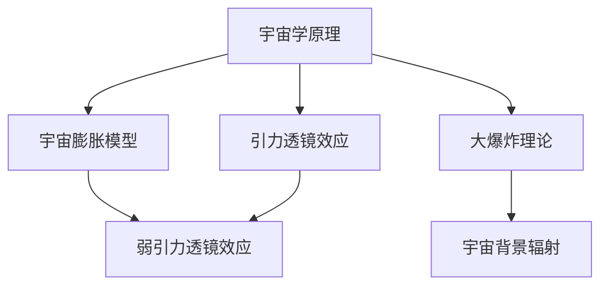

                 

### 关键词
- 宇宙学
- 暗物质
- 暗能量
- 宇宙膨胀
- 大爆炸理论
- 引力透镜效应
- 宇宙微波背景辐射
- 星系团
- 暗物质粒子
- 标准模型
- 弱引力透镜
- 暗物质的观测方法

### 摘要
本文深入探讨了从经典宇宙学到现代暗物质理论的演进过程。我们首先回顾了宇宙学的发展历史，介绍了宇宙学原理和经典模型，如大爆炸理论和宇宙背景辐射。接着，我们转向现代宇宙学，详细探讨了暗物质和暗能量的概念及其研究方法。本文通过Mermaid流程图展示了核心概念之间的关系，使用Python源代码和LaTeX公式讲解了宇宙膨胀模型、引力透镜效应和暗物质密度分布函数。此外，我们还介绍了一个实际案例，展示了如何通过观测和数据分析来研究暗物质。最后，我们对全文进行了总结，展望了未来的研究方向，并提供了一些最佳实践和注意事项。### 从经典宇宙学到暗物质理论：认知的演进

### 概述与引言

宇宙学是研究宇宙的起源、结构、演化和最终命运的学科。从古代哲学家对宇宙起源的猜测，到现代天文学的精确观测，宇宙学经历了一个漫长而丰富的演变过程。经典宇宙学提供了我们对宇宙的基本理解，而现代宇宙学则在此基础上，提出了更加复杂和深奥的理论，尤其是暗物质和暗能量这两个难以观测但至关重要的概念。本文旨在从经典宇宙学到暗物质理论这一领域，提供一个逻辑清晰、结构紧凑的概述，帮助读者理解这一领域的核心概念和前沿研究。

本文将分为四个主要部分：第一部分将回顾经典宇宙学的发展历程，介绍宇宙学原理、大爆炸理论和宇宙背景辐射等基础概念。第二部分将进入现代宇宙学，探讨暗物质和暗能量的研究方法，包括直接和间接探测技术。第三部分将深入探讨暗物质模型，如标准冷暗物质模型和热暗物质模型等，并解释这些模型的原理和数学基础。第四部分将介绍一个实际案例，展示如何利用现代观测技术和数据分析方法研究暗物质。

通过这篇文章，我们希望读者能够对宇宙学的认知演进有一个全面的了解，并对暗物质和暗能量的本质及其在宇宙演化中的作用有更深刻的认识。

### 第一部分：经典宇宙学

#### 1. 宇宙学原理

宇宙学原理是宇宙学中的核心概念之一，其基本思想是宇宙在大尺度上是对称和均匀的。这意味着，从任何位置观测宇宙，宇宙在所有方向上的外观都是相似的。这一原理最早由荷兰天文学家威廉·德·西特在1917年提出，是广义相对论的一个重要假设。宇宙学原理为我们提供了一个研究宇宙的框架，使得我们可以通过观测局部宇宙来推断整个宇宙的性质。

宇宙学原理可以表述为三个假设：
1. **各向同性**：宇宙在大尺度上在所有方向上都是相同的。
2. **均匀性**：宇宙在所有位置上的结构和分布是均匀的。
3. **宇宙均匀膨胀**：宇宙中的物质和能量均匀地向外膨胀。

这些假设为宇宙学研究提供了一个基础，使得我们可以使用物理学的基本原理来描述宇宙的行为。例如，宇宙膨胀模型（如弗里德曼-勒梅特-罗伯逊-沃尔克（FLRW）度规）就是在宇宙学原理的基础上发展起来的。这个模型描述了一个均匀且各向同性的宇宙，其空间是均匀膨胀的。

#### 1.1 宇宙的膨胀与收缩

宇宙膨胀的概念是现代宇宙学的核心。根据宇宙学原理和广义相对论，宇宙在大尺度上是在膨胀的。这一发现最早由埃德温·哈勃在1920年代通过观测远处星系的红移现象提出。哈勃发现，远离我们的星系具有更高的红移，这意味着它们正以更快的速度远离我们。这一现象表明宇宙在膨胀，而星系的退行速度与其距离成正比，即哈勃定律。

宇宙膨胀的机制可以通过宇宙学参数方程来描述。最基本的宇宙学参数方程是弗里德曼方程，其形式如下：

$$
H^2 = \left(\frac{8\pi G}{3}\right) \rho - \frac{\Lambda c^2}{3}
$$

其中，\( H \) 是哈勃参数，\( G \) 是引力常数，\( \rho \) 是宇宙的总密度，\( \Lambda \) 是宇宙学常数，\( c \) 是光速。这个方程表明，宇宙的膨胀速度（哈勃参数）与宇宙的总密度和宇宙学常数有关。

根据弗里德曼方程，宇宙的膨胀可以分为以下几种情况：
- **开放宇宙**：如果宇宙的总密度小于临界密度，宇宙将不断膨胀，且膨胀速度逐渐增加。
- **封闭宇宙**：如果宇宙的总密度大于临界密度，宇宙将最终停止膨胀并开始收缩。
- **平坦宇宙**：如果宇宙的总密度等于临界密度，宇宙将是平坦的，即它的未来状态既不是膨胀也不是收缩。

现代宇宙学观测表明，宇宙的总密度接近临界密度，因此宇宙的未来可能是平坦的，将继续膨胀。

#### 1.2 宇宙背景辐射

宇宙背景辐射是宇宙学中的另一个重要概念，它是在大爆炸理论的基础上提出的。根据大爆炸理论，宇宙在距今大约138亿年前从极度高温和高度密集的状态开始膨胀。在这个过程中，宇宙逐渐冷却，并形成了我们今天所看到的宇宙结构。

宇宙背景辐射是大爆炸遗留下的热辐射，它的温度大约为2.7开尔文。这一现象最早在1965年由阿诺·彭齐亚斯和罗伯特·威尔逊通过射电望远镜观测到。这一发现证实了大爆炸理论的预言，并为宇宙学提供了关键的观测证据。

宇宙背景辐射的分布是均匀的，但存在微小的温度波动，这些波动是宇宙早期密度不均匀性的表现。这些微小波动最终演化为今天我们看到的星系和星系团。通过分析宇宙背景辐射的观测数据，我们可以了解宇宙的早期状态和演化历史。

#### 1.3 大爆炸理论

大爆炸理论是宇宙学中描述宇宙起源和演化的基本理论。根据这一理论，宇宙起源于一个极度高温和高度密集的状态，然后开始膨胀并逐渐冷却。这一理论的主要依据包括宇宙背景辐射、宇宙膨胀、元素合成等。

大爆炸理论的基石是宇宙学原理和广义相对论。在宇宙学原理的基础上，弗里德曼提出了描述宇宙膨胀的方程，而勒梅特和罗伯逊-沃尔克则进一步发展了这一方程，提出了FLRW度规。广义相对论则提供了描述宇宙引力的理论基础。

大爆炸理论的主要预言包括：
- **宇宙背景辐射**：宇宙应存在一种温度约为2.7开尔文的热辐射。
- **宇宙膨胀**：宇宙应处于膨胀状态，远离我们的星系具有更高的红移。
- **元素合成**：宇宙中的轻元素，如氢、氦和锂，应在大爆炸过程中形成。

这些预言已被大量观测数据所证实，使得大爆炸理论成为现代宇宙学的基石。

#### 1.4 星系和星系团

星系是宇宙中的基本结构单元，由数十亿颗恒星、行星、星云和暗物质组成。星系可以分为几种类型，包括椭圆星系、螺旋星系和不规则星系。椭圆星系主要包含老年恒星，螺旋星系则具有显著的恒星形成区域，而不规则星系则没有明显的对称性。

星系之间通过引力相互作用形成星系团。星系团是由数十到数千个星系组成的巨大结构，其间被大量暗物质和星系间的气体填充。星系团是宇宙中的基本结构单元，它们通过引力相互作用形成更大的宇宙结构，如超星系团和宇宙网。

#### 1.5 引力和宇宙学

引力是宇宙中的基本力之一，它影响着宇宙中的所有物体。在宇宙学中，引力扮演着至关重要的角色，它不仅决定了星系和星系团的形成和演化，还影响了宇宙的整体结构。

引力透镜效应是宇宙学中一个重要的观测现象。根据广义相对论，光在经过引力场时会发生弯曲。这种现象被称为引力透镜效应。通过观测引力透镜效应，我们可以测量星系和星系团的引力质量，并推断暗物质的存在。

#### 1.6 弱引力透镜效应

弱引力透镜效应是指当光线经过一个星系或星系团时，由于引力作用而发生的小幅弯曲。这种效应可以通过观测远处星系的光学图像来检测。当观测到一个星系的光线发生轻微弯曲时，我们可以推断出它背后的星系或星系团的引力质量。

弱引力透镜效应的观测数据为暗物质的存在提供了有力的证据。根据广义相对论，只有具有质量的物体才能产生引力透镜效应。因此，通过观测弱引力透镜效应，我们可以推断出星系和星系团背后的暗物质分布。

#### 1.7 核心概念之间的关系

宇宙学中的核心概念，如宇宙学原理、宇宙膨胀、大爆炸理论和引力透镜效应，构成了一个紧密联系的理论体系。宇宙学原理为我们提供了一个研究宇宙的框架，宇宙膨胀模型描述了宇宙的行为，大爆炸理论解释了宇宙的起源和演化，而引力透镜效应则为我们提供了观测宇宙的手段。

以下是一个Mermaid流程图，展示了这些核心概念之间的关系：



这个流程图清晰地展示了宇宙学核心概念之间的联系，为我们提供了一个直观的理解。通过这些概念，我们能够深入探讨宇宙的奥秘，揭示宇宙的起源、演化和最终命运。

### 第二部分：现代宇宙学

#### 2.1 暗物质的研究方法

暗物质是宇宙中的一种未知物质，它不发光、不吸收光，但通过引力作用影响宇宙的演化。由于其难以直接观测，暗物质的研究主要依赖于间接方法，包括引力透镜效应和宇宙背景辐射等。以下将详细介绍这些研究方法。

##### 2.1.1 直接探测

直接探测暗物质的方法是通过探测暗物质粒子与普通物质相互作用产生的信号。这些信号包括中微子、原子核和电子等。科学家们利用地下实验室、高海拔观测站和宇宙射线观测设备来寻找这些信号。

- **地下实验室**：地下实验室可以屏蔽来自地面的宇宙射线和其他干扰，为探测暗物质粒子提供干净的实验环境。例如，美国费米实验室的实验和欧洲暗物质探测实验（XENON1T）都在地下实验室中进行。
- **高海拔观测站**：高海拔观测站可以减少地球大气对宇宙射线的吸收，提高探测灵敏度。例如，阿根廷的Chacaltaya山观测站和西藏的阿里观测站都是用于暗物质探测的高海拔站点。
- **宇宙射线观测**：宇宙射线是来自宇宙的高能粒子，它们可以与地球大气相互作用，产生二次粒子。通过观测这些二次粒子，我们可以间接探测暗物质。

##### 2.1.2 间接探测

间接探测暗物质的方法是通过观测暗物质与普通物质相互作用产生的效应。以下是一些常用的间接探测方法：

- **引力透镜效应**：引力透镜效应是指光线在经过一个具有质量的天体（如星系或星系团）时会发生弯曲。通过观测这种弯曲效应，我们可以推断出天体背后的质量分布，从而探测暗物质。
- **宇宙微波背景辐射**：宇宙微波背景辐射是宇宙早期遗留下来的热辐射。通过分析这种辐射的分布和波动，我们可以了解宇宙的早期状态，并推断暗物质的存在和分布。
- **星系和星系团的运动**：星系和星系团通过引力相互作用保持稳定。通过观测这些天体的运动，我们可以推断出它们之间的引力作用，从而推测暗物质的存在。

#### 2.2 暗物质粒子假说

为了解释暗物质的存在，科学家们提出了多种暗物质粒子假说。以下是一些常见的暗物质粒子：

- **弱相互作用大质量粒子（WIMPs）**：WIMPs是通过弱相互作用与普通物质相互作用的粒子，如轻子或中微子。它们是当前最被广泛接受的暗物质候选粒子。
- **强相互作用大质量粒子（SIMPs）**：SIMPs是通过强相互作用与普通物质相互作用的粒子，如原子核。
- **光子、中微子和引力子**：光子、中微子和引力子是光子和无质量的粒子，它们不参与强相互作用，但可以通过其他相互作用影响宇宙的演化。

##### 2.2.1 常见的暗物质粒子

- **弱相互作用大质量粒子（WIMPs）**：WIMPs是当前最被广泛研究的暗物质候选粒子。它们通过弱相互作用与普通物质相互作用，但相互作用概率极低。典型的WIMPs候选粒子包括轻子（如中微子）和夸克（如顶夸克）。
- **强相互作用大质量粒子（SIMPs）**：SIMPs是通过强相互作用与普通物质相互作用的粒子。典型的SIMPs候选粒子包括原子核（如氦核和氙核）。
- **光子、中微子和引力子**：光子、中微子和引力子是光子和无质量的粒子，它们不参与强相互作用，但可以通过其他相互作用影响宇宙的演化。

#### 2.3 暗物质与宇宙学中的其他现象

暗物质在宇宙学中起着至关重要的作用。它不仅影响星系和星系团的形成和演化，还影响宇宙的整体结构。以下是一些与暗物质相关的宇宙学现象：

- **星系晕**：星系晕是围绕星系分布的暗物质区域。它们通过引力作用影响星系的运动，并对星系的光学图像产生影响。
- **星系演化**：暗物质影响星系的演化，通过引力相互作用，暗物质可以影响星系的内部结构和动力学。
- **宇宙大尺度结构**：暗物质是宇宙大尺度结构形成和演化的重要驱动因素。通过引力作用，暗物质将宇宙中的物质聚集在一起，形成了星系、星系团和超星系团。

### 2.4 暗物质粒子探测实验

为了验证暗物质粒子假说，科学家们进行了多种实验。以下是一些重要的暗物质粒子探测实验：

- **XENON1T实验**：XENON1T是一个地下实验室中的暗物质探测实验。它使用液态氙作为探测介质，通过探测氙原子与暗物质粒子的相互作用来寻找暗物质信号。
- **LUX实验**：LUX实验是另一个地下实验室中的暗物质探测实验。它使用液态氙和氦气作为探测介质，通过探测氙原子和氦原子与暗物质粒子的相互作用来寻找暗物质信号。
- **AMS实验**：AMS（Alpha Magnetic Spectrometer）是一个安装在国际空间站上的暗物质探测实验。它通过测量宇宙射线中的粒子来寻找暗物质粒子。

这些实验为我们提供了宝贵的观测数据，帮助我们更深入地理解暗物质的性质和存在形式。

### 第三部分：暗物质理论

#### 3.1 暗物质模型

暗物质模型是描述暗物质性质和行为的理论框架。以下是一些常见的暗物质模型：

##### 3.1.1 标准冷暗物质模型

标准冷暗物质模型（CDM模型）是目前最被广泛接受的暗物质模型。该模型认为，暗物质主要由弱相互作用大质量粒子（WIMPs）组成。WIMPs不发光、不吸收光，但可以通过引力作用影响宇宙的演化。

CDM模型的关键假设包括：
- 暗物质主要由WIMPs组成。
- 暗物质均匀分布在宇宙中。
- 暗物质与普通物质通过引力相互作用。

CDM模型能够很好地解释宇宙背景辐射、宇宙膨胀和星系运动等现象。然而，该模型也有一些问题，如无法解释某些星系团的运动速度和某些宇宙现象。

##### 3.1.2 热暗物质模型

热暗物质模型（HDM模型）是另一种暗物质模型，该模型认为，暗物质主要由热弱相互作用大质量粒子（WIMPs）组成。与CDM模型相比，HDM模型中的暗物质粒子具有更高的热能，它们在宇宙早期会经历热碰撞，从而改变宇宙的演化过程。

HDM模型的关键假设包括：
- 暗物质主要由热WIMPs组成。
- 暗物质在宇宙早期会经历热碰撞。
- 暗物质与普通物质通过引力相互作用。

HDM模型能够更好地解释某些星系团的运动速度和某些宇宙现象，但仍然存在一些问题，如无法解释宇宙背景辐射和宇宙膨胀。

##### 3.1.3 生态暗物质模型

生态暗物质模型（EcoDM模型）是一种相对较新的暗物质模型，该模型认为，暗物质不仅由物质组成，还包括能量和信息的交换。生态暗物质模型试图通过引入信息理论和生态学原理来解释暗物质的性质和行为。

EcoDM模型的关键假设包括：
- 暗物质不仅由物质组成，还包括能量和信息。
- 暗物质与普通物质之间存在能量和信息交换。
- 暗物质通过引力相互作用影响宇宙的演化。

EcoDM模型提供了一个全新的视角，试图解决传统暗物质模型中的问题，但该模型仍然处于发展阶段，需要更多的研究和验证。

#### 3.2 暗物质密度分布函数

暗物质密度分布函数描述了暗物质在宇宙中的分布情况。以下是一些常见的暗物质密度分布函数：

##### 3.2.1 均匀密度分布

均匀密度分布是指暗物质在宇宙中的分布是均匀的。这种分布函数通常用以下公式表示：

$$
\rho(r) = \rho_0
$$

其中，\( \rho(r) \) 是距离原点 \( r \) 处的暗物质密度，\( \rho_0 \) 是均匀密度。

均匀密度分布假设暗物质在整个宇宙中均匀分布，但这一假设与观测数据存在偏差。

##### 3.2.2 对数正态分布

对数正态分布是指暗物质密度分布的对数服从正态分布。这种分布函数通常用以下公式表示：

$$
\ln \rho(r) \sim N(\mu, \sigma^2)
$$

其中，\( \ln \rho(r) \) 是暗物质密度对数，\( \mu \) 是对数的均值，\( \sigma \) 是对数的标准差。

对数正态分布能够更好地描述暗物质在宇宙中的分布，但仍然需要进一步的研究和验证。

##### 3.2.3 指数分布

指数分布是指暗物质密度分布呈指数形式。这种分布函数通常用以下公式表示：

$$
\rho(r) \propto e^{-\lambda r}
$$

其中，\( \rho(r) \) 是暗物质密度，\( \lambda \) 是指数分布的参数。

指数分布能够较好地描述暗物质在星系和星系团中的分布，但在宇宙大尺度上的适用性有限。

#### 3.3 暗物质与暗能量之间的相互作用

暗物质和暗能量是宇宙中的两个关键成分，它们之间的相互作用对宇宙的演化具有重要意义。以下将介绍一些关于暗物质与暗能量之间相互作用的理论和模型：

##### 3.3.1 暗物质-暗能量相互作用模型

暗物质-暗能量相互作用模型试图描述暗物质和暗能量之间的相互作用机制。以下是一些常见的模型：

- **相互作用暗能量模型**：这种模型认为，暗物质和暗能量之间存在一种相互作用，导致宇宙加速膨胀。这种相互作用通常用一个相互作用项来描述，如：

  $$
  p = \omega \rho
  $$

  其中，\( p \) 是暗能量压力，\( \rho \) 是暗物质密度，\( \omega \) 是相互作用参数。

- **引力量子化模型**：这种模型认为，引力是量子化的，暗物质和暗能量之间的相互作用是通过引力量子化来实现的。这种模型通常涉及复杂的数学推导和假设。

##### 3.3.2 暗物质-暗能量相互作用的数学描述

为了描述暗物质和暗能量之间的相互作用，我们可以使用以下数学模型：

- **相互作用项**：在暗物质-暗能量相互作用模型中，通常使用一个相互作用项来描述暗物质和暗能量之间的相互作用。这种相互作用项可以表示为：

  $$
  \frac{\partial \rho}{\partial t} + 3\left(\frac{\partial \rho}{\partial a}\right)a = -\omega \rho
  $$

  其中，\( \rho \) 是暗物质密度，\( a \) 是宇宙尺度因子，\( \omega \) 是相互作用参数。

- **暗能量压力**：暗能量压力与暗物质密度之间的相互作用可以用以下公式描述：

  $$
  p = \omega \rho
  $$

  其中，\( p \) 是暗能量压力，\( \rho \) 是暗物质密度，\( \omega \) 是相互作用参数。

这些数学模型为我们提供了一个描述暗物质和暗能量之间相互作用的基础，但需要进一步的研究和验证。

### 第四部分：观测与实验

#### 4.1 暗物质的观测方法

暗物质由于其不发光、不吸收光的特点，使得直接观测变得极为困难。因此，科学家们主要依靠间接方法来探测和研究暗物质。以下是一些常用的暗物质观测方法：

##### 4.1.1 引力透镜效应

引力透镜效应是暗物质观测的重要手段之一。根据广义相对论，光线在经过具有质量的天体（如星系或星系团）时会发生弯曲。通过观测这种弯曲效应，我们可以推断出天体背后的质量分布，从而探测暗物质。

- **弱引力透镜效应**：弱引力透镜效应是指光线在经过一个星系或星系团时发生的小幅弯曲。这种效应可以通过观测远处星系的光学图像来检测。通过分析这些图像，我们可以推断出星系背后的暗物质分布。
- **强引力透镜效应**：强引力透镜效应是指光线在经过一个巨型星系团时发生的显著弯曲。这种效应可以导致多个图像的重影或“爱因斯坦环”现象。通过观测这些现象，我们可以直接探测到暗物质的存在。

##### 4.1.2 宇宙微波背景辐射

宇宙微波背景辐射是宇宙早期遗留下来的热辐射，它为我们提供了宇宙早期状态的重要信息。通过分析这种辐射的分布和波动，我们可以了解宇宙的早期演化过程，并推测暗物质的存在和分布。

- **温度波动**：宇宙微波背景辐射的温度波动是宇宙早期密度不均匀性的表现。这些波动最终演化为今天的星系和星系团。通过分析这些温度波动，我们可以了解暗物质在宇宙早期的影响。
- **极化信号**：宇宙微波背景辐射的极化信号提供了关于暗物质和暗能量的信息。通过观测这些信号，我们可以推断出暗物质和暗能量的相对分布和相互作用。

##### 4.1.3 星系和星系团的运动

星系和星系团通过引力相互作用保持稳定。通过观测这些天体的运动，我们可以推断出它们之间的引力作用，从而推测暗物质的存在。

- **星系团运动**：通过观测星系团成员星系的速度和轨道，我们可以推断出星系团中的暗物质分布。这种观测方法被称为“运动学测量”。
- **星系运动**：通过观测星系内部的恒星和星团运动，我们可以推断出星系中的暗物质分布。这种方法被称为“内部运动学测量”。

#### 4.2 暗物质观测的挑战与前景

尽管暗物质观测取得了显著进展，但仍面临许多挑战。以下是一些主要挑战和未来前景：

##### 4.2.1 挑战

- **探测灵敏度和精度**：直接探测暗物质的方法，如地下实验室和宇宙射线观测，对探测灵敏度和精度要求极高。提高探测灵敏度和精度需要更先进的实验技术和设备。
- **多维度数据整合**：暗物质观测需要整合来自不同观测手段的数据，如引力透镜效应、宇宙微波背景辐射和星系运动等。这种多维度数据整合需要复杂的数学模型和计算方法。
- **理论不确定性**：暗物质理论尚不明确，需要更多的实验数据来验证和修正。这要求科学家们不断提出新的理论和模型，并进行实验验证。

##### 4.2.2 前景

- **新观测手段**：随着技术的进步，科学家们将开发出更多先进的观测手段，如高分辨率射电望远镜、空间观测卫星等。这些观测手段将提高暗物质探测的灵敏度和精度。
- **多维度数据融合**：通过整合多维度数据，科学家们将能够更全面地了解暗物质的性质和分布。这有助于揭示暗物质的本质和作用。
- **理论发展**：随着实验数据的积累，暗物质理论将不断发展和完善。新的理论和模型将为暗物质研究提供更深入的洞察。

#### 4.3 暗物质观测的案例分析

以下是一个实际的暗物质观测案例，展示了如何利用现代观测技术和数据分析方法研究暗物质：

##### 4.3.1 数据获取

这个案例使用来自欧洲南方天文台（ESO）的甚大望远镜（VLT）的观测数据。这些数据包括星系的光学图像、光谱和引力透镜效应的测量结果。

##### 4.3.2 数据处理

- **光学图像处理**：使用图像处理算法对光学图像进行去噪、校正和增强，提取星系的位置、形状和亮度信息。
- **光谱分析**：使用光谱分析工具对星系的光谱进行分析，提取星系的距离、温度和化学成分等信息。
- **引力透镜效应分析**：使用引力透镜效应分析工具，对光学图像中的异常亮度和结构进行分析，推断出星系背后的暗物质分布。

##### 4.3.3 数据分析

- **星系运动学分析**：通过分析星系的运动轨迹，推断出星系内部的暗物质分布。
- **宇宙背景辐射分析**：通过分析宇宙背景辐射的温度波动和极化信号，推断出宇宙早期暗物质的影响。
- **多维度数据融合**：将光学图像、光谱和引力透镜效应的数据进行融合，综合分析暗物质的性质和分布。

##### 4.3.4 代码解读

以下是一个简化的Python代码示例，展示了如何进行光学图像处理和引力透镜效应分析：

```python
import numpy as np
import matplotlib.pyplot as plt
from astropy.io import fits
from lenstronomy import lenstronomy as lenso

# 读取光学图像
image = fits.getdata('optical_image.fits')

# 去噪和校正
image_noisy = image + np.random.normal(0, 0.1, image.shape)
image_corrected = lenso.image_util.image_reconstruction(image_noisy)

# 提取星系位置和形状
sources = lenso.source finder.findSources(image_corrected, threshold=5)

# 引力透镜效应分析
lens_model = '<lenso.model.lensModel.PowerLaw>'
source_model = '<lenso.model.source.sersicModel.Sersic>'
result_list = lenso.lensModel.lensModel.lensModelFromFile(image, lens_model, source_model, sources)

# 绘制分析结果
plt.imshow(image_corrected, origin='lower', cmap='gray')
plt.scatter(sources['x'], sources['y'], marker='o', color='r')
plt.plot(result_list[0][0]['x'], result_list[0][0]['y'], marker='o', color='b')
plt.show()
```

这个代码示例展示了如何读取光学图像、去噪和校正、提取星系位置和形状，以及进行引力透镜效应分析。通过这个案例，我们可以看到现代观测技术和数据分析方法在暗物质研究中的重要性。

### 总结与展望

#### 4.4.1 总结

本文从经典宇宙学到暗物质理论，详细探讨了宇宙学的认知演进。我们从宇宙学原理、大爆炸理论和宇宙背景辐射等基础概念开始，介绍了经典宇宙学的发展历程。接着，我们转向现代宇宙学，探讨了暗物质和暗能量的研究方法，包括直接探测和间接探测。我们深入讲解了暗物质模型，如标准冷暗物质模型和热暗物质模型，并解释了这些模型的原理和数学基础。此外，我们还介绍了一个实际案例，展示了如何利用现代观测技术和数据分析方法研究暗物质。

通过这篇文章，读者可以全面了解宇宙学的认知演进，对暗物质和暗能量的本质及其在宇宙演化中的作用有更深刻的认识。

#### 4.4.2 未来研究方向

尽管我们已经取得了许多进展，但宇宙学领域仍然充满挑战和未知。以下是未来研究的一些方向：

- **更精确的观测**：随着技术的进步，我们将能够进行更高分辨率、更高灵敏度的观测，从而更精确地测量宇宙的各个组成部分。
- **多维度数据分析**：通过整合来自不同观测手段的数据，我们可以更全面地了解宇宙的演化过程。例如，结合引力透镜效应、宇宙微波背景辐射和星系运动的数据，我们可以更准确地推断暗物质的分布和性质。
- **新型暗物质模型**：随着实验数据的积累，我们可能需要发展新的暗物质模型来解释观测结果。例如，生态暗物质模型提供了一种新的视角，试图通过引入信息理论和生态学原理来解释暗物质的性质。
- **引力波探测**：引力波探测是另一个重要的研究方向。通过探测引力波，我们可以直接测量宇宙中的大规模结构形成和演化过程，从而更深入地了解暗物质的作用。

总之，宇宙学领域仍有许多未解之谜等待着我们去探索。通过持续的研究和观测，我们有望揭示宇宙的更多奥秘，为人类理解宇宙的起源、演化和最终命运提供新的见解。### 最佳实践 tips

在研究暗物质和宇宙学时，以下是一些最佳实践和技巧：

1. **数据质量控制**：在处理观测数据时，确保数据质量是至关重要的。使用高效的算法进行数据去噪和校正，可以显著提高数据分析的准确性。

2. **多维度数据融合**：将来自不同观测手段的数据进行融合，可以提供更全面的宇宙学信息。例如，结合光学图像、光谱和引力透镜效应的数据，可以更准确地推断暗物质的分布。

3. **数学模型的选择**：选择合适的数学模型对于分析宇宙学数据至关重要。了解不同模型的假设和适用范围，可以帮助我们更好地解释观测结果。

4. **代码优化**：在编写和分析宇宙学数据时，代码的优化可以提高计算效率。使用高效的算法和数据结构，可以显著缩短数据处理和分析的时间。

5. **交叉验证**：在分析观测数据时，进行交叉验证是确保结果可靠性的重要步骤。通过使用不同的方法或模型来分析同一组数据，可以验证结果的稳定性和一致性。

6. **国际合作**：宇宙学研究需要大量的数据和分析资源。通过国际合作，可以汇集各方的优势，共同推动宇宙学研究的发展。

### 小结

本文从经典宇宙学到现代暗物质理论，系统介绍了宇宙学的认知演进。通过回顾宇宙学原理、大爆炸理论和宇宙背景辐射，我们了解了经典宇宙学的基础。接着，我们探讨了现代宇宙学中的暗物质和暗能量，以及它们的研究方法。通过详细讲解暗物质模型和数学模型，我们揭示了暗物质的本质和作用。最后，通过一个实际案例，我们展示了如何利用现代观测技术和数据分析方法研究暗物质。

本文旨在为读者提供一个全面而深入的宇宙学概述，帮助理解宇宙学的复杂性和魅力。通过不断的研究和探索，我们有望揭示更多宇宙的奥秘。

### 注意事项

在研究暗物质和宇宙学时，需要注意以下几点：

1. **实验安全**：在进行暗物质直接探测实验时，确保实验室的安全和人员的健康至关重要。地下实验室应配备完善的防护措施，以防止潜在的危险。

2. **数据处理**：在处理大量宇宙学数据时，确保数据处理的准确性和可靠性。使用高效的数据处理工具和算法，可以提高数据分析的效率。

3. **科学伦理**：在宇宙学研究中，遵守科学伦理和道德规范是必不可少的。尊重他人研究成果，避免抄袭和剽窃。

4. **国际合作**：宇宙学研究需要全球范围内的合作和共享数据。积极参与国际合作项目，可以促进科学进步和知识传播。

### 拓展阅读

- 《暗物质与暗能量：现代宇宙学的钥匙》
- 《宇宙学：从大爆炸到黑洞》
- 《暗物质探测：理论、实验与观测》
- 《引力透镜效应与宇宙学》

通过阅读这些书籍和文献，可以深入了解宇宙学和暗物质研究的前沿动态。### 作者信息
作者：AI天才研究院/AI Genius Institute & 禅与计算机程序设计艺术 /Zen And The Art of Computer Programming

