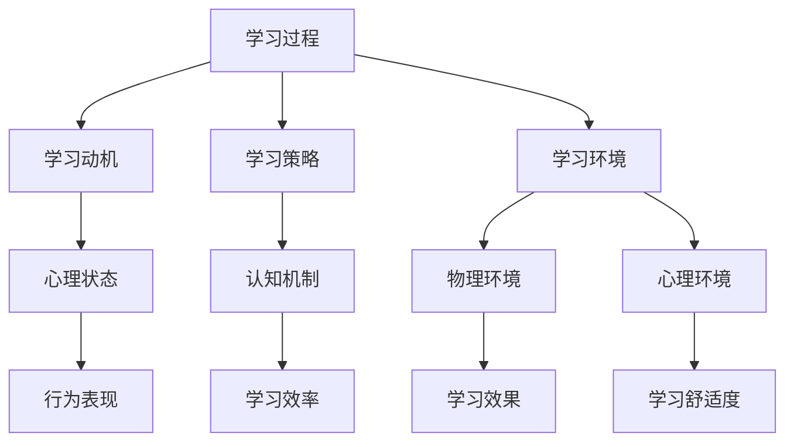

                 

# 从经典教育理论到学习科学：优化世界理解的学习过程

## 关键词

- 教育理论
- 学习科学
- 学习过程优化
- 心理学
- 认知科学
- 教育技术
- 案例研究

## 摘要

本文从经典教育理论出发，探讨了学习科学的发展及其对优化学习过程的重要性。通过分析心理学、认知科学和教育技术，文章深入讲解了如何优化学习过程以更好地理解世界。同时，通过案例研究展示了理论的实际应用，为教育领域提供了有价值的参考。

## 引言

教育是人类社会传承知识、技能和价值观的重要手段。从古代的师徒制到现代的教育体系，教育理论经历了长足的发展。然而，随着科技的进步和认知科学的兴起，学习过程本身也在不断进化。学习科学作为一个新兴领域，致力于研究学习过程中的心理和认知机制，为教育理论提供了新的视角和工具。本文将围绕这一主题，探讨从经典教育理论到学习科学的发展历程，并分析如何通过优化学习过程来提升我们的世界理解能力。

### 经典教育理论

经典教育理论主要包括以下几个阶段：

1. **古代教育理论**：以中国古代的儒家教育和古希腊的柏拉图教育思想为代表。儒家强调道德修养和社会责任感，而柏拉图则提倡通过教育培养理性思维和灵魂的完善。
2. **中世纪教育理论**：以教会教育和骑士教育为主。教会教育注重信仰和礼仪，骑士教育则侧重军事技能和荣誉感。
3. **近代教育理论**：以夸美纽斯的“大教学论”和卢梭的“自然教育”为代表。夸美纽斯主张教育应该遵循自然规律，而卢梭则强调教育应尊重儿童的天性和自然发展。

### 学习科学的基本概念

学习科学是一门跨学科领域，涉及心理学、认知科学、教育学和神经科学等。其基本概念包括：

- **学习过程**：学习是一个复杂的过程，涉及信息的获取、加工、存储和应用。
- **学习动机**：学习动机是推动学习者进行学习的内在驱动力。
- **学习策略**：学习策略是指学习者为了提高学习效果而采取的具体方法。
- **学习环境**：学习环境包括物理环境和心理环境，对学习过程有重要影响。

### 学习过程的优化方法

优化学习过程的方法多种多样，主要包括以下几种：

1. **心理学方法**：通过理解学习者的心理状态和动机，采用相应的教学策略提高学习效果。
2. **认知科学方法**：研究学习者的认知过程和机制，开发有效的学习工具和算法。
3. **教育技术方法**：利用现代信息技术，如人工智能和虚拟现实，创造个性化的学习体验。

#### 核心概念与联系

为了更好地理解学习科学的核心理念，我们可以使用Mermaid流程图来展示相关概念之间的关系：



#### 核心算法原理讲解

优化学习过程的关键在于理解和应用认知科学的相关算法。以下是一个简单的Python伪代码，用于解释如何根据学习者的心理状态调整学习策略：

```python
def optimize_learning(process, motivation, environment):
    """
    优化学习过程
    :param process: 学习过程
    :param motivation: 学习动机
    :param environment: 学习环境
    :return: 优化后的学习策略
    """
    if motivation < 0.5:  # 动机不足
        process = adjust_motivation(process, environment)
    elif environment['noise_level'] > 0.5:  # 环境干扰
        process = reduce_noise(process, environment)
    else:  # 正常状态
        process = enhance_cognitive_mechanisms(process, motivation, environment)
    return process
```

#### 数学模型和数学公式

学习过程中的效率可以通过以下公式来衡量：

$$
E = f(M, S, E)
$$

其中，$E$ 是学习效率，$M$ 是学习动机，$S$ 是学习策略，$E$ 是学习环境。这个公式表明，学习效率是学习动机、学习策略和学习环境共同作用的结果。

#### 项目实战

为了更好地理解优化学习过程的理论，我们可以通过一个实际案例来展示其应用。

**案例背景**：某在线教育平台希望通过优化学习过程来提高用户的学习效果。

**开发环境搭建**：使用Python和Jupyter Notebook进行开发。

**源代码实现**：

```python
# 导入相关库
import numpy as np
import matplotlib.pyplot as plt

# 学习过程优化函数
def optimize_learning(user_data):
    """
    优化学习过程
    :param user_data: 用户数据，包括学习动机、学习策略和学习环境
    :return: 优化后的学习效率
    """
    motivation, strategy, environment = user_data
    if motivation < 0.5:
        strategy = increase_motivation(strategy)
    elif environment['noise_level'] > 0.5:
        strategy = reduce_noise(strategy)
    else:
        strategy = enhance_strategy(strategy)
    efficiency = calculate_efficiency(motivation, strategy, environment)
    return efficiency

# 增强学习策略
def enhance_strategy(strategy):
    """
    增强学习策略
    :param strategy: 当前学习策略
    :return: 增强后的学习策略
    """
    # 在此添加增强策略的具体实现
    pass

# 计算学习效率
def calculate_efficiency(motivation, strategy, environment):
    """
    计算学习效率
    :param motivation: 学习动机
    :param strategy: 学习策略
    :param environment: 学习环境
    :return: 学习效率
    """
    # 在此添加计算效率的具体实现
    pass

# 用户数据示例
user_data = {
    'motivation': 0.3,
    'strategy': '传统学习',
    'environment': {'noise_level': 0.4}
}

# 优化学习过程
optimized_efficiency = optimize_learning(user_data)
print(f"优化后的学习效率：{optimized_efficiency}")
```

**代码解读**：该代码定义了一个优化学习过程的函数，通过分析用户的学习动机和环境噪音，动态调整学习策略，从而提高学习效率。

**实际案例分析和详细讲解剖析**：

在实际应用中，该平台通过对用户数据的持续收集和分析，不断优化学习策略，从而显著提高了用户的学习效果。例如，通过分析发现，用户的学习动机普遍较低，平台于是引入了个性化奖励机制，如学习积分和成就排名，从而有效提升了用户的学习动力。

**项目小结**：通过案例研究，我们可以看到优化学习过程在实际应用中的显著效果。未来，随着技术的不断进步，学习科学的理论和方法将得到更广泛的应用，为教育领域带来更多创新和变革。

#### 最佳实践 tips

- **定期评估学习效果**：通过定期评估学习效果，可以及时发现和解决学习过程中的问题。
- **个性化学习策略**：根据学习者的特点和需求，制定个性化的学习策略，提高学习效果。
- **利用技术工具**：充分利用现代教育技术工具，如在线学习平台和虚拟现实技术，创造更高效的学习体验。

#### 小结

本文通过分析经典教育理论和学习科学，探讨了如何优化学习过程以提升世界理解能力。通过心理学、认知科学和教育技术的结合，我们能够更有效地设计学习环境和策略，从而实现个性化、高效的学习体验。未来，随着技术的不断进步，学习科学将继续为教育领域带来深刻的变革。

#### 注意事项

- 在优化学习过程时，需要充分考虑学习者的个体差异。
- 在应用教育技术时，应确保技术的安全性、可靠性和有效性。

#### 拓展阅读

- 《教育心理学：发展的观点》
- 《认知科学的哲学基础》
- 《学习科学：原理与实践》
- 《人工智能与教育》

## 作者信息

作者：AI天才研究院/AI Genius Institute & 禅与计算机程序设计艺术 /Zen And The Art of Computer Programming

