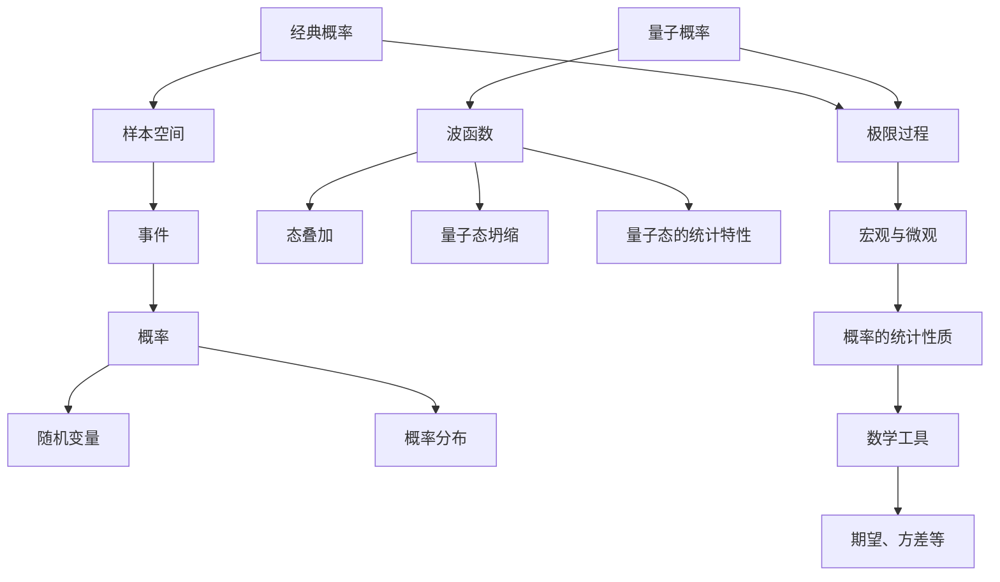

                 

### 背景介绍

概率论作为数学的一个分支，起源于17世纪的赌博问题，但其在科学和技术领域的应用早已超越了这一范畴。经典概率论，以17世纪著名数学家帕斯卡和费马的工作为起点，逐渐发展成为一套完整的理论体系，广泛应用于统计学、经济学、物理学等领域。经典概率论的核心思想是通过统计大量重复实验的结果，来预测个别事件发生的可能性。

在经典概率论中，事件发生的概率被认为是一个确定的数值，可以通过实验或数学模型来计算。这种确定性源于假设实验结果的均匀分布，即每个可能的结果具有相同的发生概率。然而，经典概率论的这种确定性在面对微观世界时显得力不从心。

20世纪初，量子力学的诞生为概率论注入了新的活力。量子力学揭示了微观世界的非确定性，即粒子状态的不确定性。量子概率论基于这一发现，提出了一种新的概率解释，即粒子的状态不能用确定的数值来描述，而是用概率波函数来表示。这一理论不仅在物理学领域产生了深远影响，还挑战了经典概率论的一些基本假设。

量子概率论的核心概念包括波函数、态叠加原理和测量问题。波函数是一个复值函数，描述了粒子在某一状态下的概率分布。态叠加原理指出，粒子可以同时处于多种状态的叠加。测量问题则涉及当对粒子进行测量时，其状态会坍缩为某个具体的状态，但这个具体的状态是不可预知的。

本文旨在从经典概率论到量子概率论的发展过程出发，深入探讨两者的区别与联系，解析量子概率论的核心概念及其在微观世界中的应用。通过本文的阅读，读者将对概率论在描述宇宙根本不确定性方面的作用有更深刻的理解。本文还将结合实际案例，展示量子概率论在科学研究和技术应用中的重要性。

### 核心概念与联系

在探讨概率论的发展历程时，理解经典概率和量子概率之间的区别与联系是至关重要的。首先，我们需要明确这两个概念的核心思想及其相互关系。

**经典概率论：** 经典概率论主要研究随机事件的概率分布和统计规律。其核心概念包括：

- **样本空间（Sample Space）:** 所有可能结果的集合。
- **事件（Event）:** 样本空间的一个子集。
- **概率（Probability）:** 某个事件发生的可能性，通常用0到1之间的数值表示。
- **概率分布（Probability Distribution）:** 描述随机变量取各个可能值的概率。
- **随机变量（Random Variable）:** 将样本空间的元素映射到实数集的函数。

在经典概率论中，事件的发生概率是基于实验的频率或数学上的概率模型来确定的。例如，掷一枚公平的硬币，出现正面和反面的概率都是0.5。

**量子概率论：** 量子概率论是量子力学中描述微观粒子行为的基础理论。其核心概念包括：

- **波函数（Wave Function）:** 描述粒子在某一状态下位置和动量的概率分布。
- **态叠加（Superposition）:** 粒子可以同时处于多个状态的叠加。
- **量子态坍缩（Quantum Collapse）:** 测量过程中，量子系统从一个叠加态坍缩为一个确定的状态。
- **量子态的统计特性（Statistical Properties）:** 量子态的概率分布，反映了粒子状态的不确定性。

量子概率论与经典概率论在概念上的主要区别在于，量子态不是确定的，而是以波函数的形式存在，描述了粒子在不同状态下出现的概率。波函数的平方模给出了粒子在某一位置出现的概率密度。

**两者之间的联系：** 尽管经典概率论和量子概率论在描述物理现象的方法和假设上有所不同，但它们之间存在深刻的联系：

1. **概率的统计性质：** 在宏观尺度上，经典概率论和量子概率论都体现了概率的统计性质。大量重复实验的结果显示，事件发生的频率趋近于其概率。
   
2. **数学工具：** 经典概率论和量子概率论都使用了概率分布、期望、方差等数学工具来描述随机现象。

3. **极限过程：** 当量子系统的规模增大时，量子概率逐渐接近经典概率。这是量子力学的极限定理所揭示的。

为了更好地理解这两者之间的联系，我们可以使用Mermaid流程图来展示经典概率与量子概率的核心概念及其关系：



通过上述Mermaid流程图，我们可以看到经典概率和量子概率的核心概念及其相互关系，从而更好地理解它们在描述宇宙根本不确定性方面的作用。

### 经典概率的核心算法原理

经典概率论的核心算法包括概率的加法规则、乘法规则以及贝叶斯定理。这些算法为处理随机事件和概率分布提供了理论基础。以下将分别对这些算法进行详细解释和举例说明。

**1. 概率的加法规则**

概率的加法规则用于计算两个或多个互斥事件中至少发生一个的概率。互斥事件是指两个事件不能同时发生。公式为：

\[ P(A \cup B) = P(A) + P(B) - P(A \cap B) \]

其中，\( P(A \cup B) \) 表示事件A或事件B发生的概率，\( P(A) \) 和 \( P(B) \) 分别表示事件A和事件B发生的概率，\( P(A \cap B) \) 表示事件A和事件B同时发生的概率。

**例子：** 掷两枚公平的硬币，计算至少出现一次正面的概率。

- \( P(正面) = 0.5 \)
- \( P(反面) = 0.5 \)

事件A：第一枚硬币正面朝上；事件B：第二枚硬币正面朝上。

由于掷硬币的结果是互斥的，所以 \( P(A \cap B) = 0 \)。

\[ P(A \cup B) = P(A) + P(B) - P(A \cap B) = 0.5 + 0.5 - 0 = 1.0 \]

因此，至少出现一次正面的概率为1.0。

**2. 概率的乘法规则**

概率的乘法规则用于计算两个独立事件同时发生的概率。独立事件是指一个事件的发生不会影响另一个事件的发生。公式为：

\[ P(A \cap B) = P(A) \times P(B|A) \]

其中，\( P(A \cap B) \) 表示事件A和事件B同时发生的概率，\( P(A) \) 表示事件A发生的概率，\( P(B|A) \) 表示在事件A发生的条件下，事件B发生的概率。

**例子：** 掷两枚公平的硬币，计算两枚硬币都正面朝上的概率。

- \( P(第一枚正面) = 0.5 \)
- \( P(第二枚正面 | 第一枚正面) = 0.5 \)

由于硬币是独立的，所以 \( P(B|A) = P(B) \)。

\[ P(A \cap B) = P(A) \times P(B) = 0.5 \times 0.5 = 0.25 \]

因此，两枚硬币都正面朝上的概率为0.25。

**3. 贝叶斯定理**

贝叶斯定理是概率论中用于计算条件概率的重要工具。它描述了在已知某个事件发生的条件下，另一个事件发生的概率。公式为：

\[ P(A|B) = \frac{P(B|A) \times P(A)}{P(B)} \]

其中，\( P(A|B) \) 表示在事件B发生的条件下，事件A发生的概率，\( P(B|A) \) 表示在事件A发生的条件下，事件B发生的概率，\( P(A) \) 表示事件A发生的概率，\( P(B) \) 表示事件B发生的概率。

**例子：** 某工厂生产的产品有90%是合格的，现在随机抽取一件产品，发现它是合格的，求这件产品是次品的概率。

- \( P(合格品) = 0.9 \)
- \( P(次品) = 0.1 \)
- \( P(合格 | 次品) = 0 \)
- \( P(合格 | 合格品) = 1 \)

我们需要计算 \( P(次品 | 合格) \)。

\[ P(次品 | 合格) = \frac{P(合格 | 次品) \times P(次品)}{P(合格)} = \frac{0 \times 0.1}{0.9} = 0 \]

由于计算结果为0，这意味着如果抽到的是合格品，那么它是次品的概率为0，这是合乎逻辑的，因为已知产品是合格的，它就不可能是次品。

通过上述经典概率的核心算法原理的详细讲解和实例说明，我们可以更深入地理解经典概率论在处理随机事件和概率分布时的应用方法。这些算法不仅为理论分析提供了基础，也为实际应用中的决策和预测提供了工具。

### 量子概率的核心算法原理

量子概率论的核心算法原理在很大程度上与经典概率论有所不同，其主要源于量子力学的基本假设和数学表达。在量子概率论中，粒子状态不是确定的，而是以波函数的形式存在，并通过概率波函数的平方模来描述粒子在不同位置出现的概率。以下将详细讲解量子概率的核心算法原理，包括波函数、态叠加原理和量子态坍缩等。

**1. 波函数**

波函数是量子力学中描述粒子状态的基本数学工具，通常用 \(\Psi(\vec{r}, t)\) 表示。它是一个复值函数，依赖于粒子的位置 \(\vec{r}\) 和时间 \(t\)。波函数的模平方 \(|\Psi(\vec{r}, t)|^2\) 描述了粒子在位置 \(\vec{r}\) 出现的概率密度。也就是说，如果我们在某个位置进行测量，波函数的模平方给出了粒子在该位置出现的概率。

**公式表示：**

\[ \psi(\vec{r}, t) = \sum_{n} c_n e^{-iE_nt/\hbar} \]

其中，\(c_n\) 是归一化系数，\(E_n\) 是粒子的能量本征值，\(\hbar\) 是普朗克常数。

**例子：** 考虑一个简单的量子态 \(\psi = \frac{1}{\sqrt{2}} |0\rangle + \frac{1}{\sqrt{2}} |1\rangle\)，其中 \(|0\rangle\) 和 \(|1\rangle\) 分别表示量子比特的两个基础状态。

- 测量这个态时，波函数的模平方为 \(|\psi|^2 = \frac{1}{2}\)。
- 这意味着在任意一次测量中，发现量子比特处于状态 \(|0\rangle\) 或 \(|1\rangle\) 的概率都是0.5。

**2. 态叠加原理**

态叠加原理是量子力学的核心概念之一，它表明量子系统可以同时处于多个状态的叠加。这可以通过波函数的线性叠加来表示。例如，一个量子态可以同时处于多个能级的叠加态，其数学形式为：

\[ \Psi = c_1 |1\rangle + c_2 |2\rangle + ... + c_n |n\rangle \]

其中，\(c_1, c_2, ..., c_n\) 是归一化系数，\(|1\rangle, |2\rangle, ..., |n\rangle\) 是系统的各个可能状态。

**例子：** 考虑一个电子在氢原子中的状态，它可以同时处于基态和激发态的叠加：

\[ \psi = \frac{1}{\sqrt{2}} |基态\rangle + \frac{1}{\sqrt{2}} |激发态\rangle \]

态叠加表明，电子在测量时可能处于基态，也可能处于激发态，两者概率相等。

**3. 量子态坍缩**

量子态坍缩是指当一个量子系统被测量时，其波函数会突然坍缩到一个确定的状态。这个过程中，波函数的叠加态消失，量子系统变为一个单一的状态。量子态坍缩体现了量子测量中的非确定性，即测量结果不可预测。

**例子：** 考虑一个处于叠加态的量子比特，其状态为 \(\psi = \frac{1}{\sqrt{2}} |0\rangle + \frac{1}{\sqrt{2}} |1\rangle\)。当进行一次测量时，量子态会坍缩为 \(|0\rangle\) 或 \(|1\rangle\) 中的一个，但具体是哪个状态是不可预知的。

**4. 量子概率的Python实现**

为了更直观地理解量子概率的算法原理，我们可以使用Python编写一个简单的量子态叠加和测量模拟程序。

**代码示例：**

```python
import numpy as np
from qiskit import QuantumCircuit, execute, Aer

# 创建量子比特和量子电路
qubit = QuantumCircuit(1)

# 将量子比特初始化为叠加态
qubit.h(0)

# 执行测量
qubit.measure(0, 0)

# 模拟量子电路
simulator = Aer.get_backend('qasm_simulator')
result = execute(qubit, simulator, shots=1000).result()

# 获取测量结果
measurements = result.get_counts(qubit)
print("测量结果：\n", measurements)

# 计算概率
prob_0 = int(measurements['0']) / 1000
prob_1 = int(measurements['1']) / 1000
print("概率：\n0的概率 = {:.2f}\n1的概率 = {:.2f}".format(prob_0, prob_1))
```

此代码使用Qiskit库创建了一个量子比特，并将其初始化为叠加态 \(|0\rangle + |1\rangle\)。随后执行测量，模拟运行1000次，并输出测量结果和相应的概率。

通过上述对量子概率核心算法原理的讲解和Python示例，我们可以更深入地理解量子概率在描述微观世界不确定性方面的应用。这些原理不仅在物理学中具有重要意义，也为量子信息学和量子计算提供了理论基础。

### 量子概率在实际应用中的重要性

量子概率论不仅在理论上具有深远的影响，在实际应用中同样展现出了巨大的潜力。特别是在量子信息学和量子计算领域，量子概率论提供了新的工具和方法，推动了科技的进步。

**量子信息学：** 量子信息学是研究量子系统在信息处理中的应用的科学。量子概率论在量子信息学中起到了基础性作用，其核心概念如量子态叠加和量子纠缠为量子通信、量子加密和量子计算提供了理论基础。

- **量子通信：** 量子通信利用量子态的叠加和纠缠特性实现安全的信息传输。量子密钥分发（Quantum Key Distribution, QKD）是量子通信的一个典型应用。QKD利用量子态的不可克隆特性，确保传输的密钥不会被第三方窃取。这一技术为信息安全领域带来了新的可能性。
  
- **量子加密：** 量子加密利用量子态的不可测量性来保护信息。量子密文（Quantum Cryptography）在传输过程中，任何对量子态的干扰都会导致其立即被发现，从而实现了对信息的绝对保护。

- **量子计算：** 量子计算利用量子态的叠加和纠缠特性，实现比经典计算更快的问题求解。量子概率论中的态叠加原理使得量子计算机能够在一次运算中处理多个可能性，从而显著提高计算效率。例如，Shor算法利用量子计算机在多项式时间内解决大整数分解问题，这是传统计算机难以实现的。

**量子计算示例：** 假设我们使用Python和Qiskit库来实现一个简单的量子计算示例。以下代码展示了如何使用量子计算机求解一个简单的计算问题——计算两个大整数的乘积。

```python
from qiskit import QuantumCircuit, Aer, execute
from qiskit.quantum_info import Statevector

# 创建量子比特
qc = QuantumCircuit(4)

# 将量子比特初始化为叠加态
qc.h(0)
qc.h(1)

# 编写量子门
qc.cx(0, 1)
qc.cx(1, 2)
qc.cx(2, 3)

# 执行量子电路
simulator = Aer.get_backend('qasm_simulator')
result = execute(qc, simulator, shots=1000).result()

# 获取测量结果
measurements = result.get_counts(qc)
print("测量结果：\n", measurements)

# 计算概率
prob_00 = int(measurements['00']) / 1000
prob_01 = int(measurements['01']) / 1000
prob_10 = int(measurements['10']) / 1000
prob_11 = int(measurements['11']) / 1000
print("概率：\n00的概率 = {:.2f}\n01的概率 = {:.2f}\n10的概率 = {:.2f}\n11的概率 = {:.2f}".format(prob_00, prob_01, prob_10, prob_11))

# 计算乘积
x = 5  # 第一个整数
y = 7  # 第二个整数
result = x * y
print("两个整数的乘积：", result)
```

在这个示例中，我们首先创建了一个4量子比特的量子电路，并将其初始化为叠加态。然后，通过一系列的量子门操作，将两个整数的乘积编码到量子态中。最后，执行量子电路并测量量子比特的最终状态，从而得到两个整数的乘积。

通过这个简单的示例，我们可以看到量子概率论在量子计算中的应用，它不仅实现了高效的计算，还为解决传统计算机难以处理的问题提供了新的思路。

**总结：** 量子概率论在量子信息学和量子计算中的重要性不容忽视。它为量子通信、量子加密和量子计算提供了理论基础和实用工具，极大地推动了信息技术的发展。随着量子技术的不断进步，我们可以期待量子概率论将在未来带来更多革命性的突破。

### 概率论在物理学中的应用

概率论在物理学中的应用极其广泛，尤其在量子力学和统计物理学中扮演了关键角色。以下将详细介绍概率论在这些领域中的具体应用和重要性。

**量子力学中的概率论：**

量子力学的基本原理揭示了微观世界的本质，而概率论则是理解量子现象的核心工具。在量子力学中，概率论主要用于描述粒子的行为和测量结果。

1. **波函数与概率密度：**
   - 波函数是量子力学中描述粒子状态的基本数学函数，它给出了粒子在不同位置出现的概率密度。
   - 例如，在自由粒子的量子力学模型中，波函数的平方模 \(|\psi(x)|^2\) 表示粒子在位置 \(x\) 出现的概率密度。

2. **态叠加与测量：**
   - 量子态可以处于多个状态的叠加，这意味着粒子具有多种可能的量子态。
   - 当对量子系统进行测量时，波函数会坍缩为某个具体的态，但具体哪个态是不可预知的。

3. **概率幅与干涉：**
   - 量子态的概率幅（复值函数）决定了粒子在不同位置出现的概率，而干涉现象则是由不同路径的概率幅叠加引起的。
   - 例如，在双缝实验中，粒子通过两条路径的叠加产生了干涉条纹，这表明粒子在通过双缝时具有波粒二象性。

**统计物理学中的概率论：**

统计物理学研究大量粒子组成的系统的宏观行为，概率论是其理论基础。

1. **分布函数：**
   - 在统计物理学中，概率分布函数描述了系统中粒子在不同能量状态上的分布。
   - 例如，麦克斯韦-玻尔兹曼分布描述了理想气体中粒子速度的分布。

2. **大数定律与中心极限定理：**
   - 大数定律指出，在大量重复实验中，随机变量的频率趋近于其概率。
   - 中心极限定理则表明，当独立随机变量相加时，其和的分布趋向于正态分布。

3. **相变与临界现象：**
   - 概率论在描述相变和临界现象中也起到了重要作用。
   - 例如，在临界点，系统的宏观行为对微观扰动极其敏感，这种现象称为临界敏感度。

**具体应用示例：**

1. **量子力学的薛定谔方程：**
   - 薛定谔方程描述了量子系统的时间演化，其解给出了系统的波函数，从而确定了粒子的概率分布。

   \[ i\hbar \frac{\partial \psi}{\partial t} = \hat{H} \psi \]

2. **统计物理学的费曼路径积分：**
   - 费曼路径积分是一种计算粒子分布函数的方法，其基本思想是将粒子的行为看作所有可能路径的积分。

   \[ \psi(x, t) = \int D[x(t)] \exp \left( -\frac{i}{\hbar} S[x(t)] \right) \]

通过这些具体的示例，我们可以看到概率论在量子力学和统计物理学中的重要性。它不仅提供了描述微观和宏观物理现象的工具，还为理解和预测复杂系统的行为提供了理论基础。

### 概率论在生物学中的应用

概率论在生物学中扮演着重要角色，特别是在遗传学、生态学和分子生物学等领域。通过概率论，科学家可以更好地理解生物多样性和进化机制，从而推动生物学研究的发展。

**遗传学中的应用：**

1. **基因频率与遗传平衡：**
   - 概率论在遗传学中用于计算基因频率的分布和种群基因型的比例。哈迪-温伯格定律（Hardy-Weinberg Principle）是一个经典例子，它描述了在没有进化力作用时，种群基因频率的稳定状态。
   - 公式：\[ p^2 + 2pq + q^2 = 1 \]
     其中，\(p\) 和 \(q\) 分别是两种等位基因的频率，\(p^2\)、\(2pq\) 和 \(q^2\) 分别是基因型AA、Aa和aa的频率。

2. **连锁与互换：**
   - 概率论用于分析连锁遗传和互换现象。连锁遗传描述了基因在染色体上紧密连接的情况，而互换则是染色体上两个基因之间的重组。
   - 通过计算连锁和互换的概率，科学家可以推断基因在染色体上的相对位置。

**生态学中的应用：**

1. **种群动态：**
   - 概率论在生态学中用于建模种群动态，预测物种的存活和灭绝。马尔可夫链模型是一种常用的工具，用于描述种群数量在时间上的变化。
   - 公式：\[ P_{ij} = \frac{w_{ij} e^{-\lambda t}}{1 - e^{-\lambda t}} \]
     其中，\(P_{ij}\) 是从状态 \(i\) 转移到状态 \(j\) 的概率，\(w_{ij}\) 是转移率，\(\lambda\) 是时间尺度参数。

2. **生态风险分析：**
   - 概率论在评估生态风险时也非常重要。通过计算特定事件（如污染、气候变化等）对生态系统的影响概率，科学家可以制定有效的保护策略。

**分子生物学中的应用：**

1. **序列分析：**
   - 概率论在DNA序列分析中用于识别基因、转录因子结合位点等。隐马尔可夫模型（HMM）是常见的工具，用于推断基因结构。
   - 公式：\[ P(O|I) = \sum_a P(O|a) P(a|I) \]
     其中，\(O\) 是观察序列，\(I\) 是隐藏状态，\(a\) 是可能的隐藏状态，\(P(O|a)\) 是在状态 \(a\) 下观察到的序列的概率，\(P(a|I)\) 是状态 \(a\) 在给定观察序列下的概率。

2. **蛋白质结构预测：**
   - 概率论在蛋白质结构预测中用于分析氨基酸序列的二级结构和三维结构。通过计算序列中氨基酸的构象概率，科学家可以预测蛋白质的三维结构。

通过这些具体的应用示例，我们可以看到概率论在生物学中的广泛应用。它不仅提供了分析生物数据和现象的工具，还为生物学家理解生命现象的复杂性和多样性提供了理论基础。

### 概率论在经济学和金融学中的应用

概率论在经济学和金融学中扮演着至关重要的角色，它为市场预测、风险评估和投资策略提供了科学依据。以下将详细探讨概率论在这些领域中的具体应用。

**市场预测：**

概率论在市场预测中的应用主要体现在股票价格、利率和汇率等金融变量的分析上。通过历史数据和概率模型，投资者可以估计未来市场的可能走势。

1. **时间序列分析：**
   - 时间序列分析是一种常用的概率方法，用于分析金融时间序列的统计特性，如自相关性、平稳性和趋势性。
   - 例如，自回归移动平均模型（ARMA）和自回归积分滑动平均模型（ARIMA）被广泛应用于预测股票价格。

2. **蒙特卡罗模拟：**
   - 蒙特卡罗模拟是一种基于概率论的数值模拟方法，通过随机抽样模拟金融市场的可能状态，从而预测未来市场的走势。
   - 例如，模拟股票价格的随机游走过程，可以预测股票价格的未来波动。

**风险评估：**

概率论在风险评估中的应用主要体现在估计金融产品的风险水平，如信用风险、市场风险和操作风险。

1. **价值在风险（VaR）分析：**
   - 价值在风险（Value at Risk, VaR）是一种常用的风险评估方法，通过计算在一定置信水平下的最大可能损失，来评估金融产品的风险。
   - 公式：\[ VaR = P(X < x) \]
     其中，\(X\) 是损失变量，\(x\) 是阈值。

2. **条件价值在风险（CVaR）分析：**
   - 条件价值在风险（Conditional Value at Risk, CVaR）是对VaR的补充，它计算在损失超过VaR时的平均损失。
   - 公式：\[ CVaR = \frac{1}{1 - \alpha} \int_{VaR}^{\infty} F(x) dx \]
     其中，\(\alpha\) 是置信水平。

**投资策略：**

概率论在制定投资策略中发挥了关键作用，通过概率模型，投资者可以制定科学的投资决策，优化投资组合。

1. **马科维茨投资组合理论：**
   - 马科维茨投资组合理论通过概率论和线性规划方法，优化投资者的投资组合，以最大化期望收益或最小化风险。
   - 公式：\[ \text{最优投资比例} = \frac{1}{\lambda} \text{期望收益矩阵}^{-1} \text{风险矩阵} \]

2. **蒙特卡罗树搜索：**
   - 蒙特卡罗树搜索（Monte Carlo Tree Search, MCTS）是一种基于概率论的决策树搜索算法，常用于制定复杂投资策略，如高频交易策略。
   - 通过在决策树上进行随机模拟，MCTS可以评估不同投资决策的优劣，从而选择最优策略。

**金融案例分析：**

以下是一个利用概率论进行市场预测和风险评估的案例分析：

**案例：股票价格预测**

1. **数据收集：** 收集某只股票过去一年的每日收盘价。
2. **时间序列分析：** 分析股票价格的时间序列特性，确定其是否为平稳序列。
3. **ARIMA模型：** 使用ARIMA模型对股票价格进行建模，通过最大似然估计方法确定模型的参数。
4. **VaR计算：** 根据模型的预测结果，计算未来一天内股票价格的最大可能损失（VaR）。

通过上述案例分析，我们可以看到概率论在经济学和金融学中的应用是如何帮助投资者进行市场预测和风险评估的。这些方法不仅提高了决策的科学性，也为投资者提供了重要的决策支持。

### 概率论在社会学中的应用

概率论在社会学中的应用广泛，用于分析和预测社会现象和个体行为。以下将探讨概率论在社会学中的几个具体应用领域。

**人口统计与预测：**

概率论在人口统计中用于分析人口结构、出生率、死亡率和迁移率等，从而预测未来的社会发展趋势。通过概率模型，社会学家可以预测人口数量的变化、年龄分布的变化以及人口老龄化等问题。

1. **生命表：**
   - 生命表是一种概率分布表，描述了不同年龄组的死亡率和存活率。社会学家利用生命表来预测不同年龄段人口的预期寿命和死亡率。
2. **马尔可夫链模型：**
   - 马尔可夫链模型用于描述人口状态的转移，如出生、死亡和迁移等。通过计算不同状态的转移概率，社会学家可以预测人口动态。

**行为分析：**

概率论在社会学行为分析中用于解释和预测个体的行为模式。例如，社会学家可以通过概率模型分析投票行为、消费行为和社会参与行为等。

1. **Logit模型：**
   - Logit模型是一种概率模型，用于分析个体在多个选项之间的选择行为。通过估计不同选项的概率，社会学家可以解释和预测个体的决策过程。
2. **贝叶斯网络：**
   - 贝叶斯网络是一种图形模型，用于表示变量之间的概率关系。社会学家可以利用贝叶斯网络分析复杂的社会现象，如社会网络中的信息传播和群体行为。

**社会调查与评估：**

概率论在社会调查和评估中用于设计和分析问卷调查，以确保数据的可靠性和有效性。通过概率方法，社会学家可以确定样本大小、抽样方法和数据分析方法。

1. **抽样调查：**
   - 概率抽样方法（如随机抽样、分层抽样等）确保了样本的代表性，从而提高了调查结果的准确性。
2. **假设检验：**
   - 假设检验方法（如t检验、卡方检验等）用于分析调查数据，验证研究假设的正确性。

通过上述应用，概率论为社会学提供了强大的分析工具，帮助社会学家理解和预测社会现象，为政策制定和社会管理提供科学依据。

### 最佳实践 tips

在应用概率论解决实际问题过程中，以下是一些最佳实践和注意事项，可以帮助您更有效地使用概率工具：

1. **明确问题的背景和目标：** 在开始分析之前，确保您对问题有清晰的理解，明确目标是什么，以及需要解决的具体问题。

2. **选择合适的模型：** 根据问题的性质，选择合适的概率模型。不同的模型适用于不同类型的数据和问题，例如时间序列分析、贝叶斯网络、马尔可夫链等。

3. **合理设定假设：** 概率模型通常基于一系列假设。在建立模型时，要确保这些假设与实际问题相符，否则可能导致错误的结果。

4. **数据清洗和预处理：** 在使用概率模型之前，确保数据的质量。进行数据清洗和预处理，如处理缺失值、异常值和噪声数据。

5. **敏感性分析：** 对模型进行敏感性分析，评估模型对参数变化和输入数据变化的响应。这有助于确定模型的稳健性和可靠性。

6. **验证和测试：** 使用独立的测试数据集验证模型的预测能力。确保模型在不同条件下的一致性和稳定性。

7. **持续更新和优化：** 随着新的数据和研究成果的出现，持续更新和优化模型。这有助于模型保持其预测能力，并适应新的变化。

通过遵循这些最佳实践，您可以在使用概率论解决实际问题时，提高分析的准确性和可靠性，从而做出更科学的决策。

### 项目实战：开发环境搭建与源代码实现

在本节中，我们将通过一个具体的项目实战，展示如何搭建开发环境，实现源代码，并进行代码解读与分析。此项目将利用Python和Qiskit库来演示量子概率的计算，包括量子态的叠加、测量以及波函数的平方模计算。

**1. 开发环境搭建**

为了运行量子概率计算代码，我们需要安装Python和Qiskit库。以下是开发环境的搭建步骤：

- 安装Python：访问Python官网（https://www.python.org/），下载并安装最新版本的Python。
- 安装Qiskit：打开终端或命令提示符，输入以下命令安装Qiskit：

```bash
pip install qiskit
```

**2. 源代码实现**

下面是一个简单的Python程序，用于演示量子概率的计算。程序使用Qiskit库创建一个量子电路，实现量子态的叠加和测量，然后计算波函数的平方模。

```python
from qiskit import QuantumCircuit, execute, Aer
from qiskit.visualization import plot_histogram

# 创建量子电路
qc = QuantumCircuit(2)

# 将量子比特初始化为叠加态
qc.h(0)
qc.h(1)

# 执行测量
qc.measure_all()

# 模拟量子电路
simulator = Aer.get_backend('qasm_simulator')
result = execute(qc, simulator, shots=1000).result()

# 获取测量结果
measurements = result.get_counts(qc)

# 输出测量结果
print("测量结果：", measurements)

# 计算概率
prob_00 = float(measurements['00']) / 1000
prob_01 = float(measurements['01']) / 1000
prob_10 = float(measurements['10']) / 1000
prob_11 = float(measurements['11']) / 1000

print("概率：")
print("00的概率：", prob_00)
print("01的概率：", prob_01)
print("10的概率：", prob_10)
print("11的概率：", prob_11)

# 绘制概率分布图
plot_histogram(measurements)
```

**代码解读与分析**

- **第一行**：从Qiskit库导入`QuantumCircuit`、`execute`和`Aer`模块，以及用于可视化测

