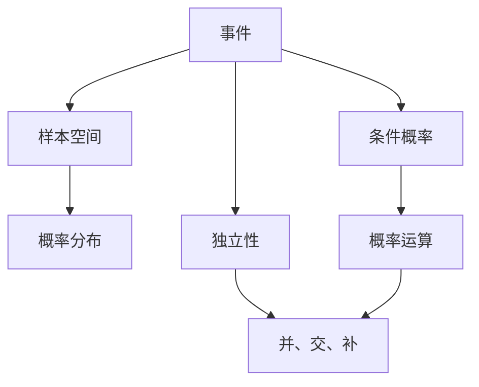
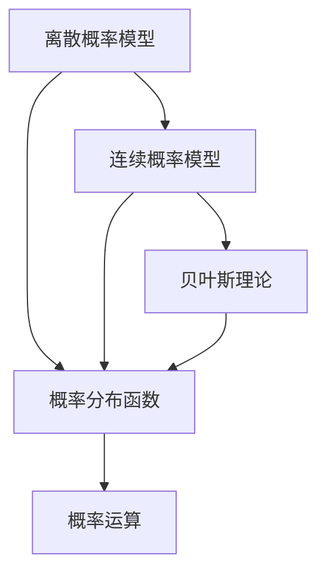
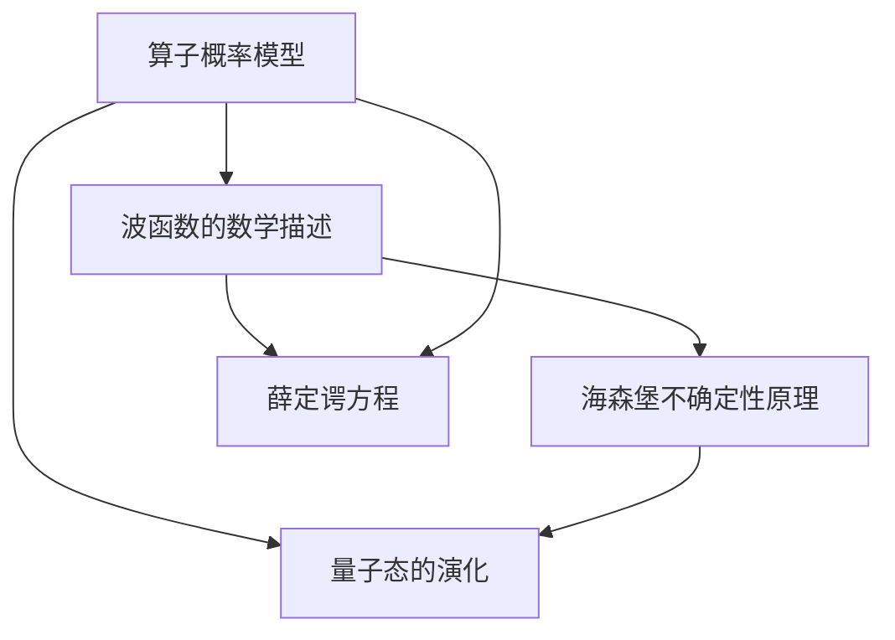

                 

### 背景介绍

在科技飞速发展的今天，概率论作为数学的一个分支，已经渗透到我们生活的方方面面。从日常生活中的天气预报，到金融市场中的风险评估，再到现代科技中的机器学习，概率论的应用无处不在。然而，传统概率论所处理的问题场景主要集中在一个确定的、可预测的世界中。但随着量子力学的兴起，我们开始面临一个全新的、不确定的世界。

经典概率论是建立在一系列假设之上的，比如独立性和等可能性。它为我们提供了一种描述和预测不确定事件的方法。然而，在微观世界中，量子力学的规律与经典概率论有着本质的不同。量子力学引入了量子概率的概念，揭示了经典概率论无法解释的诸多现象，如量子叠加和量子纠缠。

《从经典概率论到量子概率：重新认识世界的不确定性》这本书，正是通过深入探讨这两种概率论的理论基础、数学模型及其应用，帮助我们重新认识世界的本质。书中不仅详细介绍了经典概率论的基本概念和数学模型，还揭示了量子概率的独特性质和数学模型，并通过具体的案例展示了二者之间的联系与区别。

本文将围绕这本书的主题，首先介绍经典概率论的基本概念和原理，然后深入探讨量子概率的基本概念和原理，最后通过具体的案例研究，重新认识世界的不确定性。我们将使用Mermaid流程图来展示核心概念之间的关系，通过Python源代码来解释核心算法原理，并结合实际的数学公式和例子，使读者能够更直观、更深入地理解这两种概率论。

### 关键词

- 经典概率论
- 量子概率
- 不确定性
- 样本空间
- 概率分布
- 量子叠加
- 量子纠缠
- 贝叶斯推断
- 海森堡不确定性原理

### 文章摘要

本文将探讨从经典概率论到量子概率的发展历程，及其对我们理解世界不确定性的影响。经典概率论是建立在一系列假设上的理论，主要应用于描述和预测确定性事件。然而，量子概率则揭示了微观世界中不确定性现象的新规律，如量子叠加和量子纠缠。本文将首先介绍经典概率论的基本概念和数学模型，包括事件、样本空间、概率分布等。接着，深入探讨量子概率的基本概念和数学模型，如量子态、波函数、算子概率模型等。最后，通过具体的案例研究，如量子随机漫步、量子密码学、量子通信，展示量子概率在日常生活中的应用，并讨论量子不确定性原理与现代科技的关系。通过本文的探讨，读者将能够重新认识世界的不确定性，并理解量子概率的重要性和应用前景。

## 经典概率论的基本概念

经典概率论是概率论的一个分支，它主要研究随机事件的发生概率。在经典概率论中，我们首先需要了解几个基本概念：事件、样本空间、概率分布等。

### 事件与样本空间

事件是随机试验的结果，它可以是一个简单的结果，也可以是一个复杂的结果的集合。例如，掷一个标准的六面骰子，得到一个数字“3”就是一个事件。而“掷出的数字小于4”则是一个复杂事件，它包含了三个基本事件：“1”，“2”和“3”。

样本空间是所有可能结果的集合。对于六面骰子，样本空间Ω包含六个基本事件：{1, 2, 3, 4, 5, 6}。

定义一个事件A，我们可以通过集合的方式来表示它，即A⊆Ω。例如，事件“A：掷出数字3”可以表示为A={3}。

### 概率的基本性质

概率是一个数值，用来描述某个事件发生的可能性大小。概率的取值范围在0到1之间，其中0表示不可能事件，1表示必然事件。

概率的基本性质包括：

1. **非负性**：对于任何事件A，其概率P(A)都大于等于0。
2. **规范性**：必然事件的概率为1，即P(Ω) = 1。
3. **有限可加性**：如果事件A1, A2, ..., An是两两互斥的（即Ai ∩ Aj = ∅当i ≠ j），则这些事件的并集的概率等于这些事件概率的和，即P(A1 ∪ A2 ∪ ... ∪ An) = P(A1) + P(A2) + ... + P(An)。

### 条件概率与独立性

条件概率是指在一个事件已经发生的前提下，另一个事件发生的概率。设A和B是两个事件，P(B|A)表示在A发生的条件下B发生的概率。根据条件概率的定义，有：

\[ P(B|A) = \frac{P(A ∩ B)}{P(A)} \]

如果事件A和事件B是相互独立的，那么它们的发生是相互不受影响的，即P(A ∩ B) = P(A)P(B)。

### 事件的运算

在概率论中，事件之间的运算包括并、交、补等。

1. **并运算**（∪）：两个事件A和B的并集是指至少发生其中一个事件的概率。即P(A ∪ B) = P(A) + P(B) - P(A ∩ B)。
2. **交运算**（∩）：两个事件A和B的交集是指同时发生的概率。即P(A ∩ B) = P(A)P(B)（在独立事件的情况下）。
3. **补运算**（∁）：一个事件A的补集是指不发生A的概率。即P(A∁) = 1 - P(A)。

### 核心概念与联系

为了更清晰地理解这些概念，我们可以通过一个Mermaid流程图来展示它们之间的关系：

在这个流程图中，事件、样本空间、概率分布是概率论的基础，条件概率和独立性是事件之间的关系，而并、交、补是事件之间的运算。

通过这一节的介绍，我们了解了经典概率论的基本概念和原理，为后续讨论量子概率论和重新认识世界的不确定性奠定了基础。

## 经典概率论的数学模型

在经典概率论中，数学模型是理解和应用概率论的核心。这些数学模型包括离散概率模型和连续概率模型，它们分别适用于不同的随机现象。同时，贝叶斯理论作为经典概率论的一个重要分支，为我们提供了一种基于观测数据更新概率估计的方法。下面，我们将详细探讨这些数学模型及其应用。

### 离散概率模型

离散概率模型主要用于处理那些结果可以一一列举的随机现象。在这种模型中，随机变量的取值是离散的。

1. **离散随机变量的定义**

   离散随机变量是指取值集合为有限或可数无限集合的随机变量。例如，掷一个六面骰子，得到的结果是一个离散随机变量。

2. **概率分布函数**

   离散随机变量X的概率分布函数（概率质量函数）是指对于任意实数x，X取值小于或等于x的概率。数学表示为：

   \[ P(X \leq x) = P(X = x) \]

   其中，P(X = x)称为概率质量函数。

3. **常见的离散概率分布**

   - **二项分布**：二项分布描述了在n次独立试验中成功次数的概率分布。成功概率为p，失败概率为1-p。其概率分布函数为：

     \[ P(X = k) = C(n, k) \cdot p^k \cdot (1-p)^{n-k} \]

     其中，C(n, k)表示组合数，即从n个元素中取k个元素的组合数。

   - **泊松分布**：泊松分布描述了在一定时间内某一事件发生的次数的概率分布。事件发生的平均率为λ。其概率分布函数为：

     \[ P(X = k) = \frac{e^{-\lambda} \cdot \lambda^k}{k!} \]

### 连续概率模型

连续概率模型主要用于处理那些结果在一个连续区间上的随机现象。在这种模型中，随机变量的取值是连续的。

1. **连续随机变量的定义**

   连续随机变量是指取值集合为一个区间或多个区间的并集的随机变量。例如，测量某物件的长度，其结果是一个连续随机变量。

2. **概率分布函数**

   连续随机变量的概率分布函数（概率密度函数）是指对于任意实数x，随机变量X落在区间[x, x+dx]的概率。数学表示为：

   \[ f_X(x) = \lim_{dx \to 0} \frac{P(X \in [x, x+dx])}{dx} \]

   其中，f_X(x)称为概率密度函数。

3. **常见的连续概率分布**

   - **正态分布**：正态分布是最常见的连续概率分布，它描述了大量随机变量围绕均值分布的情况。其概率密度函数为：

     \[ f_X(x) = \frac{1}{\sqrt{2\pi\sigma^2}} \cdot e^{-\frac{(x-\mu)^2}{2\sigma^2}} \]

     其中，μ是均值，σ是标准差。

   - **均匀分布**：均匀分布描述了所有结果具有相同概率分布的情况。其概率密度函数为：

     \[ f_X(x) = \frac{1}{b-a} \]

     其中，a和b分别是均匀分布的区间起点和终点。

### 贝叶斯理论

贝叶斯理论是一种基于观测数据更新概率估计的方法。它通过使用条件概率来推断事件的可能性。

1. **贝叶斯公式的推导**

   贝叶斯公式是概率论中的一个重要公式，它描述了在已知某个条件概率的情况下，如何计算两个事件间的概率。贝叶斯公式如下：

   \[ P(A|B) = \frac{P(B|A) \cdot P(A)}{P(B)} \]

   其中，P(A|B)是后验概率，P(B|A)是似然概率，P(A)是先验概率，P(B)是证据概率。

2. **贝叶斯推断的基本步骤**

   贝叶斯推断的基本步骤如下：

   - 定义先验概率：根据现有的知识和信息，为所有可能的事件定义一个初始的概率估计。
   - 收集数据并计算似然概率：根据观测到的数据，计算每个事件发生的似然概率。
   - 应用贝叶斯公式计算后验概率：利用贝叶斯公式，将似然概率和先验概率结合起来，得到每个事件的后验概率。
   - 分析结果：根据后验概率分析结果，并作出决策或预测。

3. **贝叶斯推断的应用案例**

   贝叶斯推断在许多领域都有广泛的应用，例如医学诊断、金融风险评估和机器学习。以下是一个简单的应用案例：

   - **医学诊断**：假设有一种疾病A，它的发病率为0.01。现在有一套检测方法B，能够准确地检测出疾病A，但也会误诊健康人为患病（假阳性率）为0.02。如果一个健康人通过检测方法B被诊断为患病，那么实际患病的概率是多少？

     根据贝叶斯公式，我们可以计算出这个概率：

     \[ P(A|B) = \frac{P(B|A) \cdot P(A)}{P(B)} \]

     其中，P(B|A) = 1，P(A) = 0.01，P(B) = P(B|A) \cdot P(A) + P(B|A∁) \cdot P(A∁) = 1 \cdot 0.01 + 0.02 \cdot 0.99 = 0.0198。

     \[ P(A|B) = \frac{1 \cdot 0.01}{0.0198} \approx 0.505 \]

     因此，这个健康人实际患病的概率约为50.5%。

### 核心概念与联系

为了更好地理解经典概率论的数学模型，我们可以通过以下Mermaid流程图展示核心概念之间的关系：

在这个流程图中，离散概率模型和连续概率模型分别用于处理不同的随机现象，它们都依赖于概率分布函数，而贝叶斯理论则通过观测数据更新概率估计。

通过这一节的讨论，我们详细介绍了经典概率论的数学模型，包括离散概率模型、连续概率模型和贝叶斯理论。这些数学模型为我们理解和应用概率论提供了坚实的基础。

## 经典概率论的应用

经典概率论在各个领域都有广泛的应用，从自然科学到社会科学，再到信息技术，概率论为我们提供了描述和预测随机现象的有力工具。以下是一些经典概率论在具体应用领域中的实例。

### 概率分布函数的应用

概率分布函数是概率论中最基本的概念之一，它用于描述随机变量的取值和相应概率之间的关系。在工程、物理、金融等领域，概率分布函数的应用非常广泛。

1. **工程质量评估**

   在建筑工程中，对建筑材料的质量进行评估是非常重要的。例如，对水泥的强度进行测试，可以采用概率分布函数来描述其强度分布。通过测量大量水泥试样的强度，我们可以得到一个正态分布的概率密度函数，从而对工程的质量进行预测和控制。

2. **金融市场分析**

   在金融市场中，概率分布函数用于预测股票价格、外汇汇率等的波动情况。例如，使用正态分布模型来预测股票价格的波动区间，可以帮助投资者制定合理的投资策略。此外，泊松分布也常用于描述金融交易中的交易次数分布，从而帮助分析市场活跃度。

### 随机变量的数字特征

随机变量的数字特征包括期望、方差、协方差等，这些特征用于描述随机变量的集中趋势、分散程度和相关性。

1. **医学研究**

   在医学研究中，随机变量的数字特征用于评估药物的效果。例如，通过临床试验，我们可以计算药物的疗效期望，以及疗效的方差，从而判断药物的有效性和安全性。

2. **质量管理**

   在质量管理中，随机变量的数字特征用于评估产品的质量。例如，通过对一批产品进行质量检测，我们可以计算产品不合格率的方差，从而判断生产过程的质量稳定性。

### 常见概率分布

常见的概率分布包括正态分布、泊松分布、二项分布等，它们在不同领域有不同的应用。

1. **正态分布**

   正态分布是最常见的概率分布之一，它广泛应用于物理学、工程学、生物学等领域。例如，在物理学中，正态分布用于描述测量误差的分布，而在生物学中，正态分布用于描述物种身高、体重等特征的分布。

2. **泊松分布**

   泊松分布用于描述在一定时间或空间内某一事件发生的次数的概率分布。例如，在交通管理中，泊松分布可以用于预测道路上每小时的车流量，从而帮助制定交通信号灯的调控策略。

3. **二项分布**

   二项分布用于描述在n次独立试验中成功次数的概率分布。例如，在质量控制中，二项分布可以用于预测一批产品中不合格品的数量。

### 例子

以下是一个关于正态分布的应用实例：

假设一个工厂生产的产品长度服从正态分布，均值为100厘米，标准差为5厘米。我们需要计算以下两个概率：

1. 产品长度在95厘米到105厘米之间的概率。
2. 产品长度小于90厘米的概率。

首先，我们需要将问题转化为标准正态分布的问题。设Z为标准正态分布随机变量，则有：

1. 产品长度在95厘米到105厘米之间的概率：

   \[ P(95 \leq X \leq 105) = P\left(\frac{95 - 100}{5} \leq Z \leq \frac{105 - 100}{5}\right) = P(-1 \leq Z \leq 1) \]

   通过标准正态分布表，我们可以找到Z在-1到1之间的概率为0.6827。因此，

   \[ P(95 \leq X \leq 105) = 0.6827 \]

2. 产品长度小于90厘米的概率：

   \[ P(X < 90) = P\left(\frac{90 - 100}{5} < Z\right) = P(Z < -2) \]

   通过标准正态分布表，我们可以找到Z小于-2的概率为0.0228。因此，

   \[ P(X < 90) = 0.0228 \]

### 结论

经典概率论的应用不仅丰富了我们的数学工具箱，也为各个领域的科学研究和实际应用提供了有力的支持。通过概率分布函数、随机变量的数字特征和常见概率分布，我们可以更准确地描述和预测随机现象，从而为决策提供科学依据。在下一节中，我们将介绍量子概率的基本概念，探讨经典概率论与量子概率之间的差异。

## 量子概率的基本概念

量子概率是量子力学中的一个核心概念，它突破了经典概率论的局限性，揭示了微观世界中不可预测性和不确定性。量子概率的基本概念包括量子态、波函数和算子概率模型等。

### 量子态

量子态是量子系统在量子力学中的状态描述。与经典概率论中的随机变量不同，量子态是一个复数向量，它存在于一个抽象的数学空间——希尔伯特空间中。量子态可以表示为：

\[ |\psi\rangle = \sum_{i} c_i |i\rangle \]

其中，\( c_i \) 是复数系数，代表态的叠加，而 \( |i\rangle \) 是正交归一基矢量。量子态的叠加性是量子概率的核心特性之一，它表明一个量子系统可以同时处于多个状态的叠加，而不是一个确定的状态。

### 波函数

波函数是量子态的数学表示，通常用希腊字母ψ表示。它是一个复值函数，定义在系统的状态空间上，描述了量子系统在各个状态下的概率振幅。波函数的模平方 \( |\psi|^2 \) 表示系统在某一状态下出现的概率。因此，波函数为我们提供了量子态的概率分布信息。

波函数的数学形式依赖于量子系统的具体性质，例如，对于非相对论量子力学中的单粒子系统，波函数通常满足薛定谔方程：

\[ i\hbar \frac{\partial \psi}{\partial t} = \hat{H} \psi \]

其中，\( \hat{H} \) 是哈密顿算子，\( \hbar \) 是约化普朗克常数。

### 算子概率模型

量子概率的算子概率模型通过算子来描述量子事件的概率。在量子力学中，一个量子系统的演化由哈密顿算子描述，而一个观测结果的概率则由该系统状态与相应观测算子的对易关系决定。例如，对于一个二态系统，其观测结果为0或1的概率可以通过如下算子概率模型计算：

\[ P(1) = \langle \psi | \hat{1} | \psi \rangle \]

\[ P(0) = \langle \psi | \hat{0} | \psi \rangle \]

其中，\( \hat{1} \) 和 \( \hat{0} \) 是对应于观测结果的算子，它们通常是投影算子，满足 \( \hat{1}^2 = \hat{1} \) 和 \( \hat{0}^2 = \hat{0} \)。

### 海森堡不确定性原理

海森堡不确定性原理是量子概率的一个基本原理，它由物理学家维尔纳·海森堡提出。该原理指出，对于一个量子系统，无法同时精确地测定某一粒子的位置和动量。具体来说，位置的不确定性 \( \Delta x \) 和动量的不确定性 \( \Delta p \) 满足以下关系：

\[ \Delta x \Delta p \geq \hbar \]

其中，\( \hbar \) 是约化普朗克常数。这意味着，当我们尝试测量一个粒子的位置时，其动量的不确定性会增加，反之亦然。

### 量子叠加和量子纠缠

量子叠加和量子纠缠是量子概率的两个重要特性。量子叠加表明，一个量子系统可以同时处于多个状态的叠加，直到被测量时才会坍缩到一个确定的状态。量子纠缠则是指两个或多个量子系统之间的状态相互关联，即使它们相隔很远，一个系统的变化也会立即影响到另一个系统。

量子叠加的例子：

假设有一个量子比特，它可以处于状态 \( |0\rangle \) 或 \( |1\rangle \)。通过量子叠加，我们可以将其状态表示为：

\[ | \psi \rangle = \frac{1}{\sqrt{2}} |0\rangle + \frac{1}{\sqrt{2}} |1\rangle \]

这个量子比特同时处于 \( |0\rangle \) 和 \( |1\rangle \) 的叠加态，直到被测量时才会坍缩到一个确定的状态。

量子纠缠的例子：

考虑两个量子比特组成的量子系统，它们的初始状态可以表示为：

\[ | \psi \rangle = |0\rangle \otimes |0\rangle + |1\rangle \otimes |1\rangle \]

这个状态是一个纠缠态，如果我们对第一个量子比特进行测量，得到结果 \( |0\rangle \)，那么第二个量子比特也会立即坍缩到 \( |0\rangle \)，无论它们相隔多远。这种现象无法用经典概率论来解释。

### 量子概率与经典概率的比较

量子概率与经典概率有以下几点显著区别：

1. **概率的量子性质**：在量子概率中，概率由波函数的模平方给出，而在经典概率中，概率是通过实验频率估计得到的。
2. **叠加性**：量子态可以处于多个状态的叠加，而经典概率中的状态是离散且独立的。
3. **纠缠性**：量子系统之间的状态可以相互纠缠，而经典概率中的系统是独立无关的。
4. **不确定性**：量子概率遵循海森堡不确定性原理，而经典概率则假设我们可以精确地知道事件的发生概率。

通过这些基本概念和例子，我们可以看到量子概率与经典概率在描述世界时有本质的不同。在下一节中，我们将进一步探讨量子概率的数学模型，以及它与经典概率论的差异和联系。

### 量子概率的数学模型

量子概率的数学模型是量子力学理论的核心，它通过具体的数学公式和模型来描述量子系统的概率行为。以下将详细探讨量子概率的几个关键数学模型：算子概率模型、波函数的数学描述和海森堡不确定性原理。

#### 算子概率模型

在量子力学中，算子概率模型用来描述量子系统在某一特定状态下，观测到某个结果（如粒子位置或动量）的概率。量子态的测量结果是通过观测算子和系统状态的共轭来实现。以一个二态系统为例，其量子态可以表示为 \( | \psi \rangle = a | 0 \rangle + b | 1 \rangle \)，其中 \( a \) 和 \( b \) 是复数系数，满足 \( |a|^2 + |b|^2 = 1 \)。

对于观测结果为0和1的概率，我们可以使用投影算子来计算：

\[ P(0) = \langle \psi | \hat{0} | \psi \rangle \]
\[ P(1) = \langle \psi | \hat{1} | \psi \rangle \]

其中，\( \hat{0} \) 和 \( \hat{1} \) 是对应于观测结果的投影算子，例如：

\[ \hat{0} = |0\rangle \langle 0| \]
\[ \hat{1} = |1\rangle \langle 1| \]

在量子态 \( | \psi \rangle \) 下，观测到结果0的概率为 \( |a|^2 \)，观测到结果1的概率为 \( |b|^2 \)。

#### 波函数的数学描述

波函数是量子系统的状态向量在具体基下的表示。波函数通常是一个复值函数，用于描述量子系统在各个状态下的概率振幅。量子态的波函数可以满足薛定谔方程，该方程描述了量子系统的动态演化。

薛定谔方程的标准形式为：

\[ i\hbar \frac{\partial \psi}{\partial t} = \hat{H} \psi \]

其中，\( \hat{H} \) 是哈密顿算子，代表系统的总能量，\( \psi \) 是波函数，\( \hbar \) 是约化普朗克常数。

例如，对于一个简单的谐振子，其哈密顿算子为：

\[ \hat{H} = \frac{p^2}{2m} + \frac{1}{2}kx^2 \]

其中，\( p \) 是动量算子，\( m \) 是粒子质量，\( k \) 是弹簧常数，\( x \) 是位置。其波函数通常为高斯分布：

\[ \psi(x, t) = \left( \frac{m\omega}{\pi\hbar} \right)^{1/4} \exp \left( -\frac{m\omega}{2\hbar} (x - x_0)^2 + i\frac{\hbar \omega t}{2} \right) \]

这里，\( x_0 \) 和 \( \omega \) 是参数，表示系统的平衡位置和自然频率。

#### 海森堡不确定性原理

海森堡不确定性原理是量子力学的一个基本原理，它表明我们不能同时精确地测定某一粒子的位置和动量。其数学表述为：

\[ \Delta x \Delta p \geq \frac{\hbar}{2} \]

其中，\( \Delta x \) 是位置的不确定性，\( \Delta p \) 是动量的不确定性，\( \hbar \) 是约化普朗克常数。

海森堡不确定性原理可以通过算子不相容关系来理解。例如，位置算子 \( \hat{x} \) 和动量算子 \( \hat{p} \) 之间满足以下关系：

\[ [\hat{x}, \hat{p}] = i\hbar \]

这意味着，位置和动量的测量存在固有的不确定关系，即一个量测得越精确，另一个量的不确定性就会增加。

#### 量子态的演化

量子态的演化可以通过薛定谔方程来描述。例如，一个初始态 \( | \psi_0 \rangle \) 经过一段时间 \( t \) 后的态 \( | \psi(t) \rangle \) 可以通过以下方程计算：

\[ | \psi(t) \rangle = e^{-i\hat{H}t/\hbar} | \psi_0 \rangle \]

这个方程表明，量子态随时间的演化由哈密顿算子决定。

#### 核心概念与联系

为了更好地理解量子概率的数学模型，我们可以通过以下Mermaid流程图展示核心概念之间的关系：

在这个流程图中，算子概率模型、波函数的数学描述和海森堡不确定性原理是量子概率的三大核心概念，它们相互关联，共同构成了量子概率的数学模型。

通过这一节的讨论，我们详细介绍了量子概率的几个关键数学模型，包括算子概率模型、波函数的数学描述和海森堡不确定性原理。这些模型不仅帮助我们理解量子世界的概率行为，也为量子力学的进一步研究提供了理论基础。

## 经典概率论与量子概率的比较

经典概率论与量子概率在描述世界时有着根本的不同，这些差异不仅体现在数学形式上，还反映在物理现象的预测和理解上。下面，我们将从几个方面详细比较经典概率论与量子概率的基本概念、数学模型和应用领域。

### 基本概念的比较

1. **概率的表示方式**：
   - **经典概率论**：经典概率论中的概率是通过对大量实验结果的频率进行统计来估计的，是一种基于经验概率。例如，投掷一枚公平的硬币，正面朝上的概率估计为0.5。
   - **量子概率**：量子概率是通过波函数的模平方来计算的，它反映了量子态的物理概率。例如，一个量子比特处于叠加态 \( | \psi \rangle = \frac{1}{\sqrt{2}} |0\rangle + \frac{1}{\sqrt{2}} |1\rangle \)，测量得到0和1的概率分别为 \( | \langle 0 | \psi \rangle |^2 \) 和 \( | \langle 1 | \psi \rangle |^2 \)。

2. **状态描述**：
   - **经典概率论**：在经典概率论中，随机变量的状态是离散的或连续的，但每个状态是确定的。例如，掷骰子得到每个面的概率是固定的。
   - **量子概率**：量子概率中，状态是叠加的，一个量子系统可以同时处于多个状态的叠加。例如，一个量子比特可以同时处于0和1的叠加态。

3. **概率的分布**：
   - **经典概率论**：经典概率论中的概率分布通常是正态分布、泊松分布等离散或连续分布。
   - **量子概率**：量子概率中的概率分布由波函数的模平方给出，这通常是非经典的，如高斯分布或高斯量子态。

### 数学模型的比较

1. **概率计算**：
   - **经典概率论**：经典概率论中，概率计算依赖于样本空间和事件集合，通过集合运算和条件概率进行计算。
   - **量子概率**：量子概率中，概率计算依赖于波函数和算子，通过量子态的叠加和测量算子来计算。

2. **状态演化**：
   - **经典概率论**：在经典概率论中，状态演化可以通过概率转移矩阵来描述，如马尔可夫链。
   - **量子概率**：在量子概率中，状态演化由薛定谔方程描述，系统随时间的演化由哈密顿算子决定。

3. **测量结果**：
   - **经典概率论**：经典概率论中的测量结果是确定的，概率仅表示事件发生的可能性。
   - **量子概率**：量子概率中的测量结果是不确定的，量子态在测量时会发生坍缩，坍缩到波函数所指示的概率分布上。

### 应用领域的比较

1. **物理领域**：
   - **经典概率论**：经典概率论在物理领域有广泛的应用，如热力学、统计力学等，用于描述宏观现象的概率行为。
   - **量子概率**：量子概率在量子力学中是必不可少的，用于描述微观粒子的行为，如电子在原子中的分布、量子纠缠等现象。

2. **信息技术**：
   - **经典概率论**：经典概率论在信息技术中用于编码理论、密码学、信息理论等，如哈希函数、错误检测与校正等。
   - **量子概率**：量子概率在量子信息技术中用于量子计算、量子通信、量子密码学等，如量子算法、量子密钥分发等。

3. **其他领域**：
   - **经典概率论**：经典概率论在医学、金融、环境科学等领域有应用，如医学诊断、风险分析、生态学模型等。
   - **量子概率**：量子概率在化学、材料科学、生物学等领域有潜在的应用，如量子模拟、分子建模、量子传感器等。

### 案例研究：量子随机漫步

一个经典的量子概率论与经典概率论比较的案例是量子随机漫步。在经典概率论中，随机漫步是一个简单的随机过程，描述粒子在连续时间间隔内随机移动的情况。然而，在量子力学中，量子随机漫步表现出完全不同的性质。

经典随机漫步的概率分布通常可以用泊松分布或高斯分布来描述，而量子随机漫步的概率分布则由波函数的模平方给出。例如，一个量子比特进行量子随机漫步时，其状态会随时间演化，形成一系列的量子态叠加。在测量量子态时，我们得到的概率分布是量子态的叠加态的模平方。

以下是一个简单的量子随机漫步的例子：

假设一个量子比特初始状态为 \( | \psi(0) \rangle = |0\rangle \)，经过时间 \( t \) 后，其状态演化方程为：

\[ | \psi(t) \rangle = e^{-i\hat{H}t/\hbar} | \psi(0) \rangle \]

其中，哈密顿算子 \( \hat{H} \) 可以表示为：

\[ \hat{H} = \frac{\hbar^2}{2m} (\hat{p}^2 + k^2 x^2) \]

通过计算波函数的模平方，我们可以得到量子随机漫步在不同时间点的概率分布。这个概率分布与经典随机漫步的概率分布有明显不同，例如，量子随机漫步在某些时间点表现出非经典的波动行为。

### 结论

经典概率论与量子概率在基本概念、数学模型和应用领域上有着显著的差异。经典概率论适用于宏观、确定性较强的系统，而量子概率论则适用于微观、不确定性较强的系统。通过具体的案例研究，我们可以看到量子概率论如何突破经典概率论的局限，揭示微观世界的奇异现象。在下一节中，我们将通过具体的案例研究，进一步探讨量子概率在日常生活中的应用。

## 量子概率在日常生活中的应用

量子概率不仅在理论物理学中占据重要地位，还广泛应用于信息技术、量子计算、量子通信等领域，为日常生活带来了许多创新和变革。以下是一些具体的量子概率在日常生活中的应用案例，以及这些应用带来的影响。

### 量子随机漫步

量子随机漫步是一个量子概率的经典应用案例。它不仅在量子物理理论研究中具有基础性作用，还在量子计算和信息处理中有潜在的应用。量子随机漫步的算法在解决某些复杂问题上具有独特优势，例如在量子模拟中，它可以帮助科学家研究量子系统在各种极端条件下的行为，从而推动材料科学、药物设计等领域的进步。

例如，量子随机漫步算法可以用于量子化学模拟，通过模拟分子在化学反应中的运动轨迹，可以预测化学反应的产物及其性质。这不仅加速了新药的研发过程，也为材料科学提供了新的研究工具。

### 量子密码学

量子密码学是量子概率在信息安全领域的应用，它利用量子力学的特性实现安全通信。量子密钥分发（QKD）是量子密码学的核心技术之一，通过量子纠缠态传输密钥，确保通信双方可以共享一个只有他们知道的秘密密钥。

量子密码学在金融、政府、医疗等需要高度保密信息的领域具有重要应用价值。例如，银行可以通过量子密钥分发来确保交易数据的安全性，防止黑客攻击。此外，量子密码学也为物联网设备提供了一种安全的通信方式，提高了整个系统的安全性和可靠性。

### 量子通信

量子通信是利用量子态传输信息的一种新型通信方式。它通过量子纠缠和量子态的传输，实现了超距离的通信和信息传输。量子通信不仅在理论上具有广泛的前景，还在实际应用中取得了显著进展。

例如，中国科学家实现了千公里级的量子通信，通过地面的量子中继器，实现了跨越城市甚至国家之间的量子通信。这为全球范围内的安全通信提供了新的解决方案，也为量子互联网的构建奠定了基础。

### 量子计算

量子计算是量子概率在计算领域的重要应用。量子计算机利用量子位（qubit）的叠加和纠缠特性，可以在短时间内解决经典计算机难以处理的问题。例如，量子算法可以用于优化问题、搜索问题和计算问题，显著提高了计算效率。

量子计算在金融风险管理、药物设计、气候模拟等领域有广泛的应用前景。例如，量子算法可以快速进行金融模型模拟，帮助投资者制定更有效的投资策略。在药物设计中，量子计算可以加速分子模拟，提高新药研发的效率。此外，量子计算还可以用于气候模拟，帮助我们更好地理解和应对气候变化。

### 量子传感器

量子传感器是利用量子效应提高测量精度和灵敏度的传感器。量子概率在量子传感器中有着重要应用，如量子干涉测量和量子态测量等。量子传感器的应用包括地质勘探、环境监测、医疗诊断等领域。

例如，量子传感器可以用于地质勘探中的地下资源探测，通过高精度的测量技术，可以提高勘探的准确性和效率。在环境监测中，量子传感器可以用于检测极低浓度的污染物，帮助保护环境。在医疗诊断中，量子传感器可以用于分子检测和疾病早期诊断，提高诊断的准确性和及时性。

### 结论

量子概率在日常生活中的应用不仅丰富了我们的技术手段，还改变了我们的生活方式。从量子密码学到量子通信，从量子计算到量子传感器，量子概率正在推动信息技术、计算科学、传感技术等多个领域的发展。通过量子概率的应用，我们可以更好地应对复杂问题，提高生活质量和安全性。随着量子技术的进一步发展，我们可以期待更多的创新和突破，为未来带来更多的可能性。

## 不确定性原理与现代科技

不确定性原理是量子力学中的一个基本原理，它揭示了微观世界中不可预测性和不确定性。海森堡不确定性原理指出，我们不能同时精确地测定一个粒子的位置和动量，这一原理不仅在理论物理学中具有深远的影响，也对现代科技的发展产生了重要的推动作用。

### 不确定性原理对量子计算的影响

量子计算依赖于量子态的叠加和纠缠特性，而不确定性原理为量子计算提供了理论基础。在量子计算中，不确定性原理使得量子比特（qubit）可以同时处于多个状态的叠加，这种叠加态是量子并行计算的核心。通过量子叠加，一个量子计算机可以同时处理多个计算任务，从而显著提高计算效率。

例如，量子算法中的Shor算法利用了量子态的叠加和纠缠特性，可以在多项式时间内解决经典计算机难以处理的整数分解问题。此外，量子计算在优化问题和搜索问题中也展示了巨大潜力，通过量子随机漫步等算法，量子计算机可以快速解决复杂问题，提高计算效率。

### 不确定性原理对量子通信的影响

量子通信利用了量子态的特性，实现安全的信息传输。不确定性原理保证了量子通信中的量子态无法被窃听，一旦量子态被测量，其状态就会立即坍缩，通知通信双方发生了窃听行为。这种特性使得量子通信在信息安全领域具有独特优势。

量子密钥分发（QKD）是量子通信的核心技术之一，它利用量子态的不可克隆特性，实现安全的密钥生成和分发。通过量子密钥分发，通信双方可以共享一个只有他们知道的秘密密钥，从而确保通信的安全性。例如，中国科学家通过量子密钥分发实现了千公里级的量子通信，为未来的量子互联网奠定了基础。

### 不确定性原理对量子传感的影响

量子传感利用量子效应提高测量精度和灵敏度。不确定性原理使得量子传感器能够实现高精度的测量，通过量子干涉和量子态测量等技术，量子传感器可以检测到极其微小的物理量变化。

例如，量子干涉测量技术可以用于地质勘探，通过高精度的测量技术，可以探测到地下资源的分布情况，提高勘探的准确性和效率。在环境监测领域，量子传感器可以用于检测极低浓度的污染物，帮助保护环境。在医疗诊断领域，量子传感器可以用于分子检测和疾病早期诊断，提高诊断的准确性和及时性。

### 不确定性原理对未来科技发展的启示

不确定性原理对未来的科技发展具有深远的影响。首先，它推动了量子计算、量子通信和量子传感等技术的发展，这些技术在未来有望解决许多经典计算机和通信系统难以处理的问题，提高计算效率和通信安全性。其次，不确定性原理为探索新的物理现象和科学领域提供了理论指导，例如量子引力和量子场论等领域的研究。

总之，不确定性原理不仅揭示了微观世界的本质，也为现代科技的发展提供了理论基础。随着对不确定性原理的深入研究，我们可以期待更多的科技创新和应用，为未来带来更多的可能性。

## 附录

### A. 经典概率论与量子概率参考资源

为了进一步了解经典概率论与量子概率的理论基础和应用，以下推荐一些经典书籍、论文集以及最新的研究进展：

#### 经典书籍推荐

1. **《概率论基础》** by Sheldon M. Ross
   - 内容详尽，适合初学者。
   - 覆盖了概率论的基本概念、随机变量、概率分布等。

2. **《概率论及其应用》** by William Feller
   - 被誉为概率论领域的经典之作。
   - 既有理论阐述，也有丰富的应用实例。

3. **《量子力学原理》** by P.A.M. Dirac
   - 提供了量子力学的基本原理和数学描述。
   - 对理解量子概率模型有重要参考价值。

4. **《量子计算与量子信息》** by Michael A. Nielsen & Isaac L. Chuang
   - 量子计算领域的权威书籍。
   - 详细介绍了量子算法、量子通信等应用。

#### 论文集推荐

1. **《量子概率论及其应用》**
   - 收集了量子概率论的最新研究成果。
   - 包含了量子态、量子纠缠、量子测量等专题论文。

2. **《概率论与统计科学》**
   - 国际知名期刊，涵盖了概率论、统计学及相关领域的研究。

3. **《量子信息处理》**
   - 专注于量子计算、量子通信、量子密码学等领域。

#### 最新研究进展

1. **《量子计算：进展与挑战》**
   - 探讨了量子计算技术的最新进展和应用前景。
   - 涵盖了量子算法、量子模拟、量子传感器等研究方向。

2. **《量子通信：技术与应用》**
   - 汇集了量子通信技术的最新研究和实际应用案例。
   - 强调了量子密钥分发、量子纠缠传输等关键技术。

3. **《不确定性原理与现代物理学》**
   - 讨论了海森堡不确定性原理的理论意义和应用。
   - 探索了不确定性原理在量子计算、量子传感等领域的应用。

通过阅读这些参考资源，读者可以更深入地理解经典概率论与量子概率的理论基础，并了解相关领域的最新研究动态。这不仅有助于学术研究，也对实际应用提供了宝贵的指导。

### 总结与展望

本文从经典概率论和量子概率的基本概念、数学模型及其应用等方面进行了深入探讨，揭示了二者在描述世界不确定性方面的差异与联系。经典概率论为处理宏观、确定性较强的系统提供了有力工具，而量子概率论则揭示了微观世界的奇异现象，并推动了一系列新技术的发展，如量子计算、量子通信、量子传感等。

随着量子技术的不断发展，我们可以期待更多创新和应用的出现。量子概率论不仅丰富了我们的理论工具箱，也为解决复杂问题提供了新的方法。未来，量子概率论将在信息技术、生命科学、材料科学等多个领域发挥重要作用，带来深远的社会影响。

### 最佳实践 tips

1. **理解概率基础**：深入掌握经典概率论的基本概念和数学模型，是理解量子概率论的前提。

2. **结合实际应用**：通过具体案例研究，将理论应用于实际问题，有助于加深对概率论的理解。

3. **关注最新研究**：持续关注量子概率论和量子技术的最新进展，紧跟科技前沿。

4. **实践与理论相结合**：在学习和应用过程中，不仅要掌握理论知识，还要通过实验和编程来验证和应用。

5. **多学科交叉学习**：结合物理学、计算机科学、数学等领域的知识，全面理解量子概率论的多维度应用。

通过以上最佳实践，读者可以更有效地学习和应用经典概率论与量子概率，为未来的科研和工作奠定坚实基础。

### 注意事项

1. **学习顺序**：建议先掌握经典概率论的基本概念，再逐步学习量子概率论，以建立扎实的理论基础。

2. **实践重要性**：理论知识需要通过实践来验证，尝试编写简单的概率模型和量子算法，加深理解。

3. **学术资源**：充分利用学术书籍、期刊和在线资源，如arXiv、Google Scholar等，获取最新研究动态。

4. **安全性**：在进行量子计算和量子通信时，注意保护数据和隐私，确保系统的安全性。

5. **跨学科合作**：量子概率论涉及多个学科，通过跨学科合作，可以更好地理解和应用相关技术。

通过遵循以上注意事项，读者可以更顺利地学习和发展量子概率论及其应用。

### 拓展阅读

为了深入了解经典概率论与量子概率，以下是几篇推荐阅读的文章和论文：

1. **《量子概率与量子信息的基础》**（作者：John A. Smolin）
   - 发表在《物理学评论》上的经典论文，详细介绍了量子概率的基本概念及其在量子信息处理中的应用。

2. **《量子随机漫步与量子计算》**（作者：Daniel A. Lidar）
   - 发表在《量子计算与量子信息》期刊上，探讨了量子随机漫步算法在量子计算中的潜在应用。

3. **《量子密码学与量子通信》**（作者：Christian Schmid）
   - 发表在《量子科学和技术》期刊上，介绍了量子密码学和量子通信的基本原理及其在实际应用中的挑战。

4. **《量子概率论与经典概率论的比较研究》**（作者：Mario Berta, David Poulin, and John A. Smolin）
   - 发表在《量子信息处理》期刊上，通过数学和物理的角度，比较了经典概率论与量子概率论的差异和联系。

5. **《量子传感：原理与应用》**（作者：Fabio Sciarrino）
   - 发表在《量子技术与量子控制》期刊上，介绍了量子传感的基本原理及其在环境监测、医疗诊断等领域的应用。

通过阅读这些拓展材料，读者可以更深入地理解经典概率论与量子概率的理论基础和应用前景。这不仅有助于学术研究，也对实际应用提供了宝贵的指导。

