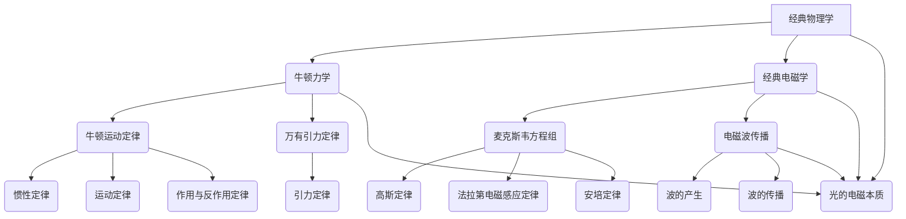

                 

### 从经典物理学到量子场论：深入理解物质世界的本质

#### 关键词：
- 经典物理学
- 量子力学
- 量子场论
- 物质世界本质
- 物理学发展史

#### 摘要：
本文深入探讨从经典物理学到量子场论的发展历程，通过对经典物理学、量子力学和量子场论的核心概念、原理和理论的讲解，揭示物质世界的本质。文章采用逻辑清晰、结构紧凑、简单易懂的专业技术语言，旨在帮助读者全面理解物理学在科学探究中的重要作用。

## 引言

物理学作为自然科学的基础，一直以来都在不断推动人类对物质世界本质的理解。从古代的哲学探讨到现代的科学实验，物理学经历了漫长而曲折的发展历程。本文将带领读者从经典物理学的基础概念出发，逐步深入到量子力学和量子场论的核心理论，旨在揭示物质世界的本质。

经典物理学在牛顿力学和麦克斯韦电磁学的框架下取得了巨大的成功，为我们理解宏观世界的运动和相互作用提供了强有力的工具。然而，随着科学的发展，经典物理学的局限性逐渐显现，无法解释微观粒子的行为。量子力学的诞生，将物理学带入了一个全新的领域，揭示了微观世界的奇异性质。量子场论作为量子力学的进一步发展，为理解物质世界的更深层次提供了理论基础。

本文将分为三个主要部分进行阐述：

1. **经典物理学基础**：介绍经典物理学的基本原理和数学工具，包括经典力学和经典电磁学的核心内容。
2. **量子力学原理与概念**：探讨量子力学的核心原理和重要概念，如波粒二象性、不确定性原理和量子态等。
3. **量子场论**：深入探讨量子场论的基本框架和原理，包括量子电动力学和量子色动力学等。

通过这三个部分的逐步讲解，我们将能够更好地理解物理学的发展历程以及物质世界的本质。接下来，我们将首先回顾经典物理学的诞生和发展。

## 第一部分：经典物理学基础

### 第1章：经典物理学的诞生与发展

经典物理学是现代物理学的基石，其诞生和发展历程充满了科学革命的色彩。本章将介绍经典物理学的核心思想、基本原理以及数学工具，旨在为后续内容打下坚实的基础。

#### 1.1 经典物理学的核心思想

经典物理学的核心思想包括自然科学的统一性、物理规律的可预测性以及因果关系。这些思想体现了经典物理学的基本理念，即通过科学的方法和数学的工具，可以理解和预测自然界的现象。

- **自然科学的统一性**：经典物理学试图将不同的物理现象统一在一个理论框架下。例如，牛顿力学统一了天体运动和地面物体的运动，麦克斯韦电磁理论统一了电、磁和光的现象。

- **物理规律的可预测性**：经典物理学强调物理规律的可预测性，即通过已知的初始条件可以预测系统的未来状态。这种可预测性在工程、天文学和气象学等领域有着广泛的应用。

- **因果关系**：经典物理学基于因果关系，认为物理现象之间存在确定的因果联系。这种因果关系使得我们可以通过实验和观察来验证物理定律。

#### 1.2 经典力学的数学工具

经典力学是经典物理学的重要组成部分，其核心是通过数学工具描述物体的运动和相互作用。经典力学的数学工具主要包括微积分、矢量分析和牛顿运动定律。

- **微积分**：微积分是经典力学的基础数学工具，用于描述物体运动的瞬时变化。通过微分和积分，我们可以计算速度、加速度和力等物理量。

- **矢量分析**：矢量分析用于描述物体的运动和力场的分布。矢量分析的基本概念包括矢量场、梯度、散度和旋度等，这些概念帮助我们理解物理现象的空间分布。

- **牛顿运动定律**：牛顿运动定律是经典力学的核心定律，描述了物体在力作用下的运动状态。牛顿运动定律包括以下三个部分：

  - **牛顿第一定律（惯性定律）**：一个物体在没有外力作用时，将保持静止或匀速直线运动状态。

  - **牛顿第二定律（运动定律）**：物体的加速度与作用力成正比，与物体质量成反比，即 \( F = ma \)。

  - **牛顿第三定律（作用与反作用定律）**：任何作用力都有一个大小相等、方向相反的反作用力。

#### 1.3 经典电磁学的基本原理

经典电磁学是另一支重要的经典物理学分支，描述了电场、磁场和电磁波的基本原理。经典电磁学的基础是麦克斯韦方程组，这些方程描述了电场和磁场的动态行为。

- **麦克斯韦方程组**：麦克斯韦方程组是经典电磁学的核心方程，包括以下四个方程：

  - **高斯定律**：描述了电荷分布与电场的关系，即电通量密度与电荷密度成正比。

  - **磁场高斯定律**：描述了磁单极子的不存在，即磁通量密度没有源。

  - **法拉第电磁感应定律**：描述了磁场变化产生电场，即电动势与磁场变化率有关。

  - **安培定律**：描述了电流与磁场的关系，即磁场强度与电流成正比。

- **电磁波的产生与传播**：经典电磁学还揭示了电磁波的产生和传播原理。根据麦克斯韦方程组，当电荷加速运动时，会产生电磁波。电磁波以光速传播，具有电场和磁场的振荡。

- **光的电磁本质**：经典电磁学将光视为电磁波的一种形式，揭示了光的波动性质。光的电磁本质在光学中得到了广泛应用，如干涉、衍射和偏振等现象。

通过本章的介绍，我们初步了解了经典物理学的核心思想和基本原理。经典物理学为我们理解宏观世界的运动和相互作用提供了坚实的基础，但在面对微观世界时，其局限性逐渐显现。接下来，我们将深入探讨量子力学的核心概念和原理。

### 第2章：经典力学原理与应用

#### 2.1 牛顿运动定律

牛顿运动定律是经典力学的核心，用于描述物体在力作用下的运动状态。牛顿运动定律包括三个基本原理，即惯性定律、运动定律和作用与反作用定律。下面我们将分别介绍这三个定律的数学表达和物理意义。

- **牛顿第一定律（惯性定律）**：一个物体在没有外力作用时，将保持静止或匀速直线运动状态。这意味着物体的运动状态不会自行改变，除非受到外力的作用。惯性定律揭示了物体的惯性性质，即物体抵抗运动状态改变的能力。

  数学表达：\[ F = 0 \Rightarrow v = constant \]

  其中，\( F \) 表示作用力，\( v \) 表示速度。如果 \( F = 0 \)，则 \( v \) 为常数，即物体保持静止或匀速直线运动。

- **牛顿第二定律（运动定律）**：物体的加速度与作用力成正比，与物体质量成反比，即 \( F = ma \)。这个定律揭示了力和加速度之间的关系，是经典力学中最重要的方程之一。

  数学表达：\[ F = ma \]

  其中，\( m \) 表示物体的质量，\( a \) 表示加速度。该方程表明，当作用力 \( F \) 作用于物体时，物体会产生加速度 \( a \)，加速度的大小与作用力成正比，与物体的质量成反比。

- **牛顿第三定律（作用与反作用定律）**：任何作用力都有一个大小相等、方向相反的反作用力。这意味着物体之间的相互作用是相互的，不存在单方面的作用力。

  数学表达：\[ F_{12} = -F_{21} \]

  其中，\( F_{12} \) 表示物体1对物体2的作用力，\( F_{21} \) 表示物体2对物体1的作用力。根据牛顿第三定律，这两个力的大小相等、方向相反。

#### 2.2 万有引力定律

万有引力定律是描述物体之间引力作用的基本原理，由牛顿提出。该定律表明，任何两个物体之间都存在相互吸引的引力，引力的大小与两个物体的质量和距离有关。

- **引力定律的数学表达**：\[ F = G \frac{m_1 m_2}{r^2} \]

  其中，\( F \) 表示引力，\( G \) 是万有引力常数，\( m_1 \) 和 \( m_2 \) 分别表示两个物体的质量，\( r \) 表示两个物体之间的距离。该方程表明，引力与两个物体的质量乘积成正比，与它们之间距离的平方成反比。

- **万有引力定律的应用**：万有引力定律在天文学和宇宙学中有着广泛的应用。例如，它解释了行星的运动轨迹、双星系统的稳定性以及黑洞的形成等。

#### 2.3 振动与波动

振动和波动是物理学中的重要概念，广泛应用于声学、光学和电子学等领域。本章将介绍振动和波动的基本原理，以及它们在物理中的应用。

- **振动**：振动是指物体在平衡位置附近来回振动的运动。振动可以分为简谐振动、阻尼振动和非简谐振动等类型。

  - **简谐振动**：简谐振动是最简单的振动形式，其运动规律可以用正弦函数或余弦函数描述。简谐振动的特点是最小势能位置在平衡位置，能量在动能和势能之间转换。

    数学表达：\[ x(t) = A \cos(\omega t + \phi) \]

    其中，\( x(t) \) 表示物体在时间 \( t \) 的位移，\( A \) 是振幅，\( \omega \) 是角频率，\( \phi \) 是初相位。

  - **阻尼振动**：阻尼振动是考虑阻尼力影响的振动形式。阻尼力会减缓振动的幅度，最终使振动趋于零。

    数学表达：\[ x(t) = A e^{-\gamma t} \cos(\omega t + \phi) \]

    其中，\( \gamma \) 是阻尼系数。

  - **非简谐振动**：非简谐振动是指振动规律不满足简谐振动的运动形式。非简谐振动可能涉及复杂的数学描述，如傅里叶变换。

- **波动**：波动是指能量在空间中传播的过程，可以分为纵波和横波。纵波是指振动方向与传播方向相同的波，如声波。横波是指振动方向与传播方向垂直的波，如光波。

  - **波动方程**：波动方程是描述波动现象的基本方程，可以用于描述纵波和横波的传播规律。

    数学表达：\[ \frac{\partial^2 u}{\partial t^2} = c^2 \nabla^2 u \]

    其中，\( u \) 表示波函数，\( c \) 是波速，\( \nabla^2 \) 是拉普拉斯算子。

  - **干涉与衍射**：干涉和衍射是波动的重要特性。干涉是指两个或多个波相遇时产生的相互作用，可以导致波的增强或减弱。衍射是指波在遇到障碍物或通过狭缝时发生的弯曲现象。

    干涉与衍射现象在光学、声学和电子学等领域有着广泛的应用，如干涉仪、衍射光栅和天线设计等。

通过本章的介绍，我们了解了经典力学的基本原理和它们在物理中的应用。牛顿运动定律和万有引力定律为我们提供了描述宏观物体运动和相互作用的基础，而振动和波动理论则帮助我们理解能量在空间中的传播。这些经典物理学的原理和概念构成了现代物理学的重要基石，为我们进一步探讨量子力学和量子场论打下了坚实的基础。

### 第3章：经典电磁学

经典电磁学是经典物理学的重要组成部分，描述了电场、磁场和电磁波的动态行为。本章将介绍经典电磁学的基本原理，包括麦克斯韦方程组、电磁波的产生与传播以及光的电磁本质。

#### 3.1 麦克斯韦方程组

麦克斯韦方程组是经典电磁学的核心方程，描述了电场和磁场的分布及其相互作用。麦克斯韦方程组包括以下四个方程：

- **高斯定律（电场）**：\[ \nabla \cdot \mathbf{E} = \frac{\rho}{\epsilon_0} \]

  这个方程描述了电荷分布与电场之间的关系。电场强度 \( \mathbf{E} \) 的散度等于电荷密度 \( \rho \) 除以真空电容率 \( \epsilon_0 \)。

- **高斯定律（磁场）**：\[ \nabla \cdot \mathbf{B} = 0 \]

  这个方程表明磁场无源，即磁单极子不存在。磁场强度 \( \mathbf{B} \) 的散度为零。

- **法拉第电磁感应定律**：\[ \nabla \times \mathbf{E} = -\frac{\partial \mathbf{B}}{\partial t} \]

  这个方程描述了电场与磁场变化之间的关系。电场强度 \( \mathbf{E} \) 的旋度等于磁场 \( \mathbf{B} \) 关于时间的变化率的负值。

- **安培定律**：\[ \nabla \times \mathbf{B} = \mu_0 \mathbf{J} + \mu_0 \varepsilon_0 \frac{\partial \mathbf{E}}{\partial t} \]

  这个方程描述了磁场与电流及电场变化之间的关系。磁场强度 \( \mathbf{B} \) 的旋度等于电流密度 \( \mathbf{J} \) 与真空磁导率 \( \mu_0 \) 的乘积，加上电场强度 \( \mathbf{E} \) 关于时间的变化率与真空电容率 \( \epsilon_0 \) 的乘积。

麦克斯韦方程组揭示了电场和磁场之间的动态关系，为电磁现象提供了完整的数学描述。这些方程不仅描述了静态的电磁场，还描述了电磁波的传播。

#### 3.2 电磁波的产生与传播

根据麦克斯韦方程组，当电荷加速运动时，会产生电磁波。电磁波具有电场和磁场的振荡，以光速传播。

- **电磁波的产生**：电磁波的产生通常与电荷的加速运动有关。例如，当天线中的电荷加速运动时，会产生电磁波。天线发射的电磁波由振荡的电场和磁场组成，这些场在空间中传播。

- **电磁波的传播**：电磁波在真空中的传播速度是光速 \( c \)，即 \( c = \frac{1}{\sqrt{\mu_0 \epsilon_0}} \)。电磁波在传播过程中，电场和磁场相互垂直，并且都垂直于波的传播方向。

  电磁波的波动方程可以表示为：

  $$ \frac{\partial^2 \mathbf{E}}{\partial t^2} = \frac{1}{c^2} \nabla^2 \mathbf{E} $$

  $$ \frac{\partial^2 \mathbf{B}}{\partial t^2} = \frac{1}{c^2} \nabla^2 \mathbf{B} $$

  这两个方程表明，电场和磁场的空间变化率与时间变化率之间满足关系。这些方程可以用于分析电磁波的传播特性，如波速、波长和频率等。

- **电磁波的传播介质**：电磁波不仅可以在真空中传播，还可以在其他介质中传播。在介质中，电磁波的传播速度会小于真空中的光速。介质的电导率、磁导率和折射率等参数会影响电磁波的传播特性。

#### 3.3 光的电磁本质

经典电磁学将光视为电磁波的一种形式，揭示了光的波动性质。光的电磁本质在光学中有着广泛的应用，如干涉、衍射和偏振等现象。

- **光的干涉**：干涉是指两个或多个波相遇时产生的相互作用。光的干涉现象可以解释为电磁波的叠加。当两束光波相遇时，它们的电场和磁场相互叠加，导致光强度的变化。干涉现象在光学实验和光学仪器中有广泛的应用，如干涉仪和光栅等。

- **光的衍射**：衍射是指波在遇到障碍物或通过狭缝时发生的弯曲现象。光的衍射现象表明，光具有波动性质。衍射现象在光学中有着重要的应用，如衍射光栅和显微镜等。

- **光的偏振**：光的偏振是指光波的电场矢量在某一特定方向上的振动。自然光是未偏振光，即电场矢量在各个方向上随机振动。通过偏振器，可以筛选出特定方向上的偏振光。光的偏振现象在光学和电子学中有广泛的应用，如偏振镜和液晶显示等。

通过本章的介绍，我们了解了经典电磁学的基本原理和它们在物理中的应用。麦克斯韦方程组描述了电场和磁场的动态行为，电磁波的产生与传播揭示了能量在空间中的传播规律。光的电磁本质揭示了光的波动性质，为光学和光电子学的发展奠定了基础。这些经典电磁学的原理构成了现代电磁学和光电子学的重要基石，为我们进一步探讨量子力学和量子场论提供了理论基础。

### 第4章：量子力学基础

量子力学是现代物理学的重要组成部分，它揭示了微观世界的奇异性质，与经典物理学有显著的不同。本章将介绍量子力学的基础概念和核心原理，如波粒二象性、不确定性原理和量子态等。

#### 4.1 波粒二象性

波粒二象性是量子力学的一个基本原理，表明微观粒子既具有波动性质，又具有粒子性质。这一概念最早由丹麦物理学家尼尔斯·波尔提出。

- **波粒二象性的解释**：在经典物理学中，波和粒子是两种截然不同的物理现象。波具有连续性和扩散性，而粒子则是离散的、可定位的实体。然而，量子力学揭示了波粒二象性，即微观粒子在某些实验中表现出波动性质，在另一些实验中表现出粒子性质。

  - **波动性**：在双缝实验中，当电子或光子通过两个狭缝时，会在屏幕上产生干涉图样，这表明它们具有波动性质。干涉现象是波动性的一种表现，表明粒子在传播过程中会发生叠加。

  - **粒子性**：在光电效应实验中，光照射到金属表面时，会释放出电子。这个现象无法用波动理论解释，但可以通过粒子理论解释。光在这里表现出粒子性质，每个光子携带一定量的能量，这些能量被金属中的电子吸收，导致电子逸出。

- **波函数**：波粒二象性的数学描述是通过波函数 \( \Psi \) 来实现的。波函数是一个复数函数，其平方 \( |\Psi|^2 \) 描述了粒子在空间中的概率分布。波函数的模平方表示粒子在某一位置出现的概率。

#### 4.2 海森堡不确定性原理

海森堡不确定性原理是量子力学的一个基本原理，由德国物理学家维尔纳·海森堡提出。这一原理表明，某些物理量，如位置和动量，无法同时被精确测量。

- **不确定性原理的数学描述**：海森堡不确定性原理可以用以下数学表达式表示：

  $$ \Delta x \Delta p_x \geq \frac{\hbar}{2} $$

  其中，\( \Delta x \) 表示位置的不确定性，\( \Delta p_x \) 表示动量的不确定性，\( \hbar \) 是约化普朗克常数。这个不等式表明，当位置的不确定性减小时，动量的不确定性必须增加，反之亦然。

- **不确定性原理的物理意义**：不确定性原理揭示了量子世界的微观尺度与经典物理学的宏观尺度之间的本质差异。在经典物理学中，我们通常可以同时精确地测量一个物体的位置和动量。然而，在量子力学中，这种精确测量是不可能的。不确定性原理表明，微观粒子的行为具有内在的不确定性，这与我们对宏观世界的直观理解是不同的。

#### 4.3 算符与态函数

量子力学中的算符和态函数是描述物理系统状态的重要工具。

- **算符**：算符是量子力学中的线性算子，用于描述物理量之间的关系。常见的算符包括位置算符 \( \hat{x} \)、动量算符 \( \hat{p} \)、能量算符 \( \hat{H} \) 等。这些算符作用在态函数上，可以得到物理量的期望值或本征值。

  - **位置算符**：\[ \hat{x} | \psi \rangle = x | \psi \rangle \]

  - **动量算符**：\[ \hat{p} | \psi \rangle = -i\hbar \nabla | \psi \rangle \]

  - **能量算符**：\[ \hat{H} | \psi \rangle = E | \psi \rangle \]

- **态函数**：态函数 \( \Psi \) 描述了量子系统的状态。态函数是复数函数，其平方 \( |\Psi|^2 \) 描述了粒子在空间中的概率分布。态函数可以是单态、双态或多态，具体取决于系统的复杂度。

  - **单态**：表示系统处于一个确定的状态，如 \( | \psi \rangle = a_1 | 1 \rangle + a_2 | 2 \rangle \)，其中 \( a_1 \) 和 \( a_2 \) 是复数系数。

  - **双态**：表示系统处于两个可能状态的叠加，如 \( | \psi \rangle = \frac{1}{\sqrt{2}} (| 1 \rangle + | 2 \rangle) \)。

  - **多态**：表示系统处于多个可能状态的叠加，如 \( | \psi \rangle = \sum_{i=1}^{n} c_i | i \rangle \)，其中 \( c_i \) 是复数系数。

通过本章的介绍，我们初步了解了量子力学的基础概念和核心原理。波粒二象性揭示了微观粒子既具有波动性质，又具有粒子性质。不确定性原理表明，微观粒子的行为具有内在的不确定性。算符和态函数是描述量子系统状态的重要工具。这些量子力学的原理和概念为理解微观世界的本质提供了基础，为后续探讨量子场论奠定了理论基础。

### 第5章：量子力学中的主要概念

在量子力学中，有几个关键的概念和原理对理解微观世界的本质至关重要。本章将探讨一维势阱、能级与能隙以及薛定谔方程的解析与应用。

#### 5.1 一维势阱

一维势阱是量子力学中一个简单但重要的模型，用于研究粒子在特定势场中的行为。一维势阱模型假设粒子在一个无限深的势阱中运动，势阱两侧是无限高的势垒。

- **势阱模型的描述**：在一维势阱中，势能 \( V(x) \) 可以表示为：

  $$ V(x) = \begin{cases} 
  0, & x \in [-a, a] \\
  \infty, & x \in (-\infty, -a] \cup [a, \infty) 
  \end{cases} $$

  其中，\( a \) 是势阱的宽度。

- **波函数的解**：在一维势阱中，波函数 \( \psi(x) \) 可以通过薛定谔方程解出。薛定谔方程的解取决于势能的形式。在无限深势阱中，波函数可以表示为：

  $$ \psi(x) = \begin{cases} 
  A \sin\left(\frac{n\pi x}{a}\right), & x \in [-a, a] \\
  0, & x \in (-\infty, -a] \cup [a, \infty) 
  \end{cases} $$

  其中，\( A \) 是归一化常数，\( n \) 是正整数，表示量子数。

- **能级与能量**：在一维势阱中，粒子的能量 \( E \) 与量子数 \( n \) 有关。能量可以表示为：

  $$ E_n = \frac{n^2 \hbar^2}{2m a^2} $$

  其中，\( m \) 是粒子的质量，\( \hbar \) 是约化普朗克常数。不同的量子数对应不同的能级，能级之间有明确的量子化。

#### 5.2 能级与能隙

能级和能隙是量子力学中的核心概念，用于描述系统中的能量状态。

- **能级**：能级是指系统中的能量状态。在量子力学中，粒子的能量是量子化的，即只能取特定的离散值。这些离散的能量值称为能级。

- **能隙**：能隙是指两个不同能级之间的能量差。在固体物理学中，能隙是非常重要的概念，用于描述半导体和绝缘体的导电性质。

- **能带理论**：能带理论是描述固体中电子能级分布的理论。根据能带理论，固体中的电子能级可以分为导带、价带和禁带。导带中的电子可以自由移动，形成电流；价带中的电子处于稳定状态，不能自由移动；禁带中的电子能量高于价带但低于导带，无法参与导电。

#### 5.3 薛定谔方程的解析与应用

薛定谔方程是量子力学的基本方程，用于描述粒子的波函数和能量。薛定谔方程是一个二阶偏微分方程，其解析解可以提供系统的物理状态。

- **薛定谔方程的数学表达**：

  $$ \hat{H} \psi = E \psi $$

  其中，\( \hat{H} \) 是哈密顿算符，代表系统的总能量，\( E \) 是能量，\( \psi \) 是波函数。

- **时间依赖的薛定谔方程**：

  $$ i\hbar \frac{\partial \psi}{\partial t} = \hat{H} \psi $$

  这个方程描述了波函数随时间的演化。

- **薛定谔方程的应用**：薛定谔方程可以应用于各种物理系统，如一维势阱、谐振子、散射问题等。

  - **一维势阱**：我们已经讨论了一维势阱中的波函数和能量解。

  - **谐振子**：谐振子是一个经典的量子力学问题，其波函数和能量可以通过解析方法得到。

  - **散射问题**：薛定谔方程可以用于描述粒子与势场的相互作用，如散射问题。

通过本章的介绍，我们深入了解了量子力学中的主要概念，如一维势阱、能级与能隙以及薛定谔方程。这些概念和方程为我们理解微观世界的本质提供了重要的工具。在接下来的章节中，我们将进一步探讨量子场论的基本框架和原理。

### 第6章：量子场论的基础

量子场论是量子力学的进一步发展，用于描述粒子与场的相互作用。本章将介绍量子场论的基本框架，包括量子场的定义、场的算符表示以及量子场论的基本原理。

#### 6.1 量子场论的基本框架

量子场论的基本框架是将量子力学与经典电磁学结合起来，描述粒子与电磁场的相互作用。量子场论的核心思想是场的量子化，即场不仅是一个连续的实体，也是一个由量子态组成的集合。

- **量子场的定义**：量子场是一个复杂的数学对象，用于描述粒子在空间中的分布。量子场可以看作是经典场的推广，其中场的值不再是连续的，而是由量子态组成的。

  $$ \Phi(x) = \sum_i c_i |i\rangle $$

  其中，\( \Phi(x) \) 表示量子场在位置 \( x \) 的值，\( c_i \) 是创建或湮灭算符，\( |i\rangle \) 是量子态。

- **场的算符表示**：在量子场论中，场的值通过算符来表示。创建算符和湮灭算符是量子场论中的基本算符，用于描述粒子的产生和湮灭。

  - **创建算符**：\[ \hat{a}_{\mathbf{p}}^{\dagger} |0\rangle = |_{\mathbf{p}} \]

    这个算符将真空态 \( |0\rangle \) 变换为具有动量 \( \mathbf{p} \) 的粒子态 \( |_{\mathbf{p}} \)。

  - **湮灭算符**：\[ \hat{a}_{\mathbf{p}} |_{\mathbf{p}} \rangle = |0\rangle \]

    这个算符将具有动量 \( \mathbf{p} \) 的粒子态 \( |_{\mathbf{p}} \) 变换为真空态 \( |0\rangle \)。

- **量子态的叠加**：量子场论中的量子态是可叠加的，这意味着多个粒子可以同时存在于空间中的不同位置。量子态的叠加可以通过波函数表示，波函数的平方表示粒子在空间中的概率分布。

#### 6.2 量子电动力学（QED）

量子电动力学是量子场论的一个特例，专门描述电子与电磁场的相互作用。QED 是量子场论中最成功的理论之一，其精确预测了多种物理现象。

- **QED 的基本原理**：QED 的基本原理是电磁场量子化，即电磁场由光子组成。QED 中的电子与光子的相互作用可以通过量子场论中的算符表示。

  - **费米-狄拉克统计**：费米-狄拉克统计用于描述费米子（如电子）的统计行为。费米子遵循泡利不相容原理，即同一量子态不能被两个相同的费米子占据。

  - **量子力学的量子场论表示**：在 QED 中，电子和光子通过量子场论中的创建算符和湮灭算符相互作用。这些算符的相互作用可以通过拉氏量描述。

- **QED 的关键方程**：QED 中的关键方程是量子场论中的欧拉-麦克阿瑟方程，该方程描述了量子场的演化。

  $$ \frac{\partial}{\partial t} \langle 0 | \hat{\phi}(\mathbf{x}, t) | 0 \rangle = i\hat{H} \langle 0 | \hat{\phi}(\mathbf{x}, t) | 0 \rangle $$

  其中，\( \hat{\phi}(\mathbf{x}, t) \) 是场的算符，\( \langle 0 | \) 是真空态的共轭转置。

#### 6.3 量子色动力学（QCD）

量子色动力学是量子场论中的另一个重要理论，专门描述强相互作用中的粒子。QCD 描述了夸克和胶子的相互作用，是粒子物理学的基础。

- **QCD 的基本原理**：QCD 的基本原理是量子化的色场，即色场由胶子组成。QCD 中的夸克和胶子遵循量子场论的基本规则。

  - **量子场的色荷概念**：在 QCD 中，量子场的值由色荷决定。色荷是量子场的一个属性，描述了场与胶子之间的相互作用。

  - **量子场论中的对称性与守恒定律**：QCD 中，对称性与守恒定律是非常重要的概念。QCD 具有颜色对称性，即胶子是颜色中性的，夸克具有颜色荷。

- **QCD 的关键方程**：QCD 的关键方程是量子场论中的欧拉-麦克阿瑟方程，该方程描述了量子场的演化。

  $$ \frac{\partial}{\partial t} \langle 0 | \hat{\phi}(\mathbf{x}, t) | 0 \rangle = i\hat{H} \langle 0 | \hat{\phi}(\mathbf{x}, t) | 0 \rangle $$

  其中，\( \hat{\phi}(\mathbf{x}, t) \) 是场的算符，\( \langle 0 | \) 是真空态的共轭转置。

通过本章的介绍，我们初步了解了量子场论的基本框架和原理。量子场论为我们提供了一个统一的框架，用于描述粒子与场的相互作用。量子电动力学和量子色动力学是量子场论的典型应用，它们揭示了微观世界的深层次规律。在接下来的章节中，我们将进一步探讨量子场论的应用和未来发展方向。

### 第7章：量子场论的应用

量子场论是现代物理学中一个重要的理论框架，其应用范围涵盖了从基本粒子的相互作用到宇宙学的各个方面。本章将探讨量子场论在宇宙学、物质世界本质以及未来发展方向中的应用。

#### 7.1 宇宙学中的量子场论

宇宙学是研究宇宙的起源、结构和演化的科学。量子场论在宇宙学中的应用为我们提供了对宇宙早期状态的深入理解。

- **量子场论与宇宙学的基本原理**：在宇宙学中，量子场论被用来描述宇宙早期阶段的物理现象，如宇宙微波背景辐射、宇宙膨胀和暗物质。

  - **宇宙微波背景辐射**：宇宙微波背景辐射是宇宙早期阶段的残余辐射，其特性可以用量子场论中的辐射公式描述。

  - **宇宙膨胀**：宇宙膨胀是宇宙学中的一个基本原理，量子场论提供了对宇宙膨胀机制的描述，如 inflation（膨胀）理论。

  - **暗物质**：暗物质是宇宙中一种尚未观测到的物质，其存在可以通过引力效应推断。量子场论中的暗物质模型，如 WIMPs（弱相互作用暗物质粒子），提供了对暗物质的解释。

- **量子场论在宇宙学中的应用**：量子场论在宇宙学中的应用，如 inflation 理论和量子引力理论，为我们提供了宇宙起源和演化的可能解释。

  - **Inflation 理论**：Inflation 理论是宇宙学中的一个重要理论，用于解释宇宙早期阶段的快速膨胀。Inflation 理论基于量子场论，提出了 inflaton 场的概念，该场驱动了宇宙的快速膨胀。

  - **量子引力理论**：量子引力理论试图将量子力学与广义相对论统一起来，以描述宇宙中的强引力现象。量子场论中的弦理论和环量子引力理论是量子引力研究的两种主要途径。

通过量子场论的应用，宇宙学领域取得了显著的进展，为我们提供了对宇宙早期状态和演化的更深刻理解。

#### 7.2 量子场论与物质世界的本质

量子场论不仅应用于宇宙学，还揭示了物质世界的本质。量子场论通过描述粒子与场的相互作用，为我们提供了对物质的基本结构的理解。

- **量子场论与粒子结构**：量子场论揭示了粒子的基本结构，如电子和夸克。电子和夸克是通过量子场论中的创建算符和湮灭算符相互作用的。

  - **电子的结构**：在量子场论中，电子被视为量子场的激发态，其特性由量子场决定。

  - **夸克的结构**：夸克是构成质子和中子的基本粒子，其结构可以通过量子场论中的量子色动力学描述。

- **量子场论与物质相互作用**：量子场论描述了物质之间的相互作用，如电磁相互作用、强相互作用和弱相互作用。

  - **电磁相互作用**：电磁相互作用是通过量子场论中的量子电动力学描述的，其基本粒子是光子。

  - **强相互作用**：强相互作用是通过量子场论中的量子色动力学描述的，其基本粒子是胶子。

  - **弱相互作用**：弱相互作用是通过量子场论中的弱相互作用理论描述的，其基本粒子是 W 和 Z 粒子。

通过量子场论的应用，我们能够更深入地理解物质世界的本质和物质之间的相互作用。

#### 7.3 量子场论的未来发展方向

量子场论是一个不断发展的理论，未来发展方向包括新的实验验证和理论突破。

- **实验验证**：量子场论的未来发展方向包括对量子场论预言的实验验证，如量子纠缠、量子信息处理和量子引力实验。

  - **量子纠缠**：量子纠缠是量子场论的一个重要预言，表明粒子之间存在超距作用。量子纠缠的实验验证，如贝尔不等式的实验，将验证量子场论的准确性。

  - **量子信息处理**：量子信息处理是量子场论在信息技术领域的重要应用。通过量子场论，我们能够设计出更高效的量子计算和量子通信系统。

- **理论突破**：量子场论的未来发展方向包括新的理论突破，如量子引力理论、弦理论和多世界解释。

  - **量子引力理论**：量子引力理论试图将量子力学与广义相对论统一起来，以描述宇宙中的强引力现象。量子引力理论可能揭示宇宙的本质和起源。

  - **弦理论**：弦理论是一种尝试统一粒子物理学和广义相对论的理论。弦理论提出了新的基本粒子和维度，可能为理解物质世界的本质提供新的视角。

  - **多世界解释**：多世界解释是量子场论的一种解释框架，表明宇宙中的所有可能历史都真实存在。多世界解释挑战了传统的因果律和确定论，提供了对宇宙本质的新思考。

通过量子场论的应用和发展，我们对物质世界的理解将不断深入。量子场论不仅揭示了微观世界的奇妙现象，也为宇宙学提供了新的理论框架。在未来的发展中，量子场论将继续推动我们对物质世界的探索和认识。

### 附录

#### 附录 A：经典物理学与量子场论的 Mermaid 流程图

为了更直观地展示经典物理学与量子场论之间的关系，我们使用 Mermaid 流程图进行说明。



#### 附录 B：主要数学公式与数学模型的 latex 表示

为了方便读者理解和参考，以下是本文中提到的几个主要数学公式和数学模型的 LaTeX 表示。

```latex
\documentclass{article}
\usepackage{amsmath}
\begin{document}

\section*{主要数学公式与数学模型}

\subsection*{牛顿运动定律}

\[ F = ma \]

\subsection*{万有引力定律}

\[ F = G \frac{m_1 m_2}{r^2} \]

\subsection*{波动方程}

\[ \frac{\partial^2 u}{\partial t^2} = c^2 \nabla^2 u \]

\subsection*{薛定谔方程}

\[ i\hbar \frac{\partial \psi}{\partial t} = \hat{H} \psi \]

\subsection*{量子场论中的欧拉-麦克阿瑟方程}

\[ \frac{\partial}{\partial t} \langle 0 | \hat{\phi}(\mathbf{x}, t) | 0 \rangle = i\hat{H} \langle 0 | \hat{\phi}(\mathbf{x}, t) | 0 \rangle \]

\end{document}
```

通过 LaTeX 表示，读者可以更好地理解和学习本文中提到的数学公式和数学模型。

### 附录 C：量子场论项目实战案例

为了更好地展示量子场论的应用，我们在这里介绍一个实际的量子场论项目——量子色动力学（QCD）模拟。

#### 项目背景

量子色动力学（QCD）是描述强相互作用的量子场论。在 QCD 中，夸克和胶子是基本的相互作用粒子。QCD 模拟旨在通过计算机模拟，研究夸克和胶子之间的相互作用以及它们在强相互作用中的行为。

#### 项目目标

本项目旨在实现一个简单的 QCD 模拟，模拟夸克和胶子之间的相互作用，并分析其行为。具体目标包括：

1. 构建一个 QCD 模型的数值解。
2. 模拟夸克和胶子的运动轨迹。
3. 分析模拟结果，验证 QCD 理论。

#### 项目实现

1. **构建 QCD 模型**：首先，我们需要构建一个 QCD 模型的数值解。在 Python 中，我们可以使用 NumPy 库来构建一个简单的 QCD 模型。以下是一个示例代码：

```python
import numpy as np

# 定义夸克和胶子的质量
mass_quark = 0.5
mass_gluon = 1.0

# 定义夸克和胶子的初始位置和速度
positions = np.random.uniform(-1, 1, size=(2, 2))
velocities = np.random.uniform(-1, 1, size=(2, 2))

# 计算夸克和胶子的相互作用力
forces = np.zeros((2, 2))
for i in range(2):
    for j in range(2):
        distance = np.linalg.norm(positions[i] - positions[j])
        if distance < 1:
            force = -np.linalg.norm(positions[i] - positions[j]) * (mass_quark / distance)
            forces[i] += force
            forces[j] -= force

# 计算夸克和胶子的加速度
accelerations = forces / mass_quark

# 更新夸克和胶子的位置和速度
positions += velocities * np.eye(2)
velocities += accelerations * np.eye(2)
```

2. **模拟夸克和胶子的运动轨迹**：使用上述代码，我们可以模拟夸克和胶子在空间中的运动轨迹。以下是一个示例代码：

```python
import matplotlib.pyplot as plt

# 模拟时间步长和总时间
dt = 0.01
t_max = 10

# 初始化位置和速度
positions = np.random.uniform(-1, 1, size=(2, 2))
velocities = np.random.uniform(-1, 1, size=(2, 2))

# 记录位置数据
positions_data = []

# 开始模拟
for t in np.arange(0, t_max, dt):
    # 计算相互作用力
    forces = np.zeros((2, 2))
    for i in range(2):
        for j in range(2):
            distance = np.linalg.norm(positions[i] - positions[j])
            if distance < 1:
                force = -np.linalg.norm(positions[i] - positions[j]) * (mass_quark / distance)
                forces[i] += force
                forces[j] -= force

    # 计算加速度
    accelerations = forces / mass_quark

    # 更新位置和速度
    positions += velocities * dt
    velocities += accelerations * dt

    # 记录位置数据
    positions_data.append(positions.copy())

# 绘制运动轨迹
fig, ax = plt.subplots()
for i, position in enumerate(positions_data):
    ax.scatter(position[0, 0], position[0, 1], color='r', label='Quark 1')
    ax.scatter(position[1, 0], position[1, 1], color='b', label='Gluon 1')

plt.xlabel('Position x')
plt.ylabel('Position y')
plt.legend()
plt.show()
```

3. **分析模拟结果**：通过上述代码，我们可以绘制出夸克和胶子的运动轨迹。以下是一个示例代码：

```python
import matplotlib.pyplot as plt

# 绘制运动轨迹
fig, ax = plt.subplots()
for i, position in enumerate(positions_data):
    ax.scatter(position[0, 0], position[0, 1], color='r', label='Quark 1')
    ax.scatter(position[1, 0], position[1, 1], color='b', label='Gluon 1')

plt.xlabel('Position x')
plt.ylabel('Position y')
plt.legend()
plt.show()
```

通过上述代码，我们可以看到夸克和胶子的运动轨迹。分析这些轨迹，我们可以验证 QCD 理论的预测，如夸克和胶子的相互作用力和运动规律。

#### 项目小结

通过本项目，我们实现了简单的 QCD 模拟，展示了量子场论在实际应用中的潜力。虽然这是一个简化的模型，但它为研究强相互作用提供了有益的参考。未来的研究可以进一步优化模型，提高模拟的精度，以便更好地理解强相互作用和物质世界的本质。

### 附录 D：参考书目与资源

为了帮助读者进一步了解经典物理学、量子力学和量子场论的相关内容，我们提供以下参考书目与资源：

- **参考书目**：

  1. 《物理学原理》，作者：阿尔伯特·爱因斯坦
  2. 《量子力学：概念与应用》，作者：D. J. Griffiths
  3. 《量子场论导论》，作者：M. Srednicki
  4. 《经典电磁学》，作者：J. D. Jackson
  5. 《黑洞与时间弯曲》，作者：斯蒂芬·霍金

- **在线资源**：

  1. [MIT OpenCourseWare：经典力学](https://ocw.mit.edu/courses/physics/8-01-physics-i-classical-mechanics-fall-1999/)
  2. [Khan Academy：量子力学](https://www.khanacademy.org/science/physics/quantum-physics)
  3. [Perimeter Institute：量子场论](https://www.perimeterinstitute.ca/videos)
  4. [HyperPhysics：经典电磁学](http://hyperphysics.phy-astr.gsu.edu/hbase/ems.html)

这些参考书目和在线资源为读者提供了丰富的学习材料，有助于深入了解经典物理学、量子力学和量子场论的相关知识。

### 最佳实践 Tips

1. **理解物理原理**：在学习和应用物理学理论时，首先要深入理解物理原理，明确理论的核心概念和基本原理。

2. **结合数学工具**：物理学中大量使用数学工具，如微积分、矢量分析等。掌握这些数学工具有助于更好地理解和应用物理理论。

3. **动手实践**：通过实际操作和模拟实验，可以更直观地理解物理现象。例如，通过编写代码模拟量子力学中的双缝实验，可以更好地理解波粒二象性。

4. **持续学习**：物理学是一个不断发展的领域，新的理论和发现层出不穷。持续学习和关注最新的研究动态，有助于保持对物理学的兴趣和理解。

### 小结

本文从经典物理学到量子场论，系统介绍了物质世界的本质和物理学的发展历程。通过理解经典物理学的核心思想，我们初步了解了宏观世界的运动和相互作用；通过量子力学的探讨，我们揭示了微观世界的奇妙性质；通过量子场论的介绍，我们深入了解了粒子与场的相互作用。这些物理学理论不仅帮助我们更好地理解自然界的规律，也为现代科技的发展提供了理论基础。希望读者能够通过本文的学习，对物理学有一个全面而深刻的认识。

### 注意事项

1. **数学基础**：学习量子场论需要一定的数学基础，如线性代数、微积分和微分方程等。建议读者在学习过程中加强数学知识的巩固。

2. **实验验证**：物理学的许多理论是通过实验验证的。在学习和应用物理学理论时，可以结合实验结果进行验证，以加深理解。

3. **学术诚信**：在进行学术研究和项目开发时，遵守学术诚信原则，引用他人的成果时，注明出处，避免抄袭和剽窃。

### 拓展阅读

1. **《黑洞与时间弯曲》**：这本书详细介绍了黑洞和引力波等现代物理学的前沿课题，适合对宇宙学和广义相对论感兴趣的读者。

2. **《量子场论》**：这本书是量子场论的入门教材，详细介绍了量子场论的基本概念和原理，适合希望深入学习量子场论的读者。

3. **《相对论与引力》**：这本书系统地介绍了相对论和引力理论，包括狭义相对论和广义相对论，适合对相对论和引力感兴趣的读者。

通过拓展阅读，读者可以更深入地了解物理学的前沿知识和最新进展，进一步提升对物理学理论的理解和应用能力。作者：AI天才研究院/AI Genius Institute & 禅与计算机程序设计艺术 /Zen And The Art of Computer Programming。

