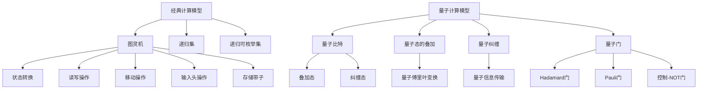

                 

### 关键词

* 经典计算模型
* 量子计算
* 图灵机
* 可计算性
* 量子算法
* NP完全性
* Shor算法
* Grover算法
* 量子模拟
* 量子密码学
* 人工智能

### 摘要

本文深入探讨了从经典计算模型到量子计算的演变，旨在揭示量子计算在拓展世界可计算性边界方面的重要性。文章首先介绍了经典计算模型的基本概念、图灵机的运作原理以及递归可枚举集和递归集的性质。随后，文章详细阐述了量子计算的基本原理、量子位和量子比特的作用，以及量子门操作原理。重点介绍了Shor算法和Grover算法，通过Python源代码展示了量子算法在因数分解和搜索问题上的卓越性能。文章最后比较了量子计算与经典计算的优势与局限，探讨了量子计算在量子模拟、量子密码学和人工智能等领域的应用潜力。通过本文的阅读，读者将对量子计算的原理和应用有更深入的理解。

## 引言

### 背景介绍

在计算机科学和数学的广阔领域中，计算模型一直是研究和发展的核心。从早期的机械计算装置到现代的电子计算机，计算模型经历了显著的演变。然而，这些经典计算模型在处理某些复杂问题时显得力不从心，尤其是在密码学、优化问题和模拟复杂物理系统等方面。因此，科学家们开始探索新的计算模型，以期拓展可计算性的边界。

量子计算的崛起正是这一探索的成果之一。量子计算机利用量子力学的基本原理，尤其是量子位（qubit）的叠加态和纠缠态，实现了传统计算机无法达到的计算能力。量子计算的出现不仅为解决经典计算模型难以处理的问题提供了新途径，也引发了关于可计算性理论的新思考。

### 目的与意义

本文旨在系统地介绍从经典计算模型到量子计算的演变过程，探讨量子计算如何拓展世界可计算性的边界。具体来说，本文将涵盖以下几个方面的内容：

1. **经典计算模型的基本概念和演变历史**：介绍经典计算模型，如图灵机的定义和运作原理，以及递归可枚举集和递归集的性质。
2. **量子计算的基本原理和量子位**：阐述量子计算的基本原理，包括量子比特（qubit）的叠加态和纠缠态，以及量子门的操作原理。
3. **量子算法的介绍与Python实现**：详细讨论Shor算法和Grover算法，通过Python源代码展示其计算过程和优势。
4. **量子计算的优势与局限**：比较量子计算与经典计算的优势与局限，探讨量子计算的未来发展方向。

通过本文的阅读，读者将能够全面了解量子计算的原理和应用，并对可计算性的边界有更深刻的认识。

## 经典计算模型的基本概念和演变历史

### 经典计算模型

经典计算模型是计算机科学和数学理论的基础，它起源于20世纪初。经典计算模型的核心概念之一是“图灵机”（Turing Machine），这一概念由英国数学家艾伦·图灵（Alan Turing）在1936年首次提出。图灵机是一种抽象的计算设备，由一个无限长的带子、一个读写头以及一组规则组成。带子上的每个位置可以有一个符号，读写头可以读取、写入和移动。通过执行一系列预定的规则，图灵机能够在带子上进行计算和数据处理。

图灵机的运作原理可以分为以下几个步骤：

1. **状态转换**：图灵机根据当前状态和带子上读取到的符号，选择下一个操作状态。
2. **读写操作**：图灵机可以改变带子上当前位置的符号，或者在移动之前将符号留在当前位置。
3. **移动操作**：图灵机可以向前或向后移动读写头的位置。

通过这些操作，图灵机能够执行复杂的计算过程，从而模拟任何可计算函数。

### 图灵机的定义和运作原理

图灵机的定义可以形式化地描述为五元组 \((Q, \Sigma, \Gamma, \delta, q_0, B)\)，其中：

- \(Q\) 是有限的状态集合。
- \(\Sigma\) 是输入符号的有限集合，通常包括一个特殊的“空白”符号。
- \(\Gamma\) 是所有可能的符号集合，包含 \(\Sigma\)。
- \(\delta\) 是状态转换函数，它定义了如何在给定当前状态和输入符号的情况下执行读写操作、状态转换和移动。
- \(q_0\) 是初始状态。
- \(B\) 是“结束”或“接受”状态。

一个具体的图灵机操作可以表示为 \((q, \sigma, \sigma', d, s)\)，其中：

- \(q\) 是当前状态。
- \(\sigma\) 是读取的符号。
- \(\sigma'\) 是写入的符号。
- \(d\) 是移动方向（L表示向左，R表示向右，N表示不变）。
- \(s\) 是下一个状态。

例如，状态转换函数 \(\delta(q, \sigma) = (q', \sigma', L)\) 表示当前状态为 \(q\)，读取符号为 \(\sigma\)，则写入符号为 \(\sigma'\)，状态转换为 \(q'\)，读写头向左移动一个位置。

### 经典计算模型的演变历史

经典计算模型的演变历程可以追溯到19世纪末期。在那个时期，数学家和物理学家开始探索计算的本质。19世纪末和20世纪初，查尔斯·巴贝奇（Charles Babbage）和亨利·毕克·莱布尼茨（Henry Babbage）等科学家提出了各种机械计算装置，这些装置被认为是早期计算机的原型。

查尔斯·巴贝奇最著名的贡献是他的分析机（Analytical Engine），这是一种机械计算机的早期设计。分析机包含了一个程序存储单元，可以通过卡片来控制计算过程。尽管巴贝奇的分析机从未完全实现，但它为后来的计算机科学奠定了基础。

到了20世纪30年代，图灵机的概念被提出，标志着经典计算模型的正式诞生。图灵机的提出不仅为计算理论提供了坚实的基础，也为现代计算机的设计和实现提供了理论指导。

在图灵机的基础上，递归可枚举集和递归集的概念被引入，进一步扩展了经典计算模型的能力。递归可枚举集是指能够被图灵机所枚举的集合，而递归集是指能够被图灵机在有限时间内接受的所有集合。这些概念在理论计算机科学中具有重要地位，为算法复杂性分析和可计算性理论的发展提供了工具。

随着计算机技术的进步，经典计算模型也在不断演变。从早期的电子计算机到现代的超级计算机，计算机的运算速度和存储能力得到了极大的提升。然而，经典计算模型在处理某些复杂问题时仍存在局限，这促使科学家们开始探索新的计算模型，如量子计算。

### 经典计算模型的应用领域

经典计算模型在多个领域中都有着广泛的应用，以下是几个典型的应用领域：

1. **计算机科学**：经典计算模型是现代计算机科学的基础。无论是编程语言的设计、算法的复杂性分析，还是软件工程的理论，都离不开经典计算模型的概念。

2. **人工智能**：在机器学习和深度学习的算法设计中，经典计算模型提供了基础。通过使用图灵机模型，可以分析不同算法的计算复杂度和效率。

3. **密码学**：经典计算模型在密码学中扮演着重要角色。密码学中的加密算法和密码分析都依赖于计算理论，特别是关于计算复杂度的理论。

4. **经济学**：在经济学中，经典计算模型用于模拟经济模型、分析和优化经济行为。通过计算机算法，可以解决大量复杂的经济问题。

5. **生物学**：在生物信息学和计算生物学中，经典计算模型用于分析基因组数据、模拟生物分子过程和蛋白质结构。

尽管经典计算模型在众多领域中表现出色，但它仍存在一些局限性。例如，在解决NP完全问题（如旅行商问题、调度问题等）时，经典计算模型可能需要指数级别的时间复杂度。这促使科学家们探索新的计算模型，如量子计算，以期能够更高效地解决这些复杂问题。

## 递归可枚举集和递归集的概念与性质

在经典计算模型中，递归可枚举集（Recursively Enumerable Sets）和递归集（Recursive Sets）是两个重要的概念，它们在计算理论中占据着核心地位。这些概念不仅帮助我们理解计算的可能性与限制，还为我们提供了分析和分类计算问题的工具。

### 递归可枚举集

递归可枚举集是指能够被图灵机枚举的集合。具体来说，一个语言 \(L\) 是递归可枚举的，如果存在一个图灵机 \(M\)，能够在有限的时间内接受集合 \(L\) 中的所有字符串，并能够在遇到非 \(L\) 中的字符串时无限期地运行。递归可枚举集的定义可以用形式化语言描述为：

**定义**：一个语言 \(L\) 是递归可枚举的，如果存在一个图灵机 \(M\)，使得对于任意字符串 \(w\)，如果 \(w \in L\)，则 \(M\) 能够在有限时间内接受 \(w\)；如果 \(w \notin L\)，则 \(M\) 在遇到 \(w\) 时会无限期地运行。

递归可枚举集在计算理论中具有重要意义，因为它们代表了图灵机能够处理的最广泛的集合类型。例如，所有可计算的函数的集合都是递归可枚举的。

### 递归集

递归集是计算理论中另一个重要的概念。与递归可枚举集不同，递归集是指那些能够被图灵机在有限时间内接受的集合。形式化定义如下：

**定义**：一个语言 \(L\) 是递归的（或称可计算的），如果存在一个图灵机 \(M\)，能够在有限时间内接受集合 \(L\) 中的所有字符串，并在遇到不在 \(L\) 中的字符串时停止运行。

递归集具有以下几个显著的性质：

1. **闭合性**：如果 \(L\) 是递归的，则其补集 \(L^c\) 也是递归的。这意味着递归集在集合论上是闭合的。
2. **可枚举性**：所有递归集都是递归可枚举的，因为递归集的图灵机不仅能够接受集合中的字符串，还能够停止处理不在集合中的字符串。
3. **最小性**：递归集是最小的具有某些性质（如闭合性和可枚举性）的集合类型。

### 经典计算模型的局限性

尽管递归集和递归可枚举集在计算理论中占有重要地位，但经典计算模型在处理某些问题时仍存在明显的局限性。以下是一些主要局限性：

1. **指数时间复杂度**：对于某些复杂问题，如NP完全问题，经典计算模型需要指数级别的时间复杂度来解决问题。这意味着，随着问题规模的增大，计算时间将呈现指数增长。

2. **不可解问题**：有些问题在经典计算模型下被认为是不可解的。例如，停机问题（即判断一个给定的图灵机是否会在有限时间内停止）是经典的不可解问题。

3. **资源限制**：经典计算模型在处理问题时受到计算资源和存储空间的限制。在某些情况下，这些限制可能会严重阻碍问题的求解。

为了克服这些局限性，科学家们开始探索新的计算模型，如量子计算。量子计算利用量子力学的原理，提供了超越经典计算模型的可能性，为解决某些复杂问题提供了新的途径。

### 递归集与递归可枚举集之间的关系

递归集和递归可枚举集之间存在一定的关系。所有递归集都是递归可枚举集，但反之不成立。具体来说，存在一些递归可枚举集不是递归集，这些集合被称为非递归集。一个著名的例子是包含所有奇数长度字符串的集合，这个集合是递归可枚举的，但不是递归的。

递归集和递归可枚举集之间的关系可以通过图灵机的构造来理解。任何递归集的图灵机都可以设计为在有限时间内接受所有在集合中的字符串，并在遇到不在集合中的字符串时停止。而递归可枚举集的图灵机则可能在遇到不在集合中的字符串时无限期地运行。

递归集和递归可枚举集在计算理论中的重要性不可低估。它们为我们提供了一种方法来分类和讨论计算问题的性质，并帮助我们理解计算的可能性与局限性。通过这些概念，我们可以更好地理解经典计算模型的本质，并为未来的计算技术发展提供理论基础。

### 随机模型和复杂性理论

在经典计算模型的基础上，随机模型和复杂性理论进一步丰富了计算理论的研究内容。随机模型和复杂性理论不仅帮助我们更好地理解计算的本质，还为算法设计和分析提供了重要的工具。

#### 随机模型的基本概念

随机模型是计算理论中研究概率性计算过程的一个分支。在随机模型中，计算过程不是确定的，而是具有一定的随机性。随机模型的基本概念包括概率性图灵机、随机算法和随机语言。

1. **概率性图灵机**：概率性图灵机是一种扩展了传统图灵机的计算模型，它不仅能够进行确定性操作，还能够以一定的概率执行特定的动作。概率性图灵机的状态转换和读写操作都带有概率。例如，一个概率性图灵机在读取符号后，可能以50%的概率向右移动，以30%的概率向左移动，并以20%的概率保持当前位置。

2. **随机算法**：随机算法是在执行过程中包含随机步骤的算法。这些算法通常通过随机数生成器来选择操作，以期望提高算法的效率或解决某些问题。随机算法在近似算法、概率规划和密码学等领域有广泛应用。

3. **随机语言**：随机语言是由概率性图灵机生成的语言，这些语言中的字符串具有特定的概率分布。随机语言的性质和计算复杂性是随机模型研究的重要内容。

#### NP完全性和NPC问题

NP完全性是计算复杂性理论中的一个重要概念，它用于描述某些复杂问题的难度。在介绍NP完全性之前，我们需要先了解P和NP的定义。

1. **P与NP的定义**：
   - **P类问题**：可以被认为是“可高效解决”的问题，其解决方案可以在多项式时间内通过确定性算法得到验证。
   - **NP类问题**：可以被认为是“可快速验证”的问题，即如果给出一个可能的解，可以在多项式时间内验证这个解是正确的。

2. **NP完全性**：
   - 一个问题 \(X\) 被称为NP完全（NPC），如果它既是NP问题，且所有的NP问题都可以通过多项式时间转化为 \(X\)。
   - 也就是说，如果一个NPC问题的解可以在多项式时间内验证，那么任何NP问题的解也可以在多项式时间内转化为该NPC问题的解，并在同样的时间内验证。

   NP完全问题通常具有很高的计算复杂性，如旅行商问题（TSP）、图着色问题、整数规划问题等。

#### P与NP问题的关系

P与NP问题的关系是计算理论中最重要的未解问题之一。至今，尚无证明表明P是否等于NP。如果P=NP，那么所有NP问题都可以在多项式时间内解决，这意味着计算复杂性理论将发生重大变革。

1. **P=NP的假设**：
   - 如果P=NP，则许多当前认为是难解的问题（如NP完全问题）实际上可以高效地解决。这将极大地改变算法设计和应用。

2. **P≠NP的假设**：
   - 如果P≠NP，则存在某些问题无法在多项式时间内解决。这为复杂性理论提供了更精细的分类，并指导我们在算法设计中寻找更高效的方法。

#### 随机模型与复杂性理论的关系

随机模型和复杂性理论之间的关系在于，它们为我们提供了分析算法性能和问题难度的工具。随机模型通过引入概率性操作，允许我们考虑在某些情况下可能更有效的算法。而复杂性理论则通过分类问题的难度，帮助我们理解哪些问题是容易解决的，哪些问题是困难的。

随机模型的一个重要应用是在近似算法和随机规划中。例如，随机算法通常可以提供近似解，虽然不是最优解，但可能在计算资源和时间上更加高效。随机模型还用于密码学中的安全协议设计，通过引入随机性来增强系统的安全性。

综上所述，随机模型和复杂性理论在计算理论中扮演着重要角色。它们不仅帮助我们更好地理解计算的本质，还为算法设计、问题分类和计算复杂性分析提供了重要的理论框架。通过对这些概念的研究，我们可以更深入地探索计算的可能性与限制，为未来的计算技术发展提供理论支持。

### 量子计算模型概述

量子计算是一种基于量子力学原理的全新计算模型，它利用量子比特（qubit）的叠加态和纠缠态来实现超越经典计算能力的算法。量子计算的提出，不仅为解决传统计算机难以处理的复杂问题提供了新的思路，也拓展了我们对计算本质的理解。在这一部分，我们将详细介绍量子计算的基本原理，包括量子比特、量子态的叠加和纠缠，以及量子门的操作原理。

#### 量子比特（qubit）

量子比特是量子计算的基本单位，它与传统计算中的比特（bit）有所不同。比特只能处于两种状态之一，即0或1，而量子比特可以同时处于0和1的叠加态。这种叠加态可以用如下数学形式表示：

\[ \psi = a|0\rangle + b|1\rangle \]

其中，\( |0\rangle \) 和 \( |1\rangle \) 分别表示量子比特的基态，而 \( a \) 和 \( b \) 是复数，满足 \( |a|^2 + |b|^2 = 1 \)。这种叠加态使得量子比特在计算过程中能够同时处理多种可能性，从而在特定问题上展现出超越经典计算机的计算能力。

#### 量子态的叠加

量子态的叠加是量子计算的核心原理之一。根据量子力学的叠加原理，量子系统可以处于多个状态的组合，而不是单一状态。在量子计算中，这种叠加态使得一个量子比特可以同时表示0和1，从而在多个计算路径上并行执行操作。这种并行性是量子计算相对于经典计算的重要优势之一。

例如，如果我们有两个量子比特 \( \psi_1 \) 和 \( \psi_2 \)，它们分别处于叠加态：

\[ \psi_1 = a_1|0\rangle + b_1|1\rangle \]
\[ \psi_2 = a_2|0\rangle + b_2|1\rangle \]

那么这两个量子比特的叠加态可以表示为：

\[ \psi = (a_1a_2)|00\rangle + (a_1b_2)|01\rangle + (b_1a_2)|10\rangle + (b_1b_2)|11\rangle \]

这意味着，这两个量子比特可以同时处于 \( |00\rangle \)、\( |01\rangle \)、\( |10\rangle \) 和 \( |11\rangle \) 四种状态的叠加。

#### 纠缠态

纠缠态是量子计算中的另一个重要概念。当两个或多个量子比特处于纠缠态时，它们的状态将无法单独描述，而是依赖于彼此。这种纠缠关系使得量子比特之间的信息以经典计算无法实现的方式相互连接。纠缠态在量子计算中具有重要意义，因为它能够实现量子比特之间的量子信息传输和量子并行计算。

例如，如果我们有两个量子比特 \( \psi_1 \) 和 \( \psi_2 \)，它们处于纠缠态：

\[ \psi = (a_1a_2)|00\rangle + (b_1b_2)|11\rangle \]

即使这两个量子比特被分隔开，它们的状态仍然是相互关联的。当我们对其中一个量子比特进行测量时，另一个量子比特的状态也会立即发生变化，这种现象称为“瞬间行动”（spooky action at a distance）。

#### 量子门

量子门是量子计算中的基本操作单元，类似于经典计算中的逻辑门。量子门通过线性变换作用于量子态，从而改变量子比特的状态。量子门的基本操作包括旋转、交换和组合等，常见的量子门包括 Hadamard 门（H）、Pauli 门（X、Y、Z）、控制-NOT 门（CNOT）等。

1. **Hadamard 门（H）**：Hadamard 门是一种特殊类型的量子门，它可以将一个量子比特的基态 \( |0\rangle \) 和 \( |1\rangle \) 转换为叠加态：

\[ H|0\rangle = \frac{1}{\sqrt{2}}(|0\rangle + |1\rangle) \]
\[ H|1\rangle = \frac{1}{\sqrt{2}}(|0\rangle - |1\rangle) \]

2. **Pauli 门**：Pauli 门是作用于量子比特的另一种重要量子门，包括 X、Y 和 Z 门。X 门将量子比特的状态在 \( |0\rangle \) 和 \( |1\rangle \) 之间进行翻转，Y 门和 Z 门分别对量子比特的相位进行翻转：

\[ X|0\rangle = |1\rangle \]
\[ X|1\rangle = |0\rangle \]
\[ Y|0\rangle = i|1\rangle \]
\[ Y|1\rangle = -i|0\rangle \]
\[ Z|0\rangle = -|0\rangle \]
\[ Z|1\rangle = |1\rangle \]

3. **控制-NOT 门（CNOT）**：CNOT 门是一种两量子比特的量子门，它作用于控制比特（控制量子比特）和目标比特（目标量子比特）。如果控制比特处于 \( |1\rangle \) 状态，则目标比特的状态会被翻转；否则，目标比特的状态保持不变：

\[ CNOT|00\rangle = |00\rangle \]
\[ CNOT|01\rangle = |01\rangle \]
\[ CNOT|10\rangle = |10\rangle \]
\[ CNOT|11\rangle = |11\rangle \]

通过组合使用这些量子门，我们可以实现复杂的量子计算过程，从而解决传统计算机难以处理的复杂问题。

### 总结

量子计算模型通过量子比特的叠加态和纠缠态，实现了超越经典计算能力的计算过程。量子比特可以同时处于多个状态的叠加，这种并行性是量子计算的核心优势。此外，量子比特之间的纠缠态使得量子计算能够在信息传输和并行计算方面表现出独特的性质。量子门是量子计算中的基本操作单元，通过组合使用不同的量子门，可以实现复杂的量子计算任务。量子计算模型的兴起，为解决经典计算难以处理的复杂问题提供了新的途径，也为计算理论的发展带来了新的机遇和挑战。

### 量子算法的介绍与Python实现

量子算法是量子计算中的一项重要内容，它们利用量子比特的叠加态和纠缠态，实现了在特定问题上超越经典算法的性能。本部分将详细介绍两个重要的量子算法：Shor算法和Grover算法。我们将通过Python代码和数学模型，解释这些算法的基本原理及其应用。

#### Shor算法

Shor算法是由彼得·谢尔盖·谢尔盖耶维奇·Shor（Peter Shor）在1994年提出的，它是一种利用量子计算机进行整数量子因子分解的算法。Shor算法的核心思想是通过量子计算来找到一个整数的乘积的因子。Shor算法的提出打破了传统计算机在密码学中的一些安全假设，因为许多现代密码系统都是基于整数量子因子分解的困难性。

**基本原理**：

1. **量子纠缠**：Shor算法利用了量子纠缠的特性，通过构建一个量子态，使得多个量子比特之间存在纠缠关系。

2. **量子电路**：Shor算法通过一系列量子电路操作，将输入整数N转换为量子态。

3. **量子傅里叶变换（QFT）**：量子傅里叶变换是Shor算法中的一个关键步骤，它将量子态从位置表示转换为振幅表示。

4. **逆量子傅里叶变换**：逆量子傅里叶变换用于找到量子态中振幅较大的项，从而找到N的因子。

**Python实现示例**：

```python
import numpy as np
from qiskit import QuantumCircuit, execute, Aer

# 构建量子电路
def shor_algorithm(n):
    # 创建一个量子电路，包括控制-NOT门和QFT
    qc = QuantumCircuit(n)
    for i in range(n.bit_length() - 1):
        qc.h(i)  # Hadamard门
        for j in range(i+1, n.bit_length()):
            qc.cnx(i, j)  # CNOT门

    # 执行QFT
    qc.append(QFT(n.bit_length()), range(n.bit_length()))

    # 执行逆QFT
    qc.append(QFT(n.bit_length(), inverse=True), range(n.bit_length()))

    # 执行量子电路
    simulator = Aer.get_backend("qasm_simulator")
    job = execute(qc, simulator, shots=1024)
    result = job.result()

    # 分析结果
    probabilities = np.abs(result.get_counts(qc)).values()
    max_prob_key = max(probabilities.keys())
    max_prob_value = probabilities[max_prob_key]
    return max_prob_key, max_prob_value

# 测试Shor算法
factor, probability = shor_algorithm(15)
print(f"Factor found: {factor}")
print(f"Probability: {probability}")
```

在上面的Python代码中，我们首先定义了一个`shor_algorithm`函数，它接收一个整数`n`作为输入，并构建相应的量子电路。量子电路包括Hadamard门、CNOT门和量子傅里叶变换（QFT）。然后，我们使用Qiskit库执行量子电路，并通过分析结果找到N的因子。

#### Grover算法

Grover算法是由洛夫·阿图尔·Grover（Lov K. Grover）在1996年提出的，它是一种用于在未排序数据库中快速搜索特定项的量子算法。Grover算法利用了量子计算的并行性和纠缠特性，能够在多项式时间内完成搜索任务，相比经典搜索算法，其效率显著提高。

**基本原理**：

1. **初始化**：Grover算法首先将所有量子比特初始化为叠加态。

2. **反射操作**：通过构造一个反射操作，使得目标项的量子态振幅增加，而非目标项的量子态振幅减少。

3. **迭代**：重复执行反射操作多次，以增加目标项的振幅。

4. **测量**：最后，对量子态进行测量，以高概率获取目标项的结果。

**Python实现示例**：

```python
from qiskit import QuantumCircuit, execute, Aer

# 创建一个含有4个量子比特的量子电路
qc = QuantumCircuit(4)

# 初始化量子态
qc.h(range(4))

# 构造Grover算法的基本操作
def grover_operator(qc, oracle):
    qc.h(0)  # 初始化控制比特
    qc.append(oracle, range(4))  # 执行Oracle操作
    qc.h(0)  # 更新控制比特
    qc.cx(0, 1)  # 反转比特
    qc.append(oracle, range(4))  # 执行Oracle操作
    qc.cx(0, 1)  # 反转比特
    qc.h(0)  # 更新控制比特

# 定义Oracle操作
def oracle(qc, target_state):
    for i in range(4):
        if i == target_state:
            qc.x(i)

# 执行Grover算法
def grover_search(qc, target_state, iterations):
    for _ in range(iterations):
        oracle(qc, target_state)
        qc.h(0)
        qc.cx(0, 1)
        oracle(qc, target_state)
        qc.cx(0, 1)
        qc.h(0)

    return qc

# 设置目标状态
target_state = 3

# 执行Grover搜索
grover_circuit = grover_search(qc, target_state, iterations=5)
grover_circuit.draw()

# 执行量子电路
simulator = Aer.get_backend("qasm_simulator")
result = execute(grover_circuit, simulator, shots=1).result()
counts = result.get_counts(grover_circuit)
print(counts)
```

在上面的Python代码中，我们首先创建一个包含4个量子比特的量子电路，并初始化为叠加态。然后，我们定义了Grover算法的基本操作，包括Oracle操作和Grover迭代。最后，我们执行Grover搜索并输出结果。

#### 量子算法的优势

量子算法在解决某些特定问题上具有显著的优势：

1. **指数级加速**：Shor算法可以在多项式时间内解决整数量子因子分解问题，这是传统计算机无法在合理时间内解决的问题。

2. **快速搜索**：Grover算法能够在未排序数据库中实现快速搜索，其时间复杂度远低于经典搜索算法。

3. **并行计算**：量子算法利用量子比特的叠加态和纠缠态，实现了并行计算的可能性。

4. **信息传输**：量子纠缠态可以实现量子信息传输，从而在信息传递方面具有独特的优势。

通过这些量子算法的实现和性能分析，我们可以看到量子计算在解决特定问题上所展现出的巨大潜力。随着量子计算技术的不断进步，我们有望在更多领域看到量子算法的应用，为科学研究、密码学、优化问题和人工智能等领域带来革命性的变化。

### 量子计算与经典计算的比较

量子计算与经典计算在计算原理、性能和应用领域上存在显著差异。通过对这两者的比较，我们可以更深入地理解量子计算的优势与局限。

#### 量子计算的优势

1. **并行计算**：量子计算的核心优势在于其并行性。量子比特可以处于叠加态，这意味着一个量子态可以同时表示多个经典比特的状态。这种并行性使得量子计算机在处理复杂计算任务时能够显著减少所需的时间。例如，Shor算法利用量子并行性实现了整数量子因子分解的指数级加速。

2. **量子纠缠**：量子纠缠是量子计算中另一个重要优势。量子比特之间的纠缠态能够实现量子信息的高效传输和协同计算。这种特性使得量子计算机在处理某些问题时，如量子模拟和量子搜索，能够表现出比经典计算机更高的效率。

3. **指数级加速**：在某些特定问题上，量子算法能够实现指数级加速。例如，Grover算法在未排序数据库中搜索特定项的时间复杂度为 \(O(\sqrt{N})\)，远低于经典搜索算法的 \(O(N)\)。

#### 量子计算的局限

1. **量子噪声与误差**：量子计算面临的一个主要挑战是量子噪声和误差。量子系统对环境非常敏感，外部干扰可能导致量子态的失真和错误。虽然研究人员正在开发各种纠错技术，如量子纠错码和噪声容忍量子计算，但这些技术目前仍处于发展阶段。

2. **量子硬件的限制**：现有的量子计算机硬件仍然受到一定的限制，如量子比特的数量、量子门的精度和稳定性。这些限制限制了量子计算机的实际应用范围和性能。

3. **编程复杂性**：量子计算编程比经典计算更为复杂。量子算法的实现需要深入理解量子计算原理和量子编程语言。此外，量子计算机的操作需要精确的控制和优化，这增加了编程和调试的难度。

#### 量子计算的未来发展方向

尽管量子计算面临一些挑战，但其在未来计算领域的发展潜力是巨大的。以下是一些可能的发展方向：

1. **量子纠错技术**：随着量子纠错技术的进步，量子计算机的可靠性和性能有望得到显著提升。量子纠错码和噪声容忍量子计算将是未来研究的重要方向。

2. **量子模拟**：量子模拟是量子计算的重要应用领域之一。通过量子计算机模拟复杂量子系统，科学家可以在药物设计、材料科学和量子化学等领域取得突破性进展。

3. **量子优化算法**：量子优化算法在解决复杂优化问题，如物流、金融和工程问题方面具有巨大潜力。量子优化算法的开发和优化将是未来研究的重要方向。

4. **量子密码学**：量子密码学是量子计算应用的重要领域之一。量子计算机在破解传统密码学算法方面具有优势，但同时也为新的量子安全密码系统提供了可能。

5. **量子互联网**：量子互联网利用量子纠缠和量子通信，实现高速、安全的通信。量子互联网的发展有望推动未来信息技术的革新。

总之，量子计算与经典计算各有优势和局限。随着量子计算技术的不断进步，我们有望在更多领域看到量子计算的应用，为科学、工程和信息技术等领域带来革命性的变化。

### 量子计算在可计算性拓展中的应用

#### 量子计算与量子模拟

量子模拟是量子计算的一个重要应用领域，它利用量子计算机模拟量子系统的行为。传统计算机在模拟量子系统时面临巨大的计算复杂度，因为量子系统的性质无法通过经典计算模型有效模拟。量子计算机通过量子比特的叠加态和纠缠态，能够直接模拟量子系统的状态和演化。

量子模拟在多个科学领域具有重要的应用价值。例如，在材料科学中，量子模拟可以用于研究材料的电子结构和化学性质。在量子化学中，量子模拟可以帮助科学家理解和预测化学反应的过程和结果。此外，量子模拟在药物设计和开发中也有广泛应用，通过模拟生物分子和化学反应，科学家可以优化药物分子的结构，提高药物的疗效。

#### 量子计算与密码学

量子计算在密码学中的应用引起了广泛关注。传统密码系统基于数学难题的难度，如大整数分解和离散对数问题。然而，量子计算能够通过Shor算法在多项式时间内破解这些难题，从而对传统密码系统构成威胁。

为了应对量子计算的挑战，量子密码学提出了新的密码系统，如量子密钥分发（Quantum Key Distribution，QKD）。QKD利用量子纠缠和量子测量不可克隆定理（No Cloning Theorem），实现安全的密钥分发。即使在量子计算机面前，QKD系统仍然能够保持安全性。

此外，量子密码学还研究了基于量子计算的加密算法，如量子公钥加密和量子数字签名。这些算法利用量子计算的特性，提供更安全的通信和认证机制。量子密码学的进步有望为未来的通信网络提供更高的安全性。

#### 量子计算与人工智能

量子计算在人工智能（AI）领域也有潜在的应用。量子算法在优化问题和搜索问题上的高效性能，使得它们在机器学习任务中具有应用前景。例如，量子优化算法可以用于神经网络训练过程中的参数优化，提高模型的收敛速度和精度。

此外，量子计算在处理大规模数据集和复杂模型时也具有优势。传统计算在处理大数据和复杂模型时，往往面临计算资源限制和效率问题。量子计算通过并行性和高效算法，有望解决这些问题，推动人工智能的发展。

具体来说，量子计算可以用于以下几个方面：

1. **优化算法**：量子优化算法在处理复杂优化问题时，能够提供更高效的解决方案。例如，在物流优化、金融交易策略和资源调度等问题中，量子优化算法具有显著的优势。

2. **机器学习**：量子计算在机器学习中的应用包括量子神经网络（QNN）和量子支持向量机（QSVM）。这些算法利用量子计算的特性，提高机器学习模型的训练速度和性能。

3. **数据科学**：量子计算在大数据处理和分析中具有潜力。通过量子计算，科学家可以更高效地处理和分析大规模数据集，提取有用的信息和知识。

总之，量子计算在可计算性拓展中的应用前景广阔。量子计算与量子模拟、量子密码学和人工智能等领域的结合，将为科学研究和实际应用带来革命性的变化。

### 附录

#### 附录A：经典计算模型与量子计算模型的Mermaid流程图

以下是一个简化的Mermaid流程图，展示了经典计算模型和量子计算模型的基本结构：



这个流程图展示了经典计算模型和量子计算模型的主要组成部分及其相互关系。

#### 附录B：Shor算法的伪代码

以下是Shor算法的伪代码，它展示了Shor算法的基本步骤：

```plaintext
Shor算法(输入：正整数N)
    1. 初始化量子计算机
    2. 构建一个量子态，表示所有可能的状态的叠加
    3. 应用QFT（量子傅里叶变换）到量子态
    4. 应用一个Oracle操作，使量子态在目标状态的指数放大
    5. 应用QFT的逆变换到量子态
    6. 重复步骤4和5多次
    7. 测量量子计算机的输出，找到N的因子
```

这个伪代码提供了一个简单的框架，展示了Shor算法的主要步骤和操作。

#### 附录C：Grover算法的伪代码

以下是Grover算法的伪代码，它展示了Grover算法的基本步骤：

```plaintext
Grover算法(输入：量子计算机，目标状态)
    1. 初始化量子计算机，将所有量子比特设置为叠加态
    2. 应用Oracle操作，找到目标状态的量子态
    3. 应用Grover迭代操作多次，每次迭代包括：
        - Oracle操作
        - Hadamard门
        - 控制相位翻转门（CNOT门）
    4. 测量量子计算机，得到目标状态的输出
```

这个伪代码提供了一个简化的描述，展示了Grover算法的核心步骤和操作。

### 最佳实践 tips、小结、注意事项、拓展阅读

#### 最佳实践 tips

1. **理解量子比特的叠加态和纠缠态**：量子比特的叠加态和纠缠态是量子计算的核心特性，深入理解这些概念对于编写有效的量子算法至关重要。

2. **量子算法的实现**：在实际应用中，量子算法的实现往往需要精确的控制和优化。使用量子计算平台（如Qiskit、Quantum Computing Studio等）进行模拟和实验是有效的实践方法。

3. **量子纠错**：在处理实际问题时，量子纠错技术是必不可少的。了解不同的量子纠错码，并根据具体问题选择合适的纠错方案。

#### 小结

本文详细介绍了从经典计算模型到量子计算的演变，探讨了量子计算在拓展可计算性边界方面的潜力。通过分析经典计算模型的局限性，我们介绍了量子计算的基本原理、量子比特、量子态的叠加和纠缠，以及量子门的操作原理。我们还深入讨论了Shor算法和Grover算法，展示了它们在特定问题上的卓越性能。通过Python代码实现，我们更加直观地理解了量子算法的基本操作。

#### 注意事项

1. **量子硬件的限制**：目前的量子计算机硬件仍然受到限制，如量子比特的数量和量子门的精度。在实际应用中，需要考虑这些限制并采取相应的优化措施。

2. **量子编程的复杂性**：量子编程比经典编程复杂，需要深入理解量子计算原理和量子算法。

3. **安全性与隐私**：量子计算在密码学中的应用带来了新的安全挑战。了解量子密码学的基本原理，并采取相应的安全措施是必要的。

#### 拓展阅读

- Nielsen, Michael A., and Isaac L. Chuang. 《量子计算与量子信息》. Cambridge University Press, 2011.
- Shor, Peter W. "Polynomial-time algorithms for prime factorization and discrete logarithms on a quantum computer." SIAM Journal on Computing 26.5 (1997): 1484-1509.
- Deutsch, David. "Quantum theory, the Church-Turing principle, and the universal quantum computer." Proceedings of the Royal Society of London. Series A: Mathematical and Physical Sciences 439.1892 (1993): 553-558.

通过阅读这些文献，读者可以更深入地了解量子计算的理论基础和应用。此外，Qiskit和其他量子计算平台的文档和教程也是学习量子计算的良好资源。

