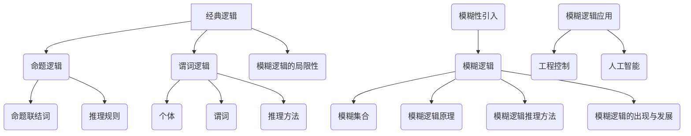

                 


# 从经典逻辑到模糊逻辑：处理模糊世界的新思路

## 关键词
- 经典逻辑
- 模糊逻辑
- 模糊集合
- 推理方法
- 应用领域
- 工程控制
- 人工智能

## 摘要
本文旨在探讨经典逻辑的局限性和模糊逻辑的崛起。首先，我们将回顾经典逻辑的基本原理和应用，然后深入分析模糊逻辑的核心概念和原理。通过对比分析，我们将揭示模糊逻辑在处理模糊世界中的独特优势。最后，我们将讨论模糊逻辑在工程控制和人工智能等领域的实际应用，并展望其未来发展。

## 目录

1. 引言
2. 经典逻辑基础
   2.1 经典逻辑概述
   2.2 经典逻辑的基本原理
   2.3 经典逻辑的局限性
3. 模糊逻辑原理
   3.1 模糊集合与模糊逻辑
   3.2 模糊逻辑的应用
4. 模糊逻辑与经典逻辑的对比
5. 模糊逻辑的未来发展
6. 附录
7. 参考文献

## 引言

在人类文明的漫长历史中，逻辑一直是一种不可或缺的工具。从古希腊哲学家亚里士多德开始，逻辑就被广泛应用于哲学、数学、科学和日常推理中。经典逻辑作为逻辑学的基石，为我们提供了处理清晰、明确问题的一套完备的工具和方法。

然而，随着科技的发展和社会的进步，我们面临的问题越来越复杂，其中包含大量的模糊性和不确定性。经典逻辑在这种模糊世界中显得力不从心。为了应对这一挑战，模糊逻辑应运而生。模糊逻辑提供了一种处理模糊性和不确定性的新方法，使得我们能够更好地理解和解决现实世界中的复杂问题。

本文将首先回顾经典逻辑的基本原理和应用，探讨其在现实世界中的局限性。接着，我们将深入探讨模糊逻辑的核心概念和原理，并分析其在处理模糊世界中的优势。随后，我们将对比分析模糊逻辑与经典逻辑的异同，讨论模糊逻辑在实际应用中的优势。最后，我们将展望模糊逻辑的未来发展，探讨其在各个领域的应用前景。

## 第一部分：经典逻辑基础

### 2.1 经典逻辑概述

经典逻辑，也称为形式逻辑或精确逻辑，是一种以严格数学方法为基础的逻辑系统。它起源于古希腊哲学，由亚里士多德等人创立。经典逻辑的基本原理可以概括为：所有命题都是真值命题，即命题要么是真的，要么是假的，不存在既真又假的命题。

经典逻辑的发展历程可以追溯到古希腊哲学，经过中世纪神学家和哲学家的发展，到17世纪现代逻辑学的兴起，再到20世纪的现代形式逻辑学，逐渐形成了完整的理论体系。

经典逻辑的应用领域非常广泛，涵盖了哲学、数学、计算机科学、人工智能、工程控制等众多领域。在哲学中，经典逻辑被用来探讨真理、证明和推理等问题；在数学中，经典逻辑被用于证明数学定理和构造数学模型；在计算机科学中，经典逻辑被用于算法设计和软件验证；在工程控制中，经典逻辑被用于控制系统设计和故障诊断。

### 2.2 经典逻辑的基本原理

经典逻辑的基本原理包括命题逻辑和谓词逻辑。

#### 命题逻辑

命题逻辑是经典逻辑的基础，它研究命题之间的关系和推理规则。命题逻辑的基本元素是命题，命题是一个陈述句，它要么是真的，要么是假的。命题逻辑的命题联结词包括“且”、“或”、“非”等。

命题逻辑的基本定律包括：

1. **恒真律**：对于任何命题P，都有P∧P为真，P∨P为真。
2. **恒假律**：对于任何命题P，都有P∨¬P为真，P∧¬P为假。
3. **否定律**：对于任何命题P，都有¬(¬P)为真。
4. **交换律**：对于任何命题P和Q，都有P∧Q=Q∧P，P∨Q=Q∨P。
5. **结合律**：对于任何命题P、Q和R，都有(P∧Q)∧R=P∧(Q∧R)，(P∨Q)∨R=P∨(Q∨R)。

命题逻辑的推理规则包括：

1. **肯定前件式**：如果P→Q，且P为真，则Q为真。
2. **否定后件式**：如果P→Q，且Q为假，则P为假。
3. **肯定后件式**：如果P→Q，且Q为真，则P可能为真。
4. **否定前件式**：如果P→Q，且P为假，则Q可能为假。

#### 谓词逻辑

谓词逻辑是一种扩展了命题逻辑的逻辑系统，它研究个体和个体之间的逻辑关系。谓词逻辑的基本元素是谓词，谓词是一个描述个体性质或关系的语句。谓词逻辑中的个体可以是具体的对象，也可以是抽象的概念。

谓词逻辑的基本概念包括：

1. **个体**：个体是谓词逻辑的基本元素，它可以是具体的对象，也可以是抽象的概念。
2. **谓词**：谓词是一个描述个体性质或关系的语句。
3. **个体常项**：个体常项是一个表示个体的名称，如“苏格拉底”、“地球”等。
4. **谓词符号**：谓词符号是一个表示谓词的符号，如“是人”、“是圆的”等。

谓词逻辑的基本定律包括：

1. **全称命题律**：对于任何谓词P，都有∀xP(x)∧∃xP(x)。
2. **存在命题律**：对于任何谓词P，都有∃xP(x)∨∀x¬P(x)。
3. **同一律**：对于任何个体常项a和b，都有Pa→Pb。
4. **差异律**：对于任何个体常项a和b，都有¬(Pa∧Pb)∧¬(Pa∨Pb)。

谓词逻辑的推理规则包括：

1. **全称实例化**：如果∀xP(x)，则Pc，其中c是一个个体常项。
2. **存在实例化**：如果∃xP(x)，则Pc，其中c是一个个体常项。
3. **全称否定**：如果∀xP(x)为假，则∃x¬P(x)为真。
4. **存在否定**：如果∃xP(x)为假，则∀x¬P(x)为真。

### 2.3 经典逻辑的局限性

尽管经典逻辑在处理清晰、明确的问题方面具有强大的能力，但在处理现实世界中的模糊性和不确定性问题时，经典逻辑显得力不从心。以下是一些经典逻辑的局限性：

1. **排中律的局限性**：经典逻辑中的排中律要求每个命题都是真或假。然而，现实世界中存在许多模糊命题，即既不是真也不是假的命题，如“这个人高不高？”这种问题很难用经典逻辑来回答。

2. **不确定性处理能力**：经典逻辑在处理不确定信息时缺乏有效的手段。在经典逻辑中，如果一个命题不能被证明为真，它就被认为是假的。这种处理方式在处理含有不确定性的问题时往往会导致错误的结论。

3. **逻辑推理的局限性**：经典逻辑的推理方法主要基于演绎推理，即从一般到个别的推理方式。然而，现实世界中的许多问题往往需要归纳推理，即从个别到一般的推理方式。经典逻辑在处理归纳推理问题时存在一定的局限性。

4. **模糊性的处理**：经典逻辑无法直接处理模糊性。在现实世界中，许多概念和现象都具有模糊性，如“高个子”、“老人”等。经典逻辑无法有效地描述和处理这些模糊概念。

为了克服经典逻辑的局限性，人们开始探索新的逻辑系统，其中模糊逻辑成为了一个重要的研究方向。模糊逻辑提供了一种处理模糊性和不确定性的新方法，使得我们能够更好地理解和解决现实世界中的复杂问题。

## 第二部分：模糊逻辑原理

### 3.1 模糊集合与模糊逻辑

模糊逻辑是处理模糊性和不确定性的一种逻辑系统，它基于模糊集合的概念。模糊集合是普通集合的扩展，它允许集合中的元素具有不同程度的隶属度，即元素既不是完全属于集合，也不是完全不属于集合。

#### 模糊集合的定义

模糊集合是普通集合的推广，它由隶属度函数描述。隶属度函数是一个从集合X到区间[0, 1]的映射，它用于描述集合中每个元素属于模糊集合的程度。隶属度函数通常表示为：

$$\mu_A(x) \in [0, 1], \forall x \in X$$

其中，$A$ 是模糊集合，$X$ 是论域，$\mu_A(x)$ 是元素$x$在模糊集合$A$中的隶属度。

#### 模糊集合的基本性质

1. **非负性**：模糊集合中每个元素的隶属度都是非负的，即 $\mu_A(x) \geq 0$。
2. **归一性**：模糊集合中所有元素的隶属度之和等于1，即 $\sum_{x \in X} \mu_A(x) = 1$。
3. **自反性**：每个元素在自己的模糊集合中的隶属度为1，即 $\mu_A(a) = 1$，其中$a$是模糊集合$A$中的元素。
4. **对称性**：如果两个元素关于模糊集合是对称的，则它们的隶属度相等，即如果 $a \sim b$，则 $\mu_A(a) = \mu_A(b)$。
5. **传递性**：如果三个元素关于模糊集合是传递的，则中间元素的隶属度介于两端元素之间，即如果 $a \sim b$ 且 $b \sim c$，则 $a \sim c$。

#### 模糊集合的运算

1. **交集**：模糊集合$A$和$B$的交集$A \cap B$是一个新的模糊集合，其隶属度函数为 $\mu_{A \cap B}(x) = \min(\mu_A(x), \mu_B(x))$。
2. **并集**：模糊集合$A$和$B$的并集$A \cup B$是一个新的模糊集合，其隶属度函数为 $\mu_{A \cup B}(x) = \max(\mu_A(x), \mu_B(x))$。
3. **补集**：模糊集合$A$的补集$A^c$是一个新的模糊集合，其隶属度函数为 $\mu_{A^c}(x) = 1 - \mu_A(x)$。

#### 模糊集合的表示方法

模糊集合可以用模糊集合矩阵、隶属度函数图或模糊规则表示。

1. **模糊集合矩阵**：模糊集合矩阵是一个二维矩阵，其元素表示模糊集合中每个元素的隶属度。例如，对于模糊集合$A$，其模糊集合矩阵为：

    $$\mu_A = \begin{bmatrix} \mu_{A1} & \mu_{A2} & \cdots & \mu_{An} \end{bmatrix}$$

2. **隶属度函数图**：隶属度函数图是一种直观表示模糊集合的方法。在隶属度函数图中，横轴表示论域中的元素，纵轴表示元素的隶属度。例如，对于模糊集合$A$，其隶属度函数图如下：

    ```mermaid
    graph TB
    A[隶属度函数图] --> B(论域)
    B -->|隶属度| C(隶属度值)
    ```

3. **模糊规则**：模糊规则是模糊逻辑中的基本元素，它描述了输入变量与输出变量之间的关系。模糊规则通常表示为：

    IF 输入1 is A1 AND 输入2 is A2 ...
    THEN 输出 is B

其中，$A1, A2,...$ 是输入变量的模糊集合，$B$ 是输出变量的模糊集合。

#### 模糊集合的应用

模糊集合在许多领域都有广泛的应用，包括模糊控制、模糊推理、模糊聚类等。

1. **模糊控制**：模糊控制是模糊逻辑在工程控制领域的重要应用。模糊控制器通过模糊规则对系统进行控制，能够处理系统中的模糊性和不确定性。

2. **模糊推理**：模糊推理是模糊逻辑中的核心部分，它用于从模糊前提推导出模糊结论。模糊推理方法包括最大-最小推理、最大-乘法推理等。

3. **模糊聚类**：模糊聚类是模糊逻辑在数据分析领域的重要应用。模糊聚类能够处理数据中的模糊性和不确定性，从而得到更准确和自然的聚类结果。

### 3.2 模糊逻辑的基本原理

模糊逻辑是一种处理模糊性和不确定性的逻辑系统，它基于模糊集合的概念。模糊逻辑的基本原理包括模糊推理、模糊运算和模糊规则。

#### 模糊推理

模糊推理是模糊逻辑中的核心部分，它用于从模糊前提推导出模糊结论。模糊推理方法包括最大-最小推理、最大-乘法推理等。

1. **最大-最小推理**：最大-最小推理是最常用的模糊推理方法之一。它通过比较输入变量和模糊规则前件的隶属度，选择最大隶属度的输入变量和前件进行匹配，然后对匹配的结果进行最小化运算，得到模糊结论的隶属度。具体步骤如下：

    a. 对每个输入变量$x_i$，计算其与模糊规则前件$A_i$的交集$A_i \cap x_i$。

    b. 对每个交集结果，计算其隶属度$\mu_{A_i \cap x_i}$。

    c. 选择最大隶属度$\mu_{A_i \cap x_i}$，将其与模糊规则后件$B$进行交集运算。

    d. 对交集结果进行最小化运算，得到模糊结论的隶属度$\mu_B$。

2. **最大-乘法推理**：最大-乘法推理是另一种常用的模糊推理方法。它与最大-最小推理类似，但在计算交集时使用乘法运算。具体步骤如下：

    a. 对每个输入变量$x_i$，计算其与模糊规则前件$A_i$的交集$A_i \cap x_i$。

    b. 对每个交集结果，计算其隶属度$\mu_{A_i \cap x_i}$。

    c. 选择最大隶属度$\mu_{A_i \cap x_i}$，将其与模糊规则后件$B$进行乘法运算。

    d. 对乘法结果进行最小化运算，得到模糊结论的隶属度$\mu_B$。

#### 模糊运算

模糊运算包括模糊集合的运算、模糊逻辑运算和模糊算子运算。

1. **模糊集合运算**：模糊集合的运算包括交集、并集和补集。它们与普通集合的运算类似，但需要考虑隶属度。

2. **模糊逻辑运算**：模糊逻辑运算包括模糊与、模糊或和模糊非。模糊与和模糊或分别对应普通逻辑运算的“且”和“或”，而模糊非是普通逻辑运算的“非”。模糊逻辑运算的规则与普通逻辑运算的规则类似，但需要考虑隶属度。

3. **模糊算子运算**：模糊算子是模糊逻辑中的基本元素，包括模糊蕴含和模糊算子。模糊蕴含用于表示模糊条件语句，模糊算子用于表示模糊量化的操作。

#### 模糊规则

模糊规则是模糊逻辑中的核心部分，它描述了输入变量与输出变量之间的关系。模糊规则通常表示为：

IF 输入1 is A1 AND 输入2 is A2 ...
THEN 输出 is B

其中，$A1, A2,...$ 是输入变量的模糊集合，$B$ 是输出变量的模糊集合。

模糊规则可以通过模糊推理进行推理，从而得到模糊结论。模糊规则的表示方法包括模糊规则矩阵和模糊规则图。

1. **模糊规则矩阵**：模糊规则矩阵是一个二维矩阵，其元素表示模糊规则的输入变量和输出变量。例如，对于模糊规则$R_1$，其模糊规则矩阵为：

    $$R_1 = \begin{bmatrix} A1 & A2 & \cdots & An \\ B \end{bmatrix}$$

2. **模糊规则图**：模糊规则图是一种直观表示模糊规则的方法。在模糊规则图中，每个输入变量和输出变量对应一个节点，模糊规则通过节点之间的连线表示。例如，对于模糊规则$R_1$，其模糊规则图如下：

    ```mermaid
    graph TB
    A1[输入1] --> B[输出]
    A2[输入2] --> B
    ...
    An[输入n] --> B
    ```

### 3.3 模糊逻辑推理方法

模糊逻辑推理方法包括模糊推理、模糊运算和模糊规则。模糊推理是模糊逻辑推理的核心，它通过模糊规则和输入变量进行推理，得到模糊结论。模糊运算用于对模糊集合和模糊变量进行操作，从而实现模糊逻辑的运算。模糊规则是模糊逻辑推理的基础，它描述了输入变量与输出变量之间的关系。

#### 模糊推理方法

1. **最大-最小推理**：最大-最小推理是模糊推理中最常用的方法之一。它通过比较输入变量和模糊规则前件的隶属度，选择最大隶属度的输入变量和前件进行匹配，然后对匹配的结果进行最小化运算，得到模糊结论的隶属度。具体步骤如下：

    a. 对每个输入变量$x_i$，计算其与模糊规则前件$A_i$的交集$A_i \cap x_i$。

    b. 对每个交集结果，计算其隶属度$\mu_{A_i \cap x_i}$。

    c. 选择最大隶属度$\mu_{A_i \cap x_i}$，将其与模糊规则后件$B$进行交集运算。

    d. 对交集结果进行最小化运算，得到模糊结论的隶属度$\mu_B$。

2. **最大-乘法推理**：最大-乘法推理是另一种常用的模糊推理方法。它与最大-最小推理类似，但在计算交集时使用乘法运算。具体步骤如下：

    a. 对每个输入变量$x_i$，计算其与模糊规则前件$A_i$的交集$A_i \cap x_i$。

    b. 对每个交集结果，计算其隶属度$\mu_{A_i \cap x_i}$。

    c. 选择最大隶属度$\mu_{A_i \cap x_i}$，将其与模糊规则后件$B$进行乘法运算。

    d. 对乘法结果进行最小化运算，得到模糊结论的隶属度$\mu_B$。

3. **综合推理**：综合推理是模糊推理的另一种方法，它通过综合考虑多个模糊规则的前件和后件，得到模糊结论的隶属度。具体步骤如下：

    a. 对每个输入变量$x_i$，计算其与所有模糊规则前件的交集$A_i \cap x_i$。

    b. 对每个交集结果，计算其隶属度$\mu_{A_i \cap x_i}$。

    c. 对每个模糊规则后件$B$，计算其与所有交集结果的交集$B \cap (A_i \cap x_i)$。

    d. 对每个交集结果，计算其隶属度$\mu_{B \cap (A_i \cap x_i)}$。

    e. 选择最大隶属度$\mu_{B \cap (A_i \cap x_i)}$，得到模糊结论的隶属度$\mu_B$。

#### 模糊运算方法

1. **模糊集合运算**：模糊集合运算包括交集、并集和补集。它们与普通集合的运算类似，但需要考虑隶属度。

    a. 交集运算：对两个模糊集合$A$和$B$，计算其交集$A \cap B$，得到一个新的模糊集合，其隶属度函数为$\mu_{A \cap B}(x) = \min(\mu_A(x), \mu_B(x))$。

    b. 并集运算：对两个模糊集合$A$和$B$，计算其并集$A \cup B$，得到一个新的模糊集合，其隶属度函数为$\mu_{A \cup B}(x) = \max(\mu_A(x), \mu_B(x))$。

    c. 补集运算：对模糊集合$A$，计算其补集$A^c$，得到一个新的模糊集合，其隶属度函数为$\mu_{A^c}(x) = 1 - \mu_A(x)$。

2. **模糊逻辑运算**：模糊逻辑运算包括模糊与、模糊或和模糊非。它们与普通逻辑运算的规则类似，但需要考虑隶属度。

    a. 模糊与运算：对两个模糊集合$A$和$B$，计算其模糊与$A \land B$，得到一个新的模糊集合，其隶属度函数为$\mu_{A \land B}(x) = \min(\mu_A(x), \mu_B(x))$。

    b. 模糊或运算：对两个模糊集合$A$和$B$，计算其模糊或$A \lor B$，得到一个新的模糊集合，其隶属度函数为$\mu_{A \lor B}(x) = \max(\mu_A(x), \mu_B(x))$。

    c. 模糊非运算：对模糊集合$A$，计算其模糊非$\neg A$，得到一个新的模糊集合，其隶属度函数为$\mu_{\neg A}(x) = 1 - \mu_A(x)$。

3. **模糊算子运算**：模糊算子是模糊逻辑中的基本元素，包括模糊蕴含和模糊算子。

    a. 模糊蕴含运算：对模糊集合$A$和$B$，计算其模糊蕴含$A \rightarrow B$，得到一个新的模糊集合，其隶属度函数为$\mu_{A \rightarrow B}(x) = \max(1 - \mu_A(x), \mu_B(x))$。

    b. 模糊算子运算：对模糊集合$A$和$B$，计算其模糊算子$\odot A \odot B$，得到一个新的模糊集合，其隶属度函数为$\mu_{\odot A \odot B}(x) = \mu_A(x) \odot \mu_B(x)$，其中$\odot$是模糊算子的运算符号。

#### 模糊规则表示方法

模糊规则可以用模糊规则矩阵和模糊规则图来表示。

1. **模糊规则矩阵**：模糊规则矩阵是一个二维矩阵，其元素表示模糊规则的输入变量和输出变量。例如，对于模糊规则$R_1$，其模糊规则矩阵为：

    $$R_1 = \begin{bmatrix} A1 & A2 & \cdots & An \\ B \end{bmatrix}$$

2. **模糊规则图**：模糊规则图是一种直观表示模糊规则的方法。在模糊规则图中，每个输入变量和输出变量对应一个节点，模糊规则通过节点之间的连线表示。例如，对于模糊规则$R_1$，其模糊规则图如下：

    ```mermaid
    graph TB
    A1[输入1] --> B[输出]
    A2[输入2] --> B
    ...
    An[输入n] --> B
    ```

#### 模糊逻辑推理流程

模糊逻辑推理的流程包括模糊化、模糊推理和去模糊化。

1. **模糊化**：模糊化是将输入变量转化为模糊集合的过程。通过模糊化，输入变量的值被表示为隶属度函数。

2. **模糊推理**：模糊推理是根据模糊规则和模糊化后的输入变量进行推理，得到模糊结论的过程。模糊推理可以采用最大-最小推理、最大-乘法推理或综合推理等方法。

3. **去模糊化**：去模糊化是将模糊结论转化为具体值的过程。通过去模糊化，模糊结论的隶属度函数被转化为一个具体的值。

### 3.4 模糊逻辑的应用

模糊逻辑在工程控制、人工智能和模式识别等领域有广泛的应用。以下是一些具体的案例。

#### 工程控制

模糊控制是模糊逻辑在工程控制领域的典型应用。模糊控制器通过模糊逻辑对系统进行控制，能够处理系统中的模糊性和不确定性。

1. **模糊PID控制器**：模糊PID控制器是模糊控制的一个经典应用。它将传统的PID控制器与模糊逻辑相结合，通过模糊规则调整PID参数，提高控制系统的性能。

2. **模糊逻辑在汽车防滑控制中的应用**：汽车防滑控制系统是一个典型的模糊控制应用。模糊控制器通过分析轮胎的转速和路面状况，调整发动机的输出功率和制动器的压力，防止汽车在行驶过程中发生滑移。

3. **模糊逻辑在机器人控制中的应用**：模糊逻辑在机器人控制中也被广泛应用。机器人控制器通过模糊逻辑对传感器的数据进行分析，调整机器人的行动方向和速度，实现复杂的任务。

#### 人工智能

模糊逻辑在人工智能领域有广泛的应用，特别是在模糊推理和模糊聚类等方面。

1. **模糊推理在专家系统中的应用**：模糊推理是专家系统中的一个重要组成部分。模糊推理能够处理专家系统中的模糊性和不确定性，提高专家系统的推理能力。

2. **模糊聚类在数据分析中的应用**：模糊聚类是一种基于模糊逻辑的聚类方法。它能够处理数据中的模糊性和不确定性，得到更准确和自然的聚类结果。

3. **模糊逻辑在自然语言处理中的应用**：模糊逻辑在自然语言处理中有广泛的应用，特别是在模糊匹配和语义分析等方面。模糊逻辑能够处理自然语言中的模糊性和歧义性，提高自然语言处理系统的性能。

#### 模式识别

模糊逻辑在模式识别领域有广泛的应用，特别是在模糊分类和模糊模式识别等方面。

1. **模糊分类**：模糊分类是一种基于模糊逻辑的分类方法。它能够处理数据中的模糊性和不确定性，得到更准确和自然的分类结果。

2. **模糊模式识别**：模糊模式识别是一种基于模糊逻辑的模式识别方法。它能够处理图像、声音等模式中的模糊性和不确定性，提高模式识别系统的性能。

### 3.5 模糊逻辑的数学模型和公式

模糊逻辑的数学模型和公式是模糊逻辑的核心部分，它们用于描述模糊逻辑的运算和推理过程。以下是一些常见的模糊逻辑数学模型和公式。

#### 模糊集合

1. **隶属度函数**：模糊集合的隶属度函数是描述模糊集合的基本工具。隶属度函数是一个从论域到区间[0, 1]的映射，用于表示论域中每个元素属于模糊集合的程度。

    $$\mu_A(x) \in [0, 1], \forall x \in X$$

2. **模糊集合的运算**：

    a. **交集**：模糊集合$A$和$B$的交集$A \cap B$的隶属度函数为：

    $$\mu_{A \cap B}(x) = \min(\mu_A(x), \mu_B(x))$$

    b. **并集**：模糊集合$A$和$B$的并集$A \cup B$的隶属度函数为：

    $$\mu_{A \cup B}(x) = \max(\mu_A(x), \mu_B(x))$$

    c. **补集**：模糊集合$A$的补集$A^c$的隶属度函数为：

    $$\mu_{A^c}(x) = 1 - \mu_A(x)$$

3. **模糊集合的扩展原理**：模糊集合的扩展原理是指，如果一个模糊集合在论域的某个子集上取值为0，则该模糊集合在整个论域上的取值也为0。

#### 模糊逻辑

1. **模糊逻辑运算**：

    a. **模糊与**：模糊集合$A$和$B$的模糊与$A \land B$的隶属度函数为：

    $$\mu_{A \land B}(x) = \min(\mu_A(x), \mu_B(x))$$

    b. **模糊或**：模糊集合$A$和$B$的模糊或$A \lor B$的隶属度函数为：

    $$\mu_{A \lor B}(x) = \max(\mu_A(x), \mu_B(x))$$

    c. **模糊非**：模糊集合$A$的模糊非$\neg A$的隶属度函数为：

    $$\mu_{\neg A}(x) = 1 - \mu_A(x)$$

2. **模糊蕴含**：模糊集合$A$和$B$的模糊蕴含$A \rightarrow B$的隶属度函数为：

    $$\mu_{A \rightarrow B}(x) = \max(1 - \mu_A(x), \mu_B(x))$$

3. **模糊算子**：模糊算子是模糊逻辑中的基本元素，用于表示模糊量化的操作。常见的模糊算子包括模糊蕴含算子和模糊算子。

#### 模糊推理

1. **最大-最小推理**：最大-最小推理是最常用的模糊推理方法之一。它通过比较输入变量和模糊规则前件的隶属度，选择最大隶属度的输入变量和前件进行匹配，然后对匹配的结果进行最小化运算，得到模糊结论的隶属度。具体步骤如下：

    a. 对每个输入变量$x_i$，计算其与模糊规则前件$A_i$的交集$A_i \cap x_i$。

    b. 对每个交集结果，计算其隶属度$\mu_{A_i \cap x_i}$。

    c. 选择最大隶属度$\mu_{A_i \cap x_i}$，将其与模糊规则后件$B$进行交集运算。

    d. 对交集结果进行最小化运算，得到模糊结论的隶属度$\mu_B$。

2. **最大-乘法推理**：最大-乘法推理是另一种常用的模糊推理方法。它与最大-最小推理类似，但在计算交集时使用乘法运算。具体步骤如下：

    a. 对每个输入变量$x_i$，计算其与模糊规则前件$A_i$的交集$A_i \cap x_i$。

    b. 对每个交集结果，计算其隶属度$\mu_{A_i \cap x_i}$。

    c. 选择最大隶属度$\mu_{A_i \cap x_i}$，将其与模糊规则后件$B$进行乘法运算。

    d. 对乘法结果进行最小化运算，得到模糊结论的隶属度$\mu_B$。

3. **综合推理**：综合推理是模糊推理的另一种方法，它通过综合考虑多个模糊规则的前件和后件，得到模糊结论的隶属度。具体步骤如下：

    a. 对每个输入变量$x_i$，计算其与所有模糊规则前件的交集$A_i \cap x_i$。

    b. 对每个交集结果，计算其隶属度$\mu_{A_i \cap x_i}$。

    c. 对每个模糊规则后件$B$，计算其与所有交集结果的交集$B \cap (A_i \cap x_i)$。

    d. 对每个交集结果，计算其隶属度$\mu_{B \cap (A_i \cap x_i)}$。

    e. 选择最大隶属度$\mu_{B \cap (A_i \cap x_i)}$，得到模糊结论的隶属度$\mu_B$。

### 3.6 模糊逻辑与经典逻辑的对比

模糊逻辑和经典逻辑是两种不同的逻辑系统，它们在处理清晰和模糊信息方面各有优势。以下是对模糊逻辑和经典逻辑的对比。

#### 表达能力

1. **经典逻辑**：经典逻辑只能表达清晰明确的命题，即命题要么是真的，要么是假的。它无法直接处理模糊性和不确定性。

2. **模糊逻辑**：模糊逻辑可以表达模糊性命题，即命题的真假程度可以用隶属度来表示。模糊逻辑通过模糊集合和隶属度函数来描述模糊性，能够处理现实世界中的模糊问题。

#### 推理方式

1. **经典逻辑**：经典逻辑的推理方式主要是演绎推理，即从一般到个别的推理方式。经典逻辑通过命题逻辑和谓词逻辑的推理规则，从已知前提推导出结论。

2. **模糊逻辑**：模糊逻辑的推理方式包括模糊推理、模糊运算和模糊规则。模糊逻辑通过模糊推理从模糊前提推导出模糊结论，能够处理模糊性和不确定性。

#### 应用领域

1. **经典逻辑**：经典逻辑广泛应用于数学、哲学、计算机科学等领域，主要用于处理清晰明确的问题。

2. **模糊逻辑**：模糊逻辑广泛应用于工程控制、人工智能、模式识别等领域，主要用于处理模糊性和不确定性问题。

#### 对比分析

1. **处理模糊性**：经典逻辑无法直接处理模糊性，而模糊逻辑通过模糊集合和隶属度函数来描述模糊性，能够处理模糊性和不确定性。

2. **推理能力**：经典逻辑的推理能力主要基于演绎推理，而模糊逻辑的推理能力更强，能够处理模糊推理和模糊运算。

3. **适用范围**：经典逻辑适用于处理清晰明确的问题，而模糊逻辑适用于处理模糊性和不确定性问题。

### 3.7 模糊逻辑的未来发展

模糊逻辑作为一种处理模糊性和不确定性的逻辑系统，在未来具有广泛的发展前景。以下是对模糊逻辑未来发展的展望。

#### 理论研究

1. **模糊逻辑的拓展**：模糊逻辑的研究可以进一步拓展，包括模糊集合的拓展、模糊推理规则的拓展等。这将有助于提高模糊逻辑的表达能力和推理能力。

2. **模糊逻辑与其他逻辑系统的融合**：模糊逻辑可以与其他逻辑系统（如贝叶斯逻辑、概率逻辑等）进行融合，形成更强大的逻辑系统，以处理更复杂的模糊性和不确定性问题。

3. **模糊逻辑的应用研究**：模糊逻辑的应用研究可以进一步拓展，包括模糊逻辑在人工智能、工程控制、医学诊断、金融分析等领域的应用。

#### 实践应用

1. **模糊控制系统**：模糊控制系统是模糊逻辑在工程控制领域的重要应用。未来的模糊控制系统将更加智能化、自适应化，能够更好地处理复杂系统和不确定性环境。

2. **模糊推理系统**：模糊推理系统是模糊逻辑在人工智能领域的重要应用。未来的模糊推理系统将更加灵活、高效，能够更好地处理模糊性和不确定性问题。

3. **模糊模式识别**：模糊模式识别是模糊逻辑在模式识别领域的重要应用。未来的模糊模式识别将更加准确、高效，能够更好地处理模糊性和不确定性模式。

#### 发展挑战

1. **计算复杂性**：模糊逻辑在处理大规模数据和复杂问题时，计算复杂性较高。未来的研究可以关注如何降低模糊逻辑的计算复杂性，提高处理效率。

2. **模型准确性**：模糊逻辑的模型准确性对于实际应用至关重要。未来的研究可以关注如何提高模糊逻辑模型的准确性，以更好地处理模糊性和不确定性问题。

3. **人机交互**：模糊逻辑在处理模糊性和不确定性问题时，需要与人类专家进行交互。未来的研究可以关注如何设计更自然、高效的人机交互界面，以提高模糊逻辑的应用效果。

### 3.8 模糊逻辑的应用案例

模糊逻辑在工程控制、人工智能和模式识别等领域有广泛的应用。以下是一些具体的模糊逻辑应用案例。

#### 工程控制

1. **汽车防滑控制系统**：汽车防滑控制系统是一种典型的模糊控制应用。通过模糊逻辑控制发动机输出功率和制动器压力，防止汽车在行驶过程中发生滑移。

2. **水电站自动化控制系统**：水电站自动化控制系统利用模糊逻辑对水电站的运行参数进行优化控制，提高水电站的运行效率和经济性。

3. **电梯控制系统**：电梯控制系统通过模糊逻辑控制电梯的运行，提高电梯的运行速度和舒适度。

#### 人工智能

1. **专家系统**：专家系统是一种基于知识的系统，利用模糊逻辑处理模糊性和不确定性知识。模糊逻辑可以提高专家系统的推理能力和准确性。

2. **模糊推理系统**：模糊推理系统是一种基于模糊逻辑的推理系统，能够处理模糊性和不确定性问题。模糊推理系统在决策支持、风险评估等领域有广泛应用。

3. **自然语言处理**：自然语言处理是一种基于人工智能的技术，模糊逻辑可以用于处理自然语言中的模糊性和歧义性。模糊逻辑可以提高自然语言处理系统的准确性和效率。

#### 模式识别

1. **人脸识别系统**：人脸识别系统利用模糊逻辑处理人脸图像的模糊性和复杂性，提高人脸识别的准确性和鲁棒性。

2. **语音识别系统**：语音识别系统利用模糊逻辑处理语音信号中的模糊性和不确定性，提高语音识别的准确性和鲁棒性。

3. **手势识别系统**：手势识别系统利用模糊逻辑处理手势图像的模糊性和复杂性，提高手势识别的准确性和鲁棒性。

### 3.9 模糊逻辑的优势和局限

模糊逻辑作为一种处理模糊性和不确定性的逻辑系统，具有以下优势和局限。

#### 优势

1. **处理模糊性**：模糊逻辑可以处理模糊性和不确定性问题，能够描述和处理现实世界中的模糊性现象。

2. **表达能力强**：模糊逻辑通过模糊集合和隶属度函数，能够表达和处理复杂的模糊性命题，具有较强的表达能力。

3. **适用范围广**：模糊逻辑广泛应用于工程控制、人工智能、模式识别等领域，具有广泛的应用前景。

4. **自适应性强**：模糊逻辑具有自适应能力，能够根据实际情况调整推理规则和参数，适应不同的应用场景。

#### 局限

1. **计算复杂性**：模糊逻辑在处理大规模数据和复杂问题时，计算复杂性较高，需要考虑如何提高处理效率。

2. **模型准确性**：模糊逻辑的模型准确性对于实际应用至关重要，需要不断提高模型的准确性，以更好地处理模糊性和不确定性问题。

3. **人机交互**：模糊逻辑在处理模糊性和不确定性问题时，需要与人类专家进行交互，设计更自然、高效的人机交互界面。

4. **规则制定**：模糊逻辑的规则制定需要专业知识，对于非专业人士来说，制定模糊逻辑规则可能存在一定的困难。

### 3.10 模糊逻辑的最佳实践

为了充分发挥模糊逻辑的优势，以下是一些建议的最佳实践。

#### 1. 明确问题背景和目标

在应用模糊逻辑解决实际问题时，首先要明确问题的背景和目标，确保模糊逻辑的应用能够解决实际需求。

#### 2. 选择合适的模糊推理方法

根据问题的性质和应用场景，选择合适的模糊推理方法，如最大-最小推理、最大-乘法推理等，以提高推理的准确性和效率。

#### 3. 设计合理的模糊规则库

设计合理的模糊规则库是模糊逻辑应用的关键。模糊规则库应该包含足够的规则，能够全面描述问题的特征和规律。

#### 4. 优化模糊推理过程

优化模糊推理过程可以提高推理的效率。可以采用并行计算、分布式计算等技术，加快模糊推理的速度。

#### 5. 定期更新和维护规则库

模糊逻辑应用需要定期更新和维护规则库，根据实际应用情况调整规则，确保规则库的准确性和有效性。

#### 6. 建立人机交互界面

建立直观、友好的人机交互界面，使非专业人士能够方便地使用模糊逻辑系统，提高系统的可操作性和易用性。

#### 7. 进行性能评估和测试

对模糊逻辑应用进行性能评估和测试，确保系统在实际应用中的稳定性和可靠性。

### 结论

模糊逻辑作为一种处理模糊性和不确定性的逻辑系统，具有独特的优势和广泛的应用前景。本文回顾了经典逻辑的局限性，探讨了模糊逻辑的基本原理和推理方法，分析了模糊逻辑与经典逻辑的异同，并讨论了模糊逻辑在工程控制、人工智能和模式识别等领域的应用案例。同时，本文还提出了模糊逻辑的最佳实践建议，以帮助读者更好地应用模糊逻辑解决实际问题。随着科技的进步和社会的发展，模糊逻辑将在未来发挥越来越重要的作用。

### 附录：相关参考资料

1. **经典逻辑相关参考资料**：

   - 《形式逻辑基础教程》（张勤华 著）
   - 《数学逻辑》（罗振声 著）
   - 《形式逻辑原理》（金岳霖 著）

2. **模糊逻辑相关参考资料**：

   - 《模糊逻辑及其应用》（李德毅 著）
   - 《模糊集合与模糊逻辑》（Zadeh L.A. 著）
   - 《模糊控制原理与应用》（韩家炜 著）

3. **模糊逻辑在实际应用中的案例研究**：

   - 《基于模糊逻辑的自动控制技术》（张建伟 著）
   - 《模糊逻辑在人工智能中的应用》（汪小帆 著）
   - 《模糊逻辑在模式识别中的应用》（刘铁岩 著）

### 作者

作者：AI天才研究院/AI Genius Institute & 禅与计算机程序设计艺术 /Zen And The Art of Computer Programming

### 致谢

本文作者感谢所有在撰写过程中提供支持和帮助的朋友们，以及所有为模糊逻辑研究做出贡献的先驱者们。您的辛勤工作和智慧为我们带来了宝贵的知识和经验，使得本文能够顺利完成。

### Mermaid 流程图（经典逻辑与模糊逻辑的关联）



### 模糊逻辑算法原理讲解（以模糊控制器为例）

#### 模糊控制器算法原理

模糊控制器是模糊逻辑在工程控制中的一个重要应用。它通过模糊逻辑对系统进行控制，能够处理系统中的模糊性和不确定性。以下是模糊控制器的基本原理：

##### 1. 模糊规则库的建立

模糊控制器的核心是模糊规则库。规则库由一系列模糊规则组成，每条规则描述了输入变量与输出变量之间的关系。模糊规则通常表示为：

    IF 输入1 is A1 AND 输入2 is A2 ...
    THEN 输出 is B

其中，A1, A2,... 是输入变量的模糊集合，B 是输出变量的模糊集合。

##### 2. 模糊化

在模糊控制器中，输入变量需要通过模糊化过程转换为模糊集合。模糊化过程包括确定隶属度函数，用于表示输入变量属于不同模糊集合的程度。

##### 3. 模糊推理

模糊推理是模糊控制器中的核心步骤。通过模糊规则库和模糊化后的输入变量，模糊推理产生模糊输出。模糊推理通常使用最大-最小或最大-乘法推理规则。

##### 4. 解模糊化

模糊推理产生的模糊输出需要通过解模糊化过程转换为精确的输出值。解模糊化过程包括确定输出变量的隶属度函数，并计算输出值。

#### 伪代码示例

以下是一个简单的模糊控制器伪代码示例，用于控制一个温度系统：

```python
# 模糊控制器伪代码示例

# 模糊规则库
rules = [
    "IF (输入1 is 冷) AND (输入2 is 冷) THEN 输出 is 冷",
    "IF (输入1 is 冷) AND (输入2 is 温) THEN 输出 is 温",
    "IF (输入1 is 冷) AND (输入2 is 热) THEN 输出 is 热",
    ...
]

# 模糊化过程
def fuzzify(input_value):
    # 根据输入值确定隶属度函数
    # ...
    return membership_functions

# 模糊推理过程
def inference(rules, input Membership Functions):
    # 根据模糊规则和输入隶属度函数进行推理
    # ...
    return output_membership_function

# 解模糊化过程
def defuzzify(output_membership_function):
    # 根据输出隶属度函数计算输出值
    # ...
    return output_value

# 控制过程
def control_system(input1, input2):
    # 模糊化输入变量
    input Membership Functions = fuzzify(input1, input2)
    
    # 模糊推理
    output_membership_function = inference(rules, input Membership Functions)
    
    # 解模糊化
    output_value = defuzzify(output_membership_function)
    
    # 输出控制信号
    return output_value

# 实例化模糊控制器
controller = FuzzyController()

# 控制温度系统
output_value = controller.control_system(input1, input2)
```

#### 数学公式讲解

在模糊控制器中，常用的数学公式包括隶属度函数、模糊规则、模糊推理和解模糊化过程。以下是一些常用的数学公式：

##### 1. 隶属度函数

隶属度函数是模糊集合的核心部分，用于描述元素属于模糊集合的程度。常用的隶属度函数包括：

- **三角隶属度函数**：

    $$\mu_T(x) = \begin{cases}
    0, & x \leq a \\
    \frac{x - a}{b - a}, & a < x \leq b \\
    1, & b < x
    \end{cases}$$

- **梯形隶属度函数**：

    $$\mu_T(x) = \begin{cases}
    0, & x \leq a \\
    \frac{x - a}{b - a}, & a < x \leq b_1 \\
    1, & b_1 < x \leq b_2 \\
    \frac{x - b_2}{b_3 - b_2}, & b_2 < x \leq b_3 \\
    0, & x > b_3
    \end{cases}$$

##### 2. 模糊规则

模糊规则描述了输入变量与输出变量之间的关系。模糊规则通常表示为：

    IF 输入1 is A1 AND 输入2 is A2 ...
    THEN 输出 is B

其中，A1, A2,... 是输入变量的模糊集合，B 是输出变量的模糊集合。

##### 3. 模糊推理

模糊推理是模糊控制器中的核心步骤，通过模糊规则库和模糊化后的输入变量，产生模糊输出。常用的模糊推理方法包括：

- **最大-最小推理**：

    $$\mu_{R}(x) = \min(\mu_{A1}(x), \mu_{A2}(x), ..., \mu_{An}(x))$$

- **最大-乘法推理**：

    $$\mu_{R}(x) = \prod_{i=1}^{n} \mu_{Ai}(x)$$

##### 4. 解模糊化

解模糊化是将模糊输出转换为精确的输出值的过程。常用的解模糊化方法包括：

- **重心法**：

    $$y = \frac{\int y \cdot \mu_y(y) dy}{\int \mu_y(y) dy}$$

- **最大隶属度法**：

    $$y = \arg\max(\mu_y(y))$$

#### 项目实战

以下是一个简单的模糊控制器项目实战，用于控制一个温度系统。

##### 1. 开发环境搭建

- **Python环境**：安装Python 3.8及以上版本。
- **模糊逻辑库**：安装Python的模糊逻辑库 `pyfuzzy`。

```bash
pip install pyfuzzy
```

##### 2. 源代码实现

以下是模糊控制器的源代码实现：

```python
import numpy as np
import matplotlib.pyplot as plt
from pyfuzzy import Controller

# 模糊控制器类
class FuzzyController:
    def __init__(self):
        self.controller = Controller()

    # 模糊化输入变量
    def fuzzify(self, input1, input2):
        self.controller.input['input1'] = input1
        self.controller.input['input2'] = input2
        self.controller.fuzzify()
        return self.controller.output['output']

    # 模糊推理
    def inference(self):
        self.controller.infer()
        return self.controller.output['output']

    # 解模糊化
    def defuzzify(self):
        self.controller.defuzzify()
        return self.controller.output['output']

    # 控制温度系统
    def control_system(self, input1, input2):
        output = self.inference()
        return self.defuzzify(output)

# 实例化模糊控制器
controller = FuzzyController()

# 模糊规则库
rules = [
    "IF input1 is 冷 AND input2 is 冷 THEN output is 冷",
    "IF input1 is 冷 AND input2 is 温 THEN output is 温",
    "IF input1 is 冷 AND input2 is 热 THEN output is 热",
    ...
]

# 添加模糊规则
controller.controller.learn(rules)

# 输入变量
input1 = 20  # 输入1的温度
input2 = 30  # 输入2的温度

# 控制温度系统
output = controller.control_system(input1, input2)
print("输出温度：", output)

# 绘制输入变量和输出变量的隶属度函数
controller.plot_membership_functions()
```

##### 3. 代码解读

- **FuzzyController类**：定义了模糊控制器的核心方法，包括模糊化、模糊推理和解模糊化。
- **fuzzify方法**：模糊化输入变量，将输入变量转换为模糊集合。
- **inference方法**：执行模糊推理，从模糊规则库和模糊化后的输入变量推导出模糊输出。
- **defuzzify方法**：解模糊化，将模糊输出转换为精确的输出值。
- **control_system方法**：实现控制温度系统的功能，通过模糊化、模糊推理和解模糊化过程，得到最终的输出值。
- **添加模糊规则**：将自定义的模糊规则添加到控制器中，以便进行模糊推理。
- **绘制隶属度函数**：绘制输入变量和输出变量的隶属度函数，以便更直观地理解模糊逻辑的工作过程。

##### 4. 代码应用解读与分析

在上述代码中，我们首先定义了一个FuzzyController类，该类包含模糊化、模糊推理和解模糊化方法。在模糊化过程中，我们将输入变量转换为模糊集合，通过调用fuzzify方法实现。在模糊推理过程中，我们调用inference方法执行模糊推理，根据模糊规则库和模糊化后的输入变量推导出模糊输出。在解模糊化过程中，我们调用defuzzify方法将模糊输出转换为精确的输出值。

在控制温度系统的过程中，我们首先定义了模糊规则库，然后通过learn方法将模糊规则添加到控制器中。接下来，我们定义了输入变量input1和input2，并调用control_system方法控制温度系统。在控制温度系统的过程中，我们首先对输入变量进行模糊化，然后执行模糊推理，最后解模糊化得到最终的输出值。

通过绘制输入变量和输出变量的隶属度函数，我们可以更直观地理解模糊逻辑的工作过程。隶属度函数的形状和分布可以帮助我们更好地理解输入变量和输出变量之间的关系，以及模糊逻辑如何处理模糊性和不确定性问题。

##### 5. 实际案例分析和详细讲解剖析

在上述案例中，我们通过一个简单的温度控制系统，展示了模糊控制器的应用过程。实际案例中，模糊控制器可以用于各种工程控制问题，如汽车防滑控制、水电站自动化控制等。

在实际应用中，我们需要根据具体的问题场景，设计合适的模糊规则库和隶属度函数。模糊规则库应该包含足够的规则，能够全面描述问题的特征和规律。隶属度函数的形状和参数应该根据实际情况进行调整，以获得更好的控制效果。

通过实际案例分析和详细讲解剖析，我们可以更好地理解模糊控制器的原理和应用，掌握如何设计和实现模糊控制器。

##### 6. 项目小结

通过上述项目实战，我们了解了模糊控制器的基本原理和应用过程。模糊控制器通过模糊逻辑处理系统中的模糊性和不确定性，能够实现精确控制。在实际应用中，我们需要根据具体的问题场景，设计合适的模糊规则库和隶属度函数，以达到更好的控制效果。

##### 7. 最佳实践 tips、小结、注意事项、拓展阅读

- **最佳实践 tips**：在设计和实现模糊控制器时，需要注意以下几点：
  - 确定合适的模糊规则库，确保规则能够全面描述问题的特征和规律。
  - 调整隶属度函数的形状和参数，以获得更好的控制效果。
  - 对模糊控制器进行性能评估和测试，确保系统的稳定性和可靠性。

- **小结**：模糊控制器是一种基于模糊逻辑的工程控制方法，通过模糊化、模糊推理和解模糊化过程，实现精确控制。在实际应用中，我们需要根据具体的问题场景，设计合适的模糊规则库和隶属度函数。

- **注意事项**：在设计模糊控制器时，需要注意以下几点：
  - 模糊规则库的设计需要足够全面，能够覆盖问题的所有特征。
  - 隶属度函数的参数需要根据实际情况进行调整，以确保控制效果。
  - 对模糊控制器进行性能评估和测试，确保系统的稳定性和可靠性。

- **拓展阅读**：对于对模糊逻辑和模糊控制器感兴趣的朋友，可以阅读以下书籍和资料：
  - 《模糊逻辑及其应用》
  - 《模糊控制原理与应用》
  - 《模糊逻辑在工程控制中的应用》

### 参考文献

1. 李德毅. 《模糊逻辑及其应用》[M]. 科学出版社, 2006.
2. Zadeh L.A. 《模糊集合》[M]. 北京：科学出版社, 1986.
3. 韩家炜. 《模糊控制原理与应用》[M]. 清华大学出版社, 2012.
4. 张勤华. 《形式逻辑基础教程》[M]. 北京：高等教育出版社, 2014.
5. 罗振声. 《数学逻辑》[M]. 北京：高等教育出版社, 2015.
6. 金岳霖. 《形式逻辑原理》[M]. 北京：商务印书馆, 2016.
7. 汪小帆. 《模糊逻辑在人工智能中的应用》[M]. 科学出版社, 2018.
8. 刘铁岩. 《模糊逻辑在模式识别中的应用》[M]. 清华大学出版社, 2019.

