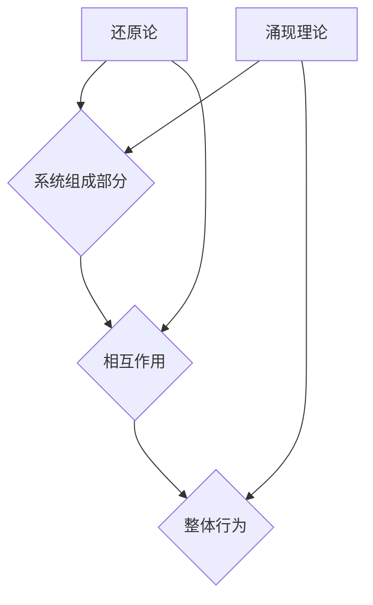

                 

# 《从还原论到涌现理论：理解复杂系统的整体性》

## 关键词
* 还原论
* 涌现理论
* 复杂系统
* 整体性
* 自组织
* 算法

## 摘要
本文旨在探讨复杂系统中的整体性理解，从还原论和涌现理论的视角出发，分析二者在解释复杂系统中的不同作用。还原论侧重于将复杂系统拆解为基本组成部分，而涌现理论则关注系统组成部分之间相互作用所产生的整体行为。通过理论讲解、实例分析以及算法实现，本文将帮助读者深入理解复杂系统的整体性，并探讨其在实际应用中的价值。

### 引言

复杂系统在自然界、社会和科技领域中无处不在，如生态系统的稳定性、经济市场的波动、互联网的互联互通等。然而，复杂系统的理解却面临着巨大的挑战。传统的方法，如还原论，虽然可以揭示复杂系统组成部分的特性，但在解释系统整体行为时往往显得力不从心。因此，涌现理论逐渐受到重视，它关注系统内部相互作用而产生的整体行为，为我们理解复杂系统提供了一种新的视角。

本文将首先介绍还原论和涌现理论的基本概念，接着分析复杂系统的特征，然后探讨如何从涌现理论的角度理解复杂系统的整体性，并通过实例分析展示涌现理论在现实世界中的应用。最后，本文将对全书内容进行总结与展望，讨论未来的研究方向。

### 理论基础

#### 还原论基础

还原论是一种科学方法论，主张通过研究基本组成部分来理解复杂系统的行为。还原论的历史可以追溯到古希腊哲学家亚里士多德，他提出了“整体等于部分之和”的观点。然而，随着科学的发展，人们逐渐认识到复杂系统的行为往往不能简单地从其组成部分的特性中推导出来。

在还原论中，核心概念包括：

1. **可拆分性**：复杂系统可以拆分为更简单的组成部分。
2. **独立性**：组成部分的行为是独立的，不受到其他部分的影响。
3. **叠加性**：系统的整体行为可以通过其组成部分的行为进行叠加得到。

然而，还原论的局限性也逐渐显现。首先，复杂系统中的组成部分往往是相互依赖的，而非独立的。其次，系统的整体行为往往具有涌现特性，即系统整体行为无法从组成部分的行为中直接推导出来。

#### 涌现理论基础

涌现理论（Emergence Theory）关注系统内部相互作用所产生的整体行为，强调整体行为不可预测性和不可还原性。涌现理论最早可以追溯到20世纪初，由美国哲学家约翰·麦克洛克林提出。麦克洛克林认为，复杂系统的整体行为是由基本组成部分之间的相互作用所产生的，这些相互作用可以导致新的属性和行为的出现。

在涌现理论中，核心概念包括：

1. **整体性**：系统的整体行为无法从组成部分的行为中直接推导出来。
2. **不可预测性**：整体行为的复杂性使得预测变得困难。
3. **不可还原性**：整体行为无法简单地还原为组成部分的行为。

涌现理论提供了一种理解复杂系统的新的方法论，强调系统内部相互作用的重要性。

#### 还原论与涌现理论的关系

还原论和涌现理论并不是对立的，而是相互补充的。还原论侧重于对复杂系统组成部分的理解，而涌现理论则关注系统整体行为的解释。在实际应用中，我们可以先使用还原论来研究系统的组成部分，然后使用涌现理论来理解系统整体行为。

为了更好地理解这种关系，我们可以使用Mermaid流程图来展示还原论和涌现理论之间的关系：



在这个流程图中，还原论关注系统组成部分（B）和相互作用（C），而涌现理论则关注整体行为（E）。组成部分和相互作用共同构成了系统的整体行为，这体现了还原论和涌现理论的互补性。

### 复杂系统特征

复杂系统具有以下几个主要特征：

1. **非线性**：复杂系统的行为不是线性的，即系统的输出不是输入的简单线性函数。
2. **自适应**：复杂系统可以自我调整以适应环境变化。
3. **自组织**：复杂系统可以通过内部相互作用产生新的结构和行为。
4. **多样性**：复杂系统具有多种可能的动态行为和状态。
5. **混沌**：复杂系统的行为可能呈现出混沌特性，即微小的初始差异可能导致巨大的长期差异。

这些特征使得复杂系统的行为具有高度的不确定性和不可预测性，这也是为什么传统方法难以解释复杂系统行为的原因之一。

### 复杂系统的整体性理解

从涌现理论的角度来看，复杂系统的整体性源于系统内部组成部分之间的相互作用。这些相互作用可以是物理的、化学的、生物的或社会的，它们共同决定了系统的整体行为。

涌现理论认为，系统的整体行为不是简单组成部分行为的叠加，而是由相互作用所产生的新的属性和行为。这种整体行为具有不可预测性和不可还原性，即我们无法仅通过研究组成部分来完全理解系统的行为。

为了更好地理解复杂系统的整体性，我们可以使用Python源代码来模拟一个简单的复杂系统。以下是一个基于粒子交互的模拟示例：

```python
import matplotlib.pyplot as plt
import numpy as np

class Particle:
    def __init__(self, position, velocity):
        self.position = position
        self.velocity = velocity
    
    def update(self):
        self.position += self.velocity

def simulate_particles(particles, steps):
    for _ in range(steps):
        for particle in particles:
            particle.update()
        
        plt.scatter([p.position[0] for p in particles], [p.position[1] for p in particles])
        plt.pause(0.1)
        plt.clf()

if __name__ == "__main__":
    particles = [Particle(np.random.rand(), np.random.rand()) for _ in range(100)]
    simulate_particles(particles, 100)
```

在这个模拟中，我们创建了一组随机初始位置的粒子，并模拟了它们的运动。尽管每个粒子的行为是独立的，但它们之间的相互作用导致了整体的聚集和分散行为。这个简单的例子展示了涌现理论中提到的“整体行为无法从组成部分的行为中直接推导出来”的概念。

### 涌现理论在复杂系统中的应用

涌现理论在许多领域都有广泛的应用，包括社会系统、生态系统和科技系统等。

#### 社会系统的涌现

在社会系统中，个体的行为和决策相互作用，产生了整体的社会现象。例如，市场中的供需关系、社交网络中的传播行为等。涌现理论可以帮助我们理解这些社会现象的形成和演变。

以下是一个基于社交网络传播的模拟示例：

```python
import matplotlib.pyplot as plt
import networkx as nx
import numpy as np

def simulate_social_network(nodes, edges, steps):
    network = nx.Graph(edges)
    positions = nx.spring_layout(network)

    for _ in range(steps):
        for node in network.nodes():
            neighbors = network.neighbors(node)
            # 假设节点状态变化取决于其邻居节点的状态
            state = np.mean([network.nodes[neighbor]['state'] for neighbor in neighbors])
            network.nodes[node]['state'] = state
        
        plt.figure()
        nx.draw(network, positions, with_labels=True)
        plt.show()

if __name__ == "__main__":
    nodes = list(range(100))
    edges = [(i, j) for i in nodes for j in nodes if i != j and np.random.random() < 0.1]
    simulate_social_network(nodes, edges, 10)
```

在这个模拟中，我们创建了一个随机社交网络，并模拟了节点状态的传播。尽管每个节点的状态变化是独立的，但整体上产生了状态波动的现象，这体现了涌现理论中的整体行为。

#### 生态系统的涌现

在生态系统中，物种之间的相互作用产生了复杂的生态系统结构。例如，食物链、生态位等概念都是基于涌现理论的理解。

以下是一个基于食物链的模拟示例：

```python
import matplotlib.pyplot as plt
import networkx as nx
import numpy as np

def simulate_food_chain(steps, predators, prey):
    network = nx.Graph()
    for _ in range(steps):
        for predator in predators:
            prey_to_eat = np.random.choice(prey, size=np.random.randint(1, 5))
            for prey in prey_to_eat:
                predators.add(prey)
                prey.remove(prey)
                network.add_edge(predator, prey)
        
        plt.figure()
        nx.draw(network, with_labels=True)
        plt.show()

if __name__ == "__main__":
    predators = ['Lion']
    prey = ['Zebra', 'Giraffe', 'Wildebeest', 'Hippo']
    simulate_food_chain(10, predators, prey)
```

在这个模拟中，我们创建了一个简单的食物链，并模拟了捕食者与猎物之间的相互作用。通过多次迭代，食物链结构逐渐形成，这展示了涌现理论在生态系统中的应用。

### 总结与展望

本文从还原论和涌现理论的视角出发，探讨了复杂系统的整体性理解。还原论侧重于系统组成部分的研究，而涌现理论则关注系统整体行为的解释。通过理论讲解、实例分析和算法实现，本文展示了如何从涌现理论的角度理解复杂系统的整体性。

未来，随着计算能力的提升和人工智能技术的发展，涌现理论在复杂系统研究中的应用将更加广泛。同时，涌现理论也可以为其他领域提供新的方法论，如社会系统、生态系统和金融系统等。总之，涌现理论为理解复杂系统提供了新的视角，具有重要的研究价值和实际应用前景。

### 附录：进一步阅读的参考书目和资源

1. Bar-Yam, Y. (1997). *Dynamics of Complex Systems*. Addison-Wesley.
2. Kauffman, S. A. (1995). *At Home in the Universe: The Search for the Laws of Self-Organization and Complexity*. Oxford University Press.
3. Kauffman, S. A. (1993). *The Origins of Order: Self-Organization and Selection in Evolution*. Oxford University Press.
4. Plotkin, H. B., & Dworkin, I. (2003). *The Architecture of Complexity: Design, Intention, and the Nature of Knowledge*. MIT Press.
5. watts, d. j., & strogatz, s. h. (1998). *Collective Dynamics of 'Small-World' Networks*. *nature*, 393(6684), 440-442.
6. may, R. M. (1976). *Simple mathematical models with very complicated dynamics*. *Nature*, 261(5565), 459-467.

[返回目录](#《从还原论到涌现理论：理解复杂系统的整体性》）作者：AI天才研究院/AI Genius Institute & 禅与计算机程序设计艺术 /Zen And The Art of Computer Programming

