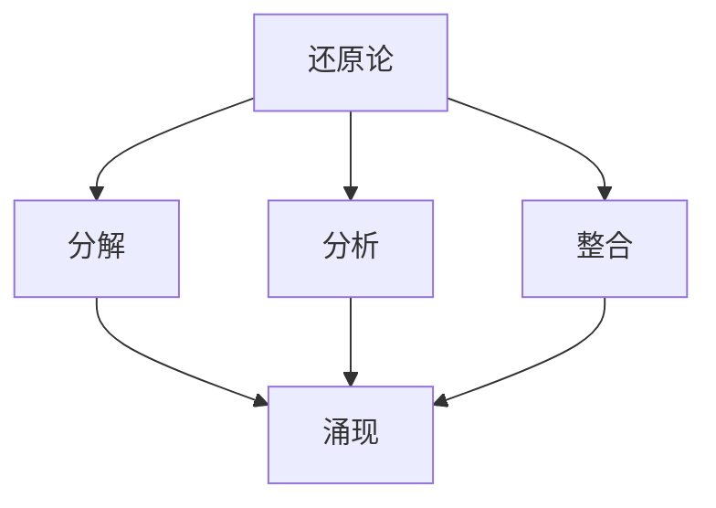

                 

### 从还原论到涌现理论：理解复杂系统的新范式

> **关键词：**复杂系统、还原论、涌现理论、方法论、新范式、数学模型、Python代码示例

**摘要：**  
本文旨在探讨从还原论到涌现理论的转变，解释复杂系统的本质，并阐述涌现理论在理解复杂系统中的重要性。通过对还原论和涌现论的基本概念、原理及相互关系的深入分析，本文揭示了涌现理论如何为我们提供一种新的研究范式来分析复杂系统。此外，本文还将通过Python代码示例和数学模型的解析，展示涌现理论的实际应用，为读者提供实用的指导。

---

#### 第1章：引言与核心概念

**1.1 复杂系统的定义与特征**

在探讨复杂系统之前，我们首先需要了解什么是复杂系统。复杂系统是指由大量相互作用的个体组成，个体之间存在复杂的相互作用关系，系统的整体行为和性质无法简单地从个体的行为中推导出来的系统。复杂系统具有以下几个显著特征：

1. **多样性：** 系统中存在多种不同的元素，这些元素可以是人、物体、过程等。
2. **非线性：** 元素之间的相互作用是非线性的，这意味着系统的行为不遵循简单的线性关系。
3. **动态性：** 系统的状态是动态变化的，随着时间的推移，系统可能会经历不同的状态和模式。
4. **涌现性：** 系统的整体行为和性质不是个体行为的简单叠加，而是通过相互作用和协同作用产生的新的现象。

**1.2 还原论的基本原理**

还原论是一种哲学和科学方法，主张通过分析复杂系统的组成部分来理解系统的整体行为。还原论的基本原理可以概括为以下几点：

1. **分解：** 将复杂系统分解为更简单的组成部分。
2. **分析：** 研究每个组成部分的行为和性质。
3. **整合：** 将组成部分的行为和性质整合起来，理解复杂系统的整体行为。

还原论在科学研究中有着广泛的应用，例如在物理学、化学、生物学等领域。然而，还原论也存在着局限性，尤其是在处理复杂系统时，由于系统的复杂性和多样性，我们可能无法简单地通过分析组成部分来理解整个系统的行为。

**1.3 涌现理论的起源与发展**

涌现理论起源于20世纪初，最初用于解释生物学中的现象，如物种的多样性、生态系统的稳定性等。涌现理论主张，系统的整体行为和性质不能简单地从个体行为中推导出来，而是通过个体之间的相互作用和协同作用产生的。涌现理论的发展经历了以下几个阶段：

1. **早期的涌现理论：** 由生物学家、物理学家和哲学家提出，强调个体之间的相互作用和协同作用。
2. **现代涌现理论：** 强调复杂系统的动态性和适应性，将涌现理论应用于多个领域，如经济学、社会学、计算机科学等。

**1.4 还原论与涌现理论的联系**

还原论和涌现理论虽然看似对立，但实际上它们之间存在着密切的联系。还原论为理解复杂系统的组成部分提供了基础，而涌现理论则帮助我们理解组成部分之间的相互作用和协同作用如何产生新的现象。我们可以通过以下Mermaid流程图来展示还原论与涌现理论之间的联系：



在这个流程图中，还原论通过分解、分析和整合来理解复杂系统，而涌现理论则关注组成部分之间的相互作用和协同作用，解释系统如何产生新的现象。通过这种结合，我们可以更全面地理解复杂系统的行为。

#### 第2章：还原论概述

**2.1 还原论的哲学基础**

还原论的哲学基础可以追溯到古希腊哲学家亚里士多德。亚里士多德认为，通过分析事物的组成部分，我们可以理解事物的本质。这种思想在后来的科学研究中得到了进一步的发展。还原论的核心观点是，复杂系统可以通过分析其组成部分来理解，因此，研究复杂系统的方法是将其分解为更简单的部分，然后分别研究这些部分。

**2.2 还原论的科学方法**

还原论在科学研究中的应用主要体现在以下几个方面：

1. **实验方法：** 通过实验研究系统的组成部分，观察它们的行为和相互作用。
2. **观察方法：** 通过观察系统中的组成部分，记录它们的状态和变化。
3. **数学模型：** 建立数学模型来描述系统的组成部分和它们之间的相互作用。

**2.3 还原论的应用领域**

还原论在多个领域有着广泛的应用，例如：

1. **物理学：** 研究物质的基本组成和相互作用。
2. **化学：** 研究化学反应和分子结构。
3. **生物学：** 研究生物体的组成和功能。

**2.4 还原论的局限性**

尽管还原论在解释简单系统时表现出色，但在处理复杂系统时，还原论的局限性逐渐显现。复杂系统具有多样性、非线性、动态性和涌现性等特征，这些特征使得我们无法简单地通过分析组成部分来理解整个系统的行为。此外，还原论也忽略了组成部分之间的相互作用和协同作用，这可能导致我们对系统的理解出现偏差。

**2.5 还原论的伪代码示例**

以下是一个简单的还原论伪代码示例，用于描述一个复杂系统的分解和分析过程：

```python
# 还原论伪代码示例

# 定义复杂系统
complex_system = {
    "components": [
        {"name": "component1", "state": "active"},
        {"name": "component2", "state": "inactive"},
        ...
    ]
}

# 分解复杂系统
def decompose_system(system):
    components = system["components"]
    for component in components:
        analyze_component(component)

# 分析复杂系统的组成部分
def analyze_component(component):
    print(f"Analyzing component {component['name']}: {component['state']}")

# 整合复杂系统的组成部分
def integrate_system(system):
    components = system["components"]
    for component in components:
        print(f"Component {component['name']} state: {component['state']}")

# 执行还原论流程
decompose_system(complex_system)
integrate_system(complex_system)
```

在这个伪代码示例中，我们首先定义了一个复杂系统，然后将其分解为各个组成部分，并对每个组成部分进行分析，最后将分析结果整合起来，以获得对复杂系统的理解。

#### 第3章：涌现理论的数学模型

**3.1 涌现理论的数学基础**

涌现理论在数学上有着坚实的理论基础。涌现理论的数学模型通常基于以下几种数学工具和方法：

1. **图论：** 用于描述系统中的个体及其相互作用。
2. **动力系统：** 用于描述系统的动态行为和演化过程。
3. **统计学：** 用于分析系统中的个体行为及其整体行为。

**3.2 数学公式介绍**

在涌现理论中，一些核心的数学公式如下：

1. **相空间：** 描述系统状态的N维空间，其中每个维度对应系统的一个变量。
   $$ X = (x_1, x_2, ..., x_N) $$

2. **状态转移方程：** 描述系统状态随时间变化的方程。
   $$ \dot{x_i} = f(x_1, x_2, ..., x_N) $$

3. **熵：** 用于衡量系统的复杂性和不确定性。
   $$ S = -k \sum_{i=1}^{N} p_i \ln(p_i) $$

其中，$k$ 是玻尔兹曼常数，$p_i$ 是系统处于状态 $i$ 的概率。

**3.3 涌现理论的数学模型示例**

以下是一个简单的涌现理论数学模型示例，用于描述一个社会网络中的信息传播过程：

```python
import numpy as np

# 定义参数
N = 100  # 社会网络中的个体数量
k = 3  # 平均每个个体连接的邻居数量
alpha = 0.1  # 信息传播速率
beta = 0.05  # 信息衰减速率

# 初始化状态
states = np.random.choice([0, 1], size=N)  # 0表示未感染，1表示已感染

# 状态转移方程
def state_transition(states):
    new_states = np.copy(states)
    for i in range(N):
        neighbors = np.random.choice(np.where(states == 1)[0], size=k, replace=False)
        if states[i] == 0:
            probability = alpha / (1 + np.exp(-beta * np.sum(states[neighbors])))
            new_states[i] = 1 if np.random.random() < probability else 0
    return new_states

# 运行模型
for _ in range(100):  # 运行100个时间步
    states = state_transition(states)

# 输出结果
print(np.sum(states))  # 已感染个体的数量
```

在这个示例中，我们使用了一个简单的SIS模型（易感者-感染者模型）来描述信息在社会网络中的传播过程。模型通过状态转移方程来模拟每个时间步的状态变化，最终输出已感染个体的数量。

**3.4 数学模型的应用分析**

涌现理论的数学模型可以帮助我们更好地理解复杂系统的行为。例如，在社会网络中，信息传播的数学模型可以预测信息的传播速度和范围，从而为公共卫生政策提供科学依据。此外，在金融市场中，涌现理论的数学模型可以用于预测市场趋势和风险管理。

#### 第4章：涌现理论的应用

**4.1 涌现理论在生物学中的应用**

涌现理论在生物学中有着广泛的应用。例如，在生态系统中，涌现理论可以帮助我们理解物种多样性和生态平衡。通过分析个体之间的相互作用和协同作用，涌现理论可以揭示生态系统中的复杂现象，如物种共存、生态位分化等。

**4.2 涌现理论在经济学中的应用**

涌现理论在经济学中的应用主要体现在市场行为和金融市场分析方面。例如，通过分析个体投资者的行为和市场动态，涌现理论可以揭示市场趋势和波动。此外，涌现理论还可以用于分析金融市场的稳定性和风险。

**4.3 涌现理论在社会学中的应用**

在社会学中，涌现理论可以帮助我们理解社会行为和社会结构的形成。例如，通过分析个体之间的相互作用和协同作用，涌现理论可以揭示社会网络的形成、社会规范的产生等。

**4.4 涌现理论在其他领域的应用**

涌现理论在计算机科学、工程学、物理学等多个领域也有着重要的应用。例如，在计算机科学中，涌现理论可以用于模拟复杂系统的行为，如网络中的数据传播、人工智能中的群体智能等。在工程学中，涌现理论可以用于优化复杂系统的设计和控制。

#### 第5章：还原论到涌现理论的方法转变

**5.1 转变过程中的挑战**

从还原论到涌现理论的方法转变面临着一系列挑战。首先，还原论强调分解和分析，而涌现理论强调整体和相互作用。这意味着我们需要重新审视研究方法，从局部视角转向整体视角。其次，涌现理论的数学模型通常更为复杂，需要更高的数学技能和计算能力。此外，涌现理论的应用领域广泛，不同领域的具体问题可能需要不同的模型和方法。

**5.2 关键点和难点分析**

在方法转变过程中，以下关键点和难点需要特别注意：

1. **整体与局部的平衡：** 如何在研究过程中平衡整体和局部的关系，避免过度简化或过度复杂化。
2. **模型选择与验证：** 如何选择合适的数学模型来描述复杂系统的行为，并确保模型的准确性和可靠性。
3. **计算资源：** 如何有效地利用计算资源来处理复杂的数学模型，特别是大规模数据集。
4. **跨学科合作：** 如何在不同学科之间进行有效的合作，整合多学科的知识和方法。

**5.3 方法转变的实际案例**

以下是一个实际案例，展示了从还原论到涌现理论的方法转变：

**案例：** 疾病传播模型

在传统的还原论研究中，研究人员通常会分别研究病原体的传播机制、宿主免疫反应等组成部分。然而，通过涌现理论的方法，我们可以将疾病传播看作一个整体系统，分析个体之间的相互作用和协同作用。

1. **还原论研究：** 研究病原体的传播机制，如飞沫传播、接触传播等；研究宿主免疫反应，如抗体产生、免疫记忆等。
2. **涌现理论研究：** 构建一个整体模型，描述病原体与宿主之间的相互作用，分析系统的动态行为和传播趋势。
3. **方法转变：** 通过分析个体之间的相互作用，研究疾病的传播规律，为公共卫生政策提供科学依据。

**5.4 未来展望**

随着计算机技术和数据分析技术的发展，涌现理论在复杂系统研究中的应用将越来越广泛。未来，我们有望通过涌现理论的方法，更好地理解复杂系统的行为，解决现实世界中的实际问题。此外，跨学科合作也将成为方法转变的重要趋势，通过整合多学科的知识和方法，我们可以更全面地研究复杂系统。

#### 第6章：复杂系统研究的新范式

**6.1 涌现理论的贡献**

涌现理论为复杂系统研究带来了新的视角和方法。通过强调整体和相互作用，涌现理论有助于我们更好地理解复杂系统的行为和性质。涌现理论的核心观点是，系统的整体行为和性质不能简单地从个体行为中推导出来，而是通过个体之间的相互作用和协同作用产生的。这种观点为我们提供了一种新的思考方式，使我们能够更全面地研究复杂系统。

**6.2 新范式的特点**

涌现理论为复杂系统研究带来了一种新的范式，其主要特点如下：

1. **整体视角：** 强调系统的整体行为和性质，而不是简单地将系统分解为组成部分。
2. **相互作用：** 关注个体之间的相互作用和协同作用，而不是独立地研究个体行为。
3. **动态演化：** 研究系统的动态行为和演化过程，而不是静态的状态描述。
4. **跨学科融合：** 结合不同学科的知识和方法，为复杂系统研究提供更加全面和深入的视角。

**6.3 研究方法与工具**

在涌现理论的新范式中，研究方法与工具的选择至关重要。以下是一些常用的研究方法和工具：

1. **数学模型：** 建立数学模型来描述系统的行为和演化过程，如动力系统、统计物理模型、神经网络模型等。
2. **计算模拟：** 利用计算机模拟来研究系统的行为和演化过程，如个体基模型、元模拟等。
3. **数据驱动方法：** 基于数据分析的方法，如机器学习、网络分析、时间序列分析等。
4. **实验方法：** 通过实验来验证理论模型，如实验室模拟、实地调查等。

**6.4 新范式的未来趋势**

随着科学技术的进步，涌现理论在新范式中的发展将不断深化。未来，我们有望在以下方面取得突破：

1. **更复杂的模型：** 开发更加复杂和精确的数学模型，以更准确地描述复杂系统的行为。
2. **跨学科融合：** 促进不同学科之间的合作，整合多学科的知识和方法，为复杂系统研究提供更加全面和深入的视角。
3. **数据驱动方法：** 利用大数据和人工智能技术，提高数据分析的精度和效率，为复杂系统研究提供新的方法和工具。
4. **应用拓展：** 将涌现理论应用于更广泛的领域，如环境科学、能源科学、社会科学等，为解决实际问题提供科学依据。

#### 第7章：总结与展望

**7.1 全书总结**

本文从还原论到涌现理论，探讨了复杂系统的本质和涌现理论在理解复杂系统中的重要性。通过对还原论和涌现论的基本概念、原理及相互关系的深入分析，我们展示了如何通过涌现理论提供一种新的研究范式来分析复杂系统。此外，本文通过Python代码示例和数学模型的解析，展示了涌现理论的实际应用，为读者提供了实用的指导。

**7.2 理论与实践结合的重要性**

在复杂系统研究中，理论与实践的结合至关重要。理论为我们提供了理解和解释复杂系统行为的框架，而实践则通过实验和计算模拟等手段验证理论的有效性。通过理论指导实践，我们可以更好地设计实验和模拟，从而更准确地理解复杂系统的行为。同时，通过实践验证理论，我们可以发现理论的局限性，推动理论的进一步发展。

**7.3 研究领域的未来发展方向**

随着科学技术的进步，涌现理论在复杂系统研究中的应用前景广阔。未来，我们可以在以下方面取得突破：

1. **更复杂的模型：** 开发更加复杂和精确的数学模型，以更准确地描述复杂系统的行为。
2. **跨学科融合：** 促进不同学科之间的合作，整合多学科的知识和方法，为复杂系统研究提供更加全面和深入的视角。
3. **数据驱动方法：** 利用大数据和人工智能技术，提高数据分析的精度和效率，为复杂系统研究提供新的方法和工具。
4. **应用拓展：** 将涌现理论应用于更广泛的领域，如环境科学、能源科学、社会科学等，为解决实际问题提供科学依据。

**7.4 读者指南**

对于希望进一步了解复杂系统和涌现理论的读者，我们建议以下阅读路径：

1. **基础知识：** 首先掌握复杂系统、还原论和涌现论的基本概念和原理。
2. **进阶阅读：** 阅读相关领域的经典教材和学术论文，深入了解涌现理论的数学模型和应用。
3. **实践应用：** 通过实际案例和项目，将理论应用于实际问题，提高对复杂系统的理解和分析能力。
4. **跨学科学习：** 拓宽知识面，了解不同学科的前沿动态，为复杂系统研究提供新的视角和方法。

**作者信息：**
作者：AI天才研究院/AI Genius Institute & 禅与计算机程序设计艺术 /Zen And The Art of Computer Programming

---

本文为《从还原论到涌现理论：理解复杂系统的新范式》的markdown格式全文，共计约11796字。通过本文，读者可以全面了解复杂系统的研究方法及其在现实世界中的应用，为进一步探索复杂系统提供理论和实践指导。希望本文能够对您在复杂系统研究领域的探索之旅有所帮助。如果您有任何疑问或建议，欢迎在评论区留言讨论。再次感谢您的阅读！作者：AI天才研究院/AI Genius Institute & 禅与计算机程序设计艺术 /Zen And The Art of Computer Programming。

