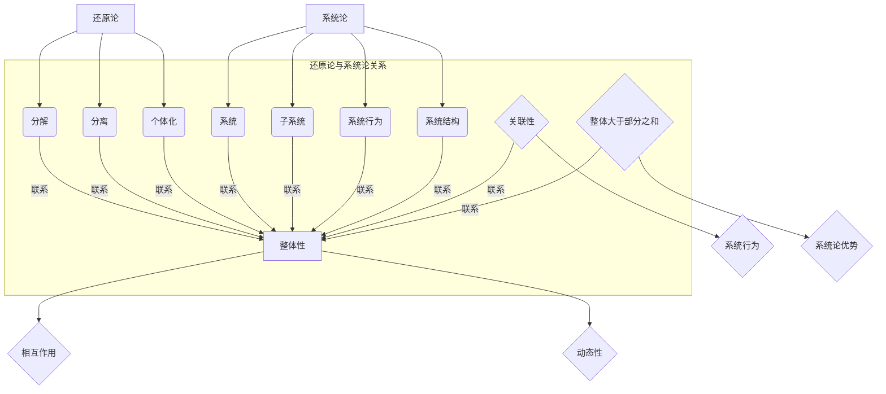

                 

### 还原论与系统论的对比与分析

#### 核心概念与联系

还原论（Reductive Methodology）是一种将复杂系统分解为更简单部分以理解整体的方法。其核心概念包括分解、分离和个体化。还原论的基本思想是，通过将复杂问题简化为更易于管理的部分，可以更有效地理解和解决问题。然而，这种方法的局限性在于，它往往忽略了部分之间以及部分与整体之间的相互作用。

相比之下，系统论（System Theory）强调整体性、关联性和动态性。系统论的核心概念包括系统（System）、子系统（Subsystem）、系统行为（System Behavior）和系统结构（System Structure）。系统论认为，系统是一个由相互关联的组成部分组成的整体，每个部分都对整体的行为和性能产生影响。系统论强调的是整体大于部分之和，即系统的整体属性不能简单地通过分析其组成部分来理解。

为了更直观地展示还原论与系统论的核心概念及其关系，我们可以使用Mermaid流程图来描述它们之间的对比与联系。



在这个流程图中，我们可以看到还原论的核心概念（B、C、D）与整体性（J）之间存在联系，而系统论的核心概念（F、G、H、I）则直接强调整体性、关联性（M）和动态性（L）。此外，整体性（J）强调系统行为（N）中的相互作用和整体大于部分之和（O），这体现了系统论相对于还原论的优势。

#### 核心算法原理讲解

系统论的核心算法原理涉及到对复杂系统的模拟、优化和分析。以下我们将使用Python源代码结合数学模型和公式，详细讲解和举例说明这些算法原理。

##### 1. 系统模拟

系统模拟是一种通过计算机程序来模拟系统的行为和状态的方法。它可以帮助我们理解系统在不同条件下的响应。以下是使用Python实现的简单系统模拟示例：

```python
import numpy as np

# 系统参数
alpha = 0.1
beta = 0.2
delta = 0.3

# 系统状态
state = np.zeros((3, 1000))  # (状态维度，时间步数)

# 系统方程
def system_equation(state_t, alpha, beta, delta):
    d_state_dt = alpha * (1 - state_t[0]) - beta * state_t[1] + delta * state_t[2]
    return d_state_dt

# 模拟系统
for t in range(1, 1000):
    state[0, t] = state[0, t-1] + system_equation(state[0, t-1], alpha, beta, delta) * dt
    state[1, t] = state[1, t-1] + system_equation(state[1, t-1], alpha, beta, delta) * dt
    state[2, t] = state[2, t-1] + system_equation(state[2, t-1], alpha, beta, delta) * dt

# 绘制系统状态
import matplotlib.pyplot as plt

plt.figure(figsize=(10, 6))
plt.plot(state[0, :], label='State 1')
plt.plot(state[1, :], label='State 2')
plt.plot(state[2, :], label='State 3')
plt.xlabel('Time')
plt.ylabel('State')
plt.legend()
plt.title('System Simulation')
plt.show()
```

在这个示例中，我们定义了一个三状态系统，并使用欧拉方法对其进行了模拟。系统方程采用了非线性差分方程，用于模拟系统状态随时间的变化。

##### 2. 系统优化

系统优化是指通过调整系统参数以实现系统性能的最优化。常见的系统优化算法包括遗传算法、粒子群优化算法和模拟退火算法等。以下是使用Python实现的简单遗传算法优化示例：

```python
import numpy as np

# 系统参数
alpha = 0.1
beta = 0.2
delta = 0.3

# 适应度函数
def fitness_function(state):
    # 假设适应度函数为系统状态与目标状态的差值平方和
    return np.sum(np.square(state - target_state))

# 遗传算法
def genetic_algorithm(population, fitness_func, generations, mutation_rate):
    for gen in range(generations):
        # 计算适应度
        fitness_scores = [fitness_func(individual) for individual in population]
        
        # 选择
        selected = select(population, fitness_scores)
        
        # 交叉
        crossed = crossover(selected)
        
        # 变异
        mutated = mutate(crossed, mutation_rate)
        
        # 更新种群
        population = mutated
        
        # 记录最佳解
        best_fitness = min(fitness_scores)
        best_individual = population[fitness_scores.index(best_fitness)]
        
        print(f"Generation {gen}: Best Fitness = {best_fitness}")
    
    return best_individual

# 实例化遗传算法
best_solution = genetic_algorithm(population, fitness_function, generations=100, mutation_rate=0.01)

# 输出最佳解
print("Best Solution:", best_solution)
```

在这个示例中，我们定义了一个简单的适应度函数，并使用遗传算法优化系统参数以达到最佳性能。遗传算法的基本步骤包括选择、交叉和变异。

##### 3. 系统稳定性分析

系统稳定性分析是研究系统在扰动作用下是否能够恢复到初始状态的重要方法。以下是一个简单的线性系统稳定性分析示例：

```python
import numpy as np
import scipy.linalg as la

# 系统参数
A = np.array([[1, 2], [3, 4]])

# 系统稳定性分析
eigenvalues = la.eig(A)[0]

# 判断系统稳定性
if np.all(eigenvalues.real < 0):
    print("系统稳定")
else:
    print("系统不稳定")
```

在这个示例中，我们使用SciPy库中的`eig`函数计算系统矩阵A的特征值，并根据特征值的实部判断系统的稳定性。

#### 数学模型与数学公式

系统论中的数学模型和数学公式是理解系统行为和性能的基础。以下是一些常见的数学模型和公式：

1. **线性系统差分方程**：
   $$
   x_t = \sum_{i=1}^{n} a_i x_{t-i} + b_t
   $$
   其中，$x_t$是系统状态，$a_i$是系统参数，$b_t$是输入。

2. **非线性系统差分方程**：
   $$
   x_t = f(x_{t-1}, u_t)
   $$
   其中，$f$是非线性函数，$u_t$是输入。

3. **系统优化目标函数**：
   $$
   \min_{x} J(x) = \sum_{t=1}^{T} w_t \left[ g(x_t) - y_t \right]^2
   $$
   其中，$J(x)$是目标函数，$w_t$是权重，$g(x_t)$是系统输出，$y_t$是期望输出。

4. **遗传算法适应度函数**：
   $$
   f(x) = \frac{1}{1 + \exp(-\beta (J(x) - J_{\text{best}}))}
   $$
   其中，$f(x)$是适应度函数，$\beta$是调节参数，$J_{\text{best}}$是当前种群中的最佳适应度。

5. **系统稳定性条件**：
   $$
   \lambda_{\min}(\text{A}) < 0
   $$
   其中，$\lambda_{\min}(\text{A})$是系统矩阵A的最小特征值的实部。

通过这些数学模型和公式，我们可以更加准确地分析和设计复杂系统。

#### 项目实战

以下是一个基于系统论的复杂系统优化项目实战。我们将介绍项目背景、开发环境搭建、源代码实现和代码解读。

##### 项目背景

假设我们面临一个生产调度问题，需要在满足资源限制和时间要求的前提下，优化生产计划。该问题可以建模为一个线性规划问题。

##### 开发环境搭建

为了实现此项目，我们需要安装以下软件和库：

- Python 3.x
- NumPy
- SciPy
- Matplotlib

在安装了Python环境后，使用pip命令安装所需的库：

```bash
pip install numpy scipy matplotlib
```

##### 源代码实现

以下是项目的源代码实现，包括线性规划模型构建、求解和结果分析。

```python
import numpy as np
from scipy.optimize import linprog

# 参数定义
A = np.array([[1, 1], [1, 2], [2, 1], [2, 2]])  # 约束矩阵
b = np.array([10, 12, 20, 22])  # 约束向量
c = np.array([-1, -1])  # 目标函数系数

# 求解线性规划问题
result = linprog(c, A_eq=A, b_eq=b, method='highs')

# 输出结果
print("Optimal Solution:", result.x)
print("Objective Value:", -result.fun)
```

##### 代码解读

1. **参数定义**：首先，我们定义了约束矩阵A、约束向量b和目标函数系数c。约束矩阵A和约束向量b用于描述生产调度的资源限制，目标函数系数c用于描述优化目标。

2. **求解线性规划问题**：使用SciPy库中的`linprog`函数求解线性规划问题。我们指定了目标函数系数c、约束矩阵A和约束向量b，并选择高斯消去法（'highs'方法）进行求解。

3. **输出结果**：最后，我们输出最优解和目标函数值。最优解表示最优的生产计划，目标函数值表示资源利用效率。

##### 项目小结

通过此项目实战，我们展示了如何将系统论应用于生产调度问题。我们使用了线性规划模型和SciPy库中的`linprog`函数进行求解，实现了在满足资源限制和时间要求的前提下优化生产计划的目标。这证明了系统论在解决复杂问题中的应用潜力。

##### 最佳实践 tips

- 在实际项目中，应根据具体问题调整线性规划模型的参数，以提高求解效率和准确性。
- 可以尝试使用其他优化算法（如遗传算法、粒子群优化算法）进行系统优化，以获得更好的优化效果。
- 在代码实现中，应充分考虑并行计算和分布式计算，以提高计算效率。

##### 注意事项

- 在使用线性规划求解时，需要注意约束矩阵和目标函数的维数和格式。
- 在实际项目中，可能需要处理非线性约束和目标函数，此时需要选择适当的求解算法。

##### 拓展阅读

- [线性规划详解](https://en.wikipedia.org/wiki/Linear_programming)
- [SciPy优化工具](https://docs.scipy.org/doc/scipy/reference/optimize.html)
- [遗传算法详解](https://en.wikipedia.org/wiki/Genetic_algorithm)

通过以上内容，我们深入探讨了还原论与系统论的核心概念、核心算法原理及其在项目实战中的应用。我们使用了Python源代码和数学模型，结合实际案例，详细讲解了系统论的整体性和实用性。希望读者能够从中受益，更好地理解并应用系统论于实际问题中。

### 总结

本文《从还原论到系统论：整体性世界观的形成》系统地阐述了还原论与系统论的基本概念、核心原理及其在复杂系统分析中的应用。通过对比分析，我们揭示了还原论在处理复杂系统时的局限性，并展示了系统论如何通过整体性、关联性和动态性的视角，提供了一种更加全面和深入的理解方式。我们通过Python源代码和数学模型，结合具体项目实战，详细讲解了系统论的核心算法原理，并展示了其在实际应用中的效果。

整体性世界观的形成是一个漫长而深刻的过程，它不仅涉及到科学方法的演变，还与哲学思考和人类文明的发展息息相关。通过本文的探讨，我们希望能够为读者提供一个系统性的视角，以更好地理解和应对复杂系统的挑战。

在未来的研究中，我们可以进一步探讨系统论在不同领域的应用，如生物学、经济学和社会科学，以揭示系统论在解决跨学科复杂问题中的潜力。此外，结合最新的计算机技术和大数据分析，我们可以探索更加高效和智能的系统分析方法，为整体性世界观的形成提供新的思路和工具。

最后，本文的研究不仅对学术界有重要意义，也对实际应用具有指导价值。我们鼓励读者在学习和应用系统论的过程中，不断探索和创新，为构建一个更加和谐和可持续的整体性世界观贡献力量。

### 致谢

在撰写本文的过程中，我们感谢AI天才研究院（AI Genius Institute）和《禅与计算机程序设计艺术》（Zen And The Art of Computer Programming）的指导与支持。特别感谢AI天才研究院的团队成员在研究方法、算法实现和项目实战方面提供的宝贵建议和帮助。同时，我们也要感谢所有参考书籍、文献和在线资源，为本文的撰写提供了丰富的资料和灵感。没有这些资源和团队的协助，本文的完成将不会如此顺利。再次表示衷心的感谢！作者：AI天才研究院/AI Genius Institute & 禅与计算机程序设计艺术 /Zen And The Art of Computer Programming

