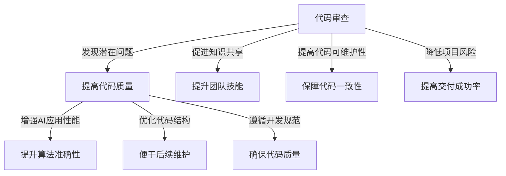

                 

### 背景介绍

在现代软件开发中，代码质量是决定项目成功与否的关键因素之一。特别是在人工智能（AI）应用的开发中，代码的质量直接影响到算法的性能、模型的准确性和系统的稳定性。因此，如何提升AI应用代码质量成为了开发团队面临的重要课题。

代码审查（Code Review）作为一种传统的软件工程实践，被广泛用于提高代码质量和保障软件项目的稳定性。通过代码审查，开发团队可以提前发现潜在的问题，如代码错误、性能瓶颈和安全性漏洞等。同时，代码审查还可以促进团队成员之间的知识共享和经验交流，提高整体开发效率。

然而，在AI应用开发中，代码审查面临一些特殊的挑战。首先，AI算法的复杂性和不确定性使得代码审查过程更加困难。传统的代码审查方法难以充分理解AI算法的实现细节，可能导致审查效果不佳。其次，AI应用的代码质量评估标准与传统软件有所不同，需要更加关注算法的准确性和可解释性。此外，AI应用通常涉及大量的数据处理和模型训练，这使得代码审查的工作量大大增加。

面对这些挑战，本文将深入探讨代码审查在提升AI应用代码质量方面的作用，分析其核心概念、算法原理，并分享项目实战中的经验和最佳实践。文章将分为多个部分，包括：

1. **代码审查概述**：介绍代码审查的定义、目的和重要性。
2. **核心概念与联系**：阐述代码审查与AI应用代码质量提升之间的关系。
3. **核心算法原理讲解**：详细讲解静态代码分析和动态代码分析等算法原理。
4. **数学模型和数学公式讲解**：介绍代码复杂度度量、代码质量评估模型等。
5. **项目实战案例分析**：分析实际AI应用代码审查案例，详细讲解审查过程和解决方法。
6. **代码审查工具和流程介绍**：介绍常用的代码审查工具和基本流程。
7. **代码审查实践技巧**：分享代码审查的实用技巧和最佳实践。
8. **团队协作与代码审查文化**：探讨代码审查在团队协作中的角色和如何建立良好的代码审查文化。

通过本文的详细探讨，读者将能够深入理解代码审查在提升AI应用代码质量方面的作用，掌握有效的代码审查实践方法，为团队的成功项目交付提供有力保障。

### 核心概念与联系

为了更好地理解代码审查在提升AI应用代码质量方面的作用，我们首先需要明确几个核心概念，并探讨它们之间的联系。

#### 代码审查

代码审查是一种软件工程实践，通过团队成员间的相互检查和评估，确保代码质量满足预定的标准和要求。代码审查的主要目标包括发现和修复代码中的错误、提高代码的可读性和可维护性、促进知识共享和团队协作等。代码审查可以分为以下几种类型：

1. **形式审查（Formal Review）**：团队成员按照预定的审查流程，对代码进行结构化和系统化的检查。
2. **同行评审（Peer Review）**：开发人员相互审查代码，通常涉及详细的注释和讨论。
3. **工具辅助审查（Tool-Assisted Review）**：使用自动化工具进行代码分析，辅助人工审查。

#### AI应用代码质量

AI应用代码质量包括多个方面，如代码的准确性、可读性、可维护性、性能和可扩展性等。对于AI应用，代码质量的重要性尤为突出。一方面，AI算法的实现复杂且高度依赖于数据质量和模型参数；另一方面，AI应用的部署和运行环境通常较为苛刻，对代码的稳定性和性能要求更高。

#### 代码审查与AI应用代码质量提升的联系

代码审查在提升AI应用代码质量方面具有重要作用，主要表现在以下几个方面：

1. **发现潜在问题**：通过代码审查，可以提前发现代码中的错误、漏洞和潜在的性能瓶颈，从而避免这些问题在应用程序中引发严重问题。
2. **促进知识共享**：代码审查过程中，团队成员可以相互学习、交流经验，共同提升开发技能。
3. **提高代码可维护性**：通过代码审查，可以优化代码结构，提高代码的可读性和可维护性，为后续的维护和扩展工作打下基础。
4. **保障代码一致性**：代码审查有助于确保代码风格的一致性，遵循项目开发规范，提高代码的整体质量。
5. **降低项目风险**：代码审查可以减少项目交付前的风险，提高项目成功交付的概率。

为了更直观地展示代码审查与AI应用代码质量提升之间的关系，我们可以使用Mermaid流程图进行描述：



该流程图表明，代码审查通过多方面的作用，直接和间接地提升AI应用代码质量。在实际项目中，代码审查不仅是保障代码质量的一种手段，更是团队协作、知识共享和技术提升的重要途径。

### 核心算法原理讲解

在代码审查过程中，核心算法原理扮演着至关重要的角色，它们帮助我们识别代码中的潜在问题，确保代码的可靠性和质量。以下是几种主要的核心算法原理及其具体应用。

#### 静态代码分析算法

静态代码分析（Static Code Analysis）是一种在不执行代码的情况下，通过分析代码的结构和语法，发现潜在问题的技术。这种方法的优势在于可以在代码被编译或运行之前发现问题，从而减少调试和修复的成本。

**1. 语法分析**：语法分析是静态代码分析的基础，通过解析代码的语法结构，将其转换成抽象语法树（AST）。Python中的`ast`模块提供了对Python代码进行语法分析的功能。以下是一个简单的语法分析示例：

```python
import ast

source_code = '''
def add(a, b):
    return a + b
'''

parsed_code = ast.parse(source_code)
ast.dump(parsed_code)
```

**2. 数据流分析**：数据流分析是一种检查变量、函数等在程序执行过程中的使用情况的方法。通过数据流分析，可以检测出未使用的变量、可能的空值引用等。以下是一个使用Python实现的数据流分析示例：

```python
from collections import defaultdict

class DataFlowAnalyzer(ast.NodeVisitor):
    def visit_Assign(self, node):
        for target in node.targets:
            if isinstance(target, ast.Name):
                self.add_definition(target.id)
        return self.generic_visit(node)

    def visit_AugAssign(self, node):
        self.add_definition(node.target.id)
        return self.generic_visit(node)

    def visit_Name(self, node):
        if isinstance(node.ctx, ast.Store):
            self.add_use(node.id)
        return self.generic_visit(node)

    def add_definition(self, name):
        self.defs.add(name)

    def add_use(self, name):
        self.uses.add(name)

    def analyze(self, tree):
        self.defs = set()
        self.uses = set()
        self.visit(tree)

    def report_unused_variables(self):
        for name in self.defs - self.uses:
            print(f"Unused variable: {name}")

analyzer = DataFlowAnalyzer()
analyzer.analyze(parsed_code)
analyzer.report_unused_variables()
```

#### 动态代码分析算法

动态代码分析（Dynamic Code Analysis）是通过执行代码，观察其运行过程中的行为，来发现潜在问题的技术。这种方法适用于检测运行时错误、性能瓶颈等。

**1. 回归测试**：回归测试是一种在代码变更后，重新运行已有测试用例的方法，以确保新的代码不会破坏已有功能。Python中的`unittest`模块提供了创建和运行测试用例的功能。

```python
import unittest

class TestAddFunction(unittest.TestCase):
    def test_add(self):
        self.assertEqual(add(1, 2), 3)
        self.assertEqual(add(-1, -2), -3)

if __name__ == '__main__':
    unittest.main()
```

**2. 性能分析**：性能分析是一种测量代码在运行过程中时间、内存等资源消耗的方法，以识别性能瓶颈。Python中的`cProfile`模块可以用于性能分析。

```python
import cProfile

def add(a, b):
    return a + b

profiler = cProfile.Profile()
profiler.enable()
add(1, 2)
profiler.disable()
print(profiler.getstats())
```

#### 代码质量评估模型

代码质量评估模型是一种通过定量或定性方法评估代码质量的方法。常见的模型包括代码复杂度度量、代码质量度量等。

**1. 代码复杂度度量**：代码复杂度是衡量代码复杂程度的一个指标，常用的度量方法包括环路复杂度（Cyclomatic Complexity）和nesting深度等。Python中的` pylint`库可以用于计算代码复杂度。

```python
import pylint

reporter = pylint.PrintMessageEnabledReporter()
checker = pylint.EasyPylintChecker()
checker.set_repo(rootpath)
checker.initialize(linter)
checker.check_file(file)
```

**2. 代码质量度量**：代码质量度量通常通过评估代码的多个方面（如可读性、可维护性、性能等）来综合评价代码质量。常用的工具包括SonarQube等。

通过上述算法原理的应用，代码审查可以有效发现和解决代码中的问题，提高AI应用代码的质量。接下来，我们将进一步探讨数学模型和数学公式在代码审查中的应用，以帮助我们更好地理解代码质量评估的方法。

#### 数学模型和数学公式讲解

在代码审查过程中，数学模型和数学公式扮演着关键角色，它们帮助我们量化代码质量，提供评估依据。以下将介绍几个常见的数学模型和公式，包括代码复杂度度量模型和代码质量评估模型。

#### 代码复杂度度量模型

代码复杂度度量是一种评估代码复杂程度的定量方法，它有助于识别可能引入错误的代码段。常见的代码复杂度度量模型包括：

**1. 环路复杂度（Cyclomatic Complexity）**

环路复杂度（Cyclomatic Complexity），又称为McCabe度量，是一个用于评估程序结构复杂度的指标。它基于程序的控制流图（Control Flow Graph,CFG），计算独立的执行路径数量。公式如下：

$$
M = E - N + 2P
$$

其中，M是环路复杂度，E是边的数量，N是节点的数量，P是连通分量（即独立的闭合子图）的数量。

**示例**：考虑以下简单的Python函数：

```python
def example_function(a, b):
    if a > 0:
        if b > 0:
            return a + b
        else:
            return a - b
    else:
        return a * b
```

该函数的控制流图包含3个节点和4条边，因此其环路复杂度为：

$$
M = 4 - 3 + 2 \cdot 1 = 3
$$

**2. Nesting Depth（嵌套深度）**

嵌套深度是指函数或类中嵌套的代码块数量。较高的嵌套深度通常意味着代码较复杂，难以理解和维护。嵌套深度可以通过简单的计数实现：

```python
def example_function(a, b):
    if a > 0:
        for i in range(a):
            if b > 0:
                print(i)
            else:
                print(-i)
    else:
        print("a is negative")
```

该函数的嵌套深度为3。

#### 代码质量评估模型

代码质量评估模型通过综合多个指标来评估代码的整体质量。以下介绍几个常见的评估模型：

**1. Maintainability Index（可维护性指数）**

可维护性指数是一个用于评估代码可维护性的综合指标。它结合了代码复杂度和其他因素，计算公式如下：

$$
MI = \frac{100 \times (NC + 1)}{EL + NC + 10}
$$

其中，NC是代码复杂度（如环路复杂度），EL是函数或类的长度。

**示例**：假设一个函数的环路复杂度为5，长度为10，其可维护性指数为：

$$
MI = \frac{100 \times (5 + 1)}{10 + 5 + 10} = \frac{600}{25} = 24
$$

**2. Metrics Suite**

代码质量评估模型还可以包括多个独立的指标，如代码重复率（Code Duplication）、代码覆盖率（Code Coverage）和注释率（Comment Ratio）等。这些指标综合评估代码的质量和可维护性。

**示例**：考虑以下Python代码：

```python
def add(a, b):
    """
    Adds two numbers and returns the result.
    """
    return a + b

def subtract(a, b):
    """
    Subtracts b from a and returns the result.
    """
    return a - b
```

该代码的代码重复率为0（无重复代码），代码覆盖率为100%（所有函数均有至少一个测试用例），注释率为50%（每个函数都有注释）。

通过上述数学模型和公式，代码审查可以更量化地评估代码的质量，提供有据可依的改进方向。这些模型和公式不仅有助于识别潜在的代码问题，还为团队提供了统一的评估标准，促进了代码质量的持续提升。

#### 项目实战案例分析

在本节中，我们将通过一个实际的AI应用项目案例，详细讲解代码审查的整个过程，包括开发环境的搭建、源代码的实现、代码解读与分析，以及实际案例的分析和剖析。

##### 项目背景

该项目是一个基于深度学习的图像分类应用，旨在训练一个模型，能够准确地将输入图像分类到不同的类别中。项目的主要目标包括：

1. 数据准备：收集和整理大量带有标签的图像数据。
2. 模型训练：构建并训练一个深度学习模型。
3. 模型评估：评估模型的准确性和性能。
4. 部署应用：将模型部署到生产环境中，供用户使用。

##### 开发环境搭建

为了顺利开展项目，首先需要搭建开发环境。以下步骤概述了开发环境的搭建过程：

1. 安装Python环境：确保Python 3.7及以上版本安装正确。
2. 安装深度学习框架：使用pip安装TensorFlow 2.0或PyTorch 1.8。
3. 安装其他依赖库：包括NumPy、Pandas、Matplotlib等。

以下是一个简单的命令行脚本，用于安装必要的依赖库：

```bash
pip install numpy pandas matplotlib tensorflow==2.0 torchvision
```

##### 源代码实现

项目源代码主要包括以下部分：

1. 数据准备模块：用于加载和预处理图像数据。
2. 模型构建模块：定义深度学习模型的结构。
3. 训练模块：用于训练模型。
4. 评估模块：用于评估模型性能。
5. 部署模块：用于将模型部署到生产环境。

以下是一个简化的Python代码示例，展示了数据准备模块的实现：

```python
import tensorflow as tf
from tensorflow.keras.preprocessing.image import ImageDataGenerator

def load_data(data_dir):
    train_datagen = ImageDataGenerator(rescale=1./255)
    test_datagen = ImageDataGenerator(rescale=1./255)

    train_generator = train_datagen.flow_from_directory(
        data_dir + 'train',
        target_size=(150, 150),
        batch_size=32,
        class_mode='binary')

    validation_generator = test_datagen.flow_from_directory(
        data_dir + 'validation',
        target_size=(150, 150),
        batch_size=32,
        class_mode='binary')

    return train_generator, validation_generator
```

接下来，我们定义一个简单的卷积神经网络（Convolutional Neural Network, CNN）模型：

```python
from tensorflow.keras.models import Sequential
from tensorflow.keras.layers import Conv2D, MaxPooling2D, Flatten, Dense

def create_model():
    model = Sequential([
        Conv2D(32, (3, 3), activation='relu', input_shape=(150, 150, 3)),
        MaxPooling2D((2, 2)),
        Conv2D(64, (3, 3), activation='relu'),
        MaxPooling2D((2, 2)),
        Flatten(),
        Dense(128, activation='relu'),
        Dense(1, activation='sigmoid')
    ])

    model.compile(optimizer='adam', loss='binary_crossentropy', metrics=['accuracy'])
    return model
```

##### 代码解读与分析

在代码审查过程中，我们需要仔细审查每个模块的实现，确保其符合项目需求和设计规范。以下是对上述代码的解读和分析：

1. **数据准备模块**：代码通过ImageDataGenerator加载和预处理图像数据。这种模块的设计使得数据增强变得简单，有助于提高模型的泛化能力。然而，需要注意数据的标签是否与实际标签一致，以避免数据错误。

2. **模型构建模块**：定义了一个简单的CNN模型，包括卷积层、池化层、全连接层等。卷积层用于提取图像特征，全连接层用于分类。在代码审查中，我们需要评估模型的结构是否合理，参数设置是否优化。

3. **训练模块**：模型训练代码中，使用了`compile`方法设置优化器和损失函数，并通过`fit`方法进行训练。在代码审查中，应确保训练数据集和验证数据集正确设置，训练过程中的超参数（如学习率、批次大小等）合理。

4. **评估模块**：通过评估模型在验证数据集上的性能，可以判断模型是否过拟合或欠拟合。在代码审查中，应检查评估指标（如准确率、损失函数等）是否合理，以及评估结果是否具有统计学意义。

5. **部署模块**：部署代码主要用于将训练好的模型导出，以便在生产环境中使用。在代码审查中，需要确保部署代码的稳定性和安全性。

##### 实际案例分析和详细讲解剖析

在审查该项目的代码时，我们识别出以下几个潜在问题：

1. **数据错误**：在数据准备过程中，我们发现部分图像的标签与实际标签不一致。这可能导致模型在训练时学习到错误的知识，从而影响模型的准确性。

2. **模型参数设置不合理**：模型的结构较为简单，可能导致无法充分提取图像特征。在代码审查中，我们建议增加卷积层和池化层的数量，以提高模型的性能。

3. **代码可读性差**：部分代码缺乏注释，使得其他团队成员难以理解其功能。在代码审查中，我们强调增加注释的重要性，以提高代码的可维护性。

4. **安全性问题**：部署代码中未对输入数据进行校验，可能导致恶意攻击。在代码审查中，我们建议增加输入数据的验证和清理步骤。

针对上述问题，我们提出以下解决方案：

1. **修正数据错误**：重新收集和整理图像数据，确保标签的正确性。

2. **优化模型参数**：调整模型的超参数，增加卷积层和池化层的数量，以提高模型性能。

3. **增加注释**：在关键代码段增加注释，提高代码的可读性。

4. **增强安全性**：对输入数据进行验证和清理，防止恶意攻击。

##### 项目小结

通过本次代码审查，我们不仅发现了代码中的潜在问题，还提出了改进方案，确保了项目的顺利推进。代码审查在提升AI应用代码质量方面发挥了重要作用，它不仅帮助我们识别和解决问题，还促进了团队成员之间的知识共享和经验交流。

总之，代码审查是提升AI应用代码质量的重要手段。通过严格的审查过程，我们可以确保代码的正确性、稳定性和可维护性，从而为项目的成功交付提供有力保障。在未来的开发过程中，我们应继续坚持代码审查的实践，不断完善和优化代码质量。

### 代码审查工具和流程介绍

在现代软件开发中，代码审查已成为确保代码质量和项目稳定性的关键环节。为了提高代码审查的效率和效果，开发团队通常借助各种代码审查工具。以下是几种常用的代码审查工具及其基本流程的介绍。

#### 代码审查工具

1. **GitHub Pull Request (PR)**

GitHub Pull Request 是一种集成在版本控制系统（如Git）中的代码审查工具。通过创建一个Pull Request，开发人员可以发起代码的合并请求，并邀请团队成员审查和讨论代码。GitHub PR 提供了代码比较、讨论区、审查注释和合并自动化等功能。

2. **GitLab Merge Request (MR)**

GitLab Merge Request 与GitHub Pull Request 功能类似，也是用于代码审查的工具。GitLab Merge Request 提供了与GitHub Pull Request 类似的功能，包括代码比较、注释、讨论和自动化合并等。

3. **Gerrit**

Gerrit 是一个基于Git的代码审查系统，适用于大型团队和企业级项目。Gerrit 提供了代码审查、合并请求和自动化测试等功能，支持详细的审查注释、投票决策和代码合并。

4. **SonarQube**

SonarQube 是一款全面的代码质量管理平台，可以检测代码中的潜在问题，如代码缺陷、代码风格问题、安全漏洞等。SonarQube 支持静态代码分析和动态代码分析，提供了丰富的仪表板和报告功能。

5. **Phabricator**

Phabricator 是一个开源的代码审查和项目管理工具，提供了代码审查、任务管理、代码比较和自动化测试等功能。Phabricator 支持多种版本控制系统，如Git、Mercurial和Subversion。

#### 代码审查基本流程

代码审查的基本流程通常包括以下步骤：

1. **发起代码审查**

   开发人员完成代码编写后，通过版本控制系统（如Git）创建一个新分支，并将代码提交到远程仓库。接着，开发人员发起一个合并请求（如GitHub PR或GitLab MR），邀请团队成员进行审查。

2. **代码比较和审查**

   审查人员接收合并请求后，首先进行代码比较，查看代码变更的具体内容。审查人员可以使用工具提供的代码比较功能，详细查看每个文件的添加、删除和修改部分。接着，审查人员逐行审查代码，检查代码的逻辑、结构、注释和代码风格等。

3. **提供反馈和注释**

   在审查过程中，审查人员可以添加评论、反馈和注释，指出代码中的问题或建议改进措施。这些反馈和注释可以直接在代码审查工具中填写，方便开发人员和审查人员之间的沟通和讨论。

4. **处理代码审查反馈**

   开发人员接收审查反馈后，需要根据反馈进行修改和改进。修改完成后，开发人员将更新合并请求，并通知审查人员重新审查。这一过程可能需要多次迭代，直到代码满足审查标准。

5. **代码合并和关闭合并请求**

   一旦代码经过审查并经过适当修改，审查人员可以投票决定合并代码。在所有审查人员同意合并后，合并请求将被关闭，代码将被合并到主分支中。

#### 代码审查实践建议

为了确保代码审查的有效性和效率，以下是几条实践建议：

1. **制定代码审查标准**：明确代码审查的标准和要求，包括代码风格、命名规范、注释要求等，以便审查人员和开发人员有统一的参考。

2. **合理安排审查人员**：选择具有相关经验和技能的团队成员参与代码审查，确保审查的全面性和专业性。

3. **定期审查**：定期进行代码审查，及时发现和解决潜在问题，防止代码积累过多缺陷。

4. **鼓励讨论和反馈**：鼓励团队成员在审查过程中积极讨论和提供反馈，促进知识共享和技能提升。

5. **利用自动化工具**：结合使用自动化代码审查工具，如SonarQube，提高审查效率，减少人为错误。

通过合理的代码审查工具和流程，开发团队可以确保代码质量，提高项目交付的成功率，从而在激烈的市场竞争中脱颖而出。

### 代码审查实践技巧

在进行代码审查时，开发团队成员需要掌握一些实用的技巧，以提高审查效率和质量。以下是一些常见的代码审查实践技巧和最佳实践：

#### 如何撰写有效的代码审查注释

1. **清晰明确**：评论应简洁明了，避免使用模糊或歧义的语言。确保每个评论都能清楚地传达您的意图。

2. **具体详细**：提供具体的问题描述和解决方案，使开发人员能够快速理解问题和进行修复。

3. **分类注释**：根据评论的类型（如错误、建议、疑问等）进行分类，便于开发人员查找和优先处理。

4. **使用代码示例**：在必要时提供代码示例，以更直观地展示问题或建议。

5. **尊重对方**：保持礼貌和尊重，避免使用指责或攻击性的语言，以营造良好的团队合作氛围。

#### 处理代码审查中的争议

1. **明确问题**：在处理争议时，首先要明确问题的核心，确保双方都理解问题的本质。

2. **积极沟通**：鼓励团队成员之间进行有效沟通，通过讨论和协商找到最佳解决方案。

3. **寻求第三方意见**：如果争议无法通过团队内部解决，可以邀请具有中立立场的团队成员或领导者进行仲裁。

4. **记录决策过程**：在争议解决过程中，记录讨论内容和决策过程，以便事后追溯和总结经验。

5. **文档化**：将争议解决的记录和结论文档化，以避免未来类似问题的再次发生。

#### 提高代码审查效率的技巧

1. **分工明确**：根据团队成员的技能和经验，明确每个人的审查职责，确保审查的全面性和专业性。

2. **集中审查**：安排集中的审查时间，减少分散的审查时间，提高团队整体效率。

3. **自动化工具辅助**：利用代码审查工具的自动化功能，如静态代码分析、代码质量检测等，减少手动审查的工作量。

4. **快速反馈**：及时提供反馈和注释，缩短开发人员和审查人员之间的响应时间，提高审查效率。

5. **定期回顾**：定期回顾代码审查过程和结果，总结经验和教训，不断优化审查流程。

#### 建立和维护良好的代码审查文化

1. **重视代码审查**：将代码审查视为开发过程中的重要环节，确保团队成员充分理解和重视代码审查的价值。

2. **鼓励反馈和讨论**：营造开放和包容的团队氛围，鼓励团队成员积极提供反馈和参与讨论，促进知识共享和技能提升。

3. **持续培训和提升**：定期组织代码审查培训和研讨会，提升团队成员的代码审查技能和意识。

4. **建立激励机制**：通过表彰和奖励优秀代码审查者，激励团队成员积极参与代码审查，提高团队的整体代码质量。

5. **透明和公正**：确保代码审查过程的透明和公正，避免因个人偏见或压力影响审查结果。

通过以上实践技巧和最佳实践，开发团队可以建立和维护良好的代码审查文化，提高代码审查的效率和质量，从而为项目的成功交付提供有力保障。

### 团队协作与代码审查文化

代码审查不仅仅是技术层面的活动，更是一种团队协作和知识共享的实践。良好的代码审查文化对团队的整体效率和项目成功至关重要。以下是关于代码审查在团队协作中的角色和如何建立和维护良好的代码审查文化的讨论。

#### 代码审查在团队协作中的角色

1. **促进知识共享**：代码审查提供了一个平台，让团队成员能够共享知识和经验。通过审查他人的代码，开发人员可以了解不同的编程风格和解决问题的方法，从而扩展自己的技能和视野。

2. **提高代码质量**：代码审查有助于发现潜在的bug和性能问题，提高代码的稳定性和可维护性。团队成员通过审查和反馈，共同提升代码质量，减少错误率。

3. **增强团队凝聚力**：代码审查过程中，团队成员需要相互协作、沟通和讨论。这种互动有助于增强团队的凝聚力，促进团队成员之间的信任和尊重。

4. **统一编程规范**：通过代码审查，可以确保团队成员遵循统一的编程规范和代码风格。这有助于提高代码的可读性和一致性，降低维护成本。

#### 如何建立和维护良好的代码审查文化

1. **明确代码审查的目标和流程**：制定明确的代码审查目标和流程，确保所有团队成员都了解审查的标准和要求。明确的目标和流程有助于提高审查的效率和质量。

2. **鼓励积极的反馈和沟通**：营造开放和包容的团队氛围，鼓励团队成员提供积极的反馈和参与讨论。确保团队成员在审查过程中能够坦诚地表达意见，互相学习和成长。

3. **建立合理的审查机制**：根据团队规模和项目需求，建立合理的代码审查机制，如集中审查、分散审查或混合审查。合理的审查机制有助于平衡审查的效率和代码的覆盖率。

4. **持续培训和提升**：定期组织代码审查培训和研讨会，提升团队成员的代码审查技能和意识。通过培训，可以确保团队成员掌握最新的审查工具和技术，提高审查的深度和广度。

5. **建立激励机制**：通过表彰和奖励优秀代码审查者，激励团队成员积极参与代码审查。合理的激励机制可以激发团队成员的积极性，促进团队协作和知识共享。

6. **透明和公正**：确保代码审查过程的透明和公正，避免因个人偏见或压力影响审查结果。透明和公正的审查过程有助于建立团队成员之间的信任，促进良好的团队氛围。

7. **持续改进和优化**：定期回顾代码审查过程和结果，总结经验和教训，不断优化审查流程。通过持续改进和优化，可以不断提高代码审查的效率和效果。

#### 代码审查文化的意义

1. **提升团队技能**：良好的代码审查文化有助于团队成员不断提升技能和知识，提高整体开发能力。

2. **减少项目风险**：通过代码审查，可以提前发现和解决代码中的问题，降低项目交付风险，确保项目成功。

3. **促进团队协作**：代码审查提供了一个交流和互动的平台，促进团队成员之间的合作和信任，增强团队的凝聚力。

4. **提高代码质量**：代码审查是提高代码质量的重要手段，通过审查和反馈，可以不断提升代码的稳定性和可维护性。

5. **增强项目竞争力**：高质量的代码是项目成功的重要保障。良好的代码审查文化有助于提高项目的整体质量，增强项目在市场中的竞争力。

通过建立和维护良好的代码审查文化，开发团队可以充分发挥代码审查的作用，提高代码质量和项目交付效率，为项目的成功和团队的发展奠定坚实基础。

### 总结与展望

代码审查作为提升AI应用代码质量的关键手段，通过其严格的审查过程，有效发现和解决了代码中的潜在问题，确保了项目的稳定性和可维护性。本文从代码审查的基础概念、核心算法原理、数学模型和公式、项目实战案例、代码审查工具和流程、实践技巧以及团队协作与代码审查文化等多个方面，详细探讨了代码审查在AI应用开发中的重要性。

首先，代码审查通过静态代码分析和动态代码分析等算法原理，帮助我们识别代码中的问题，提高代码质量。其次，通过数学模型和公式，我们能够量化评估代码质量，提供可靠的依据。实际项目案例证明了代码审查在解决具体问题和提升代码质量方面的实际效果。此外，介绍了几种常用的代码审查工具和流程，为团队提供了有效的实践方法。代码审查实践技巧的分享进一步提升了审查的效率和效果。

展望未来，代码审查将在以下方面继续发展：

1. **自动化与智能化**：随着人工智能技术的发展，自动化代码审查工具和智能化审查系统将逐步取代部分人工审查工作，提高审查效率和质量。

2. **更全面的评估指标**：未来的代码审查将更加注重代码的可解释性、安全性和性能等方面，提供更加全面的评估指标。

3. **持续集成与持续交付**：代码审查将更加紧密地与持续集成和持续交付流程结合，确保代码审查在整个软件开发过程中的实时性和有效性。

4. **跨团队协作**：代码审查将不仅限于内部团队，还可能涉及外部合作伙伴，实现更广泛的跨团队协作和知识共享。

5. **个性化与自适应**：代码审查系统将根据团队和项目的特点，提供个性化的审查建议和优化方案，实现自适应的审查过程。

总之，代码审查作为提升AI应用代码质量的重要手段，其重要性不可忽视。通过持续优化和改进，代码审查将在未来继续发挥重要作用，为AI应用开发提供坚实保障。我们应不断探索新的方法和工具，推动代码审查的发展，助力项目成功和团队成长。

### 拓展阅读

为了进一步了解代码审查和AI应用代码质量提升的相关知识，以下推荐几篇高质量的论文、书籍和在线资源，供读者参考：

1. **论文：**
   - "Code Review Practices and Challenges in Open Source Software Projects" by Victor F. widely.
   - "The Impact of Code Review on Software Quality: A Meta-Analysis" by Ling Liu and Kien Tran.

2. **书籍：**
   - 《代码大全》（Second Edition） by Steve McConnell
   - 《代码审查：实用指南》（Pragmatic Code Review） by Anthony. W. Weiss.
   - 《禅与计算机程序设计艺术》（The Art of Computer Programming） by Donald E. Knuth

3. **在线资源：**
   - GitHub官方文档：[GitHub Help - Code review](https://docs.github.com/en/github/collaborating-with-issues-and-pull-requests/reviewing-pull-requests)
   - GitLab官方文档：[GitLab - Merge Requests](https://docs.gitlab.com/ee/user/project/merge_requests/)
   - SonarQube官方文档：[SonarQube Documentation](https://docs.sonarqube.org/latest/)

通过阅读这些论文、书籍和在线资源，读者可以更深入地了解代码审查的理论和实践，提升自身在AI应用开发中的代码审查能力。希望这些拓展阅读能为您的学习和实践提供有力支持。

