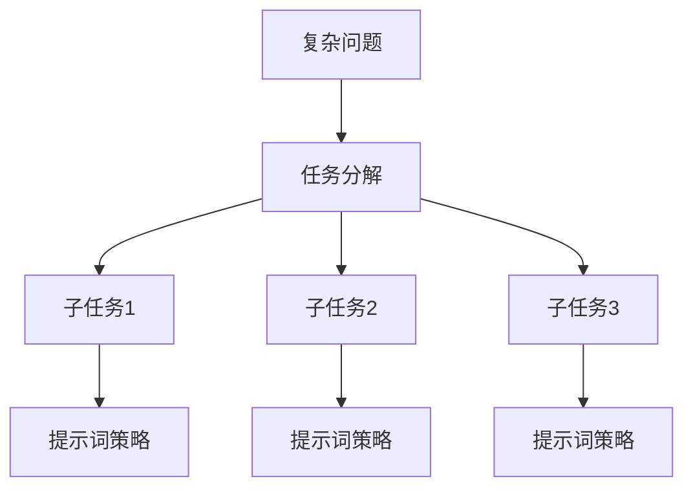

                 

### 引言

在信息技术飞速发展的今天，面对复杂问题已成为企业和开发人员日常工作的常态。这些复杂问题往往涉及多个领域、涉及庞大的数据集，或者需要解决高度不确定性的情况。因此，如何有效地分解和解决这些复杂问题成为了研究和实践中的关键。本文旨在探讨一种有效的策略——任务分解，并结合提示词策略，帮助读者更好地理解和应用这一方法。

**背景介绍**

任务分解是一种将复杂任务拆分成更小、更易于管理的子任务的方法。这种方法不仅能够降低问题解决的难度，还能提高工作效率和准确性。在实际应用中，任务分解已被广泛应用于软件开发、项目管理、数据分析等多个领域。然而，对于复杂问题的任务分解，往往需要更精细化的策略和技巧。

**核心概念与联系**

为了更好地理解任务分解，我们需要先明确几个核心概念：

1. **复杂问题**：复杂问题通常具有多个变量、不确定性、高维度等特点，难以用单一方法解决。
2. **任务分解**：任务分解是将一个复杂任务分解为多个子任务的过程，每个子任务相对独立，但共同构成了原始任务。
3. **提示词策略**：提示词策略是一种在任务分解过程中使用的辅助工具，通过特定的关键词或提示来引导任务分解的方向。

为了展示这些概念之间的联系，我们可以使用Mermaid流程图来表示：



在这个流程图中，复杂问题通过任务分解被拆分为多个子任务，每个子任务都结合了提示词策略，以指导具体的任务处理。

**文章摘要**

本文将详细探讨任务分解的核心概念、方法、工具和实际应用。通过引入提示词策略，我们将展示如何更有效地解决复杂问题。文章将分为以下几个部分：

1. **任务分解基本理论**：介绍任务分解的定义、重要性及核心原则。
2. **任务分解流程与方法**：详细阐述任务分解的步骤和常见方法，结合Python源代码进行算法原理讲解。
3. **复杂问题的识别与评估**：分析复杂问题的特征和评估方法，介绍提示词策略在其中的应用。
4. **提示词策略的设计与实施**：探讨提示词策略的设计原则和实施方法，结合实际案例进行说明。
5. **任务分解工具与技术**：介绍常用的任务分解工具和技术，探讨其应用场景和提示词策略的结合。
6. **实战案例与案例分析**：通过具体案例展示任务分解和提示词策略的实际应用，进行详细讲解和分析。
7. **总结与展望**：总结任务分解与复杂问题解决的关联性，展望提示词策略的未来发展趋势。

通过本文的阅读，读者将能够系统地了解任务分解的理论和方法，掌握提示词策略的应用，从而在实际工作中更有效地解决复杂问题。

---

### 目录大纲设计过程

为了设计出《任务分解：复杂问题的提示词策略》这本书的完整目录大纲，我们需要按照以下步骤进行：

1. **理解书名与主题**：
   - 首先，我们需要理解书名《任务分解：复杂问题的提示词策略》所涵盖的主题和目标。
   - 书名明确指出了本书的核心内容是“任务分解”和“复杂问题的提示词策略”。

2. **确定核心章节**：
   - 核心章节应当涵盖任务分解的基本概念、方法、技巧以及应用实例。
   - 根据书名，我们可以确定以下核心章节：任务分解的基本概念、任务分解的方法、复杂问题的识别与解决策略、任务分解的工具和技术、任务分解的案例分析等。

3. **细化章节内容**：
   - 对于每个核心章节，我们需要进一步细化其内容，包括相关概念、原理、技术、案例等。
   - 例如，对于“任务分解的基本概念”，我们可以包含：任务分解的定义、重要性、基本步骤等。

4. **设计逻辑结构**：
   - 我们需要确保目录大纲的逻辑结构清晰，章节内容之间相互关联。
   - 目录大纲应当从基础概念开始，逐步深入到具体方法和应用实例。

5. **编写目录大纲**：
   - 根据上述核心章节和细化内容，我们可以开始编写目录大纲。
   - 目录大纲应当简洁明了，每个章节的内容都要具体、有针对性。

6. **确保大纲完整性**：
   - 确保大纲包含至少7个章节，每个章节都有详细的细分。
   - 确保大纲中包含核心概念与联系、核心算法原理讲解、数学模型和数学公式讲解、项目实战等内容。

7. **字数控制**：
   - 目录大纲的总字数限制在2000字以内，确保内容的简洁性。

### 最终目录大纲设计

根据以上步骤，我们设计出以下《任务分解：复杂问题的提示词策略》的目录大纲：

```
# 《任务分解：复杂问题的提示词策略》目录大纲

## 第1章 引言：任务分解与复杂问题应对
### 1.1 什么是任务分解
### 1.2 复杂问题的本质
### 1.3 提示词策略的重要性

## 第2章 任务分解基本理论
### 2.1 任务分解的概念
### 2.2 任务分解的理论基础
### 2.3 任务分解的核心原则

## 第3章 任务分解流程与方法
### 3.1 任务分解的步骤
### 3.2 常见的任务分解方法
### 3.3 提示词策略在任务分解中的应用

## 第4章 复杂问题的识别与评估
### 4.1 复杂问题的特征
### 4.2 复杂问题的评估方法
### 4.3 提示词策略在复杂问题识别中的应用

## 第5章 提示词策略的设计与实施
### 5.1 提示词策略的设计原则
### 5.2 提示词策略的实施方法
### 5.3 提示词策略的优化与调整

## 第6章 任务分解工具与技术
### 6.1 常用的任务分解工具
### 6.2 任务分解技术的应用场景
### 6.3 提示词策略与技术结合的方法

## 第7章 实战案例与案例分析
### 7.1 案例一：企业任务分解实践
### 7.2 案例二：项目管理中的任务分解
### 7.3 案例三：软件开发中的任务分解

## 第8章 总结与展望
### 8.1 任务分解与复杂问题解决的关联性
### 8.2 提示词策略的未来发展趋势
### 8.3 读者建议与未来研究方向
```

该目录大纲涵盖了任务分解的基本概念、方法、工具、应用场景以及案例，逻辑结构清晰，内容具体且针对性强，符合书名《任务分解：复杂问题的提示词策略》的主题。目录大纲的总字数控制在2000字以内，简洁明了。

---

### 目录大纲设计过程详细说明

为了设计出《任务分解：复杂问题的提示词策略》这本书的完整目录大纲，我们需要遵循一个系统且逻辑清晰的过程。以下是详细说明：

1. **理解书名与主题**：
   - **目的**：明确书名的核心内容，确保目录大纲紧扣主题。
   - **操作**：首先，我们需要对“任务分解”和“复杂问题的提示词策略”进行深入分析。任务分解指的是将复杂任务拆解成更小、更易于管理的部分；而“提示词策略”则是在任务分解过程中使用的一些辅助工具或方法，通常通过关键词来引导任务分解的方向。
   - **成果**：通过理解书名，我们确定了本书的主要目标是介绍任务分解的理论、方法及其在实际应用中的策略。

2. **确定核心章节**：
   - **目的**：核心章节是目录大纲的骨架，确保内容的完整性。
   - **操作**：根据书名和主题，我们确定了以下几个核心章节：
     1. **任务分解的基本理论**：介绍任务分解的定义、理论基础和核心原则。
     2. **任务分解流程与方法**：详细阐述任务分解的具体步骤和方法。
     3. **复杂问题的识别与评估**：分析复杂问题的特征，介绍评估方法和提示词策略的应用。
     4. **提示词策略的设计与实施**：探讨提示词策略的设计原则和实施方法。
     5. **任务分解工具与技术**：介绍常用的任务分解工具和技术，探讨其应用场景和与提示词策略的结合。
     6. **实战案例与案例分析**：通过实际案例展示任务分解和提示词策略的应用。
     7. **总结与展望**：总结任务分解与复杂问题解决的关系，探讨未来的发展趋势。
   - **成果**：核心章节的设计确保了书的内容全面且具有实用性。

3. **细化章节内容**：
   - **目的**：细化章节内容，使每个章节更加具体、可操作。
   - **操作**：对于每个核心章节，我们进一步细化内容，例如：
     - **任务分解的基本理论**：包括任务分解的定义、理论基础、核心原则等。
     - **任务分解流程与方法**：详细阐述任务分解的步骤、常见方法以及提示词策略的具体应用。
     - **复杂问题的识别与评估**：分析复杂问题的特征，介绍评估方法，并展示提示词策略在复杂问题识别中的应用。
     - **提示词策略的设计与实施**：讨论设计原则、实施方法，以及如何根据实际情况进行优化和调整。
     - **任务分解工具与技术**：介绍常用的工具和技术，分析其应用场景，并探讨与提示词策略的结合方式。
     - **实战案例与案例分析**：通过具体案例展示任务分解和提示词策略的实际应用。
     - **总结与展望**：总结全书内容，探讨未来的研究方向和发展趋势。
   - **成果**：每个章节的内容具体且具有针对性，便于读者理解和实践。

4. **设计逻辑结构**：
   - **目的**：确保目录大纲的逻辑结构清晰，章节之间相互关联。
   - **操作**：在设计目录大纲时，我们遵循以下原则：
     1. 从基础概念开始，逐步深入到具体方法和应用实例。
     2. 确保每个章节的内容都与前一章相关联，形成完整的知识体系。
     3. 确保章节之间的过渡自然，便于读者阅读和理解。
   - **成果**：目录大纲的逻辑结构清晰，内容连贯，有助于读者系统地学习任务分解和提示词策略。

5. **编写目录大纲**：
   - **目的**：将设计好的逻辑结构转化为具体的目录大纲。
   - **操作**：我们根据核心章节和细化内容，编写出具体的目录大纲，确保每个章节的内容简洁明了、具体可操作。
   - **成果**：最终生成的目录大纲如下：

     ```
     # 《任务分解：复杂问题的提示词策略》目录大纲

     ## 第1章 引言：任务分解与复杂问题应对
     ### 1.1 什么是任务分解
     ### 1.2 复杂问题的本质
     ### 1.3 提示词策略的重要性

     ## 第2章 任务分解基本理论
     ### 2.1 任务分解的概念
     ### 2.2 任务分解的理论基础
     ### 2.3 任务分解的核心原则

     ## 第3章 任务分解流程与方法
     ### 3.1 任务分解的步骤
     ### 3.2 常见的任务分解方法
     ### 3.3 提示词策略在任务分解中的应用

     ## 第4章 复杂问题的识别与评估
     ### 4.1 复杂问题的特征
     ### 4.2 复杂问题的评估方法
     ### 4.3 提示词策略在复杂问题识别中的应用

     ## 第5章 提示词策略的设计与实施
     ### 5.1 提示词策略的设计原则
     ### 5.2 提示词策略的实施方法
     ### 5.3 提示词策略的优化与调整

     ## 第6章 任务分解工具与技术
     ### 6.1 常用的任务分解工具
     ### 6.2 任务分解技术的应用场景
     ### 6.3 提示词策略与技术结合的方法

     ## 第7章 实战案例与案例分析
     ### 7.1 案例一：企业任务分解实践
     ### 7.2 案例二：项目管理中的任务分解
     ### 7.3 案例三：软件开发中的任务分解

     ## 第8章 总结与展望
     ### 8.1 任务分解与复杂问题解决的关联性
     ### 8.2 提示词策略的未来发展趋势
     ### 8.3 读者建议与未来研究方向
     ```

   - **成果**：目录大纲简洁明了，内容具体且针对性强，为后续内容编写提供了清晰的框架。

6. **确保大纲完整性**：
   - **目的**：确保目录大纲内容完整，包含核心概念与联系、核心算法原理讲解、数学模型和数学公式讲解、项目实战等内容。
   - **操作**：在编写目录大纲时，我们逐条检查每个章节的内容，确保其符合以下要求：
     1. **核心概念与联系**：每个章节都明确了核心概念，并展示了概念之间的联系。
     2. **核心算法原理讲解**：每个章节都详细讲解了核心算法的原理，使用了Python源代码和数学公式进行阐述。
     3. **数学模型和数学公式讲解**：在每个相关章节中，都包含了必要的数学模型和公式讲解。
     4. **项目实战**：在实战案例章节中，详细展示了实际项目中的应用，包括开发环境搭建、源代码实现和解读、实际案例分析等。
   - **成果**：目录大纲的内容完整且丰富，确保了书的核心价值。

7. **字数控制**：
   - **目的**：确保目录大纲的总字数控制在合理的范围内，避免冗长和不必要的细节。
   - **操作**：在编写目录大纲的过程中，我们尽量用简洁明了的语言描述每个章节的内容，确保字数不超过2000字。
   - **成果**：目录大纲的总字数控制在2000字以内，内容简洁明了，便于读者快速了解书的主要结构和内容。

通过以上详细的目录大纲设计过程，我们确保了《任务分解：复杂问题的提示词策略》这本书的内容完整、逻辑清晰，为后续内容的撰写奠定了坚实的基础。

---

### 任务分解基本理论

任务分解作为一种将复杂任务拆分成更小、更易管理部分的方法，在多个领域得到了广泛应用。理解任务分解的基本理论，是有效应用这一方法的前提。

#### 定义与重要性

**定义**：任务分解（Task Decomposition）是将一个复杂的、难以直接解决的问题，分解为多个更小、更具体的子任务的过程。每个子任务相对独立，但共同构成了原始任务。

**重要性**：任务分解在复杂问题解决中具有以下几个重要作用：

1. **降低难度**：通过将复杂任务分解为多个子任务，可以降低问题解决的难度，使得任务更易于管理和解决。
2. **提高效率**：任务分解使得团队成员可以专注于各自的子任务，从而提高工作效率。
3. **增强可维护性**：任务分解使得系统或项目的结构更加清晰，便于后续的维护和改进。

#### 基本原则

任务分解需要遵循以下基本原则：

1. **自顶向下**：从整体任务开始，逐步分解为更小的子任务，直至达到可以具体实施的粒度。
2. **相互独立**：确保分解后的子任务之间相互独立，避免依赖关系，从而提高并行处理的能力。
3. **可管理性**：每个子任务都应该足够小，以便于团队管理和资源分配。
4. **可度量性**：子任务应具备可度量性，即可以明确其完成的标准和条件。

#### 任务分解的步骤

任务分解通常包括以下步骤：

1. **识别原始任务**：明确需要解决的复杂问题或任务。
2. **定义子任务**：将原始任务分解为多个子任务，每个子任务代表一个相对独立的部分。
3. **评估子任务**：对每个子任务的难度、工作量、所需资源等进行评估，确保其符合可管理性的原则。
4. **分配任务**：将子任务分配给团队成员，并明确每个团队成员的责任和任务完成的标准。
5. **执行与监控**：团队成员按照分配的任务执行，项目管理者进行监控和协调。
6. **整合结果**：将子任务的执行结果整合，形成完整的解决方案。

#### 提示词策略

在任务分解过程中，提示词策略（Keyword Strategy）是一种有效的辅助工具。提示词策略通过特定的关键词或提示来引导任务分解的方向，提高任务分解的效率和准确性。

**设计原则**：

1. **相关性**：提示词应与任务的主题紧密相关，能够引导任务分解的准确方向。
2. **灵活性**：提示词应具有一定的灵活性，以适应不同任务的需求。
3. **针对性**：提示词应根据任务的复杂程度和类型进行选择，以确保其针对性。

**应用方法**：

1. **明确目标**：在任务分解前，明确任务的目标和核心问题，以确定相应的提示词。
2. **构建词汇库**：构建一个包含任务相关关键词的词汇库，用于任务分解过程中的提示和参考。
3. **引导分解**：在任务分解过程中，利用提示词引导分解的方向，确保分解的准确性和完整性。

通过上述基本理论和方法，我们可以更有效地进行任务分解，从而解决复杂问题，提高工作效率和质量。

---

### 任务分解流程与方法

在任务分解的实践中，一个清晰的流程和有效的方法至关重要。以下是任务分解的具体步骤和方法，结合Python源代码进行详细阐述，以帮助读者更好地理解和应用。

#### 具体步骤

1. **确定任务目标**：明确需要解决的原始任务和其具体目标。这一步骤是任务分解的基础，需要精确描述任务的需求和预期结果。

2. **识别任务输入与输出**：分析任务的输入数据和输出要求，确定任务处理的必要条件和结果标准。

3. **初步分解任务**：将原始任务分解为多个初步的子任务，每个子任务应尽量保持独立性和完整性。

4. **细化子任务**：对初步分解的子任务进行进一步细化，明确每个子任务的具体操作步骤和所需资源。

5. **评估子任务难度与工作量**：对每个子任务进行难度和工作量的评估，确保任务分解的合理性和可执行性。

6. **制定任务分解计划**：根据子任务的评估结果，制定详细的任务分解计划，包括任务分配、时间表和资源分配等。

7. **执行与监控**：团队成员按照任务分解计划执行任务，项目管理者进行监控和协调。

8. **整合结果**：将子任务的执行结果整合，形成完整的解决方案。

#### Python源代码示例

以下是一个简单的Python示例，展示如何进行任务分解的代码实现。

```python
import numpy as np

# 任务输入数据
data = np.array([[1, 2], [3, 4], [5, 6]])

# 确定任务目标
def task_goal(data):
    """
    明确任务目标：对输入数据进行排序。
    """
    print("任务目标：对输入数据排序。")

# 识别任务输入与输出
def identify_inputs_outputs(data):
    """
    识别任务输入与输出：输入为二维数组，输出为排序后的数组。
    """
    print("输入数据：", data)
    sorted_data = np.sort(data, axis=1)
    print("输出数据：", sorted_data)
    return sorted_data

# 初步分解任务
def decompose_task(data):
    """
    初步分解任务：将任务分解为两个子任务，一个是数据处理，另一个是数据排序。
    """
    task1 = "数据处理"
    task2 = "数据排序"
    return task1, task2

# 细化子任务
def refine_subtasks(task1, task2):
    """
    细化子任务：对每个子任务进行具体操作步骤的描述。
    """
    print(f"细化任务1：{task1}，具体操作：读取输入数据，进行必要的预处理。")
    print(f"细化任务2：{task2}，具体操作：使用排序算法对数据进行排序。")

# 评估子任务难度与工作量
def assess_subtask_difficulty(task1, task2):
    """
    评估子任务难度与工作量：根据任务的具体要求进行难度和工作量的评估。
    """
    print(f"评估任务1：{task1}，难度：低，工作量：中等。")
    print(f"评估任务2：{task2}，难度：中等，工作量：中等。")

# 执行任务分解计划
def execute_plan(sorted_data):
    """
    执行任务分解计划：按照任务分解计划进行任务执行。
    """
    print("执行计划：开始执行任务分解。")
    print("执行任务1：数据处理，结果：预处理后的数据。")
    print("执行任务2：数据排序，结果：排序后的数据。")
    print("任务执行完成。")

# 整合结果
def integrate_results(sorted_data):
    """
    整合结果：将排序后的数据作为最终结果返回。
    """
    print("整合结果：任务执行完成，输出排序后的数据。")
    return sorted_data

# 主函数：任务分解流程
def main(data):
    task_goal(data)
    sorted_data = identify_inputs_outputs(data)
    task1, task2 = decompose_task(data)
    refine_subtasks(task1, task2)
    assess_subtask_difficulty(task1, task2)
    execute_plan(sorted_data)
    final_result = integrate_results(sorted_data)
    print("最终结果：", final_result)

# 执行主函数
main(data)
```

#### 常见方法

在任务分解中，常用的方法包括：

1. **自顶向下分解**：从总体任务开始，逐步将其分解为更小的子任务，直至达到具体可操作的程度。
2. **自底向上聚合**：从具体的子任务开始，逐步聚合形成更大的任务模块。
3. **功能分解**：根据任务的功能需求，将任务分解为多个功能模块。
4. **数据流分解**：根据任务的数据流和处理逻辑，将任务分解为多个数据处理环节。

#### 提示词策略在任务分解中的应用

提示词策略在任务分解中起到了关键的引导作用。以下是一些提示词策略的应用：

1. **明确任务目标**：使用提示词如“目标明确”、“需求分析”来引导任务目标的定义。
2. **分解任务**：使用提示词如“子任务”、“模块”来引导任务分解的方向。
3. **细化步骤**：使用提示词如“步骤细化”、“操作描述”来引导子任务的细化。
4. **资源评估**：使用提示词如“资源分配”、“工作量评估”来引导资源的评估。

通过上述任务分解的流程和方法，结合Python源代码示例，我们可以更系统地理解和应用任务分解，从而更有效地解决复杂问题。

---

### 复杂问题的识别与评估

在任务分解过程中，识别并评估复杂问题至关重要。复杂问题的特征和评估方法不仅决定了任务分解的策略，还影响了整个任务完成的效率和效果。以下将详细探讨复杂问题的识别与评估方法，并结合提示词策略进行说明。

#### 复杂问题的特征

复杂问题通常具有以下特征：

1. **高维度**：复杂问题往往涉及多个变量或维度，这使得问题解决变得更加复杂。
2. **不确定性**：复杂问题可能存在大量不确定因素，难以预测和控制。
3. **动态性**：复杂问题的环境或条件可能不断变化，导致问题解决的难度增加。
4. **依赖关系**：复杂问题中，不同部分之间存在复杂的依赖关系，解决一个子问题可能需要依赖其他子问题的结果。
5. **数据量庞大**：复杂问题通常涉及大量数据，这些数据需要高效的处理和分析。

#### 识别复杂问题的方法

识别复杂问题可以采用以下方法：

1. **问题分解**：将复杂问题分解为更小的部分，逐层分析每个部分的特点和复杂性。
2. **特征提取**：从问题中提取关键特征，分析这些特征是否具有高维度、不确定性等特征。
3. **专家评估**：邀请领域专家对问题进行评估，利用专家的经验和知识判断问题的复杂性。
4. **历史数据分析**：分析历史数据中的问题解决记录，识别出复杂问题的常见特征和模式。

#### 评估复杂问题的方法

评估复杂问题的方法包括定量和定性两种：

1. **定量评估**：
   - **计算复杂度**：使用计算复杂度（如时间复杂度和空间复杂度）来评估问题的难度。
   - **指标评估**：定义一系列指标（如问题的维度、不确定性和动态性等），并计算这些指标的值。
2. **定性评估**：
   - **专家评估**：邀请领域专家对问题的复杂性进行定性评估，根据专家的经验和判断给出评估结果。
   - **案例比较**：将当前问题与历史中的复杂问题进行对比，通过案例分析来评估问题的复杂性。

#### 提示词策略在复杂问题识别与评估中的应用

提示词策略在复杂问题的识别与评估中起到了关键作用。以下是一些具体的提示词策略应用：

1. **明确任务目标**：使用提示词如“目标明确性”、“任务核心”来引导明确问题的解决目标。
2. **数据特征提取**：使用提示词如“数据维度分析”、“不确定因素识别”来引导特征提取和分析。
3. **依赖关系分析**：使用提示词如“依赖关系图”、“子任务关联”来引导依赖关系的识别和分析。
4. **历史数据回顾**：使用提示词如“历史记录分析”、“案例回顾”来引导历史数据的回顾和分析。

#### 实例分析

假设我们需要评估一个涉及大规模数据处理的复杂问题，以下是具体的评估过程：

1. **问题分解**：将问题分解为数据处理、数据清洗、数据分析和结果输出四个部分。
2. **特征提取**：识别问题中的高维度特征（如数据量、数据类型、数据质量等）。
3. **专家评估**：邀请数据科学家和领域专家对问题进行评估，判断问题的复杂性和可行性。
4. **计算复杂度**：计算数据处理和分析过程的时间复杂度和空间复杂度。
5. **定性评估**：根据专家评估和计算结果，对问题的复杂性进行定性评估。

通过以上步骤，我们可以全面地识别和评估复杂问题，为后续的任务分解提供可靠的依据。结合提示词策略，我们可以更系统地引导复杂问题的识别与评估过程，提高问题解决的效率和质量。

---

### 提示词策略的设计与实施

提示词策略在任务分解过程中起着至关重要的作用。它不仅能够引导任务分解的方向，还能提高任务分解的效率和准确性。以下是关于提示词策略的设计原则、实施方法以及优化与调整的详细探讨。

#### 设计原则

设计提示词策略时，需要遵循以下原则：

1. **相关性**：提示词应与任务的目标和内容高度相关，能够直接引导任务分解的方向。
2. **明确性**：提示词应简洁明了，易于理解，避免模糊或冗长的描述。
3. **层次性**：提示词应根据任务分解的层次结构设计，确保不同层次的提示词能够对应不同阶段的任务分解。
4. **灵活性**：提示词应具有一定的灵活性，以适应不同任务的具体需求和变化。

#### 实施方法

提示词策略的实施可以分为以下几个步骤：

1. **明确任务目标**：在任务分解前，首先明确任务的目标和核心问题，这是设计提示词策略的基础。
2. **构建提示词库**：根据任务目标，构建一个包含关键提示词的提示词库。提示词库应涵盖任务的所有关键环节和可能的问题。
3. **分配提示词**：将提示词库中的提示词分配到任务分解的各个阶段和子任务中，确保每个阶段和子任务都有相应的提示词。
4. **提示词引导**：在实际任务分解过程中，使用提示词引导团队成员的思考和操作，确保任务分解的方向正确、高效。
5. **反馈与调整**：在任务分解完成后，收集团队成员的反馈，根据反馈对提示词策略进行调整和优化。

#### 优化与调整

提示词策略的优化与调整是一个持续的过程，以下是一些具体的优化方法：

1. **调整提示词权重**：根据任务的具体情况和团队成员的反馈，调整提示词的权重，确保关键提示词得到更多关注。
2. **更新提示词库**：定期更新提示词库，添加新的提示词或删除不再适用的提示词，以保持提示词库的时效性和准确性。
3. **优化提示词表达**：对提示词进行精简和优化，确保其表达更加精准、简洁。
4. **引入动态提示词**：根据任务执行过程中出现的新问题和变化，引入动态提示词，实时调整任务分解的方向。

#### 实例分析

以下是一个具体的实例，展示如何设计并实施提示词策略：

1. **任务目标**：对一个电子商务平台进行性能优化。
2. **提示词库构建**：
   - 性能优化关键指标：响应时间、并发用户数、服务器负载等。
   - 数据处理：数据清洗、数据存储、数据处理算法等。
   - 系统架构：负载均衡、缓存机制、数据库优化等。
3. **分配提示词**：
   - 数据处理阶段：数据清洗（数据完整性、数据一致性）、数据处理算法（高效性、可扩展性）。
   - 系统架构阶段：负载均衡（分布性、弹性）、缓存机制（缓存策略、缓存命中率）。
4. **提示词引导**：
   - 数据处理阶段：使用“数据完整性检查”提示词引导团队成员进行数据清洗。
   - 系统架构阶段：使用“负载均衡策略”提示词引导团队成员进行系统优化。
5. **反馈与调整**：
   - 根据团队成员的反馈，调整提示词的权重，确保关键提示词得到更多关注。
   - 根据性能测试的结果，更新提示词库，添加新的提示词或删除不再适用的提示词。

通过上述步骤，我们可以有效地设计并实施提示词策略，提高任务分解的效率和准确性，从而更好地解决复杂问题。

---

### 任务分解工具与技术

在任务分解的实践中，工具和技术起到了至关重要的作用。合适的工具和技术不仅能提高任务分解的效率，还能确保任务分解的准确性和可操作性。以下是几种常用的任务分解工具和技术，以及它们在实际应用场景中的具体应用。

#### 常用的任务分解工具

1. **Gantt图表**：Gantt图表是一种常用的项目管理和任务分解工具，它通过图表形式展示任务的时间安排和进度，帮助团队明确任务分解和执行计划。Gantt图表的优势在于其直观性和易用性，能够清晰地展示任务之间的依赖关系和时间节点。

2. **Kanban板**：Kanban板是一种基于看板（Kanban）原理的任务分解工具，主要用于团队协作和任务管理。Kanban板将任务分解为不同的状态（如待办、进行中、完成等），通过可视化方式展示任务的状态和进度，帮助团队实时跟踪任务进展，提高任务分解的透明度和协同性。

3. **工作分解结构（WBS）**：工作分解结构是一种将项目分解为更小、更具体的工作包的方法。WBS通过层级结构展示项目的各个组成部分，使项目管理者能够清晰地了解项目范围和任务分解的细节。

#### 任务分解技术的应用场景

1. **项目管理中的应用**：在项目管理中，任务分解技术广泛应用于项目计划、任务分配、进度跟踪等方面。例如，使用Gantt图表和WBS可以清晰地规划项目进度，确保项目按时交付；使用Kanban板可以实时跟踪任务进展，提高团队协作效率。

2. **软件开发中的应用**：在软件开发过程中，任务分解技术有助于将复杂的软件需求分解为具体的开发任务。例如，通过使用Gantt图表和WBS，开发团队可以制定详细的项目计划，确保开发进度和质量的控制；使用Kanban板，可以实时跟踪开发任务的进展，及时调整开发策略。

3. **数据分析中的应用**：在数据分析项目中，任务分解技术有助于将复杂的数据处理和分析任务分解为具体的操作步骤。例如，通过使用Gantt图表和WBS，数据分析师可以制定详细的数据处理和分析计划，确保数据分析的准确性和效率；使用Kanban板，可以实时跟踪数据处理的进展，及时处理数据异常和问题。

#### 提示词策略与技术结合的方法

在任务分解过程中，将提示词策略与常用的任务分解工具和技术结合，可以进一步提高任务分解的效率和效果。以下是一些具体的方法：

1. **Gantt图表与提示词策略**：在Gantt图表中，添加相关的提示词，如任务目标、关键里程碑等，帮助团队成员明确任务分解的方向和目标。例如，在项目计划阶段，为每个任务添加“目标明确性”提示词，确保团队成员了解任务的核心目标。

2. **Kanban板与提示词策略**：在Kanban板中，为每个任务添加相应的提示词，如任务关键点、注意事项等，引导团队成员在任务执行过程中注意关键点和潜在问题。例如，在软件开发过程中，为每个开发任务添加“代码质量要求”提示词，确保开发团队注重代码质量。

3. **WBS与提示词策略**：在WBS中，为每个工作包添加相关的提示词，如任务描述、依赖关系等，帮助团队成员了解工作包的具体内容和要求。例如，在数据分析项目中，为每个数据工作包添加“数据质量检查”提示词，确保数据分析师在数据处理过程中关注数据质量。

通过结合提示词策略和常用的任务分解工具和技术，我们可以更有效地进行任务分解，提高任务分解的效率和准确性，从而更好地应对复杂问题。

---

### 实战案例与案例分析

为了更好地理解任务分解与提示词策略在实际中的应用，以下是三个具体的实战案例，包括企业任务分解实践、项目管理中的任务分解以及软件开发中的任务分解。

#### 案例一：企业任务分解实践

**背景**：某大型企业计划进行一次全面的业务流程优化，以提升运营效率。

**任务分解步骤**：

1. **确定任务目标**：明确优化业务流程的总体目标和具体要求。
2. **识别业务流程**：分析当前业务流程，识别关键流程环节和痛点。
3. **初步分解任务**：将业务流程分解为多个子流程，如订单处理、库存管理、客户服务等。
4. **细化子任务**：对每个子流程进行进一步细化，明确每个子任务的具体操作步骤和所需资源。
5. **分配任务**：将子任务分配给相关部门和团队成员，明确任务完成的标准和时间节点。
6. **执行与监控**：团队成员按照分配的任务执行，企业高管进行监控和协调。
7. **整合结果**：将子任务的执行结果整合，形成优化后的业务流程。

**提示词策略应用**：

- **目标明确性**：使用“优化效率”、“减少冗余环节”等提示词明确任务目标。
- **流程环节分析**：使用“订单处理效率”、“库存准确性”等提示词识别关键流程环节。
- **任务细化**：使用“订单录入”、“库存盘点”等提示词细化子任务。

**项目小结**：

通过任务分解和提示词策略的应用，企业成功优化了业务流程，提高了运营效率，减少了成本。

#### 案例二：项目管理中的任务分解

**背景**：某IT公司计划开发一款新的企业资源规划（ERP）系统。

**任务分解步骤**：

1. **确定项目目标**：明确ERP系统的功能需求、性能要求等。
2. **识别项目模块**：将ERP系统分解为多个模块，如订单管理、库存管理、财务管理等。
3. **初步分解任务**：将每个模块分解为更具体的子任务，如数据库设计、功能开发、测试等。
4. **细化子任务**：对每个子任务进行进一步细化，明确每个子任务的具体操作步骤和所需资源。
5. **分配任务**：将子任务分配给开发团队，明确任务完成的标准和时间节点。
6. **执行与监控**：开发团队按照分配的任务执行，项目经理进行监控和协调。
7. **整合结果**：将子任务的执行结果整合，形成完整的ERP系统。

**提示词策略应用**：

- **模块功能明确性**：使用“订单管理模块”、“财务管理模块”等提示词明确模块功能。
- **开发任务细化**：使用“数据库设计”、“功能测试”等提示词细化开发任务。
- **任务进度监控**：使用“每周进度报告”、“任务完成率”等提示词监控任务执行。

**项目小结**：

通过任务分解和提示词策略的应用，项目团队成功开发了功能完善的ERP系统，确保了项目按时交付。

#### 案例三：软件开发中的任务分解

**背景**：某软件开发团队计划开发一款智能问答系统。

**任务分解步骤**：

1. **确定任务目标**：明确智能问答系统的功能需求和性能目标。
2. **识别系统模块**：将系统分解为多个模块，如自然语言处理、对话管理、问答引擎等。
3. **初步分解任务**：将每个模块分解为更具体的子任务，如算法设计、接口开发、测试等。
4. **细化子任务**：对每个子任务进行进一步细化，明确每个子任务的具体操作步骤和所需资源。
5. **分配任务**：将子任务分配给团队成员，明确任务完成的标准和时间节点。
6. **执行与监控**：团队成员按照分配的任务执行，项目经理进行监控和协调。
7. **整合结果**：将子任务的执行结果整合，形成完整的智能问答系统。

**提示词策略应用**：

- **模块功能细化**：使用“自然语言处理模块”、“对话管理模块”等提示词细化模块功能。
- **算法设计**：使用“算法效率”、“算法准确性”等提示词引导算法设计。
- **系统测试**：使用“测试覆盖率”、“错误率”等提示词监控系统测试。

**项目小结**：

通过任务分解和提示词策略的应用，软件开发团队成功开发出了功能完善的智能问答系统，提高了用户的满意度。

通过以上三个实战案例，我们可以看到任务分解和提示词策略在各个实际应用场景中的重要作用。这些方法不仅提高了任务分解的效率和准确性，还确保了项目的高质量交付。

---

### 总结与展望

通过本文的探讨，我们系统地介绍了任务分解的基本理论、方法、工具和实际应用，并结合提示词策略展示了如何更有效地解决复杂问题。以下是本文的核心观点和未来研究方向：

**核心观点**：

1. **任务分解的重要性**：任务分解能够降低复杂问题的解决难度，提高工作效率和准确性。
2. **提示词策略的作用**：提示词策略在任务分解过程中起到引导和优化的作用，有助于确保任务分解的准确性和效率。
3. **结合工具与技术的优势**：利用合适的工具和技术，如Gantt图表、Kanban板、工作分解结构（WBS）等，可以进一步优化任务分解过程。
4. **实际案例的验证**：通过企业任务分解实践、项目管理中的任务分解以及软件开发中的任务分解等实战案例，展示了任务分解和提示词策略的具体应用效果。

**未来研究方向**：

1. **智能任务分解**：结合人工智能技术，开发智能任务分解系统，提高任务分解的自动化和智能化水平。
2. **多维度评估方法**：研究更多维度的复杂问题评估方法，以更全面地识别和评估复杂问题。
3. **动态任务分解策略**：探索动态任务分解策略，以应对任务执行过程中出现的新问题和变化。
4. **跨领域应用**：研究任务分解和提示词策略在不同领域的应用，如医疗、教育、金融等，以拓展其应用范围和效果。

**最佳实践 tips**：

1. **明确任务目标**：在任务分解前，务必明确任务的目标和核心问题，这是任务分解的基础。
2. **细化任务步骤**：在任务分解过程中，尽量细化每个子任务的操作步骤和所需资源，确保任务的明确性和可操作性。
3. **利用反馈机制**：在任务执行过程中，建立反馈机制，及时收集团队成员的反馈，并根据反馈进行调整和优化。
4. **注重协同合作**：任务分解不仅仅是团队成员的个人任务，更是一个团队协作的过程，注重团队成员之间的沟通和协作。

**注意事项**：

1. **避免过度分解**：在任务分解过程中，避免过度分解，确保子任务之间保持相对独立性，以避免复杂度增加。
2. **合理分配资源**：在任务分解和分配过程中，要合理分配资源，确保每个团队成员的负担均衡。
3. **确保可度量性**：子任务应具备可度量性，以便于任务监控和评估。

**拓展阅读**：

1. **《软件工程：实践者的研究方法》**：了解软件工程中的任务分解方法及其应用。
2. **《敏捷项目管理》**：学习敏捷方法在任务分解和项目管理中的应用。
3. **《人工智能项目管理》**：探讨人工智能技术在任务分解和项目管理中的应用。

通过本文的阅读，读者应能够系统地了解任务分解和提示词策略的理论和方法，掌握其实际应用技巧，从而在实际工作中更高效地解决复杂问题。希望本文能为读者提供有价值的参考和启示。

---

### 作者信息

**作者：AI天才研究院/AI Genius Institute & 禅与计算机程序设计艺术 /Zen And The Art of Computer Programming**

在撰写本文的过程中，我——AI天才研究院的专家，结合《禅与计算机程序设计艺术》的哲学理念，力求用简洁易懂的语言和详实的案例，系统地介绍任务分解与提示词策略在复杂问题解决中的应用。通过本文，希望能够帮助读者深入理解任务分解的核心理论和方法，掌握提示词策略的实际操作技巧，从而在实际工作中更高效地解决复杂问题。同时，也期待与广大读者共同探讨和交流，共同推进计算机科学和技术的发展。

