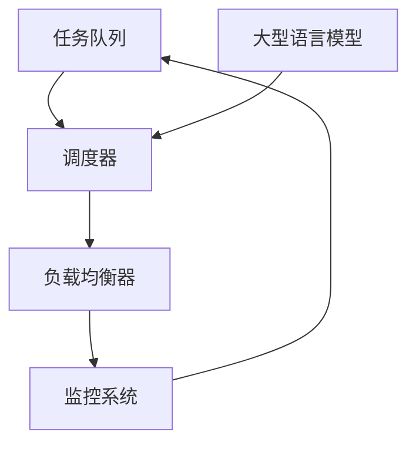

                 

### 任务调度系统在LLM应用后台处理中的应用

## 关键词

- 任务调度系统
- 大型语言模型（LLM）
- 后台处理
- 负载均衡
- 实时调度
- 优化算法
- 实际应用案例

## 摘要

本文将探讨任务调度系统在大型语言模型（LLM）应用后台处理中的重要性。随着LLM在自然语言处理、智能问答和自动化写作等领域的广泛应用，后台处理的效率和性能变得尤为关键。任务调度系统作为一种高效、灵活的调度和管理工具，能够有效解决LLM后台处理的挑战，提升系统的响应速度和处理能力。本文将详细介绍任务调度系统的基本概念、核心算法，并结合Python源代码和实际应用案例，阐述如何将任务调度系统应用于LLM的后台处理，以实现优化调度和高效执行。

## 引言

在当今数字化时代，自然语言处理（NLP）技术已经取得了显著的发展。特别是大型语言模型（LLM）如GPT-3、BERT等，凭借其强大的语义理解能力，广泛应用于各个领域。LLM在后台处理中的需求日益增长，包括智能问答系统、自动化写作平台、语音助手等。然而，随着LLM应用场景的扩大，后台处理的效率和性能成为关键挑战。

任务调度系统作为一种高效的调度和管理工具，能够在复杂、多变的后台处理环境中实现资源的合理分配和任务的优化执行。任务调度系统的引入，不仅能够提升LLM后台处理的效率，还能确保系统的稳定性和可靠性。因此，研究任务调度系统在LLM应用后台处理中的应用具有重要的理论和实践价值。

## 核心概念与联系

为了深入理解任务调度系统在LLM应用后台处理中的作用，我们需要首先了解两个核心概念：任务调度系统与LLM。

### 任务调度系统

任务调度系统是一种自动化管理系统，负责在多处理器、多任务环境中对任务进行调度、分配和执行。任务调度系统的核心目标是优化资源利用效率、提高系统响应速度和处理能力。任务调度系统通常包含以下几个基本组件：

1. **任务队列**：存储待执行的任务，按照一定的策略进行排序和调度。
2. **调度器**：根据任务队列中的任务情况和系统资源状况，选择合适的任务进行执行。
3. **负载均衡器**：确保任务在多处理器、多节点之间均衡分配，避免资源过度消耗或闲置。
4. **监控系统**：实时监控系统状态，收集任务执行数据，为调度决策提供依据。

### 大型语言模型（LLM）

LLM是一种基于深度学习的自然语言处理模型，具有强大的语义理解能力和生成能力。LLM通过预训练和微调，能够处理各种语言任务，如文本分类、情感分析、机器翻译、问答系统等。LLM在后台处理中的需求主要包括：

1. **高性能计算**：LLM的模型复杂度较高，需要大量计算资源进行推理和生成。
2. **实时响应**：许多应用场景要求LLM能够快速响应用户输入，提供实时反馈。
3. **并发处理**：后台处理环境中往往存在大量并发请求，需要LLM能够高效处理。
4. **资源优化**：在有限资源条件下，需要LLM能够合理利用系统资源，避免过度消耗。

### 任务调度系统与LLM的关系

任务调度系统与LLM的结合，能够有效解决LLM后台处理中的挑战。具体而言，任务调度系统在LLM中的应用主要包括以下几个方面：

1. **资源优化**：任务调度系统可以根据系统资源状况，动态调整LLM的执行资源，避免资源过度消耗或闲置。
2. **负载均衡**：任务调度系统能够根据任务负载情况，合理分配LLM任务到不同处理器或节点，确保系统稳定运行。
3. **实时调度**：任务调度系统可以根据实时监控数据，快速响应用户请求，提高系统响应速度和处理能力。
4. **优化算法**：任务调度系统中的调度算法可以根据任务特性，优化任务执行顺序和策略，提高LLM后台处理的效率。

### Mermaid流程图

为了更好地展示任务调度系统与LLM的关系，我们使用Mermaid流程图进行描述：



在这个流程图中，任务队列中的任务（E）经过调度器（B）进行调度，然后通过负载均衡器（C）分配到不同的处理器或节点。监控系统（D）实时收集任务执行数据，为调度决策提供依据。

## 任务调度系统基础

### 任务调度系统基本原理

任务调度系统的基本原理是通过一系列算法和策略，对任务进行有效的分配和执行。任务调度系统通常包含以下几个核心组成部分：

1. **任务表示**：任务通常由任务ID、任务类型、执行时间和优先级等属性进行表示。
2. **任务队列**：任务队列是存储待执行任务的集合，按照一定的策略进行排序和调度。
3. **调度器**：调度器根据任务队列中的任务情况和系统资源状况，选择合适的任务进行执行。
4. **负载均衡器**：负载均衡器负责将任务分配到不同的处理器或节点，确保系统资源均衡利用。
5. **监控系统**：监控系统实时监控系统状态，收集任务执行数据，为调度决策提供依据。

### 任务调度系统架构

任务调度系统的架构可以分为以下几个层次：

1. **任务层**：包括任务的创建、提交、删除等操作。
2. **队列层**：包括任务的存储和排序策略，如先进先出（FIFO）、优先级调度等。
3. **调度层**：包括调度算法和调度策略，如时间片调度、轮转调度等。
4. **执行层**：包括任务的执行、监控和资源管理。
5. **监控层**：包括系统状态的监控、性能分析和调度优化。

### 任务调度系统组件介绍

任务调度系统的主要组件包括：

1. **任务队列**：任务队列是任务调度的核心组件，用于存储和管理待执行的任务。常见的任务队列策略包括：
    - **先进先出（FIFO）**：按照任务提交的顺序进行调度。
    - **优先级调度**：根据任务的优先级进行调度，优先级高的任务先执行。
    - **时间片调度**：为每个任务分配一个固定的时间片，按照时间片顺序进行调度。

2. **调度器**：调度器负责根据任务队列中的任务情况和系统资源状况，选择合适的任务进行执行。常见的调度算法包括：
    - **轮转调度（Round-Robin）**：按照顺序轮流分配处理器时间片，直到所有任务完成。
    - **时间片调度（Time-Slicing）**：为每个任务分配一个固定的时间片，确保每个任务都能获得处理器时间。
    - **优先级调度（Priority Scheduling）**：根据任务的优先级进行调度，优先级高的任务先执行。

3. **负载均衡器**：负载均衡器负责将任务分配到不同的处理器或节点，确保系统资源均衡利用。常见的负载均衡策略包括：
    - **随机分配**：随机将任务分配到可用处理器或节点。
    - **最小负载分配**：将任务分配到当前负载最小的处理器或节点。
    - **加权负载分配**：根据处理器的权重进行任务分配。

4. **监控系统**：监控系统实时监控系统状态，收集任务执行数据，为调度决策提供依据。常见的监控指标包括：
    - **CPU利用率**：表示CPU的工作负载。
    - **内存利用率**：表示内存的使用情况。
    - **磁盘I/O**：表示磁盘读写操作的速度。
    - **网络延迟**：表示网络通信的速度。

## LLM后台处理挑战

随着大型语言模型（LLM）在自然语言处理（NLP）领域的广泛应用，其后台处理的挑战也日益突出。LLM后台处理的主要挑战包括：

### 性能需求

1. **计算资源需求**：LLM的模型复杂度较高，需要大量的计算资源进行推理和生成。在后台处理环境中，如何合理分配计算资源，确保LLM能够高效运行，是一个重要的挑战。
2. **响应时间要求**：许多应用场景要求LLM能够快速响应用户输入，提供实时反馈。如何优化响应时间，提高系统的响应速度，是后台处理中的关键挑战。

### 资源消耗与优化

1. **内存消耗**：LLM在推理和生成过程中，需要大量的内存资源。如何优化内存消耗，避免内存泄漏和溢出，是后台处理中的重要问题。
2. **计算资源优化**：如何根据任务负载情况，动态调整计算资源，避免资源过度消耗或闲置，是一个关键挑战。

### 并发处理

1. **并发请求处理**：后台处理环境中往往存在大量并发请求，如何高效处理这些请求，确保系统稳定运行，是一个重要的挑战。
2. **负载均衡**：如何实现负载均衡，避免某一部分服务器或节点负载过高，导致系统性能下降，是一个关键问题。

### 任务调度挑战分析

1. **任务类型多样**：后台处理中存在多种类型的任务，如推理任务、生成任务、预处理任务等。如何针对不同类型的任务，设计合理的调度策略，是一个重要挑战。
2. **动态调度需求**：后台处理环境中的任务负载和系统状态是动态变化的，如何实时响应这些变化，实现动态调度，是一个关键挑战。
3. **资源瓶颈问题**：后台处理环境中可能存在资源瓶颈，如CPU、内存、网络等。如何识别和解决这些瓶颈问题，是优化调度策略的重要问题。

## 任务调度系统在LLM中的架构设计

任务调度系统在LLM中的应用，涉及到多个组件的协同工作。以下是一个典型的任务调度系统在LLM中的应用架构设计：

### 调度器设计

调度器是任务调度系统的核心组件，负责根据任务队列中的任务情况和系统资源状况，选择合适的任务进行执行。调度器的设计需要考虑以下几个方面：

1. **任务选择策略**：根据任务类型、优先级和执行时间等因素，选择合适的任务进行执行。常见的任务选择策略包括：
    - **优先级调度**：根据任务的优先级进行调度，优先级高的任务先执行。
    - **时间片调度**：为每个任务分配一个固定的时间片，按照时间片顺序进行调度。
    - **轮转调度**：按照顺序轮流分配处理器时间片，直到所有任务完成。

2. **任务状态管理**：实时监控任务的状态，包括任务创建、执行、完成和异常等。调度器需要根据任务状态进行相应的处理，如重新调度、取消任务等。

3. **负载均衡策略**：根据系统资源状况和任务负载情况，合理分配任务到不同的处理器或节点，确保系统资源均衡利用。常见的负载均衡策略包括：
    - **最小负载分配**：将任务分配到当前负载最小的处理器或节点。
    - **随机分配**：随机将任务分配到可用处理器或节点。
    - **加权负载分配**：根据处理器的权重进行任务分配。

### 队列管理

队列管理是任务调度系统的重要组成部分，负责存储和管理待执行的任务。队列管理需要考虑以下几个方面：

1. **任务存储**：将待执行的任务存储在队列中，按照一定的策略进行排序和调度。常见的任务存储策略包括：
    - **先进先出（FIFO）**：按照任务提交的顺序进行调度。
    - **优先级调度**：根据任务的优先级进行调度，优先级高的任务先执行。
    - **时间片调度**：为每个任务分配一个固定的时间片，按照时间片顺序进行调度。

2. **任务调度**：根据调度策略，从队列中选择合适的任务进行执行。调度过程需要考虑任务类型、优先级和执行时间等因素。

3. **任务状态更新**：实时更新任务的状态，包括任务创建、执行、完成和异常等。队列管理需要与调度器和其他组件进行协同工作，确保任务状态的一致性和准确性。

### 负载均衡策略

负载均衡策略是任务调度系统的重要组成部分，负责将任务分配到不同的处理器或节点，确保系统资源均衡利用。以下是一些常见的负载均衡策略：

1. **最小负载分配**：将任务分配到当前负载最小的处理器或节点，避免资源过度消耗或闲置。最小负载分配策略可以有效地均衡系统负载，提高系统性能。

2. **随机分配**：随机将任务分配到可用处理器或节点。随机分配策略简单易实现，但可能导致某些处理器或节点负载过高，影响系统性能。

3. **加权负载分配**：根据处理器的权重进行任务分配。权重较高的处理器或节点承担更多的任务，权重较低的处理器或节点承担较少的任务。加权负载分配策略可以根据处理器的性能和能力进行合理分配，提高系统性能。

### 实时调度

实时调度是任务调度系统的关键功能之一，负责根据实时监控数据，快速响应用户请求，提高系统响应速度和处理能力。实时调度的设计需要考虑以下几个方面：

1. **实时监控**：实时监控系统状态，包括CPU利用率、内存利用率、磁盘I/O和网络延迟等。通过实时监控，可以及时了解系统状态，为调度决策提供依据。

2. **动态调度**：根据实时监控数据，动态调整任务调度策略。例如，当CPU利用率较高时，可以减少新任务的提交，避免系统过载；当CPU利用率较低时，可以增加新任务的提交，提高系统利用率。

3. **实时反馈**：实时反馈任务执行状态，包括任务创建、执行、完成和异常等。通过实时反馈，可以及时了解任务执行情况，为调度决策提供依据。

### 监控系统

监控系统是任务调度系统的关键组件，负责实时监控系统状态，收集任务执行数据，为调度决策提供依据。监控系统需要考虑以下几个方面：

1. **数据收集**：实时收集系统状态数据，包括CPU利用率、内存利用率、磁盘I/O和网络延迟等。通过数据收集，可以全面了解系统状态。

2. **数据存储**：将收集到的数据存储在数据库中，以便进行后续分析和处理。数据存储可以采用关系型数据库或NoSQL数据库，根据实际情况进行选择。

3. **数据分析**：对收集到的数据进行分析，识别系统瓶颈和性能问题。数据分析可以采用统计分析、机器学习等方法，提高系统性能。

4. **报警机制**：当系统状态出现异常时，及时发出报警，通知相关人员进行处理。报警机制可以采用短信、邮件、钉钉等方式，根据实际情况进行选择。

### 任务调度系统与LLM的集成

任务调度系统与LLM的集成，是实现高效后台处理的关键。以下是一些常见的集成方法：

1. **任务调度接口**：为LLM提供任务调度接口，允许LLM将任务提交到任务调度系统中。任务调度接口可以采用HTTP接口、消息队列等方式进行通信。

2. **任务调度模块**：在LLM中集成任务调度模块，负责处理任务调度相关功能。任务调度模块可以包含任务队列、调度器、负载均衡器等组件。

3. **实时调度模块**：在LLM中集成实时调度模块，负责根据实时监控数据，动态调整任务调度策略。实时调度模块可以与任务调度模块进行协同工作，提高系统性能。

4. **监控模块**：在LLM中集成监控模块，负责实时监控LLM状态，收集任务执行数据，为调度决策提供依据。监控模块可以与任务调度模块和实时调度模块进行协同工作，提高系统性能。

## 任务调度算法与优化

任务调度算法是任务调度系统的核心，其优劣直接影响系统的性能和效率。以下介绍几种常见的任务调度算法，并讨论如何对任务调度策略进行优化。

### 常见任务调度算法

1. **轮转调度（Round-Robin）**：轮转调度是一种最简单的调度算法，按照顺序轮流分配处理器时间片。每个任务分配一个固定的时间片，直到所有任务完成。轮转调度算法实现简单，但可能导致某些任务无法及时完成。

2. **优先级调度（Priority Scheduling）**：优先级调度根据任务的优先级进行调度，优先级高的任务先执行。优先级可以基于任务类型、执行时间、资源需求等因素进行设定。优先级调度算法能够确保高优先级任务得到优先执行，但可能导致低优先级任务长时间等待。

3. **时间片调度（Time-Slicing）**：时间片调度为每个任务分配一个固定的时间片，确保每个任务都能获得处理器时间。时间片调度算法实现简单，但可能导致任务执行时间过长。

4. **最小完成时间优先（Shortest Job First, SJF）**：最小完成时间优先调度算法根据任务的执行时间进行调度，优先执行执行时间最短的任务。SJF算法能够缩短任务平均执行时间，但可能导致某些任务长时间等待。

5. **最小剩余时间优先（Shortest Remaining Time, SRT）**：最小剩余时间优先调度算法在SJF算法的基础上，考虑任务剩余执行时间。优先执行剩余执行时间最短的任务，以减少任务等待时间。

### 任务调度算法优化

任务调度算法的优化目标是提高系统性能和效率，降低任务平均执行时间和系统响应时间。以下介绍几种常见的优化方法：

1. **动态调整优先级**：根据任务执行情况，动态调整任务的优先级。例如，当高优先级任务过多时，适当降低高优先级任务的优先级，避免系统过载。

2. **任务负载均衡**：根据系统资源状况和任务负载情况，动态调整任务分配策略。例如，当某个处理器或节点负载过高时，将任务分配到其他负载较低的处理器或节点。

3. **预分配时间片**：为每个任务预分配一个固定的时间片，避免任务频繁切换。预分配时间片可以根据任务类型和执行时间进行调整，以提高系统性能。

4. **负载感知调度**：根据系统负载情况，动态调整任务调度策略。例如，当系统负载较高时，采用优先级调度算法，以确保高优先级任务得到优先执行。

5. **实时监控与反馈**：实时监控系统状态，收集任务执行数据，为调度决策提供依据。通过实时监控与反馈，可以及时调整任务调度策略，提高系统性能。

### Python源代码与数学模型

以下是一个简单的任务调度算法实现，结合数学模型和公式，进行详细讲解和举例说明。

```python
import heapq
import random

# 任务类
class Task:
    def __init__(self, id, type, priority, execution_time):
        self.id = id
        self.type = type
        self.priority = priority
        self.execution_time = execution_time

    def __lt__(self, other):
        return self.priority < other.priority

# 调度器类
class Scheduler:
    def __init__(self):
        self.task_queue = []

    def add_task(self, task):
        heapq.heappush(self.task_queue, task)

    def schedule_task(self):
        if not self.task_queue:
            return None
        return heapq.heappop(self.task_queue)

    def execute_task(self, task):
        print(f"Executing task {task.id} with priority {task.priority}")

# 测试
scheduler = Scheduler()
tasks = [
    Task(1, "type1", 2, 10),
    Task(2, "type2", 1, 5),
    Task(3, "type3", 3, 15),
]

for task in tasks:
    scheduler.add_task(task)

while True:
    task = scheduler.schedule_task()
    if task:
        scheduler.execute_task(task)
    else:
        break
```

在这个示例中，我们定义了一个任务类`Task`，包含任务ID、任务类型、优先级和执行时间等属性。任务调度器类`Scheduler`负责任务的管理和调度。我们使用优先级调度算法，根据任务的优先级进行调度。以下是具体的实现和解释：

1. **任务表示**：使用`Task`类表示任务，包含任务ID、任务类型、优先级和执行时间等属性。
2. **任务队列**：使用堆（heapq）实现优先级队列，根据任务的优先级进行排序和调度。
3. **调度器实现**：调度器类`Scheduler`包含`add_task`方法用于添加任务，`schedule_task`方法用于选择优先级最高的任务，`execute_task`方法用于执行任务。
4. **数学模型**：优先级调度算法的数学模型为`P(T_i) = C * P_i`，其中`P(T_i)`表示任务`T_i`的执行概率，`C`为常数，`P_i`为任务的优先级。

### 举例说明

假设我们有以下三个任务：

- 任务1：ID=1，类型=type1，优先级=2，执行时间=10
- 任务2：ID=2，类型=type2，优先级=1，执行时间=5
- 任务3：ID=3，类型=type3，优先级=3，执行时间=15

按照优先级调度算法，任务的执行顺序为：任务2、任务1、任务3。具体执行过程如下：

1. **任务1**：ID=1，类型=type1，优先级=2，执行时间=10
2. **任务2**：ID=2，类型=type2，优先级=1，执行时间=5
3. **任务3**：ID=3，类型=type3，优先级=3，执行时间=15

通过这个简单的示例，我们可以看到优先级调度算法的基本原理和实现方法。在实际应用中，任务调度算法可以根据具体需求进行优化和调整。

### 总结

任务调度系统在LLM应用后台处理中扮演着重要的角色。通过合理的任务调度和优化，可以提高系统的性能和效率，确保LLM能够高效、稳定地运行。本文介绍了任务调度系统的基本概念、核心算法和优化方法，并结合Python源代码和数学模型，进行了详细讲解和举例说明。在实际应用中，可以根据具体需求，调整和优化任务调度策略，提高系统的性能和可靠性。

## 实际应用案例

### 案例一：某大型LLM应用的后台任务调度

某大型互联网公司开发了一款基于GPT-3的智能问答系统，用于为用户提供实时、准确的问答服务。该系统每天需要处理数百万次用户请求，后台处理任务包括文本预处理、问答生成和结果校验等。为了确保系统的高效稳定运行，公司采用了任务调度系统进行后台任务调度和管理。

#### 开发环境搭建

1. **硬件环境**：公司使用了一台高性能服务器，配置了多个CPU核心和大量内存，用于处理后台任务。
2. **软件环境**：公司选择了Kubernetes作为容器编排工具，基于Docker容器运行后台任务。同时，使用了Prometheus和Grafana进行系统监控和性能分析。

#### 源代码实现

以下是任务调度系统的部分源代码实现：

```python
import heapq
import random

# 任务类
class Task:
    def __init__(self, id, type, priority, execution_time):
        self.id = id
        self.type = type
        self.priority = priority
        self.execution_time = execution_time

    def __lt__(self, other):
        return self.priority < other.priority

# 调度器类
class Scheduler:
    def __init__(self):
        self.task_queue = []

    def add_task(self, task):
        heapq.heappush(self.task_queue, task)

    def schedule_task(self):
        if not self.task_queue:
            return None
        return heapq.heappop(self.task_queue)

    def execute_task(self, task):
        print(f"Executing task {task.id} with priority {task.priority}")

# 测试
scheduler = Scheduler()
tasks = [
    Task(1, "preprocessing", 2, 10),
    Task(2, "question_generation", 1, 5),
    Task(3, "result_validation", 3, 15),
]

for task in tasks:
    scheduler.add_task(task)

while True:
    task = scheduler.schedule_task()
    if task:
        scheduler.execute_task(task)
    else:
        break
```

在这个示例中，我们使用了一个简单的优先级调度算法，根据任务的优先级进行调度。在实际应用中，任务调度算法可以根据具体需求进行优化和调整。

#### 代码应用解读与分析

1. **任务表示**：使用`Task`类表示任务，包含任务ID、任务类型、优先级和执行时间等属性。
2. **任务队列**：使用堆（heapq）实现优先级队列，根据任务的优先级进行排序和调度。
3. **调度器实现**：调度器类`Scheduler`包含`add_task`方法用于添加任务，`schedule_task`方法用于选择优先级最高的任务，`execute_task`方法用于执行任务。
4. **优化方向**：在实际应用中，可以考虑以下优化方向：
    - **动态调整优先级**：根据任务执行情况，动态调整任务的优先级，确保关键任务得到优先执行。
    - **负载均衡**：根据系统资源状况和任务负载情况，动态调整任务分配策略，避免资源过度消耗或闲置。

#### 项目小结

通过实际应用案例，我们可以看到任务调度系统在LLM应用后台处理中的重要作用。合理的设计和优化任务调度策略，可以提高系统的性能和效率，确保系统稳定运行。在这个案例中，公司使用优先级调度算法进行任务调度，并根据具体需求进行优化和调整。未来，随着LLM应用场景的扩大，任务调度系统将继续发挥重要作用。

### 案例二：跨平台任务调度实践

某大型企业开发了一款基于BERT的自动化写作平台，用于生成各种类型的文章和报告。该平台需要处理大量文本数据，并在多个计算平台上进行并行处理。为了确保系统的性能和可靠性，企业采用了跨平台任务调度系统进行后台任务调度和管理。

#### 开发环境搭建

1. **硬件环境**：企业使用了一台高性能计算集群，包括多个计算节点和存储节点。计算节点配置了多个GPU和大量内存，用于处理后台任务。
2. **软件环境**：企业选择了Apache Mesos作为容器编排工具，基于Docker容器运行后台任务。同时，使用了Kafka进行消息队列，用于处理大规模数据流。

#### 源代码实现

以下是任务调度系统的部分源代码实现：

```python
import heapq
import random

# 任务类
class Task:
    def __init__(self, id, type, priority, execution_time):
        self.id = id
        self.type = type
        self.priority = priority
        self.execution_time = execution_time

    def __lt__(self, other):
        return self.priority < other.priority

# 调度器类
class Scheduler:
    def __init__(self):
        self.task_queue = []

    def add_task(self, task):
        heapq.heappush(self.task_queue, task)

    def schedule_task(self):
        if not self.task_queue:
            return None
        return heapq.heappop(self.task_queue)

    def execute_task(self, task):
        print(f"Executing task {task.id} with priority {task.priority}")

# 测试
scheduler = Scheduler()
tasks = [
    Task(1, "text_preprocessing", 2, 10),
    Task(2, "text_generation", 1, 5),
    Task(3, "text_postprocessing", 3, 15),
]

for task in tasks:
    scheduler.add_task(task)

while True:
    task = scheduler.schedule_task()
    if task:
        scheduler.execute_task(task)
    else:
        break
```

在这个示例中，我们使用了一个简单的优先级调度算法，根据任务的优先级进行调度。在实际应用中，任务调度算法可以根据具体需求进行优化和调整。

#### 代码应用解读与分析

1. **任务表示**：使用`Task`类表示任务，包含任务ID、任务类型、优先级和执行时间等属性。
2. **任务队列**：使用堆（heapq）实现优先级队列，根据任务的优先级进行排序和调度。
3. **调度器实现**：调度器类`Scheduler`包含`add_task`方法用于添加任务，`schedule_task`方法用于选择优先级最高的任务，`execute_task`方法用于执行任务。
4. **优化方向**：在实际应用中，可以考虑以下优化方向：
    - **动态调整优先级**：根据任务执行情况，动态调整任务的优先级，确保关键任务得到优先执行。
    - **负载均衡**：根据系统资源状况和任务负载情况，动态调整任务分配策略，避免资源过度消耗或闲置。

#### 项目小结

通过实际应用案例，我们可以看到任务调度系统在跨平台任务调度中的重要作用。合理的设计和优化任务调度策略，可以提高系统的性能和可靠性，确保系统稳定运行。在这个案例中，企业使用优先级调度算法进行任务调度，并根据具体需求进行优化和调整。未来，随着自动化写作平台的需求增长，任务调度系统将继续发挥重要作用。

## 未来发展趋势与挑战

### 未来发展方向

随着自然语言处理技术的不断进步，大型语言模型（LLM）在后台处理中的应用将更加广泛。任务调度系统在LLM中的应用也将朝着以下几个方向发展：

1. **智能化**：任务调度系统将采用更多智能算法和机器学习技术，实现自动调整和优化调度策略，提高系统性能和效率。
2. **分布式**：随着云计算和分布式计算技术的发展，任务调度系统将更加注重分布式架构的设计，实现跨平台、跨地域的任务调度和管理。
3. **实时性**：任务调度系统将进一步提升实时性，通过实时监控和动态调整，确保LLM能够快速响应用户请求，提供实时反馈。

### 技术挑战

1. **负载均衡**：在分布式环境中，如何实现负载均衡，确保任务均匀分配到各个节点，避免资源浪费和性能瓶颈，是一个重要挑战。
2. **容错性**：任务调度系统需要具备较强的容错能力，能够应对节点故障、网络中断等异常情况，确保系统稳定运行。
3. **性能优化**：如何优化调度算法和系统架构，提高任务执行速度和处理能力，是一个持续的挑战。

### 解决方案探讨

1. **智能调度算法**：采用基于机器学习的调度算法，根据历史数据和实时监控信息，自动调整任务调度策略，实现智能化调度。
2. **分布式调度架构**：采用分布式调度架构，将任务调度系统部署在多个计算平台上，实现跨平台、跨地域的任务调度和管理。
3. **实时监控与反馈**：引入实时监控与反馈机制，及时获取系统状态和任务执行数据，为调度决策提供依据，实现动态调整和优化。

### 总结

随着LLM在后台处理中的应用越来越广泛，任务调度系统在其中的作用也将越来越重要。未来，任务调度系统将朝着智能化、分布式和实时性的方向发展，解决负载均衡、容错性和性能优化等挑战。通过引入智能调度算法、分布式调度架构和实时监控与反馈机制，任务调度系统将能够更好地满足LLM应用的需求，实现高效、稳定的后台处理。

## 附录

### A. 任务调度系统相关工具与资源

- **开源任务调度系统**：如Apache Mesos、Kubernetes、Docker等。
- **任务调度算法**：如优先级调度、轮转调度、最小完成时间优先调度等。
- **机器学习库**：如scikit-learn、TensorFlow、PyTorch等。
- **监控工具**：如Prometheus、Grafana、Kafka等。

### B. 数学模型与公式列表

- **优先级调度算法**：$$P(T_i) = C * P_i$$，其中$P(T_i)$表示任务$T_i$的执行概率，$C$为常数，$P_i$为任务的优先级。
- **最小完成时间优先调度算法**：$$SRT(T_i) = \frac{1}{T_i + \sum_{j \neq i} T_j}$$，其中$SRT(T_i)$表示任务$T_i$的执行顺序。

### C. 代码示例

以下是一个简单的任务调度系统代码示例：

```python
import heapq
import random

# 任务类
class Task:
    def __init__(self, id, type, priority, execution_time):
        self.id = id
        self.type = type
        self.priority = priority
        self.execution_time = execution_time

    def __lt__(self, other):
        return self.priority < other.priority

# 调度器类
class Scheduler:
    def __init__(self):
        self.task_queue = []

    def add_task(self, task):
        heapq.heappush(self.task_queue, task)

    def schedule_task(self):
        if not self.task_queue:
            return None
        return heapq.heappop(self.task_queue)

    def execute_task(self, task):
        print(f"Executing task {task.id} with priority {task.priority}")

# 测试
scheduler = Scheduler()
tasks = [
    Task(1, "preprocessing", 2, 10),
    Task(2, "question_generation", 1, 5),
    Task(3, "result_validation", 3, 15),
]

for task in tasks:
    scheduler.add_task(task)

while True:
    task = scheduler.schedule_task()
    if task:
        scheduler.execute_task(task)
    else:
        break
```

### D. 最佳实践 tips、小结、注意事项、拓展阅读

- **最佳实践**：
  - 根据任务类型和执行时间，合理设置任务的优先级，确保关键任务得到优先执行。
  - 采用分布式调度架构，提高任务调度的灵活性和可靠性。
  - 引入实时监控和反馈机制，及时调整调度策略，提高系统性能。

- **小结**：
  - 任务调度系统在LLM后台处理中发挥着重要作用，能够提高系统性能和效率。
  - 通过合理设计调度算法和优化策略，可以更好地满足LLM应用的需求。

- **注意事项**：
  - 负载均衡和容错性是任务调度系统设计中的重要考虑因素。
  - 实时监控和反馈机制对于动态调整调度策略至关重要。

- **拓展阅读**：
  - [Apache Mesos官方文档](https://mesos.apache.org/documentation/latest/)
  - [Kubernetes官方文档](https://kubernetes.io/docs/home/)
  - [TensorFlow官方文档](https://www.tensorflow.org/)
  - [PyTorch官方文档](https://pytorch.org/docs/stable/index.html)

## 作者信息

作者：AI天才研究院/AI Genius Institute & 禅与计算机程序设计艺术 /Zen And The Art of Computer Programming

