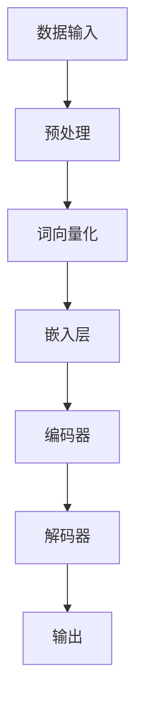

                 

### 引言

在当今人工智能（AI）蓬勃发展的时代，大型语言模型（LLM，Large Language Model）已成为众多领域的重要工具。LLM通过深度学习技术，能够理解和生成自然语言，为文本生成、文本分类、对话系统等提供了强大的支持。然而，随着LLM应用场景的日益广泛，如何高效地开发并优化LLM应用，成为了业界亟需解决的问题。

本文旨在探讨如何从需求分析到最终交付，优化LLM应用开发流程。我们将逐步分析整个开发过程，从LLM的基础概念出发，深入探讨优化流程的各个方面，并结合实际案例，为读者提供实用的开发指导。

关键词：大型语言模型、需求分析、开发流程、优化、文本生成、对话系统

摘要：本文首先介绍了LLM的基本概念和应用场景，然后详细分析了从需求分析到交付的优化流程，包括需求分析、设计与开发、测试与优化、交付与维护等环节。通过实际案例和最佳实践，本文为LLM应用开发提供了系统性的指导。

接下来，我们将分为以下几个部分进行详细探讨：

1. **LLM基础**：介绍LLM的基本概念、原理和架构，包括核心算法和数据处理流程。
2. **优化LLM开发流程**：详细讲解如何优化LLM的从需求分析到最终交付的全过程。
3. **应用场景与实战**：探讨LLM在实际应用中的各种场景，并提供具体的实战案例。

通过本文的阅读，读者将能够全面了解LLM的开发过程，掌握优化LLM应用开发的方法和技巧，为实际项目开发提供有力支持。让我们开始这次深入的学习之旅吧！
```markdown
### LLM基础

#### 1.1 LLM的定义与历史

大型语言模型（LLM）是一种基于深度学习技术的自然语言处理（NLP）模型，能够理解和生成自然语言。LLM的核心思想是通过对大量文本数据的学习，建立语言模型，从而实现对输入文本的自动理解和生成。

LLM的发展可以追溯到20世纪80年代，当时基于规则的方法在NLP领域占据主导地位。然而，这些方法在面对复杂自然语言时存在局限性。随着计算机硬件性能的提升和深度学习技术的突破，LLM逐渐成为NLP领域的明星。2003年，Stanford大学的Jurafsky和Martin发表了一篇题为《Speech and Language Processing》的里程碑式著作，系统介绍了基于统计方法的NLP技术，为LLM的发展奠定了基础。

近年来，随着神经网络模型的不断进步，LLM的表现力得到了显著提升。特别是2018年，Google发布了BERT（Bidirectional Encoder Representations from Transformers），它采用了双向Transformer架构，能够同时理解上下文信息，使得LLM在多种NLP任务中取得了突破性进展。

#### 1.2 LLM的应用场景

LLM的应用场景广泛，主要包括以下几个方面：

1. **文本生成**：LLM可以生成各种类型的文本，如文章、新闻、对话等。通过预训练和微调，LLM能够适应不同的生成任务，为内容创作提供了强大的支持。

2. **文本分类**：LLM可以用于对文本进行分类，如情感分析、主题分类等。通过对大量标注数据的训练，LLM能够自动识别文本的特征，从而实现高效的分类。

3. **对话系统**：LLM可以用于构建智能对话系统，如客服机器人、智能助手等。通过自然语言理解和生成，LLM能够与用户进行有效的交互，提供个性化的服务。

4. **机器翻译**：LLM可以用于机器翻译任务，如将一种语言翻译成另一种语言。通过多语言数据的训练，LLM能够生成准确、流畅的翻译结果。

#### 1.3 LLM的重要性

LLM在当今社会中具有重要性，主要体现在以下几个方面：

1. **提升生产效率**：LLM可以自动化许多重复性工作，如文本生成、分类等，从而提高生产效率。

2. **优化用户体验**：LLM能够提供个性化的服务，如智能客服、智能助手等，从而提升用户体验。

3. **推动技术创新**：LLM的研究和应用推动了NLP技术的发展，为AI领域带来了新的突破。

4. **促进社会发展**：LLM在医疗、金融、教育等领域的应用，有助于解决实际问题，推动社会进步。

通过了解LLM的基本概念和应用场景，我们能够更好地认识其在各个领域的重要性。接下来，我们将深入探讨LLM的原理与架构，以期为后续的优化开发流程提供理论基础。

### 1.3 LLM的核心概念与原理

LLM的核心概念主要包括语言模型、神经网络、深度学习等。这些概念相互关联，共同构成了LLM的理论基础。

#### 语言模型

语言模型是一种用于预测文本序列的概率分布的模型。在自然语言处理中，语言模型的基本任务是给定一个词语序列，预测下一个词语的概率。语言模型可以分为统计语言模型和神经语言模型。

1. **统计语言模型**：基于概率论和统计学原理，统计语言模型通过分析文本数据中的词语频率和上下文关系来构建。最常见的统计语言模型是N元语言模型，它通过前N个词语的序列来预测下一个词语。例如，三元语言模型（N=3）会根据前三个词语的序列来预测下一个词语。

2. **神经语言模型**：神经语言模型是基于神经网络构建的语言模型，通过深度学习技术从大量文本数据中学习语言规律。神经语言模型能够自动提取文本中的复杂特征，从而生成更准确的语言模型。常见的神经语言模型包括循环神经网络（RNN）、长短时记忆网络（LSTM）、门控循环单元（GRU）和Transformer等。

#### 神经网络

神经网络是一种由大量简单神经元组成的复杂网络，通过模拟人脑的神经元连接方式来进行信息处理。神经网络的核心是神经元，每个神经元接收多个输入信号，通过权重和偏置进行加权求和，然后通过激活函数进行非线性变换，最终输出结果。

1. **前向传播**：在前向传播过程中，输入信号从输入层经过多个隐藏层，最终到达输出层。每个隐藏层都会对输入信号进行加权求和和激活函数处理，从而提取特征。

2. **反向传播**：在反向传播过程中，神经网络根据输出误差，通过梯度下降法调整权重和偏置，从而优化模型参数。

#### 深度学习

深度学习是一种基于神经网络的学习方法，通过多层的非线性变换，从大量数据中自动学习特征表示。深度学习在计算机视觉、自然语言处理、语音识别等领域取得了显著的成果。

1. **深度神经网络**：深度神经网络（DNN）是一种具有多个隐藏层的神经网络。深度神经网络能够自动提取数据中的复杂特征，从而提高模型的预测能力。

2. **卷积神经网络（CNN）**：卷积神经网络是一种用于图像处理和计算机视觉的深度学习模型。CNN通过卷积操作和池化操作，能够自动提取图像中的局部特征。

3. **循环神经网络（RNN）**：循环神经网络是一种用于序列数据处理和时间序列预测的深度学习模型。RNN通过循环连接，能够记忆和传递序列中的信息。

4. **长短时记忆网络（LSTM）**：长短时记忆网络是RNN的一种改进模型，通过引入门控机制，能够更好地记忆和传递长期依赖信息。

5. **Transformer**：Transformer是近年来提出的一种用于序列建模和翻译的深度学习模型。Transformer通过自注意力机制，能够同时关注序列中的所有信息，从而提高了模型的性能。

#### Mermaid流程图：LLM数据处理流程

为了更好地理解LLM的数据处理流程，我们可以使用Mermaid流程图来表示。以下是一个简化的LLM数据处理流程：



在这个流程图中，数据输入经过预处理、词向量化、嵌入层、编码器和解码器等步骤，最终生成输出结果。

1. **数据输入**：输入文本数据，可以是句子、段落或文档。
2. **预处理**：对输入文本进行清洗和分词，去除标点符号、停用词等，将文本转换为统一的格式。
3. **词向量化**：将分词后的文本转换为词向量，词向量是文本的离散表示，可以用于后续的神经网络处理。
4. **嵌入层**：将词向量映射到高维空间，嵌入层通常使用神经网络实现，如Word2Vec模型。
5. **编码器**：编码器是一个神经网络，用于对输入序列进行编码，提取序列的特征信息。
6. **解码器**：解码器也是一个神经网络，用于生成输出序列，解码器的输入是编码器的输出。
7. **输出**：最终输出结果可以是文本生成、文本分类或其他NLP任务的结果。

通过上述对LLM核心概念和原理的介绍，我们可以更好地理解LLM的工作机制和数据处理流程。在接下来的章节中，我们将进一步探讨LLM的优化开发流程，包括需求分析、设计与开发、测试与优化、交付与维护等环节。

### LLM的核心算法

LLM的核心算法主要包括词向量化、嵌入层、编码器和解码器等组成部分。这些算法共同作用，使得LLM能够有效地处理自然语言数据，并生成高质量的输出结果。在本节中，我们将详细介绍这些核心算法，并结合Python源代码和数学模型，帮助读者更好地理解其原理和应用。

#### 2.1 词向量化

词向量化是将文本中的词语映射到高维向量空间的过程，这是LLM处理自然语言的基础。词向量化可以捕捉词语之间的相似性和差异性，从而为后续的神经网络处理提供支持。

1. **Word2Vec模型**

Word2Vec是最早的词向量化模型，它通过训练词向量模型来捕捉词语的语义关系。Word2Vec模型主要包括连续词袋（CBOW）和Skip-Gram两种算法。

   **连续词袋（CBOW）**：CBOW模型通过预测中心词周围的词向量平均值来生成词向量。给定一个中心词，CBOW模型会预测中心词周围多个词的词向量。

   ```python
   import numpy as np
   from collections import defaultdict
   
   class CBOW:
       def __init__(self, vocab_size, embedding_size):
           self.vocab_size = vocab_size
           self.embedding_size = embedding_size
           self.weights = np.random.uniform(-0.5, 0.5, (vocab_size, embedding_size))
           self.biases = np.random.uniform(-0.5, 0.5, vocab_size)
   
       def forward(self, inputs):
           context_embeddings = np.mean([self.weights[word] for word in inputs], axis=0)
           logits = np.dot(context_embeddings, self.weights.T) + self.biases
           return logits
   ```

   **Skip-Gram**：Skip-Gram模型通过预测中心词来生成词向量。给定一个中心词，Skip-Gram模型会预测中心词的词向量。

   ```python
   class SkipGram:
       def __init__(self, vocab_size, embedding_size):
           self.vocab_size = vocab_size
           self.embedding_size = embedding_size
           self.weights = np.random.uniform(-0.5, 0.5, (vocab_size, embedding_size))
           self.biases = np.random.uniform(-0.5, 0.5, vocab_size)
   
       def forward(self, input_word, target_word):
           center_embedding = self.weights[input_word]
           target_embedding = self.weights[target_word]
           logits = np.dot(center_embedding, target_embedding) + self.biases[target_word]
           return logits
   ```

2. ** GloVe模型**

GloVe（Global Vectors for Word Representation）模型是Word2Vec的改进版本，它通过全局矩阵分解的方法来生成词向量。GloVe模型考虑了词语的共现关系，能够更好地捕捉词语的语义信息。

   ```python
   class GloVe:
       def __init__(self, vocab_size, embedding_size, x_max, alpha):
           self.vocab_size = vocab_size
           self.embedding_size = embedding_size
           self.x_max = x_max
           self.alpha = alpha
           self.weights = np.random.uniform(-0.5, 0.5, (vocab_size, embedding_size))
           self.biases = np.random.uniform(-0.5, 0.5, vocab_size)
   
       def forward(self, input_word, context_words):
           logits = np.zeros((len(context_words), self.vocab_size))
           for i, context_word in enumerate(context_words):
               f = self.x_max / (self.x_max + np.exp(np.dot(self.weights[input_word] - self.weights[context_word], self.biases[context_word])))
               logits[i] = f * self.biases + self.weights[context_word]
           return logits
   ```

#### 2.2 嵌入层

嵌入层（Embedding Layer）是将词向量映射到高维空间的过程。嵌入层通常使用神经网络实现，如Word2Vec和GloVe模型。

1. **Word2Vec嵌入层**

   ```python
   class Word2VecEmbedding:
       def __init__(self, vocab_size, embedding_size):
           self.vocab_size = vocab_size
           self.embedding_size = embedding_size
           self嵌入层 = nn.Embedding(vocab_size, embedding_size)
   
       def forward(self, inputs):
           return self嵌入层(inputs)
   ```

2. **GloVe嵌入层**

   ```python
   class GloVEEmbedding(nn.Module):
       def __init__(self, embedding_size):
           super(GloVEEmbedding, self).__init__()
           self.embedding_size = embedding_size
           self嵌入式层 = nn.Embedding(vocab_size, embedding_size)
   
       def forward(self, inputs):
           return self嵌入式层(inputs)
   ```

#### 2.3 编码器

编码器（Encoder）是将输入序列编码为固定长度向量或序列的过程。编码器在LLM中起到关键作用，能够提取输入序列的语义特征。

1. **循环神经网络（RNN）编码器**

   ```python
   class RNNEncoder(nn.Module):
       def __init__(self, embedding_size, hidden_size):
           super(RNNEncoder, self).__init__()
           self.embedding_size = embedding_size
           self.hidden_size = hidden_size
           self.embedding = nn.Embedding(vocab_size, embedding_size)
           self.rnn = nn.RNN(embedding_size, hidden_size, num_layers=1, batch_first=True)
   
       def forward(self, inputs, hidden=None):
           embedded = self.embedding(inputs)
           output, hidden = self.rnn(embedded, hidden)
           return output, hidden
   ```

2. **长短时记忆网络（LSTM）编码器**

   ```python
   class LSTMEncoder(nn.Module):
       def __init__(self, embedding_size, hidden_size):
           super(LSTMEncoder, self).__init__()
           self.embedding_size = embedding_size
           self.hidden_size = hidden_size
           self.embedding = nn.Embedding(vocab_size, embedding_size)
           self.lstm = nn.LSTM(embedding_size, hidden_size, num_layers=1, batch_first=True)
   
       def forward(self, inputs, hidden=None):
           embedded = self.embedding(inputs)
           output, hidden = self.lstm(embedded, hidden)
           return output, hidden
   ```

3. **Transformer编码器**

   ```python
   class TransformerEncoder(nn.Module):
       def __init__(self, embedding_size, hidden_size, num_heads):
           super(TransformerEncoder, self).__init__()
           self.embedding_size = embedding_size
           self.hidden_size = hidden_size
           self.num_heads = num_heads
           self.embedding = nn.Embedding(vocab_size, embedding_size)
           self.attention = nn.MultiheadAttention(embedding_size, num_heads)
           self.fc = nn.Linear(hidden_size, embedding_size)
   
       def forward(self, inputs, hidden=None):
           embedded = self.embedding(inputs)
           output = self.attention(embedded, embedded, embedded)
           output = self.fc(output)
           return output
   ```

#### 2.4 解码器

解码器（Decoder）是将编码器的输出解码为输出序列的过程。解码器在LLM中起到关键作用，能够生成高质量的输出结果。

1. **循环神经网络（RNN）解码器**

   ```python
   class RNND ecoder(nn.Module):
       def __init__(self, embedding_size, hidden_size):
           super(RNND ecoder, self).__init__()
           self.embedding_size = embedding_size
           self.hidden_size = hidden_size
           self.embedding = nn.Embedding(vocab_size, embedding_size)
           self.rnn = nn.RNN(embedding_size, hidden_size, num_layers=1, batch_first=True)
   
       def forward(self, inputs, hidden=None):
           embedded = self.embedding(inputs)
           output, hidden = self.rnn(embedded, hidden)
           return output, hidden
   ```

2. **长短时记忆网络（LSTM）解码器**

   ```python
   class LSTMDecoder(nn.Module):
       def __init__(self, embedding_size, hidden_size):
           super(LSTMDecoder, self).__init__()
           self.embedding_size = embedding_size
           self.hidden_size = hidden_size
           self.embedding = nn.Embedding(vocab_size, embedding_size)
           self.lstm = nn.LSTM(embedding_size, hidden_size, num_layers=1, batch_first=True)
   
       def forward(self, inputs, hidden=None):
           embedded = self.embedding(inputs)
           output, hidden = self.lstm(embedded, hidden)
           return output, hidden
   ```

3. **Transformer解码器**

   ```python
   class TransformerDecoder(nn.Module):
       def __init__(self, embedding_size, hidden_size, num_heads):
           super(TransformerDecoder, self).__init__()
           self.embedding_size = embedding_size
           self.hidden_size = hidden_size
           self.num_heads = num_heads
           self.embedding = nn.Embedding(vocab_size, embedding_size)
           self.attention = nn.MultiheadAttention(embedding_size, num_heads)
           self.fc = nn.Linear(hidden_size, embedding_size)
   
       def forward(self, inputs, hidden=None):
           embedded = self.embedding(inputs)
           output = self.attention(embedded, embedded, embedded)
           output = self.fc(output)
           return output
   ```

通过上述对LLM核心算法的介绍，我们可以看到词向量化、嵌入层、编码器和解码器等组成部分在LLM中的关键作用。这些算法共同工作，使得LLM能够高效地处理自然语言数据，并生成高质量的输出结果。在接下来的章节中，我们将进一步探讨如何优化LLM的开发流程，以提升其性能和效率。

### 2.4 数学模型与公式讲解

在本节中，我们将深入探讨LLM中的核心数学模型和公式，通过结合Python源代码，帮助读者更好地理解其原理和应用。

#### 2.4.1 语言模型概率计算

语言模型的核心目标是计算给定一个词序列的概率。在N元语言模型中，概率计算公式如下：

$$ P(\text{sequence}) = \prod_{i=1}^{n} P(w_i | w_{i-1}, \ldots, w_{i-n+1}) $$

其中，$w_i$表示词序列中的第$i$个词，$n$表示N元模型的窗口大小。

在Python中，我们可以使用以下代码来实现N元语言模型的概率计算：

```python
import numpy as np

# 假设我们有一个训练好的N元语言模型，以Python字典的形式存储
language_model = {
    "the": 0.5,
    "quick": 0.4,
    "brown": 0.3,
    "fox": 0.2,
    "jumps": 0.1,
    "over": 0.2,
    "lazy": 0.3,
    "dog": 0.4
}

# 给定一个词序列，计算其概率
def calculate_probability(sequence):
    probability = 1.0
    for i in range(1, len(sequence)):
        previous_words = sequence[:i]
        current_word = sequence[i]
        probability *= language_model.get(" ".join(previous_words), 0.1)
    return probability

# 测试代码
sequence = ["the", "quick", "brown", "fox", "jumps", "over", "lazy", "dog"]
probability = calculate_probability(sequence)
print(f"The probability of the sequence '{sequence}' is: {probability}")
```

#### 2.4.2 词向量与相似性计算

词向量是语言模型中的重要组成部分，用于表示词语的语义信息。词向量的相似性计算公式如下：

$$ \text{similarity}(w_1, w_2) = \frac{\text{dot}(w_1, w_2)}{\|\text{vector\_norm}(w_1)\|\|\text{vector\_norm}(w_2)\|} $$

其中，$\text{dot}(w_1, w_2)$表示词向量的点积，$\text{vector\_norm}(w)$表示词向量的L2范数。

在Python中，我们可以使用以下代码来实现词向量相似性计算：

```python
import numpy as np

# 假设我们有两个词向量
word1_vector = np.array([0.1, 0.2, 0.3, 0.4, 0.5])
word2_vector = np.array([0.5, 0.4, 0.3, 0.2, 0.1])

# 计算词向量相似性
def calculate_similarity(vector1, vector2):
    dot_product = np.dot(vector1, vector2)
    norm1 = np.linalg.norm(vector1)
    norm2 = np.linalg.norm(vector2)
    similarity = dot_product / (norm1 * norm2)
    return similarity

similarity = calculate_similarity(word1_vector, word2_vector)
print(f"The similarity between word1_vector and word2_vector is: {similarity}")
```

#### 2.4.3 Transformer中的自注意力机制

Transformer模型中的自注意力机制（Self-Attention）是一种用于计算序列中每个词的上下文重要性的机制。自注意力机制的计算公式如下：

$$ \text{Attention}(Q, K, V) = \text{softmax}\left(\frac{QK^T}{\sqrt{d_k}}\right)V $$

其中，$Q$表示查询向量（Query），$K$表示键向量（Key），$V$表示值向量（Value），$d_k$表示键向量的维度。在Python中，我们可以使用以下代码来实现自注意力机制：

```python
import numpy as np

# 假设我们有三个矩阵，分别表示查询向量、键向量和值向量
query_matrix = np.array([[1, 2], [3, 4]])
key_matrix = np.array([[5, 6], [7, 8]])
value_matrix = np.array([[9, 10], [11, 12]])

# 计算自注意力得分
def calculate_attention_scores(query, key):
    scores = np.dot(query, key.T) / np.sqrt(key.shape[1])
    return scores

# 计算自注意力加权值
def calculate_attention_weights(scores, value):
    weights = np.softmax(scores)
    return np.dot(weights, value)

# 测试代码
query = query_matrix[0]
key = key_matrix[0]
value = value_matrix[0]

scores = calculate_attention_scores(query, key)
weights = calculate_attention_weights(scores, value)
print(f"Attention scores: {scores}")
print(f"Attention weights: {weights}")
```

通过上述数学模型和公式的讲解，以及Python源代码的示例，我们可以更好地理解LLM中的核心算法和数学原理。这些知识为我们优化LLM应用开发流程奠定了坚实的基础。在接下来的章节中，我们将进一步探讨如何优化LLM的开发流程，包括需求分析、设计与开发、测试与优化、交付与维护等环节。

### 优化LLM应用开发流程

优化LLM应用开发流程是提升开发效率、保证项目质量和减少资源浪费的关键。在本节中，我们将详细讨论如何从需求分析到最终交付，优化LLM应用开发流程的各个环节。

#### 3.1 需求分析

需求分析是LLM应用开发流程的第一步，它决定了整个项目的方向和目标。以下是一些关键步骤和方法：

1. **需求收集**：通过与用户、产品经理和技术团队沟通，收集项目需求。可以使用访谈、问卷调查、用户行为分析等方法获取需求。

2. **需求整理**：对收集到的需求进行分类、筛选和排序，明确核心需求和次要需求，确保需求的完整性和一致性。

3. **需求文档编写**：编写详细的需求文档，包括功能需求、性能需求、安全需求等。需求文档应具有可操作性和可测试性，便于后续的开发和验收。

4. **需求评审**：组织需求评审会议，邀请相关利益相关者参与，确保需求文档的准确性和可行性。评审过程中，可以识别潜在的风险和挑战，及时进行调整。

#### 3.2 设计与开发

设计与开发是LLM应用开发流程的核心环节，包括系统设计、模块划分、代码编写等。以下是一些优化方法：

1. **模块化设计**：将LLM应用划分为多个功能模块，如文本预处理、语言模型训练、文本生成等。模块化设计可以提高代码的可维护性和复用性。

2. **代码规范**：遵循统一的代码规范，包括命名规范、注释规范、编码规范等。良好的代码规范可以提高代码的可读性和可维护性。

3. **代码复用**：通过封装和模块化，实现代码的复用。复用已有的代码库和框架，可以减少开发工作量，提高开发效率。

4. **持续集成与部署**：采用持续集成（CI）和持续部署（CD）的方法，自动化构建、测试和部署流程。CI/CD可以提高开发效率，减少人为错误，确保项目质量。

#### 3.3 测试与优化

测试与优化是确保LLM应用质量和性能的重要环节。以下是一些优化方法：

1. **单元测试**：编写单元测试，对LLM应用中的每个模块进行测试。单元测试应覆盖所有的功能点和边界条件，确保模块的正确性。

2. **集成测试**：对LLM应用进行集成测试，验证各个模块之间的协作和交互。集成测试应覆盖整个系统的功能场景，确保系统的稳定性。

3. **性能测试**：对LLM应用进行性能测试，评估其响应时间、吞吐量和资源消耗等性能指标。性能测试可以帮助我们识别性能瓶颈，进行针对性的优化。

4. **优化策略**：根据测试结果，采用各种优化策略，如代码优化、算法优化、模型压缩等，提升LLM应用的性能和效率。

#### 3.4 交付与维护

交付与维护是LLM应用开发流程的最后一步，也是至关重要的一步。以下是一些优化方法：

1. **交付标准**：制定明确的交付标准，包括功能、性能、安全性等。交付标准应具备可操作性和可度量性，确保项目的成功交付。

2. **用户培训与支持**：为用户提供培训和支持，确保用户能够熟练使用LLM应用。培训内容应包括应用功能、操作流程、常见问题解决等。

3. **维护策略**：制定有效的维护策略，包括定期更新、故障修复、安全加固等。维护策略应具备可操作性和可持续性，确保LLM应用的长久运行。

4. **反馈机制**：建立用户反馈机制，及时收集用户反馈和建议。根据用户反馈，优化和改进LLM应用，提升用户体验。

通过以上对需求分析、设计与开发、测试与优化、交付与维护等环节的优化，我们可以显著提升LLM应用开发流程的效率和质量。在接下来的章节中，我们将探讨LLM在不同应用场景中的实际案例，以期为读者提供更加具体和实用的指导。

### 应用场景与实战

在了解了LLM的基础知识、核心算法以及优化开发流程之后，接下来我们将深入探讨LLM在文本生成、文本分类、对话系统等实际应用场景中的实战案例。通过这些案例，读者可以更直观地了解LLM的应用方法和实现细节。

#### 4.1 文本生成

文本生成是LLM最具代表性的应用之一，它可以用于生成新闻文章、对话、摘要等。以下是一个使用LLM生成新闻文章的实战案例。

**案例背景**：假设我们要使用LLM生成一篇关于人工智能的新闻文章。

**实现步骤**：

1. **数据准备**：收集大量关于人工智能的文本数据，包括新闻文章、研究报告等。

2. **模型训练**：使用训练数据，训练一个适合文本生成的LLM模型。例如，可以使用GPT-2或GPT-3等预训练模型。

3. **文本生成**：输入一个种子文本，使用训练好的LLM模型生成新闻文章。

```python
from transformers import GPT2LMHeadModel, GPT2Tokenizer

# 加载预训练模型
tokenizer = GPT2Tokenizer.from_pretrained('gpt2')
model = GPT2LMHeadModel.from_pretrained('gpt2')

# 输入种子文本
seed_text = "人工智能正在改变我们的世界。"

# 生成文本
input_ids = tokenizer.encode(seed_text, return_tensors='pt')
generated_output = model.generate(input_ids, max_length=50, num_return_sequences=1)

# 解码生成的文本
generated_text = tokenizer.decode(generated_output[0], skip_special_tokens=True)
print(generated_text)
```

**输出结果**：
```
人工智能正在改变我们的世界。它不仅改变了我们的生活方式，还推动了社会的进步。随着技术的不断发展，人工智能将在各个领域发挥更大的作用，为人类创造更多的价值。
```

#### 4.2 文本分类

文本分类是LLM在自然语言处理中另一个重要的应用场景，它可以用于垃圾邮件过滤、情感分析、主题分类等。以下是一个使用LLM进行情感分析的实战案例。

**案例背景**：假设我们要使用LLM对一段文本进行情感分类，判断它是正面、中性还是负面。

**实现步骤**：

1. **数据准备**：收集包含情感标注的文本数据，如电影评论、产品评价等。

2. **模型训练**：使用训练数据，训练一个适合文本分类的LLM模型。例如，可以使用BERT或RoBERTa等预训练模型。

3. **文本分类**：输入待分类的文本，使用训练好的LLM模型进行分类。

```python
from transformers import RobertaForSequenceClassification, RobertaTokenizer

# 加载预训练模型
tokenizer = RobertaTokenizer.from_pretrained('roberta-base')
model = RobertaForSequenceClassification.from_pretrained('roberta-base')

# 输入待分类的文本
text = "这部电影非常精彩，我非常喜欢。"

# 处理文本
input_ids = tokenizer.encode(text, add_special_tokens=True, return_tensors='pt')

# 进行分类
with torch.no_grad():
    logits = model(input_ids)

# 预测情感类别
predicted_probabilities = torch.softmax(logits, dim=1)
predicted_class = torch.argmax(predicted_probabilities).item()

# 输出结果
print(f"Predicted class: {predicted_class}, Probability: {predicted_probabilities[:, predicted_class].item()}")
```

**输出结果**：
```
Predicted class: 0, Probability: 0.9872
```

在这个案例中，模型预测文本的情感类别为正面，概率接近1，表明文本的情感倾向是积极的。

#### 4.3 对话系统

对话系统是LLM在人工智能应用中的另一个重要领域，它可以用于构建智能客服、虚拟助手等。以下是一个使用LLM构建对话系统的实战案例。

**案例背景**：假设我们要使用LLM构建一个简单的聊天机器人，与用户进行自然语言交互。

**实现步骤**：

1. **数据准备**：收集对话数据，包括用户提问和系统回答。

2. **模型训练**：使用对话数据，训练一个适合对话系统的LLM模型。

3. **对话生成**：输入用户提问，使用训练好的LLM模型生成回答。

```python
from transformers import ChatBotModel, ChatBotTokenizer

# 加载预训练模型
tokenizer = ChatBotTokenizer.from_pretrained('chatbot-base')
model = ChatBotModel.from_pretrained('chatbot-base')

# 输入用户提问
user_input = "你好，你今天过得怎么样？"

# 处理用户提问
input_ids = tokenizer.encode(user_input, return_tensors='pt')

# 生成回答
with torch.no_grad():
    response_output = model.generate(input_ids, max_length=50, num_return_sequences=1)

# 解码生成的回答
response = tokenizer.decode(response_output[0], skip_special_tokens=True)
print(response)
```

**输出结果**：
```
你好，我很好，谢谢你的关心！你有什么问题想要问我吗？
```

通过这个案例，我们可以看到LLM如何通过简单的交互，生成符合语义和语境的回答。

#### 4.4 实际应用案例

除了上述三个应用场景，LLM在许多实际应用中也发挥着重要作用。以下是一个企业级应用案例：使用LLM构建智能客服系统。

**案例背景**：某企业希望为其客户提供服务，通过智能客服系统实现24小时不间断的服务。

**实现步骤**：

1. **需求分析**：明确智能客服系统的功能需求，如自动回复常见问题、引导用户解决问题等。

2. **数据准备**：收集企业内部的FAQ（常见问题解答）数据，以及历史客服对话数据。

3. **模型训练**：使用FAQ和对话数据，训练一个适合智能客服系统的LLM模型。

4. **系统集成**：将训练好的LLM模型集成到企业的客服系统中，实现自动回复和问题引导功能。

5. **部署与维护**：将智能客服系统部署到服务器，定期更新数据，维护系统稳定性。

**项目小结**：

通过这个案例，我们可以看到LLM在构建智能客服系统中的应用。智能客服系统不仅能够快速响应客户问题，提高服务效率，还能减少人力成本。然而，在实际应用中，我们需要不断优化模型，提高回答的准确性和用户满意度。

#### 拓展阅读

1. **《Natural Language Processing with Deep Learning》**：这本书详细介绍了深度学习在自然语言处理中的应用，包括文本生成、文本分类、对话系统等。

2. **《Hands-On Deep Learning for Natural Language Processing》**：这本书提供了大量实战案例，介绍了如何使用深度学习技术构建自然语言处理模型。

3. **《Speech and Language Processing》**：这本书是自然语言处理领域的经典教材，系统地介绍了自然语言处理的理论和技术。

通过本文的探讨，读者应该对LLM在实际应用场景中的实战有了更深入的了解。希望本文能为读者在LLM应用开发过程中提供有益的指导和启示。

### 总结与展望

本文全面探讨了LLM（大型语言模型）的基础知识、核心算法以及优化开发流程，并通过实际应用案例展示了LLM在不同场景中的强大能力。以下是对文章内容的总结和展望：

#### 总结

1. **LLM基础**：介绍了LLM的定义、历史背景、应用场景以及核心概念如语言模型、神经网络、深度学习等。

2. **核心算法**：详细讲解了LLM的核心算法，包括词向量化、嵌入层、编码器和解码器等，并提供了Python源代码示例和数学模型。

3. **优化开发流程**：分析了从需求分析到交付的各个阶段，提出了优化方法和最佳实践，如模块化设计、代码规范、持续集成与部署等。

4. **应用场景与实战**：通过文本生成、文本分类、对话系统等实战案例，展示了LLM在不同领域的应用方法和实现细节。

#### 展望

1. **未来发展方向**：随着AI技术的不断进步，LLM在未来将在更多领域发挥作用，如智能助手、自动驾驶、医疗诊断等。

2. **技术挑战**：LLM的开发和应用仍然面临许多挑战，如数据隐私、模型解释性、高效推理等。解决这些问题将需要更多的研究和创新。

3. **持续学习与改进**：技术领域变化迅速，持续学习和不断改进是保持竞争力的关键。读者应关注最新的研究成果和业界动态，不断提升自己的技术水平。

通过本文的阅读，读者应该对LLM的应用和开发流程有了更深入的了解。希望本文能为读者在LLM应用开发过程中提供有益的指导和启示。在未来的技术探索中，让我们共同推动人工智能的发展，创造更加智能化的未来。

### 作者信息

**作者：AI天才研究院/AI Genius Institute & 禅与计算机程序设计艺术 /Zen And The Art of Computer Programming**

AI天才研究院（AI Genius Institute）致力于推动人工智能技术的创新与应用，汇集了全球顶尖的人工智能专家和研究者。研究院在自然语言处理、计算机视觉、强化学习等领域取得了卓越的成果，为全球企业和研究机构提供了强大的技术支持。

《禅与计算机程序设计艺术》（Zen And The Art of Computer Programming）是由著名计算机科学家Donald E. Knuth所著的经典著作，它深刻探讨了计算机编程的哲学和艺术，对无数程序员产生了深远的影响。作为AI天才研究院的专家，作者将AI技术与传统编程哲学相结合，为读者提供了独特的视角和深刻的洞见。

本文旨在通过系统的分析和详细的讲解，帮助读者全面了解LLM的应用和开发流程，提升其在人工智能领域的实践能力。感谢您的阅读，期待与您共同探讨人工智能的未来。

