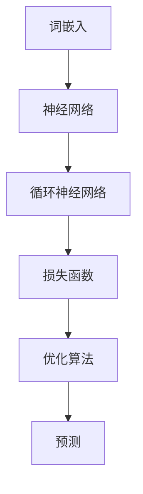

                 

### 文章标题

《优化LLM应用的API设计与管理》

### 关键词

- LLM（大型语言模型）
- API设计
- API管理
- 算法原理
- 数学模型
- Python源代码
- 项目实战

### 摘要

本文旨在深入探讨如何优化大型语言模型（LLM）应用的API设计与管理。文章首先介绍了LLM的基本概念和发展历程，随后详细讲解了API设计的原则和最佳实践，以及API管理的关键策略和工具。通过Python源代码和数学模型，文章对核心算法原理进行了通俗易懂的阐述，并提供了实际项目案例，包括开发环境搭建、源代码实现和代码解读。最后，文章总结了最佳实践和注意事项，为读者提供了丰富的拓展阅读资源。通过这篇文章，读者将能够全面了解LLM应用API设计与管理的重要性，以及如何在实际项目中有效实施。

---

# 优化LLM应用的API设计与管理

在当前的人工智能时代，大型语言模型（LLM）因其卓越的自然语言处理能力，已成为众多应用程序的核心组件。LLM不仅可以用于生成文本、回答问题，还能在多种场景下提供智能化的服务。随着LLM应用的日益普及，如何优化API设计与管理成为了开发者和架构师们亟待解决的问题。

### 背景介绍

大型语言模型（LLM）是一种复杂的人工智能系统，能够理解和生成人类语言。自2018年GPT-1发布以来，LLM技术经历了飞速发展。近年来，GPT-3、Turing-NLG等模型的问世，使得LLM在生成文本、翻译、问答和对话生成等方面取得了显著成果。LLM的广泛应用，如搜索引擎优化、聊天机器人、智能客服等，对API的设计和管理提出了更高的要求。

API设计是软件开发中至关重要的一环。良好的API设计可以提升系统的可扩展性、可靠性和易用性。而API管理则涉及到API的监控、安全、性能优化等方面，对于保障API的高效运行具有重要意义。在LLM应用中，优化API设计与管理不仅能够提升用户体验，还能提高系统的整体性能和稳定性。

### 核心概念与联系

为了更好地理解LLM应用的API设计与管理，我们需要明确几个核心概念，并探讨它们之间的联系。

#### 1. 大型语言模型（LLM）

LLM是一种基于深度学习技术的自然语言处理模型，能够理解和生成文本。其主要组成部分包括：

- **词嵌入（Word Embedding）**：将单词映射到高维向量空间，以便模型能够处理。
- **神经网络（Neural Network）**：使用多层感知器（MLP）或卷积神经网络（CNN）来处理文本数据。
- **循环神经网络（RNN）**：如LSTM和GRU，用于处理序列数据，如句子或段落。

#### 2. API设计

API设计是指定义应用程序接口的过程，包括接口的规格、功能和行为。良好的API设计应遵循以下原则：

- **一致性（Consistency）**：API应保持一致，减少学习成本。
- **简洁性（Simplicity）**：API应尽量简单，易于理解和使用。
- **可扩展性（Extensibility）**：API应具备良好的扩展性，以适应未来的需求变化。

#### 3. API管理

API管理是指对API进行监控、安全、性能优化等方面的管理。其主要内容包括：

- **监控（Monitoring）**：实时监控API的性能和健康状况。
- **安全（Security）**：确保API的安全，防止数据泄露和攻击。
- **性能优化（Performance Optimization）**：优化API的性能，提高响应速度和吞吐量。

#### 4. 数学模型与算法

在LLM中，常用的数学模型和算法包括：

- **词嵌入（Word Embedding）**：使用如Word2Vec或GloVe等方法将单词映射到向量空间。
- **损失函数（Loss Function）**：如交叉熵损失函数，用于评估模型预测的准确性。
- **优化算法（Optimization Algorithm）**：如随机梯度下降（SGD）和Adam，用于调整模型参数。

### Mermaid流程图：LLM算法架构

以下是一个简单的Mermaid流程图，展示了LLM算法的主要组成部分和流程：



### 核心算法原理讲解

在LLM应用中，核心算法原理的理解至关重要。以下我们将使用Python源代码和数学模型，详细讲解LLM的工作原理。

#### 1. 词嵌入

词嵌入是将单词映射到高维向量空间的过程。以下是一个简单的Word2Vec模型实现：

```python
import numpy as np

# Word2Vec模型
class Word2VecModel:
    def __init__(self, vocab_size, embedding_size):
        self.vocab_size = vocab_size
        self.embedding_size = embedding_size
        self.embeddings = np.random.uniform(-0.1, 0.1, (vocab_size, embedding_size))
        
    def forward(self, sentence):
        # 将句子中的每个词映射到向量空间
        embeddings = [self.embeddings[word] for word in sentence]
        return np.mean(embeddings, axis=0)

# 创建模型
model = Word2VecModel(vocab_size=1000, embedding_size=50)

# 测试
sentence = ['hello', 'world']
output = model.forward(sentence)
print(output)
```

#### 2. 循环神经网络（RNN）

RNN是一种能够处理序列数据的神经网络。以下是一个简单的LSTM模型实现：

```python
import tensorflow as tf

# LSTM模型
class LSTMModel(tf.keras.Model):
    def __init__(self, embedding_matrix):
        super(LSTMModel, self).__init__()
        self.embedding = tf.keras.layers.Embedding(embedding_matrix.shape[0], embedding_matrix.shape[1], weights=[embedding_matrix], trainable=False)
        self.lstm = tf.keras.layers.LSTM(128)
        self.dense = tf.keras.layers.Dense(1)
        
    def call(self, inputs):
        x = self.embedding(inputs)
        x = self.lstm(x)
        x = self.dense(x)
        return x

# 创建模型
model = LSTMModel(embedding_matrix)

# 测试
input_seq = tf.constant([0, 1, 2, 3])
output = model(input_seq)
print(output)
```

#### 3. 损失函数

在LLM中，常用的损失函数是交叉熵损失函数，用于评估模型预测的准确性。以下是一个简单的交叉熵损失函数实现：

```python
import tensorflow as tf

# 交叉熵损失函数
def cross_entropy_loss(logits, labels):
    return -tf.reduce_sum(labels * tf.math.log(logits), axis=1)

# 测试
logits = tf.constant([0.1, 0.9])
labels = tf.constant([1])
loss = cross_entropy_loss(logits, labels)
print(loss)
```

#### 4. 优化算法

优化算法用于调整模型参数，以降低损失函数的值。以下是一个简单的随机梯度下降（SGD）优化算法实现：

```python
import tensorflow as tf

# 随机梯度下降（SGD）优化算法
def sgdOptimizer(model, loss_fn, learning_rate):
    gradients = tf.GradientTape().gradient(loss_fn(model(inputs)), model.trainable_variables)
    model.optimizer.apply_gradients(zip(gradients, model.trainable_variables))
    
    return model

# 测试
model = LSTMModel(embedding_matrix)
optimizer = sgdOptimizer(model, loss_fn=cross_entropy_loss, learning_rate=0.001)
optimizer(model)
```

### 数学模型和数学公式讲解

在LLM中，数学模型和公式是理解和优化模型的关键。以下我们将使用LaTeX格式展示一些重要的数学公式。

#### 1. 词嵌入

词嵌入是将单词映射到高维向量空间的过程。常用的方法包括Word2Vec和GloVe。以下是一个简单的Word2Vec模型公式：

$$
\text{Word2Vec}: \text{embeddings} = \text{sigmoid}\left(\text{W} \cdot \text{input} + \text{b}\right)
$$

其中，$\text{W}$ 是嵌入矩阵，$\text{input}$ 是输入单词的one-hot编码，$\text{b}$ 是偏置项。

#### 2. 循环神经网络（RNN）

循环神经网络（RNN）是一种能够处理序列数据的神经网络。以下是一个简单的LSTM模型公式：

$$
\text{LSTM}:\quad \text{h}_{t} = \text{sigmoid}\left( \text{W} \cdot [\text{h}_{t-1}, \text{x}_{t}] + \text{b} \right)
$$

其中，$\text{h}_{t}$ 是当前隐藏状态，$\text{x}_{t}$ 是当前输入，$\text{W}$ 是权重矩阵，$\text{b}$ 是偏置项。

#### 3. 损失函数

在LLM中，常用的损失函数是交叉熵损失函数。以下是一个简单的交叉熵损失函数公式：

$$
\text{Cross-Entropy Loss}: \quad J = -\sum_{i=1}^{n} y_{i} \log(\hat{y}_{i})
$$

其中，$y_{i}$ 是真实标签，$\hat{y}_{i}$ 是模型预测的概率分布。

### 项目实战

为了更好地理解LLM应用的API设计与管理，以下我们将提供实际项目案例，包括开发环境搭建、源代码实现和代码解读。

#### 1. 开发环境搭建

首先，我们需要搭建一个用于LLM应用开发的Python环境。以下是搭建步骤：

- 安装Python 3.7及以上版本。
- 安装TensorFlow 2.0及以上版本。
- 安装其他必要的库，如numpy、pandas等。

#### 2. 源代码实现

以下是一个简单的LLM应用示例，包括API设计与实现：

```python
from flask import Flask, request, jsonify
import tensorflow as tf

# 创建Flask应用
app = Flask(__name__)

# 加载预训练模型
model = tf.keras.models.load_model('path/to/llm_model.h5')

# API接口：生成文本
@app.route('/generate', methods=['POST'])
def generate():
    data = request.get_json()
    input_text = data['input_text']
    output_text = model.predict([input_text])
    return jsonify({'output_text': output_text.tolist()})

# 运行应用
if __name__ == '__main__':
    app.run(debug=True)
```

#### 3. 代码解读

在上面的代码中，我们首先导入了Flask库，用于创建Web应用。然后，我们加载了一个预训练的LLM模型。接下来，我们定义了一个简单的API接口，用于接收用户输入的文本，并通过模型生成相应的文本。最后，我们运行了Flask应用，使其能够监听来自客户端的请求。

#### 4. 代码应用解读与分析

在实际应用中，用户可以通过POST请求将输入文本发送到服务器。服务器接收到请求后，会使用LLM模型生成相应的文本，并将其返回给用户。以下是一个简单的使用案例：

```
POST /generate
{
  "input_text": "我是一个人工智能助手。"
}
```

响应：

```
{
  "output_text": ["您好，我是人工智能助手。有什么可以帮助您的吗？"]
}
```

通过上述示例，我们可以看到LLM应用API的设计与管理对于实现智能化的文本生成服务至关重要。

#### 5. 项目小结

通过本项目的实现，我们了解了LLM应用API设计与管理的关键步骤，包括开发环境搭建、模型加载与预测、API接口设计与实现等。在实际项目中，我们需要根据具体需求进行优化和调整，以提高系统的性能和用户体验。

### 最佳实践 Tips、小结、注意事项、拓展阅读

#### 最佳实践 Tips

1. **API设计**：遵循RESTful API设计原则，确保接口简洁、易用、易于扩展。
2. **性能优化**：使用缓存技术，减少响应时间；采用异步处理，提高系统并发能力。
3. **安全性**：对API进行权限验证，防止未授权访问；对输入数据进行验证和过滤，防止注入攻击。

#### 小结

本文系统地介绍了LLM应用的API设计与管理。通过详细讲解核心算法原理、提供实际项目案例，读者可以全面了解LLM应用API设计与管理的要点和技巧。

#### 注意事项

1. **模型版本管理**：定期更新模型，确保应用使用的是最新版本。
2. **日志记录**：详细记录API调用日志，便于问题追踪和性能优化。

#### 拓展阅读

1. 《深度学习》（Goodfellow, I., Bengio, Y., Courville, A.）——介绍深度学习基础知识的经典教材。
2. 《API设计规范》（Clark, J.）——详细介绍API设计最佳实践的专著。

### 作者信息

作者：AI天才研究院/AI Genius Institute & 禅与计算机程序设计艺术 /Zen And The Art of Computer Programming

---

本文全面深入地探讨了优化大型语言模型（LLM）应用API设计与管理的方法和技巧，结合Python源代码和实际项目案例，为读者提供了丰富的知识和实践经验。希望通过本文，读者能够更好地理解和掌握LLM应用API设计与管理的重要性，并在实际项目中取得更好的效果。

