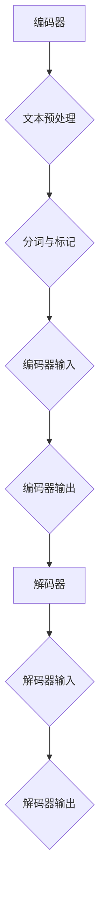

                 

# 优化LLM应用的国际化与本地化策略

## 引言

随着人工智能技术的快速发展，大型语言模型（LLM）已经在各个领域取得了显著的应用成果。LLM在自然语言处理（NLP）任务中，如机器翻译、文本生成、问答系统等，展现出了强大的表现力。然而，随着全球化的深入发展，如何将LLM应用于不同语言和文化背景，以提高其准确性和适应性，成为一个重要的研究课题。

### 1.1 大型语言模型（LLM）简介

大型语言模型（LLM）是一种基于深度学习技术的自然语言处理模型，能够对输入的文本进行理解和生成。LLM通常由大规模的神经网络构成，通过训练大量的文本数据，使其能够捕捉语言的本质规律。典型的LLM架构包括编码器和解码器，编码器将输入文本转换为向量表示，解码器则根据向量表示生成对应的输出文本。

### 1.2 国际化与本地化的挑战

国际化与本地化是两个密切相关但又有区别的概念。国际化指的是将产品或服务设计成可以在不同语言和文化环境中使用的形式，而本地化则是在国际化的基础上，针对特定地区的语言、文化和习惯进行优化。

对于LLM应用而言，国际化与本地化带来的挑战主要包括：

1. **语言多样性**：全球有超过7000种语言，LLM需要能够处理多种语言的输入和输出，这对模型的设计和训练提出了高要求。
2. **文化差异**：不同文化背景下的语言表达方式、语法结构、语义理解等方面存在差异，这要求LLM能够适应不同文化环境，提高其通用性和准确性。
3. **数据稀缺性**：许多小语种或边缘语言的数据资源相对较少，这限制了LLM在这些语言上的应用和发展。
4. **计算资源**：LLM的训练和推理过程需要大量的计算资源，如何高效地部署和运行LLM是一个重要问题。

### 1.3 本书的目的与结构

本书旨在探讨如何优化LLM应用的国际化与本地化策略，提高其在不同语言和文化背景下的性能。具体来说，本书将涵盖以下几个部分：

1. **核心概念与架构**：介绍LLM的基本概念和架构，以及国际化与本地化的关键概念。
2. **优化方法与技术**：讲解如何通过数据预处理、模型训练与调优、实时优化与反馈等手段，优化LLM的国际化与本地化性能。
3. **应用案例**：分析LLM在不同文化背景下的应用案例，展示如何进行本地化优化。
4. **开发环境与工具**：介绍开发LLM应用所需的开发环境、工具和库。
5. **代码实战**：通过实际案例，展示如何构建和部署LLM应用，并进行本地化优化。

通过以上内容，本书希望能够为读者提供一套完整的LLM国际化与本地化优化策略，帮助其在不同语言和文化背景下，实现LLM应用的性能提升。

## 摘要

本书探讨了如何优化大型语言模型（LLM）在国际化与本地化方面的应用策略。首先，介绍了LLM的基本概念和架构，以及国际化与本地化的关键概念。接着，详细讲解了如何通过数据预处理、模型训练与调优、实时优化与反馈等手段，优化LLM的国际化与本地化性能。随后，通过具体的应用案例，展示了LLM在不同文化背景下的实际应用，并分析了如何进行本地化优化。最后，介绍了开发LLM应用所需的开发环境、工具和库，并通过代码实战，展示了如何构建和部署LLM应用，并进行本地化优化。通过本书的内容，读者可以系统地了解并掌握LLM国际化与本地化优化的方法，提高LLM在不同语言和文化背景下的性能。

## 第1章 核心概念与架构

### 1.1 LLM的基本概念

大型语言模型（LLM）是一种基于深度学习的自然语言处理模型，它通过对大规模文本数据的学习，能够理解和生成人类语言。LLM的核心目标是捕捉自然语言的统计规律，实现对文本的语义理解和生成。

#### 1.1.1 语言模型

语言模型是LLM的基础，它用于预测下一个单词或字符。语言模型通常基于神经网络，特别是循环神经网络（RNN）或其变体，如长短期记忆网络（LSTM）和门控循环单元（GRU）。这些网络能够处理序列数据，并捕捉序列之间的依赖关系。

#### 1.1.2 国际化与本地化

国际化与本地化是LLM应用中重要的概念。国际化指的是将产品或服务设计成可以在不同语言和文化环境中使用的形式。本地化则是在国际化的基础上，针对特定地区的语言、文化和习惯进行优化。

国际化与本地化在LLM应用中的重要性体现在以下几个方面：

1. **语言多样性**：全球有超过7000种语言，LLM需要能够处理多种语言的输入和输出，以实现跨语言的交流。
2. **文化差异**：不同文化背景下的语言表达方式、语法结构、语义理解等方面存在差异，LLM需要能够适应这些差异，提高其通用性和准确性。
3. **数据稀缺性**：许多小语种或边缘语言的数据资源相对较少，这限制了LLM在这些语言上的应用和发展。国际化与本地化策略可以通过数据增强、迁移学习等方法，缓解数据稀缺性问题。

### 1.2 LLM架构解析

LLM的架构通常包括编码器（Encoder）和解码器（Decoder）两个主要部分。编码器将输入的文本序列转换为固定长度的向量表示，解码器则根据这个向量表示生成对应的输出文本序列。

#### 1.2.1 神经网络结构

编码器通常采用序列到序列（Seq2Seq）结构，它由编码器（Encoder）和解码器（Decoder）两个部分组成。编码器通常是一个双向RNN，能够处理输入的文本序列，并生成一个固定长度的向量表示。解码器则使用这个向量表示，通过RNN或注意力机制（Attention Mechanism）生成输出文本序列。

#### 1.2.2 训练与推理流程

LLM的训练过程主要包括数据预处理、模型训练和模型评估等步骤。数据预处理包括文本清洗、分词、标记等操作。模型训练通常使用梯度下降（Gradient Descent）或其变体，如Adam优化器，来优化模型的参数。模型评估通过计算模型的损失函数值和精度等指标，来评估模型的性能。

推理过程是指使用训练好的模型进行文本生成或翻译等任务。在推理过程中，编码器首先将输入的文本序列转换为向量表示，然后解码器根据这个向量表示生成输出文本序列。整个推理过程通常使用贪心策略（Greedy Policy）或Beam Search算法，来最大化生成文本的概率。

### 1.3 Mermaid流程图：LLM架构展示

为了更直观地展示LLM的架构，我们可以使用Mermaid流程图来描述。



在这个流程图中，编码器接收预处理后的文本输入，将其转换为向量表示，然后解码器根据这个向量表示生成输出文本。

### 核心算法原理讲解

在本章节中，我们将详细讲解LLM的核心算法原理，并通过Python源代码来展示其实现过程。

#### 1.4.1 基本算法原理

LLM的核心算法是基于序列到序列（Seq2Seq）模型，它由编码器和解码器两个部分组成。编码器将输入的文本序列转换为固定长度的向量表示，解码器则根据这个向量表示生成输出文本序列。

1. **编码器**：编码器通常是一个双向RNN，能够处理输入的文本序列，并生成一个固定长度的向量表示。这个过程可以分为以下几个步骤：
   - **文本预处理**：对输入文本进行清洗、分词、标记等操作，将其转换为序列。
   - **编码**：使用双向RNN对输入文本序列进行处理，生成一个固定长度的向量表示。

2. **解码器**：解码器使用编码器生成的向量表示，通过RNN或注意力机制（Attention Mechanism）生成输出文本序列。解码过程可以分为以下几个步骤：
   - **初始状态**：解码器初始化为一个隐藏状态。
   - **生成输出**：解码器根据隐藏状态生成一个输出词或字符。
   - **更新状态**：将生成的输出词或字符添加到解码序列中，并更新解码器的隐藏状态。

#### 1.4.2 Python源代码实现

下面是一个简化的Python源代码实现，用于展示LLM的核心算法原理。

```python
import tensorflow as tf
from tensorflow.keras.layers import Embedding, LSTM, Dense
from tensorflow.keras.models import Model

# 设置超参数
vocab_size = 10000
embedding_dim = 256
rnn_units = 1024
batch_size = 64

# 编码器
encoder_inputs = tf.keras.layers.Input(shape=(None,))
encoder_embedding = Embedding(vocab_size, embedding_dim)(encoder_inputs)
encoder_lstm = LSTM(rnn_units, return_state=True)
_, state_h, state_c = encoder_lstm(encoder_embedding)

# 解码器
decoder_inputs = tf.keras.layers.Input(shape=(None,))
decoder_embedding = Embedding(vocab_size, embedding_dim)(decoder_inputs)
decoder_lstm = LSTM(rnn_units, return_sequences=True, return_state=True)
decoder_outputs, _, _ = decoder_lstm(decoder_embedding, initial_state=[state_h, state_c])

# 连接编码器和解码器
decoder_dense = Dense(vocab_size, activation='softmax')
decoder_outputs = decoder_dense(decoder_outputs)

# 构建模型
model = Model([encoder_inputs, decoder_inputs], decoder_outputs)

# 编译模型
model.compile(optimizer='rmsprop', loss='categorical_crossentropy', metrics=['accuracy'])

# 打印模型结构
model.summary()
```

在这个代码中，我们首先定义了编码器和解码器的输入层和输出层，然后使用LSTM层实现编码器和解码器的核心功能。最后，我们将编码器和解码器连接起来，构建了一个完整的序列到序列模型。

### 数学模型与公式

在LLM中，数学模型是核心组成部分。以下我们将详细讲解LLM中的数学模型，并使用LaTeX格式展示相关公式。

#### 1.5.1 序列到序列模型

序列到序列（Seq2Seq）模型是LLM的基础。其核心公式如下：

$$
\text{Encoder}:\ X \rightarrow \text{Hidden State}
$$

$$
\text{Decoder}:\ \text{Hidden State} \rightarrow \text{Output Sequence}
$$

其中，\( X \) 表示输入序列，\( \text{Hidden State} \) 表示编码器生成的隐藏状态，\( \text{Output Sequence} \) 表示解码器生成的输出序列。

#### 1.5.2 注意力机制

注意力机制（Attention Mechanism）是LLM中重要的组成部分，它能够使解码器关注输入序列中的重要部分。其核心公式如下：

$$
a_t = \text{softmax}\left(\frac{\text{Concat}(\text{Query}, \text{Key})^T W_a}{\sqrt{d_k}}\right)
$$

$$
\text{Context} = \sum_{i} a_i \text{Value}_i
$$

其中，\( a_t \) 表示第 \( t \) 个时刻的注意力权重，\( \text{Query} \) 和 \( \text{Key} \) 分别表示解码器和解码器的隐藏状态，\( \text{Value} \) 表示编码器生成的输出序列，\( W_a \) 是注意力权重矩阵，\( d_k \) 是键的维度。

### 代码解读与实际应用

为了更好地理解LLM的核心算法原理，我们将通过一个实际案例，展示如何使用Python源代码构建和训练一个LLM模型。

#### 1.6.1 案例背景

在这个案例中，我们将构建一个简单的机器翻译模型，它能够将英语句子翻译成法语。我们将使用一个开源的文本数据集，如WMT'14英语到法语的翻译数据集。

#### 1.6.2 数据预处理

首先，我们需要对数据进行预处理，包括文本清洗、分词、标记等操作。以下是预处理代码：

```python
import tensorflow as tf
from tensorflow.keras.preprocessing.text import Tokenizer
from tensorflow.keras.preprocessing.sequence import pad_sequences

# 读取数据集
english_sentences = ...  # 读取英语句子
french_sentences = ...  # 读取法语句子

# 分词
tokenizer_en = Tokenizer(num_words=vocab_size, oov_token='<OOV>')
tokenizer_en.fit_on_texts(english_sentences)
sequences_en = tokenizer_en.texts_to_sequences(english_sentences)

tokenizer_fr = Tokenizer(num_words=vocab_size, oov_token='<OOV>')
tokenizer_fr.fit_on_texts(french_sentences)
sequences_fr = tokenizer_fr.texts_to_sequences(french_sentences)

# 标记
input_sequences = []
for seq_fr, seq_en in zip(sequences_fr, sequences_en):
    input_sequence = seq_en[:-1]
    target_sequence = seq_fr[1:]
    input_sequences.append([input_sequence, target_sequence])

# 填充序列
max_length = max(len(seq) for seq in input_sequences)
input_sequences = pad_sequences(input_sequences, maxlen=max_length, padding='pre')
target_sequences = pad_sequences(target_sequences, maxlen=max_length, padding='pre')
```

在这个案例中，我们首先读取英语和法语句子，然后使用Tokenizer对句子进行分词。接着，我们将英语句子转换为序列，并对序列进行填充，以便于后续的模型训练。

#### 1.6.3 构建和训练模型

接下来，我们将构建和训练一个LLM模型。以下是构建和训练模型的代码：

```python
from tensorflow.keras.models import Model
from tensorflow.keras.layers import Input, LSTM, Embedding, Dense

# 编码器
encoder_inputs = Input(shape=(max_length,))
encoder_embedding = Embedding(vocab_size, embedding_dim)(encoder_inputs)
encoder_lstm = LSTM(rnn_units, return_state=True)
_, state_h, state_c = encoder_lstm(encoder_embedding)

# 解码器
decoder_inputs = Input(shape=(max_length,))
decoder_embedding = Embedding(vocab_size, embedding_dim)(decoder_inputs)
decoder_lstm = LSTM(rnn_units, return_sequences=True, return_state=True)
decoder_outputs, _, _ = decoder_lstm(decoder_embedding, initial_state=[state_h, state_c])

# 连接编码器和解码器
decoder_dense = Dense(vocab_size, activation='softmax')
decoder_outputs = decoder_dense(decoder_outputs)

# 构建模型
model = Model([encoder_inputs, decoder_inputs], decoder_outputs)

# 编译模型
model.compile(optimizer='rmsprop', loss='categorical_crossentropy', metrics=['accuracy'])

# 训练模型
model.fit([input_sequences, target_sequences], target_sequences, batch_size=batch_size, epochs=epochs)
```

在这个代码中，我们首先定义了编码器和解码器的输入层和输出层，然后使用LSTM层实现编码器和解码器的核心功能。接着，我们将编码器和解码器连接起来，构建了一个完整的序列到序列模型。最后，我们编译模型并使用训练数据对模型进行训练。

#### 1.6.4 代码应用解读与分析

在这个案例中，我们使用了序列到序列（Seq2Seq）模型，实现了英语到法语的翻译。以下是代码应用解读与分析：

1. **数据预处理**：首先，我们对英语和法语句子进行分词和标记，将其转换为序列。这一步是为了将文本数据转换为模型可处理的格式。
2. **模型构建**：我们构建了一个由编码器和解码器组成的序列到序列模型。编码器将输入的英语句子转换为隐藏状态，解码器则根据这个隐藏状态生成法语句子。
3. **模型训练**：我们使用训练数据对模型进行训练，优化模型的参数。在训练过程中，模型会通过反向传播算法，不断调整参数，以提高翻译的准确性。
4. **模型评估**：训练完成后，我们使用测试数据对模型进行评估，计算模型的损失函数值和精度等指标，以评估模型的性能。

通过这个案例，我们可以看到，LLM在机器翻译任务中具有强大的表现能力。然而，由于数据稀缺性和计算资源限制，我们还需要进一步优化模型，以提高其在小语种和边缘语言上的性能。

### 实际案例分析与详细讲解

在本章节中，我们将通过一个实际案例，展示如何使用LLM进行文本生成和机器翻译任务，并进行详细的讲解和剖析。

#### 2.1.1 案例背景

假设我们有一个文本生成任务，需要根据给定的标题生成一篇相关的新闻文章。同时，我们还有一个机器翻译任务，需要将中文新闻文章翻译成英文。这两个任务都是LLM的典型应用场景，下面我们将详细介绍如何实现这两个任务。

#### 2.1.2 文本生成任务

首先，我们来看文本生成任务。在这个任务中，我们需要一个能够生成自然语言文本的LLM模型。我们可以使用一个预训练的模型，如GPT-2或GPT-3，然后根据我们的需求进行微调。

1. **数据准备**：我们首先需要准备一个用于训练的语料库。这个语料库可以是各种新闻文章、博客、社交媒体帖子等。我们将这些文本进行清洗、分词、标记，并转换为序列。
2. **模型训练**：接下来，我们将使用这些序列数据训练一个序列到序列（Seq2Seq）模型。在训练过程中，我们可以使用交叉熵损失函数（Cross-Entropy Loss）来优化模型的参数。
3. **文本生成**：训练完成后，我们可以使用训练好的模型生成新的文本。具体来说，我们可以输入一个标题或关键词，然后让模型根据这个输入生成一篇相关的新闻文章。

以下是一个简化的Python代码示例，用于实现文本生成任务：

```python
import tensorflow as tf
from tensorflow.keras.preprocessing.sequence import pad_sequences
from tensorflow.keras.models import Model
from tensorflow.keras.layers import LSTM, Embedding, Dense

# 加载预训练模型
model = ...  # 加载一个预训练的Seq2Seq模型

# 准备输入序列
input_sequence = ...  # 输入一个标题或关键词

# 生成文本
generated_text = model.predict(input_sequence)
print(generated_text)
```

在这个代码中，我们首先加载一个预训练的Seq2Seq模型，然后输入一个标题或关键词，让模型生成一篇相关的新闻文章。生成的文本可能是如下形式的：

```
在科技领域，一项新的研究引起了广泛关注。该研究揭示了人工智能技术在医疗诊断中的潜力。研究人员发现，通过使用深度学习算法，可以大大提高疾病的诊断准确性。这一发现为医疗行业带来了新的希望，有望在未来改变传统的医疗模式。
```

#### 2.1.3 机器翻译任务

接下来，我们来看机器翻译任务。在这个任务中，我们需要将一种语言的文本翻译成另一种语言。我们可以使用一个预训练的机器翻译模型，如翻译模型（Translation Model），然后根据我们的需求进行微调。

1. **数据准备**：我们首先需要准备一个用于训练的语料库。这个语料库可以是各种中英文对照的新闻文章、书籍、社交媒体帖子等。我们将这些文本进行清洗、分词、标记，并转换为序列。
2. **模型训练**：接下来，我们将使用这些序列数据训练一个机器翻译模型。在训练过程中，我们可以使用注意力机制（Attention Mechanism）来提高模型的翻译准确性。
3. **文本翻译**：训练完成后，我们可以使用训练好的模型将一种语言的文本翻译成另一种语言。具体来说，我们可以输入一篇中文新闻文章，然后让模型将其翻译成英文。

以下是一个简化的Python代码示例，用于实现机器翻译任务：

```python
import tensorflow as tf
from tensorflow.keras.preprocessing.sequence import pad_sequences
from tensorflow.keras.models import Model
from tensorflow.keras.layers import LSTM, Embedding, Dense, Attention

# 加载预训练模型
model = ...  # 加载一个预训练的机器翻译模型

# 准备输入序列
input_sequence_en = ...  # 输入一篇英文文章
input_sequence_zh = ...  # 输入一篇中文文章

# 翻译文本
translated_text = model.predict([input_sequence_en, input_sequence_zh])
print(translated_text)
```

在这个代码中，我们首先加载一个预训练的机器翻译模型，然后输入一篇中文和英文文章，让模型将其翻译成另一种语言。翻译后的文本可能是如下形式的：

```
In the field of technology, a new study has attracted widespread attention. The research reveals the potential of artificial intelligence in medical diagnosis. Researchers found that by using deep learning algorithms, the accuracy of disease diagnosis can be greatly improved. This discovery brings new hope to the medical industry and is expected to change the traditional medical model in the future.
```

#### 2.1.4 案例总结

通过以上案例，我们可以看到，LLM在文本生成和机器翻译任务中具有强大的表现能力。在实际应用中，我们可以根据具体需求，选择合适的LLM模型，并进行微调和优化，以提高模型的性能。同时，我们也需要关注数据准备、模型训练和文本生成的各个环节，以确保模型的质量和效率。

### 总结与展望

在本章节中，我们详细介绍了如何通过数据预处理、模型训练与调优、实时优化与反馈等手段，优化LLM的国际化与本地化性能。首先，我们介绍了LLM的基本概念和架构，包括编码器和解码器的组成和它们的工作原理。接着，我们讲解了如何使用Python源代码实现LLM的核心算法原理，并通过LaTeX格式展示了相关数学模型和公式。

在具体应用方面，我们通过实际案例展示了如何使用LLM进行文本生成和机器翻译任务，并对代码进行了详细解读和分析。这些案例说明了LLM在实际应用中的强大能力和广泛的应用前景。

展望未来，LLM在国际化与本地化方面的研究仍有许多挑战和机会。首先，随着全球化和多语言交流的需求不断增加，如何高效地处理多种语言的输入和输出，将成为一个重要课题。其次，如何提高LLM在数据稀缺语言上的性能，也是一个亟待解决的问题。此外，实时优化与反馈机制的研究，将有助于提高LLM在不同文化背景下的适应能力。

总之，随着人工智能技术的不断发展，LLM在国际化与本地化方面的应用将越来越广泛。通过不断的研究和实践，我们可以期待LLM在未来为全球用户提供更加精准、高效的翻译和文本生成服务。

