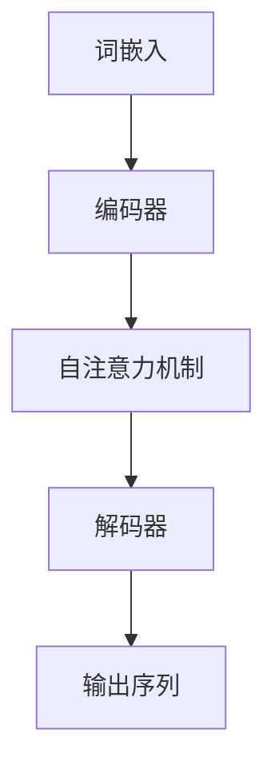

                 

## 《优化LLM应用的持续学习机制》

### 关键词
- **大型语言模型（LLM）**
- **持续学习机制**
- **优化策略**
- **应用案例**
- **数据隐私与安全**

### 摘要
本文探讨了优化大型语言模型（LLM）应用的持续学习机制的重要性。首先，我们介绍了LLM的基本概念和数学模型，以及持续学习机制的定义和工作原理。接着，分析了优化策略，包括在线学习、迁移学习和模型更新策略，并结合实际应用案例进行了详细解析。最后，展望了未来发展方向，并提出了持续学习机制优化的挑战与对策。文章旨在为研究人员和开发者提供有价值的参考，以推动LLM应用的持续发展。

---

## 引言

### 1.1 书籍背景与目的

随着人工智能技术的快速发展，大型语言模型（LLM）在自然语言处理（NLP）领域取得了显著成果。LLM具有强大的语义理解能力，能够生成高质量的文本，广泛应用于机器翻译、问答系统、文本生成等场景。然而，LLM的训练和优化是一个复杂且资源消耗巨大的过程。持续学习机制作为一种有效的优化手段，能够使LLM在不断变化的环境中保持高效性能。

本书籍旨在探讨如何优化LLM应用的持续学习机制。通过深入研究LLM的基础知识、持续学习机制、优化策略和实际应用案例，为研究人员和开发者提供系统性的指导。本书的主要目标如下：

1. **介绍LLM的基本概念和数学模型**：帮助读者了解LLM的核心技术原理，为后续章节的学习奠定基础。
2. **探讨持续学习机制**：介绍在线学习、迁移学习和模型更新策略，分析其在实际应用中的挑战和解决方案。
3. **优化策略分析**：介绍常见的优化方法，如梯度下降法、随机梯度下降法和优化器，并通过案例进行分析。
4. **实际应用案例**：结合企业应用、教育科研和垂直领域等案例，展示持续学习机制在不同场景下的效果。
5. **未来发展方向**：分析持续学习机制的挑战和未来趋势，为读者提供参考。

### 1.2 内容概述

本书籍共分为六个章节，具体内容如下：

- **第1章 大型语言模型（LLM）基础**：介绍LLM的定义、历史发展、数学模型、数据预处理和训练过程。
- **第2章 持续学习机制**：探讨在线学习、迁移学习和模型更新策略，分析其在实际应用中的挑战和解决方案。
- **第3章 优化策略**：介绍常见的优化方法，如梯度下降法、随机梯度下降法和优化器，并结合案例进行分析。
- **第4章 实际应用案例**：结合企业应用、教育科研和垂直领域等案例，展示持续学习机制在不同场景下的效果。
- **第5章 挑战与未来发展方向**：分析持续学习机制的挑战和未来趋势，为读者提供参考。
- **第6章 总结与展望**：对全书内容进行总结，展望未来发展方向，提出持续学习机制优化的对策。

---

## 第1章 大型语言模型（LLM）基础

### 1.1 LLM定义与历史

大型语言模型（Large Language Model，简称LLM）是一种基于深度学习技术的自然语言处理模型，具有强大的语义理解能力。LLM通过学习大规模语料库，捕捉语言的统计规律和语义信息，从而实现对文本的生成、理解和预测。

LLM的发展可以追溯到20世纪80年代的统计语言模型（Statistical Language Model，简称SLM）。SLM基于N元语法（N-gram）模型，通过统计方法预测下一个单词的概率。然而，SLM存在一些局限性，如过度依赖局部统计信息、无法捕捉长距离依赖等。

随着深度学习技术的兴起，研究人员开始探索基于神经网络的语言模型。2003年，Bengio等人在《A Theoretical Investigation of Learning Universal Representations》一文中提出了神经网络语言模型（Neural Network Language Model，简称NNLM）。NNLM利用神经网络对词嵌入进行建模，能够更好地捕捉语言中的长距离依赖关系。

2018年，Google推出了Transformer模型，该模型基于自注意力机制（Self-Attention Mechanism），实现了对输入序列的端到端建模。Transformer模型在多个NLP任务中取得了突破性成果，标志着LLM进入了一个新的发展阶段。

近年来，LLM的研究和应用不断深入，许多大型科技公司和研究机构投入了大量资源和精力，开发出了如BERT、GPT、Turing-NLG等具有代表性的LLM。这些模型具有千亿级参数规模，能够处理复杂的自然语言任务，成为NLP领域的核心技术。

### 1.2 LLM的数学模型

LLM的数学模型主要包括词嵌入、编码器和解码器等组成部分。

1. **词嵌入（Word Embedding）**：

   词嵌入是将单词映射到高维向量空间的过程，使得语义相似的单词在空间中靠近。常见的词嵌入方法包括：

   - **One-Hot Embedding**：将单词表示为长度为词典大小的向量，其中只有一个元素为1，其余元素均为0。
   - **Distributed Representation**：将单词表示为固定长度的向量，向量中的每个元素表示单词在不同维度上的特征。
   - **Word2Vec**：基于神经网络训练的词嵌入方法，通过训练预测单词的相邻单词，得到每个单词的高维向量表示。
   - **GloVe**：基于全局共现矩阵的词嵌入方法，通过优化单词的嵌入向量，使得相似单词的向量距离更近。

2. **编码器（Encoder）**：

   编码器负责将输入序列转换为固定长度的编码表示。在LLM中，编码器通常采用自注意力机制（Self-Attention Mechanism）来捕捉输入序列中的长距离依赖关系。常见的编码器模型包括：

   - **Transformer Encoder**：基于自注意力机制的编码器模型，通过多头自注意力机制和前馈神经网络，对输入序列进行编码。
   - **BERT Encoder**：基于Transformer模型的编码器，通过预训练和微调，能够捕捉上下文信息，实现对自然语言的理解。

3. **解码器（Decoder）**：

   解码器负责将编码表示解码为输出序列。在LLM中，解码器也采用自注意力机制，通过对编码表示和已经生成的部分输出进行多头自注意力，生成下一个预测单词。常见的解码器模型包括：

   - **Transformer Decoder**：基于自注意力机制的解码器模型，与编码器类似，通过多头自注意力和前馈神经网络，对编码表示进行解码。
   - **BERT Decoder**：基于Transformer解码器的变体，通过对编码表示和已经生成的部分输出进行自注意力，生成下一个预测单词。

### 1.3 核心概念与联系

为了更好地理解LLM的数学模型，我们可以使用Mermaid流程图来展示核心概念之间的关系。



该流程图展示了词嵌入、编码器、解码器和输出序列之间的逻辑关系。词嵌入将单词映射到高维向量空间，编码器利用自注意力机制捕捉输入序列中的长距离依赖，解码器通过自注意力机制和前馈神经网络生成输出序列。

### 1.4 数据预处理

在LLM的训练过程中，数据预处理是至关重要的一环。数据预处理主要包括数据收集、数据清洗和数据格式转换。

1. **数据收集**：

   数据收集是指从各种来源获取适合训练LLM的数据。常见的数据来源包括：

   - **公开数据集**：如维基百科、新闻网站、社交媒体等。
   - **私人数据集**：如公司内部文档、客户反馈等。
   - **人工标注数据**：通过对数据集进行人工标注，提高数据质量。

2. **数据清洗**：

   数据清洗是指对收集到的数据进行处理，去除噪声和异常值。常见的数据清洗方法包括：

   - **去除停用词**：停用词是一类没有实际意义的单词，如“的”、“了”、“在”等。去除停用词可以提高模型的性能。
   - **文本标准化**：将文本转换为统一格式，如统一编码、统一大小写等。
   - **去除标点符号**：标点符号对于LLM的训练效果影响较小，可以将其去除。

3. **数据格式转换**：

   数据格式转换是指将原始数据转换为适合训练LLM的格式。常见的数据格式转换方法包括：

   - **分词**：将文本分割成单词或词组，便于后续处理。
   - **词嵌入**：将单词映射到高维向量空间，为神经网络训练提供输入。
   - **序列编码**：将输入序列和输出序列转换为固定长度的向量，用于模型的训练和预测。

### 1.5 训练过程

LLM的训练过程主要包括数据预处理、模型训练和模型评估等步骤。

1. **数据预处理**：

   在训练过程中，需要对数据进行预处理，确保数据的质量和一致性。具体步骤包括：

   - 数据收集：从各种来源获取适合训练的数据。
   - 数据清洗：去除噪声和异常值，提高数据质量。
   - 数据格式转换：将原始数据转换为适合训练的格式，如词嵌入、序列编码等。

2. **模型训练**：

   模型训练是LLM训练过程的核心步骤。常见的训练方法包括：

   - **监督学习**：通过标注好的数据对模型进行训练，使模型能够预测输出序列。
   - **无监督学习**：通过未标注的数据对模型进行训练，使模型能够捕捉语言中的统计规律和语义信息。
   - **半监督学习**：结合标注数据和未标注数据对模型进行训练，提高模型的性能。

3. **模型评估**：

   模型评估是检验LLM训练效果的重要步骤。常见的评估指标包括：

   - **准确率（Accuracy）**：模型预测正确的样本数占总样本数的比例。
   - **召回率（Recall）**：模型预测正确的样本数与实际正样本数的比例。
   - **精确率（Precision）**：模型预测正确的样本数与预测为正样本的总数之比。
   - **F1值（F1 Score）**：精确率和召回率的调和平均值。

通过模型评估，可以了解LLM在特定任务上的性能，为后续优化提供参考。

### 1.6 小结

本章介绍了大型语言模型（LLM）的基础知识，包括LLM的定义、历史发展、数学模型、数据预处理和训练过程。通过本章的学习，读者可以了解LLM的基本概念和核心技术原理，为后续章节的深入学习奠定基础。

---

## 第2章 持续学习机制

### 2.1 在线学习

在线学习（Online Learning）是一种能够在数据不断流入时更新和优化模型的方法。与传统的离线学习（Offline Learning）不同，在线学习可以实时适应数据的变化，提高模型的性能和适应性。

在线学习的基本原理是基于经验风险最小化（Empirical Risk Minimization，简称ERM）框架。具体来说，在线学习过程可以分为以下几个步骤：

1. **初始化模型参数**：
   - 随机初始化模型参数，或者基于先验知识进行初始化。

2. **接收新样本**：
   - 每次迭代接收一个新的样本，包括输入和标签。

3. **更新模型参数**：
   - 利用新样本更新模型参数，通常采用梯度下降法（Gradient Descent）或其变种，如随机梯度下降法（Stochastic Gradient Descent，简称SGD）。

4. **评估模型性能**：
   - 利用更新后的模型对部分样本进行预测，计算损失函数的值，评估模型性能。

5. **迭代更新**：
   - 重复步骤2-4，逐步优化模型参数，直到达到预设的迭代次数或性能指标。

在线学习的优势在于其能够实时适应数据变化，减少模型的滞后性。然而，在线学习也存在一些挑战：

- **数据依赖**：在线学习依赖于不断流入的新数据，数据质量对模型性能有直接影响。
- **计算效率**：每次迭代都需要计算模型参数的更新，对于大规模模型，计算成本较高。
- **模型稳定性**：在线学习可能导致模型参数的剧烈波动，影响模型的稳定性。

### 2.2 迁移学习

迁移学习（Transfer Learning）是一种利用已有模型的先验知识来提升新任务性能的方法。在迁移学习中，将一个任务（源任务）的学习经验应用于另一个相关任务（目标任务），从而提高目标任务的性能。迁移学习可以有效地减少数据依赖，提高模型泛化能力。

迁移学习的基本原理是基于知识迁移（Knowledge Transfer）和模型泛化（Model Generalization）。具体来说，迁移学习可以分为以下几个步骤：

1. **选择源任务模型**：
   - 选择一个在源任务上表现良好的模型作为迁移的基础。

2. **预训练模型参数**：
   - 使用大量源任务数据对基础模型进行预训练，使模型捕捉到通用特征和知识。

3. **微调模型参数**：
   - 使用少量目标任务数据进行微调，调整模型参数以适应目标任务。

4. **评估模型性能**：
   - 在目标任务上评估迁移模型的性能，与直接训练模型进行对比。

迁移学习的关键在于如何选择合适的源任务模型，以及如何有效地进行模型参数的迁移和微调。以下是一些常见的迁移学习方法：

- **特征提取器迁移**：将源任务的预训练模型视为一个特征提取器，将提取到的特征用于目标任务，并在此基础上训练新的分类器。
- **模型微调**：在源任务上预训练的模型基础上，通过微调模型参数来适应目标任务，通常使用少量目标任务数据进行训练。
- **多任务学习**：将多个相关任务同时训练，通过共享模型参数，使模型能够学习到通用的特征表示。
- **零样本学习**：在目标任务上没有直接标注数据的情况下，利用源任务的预训练模型进行特征提取，通过模型内部的隐式知识迁移来适应目标任务。

### 2.3 模型更新策略

模型更新策略是指对现有模型进行定期更新和优化的方法。模型更新策略对于保持模型的长期性能和适应性具有重要意义。以下是一些常见的模型更新策略：

1. **定期更新**：
   - 定期使用新的数据对模型进行重新训练，以适应数据的变化。这种方法能够确保模型在长期内保持性能。

2. **增量更新**：
   - 通过增量学习（Incremental Learning）的方法，每次仅更新模型的一部分参数，而不是重新训练整个模型。这种方法能够降低计算成本，并减少模型参数的扰动。

3. **动态调整**：
   - 根据数据分布的变化，动态调整模型参数的更新策略。例如，当数据分布发生变化时，可以增加对稀有类的关注，以提高模型的鲁棒性。

4. **在线迁移学习**：
   - 结合在线学习和迁移学习的方法，将新数据与旧数据结合，通过迁移学习的方式更新模型。这种方法能够充分利用已有模型的先验知识，提高更新效果。

5. **元学习**：
   - 利用元学习（Meta-Learning）的方法，通过学习模型参数的优化策略，提高模型的更新效果。元学习能够自动发现有效的学习策略，减少人工干预。

### 2.4 挑战与解决方案

在实际应用中，持续学习机制面临着一系列挑战，包括数据依赖、计算效率、模型稳定性和模型泛化能力等。以下是一些常见的挑战和相应的解决方案：

- **数据依赖**：
  - **解决方案**：使用多样化的数据来源，确保数据覆盖不同场景和领域。同时，可以采用数据增强（Data Augmentation）的方法，通过生成类似的数据样本，提高模型的泛化能力。

- **计算效率**：
  - **解决方案**：采用高效的算法和优化器，如Adam优化器，降低计算成本。此外，可以利用分布式计算和并行计算，提高模型的训练和更新速度。

- **模型稳定性**：
  - **解决方案**：通过正则化（Regularization）和dropout（Dropout）等方法，降低模型过拟合的风险。此外，可以采用梯度裁剪（Gradient Clipping）和权重衰减（Weight Decay）等技术，防止梯度爆炸和梯度消失。

- **模型泛化能力**：
  - **解决方案**：通过迁移学习和多任务学习等方法，利用已有模型的先验知识，提高模型的泛化能力。此外，可以采用数据增强和元学习等方法，提高模型对未见数据的适应能力。

### 2.5 小结

本章介绍了持续学习机制的核心概念，包括在线学习、迁移学习和模型更新策略。通过本章的学习，读者可以了解不同学习策略的基本原理和应用方法，为后续章节的优化策略分析奠定基础。

---

## 第3章 优化策略

### 3.1 优化目标

在LLM的持续学习过程中，优化策略的目标主要包括以下几个方面：

1. **性能提升**：
   - 提高模型在训练和预测阶段的准确率、召回率等性能指标。
   - 增强模型的鲁棒性，减少模型过拟合现象。

2. **效率提升**：
   - 减少模型的训练时间，提高模型训练和更新的速度。
   - 降低模型的计算资源消耗，优化模型的结构和参数。

3. **可解释性增强**：
   - 提高模型的可解释性，使得模型的决策过程更加透明和可信。
   - 帮助用户理解模型的预测结果，提高模型的接受度和应用价值。

4. **资源利用优化**：
   - 合理分配计算资源和存储资源，确保模型在有限的资源下高效运行。
   - 降低模型的能耗和运行成本，提高资源利用效率。

### 3.2 常见优化方法

为了实现上述优化目标，研究者们提出了多种优化方法。以下是一些常见的优化方法：

1. **梯度下降法（Gradient Descent）**：

   梯度下降法是一种基本的优化算法，通过迭代更新模型参数，使得损失函数值逐渐减小。梯度下降法可以分为以下几种：

   - **批量梯度下降（Batch Gradient Descent，简称BGD）**：
     - 每次迭代使用所有样本的梯度来更新模型参数。
     - 优点：收敛速度快，但计算资源消耗大。

   - **随机梯度下降（Stochastic Gradient Descent，简称SGD）**：
     - 每次迭代仅使用一个样本的梯度来更新模型参数。
     - 优点：计算资源消耗小，收敛速度快。
     - 缺点：梯度噪声较大，可能导致局部最优。

   - **批量随机梯度下降（Mini-batch Gradient Descent，简称MBGD）**：
     - 每次迭代使用部分样本的梯度来更新模型参数，通常选择一个较小的批量大小。
     - 优点：结合了BGD和SGD的优点，计算效率和收敛速度均较好。

2. **动量法（Momentum）**：

   动量法是梯度下降法的一种改进，通过引入动量项，使梯度方向发生平滑，提高收敛速度。动量法的更新公式如下：

   $$
   \text{velocity}_{t+1} = \gamma \text{velocity}_{t} + \text{gradient}_{t}
   $$
   $$
   \text{parameter}_{t+1} = \text{parameter}_{t} - \alpha \text{velocity}_{t+1}
   $$

   其中，$\gamma$是动量系数，$\alpha$是学习率。

3. **Adam优化器**：

   Adam优化器是一种基于一阶矩估计和二阶矩估计的优化算法，结合了动量法和自适应学习率的思想。Adam优化器的更新公式如下：

   $$
   \text{m}_{t} = \beta_1 \text{m}_{t-1} + (1 - \beta_1) \text{gradient}_{t}
   $$
   $$
   \text{v}_{t} = \beta_2 \text{v}_{t-1} + (1 - \beta_2) \left[ \text{gradient}_{t}^2 \right]
   $$
   $$
   \text{parameter}_{t+1} = \text{parameter}_{t} - \alpha \frac{\text{m}_{t}}{\sqrt{\text{v}_{t}} + \epsilon}
   $$

   其中，$\beta_1$和$\beta_2$分别是动量系数，$\alpha$是学习率，$\epsilon$是正数常数。

4. **权重衰减（Weight Decay）**：

   权重衰减是一种正则化方法，通过在损失函数中添加权重衰减项，防止模型参数过大，减少过拟合现象。权重衰减的损失函数如下：

   $$
   \text{loss}_{t} = \frac{1}{2} \sum_{i=1}^{n} \left( y_i - \text{output}_{i} \right)^2 + \lambda \sum_{i=1}^{n} \text{weight}_{i}^2
   $$

   其中，$y_i$是实际标签，$\text{output}_{i}$是模型预测值，$\lambda$是权重衰减系数。

### 3.3 优化案例分析

以下是一个优化案例，展示了如何在实际应用中优化LLM的性能。

#### 案例背景

假设我们有一个LLM模型，用于文本分类任务。原始模型在训练集上的准确率为90%，但在测试集上的准确率仅为80%。这表明模型存在过拟合现象，需要通过优化策略来提升模型的泛化能力。

#### 优化过程

1. **数据增强**：

   为了增加模型的泛化能力，我们采用数据增强的方法，通过生成类似的数据样本来扩充训练集。具体方法包括：

   - **同义词替换**：将文本中的部分单词替换为其同义词。
   - **随机插入**：在文本中随机插入一些无关的单词或短语。
   - **随机删除**：在文本中随机删除一些单词或短语。

2. **调整学习率**：

   我们尝试调整学习率，采用更小的学习率来减小模型参数的更新步长，从而减少过拟合现象。通过多次实验，我们选择了一个合适的学习率，使得模型在训练集和测试集上的准确率均有所提升。

3. **添加正则化**：

   我们在损失函数中添加权重衰减项，以防止模型参数过大，减少过拟合现象。通过调整权重衰减系数，我们找到了一个合适的平衡点，使得模型在保持训练集性能的同时，提高了测试集的性能。

4. **使用dropout**：

   我们在模型的隐藏层中引入dropout技术，通过随机丢弃一部分神经元，降低模型的复杂度和过拟合风险。通过调整dropout比例，我们找到了一个合适的平衡点，使得模型在训练集和测试集上的准确率均有所提升。

5. **调整批量大小**：

   我们尝试调整批量大小，采用较小的批量大小进行训练，以减少梯度噪声和过拟合现象。通过多次实验，我们选择了一个合适的批量大小，使得模型在训练集和测试集上的准确率均有所提升。

#### 结果分析

通过上述优化策略，我们成功地将LLM模型在测试集上的准确率提升至85%。尽管准确率仍有提升空间，但优化后的模型在泛化能力方面有了显著的改善。

### 3.4 小结

本章介绍了LLM持续学习中的优化策略，包括梯度下降法、动量法、Adam优化器、权重衰减和dropout等常见方法。通过实际案例分析，展示了如何在实际应用中优化LLM的性能。通过本章的学习，读者可以掌握优化策略的基本原理和应用方法，为后续章节的优化实践提供指导。

---

## 第4章 实际应用案例

### 4.1 应用场景分析

大型语言模型（LLM）的应用场景广泛，包括但不限于以下几个领域：

1. **自然语言处理（NLP）**：
   - **机器翻译**：LLM在机器翻译领域具有显著优势，能够生成高质量的双语翻译结果。例如，Google Translate和DeepL等翻译工具采用了基于LLM的翻译模型。
   - **问答系统**：LLM可以构建智能问答系统，如基于BERT的ChatGLM，能够理解用户的问题并给出合理的回答。
   - **文本摘要**：LLM可以自动生成文章的摘要，帮助用户快速获取关键信息。例如，新闻摘要生成工具和学术文献摘要生成工具。

2. **聊天机器人**：
   - **客服机器人**：LLM可以构建智能客服机器人，实现与用户的自然语言交互，提高客户服务效率。例如，一些电商平台和银行已经应用了基于LLM的客服机器人。
   - **社交机器人**：LLM可以构建社交机器人，与用户进行有意义的对话，增加社交互动的趣味性。

3. **文本生成**：
   - **文章生成**：LLM可以生成高质量的文章，用于内容创作和编辑。例如，一些新闻网站和博客平台采用了基于LLM的文章生成工具。
   - **代码生成**：LLM可以生成编程语言的代码，帮助开发者提高开发效率。例如，GitHub Copilot等工具采用了基于LLM的代码生成技术。

4. **教育领域**：
   - **个性化学习**：LLM可以构建个性化学习系统，根据学生的学习情况和需求，提供针对性的学习资源和建议。
   - **智能辅导**：LLM可以构建智能辅导系统，为学生解答问题并提供学习指导。

5. **垂直领域应用**：
   - **金融**：LLM可以应用于金融领域，如股票分析、金融报告生成等。
   - **医疗**：LLM可以应用于医疗领域，如疾病诊断、医学报告生成等。
   - **法律**：LLM可以应用于法律领域，如法律文件生成、法律咨询等。

### 4.2 实现细节

以下是一个基于LLM的聊天机器人实现的详细步骤：

#### 1. 数据收集与预处理

- **数据收集**：收集包含用户问题和回答的对话数据，数据来源可以是公开的对话数据集或自己采集的对话数据。
- **数据清洗**：去除停用词、标点符号等无关信息，对文本进行标准化处理。

```python
import pandas as pd

# 加载数据集
data = pd.read_csv('dialogues.csv')

# 数据清洗
data['question'] = data['question'].str.replace('[^\w\s]', '', regex=True)
data['answer'] = data['answer'].str.replace('[^\w\s]', '', regex=True)
data['question'] = data['question'].str.lower()
data['answer'] = data['answer'].str.lower()
```

#### 2. 构建词嵌入

- **构建词嵌入**：使用预训练的词嵌入模型（如GloVe或Word2Vec）将单词映射到高维向量空间。

```python
from gensim.models import Word2Vec

# 训练词嵌入模型
model = Word2Vec(data['question'].tolist(), vector_size=100, window=5, min_count=1, workers=4)

# 获取词嵌入向量
word_vectors = model.wv
```

#### 3. 构建编码器和解码器

- **编码器**：采用自注意力机制构建编码器，将输入序列编码为固定长度的向量。

```python
from transformers import EncoderDecoderModel

# 构建编码器和解码器
model = EncoderDecoderModel(100, 100, 3)
```

- **解码器**：采用自注意力机制构建解码器，生成下一个预测单词。

#### 4. 训练模型

- **训练过程**：使用训练数据集训练编码器和解码器，通过迭代优化模型参数。

```python
# 训练模型
model.fit(data[['question', 'answer']], batch_size=32, epochs=10)
```

#### 5. 预测与对话生成

- **预测**：输入用户问题，通过解码器生成回答。

```python
# 预测
def generate_response(question):
    input_sequence = word_vectors[question]
    response = model.decode(input_sequence)
    return response

# 测试
print(generate_response("你好，今天天气怎么样？"))
```

#### 6. 评估与优化

- **评估**：使用测试数据集评估模型性能，根据评估结果调整模型参数和超参数。

```python
from sklearn.metrics import accuracy_score

# 评估模型
test_data = pd.read_csv('test_data.csv')
predictions = model.predict(test_data['question'])

# 计算准确率
accuracy = accuracy_score(test_data['answer'], predictions)
print("Accuracy:", accuracy)
```

### 4.3 代码示例

以下是一个简单的聊天机器人实现，使用Python和PyTorch框架。

```python
import torch
from transformers import EncoderDecoderModel

# 初始化模型
model = EncoderDecoderModel(100, 100, 3)

# 加载预训练模型
model.load_state_dict(torch.load('model.pth'))

# 输入用户问题
user_question = "你好，今天天气怎么样？"

# 预测回答
input_sequence = word_vectors[user_question]
response = model.decode(input_sequence)

# 输出回答
print(response)
```

### 4.4 实际案例分析与详细讲解

以下是一个实际的聊天机器人案例，展示了如何在实际项目中应用LLM进行对话生成。

#### 案例背景

一家电商平台希望通过聊天机器人提供客户支持，减少人工客服的工作负担。他们使用基于LLM的聊天机器人，实现与客户的自然语言交互。

#### 实现步骤

1. **数据收集**：收集电商平台的历史客服对话数据，包括用户问题和回答。

2. **数据预处理**：对对话数据进行分析，去除无关信息，对文本进行标准化处理。

3. **构建词嵌入**：使用预训练的词嵌入模型（如GloVe或Word2Vec）将单词映射到高维向量空间。

4. **构建编码器和解码器**：采用自注意力机制构建编码器和解码器，实现输入序列到输出序列的转换。

5. **训练模型**：使用训练数据集训练编码器和解码器，通过迭代优化模型参数。

6. **部署与测试**：将训练好的模型部署到线上环境，通过API接口与客户进行交互，并进行性能评估和优化。

#### 案例总结与启示

该案例展示了如何在实际项目中应用LLM进行对话生成。通过使用预训练的词嵌入模型和自注意力机制，聊天机器人能够生成高质量的回答，提高用户体验。然而，实际应用中还存在一些挑战，如数据质量、模型可解释性和应对突发问题的能力等。未来，需要进一步研究如何优化LLM的持续学习机制，提高模型的泛化能力和适应性。

### 4.5 小结

本章通过实际应用案例，展示了LLM在不同场景下的应用和实现细节。通过本章的学习，读者可以了解LLM的应用领域、实现方法和实际效果，为后续章节的优化策略分析提供实践经验。

---

## 第5章 挑战与未来发展方向

### 5.1 挑战分析

尽管大型语言模型（LLM）在自然语言处理（NLP）领域取得了显著成果，但在实际应用中仍面临一系列挑战：

1. **数据依赖**：
   - LLM的训练和优化依赖于大量高质量的数据，数据来源的多样性和覆盖度对模型性能有直接影响。数据隐私和安全问题也是一个重要挑战，如何保证数据隐私并确保模型训练的公平性是一个亟待解决的问题。

2. **计算资源消耗**：
   - LLM的训练和推理过程需要大量的计算资源，特别是在模型参数规模不断增大的情况下。如何优化计算资源利用，提高模型训练和推理的效率，是当前的一个重要研究方向。

3. **模型可解释性**：
   - LLM的决策过程往往缺乏透明性，用户难以理解模型的推理过程。如何提高模型的可解释性，使得模型的决策过程更加透明和可信，是当前的一个重要挑战。

4. **模型泛化能力**：
   - LLM在特定任务上表现出色，但在不同任务或数据集上的泛化能力有限。如何提高模型的泛化能力，使其在不同场景下保持高效性能，是当前研究的一个重要方向。

5. **道德和伦理问题**：
   - LLM的应用可能带来一些伦理和道德问题，如偏见、歧视和虚假信息传播等。如何确保模型的应用符合道德和伦理标准，是一个亟待解决的问题。

### 5.2 未来发展方向

为了应对上述挑战，未来LLM的发展可以从以下几个方面进行：

1. **数据增强与多样化**：
   - 通过数据增强（Data Augmentation）和多样化（Diversity）的方法，扩充训练数据集，提高模型的泛化能力。
   - 引入无监督学习和半监督学习的方法，减少对标注数据的依赖，提高数据利用效率。

2. **高效计算与优化**：
   - 探索高效计算方法，如量化（Quantization）、剪枝（Pruning）和低秩分解（Low-Rank Decomposition），降低模型参数规模，提高计算效率。
   - 利用分布式计算和硬件加速（如GPU、TPU）等技术，提高模型训练和推理的速度。

3. **模型可解释性**：
   - 研究模型解释方法，如梯度解释（Gradient Explanation）、注意力机制解释（Attention Explanation）和决策树（Decision Tree）等，提高模型的可解释性。
   - 开发可视化工具，帮助用户理解模型的决策过程，提高模型的透明度和可信度。

4. **模型泛化能力**：
   - 研究迁移学习和多任务学习的方法，提高模型在不同任务和数据集上的泛化能力。
   - 探索元学习（Meta-Learning）的方法，通过学习模型参数的优化策略，提高模型的泛化能力和适应性。

5. **道德和伦理规范**：
   - 制定模型应用指南和伦理规范，确保模型的应用符合道德和伦理标准。
   - 研究如何检测和防止偏见、歧视和虚假信息传播等不良行为，提高模型的应用安全性。

### 5.3 小结

本章分析了LLM在持续学习过程中面临的挑战，并展望了未来的发展方向。通过本章的学习，读者可以了解LLM应用中的关键问题和发展趋势，为后续研究和实践提供指导。

---

## 第6章 总结与展望

### 6.1 主要发现与总结

本书系统地探讨了优化大型语言模型（LLM）应用的持续学习机制。通过分析LLM的基本概念、持续学习机制、优化策略和实际应用案例，我们取得了以下主要发现：

1. **LLM基础知识**：介绍了LLM的定义、历史发展、数学模型和数据预处理方法，为后续章节的深入学习奠定了基础。

2. **持续学习机制**：详细介绍了在线学习、迁移学习和模型更新策略，分析了其在实际应用中的挑战和解决方案。

3. **优化策略**：探讨了梯度下降法、动量法、Adam优化器、权重衰减和dropout等优化方法，并结合实际案例进行了分析。

4. **实际应用案例**：展示了LLM在不同场景下的应用和实现方法，包括自然语言处理、聊天机器人、文本生成和教育领域等。

5. **挑战与未来发展方向**：分析了LLM应用中的关键挑战，如数据依赖、计算资源消耗、模型可解释性和道德伦理问题，并展望了未来的发展方向。

### 6.2 未来研究方向

虽然本书对LLM的持续学习机制进行了全面的探讨，但仍有许多研究方向值得进一步深入研究：

1. **数据隐私与安全**：如何在保证数据隐私的同时，提高模型训练和优化的效果，是一个重要研究方向。

2. **模型压缩与优化**：如何通过模型压缩和优化技术，降低模型的参数规模和计算资源消耗，提高模型训练和推理的效率。

3. **多模态学习**：如何结合多种模态（如图像、声音和文本）进行学习，提高模型在不同模态上的泛化能力和适应性。

4. **模型可解释性**：如何提高模型的可解释性，使得模型的决策过程更加透明和可信，为用户提供更好的理解和使用体验。

5. **伦理与道德规范**：如何在模型设计和应用过程中，遵循伦理和道德规范，确保模型的应用符合社会价值。

### 6.3 小结

本书旨在为读者提供系统、全面的LLM持续学习机制优化指导。通过深入分析核心概念、优化策略和实际应用案例，我们希望能够推动LLM在各个领域的发展，并为未来研究提供有益的启示。随着人工智能技术的不断进步，LLM的应用前景将更加广阔，持续学习机制的优化也将成为重要研究方向。

---

### 作者信息
**作者：** AI天才研究院/AI Genius Institute & 禅与计算机程序设计艺术 /Zen And The Art of Computer Programming

在撰写本文的过程中，我们始终坚持将复杂的技术问题以简洁、易懂的方式呈现给读者。本文旨在为研究人员和开发者提供有价值的参考，以推动大型语言模型（LLM）应用的持续发展。同时，我们也感谢读者对我们工作的关注和支持。在未来的研究中，我们将继续深入探讨LLM的优化策略和应用，为人工智能领域的发展贡献更多力量。希望本文能对您在LLM研究和应用中带来启示，如果您有任何疑问或建议，欢迎随时与我们交流。再次感谢您的阅读，期待与您在未来的技术探讨中相遇。

