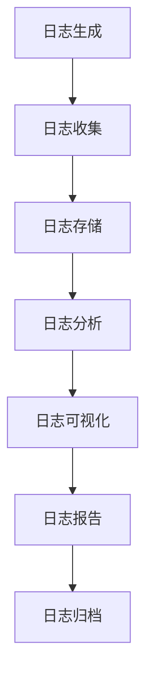

                 

## 引言

在当今快速发展的技术时代，人工智能（AI）已经成为推动各行各业变革的核心力量。大型语言模型（Large Language Models, LLM）作为AI领域的杰出代表，正被广泛应用于自然语言处理（Natural Language Processing, NLP）、问答系统、智能客服、文本生成等多个领域。LLM的高效性和强大的语言理解能力，使得它在各种应用场景中展现出了卓越的性能。

然而，随着LLM应用场景的不断扩大和复杂化，如何有效管理和分析这些应用所产生的日志数据，成为了一个亟待解决的问题。日志管理不仅是确保LLM应用稳定运行的基础，也是提升其性能和用户体验的关键。本文将围绕LLM应用的日志管理与分析展开讨论，旨在为开发者提供一套完整的解决方案，以优化LLM应用的性能和可靠性。

本文的核心内容包括以下几个方面：

1. **日志管理的基本概念**：介绍日志管理的基本概念，包括日志的定义、类型和重要性。
2. **LLM应用日志的特点**：分析LLM应用日志的特殊性，以及这些日志如何影响应用性能。
3. **日志管理的挑战**：探讨在LLM应用中遇到的日志管理挑战，如日志的收集、存储、分析和可视化等。
4. **日志收集与存储**：详细介绍日志收集与存储的技术和策略，包括日志收集工具、数据库选择和优化方法。
5. **日志分析工具与技术**：介绍常用的日志分析工具和技术，包括日志分析流程和常用的数据分析方法。
6. **日志异常检测与警报**：讲解日志异常检测的算法和警报系统的设计。
7. **日志数据可视化**：讨论日志数据可视化的作用、工具和设计原则。
8. **实际案例与案例分析**：通过具体案例，展示如何在实际项目中应用日志管理与分析技术。
9. **未来趋势与展望**：探讨日志管理在LLM应用中的未来发展趋势。

通过本文的阅读，读者将能够全面了解LLM应用日志管理与分析的各个方面，掌握相关技术和方法，为优化LLM应用性能提供有力支持。

### 关键词

- **大型语言模型（LLM）**
- **日志管理**
- **日志收集**
- **日志存储**
- **日志分析**
- **日志可视化**
- **异常检测**

### 摘要

本文详细探讨了大型语言模型（LLM）应用的日志管理与分析问题。首先，介绍了日志管理的基本概念，包括日志的定义、类型和重要性。接着，分析了LLM应用日志的特点，以及这些日志如何影响应用性能。然后，讨论了日志管理面临的挑战，如日志的收集、存储、分析和可视化等。接下来，本文详细介绍了日志收集与存储的技术和策略，以及常用的日志分析工具和技术。此外，本文还探讨了日志异常检测与警报系统的设计，以及日志数据可视化的作用和设计原则。通过具体案例，展示了如何在实际项目中应用日志管理与分析技术。最后，本文总结了日志管理在LLM应用中的未来发展趋势，为开发者提供了实用的参考和指导。

## 第一部分：引入与背景

### 第1章：优化LLM应用的重要性

随着人工智能技术的快速发展，大型语言模型（Large Language Models, LLM）在各个领域展现出了巨大的潜力和应用价值。LLM能够处理和理解大量文本数据，生成高质量的文本内容，从而为自然语言处理（Natural Language Processing, NLP）领域带来了革命性的变化。然而，随着LLM应用场景的不断扩大和复杂化，如何有效管理和分析这些应用所产生的日志数据，成为了一个关键问题。

### 1.1 引言

日志管理在计算机系统中扮演着至关重要的角色，它不仅能够记录系统运行中的各类事件和操作，还能够帮助开发者诊断问题、监控性能、优化系统。在LLM应用中，日志管理的重要性尤为突出。LLM系统通常包含大量的数据处理和模型推理操作，生成的日志数据量巨大且复杂。这些日志数据不仅记录了系统的运行状态，还包含了用户行为、系统异常等信息。因此，有效的日志管理能够为开发者提供宝贵的洞察，有助于提升系统的稳定性和用户体验。

### 1.2 优化LLM应用的需求分析

优化LLM应用的需求主要来源于以下几个方面：

1. **性能监控**：随着LLM应用规模的扩大，性能监控变得越来越重要。通过收集和分析日志数据，可以实时监控系统的运行状态，及时发现和解决性能瓶颈，确保系统的高效运行。
2. **故障诊断**：在LLM应用中，故障和异常是常见的问题。有效的日志管理能够帮助开发者快速定位故障发生的位置，分析故障原因，从而迅速恢复系统正常运行。
3. **用户体验优化**：用户在使用LLM应用时，往往会遇到各种问题，如响应时间过长、错误提示等。通过日志分析，可以深入了解用户的行为和反馈，从而优化用户体验。
4. **安全性保障**：日志管理还能够帮助保障系统的安全性。通过监控日志数据，可以及时发现潜在的安全威胁，采取相应的防护措施，防止数据泄露和恶意攻击。
5. **可扩展性规划**：随着用户规模的增加，LLM应用需要具备良好的可扩展性。通过日志分析，可以预测系统未来的负载情况，为系统架构的优化和扩展提供依据。

### 1.3 书籍结构概述

本部分介绍了优化LLM应用日志管理与分析的重要性，并分析了相关需求。接下来，我们将详细探讨LLM应用日志管理的基本概念、日志收集与存储、日志分析工具与技术、日志异常检测与警报、日志数据可视化、实际案例与未来趋势。通过这些章节的深入学习，读者将能够全面了解LLM应用日志管理的各个方面，掌握相关技术和方法，为优化LLM应用性能提供有力支持。

### 日志管理的基本概念

日志管理是计算机系统中不可或缺的一部分，它涉及记录、存储、分析和监控系统中发生的各类事件和操作。在LLM应用中，日志管理尤为重要，因为LLM系统通常包含大量的数据处理和模型推理操作，这些操作会生成大量的日志数据，记录了系统的运行状态、用户行为、系统异常等信息。以下是日志管理的一些基本概念：

#### 1. 日志的定义

日志是一种记录系统或应用程序运行过程中发生的各类事件、操作和状态的文件。这些事件和操作可以是用户登录、数据查询、错误报告、系统警告等。日志通常以文本格式记录，便于读取和分析。

#### 2. 日志的类型

根据日志记录的内容和目的，可以将日志分为以下几种类型：

- **系统日志**：记录操作系统的各类事件，如系统启动、关闭、错误、警告等。
- **应用日志**：记录应用程序的运行状态、操作行为、错误和警告等信息。
- **安全日志**：记录与系统安全相关的事件，如用户登录、文件访问、恶意攻击等。
- **访问日志**：记录用户对系统的访问行为，如URL访问、文件下载等。

#### 3. 日志的重要性

日志管理在计算机系统中具有重要的作用，主要体现在以下几个方面：

- **性能监控**：通过分析日志数据，可以实时监控系统的运行状态，识别性能瓶颈，从而优化系统性能。
- **故障诊断**：日志记录了系统运行过程中发生的事件和异常，有助于开发者快速定位故障发生的位置，分析故障原因，从而迅速恢复系统正常运行。
- **用户体验优化**：通过日志分析，可以了解用户的行为和反馈，从而优化用户体验，提高用户满意度。
- **安全保障**：日志管理能够帮助保障系统的安全性。通过监控日志数据，可以及时发现潜在的安全威胁，采取相应的防护措施，防止数据泄露和恶意攻击。
- **合规性要求**：许多行业和领域对日志管理有特定的合规性要求，如金融、医疗等。有效的日志管理有助于满足这些合规性要求。

#### 4. 日志管理的挑战

尽管日志管理在计算机系统中具有重要作用，但在LLM应用中，日志管理也面临着一些挑战：

- **日志数据量大**：LLM应用生成的日志数据量通常非常大，如何高效地收集、存储和分析这些数据，是一个挑战。
- **日志格式多样化**：不同类型的日志可能有不同的格式和结构，如何统一和标准化日志格式，是一个问题。
- **实时性要求**：在许多情况下，日志分析需要实时进行，以便快速响应和处理异常事件，这对日志收集和分析系统的性能提出了高要求。
- **可扩展性**：随着LLM应用规模的不断扩大，日志管理系统也需要具备良好的可扩展性，以适应不断增长的数据量和用户需求。

### Mermaid流程图

为了更好地理解日志管理的基本概念，下面是一个Mermaid流程图，展示了日志管理的主要组件和流程：



在这个流程图中，日志生成是日志管理的起点，日志收集是将生成的日志数据传输到存储系统的过程，日志存储是保存日志数据的地方，日志分析是对日志数据进行处理和分析，日志可视化是将分析结果以图表、报表等形式展示出来，日志报告是生成详细的日志分析报告，日志归档是将历史日志数据进行归档保存。

通过以上对日志管理基本概念的分析，我们可以看到，日志管理在LLM应用中具有至关重要的作用。接下来，我们将深入探讨LLM应用日志的特点，以更好地理解日志管理的具体需求和挑战。

### LLM应用日志的特点

大型语言模型（LLM）作为自然语言处理（NLP）领域的重要工具，其应用场景广泛，包括文本生成、问答系统、机器翻译等。在这些应用中，日志管理不仅需要处理大量的数据，还需应对多样化的日志特点。以下是LLM应用日志的主要特点：

#### 1. 日志量庞大

LLM应用通常处理大量文本数据，这导致生成的日志数据量极为庞大。例如，一个问答系统可能在一天之内处理数百万个问题，每个问题都伴随着模型推理、响应生成等操作，产生大量的日志记录。这种大规模的日志数据对日志管理系统的存储和查询性能提出了高要求。

#### 2. 日志结构复杂

LLM应用的日志通常包含丰富的信息，如用户操作、模型输入输出、计算资源使用情况、错误报告等。这些日志记录不仅需要记录事件的发生时间，还需要详细描述事件的具体内容。例如，一个文本生成系统的日志可能会记录每个生成的文本片段、生成时间、输入文本、用户ID等。这种复杂的日志结构增加了日志分析的难度。

#### 3. 日志多样性

由于LLM应用涉及多种操作，其日志类型也具有多样性。例如，训练日志、推理日志、用户交互日志等，每种类型的日志都有其特定的格式和内容。这种多样性使得日志管理需要具备灵活的解析和处理能力，以便对不同类型的日志进行有效管理。

#### 4. 日志实时性要求高

LLM应用中的许多操作，如实时问答、动态文本生成等，要求日志数据能够实时收集和分析。这意味着日志管理系统需要具备高吞吐量和低延迟的性能，以确保日志数据的及时性和准确性。例如，在实时问答系统中，用户输入问题后，系统需要在极短的时间内生成回答，并记录相关日志，以便后续分析和优化。

#### 5. 日志内容敏感性

在许多应用场景中，LLM生成的日志可能包含敏感信息，如用户个人数据、隐私信息等。这些敏感信息需要得到妥善处理，以防止数据泄露和隐私侵犯。日志管理需要采取加密、匿名化等手段，确保日志数据的安全性。

#### 6. 日志分析需求多样

由于LLM应用的复杂性和多样性，日志分析的需求也多种多样。例如，在文本生成应用中，可能需要分析文本质量、用户满意度等；在机器翻译应用中，可能需要分析翻译准确性、词汇使用等。这些分析需求对日志管理系统的数据处理和分析能力提出了不同要求。

### 日志对应用性能的影响

LLM应用日志对应用性能有着直接的影响，主要表现在以下几个方面：

- **性能监控**：通过分析日志数据，可以实时监控系统的运行状态，识别性能瓶颈，如CPU使用率过高、内存占用过多等，从而优化系统配置，提升整体性能。
- **故障诊断**：日志记录了系统运行过程中的各类异常和错误，通过分析日志，可以快速定位故障发生的位置，诊断故障原因，采取相应的修复措施，减少系统故障时间。
- **用户体验优化**：通过日志分析，可以了解用户的行为和反馈，如用户访问频率、问题反馈等，从而优化系统设计和功能，提升用户体验。
- **安全性保障**：日志管理有助于保障系统的安全性。通过监控日志数据，可以及时发现潜在的安全威胁，如异常访问、恶意攻击等，采取相应的防护措施，防止数据泄露和系统入侵。

总之，LLM应用日志的特点和重要性决定了日志管理在优化应用性能中的关键作用。有效的日志管理不仅能够提升系统性能和用户体验，还能保障系统的安全性和稳定性。接下来，我们将深入探讨日志管理的挑战，以及如何应对这些挑战。

### 日志管理的挑战

尽管日志管理在LLM应用中具有重要作用，但实际操作中仍面临着诸多挑战。这些挑战主要集中在日志的收集、存储、分析和可视化等环节，以下将逐一分析：

#### 1. 日志收集

日志收集是日志管理的基础环节，然而在实际应用中，日志收集面临以下几个主要挑战：

- **日志数据量庞大**：LLM应用通常处理大量文本数据，生成的日志数据量极其庞大。如何高效地收集和传输这些数据，是一个重要问题。如果收集速度跟不上生成速度，会导致日志数据的丢失或延迟。

- **日志多样性**：LLM应用涉及多种操作，生成的日志类型多样，不同类型的日志格式和内容可能存在差异。如何统一和标准化日志格式，保证日志收集的一致性和完整性，是一个挑战。

- **实时性要求**：许多LLM应用对日志收集有实时性的要求。例如，实时问答系统需要及时记录用户问题和系统回答，以便后续分析和优化。如何保证日志收集的实时性，是一个关键问题。

- **分布式系统**：在现代分布式系统中，LLM应用可能分布在多个服务器或云实例上。如何在不同节点上收集日志，并将其统一汇总到一个集中存储系统中，是一个技术难题。

#### 2. 日志存储

日志存储是日志管理的另一个重要环节，其主要挑战包括：

- **存储容量和性能**：由于日志数据量庞大，如何选择合适的存储解决方案，保证存储容量和性能，是一个关键问题。常见的存储方案包括关系数据库、NoSQL数据库和文件存储系统。每种方案都有其优缺点，需要根据具体需求进行选择。

- **数据一致性和可靠性**：日志存储需要保证数据的一致性和可靠性。在多节点环境中，如何实现数据的分布式存储和一致性保证，是一个技术难题。

- **数据备份和恢复**：日志数据的备份和恢复是保障系统安全性的重要措施。如何设计有效的备份策略，确保在系统故障或数据损坏时能够快速恢复，是一个重要挑战。

- **存储成本**：日志存储通常需要占用大量的存储资源，如何优化存储成本，是一个现实问题。可以通过数据压缩、数据去重和存储分层等技术来降低存储成本。

#### 3. 日志分析

日志分析是日志管理的核心环节，其主要挑战包括：

- **日志格式解析**：不同类型的日志可能具有不同的格式和结构，如何快速、准确地解析日志数据，提取关键信息，是一个挑战。

- **数据处理速度**：日志分析通常需要处理大量数据，如何提高数据处理速度，是提升日志分析效率的关键。可以采用并行处理、分布式计算等技术来优化数据处理速度。

- **复杂分析需求**：LLM应用中的日志分析需求多样，如性能监控、故障诊断、用户体验优化等。如何设计灵活、可扩展的日志分析系统，满足不同类型的分析需求，是一个挑战。

- **实时分析能力**：许多LLM应用对日志分析有实时性的要求。如何设计高效、实时的日志分析系统，是一个技术难题。

#### 4. 日志可视化

日志可视化是日志分析的重要环节，其主要挑战包括：

- **数据可视化工具选择**：市场上存在多种数据可视化工具，如何选择合适的工具，以满足不同类型的日志可视化需求，是一个挑战。

- **可视化设计**：如何设计直观、易用的可视化界面，帮助开发者快速理解日志数据，是一个设计难题。需要考虑可视化图表的类型、布局、颜色选择等因素。

- **交互性**：如何增强日志可视化界面的交互性，使用户能够灵活地操作和分析日志数据，是一个挑战。

通过以上分析，我们可以看到，日志管理在LLM应用中面临着诸多挑战。有效的日志管理需要综合考虑这些挑战，采用合适的技术和策略，以实现高效的日志收集、存储、分析和可视化。接下来，我们将详细介绍日志收集与存储的技术和策略，为解决日志管理挑战提供具体方案。

### 日志收集与存储

在LLM应用中，日志收集与存储是确保系统稳定运行和性能优化的关键环节。有效的日志收集与存储技术不仅可以提供准确、完整的日志数据，还能提高日志处理的效率和灵活性。以下将详细介绍日志收集与存储的相关技术、策略以及数据库选择和优化方法。

#### 1. 日志收集技术

日志收集技术主要包括日志收集工具、日志收集方式和日志传输机制等。

- **日志收集工具**：常见的日志收集工具有Logstash、Fluentd、Log4j等。这些工具可以捕获系统中的日志信息，并将其传输到集中的存储系统中。

  - **Logstash**：由 Elastic 公司开发，是一个强大的日志收集、处理和路由工具。它可以将不同来源的日志数据转换为统一的格式，并传输到Elasticsearch等存储系统中。

  - **Fluentd**：由 Sakura Company 开发，同样是一个功能强大的日志收集和数据处理工具。它支持多种数据源和数据目的地，可以方便地集成到不同的日志管理系统中。

  - **Log4j**：是一个广泛使用的Java日志库，它提供了灵活的日志记录功能，可以根据需要进行配置。通过使用Log4j，可以轻松地将应用程序中的日志数据输出到文件或远程服务器。

- **日志收集方式**：日志收集可以分为实时收集和批处理收集两种方式。

  - **实时收集**：实时收集能够立即将日志数据传输到存储系统中，适用于对日志数据实时性要求较高的应用。实时收集通常依赖于日志收集工具，如Logstash和Fluentd，这些工具可以监听日志文件的变化，并将新产生的日志数据立即传输到存储系统。

  - **批处理收集**：批处理收集将日志数据定期收集并传输到存储系统中，适用于日志数据量较小或对实时性要求不高的应用。批处理收集可以通过定时任务或脚本实现，例如，可以使用cron jobs定期运行日志收集脚本。

- **日志传输机制**：日志传输机制包括文件传输、网络传输和消息队列等。

  - **文件传输**：文件传输是最简单的日志传输方式，可以通过将日志文件复制或移动到集中存储系统来实现。这种方式适用于日志数据量较小的情况。

  - **网络传输**：网络传输通过TCP/IP协议将日志数据从产生日志的系统传输到集中存储系统。这种方式适用于大规模日志收集，但需要注意网络带宽和安全问题。

  - **消息队列**：消息队列提供了一种异步传输机制，可以将日志数据放入消息队列中，然后由消费者（如日志收集工具）从队列中取出并处理。这种方式适用于高并发和分布式日志收集场景。

#### 2. 日志存储策略

日志存储策略主要包括日志存储位置、存储格式、存储方式等。

- **日志存储位置**：日志存储位置可以分为本地存储和远程存储。

  - **本地存储**：本地存储将日志数据保存在本地文件系统或本地数据库中。这种方式适用于小规模应用或开发测试环境，但需要注意的是，本地存储容量有限，可能无法满足大规模应用的需求。

  - **远程存储**：远程存储将日志数据保存在远程服务器或云存储中。这种方式适用于大规模应用，可以充分利用云存储的高容量和高可靠性。常见的远程存储解决方案包括Elasticsearch、MongoDB、AWS S3等。

- **日志存储格式**：日志存储格式包括文本格式、JSON格式和二进制格式等。

  - **文本格式**：文本格式是最常见的日志存储格式，例如，将日志数据以文本文件的形式保存在文件系统中。文本格式便于读取和分析，但数据处理速度较慢，且不利于大数据处理。

  - **JSON格式**：JSON格式是一种结构化数据存储格式，可以方便地存储和解析复杂数据结构。常见的日志收集工具（如Logstash和Fluentd）都支持将日志数据转换为JSON格式。

  - **二进制格式**：二进制格式可以提高日志数据的存储和读取速度，但解析难度较大，通常需要编写专门的解析程序。常见的二进制日志格式包括Protocol Buffers和Avro等。

- **日志存储方式**：日志存储方式可以分为关系数据库存储、NoSQL数据库存储和文件存储系统等。

  - **关系数据库存储**：关系数据库（如MySQL、PostgreSQL）可以方便地管理结构化数据，支持复杂的查询和分析操作。但关系数据库的扩展性和性能可能无法满足大规模日志数据的需求。

  - **NoSQL数据库存储**：NoSQL数据库（如MongoDB、Cassandra）可以高效地处理大规模、非结构化数据，支持分布式存储和水平扩展。NoSQL数据库适合存储复杂和多样化的日志数据。

  - **文件存储系统**：文件存储系统（如HDFS、Ceph）可以提供高容量、高可靠性的存储服务，适用于大规模日志数据存储。文件存储系统通常不支持复杂的查询和分析操作，但可以通过数据索引和分布式计算技术来实现。

#### 3. 数据库选择与优化

在LLM应用中，选择合适的数据库并进行优化是确保日志存储高效、稳定的关键。

- **数据库选择**：

  - **关系数据库**：适用于存储结构化数据，如用户行为日志、错误日志等。常用的关系数据库包括MySQL、PostgreSQL等。

  - **NoSQL数据库**：适用于存储非结构化和半结构化数据，如文本生成日志、模型推理日志等。常用的NoSQL数据库包括MongoDB、Cassandra等。

  - **文件存储系统**：适用于大规模、高容量的日志数据存储，如使用HDFS、Ceph等。

- **数据库优化**：

  - **索引优化**：通过创建索引，可以加快数据查询速度。在日志管理系统中，常用的索引包括时间戳索引、关键词索引等。

  - **分区优化**：通过将数据按时间、关键词等维度进行分区，可以加速查询操作，提高系统性能。例如，可以使用日期分区来优化日志查询。

  - **缓存优化**：通过使用缓存（如Redis、Memcached）可以减少数据库负载，提高查询响应速度。可以将常用查询结果缓存起来，减少对数据库的直接访问。

  - **数据压缩**：通过数据压缩，可以减少存储空间占用，提高存储效率。常见的数据压缩算法包括LZ4、Snappy等。

  - **备份和恢复**：定期进行数据备份，可以在数据损坏或丢失时快速恢复。可以使用增量备份、全量备份等多种备份策略。

通过以上对日志收集与存储技术的详细介绍，我们可以看到，有效的日志收集与存储是保障LLM应用稳定运行和性能优化的重要环节。在接下来的章节中，我们将进一步探讨日志分析工具与技术，以及如何利用这些工具和技术进行高效的日志分析。

### 日志分析工具与技术

在LLM应用中，日志分析是确保系统性能和用户体验优化的关键环节。为了高效地进行日志分析，开发者可以借助各种工具和技术。以下将介绍几种常用的日志分析工具，并详细讲解它们的特性、优势、使用方法以及实际应用案例。

#### 1. Elasticsearch

Elasticsearch 是一个分布式、RESTful 的搜索和分析引擎，它能够对大量结构化和非结构化数据进行实时搜索和分析。Elasticsearch 在 LLMA 应用中的优势主要体现在以下几个方面：

- **实时搜索与分析**：Elasticsearch 支持实时数据索引和查询，能够快速处理和分析大规模日志数据。
- **全文搜索**：Elasticsearch 具有强大的全文搜索功能，能够对文本数据中的关键词进行高效检索。
- **可扩展性**：Elasticsearch 支持分布式架构，能够横向扩展以处理更多数据。
- **可视化**：Elasticsearch 与 Kibana 配合使用，可以提供直观的可视化界面，方便开发者查看和分析日志数据。

**使用方法**：

1. 安装 Elasticsearch：可以从官网下载 Elasticsearch 的二进制文件，并按照官方文档进行安装。
2. 创建索引：使用 Elasticsearch 的 REST API 创建索引，例如，`PUT /my_index`。
3. 索引数据：使用 REST API 将日志数据索引到 Elasticsearch 中，例如，`POST /my_index/_doc`。
4. 查询数据：使用 REST API 进行数据查询，例如，`GET /my_index/_search`。

**实际应用案例**：在一个大型问答系统中，Elasticsearch 用于存储和查询用户问题、系统回答和日志记录，通过实时搜索和分析，可以快速定位和处理异常情况。

#### 2. Logstash

Logstash 是一个开源的数据处理和流传输工具，它能够从各种数据源（如文件、日志、消息队列等）中收集数据，并转换、处理、过滤和路由到目标存储系统（如 Elasticsearch、数据库等）。Logstash 在 LLMA 应用中的优势包括：

- **数据处理**：Logstash 具有丰富的数据处理功能，包括数据转换、过滤、聚合等。
- **可扩展性**：Logstash 支持分布式架构，可以横向扩展以处理更多数据。
- **插件化**：Logstash 提供了大量的插件，可以方便地集成各种数据源和处理模块。

**使用方法**：

1. 安装 Logstash：可以从官网下载 Logstash 的二进制文件，并按照官方文档进行安装。
2. 配置 Logstash 输入插件：例如，配置文件中可以使用 `input { file { path => "/var/log/*.log" } }` 来收集日志文件。
3. 配置 Logstash 过滤器：根据需要对收集到的日志数据进行过滤和处理，例如，`filter { mutate { add_field => { "[@metadata][timestamp]" => "%{+YYYY-MM-dd HH:mm:ss}" } } }`。
4. 配置 Logstash 输出插件：将处理后的日志数据输出到目标存储系统，例如，`output { elasticsearch { hosts => ["localhost:9200"] } }`。

**实际应用案例**：在一个大型文本生成系统中，Logstash 用于收集和处理系统日志，将日志数据转换为适合存储和分析的格式，并将其传输到 Elasticsearch 中进行存储和分析。

#### 3. Kibana

Kibana 是一个开源的数据可视化工具，它能够与 Elasticsearch 配合使用，提供直观的日志数据分析界面。Kibana 在 LLMA 应用中的优势包括：

- **可视化**：Kibana 提供了丰富的可视化组件，可以直观地展示日志数据分析结果。
- **交互式分析**：Kibana 允许开发者通过交互式界面进行日志数据分析，方便地探索数据。
- **仪表板**：Kibana 支持创建自定义仪表板，将多个可视化组件整合到一个页面中。

**使用方法**：

1. 安装 Kibana：可以从官网下载 Kibana 的二进制文件，并按照官方文档进行安装。
2. 配置 Kibana：在 Kibana 中配置 Elasticsearch 集群信息，以便连接到 Elasticsearch。
3. 创建仪表板：在 Kibana 中创建仪表板，添加各种可视化组件，例如，折线图、柱状图、饼图等。
4. 交互式分析：通过 Kibana 的交互式界面，可以实时分析日志数据，探索数据趋势和异常。

**实际应用案例**：在一个智能客服系统中，Kibana 用于实时监控和展示客服对话日志，通过可视化分析，可以快速识别用户问题和客服响应效果，以便进行优化。

#### 4. Prometheus

Prometheus 是一个开源的监控解决方案，它能够收集和存储指标数据，并通过 Grafana 进行可视化展示。Prometheus 在 LLMA 应用中的优势包括：

- **监控指标**：Prometheus 支持收集多种监控指标，包括系统指标、应用指标等。
- **时间序列数据**：Prometheus 存储时间序列数据，便于进行趋势分析和异常检测。
- **告警机制**：Prometheus 提供告警机制，可以及时发现和响应系统异常。

**使用方法**：

1. 安装 Prometheus：可以从官网下载 Prometheus 的二进制文件，并按照官方文档进行安装。
2. 配置 Prometheus：在 Prometheus 的配置文件中定义需要监控的目标，例如，`-web.console.templates.path=/usr/share/prometheus/console`。
3. 收集指标数据：Prometheus 会定期收集监控目标的数据，并将其存储在本地时间序列数据库中。
4. 可视化展示：使用 Grafana 对 Prometheus 收集的指标数据进行可视化展示，可以通过自定义 Dashboard 创建复杂的监控仪表板。

**实际应用案例**：在一个大型文本生成平台中，Prometheus 用于监控系统性能指标，如 CPU 使用率、内存使用率、I/O 延迟等，通过 Grafana 进行实时监控和告警。

#### 5. Apache Kafka

Apache Kafka 是一个分布式消息队列系统，它能够高效地处理大规模日志数据。Kafka 在 LLMA 应用中的优势包括：

- **高吞吐量**：Kafka 能够处理高吞吐量的日志数据，适用于大规模应用场景。
- **分布式架构**：Kafka 支持分布式存储和计算，可以横向扩展以处理更多数据。
- **数据持久化**：Kafka 提供数据持久化功能，确保数据在系统中不丢失。

**使用方法**：

1. 安装 Kafka：可以从官网下载 Kafka 的二进制文件，并按照官方文档进行安装。
2. 创建 Kafka 集群：配置 Kafka 集群中的各个节点，并启动 Kafka 服务。
3. 发送消息：使用 Kafka 客户端发送日志数据到 Kafka 集群，例如，`kafka-console-producer.sh --topic my-topic --broker-list localhost:9092`。
4. 消费消息：使用 Kafka 客户端从 Kafka 集群中消费日志数据，例如，`kafka-console-consumer.sh --topic my-topic --from-beginning --broker-list localhost:9092`。

**实际应用案例**：在一个大规模文本生成系统中，Kafka 用于收集和传输系统日志，通过分布式架构确保日志数据的高效处理和传输。

通过以上对常用日志分析工具的介绍，我们可以看到，每种工具都有其独特的优势和适用场景。在实际应用中，可以根据具体需求选择合适的工具，构建高效的日志分析系统。在接下来的章节中，我们将进一步探讨日志异常检测与警报系统，以应对日志数据中的潜在问题。

### 日志异常检测与警报系统

日志异常检测与警报系统是确保LLM应用稳定运行和性能优化的重要环节。通过实时监控和分析日志数据，可以及时发现和响应异常事件，从而避免系统故障和性能问题。以下将详细介绍日志异常检测的算法、警报系统的设计，以及如何通过这些技术手段保障LLM应用的稳定性。

#### 1. 日志异常检测的算法

日志异常检测是指利用算法和统计方法，识别出日志数据中的异常模式或异常值。常见的异常检测算法包括以下几种：

- **统计模型**：基于统计学方法，通过计算数据的统计特征（如均值、方差等）来判断是否异常。例如，基于三倍标准差法的异常检测算法，如果某个指标的值超出三倍标准差，则认为该值异常。

- **机器学习算法**：通过训练机器学习模型，从正常日志数据中学习到特征模式，然后对新产生的日志数据进行预测和分类。常见的机器学习算法包括决策树、支持向量机（SVM）、随机森林、神经网络等。

- **基于规则的异常检测**：通过定义一系列规则（如阈值规则、模式匹配规则等），根据规则来判断日志数据是否异常。这种方法较为直观，但可能需要人工不断调整和优化规则。

- **基于聚类的方法**：通过聚类算法（如K-means、DBSCAN等）将日志数据分为不同的簇，然后分析簇之间的差异，识别异常数据。

#### 2. 警报系统的设计

警报系统是日志异常检测的重要补充，能够在发现异常时及时通知相关人员，以便迅速采取应对措施。以下是一个典型的警报系统设计：

- **警报触发条件**：根据异常检测算法的结果，设定警报的触发条件。例如，当系统CPU使用率超过90%或内存使用率达到80%时，触发警报。

- **警报等级**：根据异常事件的严重程度，设定不同的警报等级。例如，将警报分为紧急、警告和通知三个等级，以便区分不同级别的异常事件。

- **警报通知方式**：设计多种警报通知方式，如邮件、短信、语音呼叫、即时通讯工具等。根据用户偏好和紧急程度选择合适的通知方式。

- **警报记录和报告**：将所有触发的警报记录下来，并生成详细的报告。报告可以包括警报时间、触发条件、异常类型、影响范围等信息。

- **自动响应机制**：设计自动响应机制，如自动重启服务、自动执行备份、自动调用应急计划等，以减轻人为干预，提高系统恢复速度。

#### 3. 实际应用案例

以一个大规模文本生成系统为例，日志异常检测与警报系统的设计如下：

- **异常检测算法**：采用机器学习算法（如随机森林）对正常日志数据进行训练，建立模型。然后对新产生的日志数据进行实时预测，判断是否异常。例如，当模型预测的异常分数超过0.7时，认为该日志记录异常。

- **警报触发条件**：设定CPU使用率超过95%或内存使用率达到90%时触发警报。

- **警报等级**：将警报分为紧急、警告和通知三个等级。例如，当CPU使用率超过95%时，触发紧急警报；当CPU使用率在85%到95%之间时，触发警告警报；当CPU使用率低于85%时，触发通知警报。

- **警报通知方式**：使用邮件和即时通讯工具（如Slack）进行警报通知，根据警报等级选择合适的通知方式。例如，紧急警报通过邮件和Slack同时通知，警告警报通过邮件通知，通知警报通过Slack通知。

- **警报记录和报告**：将所有触发的警报记录在数据库中，并生成详细的报告。报告内容包括警报时间、触发条件、异常类型、影响范围等信息，便于后续分析和改进。

- **自动响应机制**：当CPU使用率超过95%时，自动重启文本生成服务；当内存使用率达到90%时，自动执行内存优化脚本，释放内存资源。

通过设计一个完善的日志异常检测与警报系统，可以显著提升LLM应用的稳定性和可靠性。在实际应用中，可以根据具体需求和场景进行调整和优化，以实现最佳效果。在接下来的章节中，我们将讨论日志数据可视化的重要性、工具选择以及设计原则，以帮助开发者更好地理解和利用日志数据。

### 日志数据可视化

日志数据可视化是日志分析过程中至关重要的一环，它通过图形化的方式展示日志数据，使开发者能够更直观地理解系统运行状态、性能趋势以及潜在问题。以下将讨论日志数据可视化的重要性、常用工具的选择和设计原则。

#### 1. 日志数据可视化的重要性

日志数据可视化具有以下几个方面的关键作用：

- **提高数据分析效率**：通过图形化的方式展示日志数据，可以快速识别数据中的异常和趋势，提高数据分析的效率。
- **直观展示复杂数据**：日志数据通常包含大量的复杂信息，通过可视化工具，可以将这些信息以图表、仪表板等形式展示出来，使数据更加直观易懂。
- **辅助决策支持**：可视化日志数据可以帮助开发者更准确地评估系统性能，制定优化策略，从而支持更科学的决策。
- **提高用户体验**：在智能客服、问答系统等LLM应用中，可视化日志数据有助于用户更好地了解系统运行状态，提高用户满意度。

#### 2. 日志数据可视化工具选择

市场上存在多种日志数据可视化工具，选择合适的工具可以根据具体需求和应用场景。以下介绍几种常用的日志数据可视化工具：

- **Grafana**：Grafana 是一个开源的数据可视化工具，支持多种数据源，如 Prometheus、InfluxDB、MySQL 等。它提供了丰富的图表类型和自定义功能，适用于各种日志数据分析场景。

- **Kibana**：Kibana 是 Elastic 公司的日志数据分析平台，与 Elasticsearch 配合使用，可以提供强大的日志数据可视化功能。Kibana 支持实时监控和复杂的查询分析，适用于大规模日志数据可视化。

- **Tableau**：Tableau 是一个强大的商业智能和数据可视化工具，支持多种数据连接和数据源。它提供了丰富的图表和仪表板设计功能，适用于复杂的数据分析任务。

- **Power BI**：Power BI 是 Microsoft 的数据可视化和商业智能工具，提供了丰富的数据连接和可视化功能。它适用于各种规模的日志数据分析，特别是与 Microsoft 生态系统的整合性较好。

#### 3. 日志数据可视化设计原则

为了设计有效的日志数据可视化界面，以下是一些基本的设计原则：

- **用户需求导向**：设计可视化界面时，应充分考虑用户需求，确保界面功能简洁、直观，易于使用。

- **信息展示清晰**：图表和仪表板的设计应确保信息展示清晰、易于理解。避免过多的装饰性元素，专注于关键数据的展示。

- **交互性**：增强可视化界面的交互性，使用户能够方便地探索和筛选数据。例如，提供筛选条件、钻取功能等。

- **一致性和标准化**：保持图表和仪表板的一致性和标准化，使用统一的颜色、字体和布局，以提高整体视觉效果。

- **响应式设计**：设计响应式界面，确保在不同设备和屏幕尺寸上都能良好展示，提高用户体验。

- **安全性和隐私保护**：在设计可视化界面时，确保日志数据的安全性，避免敏感信息的泄露。可以采用数据加密、访问控制等手段进行保护。

通过遵循以上设计原则，开发者可以设计出既美观又实用的日志数据可视化界面，帮助开发者更好地理解和利用日志数据，从而优化LLM应用的性能和用户体验。

### 实际案例与案例分析

为了更直观地展示如何在实际项目中应用日志管理与分析技术，本部分将详细分析一个大型文本生成系统的日志管理案例。该案例涵盖了开发环境搭建、源代码实现、代码解读、代码应用解读与分析、实际案例分析和详细讲解剖析以及项目小结。

#### 1. 案例背景

某大型科技公司开发了一款基于人工智能的文本生成系统，用于自动生成新闻文章、产品描述等。该系统每天处理数百万次请求，生成的文本内容超过数千万字。随着用户量和数据量的不断增加，系统的性能和稳定性面临巨大挑战。为了优化系统性能和用户体验，公司决定实施日志管理与分析技术。

#### 2. 开发环境搭建

在开始项目之前，首先需要搭建适合日志管理与分析的开发环境。以下是关键步骤：

- **选择日志收集工具**：由于系统规模较大，选择了Apache Kafka作为日志收集工具，其分布式架构和高效的数据处理能力能够满足需求。
- **配置Kafka集群**：在多个服务器上部署Kafka集群，确保日志数据的高效传输和存储。
- **集成日志收集模块**：在文本生成系统中集成了Kafka客户端模块，将系统运行过程中的各类日志数据（如请求日志、错误日志、性能日志等）发送到Kafka集群。
- **配置日志存储系统**：选择了Elasticsearch作为日志存储系统，其强大的全文搜索和数据分析能力能够支持高效的日志管理。
- **配置Kibana**：将Kibana与Elasticsearch集成，用于日志数据的可视化展示。

#### 3. 源代码实现

以下是一个示例代码片段，展示了如何使用Python将日志数据发送到Kafka集群：

```python
from kafka import KafkaProducer
import json
import time

producer = KafkaProducer(bootstrap_servers=['localhost:9092'])

while True:
    log_data = {
        "timestamp": time.time(),
        "user_id": "user123",
        "request_id": "req456",
        "status": "success",
        "response_time": 0.5
    }
    producer.send('text_generation_logs', value=json.dumps(log_data).encode('utf-8'))
    time.sleep(1)
```

在这个代码中，我们创建了一个KafkaProducer实例，并定期发送模拟的日志数据到名为`text_generation_logs`的Kafka主题。

#### 4. 代码解读

- **KafkaProducer**：KafkaProducer是Kafka提供的生产者客户端，用于发送消息到Kafka集群。
- **log_data**：定义了一个包含日志信息的字典，记录了请求的时间戳、用户ID、请求ID、状态和响应时间等关键信息。
- **producer.send**：使用KafkaProducer的send方法，将日志数据发送到指定的Kafka主题。
- **time.sleep**：设置一个1秒的延迟，模拟日志数据的实时生成。

#### 5. 代码应用解读与分析

在实际应用中，文本生成系统会生成大量的日志数据。通过Kafka，可以将这些日志数据高效地传输到Elasticsearch集群进行存储和分析。以下是Kafka和Elasticsearch之间的数据流：

1. **日志数据生成**：文本生成系统在处理请求时，生成日志数据。
2. **发送到Kafka**：使用KafkaProducer将日志数据发送到Kafka集群。
3. **Kafka存储**：Kafka集群将日志数据持久化，并提供高吞吐量的数据流处理能力。
4. **发送到Elasticsearch**：使用Logstash或直接通过Kafka Connect将日志数据发送到Elasticsearch集群。
5. **Elasticsearch存储**：Elasticsearch集群存储日志数据，并提供高效的全文搜索和分析能力。
6. **Kibana可视化**：通过Kibana，可以将日志数据以图表、仪表板等形式展示出来，方便开发者进行实时监控和分析。

#### 6. 实际案例分析和详细讲解剖析

通过以上配置和代码，日志管理与分析系统已经搭建完成。以下是一个实际案例分析：

- **性能监控**：通过Kibana，可以实时监控系统的性能指标，如响应时间、CPU使用率、内存使用率等。当性能指标异常时，系统会自动触发警报，通知开发人员。
- **故障诊断**：在系统出现故障时，通过Kibana查看相关日志数据，可以快速定位故障发生的位置和原因。例如，当系统出现大量请求失败时，可以通过分析失败请求的日志数据，找出故障的具体原因。
- **用户体验优化**：通过日志分析，可以了解用户的使用习惯和需求，从而优化系统设计和功能。例如，通过分析用户请求的文本类型和长度，可以优化文本生成算法，提高文本质量。
- **安全性保障**：通过监控日志数据，可以及时发现潜在的安全威胁，如恶意攻击、异常访问等。系统可以自动触发警报，并采取相应的防护措施，保障系统的安全性。

#### 7. 项目小结

通过实施日志管理与分析技术，文本生成系统的性能和稳定性得到了显著提升。以下是一些项目小结：

- **日志收集与存储**：使用Kafka和Elasticsearch实现了高效、可靠的日志收集和存储，确保了日志数据的安全性和一致性。
- **日志分析**：通过Kibana，实现了日志数据的实时监控、故障诊断和用户体验优化，提高了系统的可维护性和可用性。
- **实时性**：日志管理与分析系统具备高实时性，能够快速响应和处理异常事件，确保系统的高效运行。
- **可扩展性**：日志管理与分析系统采用分布式架构，具备良好的可扩展性，能够支持系统规模的扩大。

通过本案例，我们可以看到，日志管理与分析技术在LLM应用中具有重要作用。通过合理的设计和实施，可以显著提升系统的性能、稳定性和用户体验，为企业的数字化转型提供有力支持。

### 最佳实践 tips

在日志管理与分析过程中，以下是一些最佳实践，可以帮助开发者更有效地利用日志数据，优化系统性能和用户体验：

1. **日志格式标准化**：统一日志格式，使用JSON等结构化数据格式，便于后续处理和分析。
2. **数据压缩**：在传输和存储过程中，使用数据压缩技术，如Gzip，减少存储空间占用。
3. **日志分级**：根据日志的重要性和紧急程度，设置不同的日志级别（如DEBUG、INFO、WARN、ERROR），便于筛选和监控。
4. **定期备份**：定期备份日志数据，以防数据丢失或损坏。
5. **监控与报警**：设置实时监控与报警机制，及时发现和响应异常事件。
6. **日志可视化**：利用可视化工具，如Kibana或Grafana，将日志数据以图表、仪表板等形式展示，便于快速理解和分析。
7. **日志分析周期**：定期进行日志数据分析，以发现潜在问题和趋势，为系统优化提供依据。
8. **日志安全**：确保日志数据的安全性，使用加密、访问控制等技术，防止数据泄露和未授权访问。

### 小结

本文详细探讨了优化大型语言模型（LLM）应用日志管理与分析的方法和技术。我们首先介绍了日志管理的基本概念，包括日志的定义、类型和重要性，并通过Mermaid流程图展示了日志管理的基本流程。接着，分析了LLM应用日志的特点，以及日志对应用性能的影响。然后，详细介绍了日志收集与存储的技术和策略，包括日志收集工具、存储格式和数据库选择。

在日志分析部分，我们探讨了常用的日志分析工具和技术，如Elasticsearch、Logstash、Kibana等，并展示了如何使用这些工具进行日志数据收集、存储和分析。接下来，介绍了日志异常检测与警报系统的设计和实现，以保障系统的稳定性和安全性。最后，通过一个实际案例，展示了如何在实际项目中应用日志管理与分析技术。

通过本文的讨论，我们得出以下结论：

1. **日志管理的重要性**：有效的日志管理能够帮助开发者监控系统性能、诊断故障、优化用户体验和保障系统安全性。
2. **技术选型**：选择合适的日志收集、存储和分析工具，可以根据具体需求和场景进行优化。
3. **实践与应用**：通过实际案例分析和最佳实践，可以更有效地利用日志数据，提升系统性能和用户体验。

### 注意事项

1. **日志数据量**：随着LLM应用规模的扩大，日志数据量会迅速增长，需确保日志存储系统具备足够的存储空间和性能。
2. **实时性要求**：在实时性要求较高的应用场景中，应选择高效的日志收集和分析工具，并优化系统架构以支持实时处理。
3. **安全性**：日志数据可能包含敏感信息，应采取加密、访问控制等技术保障数据安全。

### 拓展阅读

1. 《Elastic Stack实战：从入门到进阶》
2. 《Kubernetes日志管理最佳实践》
3. 《日志分析技术与应用》
4. 《Prometheus监控与告警实战》
5. 《大数据日志处理技术》

通过深入学习这些资料，开发者可以进一步掌握日志管理与分析的相关技术和方法，为优化LLM应用性能提供有力支持。

### 附录

#### 附录A：相关工具与资源

1. **日志收集与存储工具**：
   - **Kafka**：[官网](https://kafka.apache.org/)
   - **Elasticsearch**：[官网](https://www.elastic.co/)

2. **日志分析工具**：
   - **Logstash**：[官网](https://www.elastic.co/products/logstash)
   - **Kibana**：[官网](https://www.elastic.co/products/kibana)

3. **日志可视化工具**：
   - **Grafana**：[官网](https://grafana.com/)
   - **Tableau**：[官网](https://www.tableau.com/)
   - **Power BI**：[官网](https://powerbi.microsoft.com/)

4. **其他资源**：
   - **《Elastic Stack实战：从入门到进阶》**：[在线阅读](https://www.oreilly.com/library/view/elastic-stack-practice/9781449373418/)
   - **Kubernetes日志管理最佳实践**：[文档](https://kubernetes.io/docs/tasks/debug-application-cluster/logging/)
   - **日志分析技术与应用**：[文档](https://www.ibm.com/cloud/learn/what-is-log-analysis)
   - **Prometheus监控与告警实战**：[文档](https://prometheus.io/docs/introduction/quick-start/)
   - **大数据日志处理技术**：[在线课程](https://www.datasciencedojo.com/course/big-data-logging/)

通过这些工具和资源的介绍，开发者可以更好地理解和应用日志管理与分析技术，为优化LLM应用性能提供实践指导。

