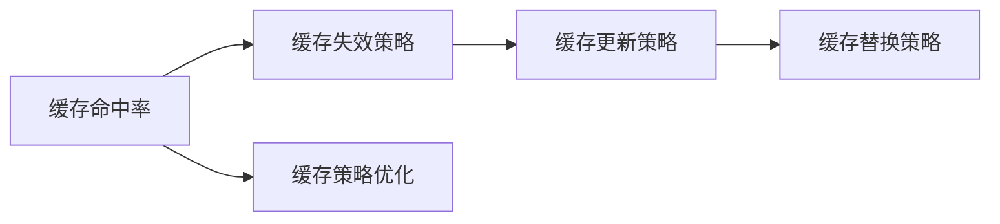
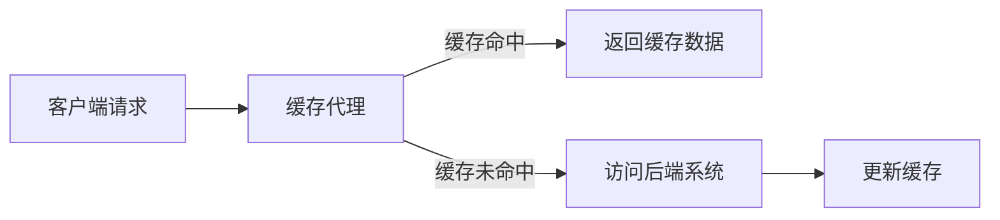

                 

**文章标题**: 优化LLM应用的缓存策略设计

**关键词**: 缓存策略，大型语言模型，性能优化，算法分析，系统设计

**摘要**:
本文深入探讨了优化大型语言模型（LLM）应用缓存策略的设计。通过分析缓存的基础概念、缓存策略的分类与优化方法，本文详细介绍了缓存系统的设计与实现，并通过实际案例展示了如何有效利用缓存策略提升LLM应用的性能。本文旨在为开发者提供系统化的缓存策略设计思路，以实现高效的LLM应用开发。

---

**第1章：缓存策略设计基础**

**1.1 缓存策略概述**

1.1.1 缓存的作用

缓存技术旨在通过存储和快速访问频繁使用的数据，来减少对后端存储系统的访问压力，提高系统的响应速度和效率。对于大型语言模型（LLM）应用来说，缓存策略尤为重要，因为它能够显著减少模型预测的计算负担，提升系统的整体性能。

在LLM应用中，缓存的作用主要表现在以下几个方面：

- **减少计算负担**：通过缓存预先计算的结果，可以避免重复计算，从而减少计算资源的消耗。
- **降低延迟**：对于频繁请求的数据，缓存能够提供几乎即时的响应，显著降低系统的延迟。
- **提高吞吐量**：缓存系统可以处理大量读操作，减轻后端服务的负载，提高系统的吞吐量。

1.1.2 缓存策略的分类

缓存策略可以根据不同的维度进行分类，主要包括以下几种类型：

- **本地缓存**：在应用程序的本地内存或磁盘空间中存储数据，如Python中的字典对象。
- **分布式缓存**：在多个服务器之间共享和存储数据，如Redis、Memcached等。
- **智能缓存**：利用机器学习和数据挖掘技术来优化缓存策略，如基于访问频率的缓存管理。

**1.2 缓存策略的核心概念与联系**

为了更好地理解缓存策略的设计，我们需要明确以下几个核心概念及其相互关系：

1. **缓存命中率**：缓存命中率是衡量缓存策略有效性的重要指标，表示缓存中命中请求的次数与总请求次数之比。缓存命中率越高，说明缓存策略越好。

2. **缓存失效策略**：缓存失效策略决定了缓存中的数据在何时被删除或替换。常见的失效策略包括定时过期、最少使用（LRU）、最不经常使用（LFU）等。

3. **缓存更新策略**：缓存更新策略涉及如何保持缓存数据与后端数据的一致性。常见的更新策略包括写回（Write-Through）和写缓存（Write-Back）。

4. **缓存替换策略**：当缓存空间不足时，需要根据某种规则替换旧数据。常见的替换策略包括最近最少使用（LRU）、最少访问（FAIR）等。

以下是一个描述缓存策略核心概念之间关系的Mermaid流程图：

**1.3 缓存策略优化方法**

优化缓存策略的关键在于提高缓存命中率，降低缓存失效率和替换成本。以下是一些常见的优化方法：

1. **预加载**：根据历史访问模式，将预测会访问的热数据提前加载到缓存中，减少冷启动时间。

2. **缓存压缩**：通过压缩技术减少缓存数据的大小，提高缓存存储空间的使用效率。

3. **缓存一致性**：确保缓存数据和后端数据的一致性，避免数据不一致导致的问题。

4. **缓存分区**：将缓存数据划分为多个分区，提高缓存的并发访问能力。

5. **智能缓存**：利用机器学习算法预测数据的访问模式，动态调整缓存策略。

**1.4 缓存系统的设计与实现**

1.4.1 缓存系统的架构

一个典型的缓存系统通常包括以下几个关键组件：

- **缓存存储**：用于存储缓存数据，可以是内存、磁盘或分布式存储。
- **缓存管理器**：负责缓存数据的添加、删除、更新和替换。
- **缓存代理**：用于处理客户端请求，缓存命中时直接返回缓存数据。

以下是一个描述缓存系统架构的Mermaid流程图：

1.4.2 缓存系统的优化

为了提升缓存系统的性能，可以从以下几个方面进行优化：

- **数据结构选择**：选择适合的数据结构，如LRU、LFU等，以优化缓存替换策略。
- **缓存预热**：提前加载热门数据到缓存中，减少实际请求的响应时间。
- **缓存压缩**：采用合适的压缩算法，减少缓存数据的大小，提高缓存容量。
- **负载均衡**：合理分配缓存请求，避免单点瓶颈。

**1.5 缓存系统性能分析**

缓存系统的性能分析主要包括以下几个方面：

- **响应时间**：缓存请求的处理时间，是衡量缓存系统性能的重要指标。
- **吞吐量**：单位时间内系统处理的请求数量。
- **缓存命中率**：缓存中命中请求的次数与总请求次数之比。

**1.6 缓存系统部署与运维**

1.6.1 环境配置

- **硬件选择**：选择高性能、低延迟的硬件设备。
- **网络优化**：优化网络架构，确保缓存系统和后端系统的低延迟和高带宽。

1.6.2 负载均衡

- **分布式缓存**：采用分布式缓存架构，实现缓存系统的高可用性和扩展性。
- **负载均衡器**：使用负载均衡器，如Nginx、HAProxy等，合理分配请求。

1.6.3 监控与告警

- **性能监控**：实时监控缓存系统的性能指标，如响应时间、缓存命中率等。
- **告警系统**：设置告警阈值，及时发现和处理系统异常。

**1.7 缓存系统案例分析**

为了更好地理解缓存策略在实际应用中的作用，本节将通过几个实际案例，展示如何设计和优化缓存系统：

- **案例一**：电商平台商品缓存策略设计。
- **案例二**：社交媒体缓存策略优化。
- **案例三**：游戏服务器缓存策略应用。

**附录：相关资料与工具**

- **参考资料**：
  - 《Redis实战》
  - 《Varnish缓存实战》
  - 《缓存系统设计与优化》

- **工具推荐**：
  - Redis
  - Memcached
  - Varnish
  - Nginx

- **学习资源**：
  - Coursera上的《缓存技术》课程
  - Udemy上的《缓存策略与系统优化》课程
  - Stack Overflow、Reddit等社区中的缓存技术讨论

---

**作者**: AI天才研究院/AI Genius Institute & 禅与计算机程序设计艺术 /Zen And The Art of Computer Programming**

